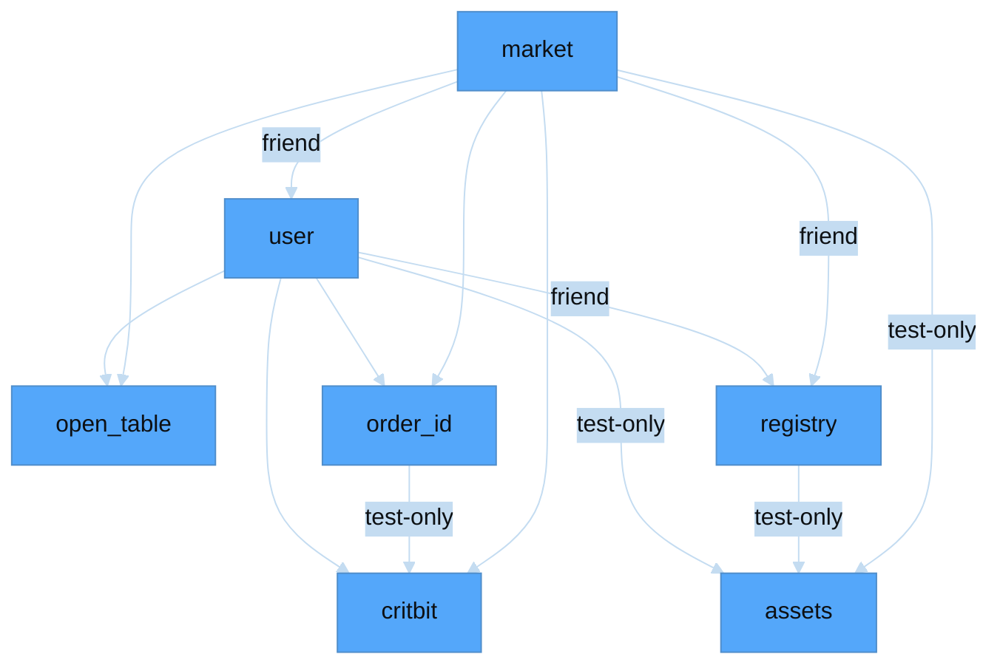
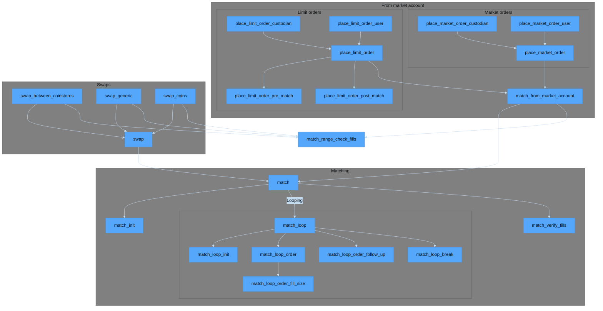
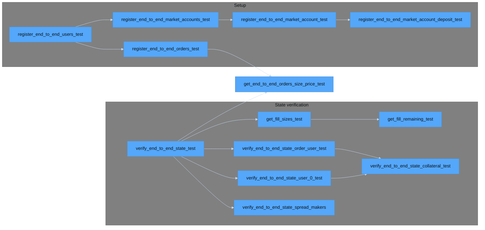

# `mermaid.js` diagram source

- [`mermaid.js` diagram source](#mermaidjs-diagram-source)
  - [General](#general)
  - [Modules](#modules)
  - [Matching engine](#matching-engine)
  - [Matching engine test functions](#matching-engine-test-functions)

## General

* The below diagrams are generated declaratively via `mermaid.js`, and may present occasional rendering artifacts.

* Most tutorials online present an `%%{init:}` directive on a single line, despite excessive line length.

* The [modules](#modules) diagram theme is matched to GitHub's color schema.

* Recommended disclaimer
    * (If accessing the below diagram via GitBook, you may need to switch web browsers to view an enlarged version, which can be pulled up by clicking on the image.)

* `SVG` diagrams can be generated via [mermaid.live](https://mermaid.live/)

## Modules

## Matching engine

## Matching engine test functions

