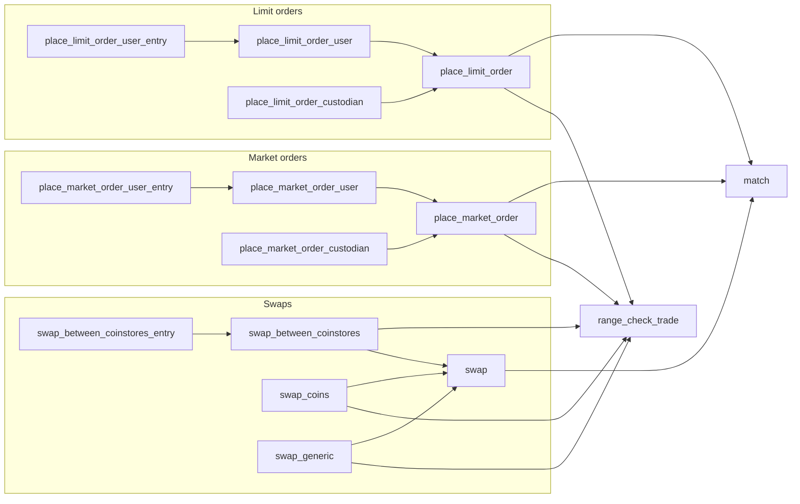
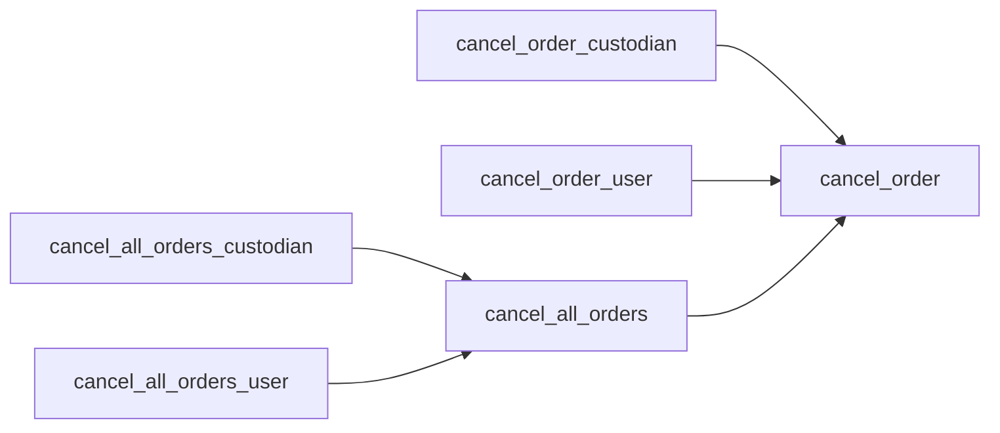

# Matching

```mermaid

flowchart LR

subgraph Limit orders

place_limit_order_user_entry --> place_limit_order_user

place_limit_order_user --> place_limit_order

place_limit_order_custodian --> place_limit_order

end

place_limit_order ---> match

place_limit_order --> range_check_trade

subgraph Market orders

place_market_order_user_entry --> place_market_order_user

place_market_order_user --> place_market_order

place_market_order_custodian --> place_market_order

end

place_market_order ---> match

place_market_order --> range_check_trade

swap_between_coinstores ---> range_check_trade

subgraph Swaps

swap_between_coinstores_entry --> swap_between_coinstores

swap_between_coinstores --> swap

swap_coins --> swap

swap_generic --> swap

end

swap_generic --> range_check_trade

swap_coins ---> range_check_trade

swap ---> match

```

# Cancels

```mermaid

flowchart LR

cancel_all_orders_custodian --> cancel_all_orders

cancel_order_custodian --> cancel_order

cancel_all_orders_user --> cancel_all_orders

cancel_order_user --> cancel_order

cancel_all_orders --> cancel_order
```