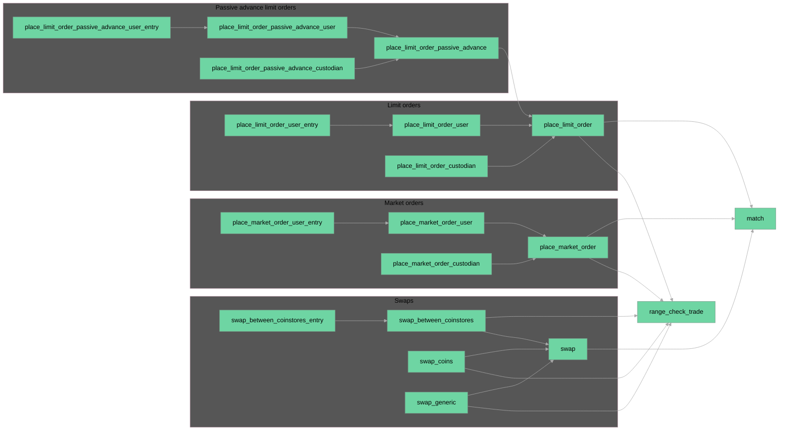

```mermaid

%%{init: {'theme': 'base', 'themeVariables': {'primaryColor': '#6ed5a3', 'lineColor': '#aaaaaa', 'primaryTextColor': '#020202', 'secondaryColor': '#aaaaaa', 'clusterBkg': '#565656', 'titleColor': '#020202'}}}%%

flowchart LR

place_limit_order ---> match

place_limit_order --> range_check_trade

place_market_order ---> match

place_market_order --> range_check_trade

swap ---> match

swap_between_coinstores ---> range_check_trade

subgraph Swaps

swap_between_coinstores_entry --> swap_between_coinstores

swap_between_coinstores --> swap

swap_coins --> swap

swap_generic --> swap

end

swap_coins ---> range_check_trade

swap_generic ---> range_check_trade

place_limit_order_passive_advance --> place_limit_order

subgraph Market orders

place_market_order_user_entry --> place_market_order_user

place_market_order_user --> place_market_order

place_market_order_custodian --> place_market_order

end

subgraph Limit orders

place_limit_order_user_entry --> place_limit_order_user

place_limit_order_user --> place_limit_order

place_limit_order_custodian --> place_limit_order

end

subgraph Passive advance limit orders

place_limit_order_passive_advance_user_entry -->
place_limit_order_passive_advance_user

place_limit_order_passive_advance_user -->
place_limit_order_passive_advance

place_limit_order_passive_advance_custodian -->
place_limit_order_passive_advance

end

```
