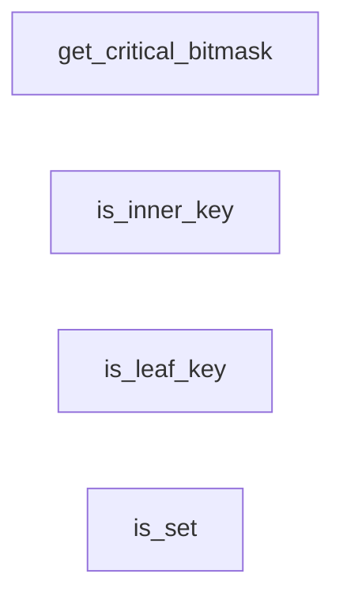
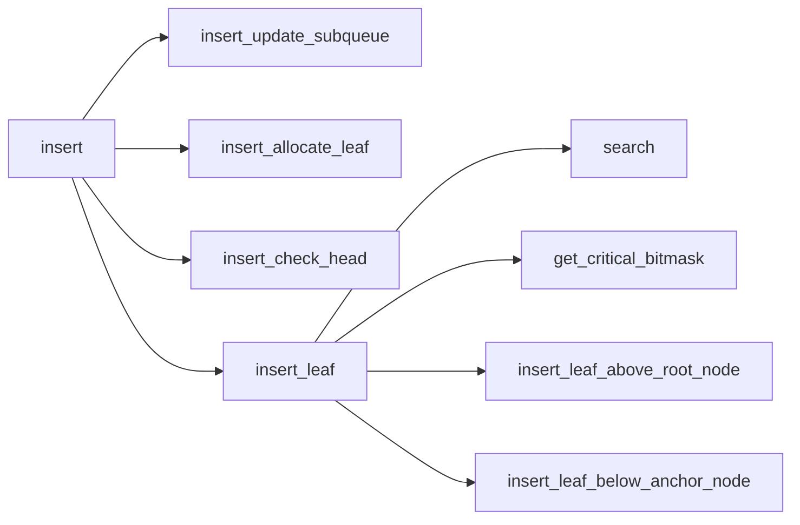
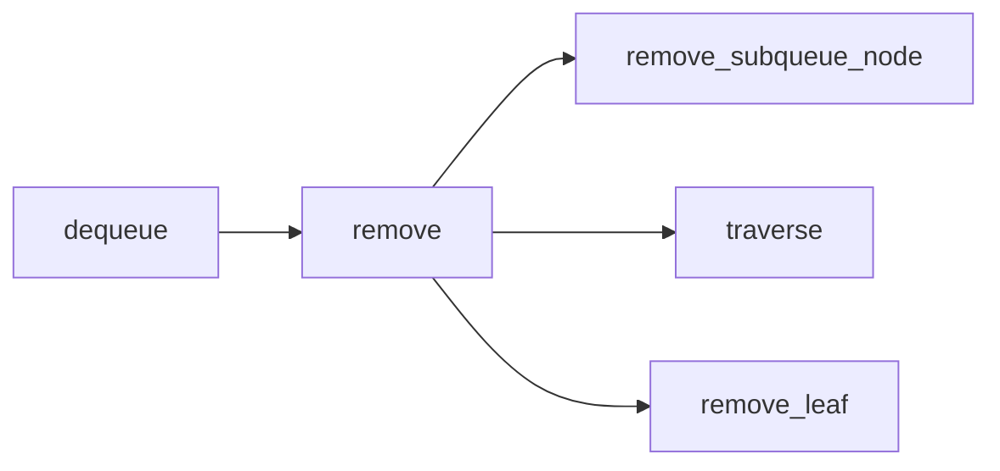
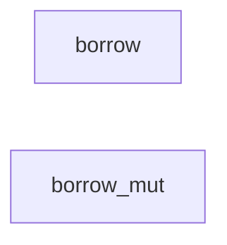
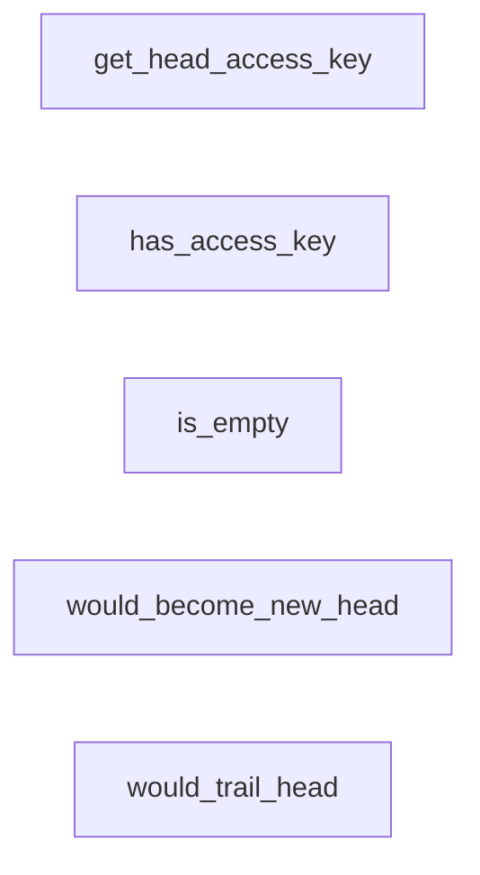

# critqueue.move

- [critqueue.move](#critqueuemove)
  - [Bitwise functions](#bitwise-functions)
  - [Initialization](#initialization)
  - [Insertion](#insertion)
  - [Removal](#removal)
  - [Borrowers](#borrowers)
  - [Lookup](#lookup)

## Bitwise functions

## Initialization

## Insertion

## Removal

## Borrowers

## Lookup

