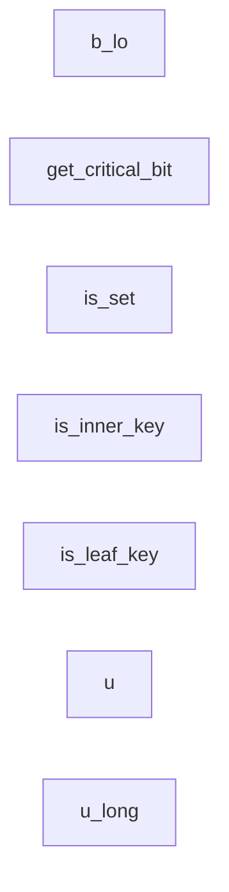
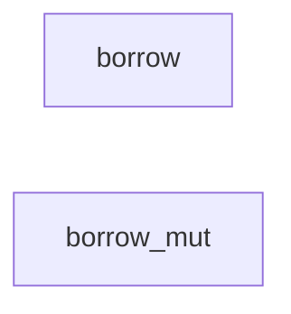

# critqueue.move

- [critqueue.move](#critqueuemove)
  - [Bit helpers](#bit-helpers)
  - [Enqueueing](#enqueueing)
  - [Initialization](#initialization)
  - [Borrowers](#borrowers)
  - [Lookup](#lookup)

## Bit helpers



## Enqueueing


## Initialization


## Borrowers



## Lookup

```mermaid

get_head_leaf_key
has_leaf_key
is_empty
would_trail_head
would_become_new_head

```