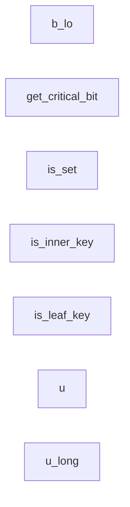

# critqueue.move

- [critqueue.move](#critqueuemove)
  - [Bit helpers](#bit-helpers)
  - [Enqueueing](#enqueueing)
  - [Initialization](#initialization)

## Bit helpers

## Enqueueing

## Initialization

