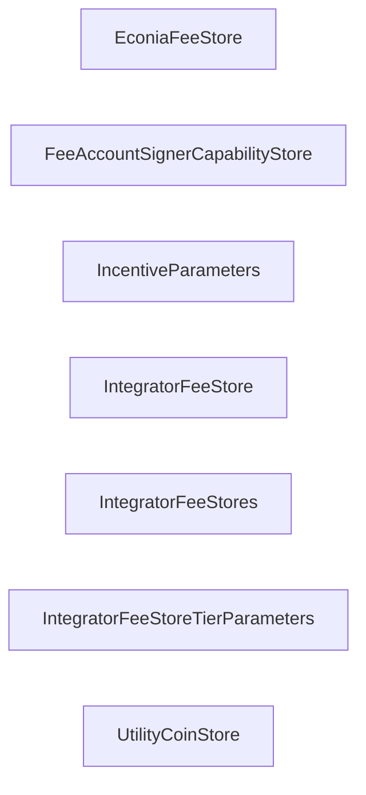
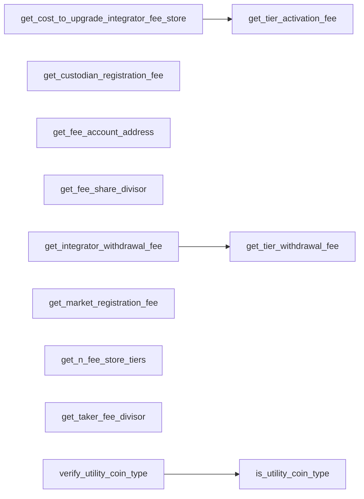
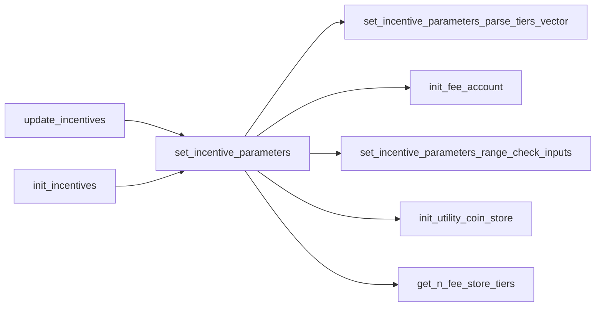
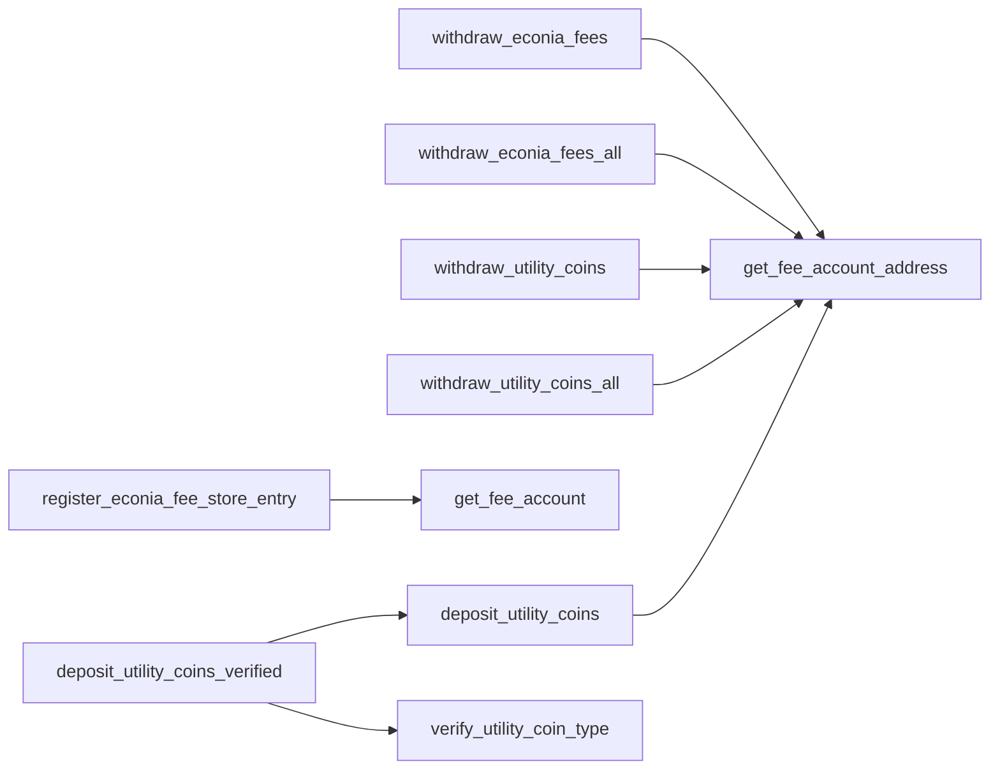
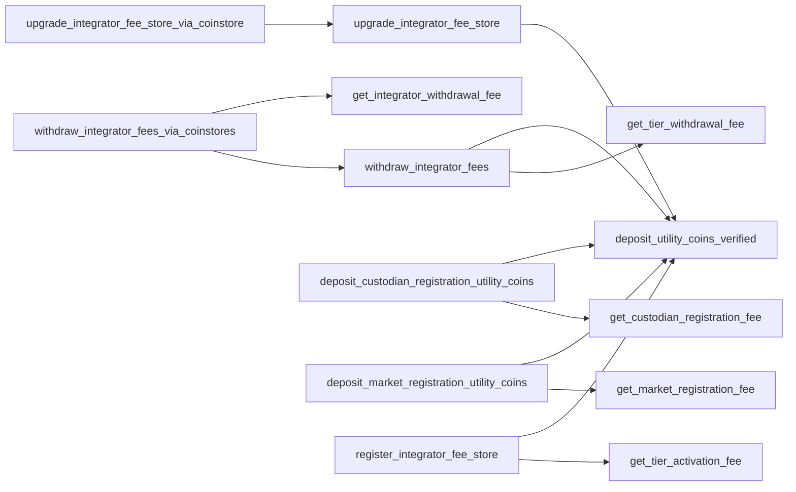
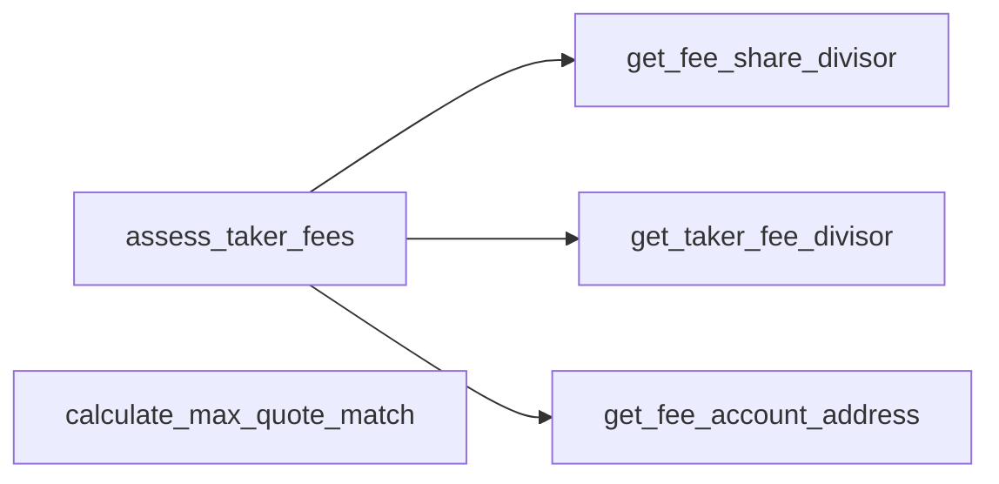

- [Incentives.move](#incentivesmove)
  - [Structs](#structs)
  - [Getters](#getters)
  - [Econia admin operations](#econia-admin-operations)
  - [Econia account operations](#econia-account-operations)
  - [Integrator account operations](#integrator-account-operations)
  - [Match operations](#match-operations)

# Incentives.move

## Structs

## Getters

## Econia admin operations

## Econia account operations

## Integrator account operations

## Match operations

