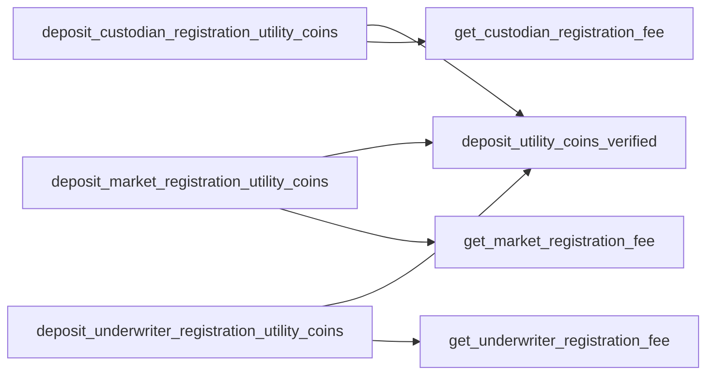

- [Incentives.move](#incentivesmove)
  - [Structs](#structs)
  - [Getters](#getters)
  - [Incentive parameter setters](#incentive-parameter-setters)
  - [Econia fee account operations](#econia-fee-account-operations)
  - [Registrant operations](#registrant-operations)
  - [Integrator fee store operations](#integrator-fee-store-operations)
  - [Match operations](#match-operations)

# Incentives.move

## Structs

## Getters

## Incentive parameter setters

## Econia fee account operations

## Registrant operations

## Integrator fee store operations

## Match operations

