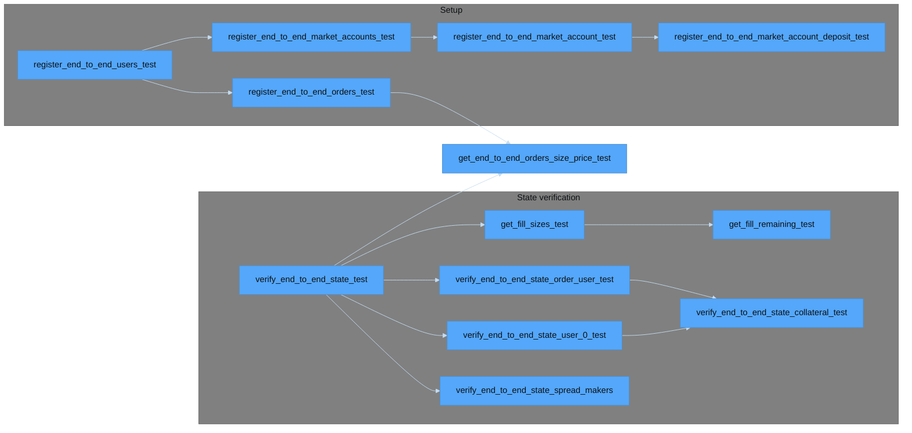

```mermaid

%%{init: {'theme': 'base', 'themeVariables': {'primaryColor': '#54a7fa', 'lineColor': '#c4dcf1', 'primaryTextColor': '#0d1013', 'secondaryColor': '#c4dcf1', 'tertiaryColor': '#808080', 'tertiaryTextColor': '#0d1013'}}}%%

flowchart LR

    subgraph Setup

    register_end_to_end_users_test --> register_end_to_end_market_accounts_test
    register_end_to_end_users_test --> register_end_to_end_orders_test
    register_end_to_end_market_accounts_test --> register_end_to_end_market_account_test
    register_end_to_end_market_account_test --> register_end_to_end_market_account_deposit_test

    end

    register_end_to_end_orders_test --> get_end_to_end_orders_size_price_test
    verify_end_to_end_state_test --> get_end_to_end_orders_size_price_test

    subgraph State verification

    verify_end_to_end_state_test --> get_fill_sizes_test
    get_fill_sizes_test --> get_fill_remaining_test
    verify_end_to_end_state_test --> verify_end_to_end_state_order_user_test
    verify_end_to_end_state_test --> verify_end_to_end_state_user_0_test
    verify_end_to_end_state_order_user_test --> verify_end_to_end_state_collateral_test
    verify_end_to_end_state_user_0_test --> verify_end_to_end_state_collateral_test
    verify_end_to_end_state_test --> verify_end_to_end_state_spread_makers

    end

```