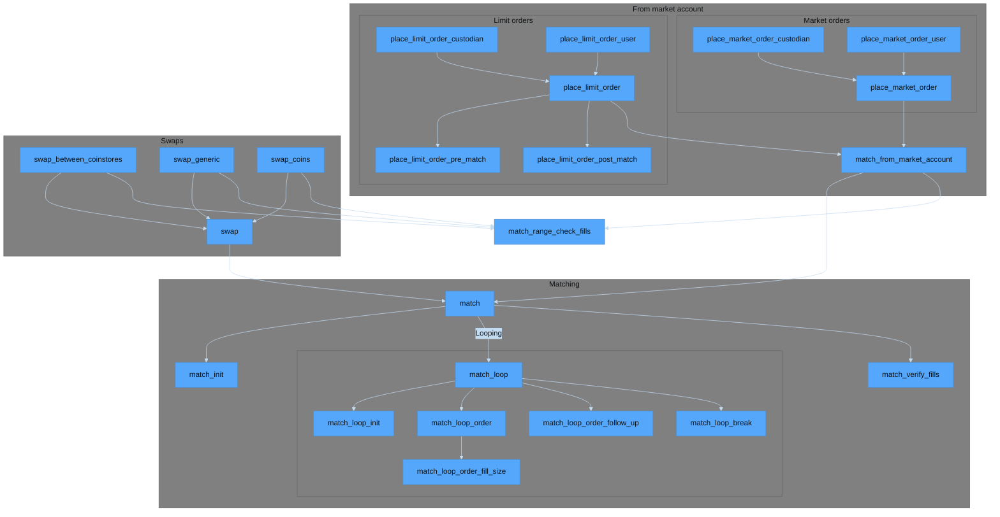

```mermaid

%%{init: {'theme': 'base', 'themeVariables': {'primaryColor': '#54a7fa', 'lineColor': '#c4dcf1', 'primaryTextColor': '#0d1013', 'secondaryColor': '#c4dcf1', 'tertiaryColor': '#808080', 'tertiaryTextColor': '#0d1013'}}}%%

flowchart TB

%% Node relationships

    subgraph From market account

        subgraph Market orders

        place_market_order_custodian --> place_market_order
        place_market_order_user --> place_market_order

        end

        subgraph Limit orders

        place_limit_order_custodian --> place_limit_order
        place_limit_order_user --> place_limit_order
        place_limit_order --> place_limit_order_pre_match
        place_limit_order --> place_limit_order_post_match

        end

    place_limit_order --> match_from_market_account
    place_market_order --> match_from_market_account

    end

    subgraph Swaps

    swap_between_coinstores --> swap
    swap_generic --> swap
    swap_coins --> swap

    end

    match_from_market_account --> match
    match_from_market_account --> match_range_check_fills

    swap_coins --> match_range_check_fills
    swap_between_coinstores --> match_range_check_fills
    swap_generic --> match_range_check_fills
    swap --> match

    subgraph Matching

    match --> match_init
    match -- Looping --> match_loop

        subgraph Loop [ ]

        match_loop --> match_loop_init
        match_loop --> match_loop_order
        match_loop --> match_loop_order_follow_up
        match_loop --> match_loop_break
        match_loop_order --> match_loop_order_fill_size

        end

    match --> match_verify_fills

    end

%% Class definitions

    classDef individually_tested fill:#ff00ff %% Fuchsia
    classDef tested_integrated fill:#00ced1 %% Dark Turquoise
    classDef tested_via_invocation fill:#00ff7f %% Spring Green

    class place_limit_order_pre_match tested_integrated;
    class place_limit_order_post_match tested_integrated;
    class swap_between_coinstores tested_integrated;
    class match_verify_fills individually_tested;
    class swap_coins tested_integrated;
    class swap_generic tested_integrated;
    class match tested_integrated;
    class match_from_market_account tested_integrated;
    class match_init tested_integrated;
    class swap tested_integrated;
    class place_limit_order tested_integrated;
    class place_limit_order_custodian tested_via_invocation;
    class place_limit_order_user tested_via_invocation;
    class place_market_order tested_via_invocation;
    class place_market_order_custodian tested_via_invocation;
    class place_market_order_user tested_via_invocation;
    class match_loop tested_integrated;
    class match_loop_order tested_integrated;
    class match_loop_order_fill_size individually_tested;
    class match_loop_order_follow_up tested_integrated;
    class match_loop_break tested_integrated;
    class match_loop_init tested_integrated;
    class match_range_check_fills individually_tested;

```