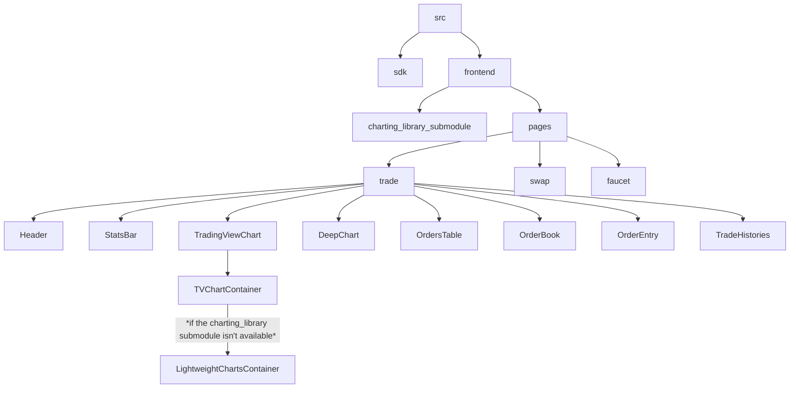

# Reference frontend

## Background

The Econia [reference frontend](https://reference.econia.exchange/) is designed to streamline the challenges encountered during the initial phases of DeFi product development.
This tutorial is designed to guide developers, whether experienced or novice, through the process from forking on GitHub to project completion.


:::note
Change all design, logos, and branding before publishing. Please reference the [Figma] to change styling.
:::

## In this tutorial, you will learn how to:

1. Clone the Econia reference frontend
1. Run the frontend locally
1. Deploy the frontend on Vercel

# Prerequisites:

1. VSCode, terminal, or your favorite code editor
1. `pnpm` installed

## Step 1: Clone the Econia frontend [Github](https://github.com/econia-labs/econia-frontend) repo

You can either clone the repo using git commands, fork to your own GitHub account, or download the zip.

*Don't know how to clone a repository? Check out **[this guide](https://docs.github.com/en/github/creating-cloning-and-archiving-repositories/cloning-a-repository)** from Github.*


## Step 2 (Optional): TradingView repo setup

By default the candlestick chart functionality in the Econia reference frontend relies on the closed source [TradingView Advanced Charts] repository.
If you do not have access to the private repository, the candlestick functionality falls back on the open source [Lightweight Charts](https://github.com/tradingview/lightweight-charts) repository.

:::note
Skip this part if you want to use the open source version.
:::

The [TradingView Advanced Charts] repository is used as a submodule in the Econia reference frontend, and is used for displaying the candlestick chart of a specific market.
It is initialized at `src/frontend/public/static`.

In essence, adding the `TradingView` as a submodule clones the `TradingView` repository and builds it into static files.
Therefore, you need to have the access rights to the `TradingView` repository.

> To get the access rights, you have to contact the TradingView team and wait for approval.

## Step 3: Open your fork of `econia-frontend`

First check out the architecture of the code.
You can see a diagram of components and files for each page and view here:



## Step 4: Run the project locally

- Navigate to the frontend folder

```bash
cd src/frontend
```

- Install dependencies with `pnpm`

```bash
pnpm i
```

- Copy `.env.example` to `.env.local`

```bash
cp -R .env.example .env.local
```

If you take a look at the `.env` files you may note that the environment variable for the REST URL is set to https://aptos-testnet-econia.nodeinfra.com/.
This is because Nodeinfra runs a community deployment of the [Econia DSS](../off-chain/dss/data-service-stack.md), which provides data feeds for Econia reference frontend data.

| Variable                                 | Meaning                                                                                                                            |
| ---------------------------------------- | ---------------------------------------------------------------------------------------------------------------------------------- |
| `NEXT_PUBLIC_ECONIA_ADDR`                | The Econia module address                                                                                                          |
| `NEXT_PUBLIC_FAUCET_ADDR`                | The Econia faucet address                                                                                                          |
| `NEXT_PUBLIC_NETWORK_NAME`               | The network name (for example, "mainnet" or "testnet")                                                                             |
| `NEXT_PUBLIC_API_URL`                    | The Econia REST API URL                                                                                                            |
| `NEXT_PUBLIC_RPC_NODE_URL`               | Aptos RPC URL                                                                                                                      |
| `NEXT_PUBLIC_UNCONNECTED_NOTICE_MESSAGE` | The modal message to display when a user has not connected their wallet yet                                                        |
| `NEXT_PUBLIC_READ_ONLY`                  | For setting read-only mode, where "1" means the user can't submit or sign transactions and "0" means they can                      |
| `NEXT_PUBLIC_READ_ONLY_MESSAGE`          | The error message displayed to a user when they attempt to sign a transaction in read-only mode                                    |
| `NEXT_PUBLIC_DEFAULT_MARKET_ID`          | Default market id                                                                                                                  |
| `NEXT_PUBLIC_INTEGRATOR_ADDRESS`         | The address that will receive integrator fees for taker orders. This address must have a fee store registered for the given market |
| `TRY_CLONING_TRADINGVIEW`                | Set to any value other than "1" to skip private submodule cloning                                                                  |

- Run the development server

```
pnpm run dev
```

Doing so should open [http://localhost:3000](http://localhost:3000) in your browser, where you'll see the local version of the frontend.

## Steps to deploy on Vercel

Vercel is a user-friendly cloud platform for frontend development and deployment. It streamlines the deployment process by automating Git-based deployments and serverless functions.

Prerequisites:

1. Github account
1. Github access token

To generate a `GITHUB_ACCESS_TOKEN`:

1. Go to https://github.com/settings/tokens/new
1. Provide a descriptive `note`
1. In `Expiration` selection box, choose `No expiration`
1. In the `Select scopes` section, click on `repo - Full control of private repositories` to select all repository-related options
1. Click `Generate token`
1. Copy the generated token to your Vercel environment variables and name it `GITHUB_ACCESS_TOKEN`

## Step 1: Log into Vercel


## Step 2: Create a Vercel project

**Import project**: on your screen, click `Add New` button and select `Project` to create a new project or shortly clicks `Import project` to import the Github repository.

The Vercel website should display a list of repositories in your Github account.

Now click the `Import` button on the `econia-frontend` repository.


## Step 3: Configure project

**Project Name**: The project name is automatically generated, you can change it as you want.

**Framework Preset**: As the directory at the above path is a NextJS project then Vercel automatically detects that its `Framework Preset` is NextJS.

**Root Directory**: At the `Root Directory` field, click the `Edit` button next to it. A modal pops up and tells you to select the directory where your source code is located. Then, you must select the path `econia-frontend/src/frontend` and click `Continue`.


**Build and Output Settings**: Override the `Install Command` with the following:


**Environment Preparation**

To deploy on Vercel, you'll need to set up the following environment variables:

| Variable                                 | Meaning                                                                                                                            |
| ---------------------------------------- | ---------------------------------------------------------------------------------------------------------------------------------- |
| `NEXT_PUBLIC_ECONIA_ADDR`                | The Econia module address                                                                                                          |
| `NEXT_PUBLIC_FAUCET_ADDR`                | The Econia faucet address                                                                                                          |
| `NEXT_PUBLIC_NETWORK_NAME`               | The network name (for example, "mainnet" or "testnet")                                                                             |
| `NEXT_PUBLIC_API_URL`                    | The Econia REST API URL                                                                                                            |
| `NEXT_PUBLIC_RPC_NODE_URL`               | Aptos RPC URL                                                                                                                      |
| `GITHUB_ACCESS_TOKEN`                    | Access token for the GitHub account with access to the private `TradingView` repo. This is required when deploying to Vercel       |
| `NEXT_PUBLIC_UNCONNECTED_NOTICE_MESSAGE` | The modal message to display when a user has not connected their wallet yet                                                        |
| `NEXT_PUBLIC_READ_ONLY`                  | For setting read-only mode, where "1" means the user can't submit or sign transactions and "0" means they can                      |
| `NEXT_PUBLIC_READ_ONLY_MESSAGE`          | The error message displayed to a user when they attempt to sign a transaction in read-only mode                                    |
| `NEXT_PUBLIC_DEFAULT_MARKET_ID`          | Default market id                                                                                                                  |
| `NEXT_PUBLIC_INTEGRATOR_ADDRESS`         | The address that will receive integrator fees for taker orders. This address must have a fee store registered for the given market |
| `TRY_CLONING_TRADINGVIEW`                | Set to any value other than "1" to skip private submodule cloning                                                                  |

:::note
If you do not have access to the private `TradingView` submodule then set `TRY_CLONING_TRADINGVIEW` to any value other than “1”.
:::

**Environment Variables**: Paste all the environment variables in `.env.local`  or  `.env.example`  file to the table.


:::tip
You don't need to copy and paste each variable at a time, just copy your file and paste into the input field.
:::

## Step 4: Deploy your project

Click the `Deploy` button, wait for several minutes and see the results.


:::note
You may see the errors below if you do not have access to the private `TradingView` submodule, but the website will still deploy with the open source fallback!
:::


Congrats! You will then be taken to the page hosted on Vercel!


:::note
Change all design, logos, and branding before publishing. Please reference the [Figma] to change styling.
:::

[figma]: https://www.figma.com/file/SGWAXYwpvLThiA27HXbzSY/Econia-Labs-%7C-Reference-Frontend-%7C-Public?type=design&node-id=5171-12582&mode=design
[tradingview advanced charts]: https://github.com/tradingview/charting_library
