# Using Terraform

:::danger
This guide is not actively maintained.
See the [DSS CI/CD guide](./ci-cd.md) for the most up-to-date deployment steps.
:::

If you have already finished the [Google Cloud Platform (GCP) tutorial](gcp.md) and are looking for a more programmatic deployment process, this guide will show you how to use [Terraform](https://developer.hashicorp.com/terraform/tutorials/gcp-get-started/infrastructure-as-code) to deploy the Econia DSS via declarative configurations.

This guide is for a specific use case, the Econia testnet trading competition leaderboard backend, but you can adapt as needed for your particular use case.

```mermaid
flowchart TB

subgraph gcp[Google Cloud Platform]
    subgraph load-balancer[Global Load Balancer]
        subgraph armor[GCP Cloud Armor]
        direction LR
            rate-limiting[IP Rate Limiting]
            ddos[Layer 7 DDoS Protection]
        end
    end
    load-balancer-->rest-service
    subgraph rest-service[REST API Cloud Run Service]
        subgraph r-instance-1[PostgREST Instance]
            ri1c[Container]
        end
        subgraph r-instance-2[PostgREST Instance]
            ri2c[Container]
        end
    end
    rest-service --> rest-connector
    subgraph vpc[PostgreSQL VPC]
        aggregator-container-->|Private IP|cloud-pg
        processor-container-->|Private IP|cloud-pg
        subgraph processor-image[Processor VM]
            processor-container[Container]
        end
        subgraph aggregator-image[Aggregator VM]
            aggregator-container[Container]
        end
        processor-container-->processor_disk[Config disk]
        cloud-pg[(PostgreSQL via Cloud SQL)]
        rest-connector(REST VPC connector)--->cloud-pg
    end
end
processor-container-->grpc[Aptos Labs gRPC]
pg_admin[PostgreSQL Admin]-->|Public IP|cloud-pg
leaderboard[Vercel Leaderboard]-->load-balancer

classDef blue fill:#134d52
classDef green fill:#13521d
classDef yellow fill:#979e37
classDef purple fill:#800080
class load-balancer purple;
class gcp blue;
class vpc green;
class ws-service yellow;
class rest-service yellow;
```



## Configure project

1. Install (if you don't already have):

   1. [Terraform](https://developer.hashicorp.com/terraform/tutorials/gcp-get-started/install-cli).

   1. [Diesel for postgres](https://diesel.rs/guides/getting-started).

   1. [`psql`](https://www.postgresql.org/download/).

1. Clone the Econia repository and navigate to the `leaderboard-backend` project directory:

   ```sh
   git clone https://github.com/econia-labs/econia.git
   cd econia
   git submodule update --init --recursive
   cd src/terraform/leaderboard-backend
   ```

1. [Configure a billable GCP project](gcp#configure-project):

   ```sh
   PROJECT_NAME=leaderboard-backend
   ```

   ```sh
   echo $PROJECT_ID
   echo $PROJECT_NAME
   echo $ORGANIZATION_ID
   echo $BILLING_ACCOUNT_ID
   ```

   ```sh
   gcloud projects create $PROJECT_ID \
       --name $PROJECT_NAME \
       --organization $ORGANIZATION_ID
   gcloud alpha billing projects link $PROJECT_ID \
       --billing-account $BILLING_ACCOUNT_ID
   gcloud config set project $PROJECT_ID
   ```

1. Pick a database root password:

   ```sh
   DB_ROOT_PASSWORD=<DB_ROOT_PASSWORD>
   ```

   ```sh
   echo $DB_ROOT_PASSWORD
   ```

   :::tip
   Avoid using the special characters `@`, `/`, `.`, or `:`, which are used in connection strings.
   :::

1. Store [your public IP address](https://stackoverflow.com/a/56068456):

   ```sh
   MY_IP=$(curl --silent http://checkip.amazonaws.com)
   echo $MY_IP
   ```

1. Generate keys for a [service account](https://cloud.google.com/iam/docs/service-account-overview):

   ```sh
   gcloud iam service-accounts create terraform
   ```

   ```sh
   SERVICE_ACCOUNT_NAME=terraform@$PROJECT_ID.iam.gserviceaccount.com
   echo $SERVICE_ACCOUNT_NAME
   ```

   ```sh
   gcloud iam service-accounts keys create gcp-key.json \
       --iam-account $SERVICE_ACCOUNT_NAME
   ```

1. Generate SSH keys:

   ```sh
   rm -rf ssh
   mkdir ssh
   ssh-keygen -t rsa -f ssh/gcp -C bootstrapper -b 2048 -q -N ""
   ```

1. Store variables in a [Terraform variable file](https://developer.hashicorp.com/terraform/tutorials/configuration-language/variables), then format and initialize the directory:

   ```sh
   echo "project = \"$PROJECT_ID\"" > terraform.tfvars
   echo "db_admin_public_ip = \"$MY_IP\"" >> terraform.tfvars
   echo "db_root_password = \"$DB_ROOT_PASSWORD\"" >> terraform.tfvars
   ```

   ```sh
   terraform fmt
   ```

   ```sh
   echo "\n\nContents of terraform.tfvars:\n\n"
   cat terraform.tfvars
   ```

   ```sh
   terraform init
   ```

## Build infrastructure

1. Update `/src/docker/processor/config.yaml`.

   :::tip
   Don't worry about `postgres_connection_string`, this will be automatically handled later.
   :::

1. Create `competition-metadata.json` and `competition-additional-exclusions.json` in `/src/rust/dbv2` per [the README](https://github.com/econia-labs/econia/tree/main/src/rust/dbv2/README.md).

1. Apply the configuration:

   ```sh
   terraform apply --parallelism 20
   ```

1. View outputs:

   ```sh
   terraform output
   ```

1. [Set up load balancing with a custom domain](https://cloud.google.com/run/docs/integrate/custom-domain-load-balancer), then update your DNS records for the custom domain.

   ```sh
   CUSTOM_DOMAIN=<MY_CUSTOM_DOMAIN>
   ```

   ```sh
   echo $CUSTOM_DOMAIN
   ```

   ```sh
   gcloud beta run integrations create \
       --parameters set-mapping=$CUSTOM_DOMAIN:postgrest \
       --type custom-domains
   ```

   ```sh
   gcloud beta run integrations describe custom-domains
   ```

   :::tip
   Compared with the more complex [generic load balancing setup process](https://cloud.google.com/load-balancing/docs/https/setup-global-ext-https-serverless), this streamlined process is a GCP Cloud Run beta feature that is not yet supported by Terraform.

   If you want to instead use the generic public `run.app` URL, then before you run `terraform apply` remove the following line from the `postgrest` service in `main.tf`, then skip this and all remaining steps:

   ```
   ingress = "INGRESS_TRAFFIC_INTERNAL_ONLY"
   ```

   :::

1. Create a [security policy](https://cloud.google.com/armor/docs/configure-security-policies#https-load-balancer) for the load balancer:

   ```sh
   gcloud compute backend-services list
   ```

   ```sh
   BACKEND_SERVICE=<custom-domains-x-y-postgrest-z-be>
   ```

   ```sh
   echo $BACKEND_SERVICE
   ```

   ```sh
   gcloud compute backend-services update $BACKEND_SERVICE \
       --global \
       --security-policy public-traffic
   ```

## Take down infrastructure

1. Destroy project resources:

   ```sh
   terraform destroy
   ```

   :::tip
   This might not destroy quite everything, since [GCP has a Cloud SQL deletion waiting period that blocks the deletion of private service networking](https://cloud.google.com/vpc/docs/configure-private-services-access#removing-connection).
   This issue was supposed to be resolved as of the [Google Provider 5.0.0 release for Terraform](https://registry.terraform.io/providers/hashicorp/google/latest/docs/guides/version_5_upgrade#resource-google_service_networking_connection), but it appears not to be resolved per https://github.com/hashicorp/terraform-provider-google/issues/16275.

   If `terraform destroy` gets stuck on deleting the network connection, you can manually delete the network connection [in the GCP console](https://console.cloud.google.com/networking/peering) then run `terraform destroy` again.

   Or you can simply delete the project even if Terraform has not destroyed all resources.
   :::

1. Delete GCP project:

   ```sh
   gcloud projects delete $PROJECT_ID
   ```

## Deploy second parallel project

1. Clear cache:

   ```sh
   rm *tfstate*
   rm -rf .terraform
   rm .terraform*
   ```

   :::tip
   If you delete `*tfstate*` files, then you will [lose configuration state](https://tryingthings.wordpress.com/2021/03/31/lessons-learned-after-losing-the-terraform-state-file/) and will only be able to modify the primary project via `gcloud commands`.

   If you want to be able to do more than just delete the primary project once you've started a parallel one, keep backups of your `*tfstate*` files.
   :::

1. After creating a new project, use a different credentials filename and add your `credentials_file` to `terraform.tfvars` (for example `credentials_file = gcp-key-2.json`).

   :::tip
   `.gitignore` ignores any files of pattern `gcp-key-*.json`.
   :::

1. Use the same SSH keys as the main deployment (no need to recreate).

## Diagnostics

### Connect to PostgreSQL

1. Connect:

   ```sh
   psql $(terraform output -raw db_conn_str_admin)
   ```

### Target a specific resource

1. Apply:

   ```sh
   terraform apply -target <RESOURCE_NAME>
   ```

1. Destroy:

   ```sh
   terraform destroy -target <RESOURCE_NAME>
   ```

### Generate a dependency graph

1. Check that you have `dot`:

   ```sh
   which dot
   ```

1. [Generate graph](https://developer.hashicorp.com/terraform/cli/commands/graph#generating-images):

   ```sh
   terraform graph | dot -Tsvg > graph.svg
   ```

### Check resource metadata

1. [Show state](https://developer.hashicorp.com/terraform/cli/commands/show):

   ```sh
   terraform show
   ```

1. [List state](https://developer.hashicorp.com/terraform/cli/commands/state/list):

   ```sh
   terraform state list
   ```

1. [Show state for a resource](https://developer.hashicorp.com/terraform/cli/commands/state/show)

   ```sh
   terraform state show <RESOURCE_TYPE.RESOURCE_NAME>
   ```
