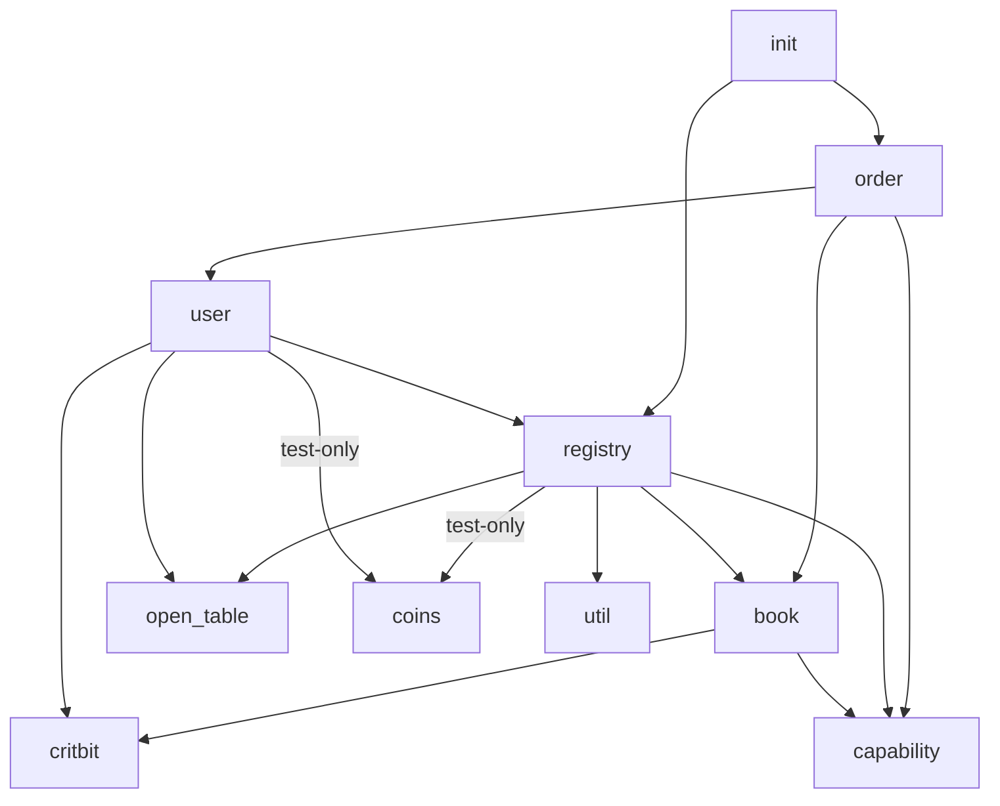

# Move modules

| Module | Source code | Documentation |
| ------ | ----------- | ------------- |
| `book` | [book.move](../../src/move/econia/sources/book.move) | [book.md](../../src/move/econia/build/Econia/docs/book.md) |

## Use dependencies

