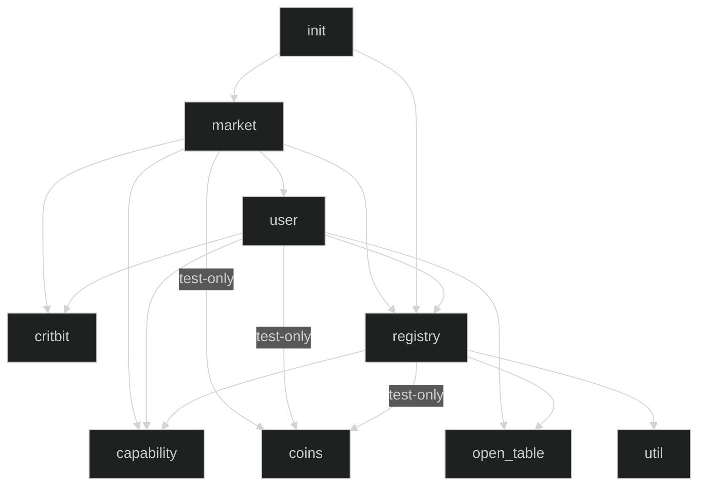

# Move modules

| Module | Source code | Documentation |
| ------ | ----------- | ------------- |
| `capability` | [capability.move](../../src/move/econia/sources/capability.move) | [capability.md](../../src/move/econia/build/Econia/docs/capability.md) |
| `coins`      | [coins.move](../../src/move/econia/sources/coins.move)           | [coins.md](../../src/move/econia/build/Econia/docs/coins.md)           |
| `critbit`    | [critbit.move](../../src/move/econia/sources/critbit.move)       | [critbit.md](../../src/move/econia/build/Econia/docs/critbit.md)       |
| `init`       | [init.move](../../src/move/econia/sources/init.move)             | [init.md](../../src/move/econia/build/Econia/docs/init.md)             |
| `market`     | [market.move](../../src/move/econia/sources/market.move)         | [market.md](../../src/move/econia/build/Econia/docs/market.md)         |
| `open_table` | [open_table.move](../../src/move/econia/sources/open_table.move) | [open_table.md](../../src/move/econia/build/Econia/docs/open_table.md) |
| `registry`   | [registry.move](../../src/move/econia/sources/registry.move)     | [registry.md](../../src/move/econia/build/Econia/docs/registry.md)     |
| `user`       | [user.move](../../src/move/econia/sources/user.move)             | [user.md](../../src/move/econia/build/Econia/docs/user.md)             |
| `util`       | [util.move](../../src/move/econia/sources/util.move)             | [util.md](../../src/move/econia/build/Econia/docs/util.md)             |

## Use dependencies

