# Matching

- [Matching](#matching)
  - [General](#general)
  - [Limit orders](#limit-orders)
  - [Market orders](#market-orders)
  - [Swaps](#swaps)
  - [Matching engine implementation](#matching-engine-implementation)

## General

Econia enables two major order types:

1. Maker orders
1. Taker orders

Each maker order provides liquidity in the form of an [`Order`](../../../src/move/econia/build/Econia/docs/market.md#0xc0deb00c_market_Order) on the [`OrderBook`](../../../src/move/econia/build/Econia/docs/market.md#0xc0deb00c_market_OrderBook) for a given market.
Taker orders match against maker orders, and come in a variety of forms.
When a taker order matches against a maker order, the corresponding [`Order.size`](../../../src/move/econia/build/Econia/docs/market.md#0xc0deb00c_market_Order) is decremented and assets are routed accordingly between counterparties.

## Limit orders

Limit orders can be placed by a signing user or a general custodian, respectively, via
[`place_limit_order_user`](../../../src/move/econia/build/Econia/docs/market.md#0xc0deb00c_market_place_limit_order_user) and [`place_limit_order_custodian`](../../../src/move/econia/build/Econia/docs/market.md#0xc0deb00c_market_place_limit_order_custodian), which each require the side, size (in lots), and price of the limit order.

In the default case, a limit order first matches against the [`OrderBook`](../../../src/move/econia/build/Econia/docs/market.md#0xc0deb00c_market_OrderBook) as a taker order (if the specified price crosses the spread), then any unfilled size is placed as a maker order.
Limit orders may also be placed with one of the following three options:

| Option              | Meaning                                         |
|---------------------|-------------------------------------------------|
| Post-or-abort       | Abort if any portion would fill as a taker      |
| Fill-or-abort       | Abort if any portion would fill as a maker      |
| Immediate-or-cancel | Fill as a taker, then cancel all remaining size |

Only one option may be selected at a time.

## Market orders

Market orders can be placed by a signing user or a general custodian, respectively, via
[`place_market_order_user`](../../../src/move/econia/build/Econia/docs/market.md#0xc0deb00c_market_place_market_order_user) and [`place_market_order_custodian`](../../../src/move/econia/build/Econia/docs/market.md#0xc0deb00c_market_place_market_order_custodian).
Market orders only ever fill as a taker order.

Market orders to buy or sell accept the following arguments:

| Argument      | Meaning                                                  |
|---------------|----------------------------------------------------------|
| Minimum base  | The minimum amount of the base asset to fill             |
| Maximum base  | The maximum amount of the base asset to fill             |
| Minimum quote | The minimum amount of the quote asset to fill            |
| Maximum quote | The maximum amount of the quote asset to fill            |
| Limit price   | The maximum price to buy at, or minimum price to sell at |

Matching halts when any of the following conditions are met:

1. The minimum ask price on the [`OrderBook`](../../../src/move/econia/build/Econia/docs/market.md#0xc0deb00c_market_OrderBook) exceeds the limit price (if a market buy)
1. The maximum bid price on the [`OrderBook`](../../../src/move/econia/build/Econia/docs/market.md#0xc0deb00c_market_OrderBook) is less than the limit price (if a market sell)
1. The maximum base fill allowance is reached
1. The maximum quote fill allowance is reached
1. The [`OrderBook`](../../../src/move/econia/build/Econia/docs/market.md#0xc0deb00c_market_OrderBook) is empty

If, after matching halts, the minimum base and/or quote fill thresholds have not been met, the transaction aborts.

## Swaps

Swaps are the same as market orders, except they do not require a [`MarketAccount`](../../../src/move/econia/build/Econia/docs/user.md#0xc0deb00c_user_MarketAccount):
a swap can be placed directly against the [`OrderBook`](../../../src/move/econia/build/Econia/docs/market.md#0xc0deb00c_market_OrderBook) for a given market via [`swap_coins`](../../../src/move/econia/build/Econia/docs/market.md#0xc0deb00c_market_swap_coins) or [`swap_generic`](../../../src/move/econia/build/Econia/docs/market.md#0xc0deb00c_market_swap_generic).
The latter requires a [generic asset transfer custodian capability](registry.md#asset-types), to ensure that the resultant generic asset amounts are accounted for properly once they have been routed between counterparties.

## Matching engine implementation

Econia's matching engine is implemented in [`market.move`](../../../src/move/econia/build/Econia/docs/market.md), with extensive end-to-end testing.
The below dependency chart details the relevant matching engine functions, according to the following color schema:

| Color  | Meaning                      | Context                                                                            |
|--------|------------------------------|------------------------------------------------------------------------------------|
| Purple | Individually tested          | Functions that simply check inputs are individually tested                         |
| Green  | Tested via direct invocation | Functions that are wrappers for other functions are simply tested by invocation    |
| Blue   | End-to-end tested            | Integrated functions that complexly modify state are tested via end-to-end testing |

(If accessing the below diagram via GitBook, you may need to switch web browsers to view an enlarged version, which can be pulled up by clicking on the image.)

The below test functions are used for end-to-end matching engine testing:

