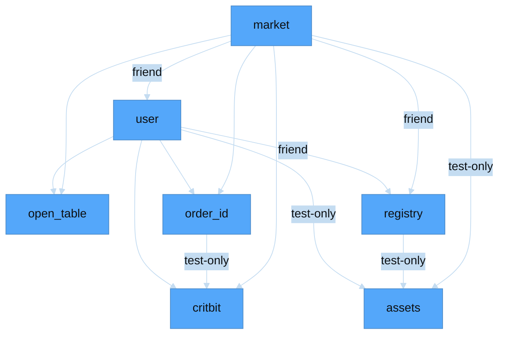
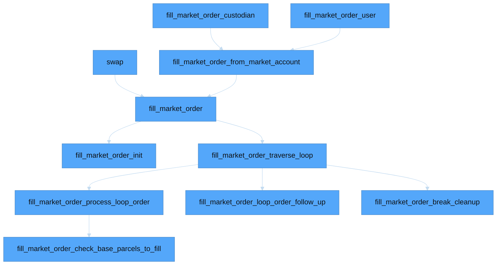
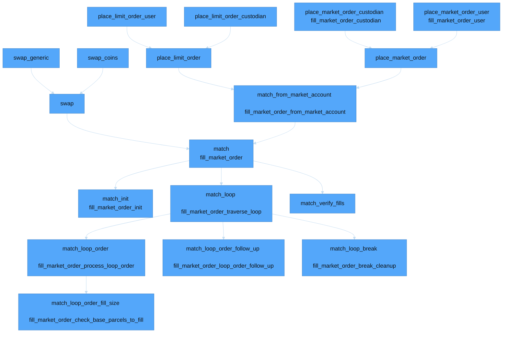

# Module dependencies

Econia modules `use` each other as follows:

```mermaid

%%{init: {'theme': 'base', 'themeVariables': {'primaryColor': '#54a7fa', 'lineColor': '#c4dcf1', 'primaryTextColor': '#0d1013', 'secondaryColor': '#c4dcf1'}}}%%

flowchart TD

    user --> open_table
    user --> critbit
    user --> order_id
    user --> |friend| registry
    user --> |test-only| assets
    registry --> |test-only| assets
    order_id --> |test-only| critbit
    market --> critbit
    market --> open_table
    market --> |friend| registry
    market --> |test-only| assets
    market --> |friend| user
    market --> order_id

```

# Old matching engine

```mermaid

%%{init: {'theme': 'base', 'themeVariables': {'primaryColor': '#54a7fa', 'lineColor': '#c4dcf1', 'primaryTextColor': '#0d1013', 'secondaryColor': '#c4dcf1'}}}%%

flowchart TD

    fill_market_order_custodian --> fill_market_order_from_market_account
    swap --> fill_market_order
    fill_market_order_user --> fill_market_order_from_market_account
    fill_market_order --> fill_market_order_init
    fill_market_order --> fill_market_order_traverse_loop
    fill_market_order_from_market_account --> fill_market_order
    fill_market_order_process_loop_order --> fill_market_order_check_base_parcels_to_fill
    fill_market_order_traverse_loop --> fill_market_order_process_loop_order
    fill_market_order_traverse_loop --> fill_market_order_loop_order_follow_up
    fill_market_order_traverse_loop --> fill_market_order_break_cleanup

```
# New matching engine

```mermaid

%%{init: {'theme': 'base', 'themeVariables': {'primaryColor': '#54a7fa', 'lineColor': '#c4dcf1', 'primaryTextColor': '#0d1013', 'secondaryColor': '#c4dcf1'}}}%%

flowchart TD

%% Node definitions

    match[match <br/> fill_market_order]
    match_from_market_account[match_from_market_account <br/> fill_market_order_from_market_account]
    match_init[match_init <br> fill_market_order_init]
    swap[swap]
    place_market_order[place_market_order]
    place_market_order_custodian[place_market_order_custodian <br/> fill_market_order_custodian]
    place_market_order_user[place_market_order_user <br/> fill_market_order_user]
    place_limit_order[place_limit_order]
    place_limit_order_custodian[place_limit_order_custodian]
    place_limit_order_user[place_limit_order_user]
    match_loop[match_loop <br/> fill_market_order_traverse_loop]
    match_loop_order[match_loop_order <br/> fill_market_order_process_loop_order]
    match_loop_order_fill_size[match_loop_order_fill_size <br/> fill_market_order_check_base_parcels_to_fill]
    match_loop_order_follow_up[match_loop_order_follow_up <br/> fill_market_order_loop_order_follow_up]
    match_loop_break[match_loop_break <br/> fill_market_order_break_cleanup]
    swap_coins[swap_coins]
    swap_generic[swap_generic]
    match_verify_fills[match_verify_fills]

%% Class definitions

    classDef partially_implemented fill:#a020f0 %% Purple
    classDef implemented fill:#32cd32 %% Lime Green
    classDef unimplemented fill:#708090 %% Slate Gray

    class match_verify_fills unimplemented;
    class swap_coins unimplemented;
    class swap_generic unimplemented
    class match unimplemented;
    class match_from_market_account unimplemented;
    class match_init unimplemented;
    class swap unimplemented;
    class place_market_order unimplemented;
    class place_market_order_custodian unimplemented;
    class place_market_order_user unimplemented;
    class place_limit_order partially_implemented;
    class place_limit_order_custodian partially_implemented;
    class place_limit_order_user partially_implemented;
    class match_loop unimplemented;
    class match_loop_order implemented;
    class match_loop_order_fill_size implemented;
    class match_loop_order_follow_up unimplemented;
    class match_loop_break implemented;

%% Node relationships

    match --> match_verify_fills
    swap_generic --> swap
    swap_coins --> swap
    place_limit_order_user --> place_limit_order
    place_limit_order_custodian --> place_limit_order
    place_limit_order --> match_from_market_account
    place_market_order --> match_from_market_account
    place_market_order_custodian --> place_market_order
    swap --> match
    place_market_order_user --> place_market_order
    match --> match_init
    match --> match_loop
    match_from_market_account --> match
    match_loop_order --> match_loop_order_fill_size
    match_loop --> match_loop_order
    match_loop --> match_loop_order_follow_up
    match_loop --> match_loop_break

```