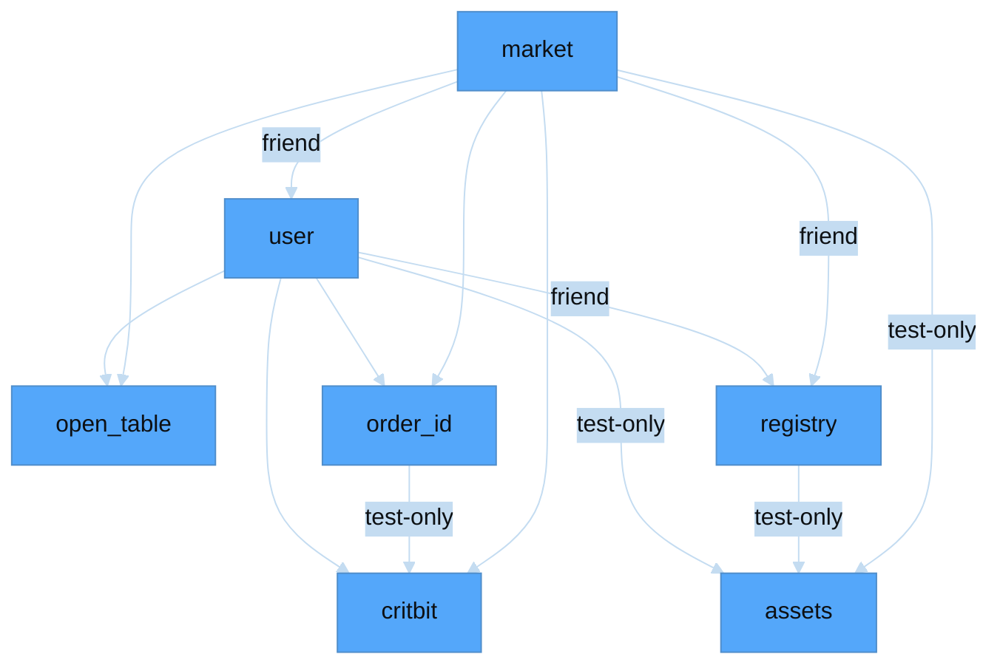
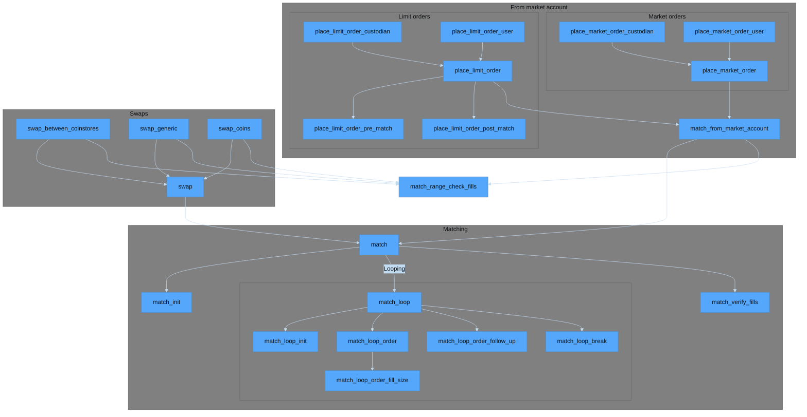
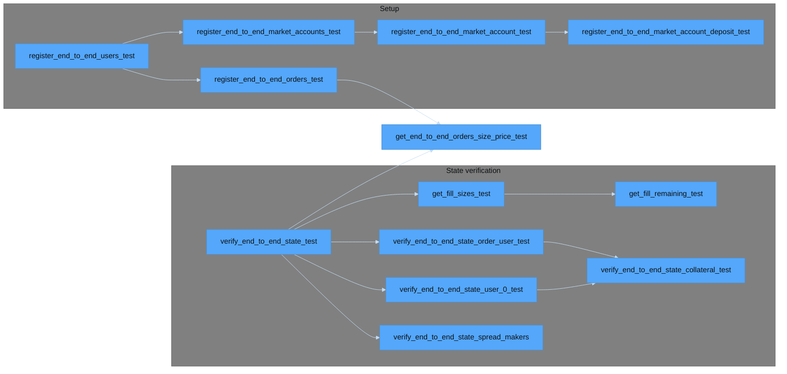

# Dependencies

The below dependency charts are generated declaratively via `mermaid.js`, and may present occasional rendering artifacts.
Try switching browsers if the text renders in a way that is difficult to read.

## Modules

Econia modules `use` each other as follows:

## Matching engine

Econia's matching engine is implemented in [`market.move`](sources/market.move), with comprehensive end-to-end testing.

### Functions

The below dependency chart details the relevant matching engine functions, according to the following color schema:

| Color  | Meaning                      |
|--------|------------------------------|
| Purple | Individually tested          |
| Green  | Tested via direct invocation |
| Blue   | End-to-end tested            |

* Functions that simply check the size of inputs are individually tested
* Functions that are wrappers for other functions are simply tested by invocation
* Integrated functions that complexly modify state are tested via end-to-end testing

### Test functions

The below test functions are used for end-to-end matching engine testing:

