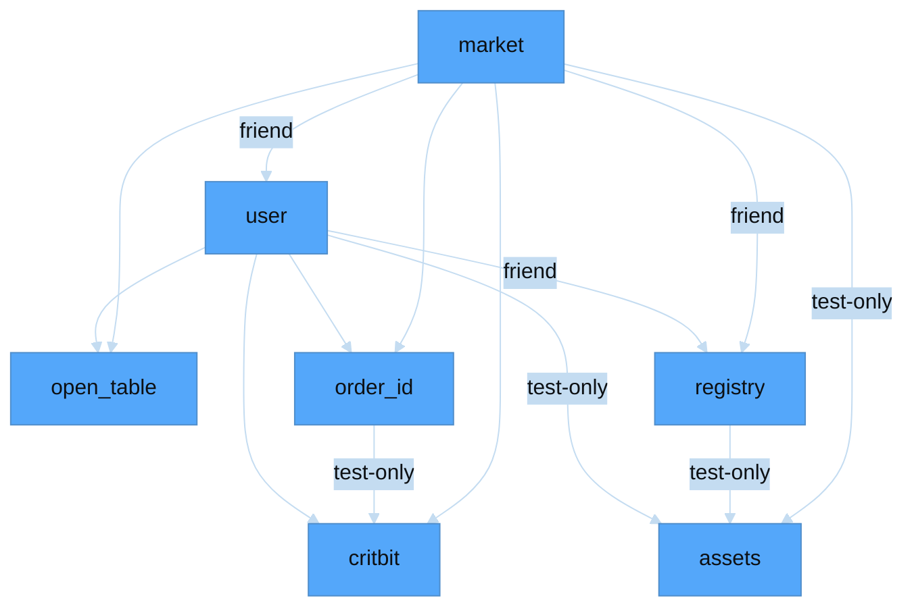
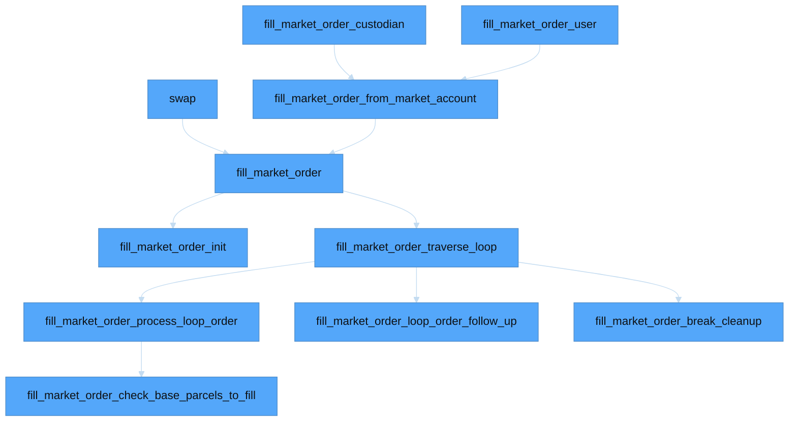
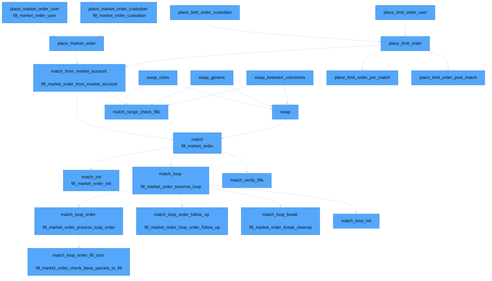

# Module dependencies

Econia modules `use` each other as follows:

# Old matching engine

# New matching engine

If a node has two lines, the second line is the function signature from the old matching engine.

| Color        | Meaning                |
|--------------|------------------------|
| Gray         | To review              |
| Green        | Individually tested    |
| Spring green | Tested via invocation  |
| Blue         | End-to-end tested      |
| Orange       | To test via invocation |
| Gold         | To test end-to-end     |

