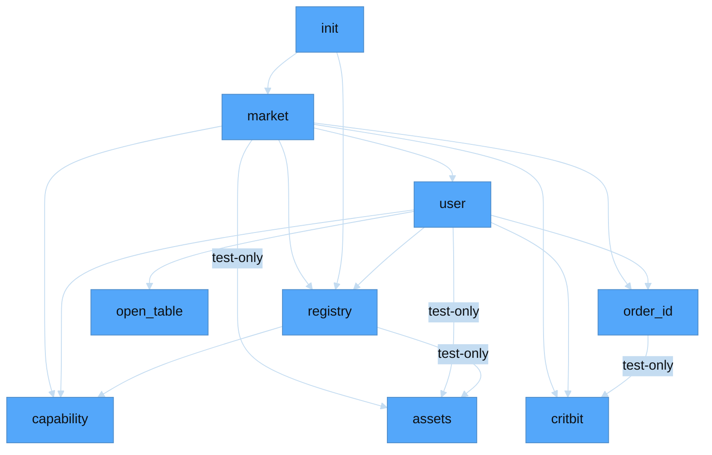

# Module dependencies

Econia modules `use` each other as follows:

```mermaid

%%{init: {'theme': 'base', 'themeVariables': {'primaryColor': '#54a7fa', 'lineColor': '#c4dcf1', 'primaryTextColor': '#0d1013', 'secondaryColor': '#c4dcf1'}}}%%

flowchart TD

    market --> critbit
    market --> registry
    market --> capability
    market --> |test-only| assets
    market --> user
    market --> order_id
    init --> registry
    init --> market
    user --> capability
    user --> critbit
    user --> open_table
    user --> order_id
    user --> registry
    user --> |test-only| assets
    registry --> capability
    registry --> |test-only| assets
    order_id --> |test-only| critbit

```