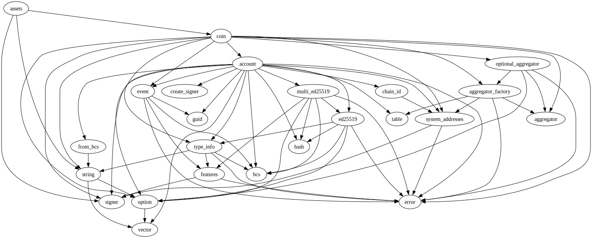
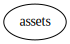

# Module `0xc0deb00c::assets`

Mock asset types for on- and off-chain testing.

-  [Resource `CoinCapabilities`](#0xc0deb00c_assets_CoinCapabilities)
-  [Struct `BC`](#0xc0deb00c_assets_BC)
-  [Struct `QC`](#0xc0deb00c_assets_QC)
-  [Struct `UC`](#0xc0deb00c_assets_UC)
-  [Constants](#@Constants_0)
-  [Function `burn`](#0xc0deb00c_assets_burn)
-  [Function `mint`](#0xc0deb00c_assets_mint)
-  [Function `init_coin_type`](#0xc0deb00c_assets_init_coin_type)
-  [Function `init_module`](#0xc0deb00c_assets_init_module)

<pre><code><b>use</b> <a href="">0x1::coin</a>;
<b>use</b> <a href="">0x1::signer</a>;
<b>use</b> <a href="">0x1::string</a>;
</code></pre>

##### Show all the modules that "assets" depends on directly or indirectly

##### Show all the modules that depend on "assets" directly or indirectly

## Resource `CoinCapabilities`

Stores mock coin type capabilities.

<pre><code><b>struct</b> <a href="assets.md#0xc0deb00c_assets_CoinCapabilities">CoinCapabilities</a>&lt;CoinType&gt; <b>has</b> key
</code></pre>

##### Fields

<dl>
<dt>
<code>burn_capability: <a href="_BurnCapability">coin::BurnCapability</a>&lt;CoinType&gt;</code>
</dt>
<dd>

</dd>
<dt>
<code>freeze_capability: <a href="_FreezeCapability">coin::FreezeCapability</a>&lt;CoinType&gt;</code>
</dt>
<dd>

</dd>
<dt>
<code>mint_capability: <a href="_MintCapability">coin::MintCapability</a>&lt;CoinType&gt;</code>
</dt>
<dd>

</dd>
</dl>

## Struct `BC`

Base coin type.

<pre><code><b>struct</b> <a href="assets.md#0xc0deb00c_assets_BC">BC</a>
</code></pre>

##### Fields

<dl>
<dt>
<code>dummy_field: bool</code>
</dt>
<dd>

</dd>
</dl>

## Struct `QC`

Quote coin type.

<pre><code><b>struct</b> <a href="assets.md#0xc0deb00c_assets_QC">QC</a>
</code></pre>

##### Fields

<dl>
<dt>
<code>dummy_field: bool</code>
</dt>
<dd>

</dd>
</dl>

## Struct `UC`

Utility coin type.

<pre><code><b>struct</b> <a href="assets.md#0xc0deb00c_assets_UC">UC</a>
</code></pre>

##### Fields

<dl>
<dt>
<code>dummy_field: bool</code>
</dt>
<dd>

</dd>
</dl>

## Constants

Base coin decimals.

<pre><code><b>const</b> <a href="assets.md#0xc0deb00c_assets_BASE_COIN_DECIMALS">BASE_COIN_DECIMALS</a>: u8 = 4;
</code></pre>

Base coin name.

<pre><code><b>const</b> <a href="assets.md#0xc0deb00c_assets_BASE_COIN_NAME">BASE_COIN_NAME</a>: <a href="">vector</a>&lt;u8&gt; = [66, 97, 115, 101, 32, 99, 111, 105, 110];
</code></pre>

Base coin symbol.

<pre><code><b>const</b> <a href="assets.md#0xc0deb00c_assets_BASE_COIN_SYMBOL">BASE_COIN_SYMBOL</a>: <a href="">vector</a>&lt;u8&gt; = [66, 67];
</code></pre>

Coin capabilities have already been initialized.

<pre><code><b>const</b> <a href="assets.md#0xc0deb00c_assets_E_HAS_CAPABILITIES">E_HAS_CAPABILITIES</a>: u64 = 1;
</code></pre>

Caller is not Econia.

<pre><code><b>const</b> <a href="assets.md#0xc0deb00c_assets_E_NOT_ECONIA">E_NOT_ECONIA</a>: u64 = 0;
</code></pre>

Quote coin decimals.

<pre><code><b>const</b> <a href="assets.md#0xc0deb00c_assets_QUOTE_COIN_DECIMALS">QUOTE_COIN_DECIMALS</a>: u8 = 12;
</code></pre>

Quote coin name.

<pre><code><b>const</b> <a href="assets.md#0xc0deb00c_assets_QUOTE_COIN_NAME">QUOTE_COIN_NAME</a>: <a href="">vector</a>&lt;u8&gt; = [81, 117, 111, 116, 101, 32, 99, 111, 105, 110];
</code></pre>

Quote coin symbol.

<pre><code><b>const</b> <a href="assets.md#0xc0deb00c_assets_QUOTE_COIN_SYMBOL">QUOTE_COIN_SYMBOL</a>: <a href="">vector</a>&lt;u8&gt; = [81, 67];
</code></pre>

Utility coin decimals.

<pre><code><b>const</b> <a href="assets.md#0xc0deb00c_assets_UTILITY_COIN_DECIMALS">UTILITY_COIN_DECIMALS</a>: u8 = 10;
</code></pre>

Utility coin name.

<pre><code><b>const</b> <a href="assets.md#0xc0deb00c_assets_UTILITY_COIN_NAME">UTILITY_COIN_NAME</a>: <a href="">vector</a>&lt;u8&gt; = [85, 116, 105, 108, 105, 116, 121, 32, 99, 111, 105, 110];
</code></pre>

Utility coin symbol.

<pre><code><b>const</b> <a href="assets.md#0xc0deb00c_assets_UTILITY_COIN_SYMBOL">UTILITY_COIN_SYMBOL</a>: <a href="">vector</a>&lt;u8&gt; = [85, 67];
</code></pre>

## Function `burn`

Burn <code>coins</code> for which <code>CoinType</code> is defined at Econia account.

<pre><code><b>public</b> <b>fun</b> <a href="assets.md#0xc0deb00c_assets_burn">burn</a>&lt;CoinType&gt;(coins: <a href="_Coin">coin::Coin</a>&lt;CoinType&gt;)
</code></pre>

##### Implementation

<pre><code><b>public</b> <b>fun</b> <a href="assets.md#0xc0deb00c_assets_burn">burn</a>&lt;CoinType&gt;(
    coins: <a href="_Coin">coin::Coin</a>&lt;CoinType&gt;
) <b>acquires</b> <a href="assets.md#0xc0deb00c_assets_CoinCapabilities">CoinCapabilities</a> {
    // Borrow immutable reference <b>to</b> burn capability.
    <b>let</b> burn_capability = &<b>borrow_global</b>&lt;<a href="assets.md#0xc0deb00c_assets_CoinCapabilities">CoinCapabilities</a>&lt;CoinType&gt;&gt;(
            @econia).burn_capability;
    <a href="_burn">coin::burn</a>&lt;CoinType&gt;(coins, burn_capability); // Burn coins.
}
</code></pre>

## Function `mint`

Mint new <code>amount</code> of <code>CoinType</code>, aborting if not called by
Econia account.

<pre><code><b>public</b> <b>fun</b> <a href="assets.md#0xc0deb00c_assets_mint">mint</a>&lt;CoinType&gt;(<a href="">account</a>: &<a href="">signer</a>, amount: u64): <a href="_Coin">coin::Coin</a>&lt;CoinType&gt;
</code></pre>

##### Implementation

<pre><code><b>public</b> <b>fun</b> <a href="assets.md#0xc0deb00c_assets_mint">mint</a>&lt;CoinType&gt;(
    <a href="">account</a>: &<a href="">signer</a>,
    amount: u64
): <a href="_Coin">coin::Coin</a>&lt;CoinType&gt;
<b>acquires</b> <a href="assets.md#0xc0deb00c_assets_CoinCapabilities">CoinCapabilities</a> {
    // Get <a href="">account</a> <b>address</b>.
    <b>let</b> account_address = address_of(<a href="">account</a>); // Get <a href="">account</a> <b>address</b>.
    // Assert caller is Econia.
    <b>assert</b>!(account_address == @econia, <a href="assets.md#0xc0deb00c_assets_E_NOT_ECONIA">E_NOT_ECONIA</a>);
    // Borrow immutable reference <b>to</b> mint capability.
    <b>let</b> mint_capability = &<b>borrow_global</b>&lt;<a href="assets.md#0xc0deb00c_assets_CoinCapabilities">CoinCapabilities</a>&lt;CoinType&gt;&gt;(
            account_address).mint_capability;
    // Mint specified amount.
    <a href="_mint">coin::mint</a>&lt;CoinType&gt;(amount, mint_capability)
}
</code></pre>

## Function `init_coin_type`

Initialize given coin type under Econia account.

<pre><code><b>fun</b> <a href="assets.md#0xc0deb00c_assets_init_coin_type">init_coin_type</a>&lt;CoinType&gt;(<a href="">account</a>: &<a href="">signer</a>, coin_name: <a href="">vector</a>&lt;u8&gt;, coin_symbol: <a href="">vector</a>&lt;u8&gt;, decimals: u8)
</code></pre>

##### Implementation

<pre><code><b>fun</b> <a href="assets.md#0xc0deb00c_assets_init_coin_type">init_coin_type</a>&lt;CoinType&gt;(
    <a href="">account</a>: &<a href="">signer</a>,
    coin_name: <a href="">vector</a>&lt;u8&gt;,
    coin_symbol: <a href="">vector</a>&lt;u8&gt;,
    decimals: u8,
) {
    // Assert caller is Econia.
    <b>assert</b>!(address_of(<a href="">account</a>) == @econia, <a href="assets.md#0xc0deb00c_assets_E_NOT_ECONIA">E_NOT_ECONIA</a>);
    // Assert Econia does not already have <a href="">coin</a> capabilities stored.
    <b>assert</b>!(!<b>exists</b>&lt;<a href="assets.md#0xc0deb00c_assets_CoinCapabilities">CoinCapabilities</a>&lt;CoinType&gt;&gt;(@econia),
        <a href="assets.md#0xc0deb00c_assets_E_HAS_CAPABILITIES">E_HAS_CAPABILITIES</a>);
    // Initialize <a href="">coin</a>, storing capabilities.
    <b>let</b> (burn_capability, freeze_capability, mint_capability) =
    <a href="_initialize">coin::initialize</a>&lt;CoinType&gt;(
        <a href="">account</a>, utf8(coin_name), utf8(coin_symbol), decimals, <b>false</b>);
    <b>move_to</b>&lt;<a href="assets.md#0xc0deb00c_assets_CoinCapabilities">CoinCapabilities</a>&lt;CoinType&gt;&gt;(<a href="">account</a>,
        <a href="assets.md#0xc0deb00c_assets_CoinCapabilities">CoinCapabilities</a>&lt;CoinType&gt;{
            burn_capability,
            freeze_capability,
            mint_capability
    }); // Store capabilities under Econia <a href="">account</a>.
}
</code></pre>

## Function `init_module`

Initialize mock base, quote, and utility coin types upon genesis
publication.

<pre><code><b>fun</b> <a href="assets.md#0xc0deb00c_assets_init_module">init_module</a>(<a href="">account</a>: &<a href="">signer</a>)
</code></pre>

##### Implementation

<pre><code><b>fun</b> <a href="assets.md#0xc0deb00c_assets_init_module">init_module</a>(
    <a href="">account</a>: &<a href="">signer</a>
) {
    <a href="assets.md#0xc0deb00c_assets_init_coin_type">init_coin_type</a>&lt;<a href="assets.md#0xc0deb00c_assets_BC">BC</a>&gt;(<a href="">account</a>, <a href="assets.md#0xc0deb00c_assets_BASE_COIN_NAME">BASE_COIN_NAME</a>, <a href="assets.md#0xc0deb00c_assets_BASE_COIN_SYMBOL">BASE_COIN_SYMBOL</a>,
        <a href="assets.md#0xc0deb00c_assets_BASE_COIN_DECIMALS">BASE_COIN_DECIMALS</a>); // Initialize mock base <a href="">coin</a>.
    <a href="assets.md#0xc0deb00c_assets_init_coin_type">init_coin_type</a>&lt;<a href="assets.md#0xc0deb00c_assets_QC">QC</a>&gt;(<a href="">account</a>, <a href="assets.md#0xc0deb00c_assets_QUOTE_COIN_NAME">QUOTE_COIN_NAME</a>, <a href="assets.md#0xc0deb00c_assets_QUOTE_COIN_SYMBOL">QUOTE_COIN_SYMBOL</a>,
        <a href="assets.md#0xc0deb00c_assets_QUOTE_COIN_DECIMALS">QUOTE_COIN_DECIMALS</a>); // Initialize mock quote <a href="">coin</a>.
    <a href="assets.md#0xc0deb00c_assets_init_coin_type">init_coin_type</a>&lt;<a href="assets.md#0xc0deb00c_assets_UC">UC</a>&gt;(<a href="">account</a>, <a href="assets.md#0xc0deb00c_assets_UTILITY_COIN_NAME">UTILITY_COIN_NAME</a>, <a href="assets.md#0xc0deb00c_assets_UTILITY_COIN_SYMBOL">UTILITY_COIN_SYMBOL</a>,
        <a href="assets.md#0xc0deb00c_assets_UTILITY_COIN_DECIMALS">UTILITY_COIN_DECIMALS</a>); // Initialize mock utility <a href="">coin</a>.
}
</code></pre>
