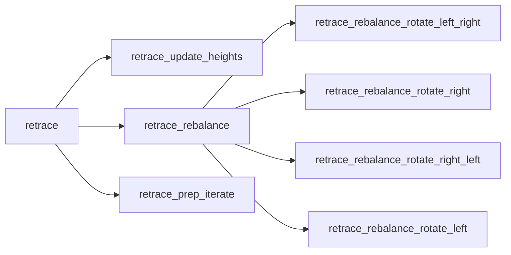
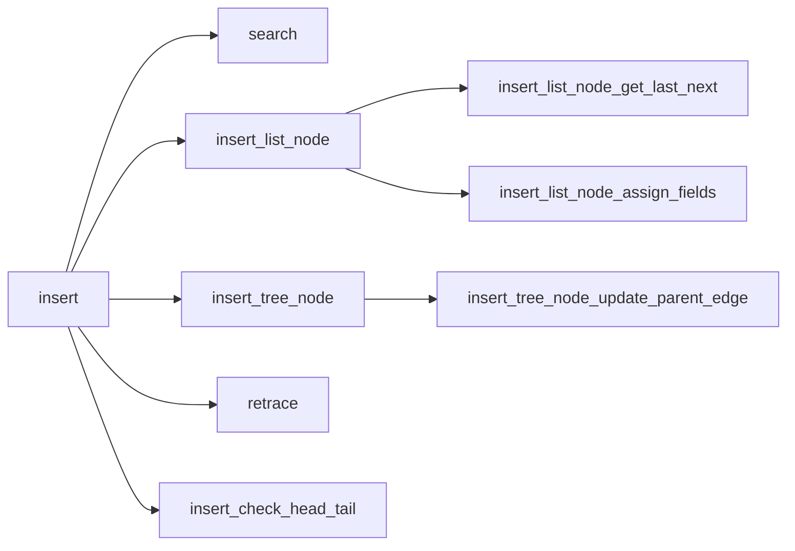
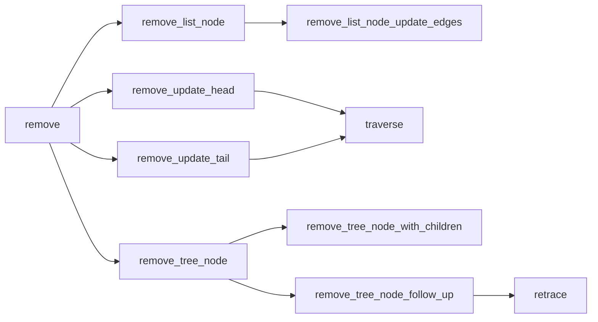
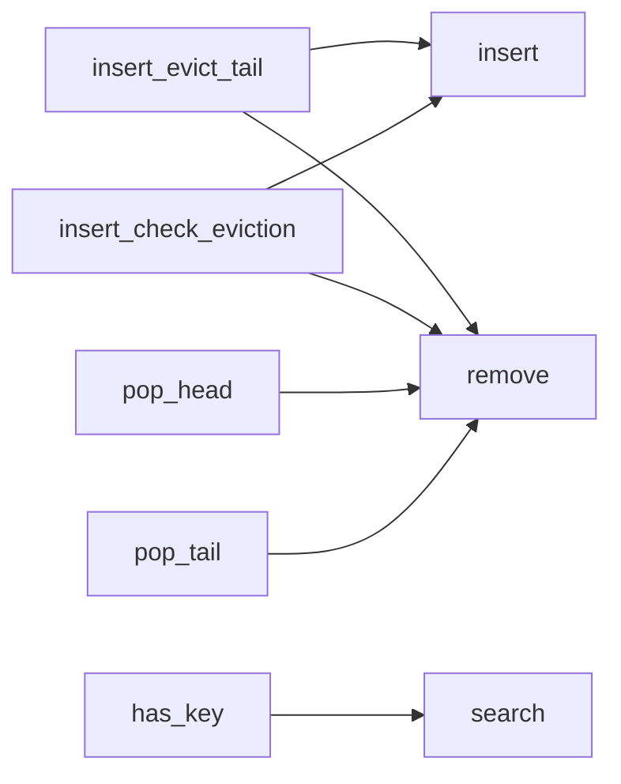

<a name="0xc0deb00c_avl_queue"></a>

# Module `0xc0deb00c::avl_queue`

AVL queue: a hybrid between an AVL tree and a queue.

The present implementation involves an Adelson-Velsky and Landis
(AVL) tree, where each tree node has an enclosed doubly linked list.
Tree nodes correspond to keys from key-value insertion pairs, and
list nodes correspond to distinct insertion values sharing the same
insertion key. Hence tree node insertion keys are sorted in
lexicographical order, while list node insertion values are sorted
in order of insertion within a corresponding doubly linked list, to
the effect that key-value insertion pairs can be popped from the
head of the AVL queue in:

1. Either ascending or descending order of insertion key (with
sort order set upon initialization), then by
2. Ascending order of insertion within a doubly linked list.

Like an AVL tree, the present implementation also allows for
insertions and removals from anywhere inside the data structure.


<a name="@General_overview_sections_0"></a>

## General overview sections


[AVL trees](#avl-trees)

* [Height invariant](#height-invariant)
* [Rotations](#rotations)
* [Retracing](#retracing)
* [As a map](#as-a-map)

[AVL queues](#avl-queues)

* [Key storage multiplicity](#key-storage-multiplicity)
* [Sort order](#sort-order)
* [Node structure](#node-structure)
* [Node provisioning](#node-provisioning)
* [Access keys](#access-keys)
* [Height](#height)

[Implementation analysis](#implementation-analysis)

* [Gas considerations](#gas-considerations)
* [Test development](#test-development)
* [Public function index](#public-function-index)
* [Dependency charts](#dependency-charts)

[Bit conventions](#bit-conventions)

* [Number](#number)
* [Status](#status)
* [Masking](#masking)

[References](#references)

[Complete DocGen index](#complete-docgen-index)


<a name="@AVL_trees_1"></a>

## AVL trees


<a name="@Height_invariant_2"></a>

### Height invariant


An AVL tree is a self-balancing binary search tree where the height
of a node's two child subtrees differ by at most one. For example:

>         3
>        / \
>       2   5
>      /   / \
>     1   4   7
>            / \
>           6   8

Here, node 3's left child subtree has height 1 while its right child
subtree has height 2. Similarly, all other nodes satisfy the AVL
height invariant.


<a name="@Rotations_3"></a>

### Rotations


Continuing the above example, if node 4 were to be removed then node
5 would violate the height invariant:

>         3
>        / \
>       2   5
>      /     \
>     1       7
>            / \
>           6   8

Here, a left rotation is necessary to rebalance the tree, yielding:

>         3
>        / \
>       2   7
>      /   / \
>     1   5   8
>          \
>           6

Rotations are required whenever an insertion or removal leads to a
violation of the AVL height invariant.


<a name="@Retracing_4"></a>

### Retracing


Similarly, insertion and removal operations may require retracing up
to the root, a process that updates node-wise state pertaining to
the height invariant.

Here, some implementations encode in each node a  "balance factor"
that describes whether a given node is left-heavy, right-heavy, or
balanced, while others track the height at a given node, as in the
present implementation. For example, consider the following tree:

>       2
>      / \
>     1   3

Here, nodes 1 and 3 have height 0, while node 2 has height 1.
Inserting 4 yields:

>       2
>      / \
>     1   3
>          \
>           4

Now node 4 has height 0, and the heights of nodes 3 and 2 have both
increased by 1. In practice, this means that inserting node 4 will
require modifying state in node 3 and in node 2, by looping back up
to the root to update heights, checking along the way whether a
height modification leads to an invariant violation.


<a name="@As_a_map_5"></a>

### As a map


AVL trees can be used as an associative array that maps from keys to
values, simply by storing values in the leaves of the tree. For
example, the insertion sequence

1. $\langle 2, a \rangle$
2. $\langle 3, b \rangle$
3. $\langle 1, c \rangle$
4. $\langle 4, d \rangle$

produces:

>          <2, a>
>          /    \
>     <1, c>    <3, b>
>                    \
>                    <4, d>

Notably, in an AVL tree, keys can only be inserted once, such that
inserting $\langle 2, e \rangle$ to the above tree would be invalid
unless $\langle 2, a \rangle$ were first removed.


<a name="@AVL_queues_6"></a>

## AVL queues


<a name="@Key_storage_multiplicity_7"></a>

### Key storage multiplicity


Unlike an AVL tree, which can only store one instance of a given
key, AVL queues can store multiple instances. For example, the
following insertion sequence, without intermediate removals, is
invalid in an AVL tree but valid in an AVL queue:

1. $p_{3, 0} = \langle 3, 5 \rangle$
2. $p_{3, 1} = \langle 3, 8 \rangle$
3. $p_{3, 2} = \langle 3, 2 \rangle$
4. $p_{3, 3} = \langle 3, 5 \rangle$

Here, the "key-value insertion pair"
$p_{i, j} = \langle i, v_j \rangle$ has:

* "Insertion key" $i$: the inserted key.
* "Insertion count" $j$: the number of key-value insertion pairs,
having the same insertion key, that were previously inserted.
* "Insertion value" $v_j$: the value from the key-value
insertion pair having insertion count $j$.


<a name="@Sort_order_8"></a>

### Sort order


Key-value insertion pairs in an AVL queue are sorted by:

1. Either ascending or descending order of insertion key, then by
2. Ascending order of insertion count.

For example, consider the key-value pair insertion pairs inserted in
the following sequence:

1. $p_{1, 0} = \langle 1, a \rangle$
2. $p_{3, 0} = \langle 3, b \rangle$
3. $p_{3, 1} = \langle 3, c \rangle$
4. $p_{1, 1} = \langle 1, d \rangle$
5. $p_{2, 0} = \langle 2, e \rangle$

In an ascending AVL queue, the dequeue sequence would be:

1. $p_{1, 0} = \langle 1, a \rangle$
2. $p_{1, 1} = \langle 1, d \rangle$
3. $p_{2, 0} = \langle 2, e \rangle$
4. $p_{3, 0} = \langle 3, b \rangle$
5. $p_{3, 1} = \langle 3, c \rangle$

In a descending AVL queue, the dequeue sequence would instead be:

1. $p_{3, 0} = \langle 3, b \rangle$
2. $p_{3, 1} = \langle 3, c \rangle$
3. $p_{2, 0} = \langle 2, e \rangle$
4. $p_{1, 0} = \langle 1, a \rangle$
5. $p_{1, 1} = \langle 1, d \rangle$


<a name="@Node_structure_9"></a>

### Node structure


Continuing the above example, key-value insertion pairs would be
stored in an ascending AVL queue as follows:

>                              2 [e]
>                             / \
>                   [a -> d] 1   3 [b -> c]
>     AVL queue head ^                   ^ AVL queue tail

In a descending AVL queue:

>                         2 [e]
>                        / \
>              [a -> d] 1   3 [b -> c]
>     AVL queue tail ^         ^ AVL queue head

For each case, the tree node with insertion key 1 has a doubly
linked list where the head list node has insertion value a, and the
tail list node has insertion value d. Similarly, the tree node with
insertion key 3 has a doubly linked list where the head list node
has insertion value b, and the tail list node has insertion value c.


<a name="@Node_provisioning_10"></a>

### Node provisioning


Tree nodes and list nodes are stored as hash table entries, and thus
incur per-item global storage costs on the Aptos blockchain. As of
the time of this writing, per-item creation costs are by far the
most expensive per-item operation, and moreover, there is no
incentive to deallocate from memory. Hence the typical approach of
allocating a node upon insertion and deallocating upon removal is
more costly than the approach taken in the present implementation,
which involves re-using nodes once they have been allocated.

More specifically, when a tree node or list node is removed from the
AVL queue, it is pushed onto a stack of inactive nodes for the
corresponding type. Then, when an insertion operation requires a new
node, the inactive node can be popped off the top of the stack and
overwritten. Rather than allocating a new node for each insertion
and deallocating for each removal, this approach minimizes per-item
creation costs. Additionally, nodes can be pre-allocated upon AVL
queue initialization and pushed directly on the inactive nodes stack
so as to reduce per-item costs for future operations.

Since each active tree node contains a doubly linked list having at
least one active list node, the number of active tree nodes is
less than or equal to the number of active list nodes.

Tree nodes and list nodes are each assigned a 1-indexed 14-bit
serial ID known as a node ID. Node ID 0 is reserved for null, such
that the maximum number of allocated nodes for each node type is
thus $2^{14} - 1 = 16383$.

To additionally reduce costs, insertion values are not stored in
list nodes, but are also stored as hash table entries, accessed via
the corresponding list node ID. This approach reduces per-byte costs
associated with list node operations: if a list node is removed from
the middle of a doubly linked list, for example, per-byte write
costs will only be assessed on the next and last fields of the
removed node's neighbors, and will not be assessed on the neighbors'
insertion values.


<a name="@Access_keys_11"></a>

### Access keys


When a key-value insertion pair is inserted to the AVL queue, an
"access key" is returned, and can be used for subsequent lookup
operations. Access keys have the following bit structure:

| Bit(s) | Data                                         |
|--------|----------------------------------------------|
| 47-60  | Tree node ID                                 |
| 33-46  | List node ID                                 |
| 32     | If set, ascending AVL queue, else descending |
| 0-31   | Insertion key                                |

Insertion values are indexed by list node ID, and since the list
node ID for an insertion value is encoded in the access key
returned upon insertion, access keys can be used for $O(1)$ list
node lookup.

With the exception of list nodes at the head or tail of their
corresponding doubly linked list, list nodes do not, however,
indicate the corresponding tree node in which their doubly linked
list is located. This means that the corresponding tree node ID
and insertion key encoded in an access key are not verified from the
provided access key during lookup, as this process would require
$O(\log_2 n)$ lookup on the tree node.

Lookup operations thus assume that the provided access key
corresponds to a valid list node in the given AVL queue, and are
subject to undefined behavior if this condition is not met.

Notably, access keys are guaranteed to be unique within an AVL queue
at any given time, but are not guaranteed to be unique within an
AVL queue across time: since node IDs are reused per the stack-based
allocation strategy above, the same access key can be issued
multiple times. Hence it is up to callers to ensure appropriate
management of access keys, which effectively function as pointers
into AVL queue memory. Notably, if a caller wishes to uniquely
identify issued access keys, the caller can simply concatenate
access keys with a global counter.

Bits 0-32 are not required for lookup operations, but rather, are
included in access keys simply to provide additional metadata.


<a name="@Height_12"></a>

### Height


In the present implementation, left or right height denotes the
height of a node's left or right subtree, respectively, plus one.
Subtree height is adjusted by one to avoid negative numbers, with
the resultant value denoting the height of a tree rooted at the
given node, accounting only for height to the given side. The height
of a node is denoted as the larger of its left height and right
height:

>       2
>      / \
>     1   3
>          \
>           4

| Key | Left height | Right height | Height |
|-----|-------------|--------------|--------|
| 1   | 0           | 0            | 0      |
| 2   | 1           | 2            | 2      |
| 3   | 0           | 1            | 1      |
| 4   | 0           | 0            | 0      |

The overall height $h$ of a tree (the height of the root node) is
related to the number of levels $l$ in the tree by the equation
$h = l - 1$, and for an AVL tree of size $n \geq 1$ nodes, the
number of levels in the tree lies in the interval

$$\log_2(n + 1) \leq l \leq c \log_2(n + d) + b$$

where

* $\varphi = \frac{1 + \sqrt{5}}{2} \approx 1.618$ (the golden
ratio),
* $c = \frac{1}{\log_2 \varphi} \approx 1.440$ ,
* $b = \frac{c}{2} \log_2 5 - 2 \approx -0.3277$ , and
* $d = 1 + \frac{1}{\varphi^4 \sqrt{5}} \approx 1.065$ .

With a maximum node count of $n_{max} = 2^{14} - 1 = 16383$, the
the maximum height $h_{max}$ of an AVL tree in the present
implementation is thus

$$h_{max} = \lfloor c \log_2(n_{max} + d) + b \rfloor - 1 = 18$$

such that left height and right height can always be encoded in
$b_{max} = \lceil \log_2 h_{max} \rceil = 5$ bits each.

Similarly, for a given height the size of an AVL tree is at most

$$log_2(n + 1) \leq h + 1$$

$$n + 1 \leq 2^{h + 1}$$

$$n \leq 2^{h + 1} - 1$$

and at least

$$c \log_2(n + d) + b \geq h + 1$$

$$\log_{\varphi}(n + d) + b \geq h + 1$$

$$\log_{\varphi}(n + d) \geq h + 1 - b$$

$$n + d \geq \varphi^{h + 1 - b}$$

$$n \geq \varphi^{h + 1 - b} - d$$

such that size lies in the interval

$$\varphi ^ {h +1 - b} - d \leq n \leq 2^{h + 1} - 1$$

which, for the special case of $h = 1$, results in the integer lower
bound

$$n_{h = 1} \geq \varphi ^ {1 + 1 - b} - d$$

$$n_{h = 1} \geq \varphi ^ {2 - b} - d$$

$$n_{h = 1} \geq \varphi ^ {2 - (\frac{c}{2}\log_2 5 - 2)} - d$$

$$n_{h = 1} \geq \varphi ^ {4 - \frac{c}{2}\log_2 5} - d$$

$$n_{h = 1} \geq \varphi ^ {4 - \frac{1}{2}\log_\varphi 5} - d$$

$$n_{h = 1} \geq \varphi ^ {4 - \log_\varphi \sqrt{5}} - d$$

$$n_{h = 1} \geq \varphi^4 / \varphi^{\log_\varphi \sqrt{5}} - d$$

$$n_{h = 1} \geq \varphi^4 / \sqrt{5} - d$$

$$n_{h = 1} \geq \varphi^4/\sqrt{5}-(1+1/(\varphi^4 \sqrt{5}))$$

$$n_{h=1}\geq(1+s)^4/(2^4s)-1-2^4/((1+s)^4s), s = \sqrt{5}$$

$$n_{h=1}\geq\frac{(1+s)^4}{2^4s}-\frac{2^4}{s(1+s)^4}-1$$

$$n_{h = 1} \geq 2$$

with the final step verifiable via a computer algebra system like
WolframAlpha. Thus for the heights possible in the present
implementation (and for one height higher):

| Height       | Minimum size | Maximum size    |
|--------------|--------------|-----------------|
| 0            | 1            | 1               |
| 1            | 2            | 3               |
| 2            | 4            | 7               |
| 3            | 7            | 15              |
| 4            | 12           | 31              |
| 5            | 20           | 63              |
| 6            | 33           | 127             |
| 7            | 54           | 255             |
| 8            | 88           | 511             |
| 9            | 143          | 1023            |
| 10           | 232          | 2047            |
| 11           | 376          | 4095            |
| 12           | 609          | 8191            |
| 13           | 986          | 16383 (<code>n_max</code>) |
| 14           | 1596         | 32767           |
| 15           | 2583         | 65535           |
| 16           | 4180         | 131071          |
| 17           | 6764         | 262143          |
| 18 (<code>h_max</code>) | 10945        | 524287          |
| 19           | 17710        | 1048575         |

Supporting Python calculations:

```python
>>> import math
>>> phi = (1 + math.sqrt(5)) / 2
>>> phi
1.618033988749895
>>> c = 1 / math.log(phi, 2)
>>> c
1.4404200904125564
>>> b = c / 2 * math.log(5, 2) - 2
>>> b
-0.32772406181544556
>>> d = 1 + 1 / (phi ** 4 * math.sqrt(5))
>>> d
1.0652475842498528
>>> n_max = 2 ** 14 - 1
>>> n_max
16383
>>> h_max = math.floor(c * math.log(n_max + d, 2) + b) - 1
>>> h_max
18
>>> b_max = math.ceil(math.log(h_max, 2))
>>> b_max
5
>>> for h in range(h_max + 2):
...     if h == 1:
...         n_min = 2
...     else:
...         n_min = phi ** (h + 1 - b) - d
...     n_max = 2 ** (h + 1) - 1
...     n_min_ceil = math.ceil(n_min)
...     print(f"h: {h}, n_min: {n_min_ceil}, n_max: {n_max}, "
...           f"n_min_raw: {n_min}")
...
h: 0, n_min: 1, n_max: 1, n_min_raw: 0.8291796067500634
h: 1, n_min: 2, n_max: 3, n_min_raw: 2
h: 2, n_min: 4, n_max: 7, n_min_raw: 3.894427190999917
h: 3, n_min: 7, n_max: 15, n_min_raw: 6.959674775249768
h: 4, n_min: 12, n_max: 31, n_min_raw: 11.919349550499538
h: 5, n_min: 20, n_max: 63, n_min_raw: 19.944271909999163
h: 6, n_min: 33, n_max: 127, n_min_raw: 32.92886904474855
h: 7, n_min: 54, n_max: 255, n_min_raw: 53.93838853899757
h: 8, n_min: 88, n_max: 511, n_min_raw: 87.93250516799598
h: 9, n_min: 143, n_max: 1023, n_min_raw: 142.93614129124342
h: 10, n_min: 232, n_max: 2047, n_min_raw: 231.93389404348926
h: 11, n_min: 376, n_max: 4095, n_min_raw: 375.9352829189826
h: 12, n_min: 609, n_max: 8191, n_min_raw: 608.9344245467217
h: 13, n_min: 986, n_max: 16383, n_min_raw: 985.9349550499542
h: 14, n_min: 1596, n_max: 32767, n_min_raw: 1595.9346271809259
h: 15, n_min: 2583, n_max: 65535, n_min_raw: 2582.93482981513
h: 16, n_min: 4180, n_max: 131071, n_min_raw: 4179.934704580306
h: 17, n_min: 6764, n_max: 262143, n_min_raw: 6763.934781979686
h: 18, n_min: 10945, n_max: 524287, n_min_raw: 10944.93473414424
h: 19, n_min: 17710, n_max: 1048575, n_min_raw: 17709.934763708177
```


<a name="@Implementation_analysis_13"></a>

## Implementation analysis


<a name="@Gas_considerations_14"></a>

### Gas considerations


The present implementation relies on bit packing in assorted forms
to minimize per-byte storage costs: insertion keys are at most 32
bits and node IDs are 14 bits, for example, for maximum data
compression. Notably, associated bit packing operations are manually
inlined to reduce the number of function calls: as of the time of
this writing, instruction gas for 15 function calls costs the same
as a single per-item read out of global storage. Hence inlined
bit packing significantly reduces the number of function calls when
compared against an implementation with frequent calls to helper
functions of the form <code>mask_in_bits(target, incoming, shift)</code>.

As of the time of this writing, per-item reads and per-item writes
cost the same amount of storage gas, per-item writes cost 60 times
as much as per-byte writes, and per-byte writes cost approximately
16.7 times as much as per-item writes. Hence with tree nodes only
occupying 128 bits (16 bytes), writing to a tree node only costs
about 25% more then reading a tree node.

With storage gas only assessed on a per-transaction basis, this
means that inserting a tree node and retracing all the way back up
to the root only costs 25% more than does the $O(\log_2 n)$ lookup
required for a key search, assuming no rebalancing takes place:
per-item read costs are assessed on the way down, then replaced by
per-item write costs on the way back up.

As for rebalancing, this process is only (potentially) required for
operations that alter the number of tree nodes: if key-value
insertion pair operations consistently involve the same insertion
keys, then tree retracing and rebalancing operations are minimized.

In the case that rebalancing does occur, per-item write costs on the
affected nodes are essentially amortized against the gas reductions
afforded by an AVL tree's height guarantees: the height of a
red-black tree is at most $2 \log_2 n$, for example, but the
height of an AVL tree is at most approximately $1.44 \log_2 n$
(per above). This means that fewer per-item costs are assessed on
key lookup for the latter, and moreover, re-coloring operations
required for the former may still require looping back up to the
root in the worst case, resulting in higher per-item write costs.


<a name="@Test_development_15"></a>

### Test development


Unit tests for the present implementation were written alongside
source code, with some integration refactors applied along the way.
For example, rotation tests were first devised based on manual
allocation of nodes, then some were later updated for specific
insertion and deletion scenarios. As such, syntax may vary
slightly between some test cases depending on the level to which
they were later scoped for integration.


<a name="@Public_function_index_16"></a>

### Public function index


* <code><a href="avl_queue.md#0xc0deb00c_avl_queue_borrow">borrow</a>()</code>
* <code><a href="avl_queue.md#0xc0deb00c_avl_queue_borrow_head">borrow_head</a>()</code>
* <code><a href="avl_queue.md#0xc0deb00c_avl_queue_borrow_head_mut">borrow_head_mut</a>()</code>
* <code><a href="avl_queue.md#0xc0deb00c_avl_queue_borrow_mut">borrow_mut</a>()</code>
* <code><a href="avl_queue.md#0xc0deb00c_avl_queue_borrow_tail">borrow_tail</a>()</code>
* <code><a href="avl_queue.md#0xc0deb00c_avl_queue_borrow_tail_mut">borrow_tail_mut</a>()</code>
* <code><a href="avl_queue.md#0xc0deb00c_avl_queue_get_access_key_insertion_key">get_access_key_insertion_key</a>()</code>
* <code><a href="avl_queue.md#0xc0deb00c_avl_queue_get_head_key">get_head_key</a>()</code>
* <code><a href="avl_queue.md#0xc0deb00c_avl_queue_get_height">get_height</a>()</code>
* <code><a href="avl_queue.md#0xc0deb00c_avl_queue_get_tail_key">get_tail_key</a>()</code>
* <code><a href="avl_queue.md#0xc0deb00c_avl_queue_has_key">has_key</a>()</code>
* <code><a href="avl_queue.md#0xc0deb00c_avl_queue_insert">insert</a>()</code>
* <code><a href="avl_queue.md#0xc0deb00c_avl_queue_insert_check_eviction">insert_check_eviction</a>()</code>
* <code><a href="avl_queue.md#0xc0deb00c_avl_queue_insert_evict_tail">insert_evict_tail</a>()</code>
* <code><a href="avl_queue.md#0xc0deb00c_avl_queue_is_ascending">is_ascending</a>()</code>
* <code><a href="avl_queue.md#0xc0deb00c_avl_queue_is_ascending_access_key">is_ascending_access_key</a>()</code>
* <code><a href="avl_queue.md#0xc0deb00c_avl_queue_is_empty">is_empty</a>()</code>
* <code><a href="avl_queue.md#0xc0deb00c_avl_queue_new">new</a>()</code>
* <code><a href="avl_queue.md#0xc0deb00c_avl_queue_pop_head">pop_head</a>()</code>
* <code><a href="avl_queue.md#0xc0deb00c_avl_queue_pop_tail">pop_tail</a>()</code>
* <code><a href="avl_queue.md#0xc0deb00c_avl_queue_remove">remove</a>()</code>
* <code><a href="avl_queue.md#0xc0deb00c_avl_queue_would_update_head">would_update_head</a>()</code>
* <code><a href="avl_queue.md#0xc0deb00c_avl_queue_would_update_tail">would_update_tail</a>()</code>


<a name="@Dependency_charts_17"></a>

### Dependency charts


The below dependency charts use <code>mermaid.js</code> syntax, which can be
automatically rendered into a diagram (depending on the browser)
when viewing the documentation file generated from source code. If
a browser renders the diagrams with coloring that makes it difficult
to read, try a different browser.

<code><a href="avl_queue.md#0xc0deb00c_avl_queue_retrace">retrace</a>()</code>:



<code><a href="avl_queue.md#0xc0deb00c_avl_queue_insert">insert</a>()</code>:



<code><a href="avl_queue.md#0xc0deb00c_avl_queue_remove">remove</a>()</code>:



Assorted:




<a name="@Bit_conventions_18"></a>

## Bit conventions


<a name="@Number_19"></a>

### Number


Bit numbers are 0-indexed from the least-significant bit (LSB):

>     11101...1010010101
>       bit 5 = 0 ^    ^ bit 0 = 1


<a name="@Status_20"></a>

### Status


<code>0</code> is considered an "unset" bit, and <code>1</code> is considered a "set" bit.
Hence <code>11101</code> is set at bit 0 and unset at bit 1.


<a name="@Masking_21"></a>

### Masking


In the present implementation, a bitmask refers to a bitstring that
is only set at the indicated bit. For example, a bitmask with bit 0
set corresponds to <code>000...001</code>, and a bitmask with bit 3 set
corresponds to <code>000...01000</code>.


<a name="@References_22"></a>

## References


* [Adelson-Velsky and Landis 1962] (original paper)
* [Galles 2011] (interactive visualizer)
* [Wikipedia 2022]

[Adelson-Velsky and Landis 1962]:
https://zhjwpku.com/assets/pdf/AED2-10-avl-paper.pdf
[Galles 2011]:
https://www.cs.usfca.edu/~galles/visualization/AVLtree.html
[Wikipedia 2022]:
https://en.wikipedia.org/wiki/AVL_tree


<a name="@Complete_DocGen_index_23"></a>

## Complete DocGen index


The below index is automatically generated from source code:


-  [General overview sections](#@General_overview_sections_0)
-  [AVL trees](#@AVL_trees_1)
    -  [Height invariant](#@Height_invariant_2)
    -  [Rotations](#@Rotations_3)
    -  [Retracing](#@Retracing_4)
    -  [As a map](#@As_a_map_5)
-  [AVL queues](#@AVL_queues_6)
    -  [Key storage multiplicity](#@Key_storage_multiplicity_7)
    -  [Sort order](#@Sort_order_8)
    -  [Node structure](#@Node_structure_9)
    -  [Node provisioning](#@Node_provisioning_10)
    -  [Access keys](#@Access_keys_11)
    -  [Height](#@Height_12)
-  [Implementation analysis](#@Implementation_analysis_13)
    -  [Gas considerations](#@Gas_considerations_14)
    -  [Test development](#@Test_development_15)
    -  [Public function index](#@Public_function_index_16)
    -  [Dependency charts](#@Dependency_charts_17)
-  [Bit conventions](#@Bit_conventions_18)
    -  [Number](#@Number_19)
    -  [Status](#@Status_20)
    -  [Masking](#@Masking_21)
-  [References](#@References_22)
-  [Complete DocGen index](#@Complete_DocGen_index_23)
-  [Struct `AVLqueue`](#0xc0deb00c_avl_queue_AVLqueue)
-  [Struct `TreeNode`](#0xc0deb00c_avl_queue_TreeNode)
-  [Struct `ListNode`](#0xc0deb00c_avl_queue_ListNode)
-  [Constants](#@Constants_24)
-  [Function `borrow`](#0xc0deb00c_avl_queue_borrow)
    -  [Assumptions](#@Assumptions_25)
    -  [Testing](#@Testing_26)
-  [Function `borrow_head`](#0xc0deb00c_avl_queue_borrow_head)
    -  [Testing](#@Testing_27)
-  [Function `borrow_head_mut`](#0xc0deb00c_avl_queue_borrow_head_mut)
    -  [Testing](#@Testing_28)
-  [Function `borrow_mut`](#0xc0deb00c_avl_queue_borrow_mut)
    -  [Assumptions](#@Assumptions_29)
    -  [Testing](#@Testing_30)
-  [Function `borrow_tail`](#0xc0deb00c_avl_queue_borrow_tail)
    -  [Testing](#@Testing_31)
-  [Function `borrow_tail_mut`](#0xc0deb00c_avl_queue_borrow_tail_mut)
    -  [Testing](#@Testing_32)
-  [Function `get_access_key_insertion_key`](#0xc0deb00c_avl_queue_get_access_key_insertion_key)
    -  [Testing](#@Testing_33)
-  [Function `get_head_key`](#0xc0deb00c_avl_queue_get_head_key)
    -  [Testing](#@Testing_34)
-  [Function `get_height`](#0xc0deb00c_avl_queue_get_height)
    -  [Reference diagram](#@Reference_diagram_35)
    -  [Testing](#@Testing_36)
-  [Function `get_tail_key`](#0xc0deb00c_avl_queue_get_tail_key)
    -  [Testing](#@Testing_37)
-  [Function `has_key`](#0xc0deb00c_avl_queue_has_key)
    -  [Aborts](#@Aborts_38)
    -  [Testing](#@Testing_39)
-  [Function `insert`](#0xc0deb00c_avl_queue_insert)
    -  [Parameters](#@Parameters_40)
    -  [Returns](#@Returns_41)
    -  [Aborts](#@Aborts_42)
    -  [Failure testing](#@Failure_testing_43)
    -  [State verification testing](#@State_verification_testing_44)
-  [Function `insert_check_eviction`](#0xc0deb00c_avl_queue_insert_check_eviction)
    -  [Parameters](#@Parameters_45)
    -  [Returns](#@Returns_46)
    -  [Aborts](#@Aborts_47)
    -  [Reference diagrams](#@Reference_diagrams_48)
        -  [Case 1](#@Case_1_49)
        -  [Case 2](#@Case_2_50)
    -  [Testing](#@Testing_51)
-  [Function `insert_evict_tail`](#0xc0deb00c_avl_queue_insert_evict_tail)
    -  [Parameters](#@Parameters_52)
    -  [Returns](#@Returns_53)
    -  [Aborts](#@Aborts_54)
    -  [Testing](#@Testing_55)
-  [Function `is_ascending`](#0xc0deb00c_avl_queue_is_ascending)
    -  [Testing](#@Testing_56)
-  [Function `is_ascending_access_key`](#0xc0deb00c_avl_queue_is_ascending_access_key)
    -  [Testing](#@Testing_57)
-  [Function `is_empty`](#0xc0deb00c_avl_queue_is_empty)
    -  [Testing](#@Testing_58)
-  [Function `new`](#0xc0deb00c_avl_queue_new)
    -  [Parameters](#@Parameters_59)
    -  [Returns](#@Returns_60)
    -  [Aborts](#@Aborts_61)
    -  [Testing](#@Testing_62)
-  [Function `pop_head`](#0xc0deb00c_avl_queue_pop_head)
    -  [Testing](#@Testing_63)
-  [Function `pop_tail`](#0xc0deb00c_avl_queue_pop_tail)
    -  [Testing](#@Testing_64)
-  [Function `remove`](#0xc0deb00c_avl_queue_remove)
    -  [Parameters](#@Parameters_65)
    -  [Assumptions](#@Assumptions_66)
    -  [Reference diagram](#@Reference_diagram_67)
        -  [Case 1 (ascending head updates)](#@Case_1_(ascending_head_updates)_68)
        -  [Case 2 (ascending tail updates)](#@Case_2_(ascending_tail_updates)_69)
        -  [Case 3 (descending head updates)](#@Case_3_(descending_head_updates)_70)
        -  [Case 4 (descending tail updates)](#@Case_4_(descending_tail_updates)_71)
    -  [Testing](#@Testing_72)
-  [Function `would_update_head`](#0xc0deb00c_avl_queue_would_update_head)
    -  [Aborts](#@Aborts_73)
    -  [Testing](#@Testing_74)
-  [Function `would_update_tail`](#0xc0deb00c_avl_queue_would_update_tail)
    -  [Aborts](#@Aborts_75)
    -  [Testing](#@Testing_76)


<pre><code><b>use</b> <a href="">0x1::option</a>;
<b>use</b> <a href="">0x1::table</a>;
<b>use</b> <a href="">0x1::table_with_length</a>;
</code></pre>


<a name="0xc0deb00c_avl_queue_AVLqueue"></a>

## Struct `AVLqueue`

A hybrid between an AVL tree and a queue. See above.

Most non-table fields stored compactly in <code>bits</code> as follows:

| Bit(s)  | Data                                               |
|---------|----------------------------------------------------|
| 126     | If set, ascending AVL queue, else descending       |
| 112-125 | Tree node ID at top of inactive stack              |
| 98-111  | List node ID at top of inactive stack              |
| 84-97   | AVL queue head list node ID                        |
| 52-83   | AVL queue head insertion key (if node ID not null) |
| 38-51   | AVL queue tail list node ID                        |
| 6-37    | AVL queue tail insertion key (if node ID not null) |
| 0-5     | Bits 8-13 of tree root node ID                     |

Bits 0-7 of the tree root node ID are stored in <code>root_lsbs</code>.


<pre><code><b>struct</b> <a href="avl_queue.md#0xc0deb00c_avl_queue_AVLqueue">AVLqueue</a>&lt;V&gt; <b>has</b> store
</code></pre>


<a name="0xc0deb00c_avl_queue_TreeNode"></a>

## Struct `TreeNode`

A tree node in an AVL queue.

All fields stored compactly in <code>bits</code> as follows:

| Bit(s) | Data                                 |
|--------|--------------------------------------|
| 94-125 | Insertion key                        |
| 89-93  | Left height                          |
| 84-88  | Right height                         |
| 70-83  | Parent node ID                       |
| 56-69  | Left child node ID                   |
| 42-55  | Right child node ID                  |
| 28-41  | List head node ID                    |
| 14-27  | List tail node ID                    |
| 0-13   | Next inactive node ID, when in stack |

All fields except next inactive node ID are ignored when the
node is in the inactive nodes stack.


<pre><code><b>struct</b> <a href="avl_queue.md#0xc0deb00c_avl_queue_TreeNode">TreeNode</a> <b>has</b> store
</code></pre>


<a name="0xc0deb00c_avl_queue_ListNode"></a>

## Struct `ListNode`

A list node in an AVL queue.

For compact storage, a "virtual last field" and a "virtual next
field" are split into two <code>u8</code> fields each: one for
most-significant bits (<code>last_msbs</code>, <code>next_msbs</code>), and one for
least-significant bits (<code>last_lsbs</code>, <code>next_lsbs</code>).

When set at bit 14, the 16-bit concatenated result of <code>_msbs</code>
and <code>_lsbs</code> fields, in either case, refers to a tree node ID: If
<code>last_msbs</code> and <code>last_lsbs</code> indicate a tree node ID, then the
list node is the head of the list at the given tree node. If
<code>next_msbs</code> and <code>next_lsbs</code> indicate a tree node ID, then the
list node is the tail of the list at the given tree node.

If not set at bit 14, the corresponding node ID is either the
last or the next list node in the doubly linked list.

If list node is in the inactive list node stack, next node ID
indicates next inactive node in the stack.


<pre><code><b>struct</b> <a href="avl_queue.md#0xc0deb00c_avl_queue_ListNode">ListNode</a> <b>has</b> store
</code></pre>


<a name="@Constants_24"></a>

## Constants


<a name="0xc0deb00c_avl_queue_ASCENDING"></a>

Ascending AVL queue flag.


<pre><code><b>const</b> <a href="avl_queue.md#0xc0deb00c_avl_queue_ASCENDING">ASCENDING</a>: bool = <b>true</b>;
</code></pre>


<a name="0xc0deb00c_avl_queue_BITS_PER_BYTE"></a>

Number of bits in a byte.


<pre><code><b>const</b> <a href="avl_queue.md#0xc0deb00c_avl_queue_BITS_PER_BYTE">BITS_PER_BYTE</a>: u8 = 8;
</code></pre>


<a name="0xc0deb00c_avl_queue_BIT_FLAG_ASCENDING"></a>

Bit flag denoting ascending AVL queue.


<pre><code><b>const</b> <a href="avl_queue.md#0xc0deb00c_avl_queue_BIT_FLAG_ASCENDING">BIT_FLAG_ASCENDING</a>: u8 = 1;
</code></pre>


<a name="0xc0deb00c_avl_queue_BIT_FLAG_TREE_NODE"></a>

Bit flag denoting a tree node.


<pre><code><b>const</b> <a href="avl_queue.md#0xc0deb00c_avl_queue_BIT_FLAG_TREE_NODE">BIT_FLAG_TREE_NODE</a>: u8 = 1;
</code></pre>


<a name="0xc0deb00c_avl_queue_DECREMENT"></a>

Flag for decrement to height during retrace.


<pre><code><b>const</b> <a href="avl_queue.md#0xc0deb00c_avl_queue_DECREMENT">DECREMENT</a>: bool = <b>false</b>;
</code></pre>


<a name="0xc0deb00c_avl_queue_DESCENDING"></a>

Descending AVL queue flag.


<pre><code><b>const</b> <a href="avl_queue.md#0xc0deb00c_avl_queue_DESCENDING">DESCENDING</a>: bool = <b>false</b>;
</code></pre>


<a name="0xc0deb00c_avl_queue_E_EVICT_EMPTY"></a>

Attempted insertion with eviction from empty AVL queue.


<pre><code><b>const</b> <a href="avl_queue.md#0xc0deb00c_avl_queue_E_EVICT_EMPTY">E_EVICT_EMPTY</a>: u64 = 3;
</code></pre>


<a name="0xc0deb00c_avl_queue_E_EVICT_NEW_TAIL"></a>

Attempted insertion with eviction for key-value insertion pair
that would become new tail.


<pre><code><b>const</b> <a href="avl_queue.md#0xc0deb00c_avl_queue_E_EVICT_NEW_TAIL">E_EVICT_NEW_TAIL</a>: u64 = 4;
</code></pre>


<a name="0xc0deb00c_avl_queue_E_INSERTION_KEY_TOO_LARGE"></a>

Insertion key is too large.


<pre><code><b>const</b> <a href="avl_queue.md#0xc0deb00c_avl_queue_E_INSERTION_KEY_TOO_LARGE">E_INSERTION_KEY_TOO_LARGE</a>: u64 = 2;
</code></pre>


<a name="0xc0deb00c_avl_queue_E_INVALID_HEIGHT"></a>

Specified height exceeds max height.


<pre><code><b>const</b> <a href="avl_queue.md#0xc0deb00c_avl_queue_E_INVALID_HEIGHT">E_INVALID_HEIGHT</a>: u64 = 5;
</code></pre>


<a name="0xc0deb00c_avl_queue_E_TOO_MANY_LIST_NODES"></a>

Number of allocated list nodes is too high.


<pre><code><b>const</b> <a href="avl_queue.md#0xc0deb00c_avl_queue_E_TOO_MANY_LIST_NODES">E_TOO_MANY_LIST_NODES</a>: u64 = 1;
</code></pre>


<a name="0xc0deb00c_avl_queue_E_TOO_MANY_TREE_NODES"></a>

Number of allocated tree nodes is too high.


<pre><code><b>const</b> <a href="avl_queue.md#0xc0deb00c_avl_queue_E_TOO_MANY_TREE_NODES">E_TOO_MANY_TREE_NODES</a>: u64 = 0;
</code></pre>


<a name="0xc0deb00c_avl_queue_HI_128"></a>

<code>u128</code> bitmask with all bits set, generated in Python via
<code>hex(int('1' * 128, 2))</code>.


<pre><code><b>const</b> <a href="avl_queue.md#0xc0deb00c_avl_queue_HI_128">HI_128</a>: u128 = 340282366920938463463374607431768211455;
</code></pre>


<a name="0xc0deb00c_avl_queue_HI_64"></a>

<code>u64</code> bitmask with all bits set, generated in Python via
<code>hex(int('1' * 64, 2))</code>.


<pre><code><b>const</b> <a href="avl_queue.md#0xc0deb00c_avl_queue_HI_64">HI_64</a>: u64 = 18446744073709551615;
</code></pre>


<a name="0xc0deb00c_avl_queue_HI_BIT"></a>

Single bit set in integer of width required to encode bit flag.


<pre><code><b>const</b> <a href="avl_queue.md#0xc0deb00c_avl_queue_HI_BIT">HI_BIT</a>: u8 = 1;
</code></pre>


<a name="0xc0deb00c_avl_queue_HI_BYTE"></a>

All bits set in integer of width required to encode a byte.
Generated in Python via <code>hex(int('1' * 8, 2))</code>.


<pre><code><b>const</b> <a href="avl_queue.md#0xc0deb00c_avl_queue_HI_BYTE">HI_BYTE</a>: u64 = 255;
</code></pre>


<a name="0xc0deb00c_avl_queue_HI_HEIGHT"></a>

All bits set in integer of width required to encode left or
right height. Generated in Python via <code>hex(int('1' * 5, 2))</code>.


<pre><code><b>const</b> <a href="avl_queue.md#0xc0deb00c_avl_queue_HI_HEIGHT">HI_HEIGHT</a>: u8 = 31;
</code></pre>


<a name="0xc0deb00c_avl_queue_HI_INSERTION_KEY"></a>

All bits set in integer of width required to encode insertion
key. Generated in Python via <code>hex(int('1' * 32, 2))</code>.


<pre><code><b>const</b> <a href="avl_queue.md#0xc0deb00c_avl_queue_HI_INSERTION_KEY">HI_INSERTION_KEY</a>: u64 = 4294967295;
</code></pre>


<a name="0xc0deb00c_avl_queue_HI_NODE_ID"></a>

All bits set in integer of width required to encode node ID.
Generated in Python via <code>hex(int('1' * 14, 2))</code>.


<pre><code><b>const</b> <a href="avl_queue.md#0xc0deb00c_avl_queue_HI_NODE_ID">HI_NODE_ID</a>: u64 = 16383;
</code></pre>


<a name="0xc0deb00c_avl_queue_INCREMENT"></a>

Flag for increment to height during retrace.


<pre><code><b>const</b> <a href="avl_queue.md#0xc0deb00c_avl_queue_INCREMENT">INCREMENT</a>: bool = <b>true</b>;
</code></pre>


<a name="0xc0deb00c_avl_queue_LEFT"></a>

Flag for left direction.


<pre><code><b>const</b> <a href="avl_queue.md#0xc0deb00c_avl_queue_LEFT">LEFT</a>: bool = <b>true</b>;
</code></pre>


<a name="0xc0deb00c_avl_queue_MAX_HEIGHT"></a>

Maximum tree height.


<pre><code><b>const</b> <a href="avl_queue.md#0xc0deb00c_avl_queue_MAX_HEIGHT">MAX_HEIGHT</a>: u8 = 18;
</code></pre>


<a name="0xc0deb00c_avl_queue_NIL"></a>

Flag for null value when null defined as 0.


<pre><code><b>const</b> <a href="avl_queue.md#0xc0deb00c_avl_queue_NIL">NIL</a>: u8 = 0;
</code></pre>


<a name="0xc0deb00c_avl_queue_N_NODES_MAX"></a>

$2^{14} - 1$, the maximum number of nodes that can be allocated
for either node type.


<pre><code><b>const</b> <a href="avl_queue.md#0xc0deb00c_avl_queue_N_NODES_MAX">N_NODES_MAX</a>: u64 = 16383;
</code></pre>


<a name="0xc0deb00c_avl_queue_PREDECESSOR"></a>

Flag for inorder predecessor traversal.


<pre><code><b>const</b> <a href="avl_queue.md#0xc0deb00c_avl_queue_PREDECESSOR">PREDECESSOR</a>: bool = <b>true</b>;
</code></pre>


<a name="0xc0deb00c_avl_queue_RIGHT"></a>

Flag for right direction.


<pre><code><b>const</b> <a href="avl_queue.md#0xc0deb00c_avl_queue_RIGHT">RIGHT</a>: bool = <b>false</b>;
</code></pre>


<a name="0xc0deb00c_avl_queue_SHIFT_ACCESS_LIST_NODE_ID"></a>

Number of bits list node ID is shifted in an access key.


<pre><code><b>const</b> <a href="avl_queue.md#0xc0deb00c_avl_queue_SHIFT_ACCESS_LIST_NODE_ID">SHIFT_ACCESS_LIST_NODE_ID</a>: u8 = 33;
</code></pre>


<a name="0xc0deb00c_avl_queue_SHIFT_ACCESS_SORT_ORDER"></a>

Number of bits sort order bit flag is shifted in an access key.


<pre><code><b>const</b> <a href="avl_queue.md#0xc0deb00c_avl_queue_SHIFT_ACCESS_SORT_ORDER">SHIFT_ACCESS_SORT_ORDER</a>: u8 = 32;
</code></pre>


<a name="0xc0deb00c_avl_queue_SHIFT_ACCESS_TREE_NODE_ID"></a>

Number of bits tree node ID is shifted in an access key.


<pre><code><b>const</b> <a href="avl_queue.md#0xc0deb00c_avl_queue_SHIFT_ACCESS_TREE_NODE_ID">SHIFT_ACCESS_TREE_NODE_ID</a>: u8 = 47;
</code></pre>


<a name="0xc0deb00c_avl_queue_SHIFT_CHILD_LEFT"></a>

Number of bits left child node ID is shifted in <code><a href="avl_queue.md#0xc0deb00c_avl_queue_TreeNode">TreeNode</a>.bits</code>.


<pre><code><b>const</b> <a href="avl_queue.md#0xc0deb00c_avl_queue_SHIFT_CHILD_LEFT">SHIFT_CHILD_LEFT</a>: u8 = 56;
</code></pre>


<a name="0xc0deb00c_avl_queue_SHIFT_CHILD_RIGHT"></a>

Number of bits right child node ID is shifted in
<code><a href="avl_queue.md#0xc0deb00c_avl_queue_TreeNode">TreeNode</a>.bits</code>.


<pre><code><b>const</b> <a href="avl_queue.md#0xc0deb00c_avl_queue_SHIFT_CHILD_RIGHT">SHIFT_CHILD_RIGHT</a>: u8 = 42;
</code></pre>


<a name="0xc0deb00c_avl_queue_SHIFT_HEAD_KEY"></a>

Number of bits AVL queue head insertion key is shifted in
<code><a href="avl_queue.md#0xc0deb00c_avl_queue_AVLqueue">AVLqueue</a>.bits</code>.


<pre><code><b>const</b> <a href="avl_queue.md#0xc0deb00c_avl_queue_SHIFT_HEAD_KEY">SHIFT_HEAD_KEY</a>: u8 = 52;
</code></pre>


<a name="0xc0deb00c_avl_queue_SHIFT_HEAD_NODE_ID"></a>

Number of bits AVL queue head list node ID is shifted in
<code><a href="avl_queue.md#0xc0deb00c_avl_queue_AVLqueue">AVLqueue</a>.bits</code>.


<pre><code><b>const</b> <a href="avl_queue.md#0xc0deb00c_avl_queue_SHIFT_HEAD_NODE_ID">SHIFT_HEAD_NODE_ID</a>: u8 = 84;
</code></pre>


<a name="0xc0deb00c_avl_queue_SHIFT_HEIGHT_LEFT"></a>

Number of bits left height is shifted in <code><a href="avl_queue.md#0xc0deb00c_avl_queue_TreeNode">TreeNode</a>.bits</code>.


<pre><code><b>const</b> <a href="avl_queue.md#0xc0deb00c_avl_queue_SHIFT_HEIGHT_LEFT">SHIFT_HEIGHT_LEFT</a>: u8 = 89;
</code></pre>


<a name="0xc0deb00c_avl_queue_SHIFT_HEIGHT_RIGHT"></a>

Number of bits right height is shifted in <code><a href="avl_queue.md#0xc0deb00c_avl_queue_TreeNode">TreeNode</a>.bits</code>.


<pre><code><b>const</b> <a href="avl_queue.md#0xc0deb00c_avl_queue_SHIFT_HEIGHT_RIGHT">SHIFT_HEIGHT_RIGHT</a>: u8 = 84;
</code></pre>


<a name="0xc0deb00c_avl_queue_SHIFT_INSERTION_KEY"></a>

Number of bits insertion key is shifted in <code><a href="avl_queue.md#0xc0deb00c_avl_queue_TreeNode">TreeNode</a>.bits</code>.


<pre><code><b>const</b> <a href="avl_queue.md#0xc0deb00c_avl_queue_SHIFT_INSERTION_KEY">SHIFT_INSERTION_KEY</a>: u8 = 94;
</code></pre>


<a name="0xc0deb00c_avl_queue_SHIFT_LIST_HEAD"></a>

Number of bits list head node ID is shifted in <code><a href="avl_queue.md#0xc0deb00c_avl_queue_TreeNode">TreeNode</a>.bits</code>.


<pre><code><b>const</b> <a href="avl_queue.md#0xc0deb00c_avl_queue_SHIFT_LIST_HEAD">SHIFT_LIST_HEAD</a>: u8 = 28;
</code></pre>


<a name="0xc0deb00c_avl_queue_SHIFT_LIST_STACK_TOP"></a>

Number of bits inactive list node stack top is shifted in
<code><a href="avl_queue.md#0xc0deb00c_avl_queue_AVLqueue">AVLqueue</a>.bits</code>.


<pre><code><b>const</b> <a href="avl_queue.md#0xc0deb00c_avl_queue_SHIFT_LIST_STACK_TOP">SHIFT_LIST_STACK_TOP</a>: u8 = 98;
</code></pre>


<a name="0xc0deb00c_avl_queue_SHIFT_LIST_TAIL"></a>

Number of bits list tail node ID is shifted in <code><a href="avl_queue.md#0xc0deb00c_avl_queue_TreeNode">TreeNode</a>.bits</code>.


<pre><code><b>const</b> <a href="avl_queue.md#0xc0deb00c_avl_queue_SHIFT_LIST_TAIL">SHIFT_LIST_TAIL</a>: u8 = 14;
</code></pre>


<a name="0xc0deb00c_avl_queue_SHIFT_NODE_TYPE"></a>

Number of bits node type bit flag is shifted in <code><a href="avl_queue.md#0xc0deb00c_avl_queue_ListNode">ListNode</a></code>
virtual last and next fields.


<pre><code><b>const</b> <a href="avl_queue.md#0xc0deb00c_avl_queue_SHIFT_NODE_TYPE">SHIFT_NODE_TYPE</a>: u8 = 14;
</code></pre>


<a name="0xc0deb00c_avl_queue_SHIFT_PARENT"></a>

Number of bits parent node ID is shifted in <code><a href="avl_queue.md#0xc0deb00c_avl_queue_AVLqueue">AVLqueue</a>.bits</code>.


<pre><code><b>const</b> <a href="avl_queue.md#0xc0deb00c_avl_queue_SHIFT_PARENT">SHIFT_PARENT</a>: u8 = 70;
</code></pre>


<a name="0xc0deb00c_avl_queue_SHIFT_SORT_ORDER"></a>

Number of bits sort order is shifted in <code><a href="avl_queue.md#0xc0deb00c_avl_queue_AVLqueue">AVLqueue</a>.bits</code>.


<pre><code><b>const</b> <a href="avl_queue.md#0xc0deb00c_avl_queue_SHIFT_SORT_ORDER">SHIFT_SORT_ORDER</a>: u8 = 126;
</code></pre>


<a name="0xc0deb00c_avl_queue_SHIFT_TAIL_KEY"></a>

Number of bits AVL queue tail insertion key is shifted in
<code><a href="avl_queue.md#0xc0deb00c_avl_queue_AVLqueue">AVLqueue</a>.bits</code>.


<pre><code><b>const</b> <a href="avl_queue.md#0xc0deb00c_avl_queue_SHIFT_TAIL_KEY">SHIFT_TAIL_KEY</a>: u8 = 6;
</code></pre>


<a name="0xc0deb00c_avl_queue_SHIFT_TAIL_NODE_ID"></a>

Number of bits AVL queue tail list node ID is shifted in
<code><a href="avl_queue.md#0xc0deb00c_avl_queue_AVLqueue">AVLqueue</a>.bits</code>.


<pre><code><b>const</b> <a href="avl_queue.md#0xc0deb00c_avl_queue_SHIFT_TAIL_NODE_ID">SHIFT_TAIL_NODE_ID</a>: u8 = 38;
</code></pre>


<a name="0xc0deb00c_avl_queue_SHIFT_TREE_STACK_TOP"></a>

Number of bits inactive tree node stack top is shifted in
<code><a href="avl_queue.md#0xc0deb00c_avl_queue_AVLqueue">AVLqueue</a>.bits</code>.


<pre><code><b>const</b> <a href="avl_queue.md#0xc0deb00c_avl_queue_SHIFT_TREE_STACK_TOP">SHIFT_TREE_STACK_TOP</a>: u8 = 112;
</code></pre>


<a name="0xc0deb00c_avl_queue_SUCCESSOR"></a>

Flag for inorder successor traversal.


<pre><code><b>const</b> <a href="avl_queue.md#0xc0deb00c_avl_queue_SUCCESSOR">SUCCESSOR</a>: bool = <b>false</b>;
</code></pre>


<a name="0xc0deb00c_avl_queue_borrow"></a>

## Function `borrow`

Immutably borrow insertion value corresponding to access key,
aborting if invalid key.


<a name="@Assumptions_25"></a>

### Assumptions


* Provided access key corresponds to a valid list node in the
given AVL queue.


<a name="@Testing_26"></a>

### Testing


* <code>test_borrow_borrow_mut()</code>


<pre><code><b>public</b> <b>fun</b> <a href="avl_queue.md#0xc0deb00c_avl_queue_borrow">borrow</a>&lt;V&gt;(avlq_ref: &<a href="avl_queue.md#0xc0deb00c_avl_queue_AVLqueue">avl_queue::AVLqueue</a>&lt;V&gt;, access_key: u64): &V
</code></pre>


<a name="0xc0deb00c_avl_queue_borrow_head"></a>

## Function `borrow_head`

Immutably borrow AVL queue head insertion value, aborting if
empty.


<a name="@Testing_27"></a>

### Testing


* <code>test_borrow_borrow_mut()</code>


<pre><code><b>public</b> <b>fun</b> <a href="avl_queue.md#0xc0deb00c_avl_queue_borrow_head">borrow_head</a>&lt;V&gt;(avlq_ref: &<a href="avl_queue.md#0xc0deb00c_avl_queue_AVLqueue">avl_queue::AVLqueue</a>&lt;V&gt;): &V
</code></pre>


<a name="0xc0deb00c_avl_queue_borrow_head_mut"></a>

## Function `borrow_head_mut`

Mutably borrow AVL queue head insertion value, aborting if
empty.


<a name="@Testing_28"></a>

### Testing


* <code>test_borrow_borrow_mut()</code>


<pre><code><b>public</b> <b>fun</b> <a href="avl_queue.md#0xc0deb00c_avl_queue_borrow_head_mut">borrow_head_mut</a>&lt;V&gt;(avlq_ref_mut: &<b>mut</b> <a href="avl_queue.md#0xc0deb00c_avl_queue_AVLqueue">avl_queue::AVLqueue</a>&lt;V&gt;): &<b>mut</b> V
</code></pre>


<a name="0xc0deb00c_avl_queue_borrow_mut"></a>

## Function `borrow_mut`

Mutably borrow insertion value corresponding to access key,
aborting if invalid key.


<a name="@Assumptions_29"></a>

### Assumptions


* Provided access key corresponds to a valid list node in the
given AVL queue.


<a name="@Testing_30"></a>

### Testing


* <code>test_borrow_borrow_mut()</code>


<pre><code><b>public</b> <b>fun</b> <a href="avl_queue.md#0xc0deb00c_avl_queue_borrow_mut">borrow_mut</a>&lt;V&gt;(avlq_ref_mut: &<b>mut</b> <a href="avl_queue.md#0xc0deb00c_avl_queue_AVLqueue">avl_queue::AVLqueue</a>&lt;V&gt;, access_key: u64): &<b>mut</b> V
</code></pre>


<a name="0xc0deb00c_avl_queue_borrow_tail"></a>

## Function `borrow_tail`

Immutably borrow AVL queue tail insertion value, aborting if
empty.


<a name="@Testing_31"></a>

### Testing


* <code>test_borrow_borrow_mut()</code>


<pre><code><b>public</b> <b>fun</b> <a href="avl_queue.md#0xc0deb00c_avl_queue_borrow_tail">borrow_tail</a>&lt;V&gt;(avlq_ref: &<a href="avl_queue.md#0xc0deb00c_avl_queue_AVLqueue">avl_queue::AVLqueue</a>&lt;V&gt;): &V
</code></pre>


<a name="0xc0deb00c_avl_queue_borrow_tail_mut"></a>

## Function `borrow_tail_mut`

Mutably borrow AVL queue tail insertion value, aborting if
empty.


<a name="@Testing_32"></a>

### Testing


* <code>test_borrow_borrow_mut()</code>


<pre><code><b>public</b> <b>fun</b> <a href="avl_queue.md#0xc0deb00c_avl_queue_borrow_tail_mut">borrow_tail_mut</a>&lt;V&gt;(avlq_ref_mut: &<b>mut</b> <a href="avl_queue.md#0xc0deb00c_avl_queue_AVLqueue">avl_queue::AVLqueue</a>&lt;V&gt;): &<b>mut</b> V
</code></pre>


<a name="0xc0deb00c_avl_queue_get_access_key_insertion_key"></a>

## Function `get_access_key_insertion_key`

Get insertion key encoded in an access key.


<a name="@Testing_33"></a>

### Testing


* <code>test_access_key_getters()</code>


<pre><code><b>public</b> <b>fun</b> <a href="avl_queue.md#0xc0deb00c_avl_queue_get_access_key_insertion_key">get_access_key_insertion_key</a>(access_key: u64): u64
</code></pre>


<a name="0xc0deb00c_avl_queue_get_head_key"></a>

## Function `get_head_key`

Return none if AVL queue empty, else head insertion key.


<a name="@Testing_34"></a>

### Testing


* <code>test_get_head_tail_key()</code>


<pre><code><b>public</b> <b>fun</b> <a href="avl_queue.md#0xc0deb00c_avl_queue_get_head_key">get_head_key</a>&lt;V&gt;(avlq_ref: &<a href="avl_queue.md#0xc0deb00c_avl_queue_AVLqueue">avl_queue::AVLqueue</a>&lt;V&gt;): <a href="_Option">option::Option</a>&lt;u64&gt;
</code></pre>


<a name="0xc0deb00c_avl_queue_get_height"></a>

## Function `get_height`

Return none if empty AVL queue, else tree height.


<a name="@Reference_diagram_35"></a>

### Reference diagram


Height 0 for sole node at root.

>     4

Insert 5, increasing right height to 1:

>     4
>      \
>       5

Insert 3, increasing left height to 1 as well:

>       4
>      / \
>     3   5

Insert 1, increasing left height to 2:

>         4
>        / \
>       3   5
>      /
>     1


<a name="@Testing_36"></a>

### Testing


* <code>test_get_height()</code>


<pre><code><b>public</b> <b>fun</b> <a href="avl_queue.md#0xc0deb00c_avl_queue_get_height">get_height</a>&lt;V&gt;(avlq_ref: &<a href="avl_queue.md#0xc0deb00c_avl_queue_AVLqueue">avl_queue::AVLqueue</a>&lt;V&gt;): <a href="_Option">option::Option</a>&lt;u8&gt;
</code></pre>


<a name="0xc0deb00c_avl_queue_get_tail_key"></a>

## Function `get_tail_key`

Return none if AVL queue empty, else tail insertion key.


<a name="@Testing_37"></a>

### Testing


* <code>test_get_head_tail_key()</code>


<pre><code><b>public</b> <b>fun</b> <a href="avl_queue.md#0xc0deb00c_avl_queue_get_tail_key">get_tail_key</a>&lt;V&gt;(avlq_ref: &<a href="avl_queue.md#0xc0deb00c_avl_queue_AVLqueue">avl_queue::AVLqueue</a>&lt;V&gt;): <a href="_Option">option::Option</a>&lt;u64&gt;
</code></pre>


<a name="0xc0deb00c_avl_queue_has_key"></a>

## Function `has_key`

Return <code><b>true</b></code> if insertion <code>key</code> in AVL queue, else <code><b>false</b></code>.


<a name="@Aborts_38"></a>

### Aborts


* <code><a href="avl_queue.md#0xc0deb00c_avl_queue_E_INSERTION_KEY_TOO_LARGE">E_INSERTION_KEY_TOO_LARGE</a></code>: Insertion key is too large.


<a name="@Testing_39"></a>

### Testing


* <code>test_has_key()</code>
* <code>test_has_key_too_big()</code>


<pre><code><b>public</b> <b>fun</b> <a href="avl_queue.md#0xc0deb00c_avl_queue_has_key">has_key</a>&lt;V&gt;(avlq_ref: &<a href="avl_queue.md#0xc0deb00c_avl_queue_AVLqueue">avl_queue::AVLqueue</a>&lt;V&gt;, key: u64): bool
</code></pre>


<a name="0xc0deb00c_avl_queue_insert"></a>

## Function `insert`

Insert a key-value pair into an AVL queue.


<a name="@Parameters_40"></a>

### Parameters


* <code>avlq_ref_mut</code>: Mutable reference to AVL queue.
* <code>key</code>: Key to insert.
* <code>value</code>: Value to insert.


<a name="@Returns_41"></a>

### Returns


* <code>u64</code>: Access key used for lookup.


<a name="@Aborts_42"></a>

### Aborts


* <code><a href="avl_queue.md#0xc0deb00c_avl_queue_E_INSERTION_KEY_TOO_LARGE">E_INSERTION_KEY_TOO_LARGE</a></code>: Insertion key is too large.


<a name="@Failure_testing_43"></a>

### Failure testing


* <code>test_insert_insertion_key_too_large()</code>
* <code>test_insert_too_many_list_nodes()</code>


<a name="@State_verification_testing_44"></a>

### State verification testing


See <code>test_insert()</code> for state verification testing of the
below insertion sequence.

Insert $\langle 3, 9 \rangle$:

>     3 [9]

Insert $\langle 4, 8 \rangle$:

>     3 [9]
>      \
>       4 [8]

Insert $\langle 5, 7 \rangle$:

>           4 [8]
>          / \
>     [9] 3   5 [7]

Insert $\langle 3, 6 \rangle$

>                4 [8]
>               / \
>     [9 -> 6] 3   5 [7]

Insert $\langle 5, 5 \rangle$

>                4 [8]
>               / \
>     [9 -> 6] 3   5 [7 -> 5]


<pre><code><b>public</b> <b>fun</b> <a href="avl_queue.md#0xc0deb00c_avl_queue_insert">insert</a>&lt;V&gt;(avlq_ref_mut: &<b>mut</b> <a href="avl_queue.md#0xc0deb00c_avl_queue_AVLqueue">avl_queue::AVLqueue</a>&lt;V&gt;, key: u64, value: V): u64
</code></pre>


<a name="0xc0deb00c_avl_queue_insert_check_eviction"></a>

## Function `insert_check_eviction`

Try inserting key-value pair, evicting AVL queue tail as needed.

If AVL queue is empty then no eviction is required, and a
standard insertion is performed.

If AVL queue is not empty, then eviction is required if the AVL
queue is above the provided critical height or if the maximum
number of list nodes have already been allocated and all are
active. Here, insertion is not permitted if attempting to insert
a new tail. Otherwise, the tail of the AVL queue is removed then
the provided key-value pair is inserted.

If AVL queue is not empty but eviction is not required, a
standard insertion is performed.

Does not guarantee that height will be less than or equal to
critical height post-insertion, since there is no limit on the
number of list nodes with a given insertion key: evicting the
tail node does not guarantee removing a corresponding tree node.
Rather, critical height is simply a threshold for determining
whether height-driven eviction is required.

Does not check number of active tree nodes because the number of
active tree nodes is less than or equal to the number of active
list nodes.


<a name="@Parameters_45"></a>

### Parameters


* <code>avlq_ref_mut</code>: Mutable reference to AVL queue.
* <code>key</code>: Key to insert.
* <code>value</code>: Value to insert.
* <code>critical_height</code>: Tree height above which eviction should
take place.


<a name="@Returns_46"></a>

### Returns


* <code>u64</code>: Access key of key-value pair just inserted, otherwise
<code><a href="avl_queue.md#0xc0deb00c_avl_queue_NIL">NIL</a></code> if an invalid insertion.
* <code>u64</code>: <code><a href="avl_queue.md#0xc0deb00c_avl_queue_NIL">NIL</a></code> if no eviction required, otherwise access key of
evicted key-value insertion pair.
* <code>Option&lt;V&gt;</code>: None if no eviction required. If an invalid
insertion, the insertion value that could not be inserted.
Otherwise, the evicted insertion value.


<a name="@Aborts_47"></a>

### Aborts


* <code><a href="avl_queue.md#0xc0deb00c_avl_queue_E_INVALID_HEIGHT">E_INVALID_HEIGHT</a></code>: Specified height exceeds max height.


<a name="@Reference_diagrams_48"></a>

### Reference diagrams


<a name="@Case_1_49"></a>

#### Case 1


* Ascending AVL queue.
* Left height greater than or equal to right height.
* Max list nodes active.

>       [1] 2
>          / \
>     [2] 1   3 [3 -> 4 -> ... N_NODES_MAX]

1. Attempting to insert with insertion key 3, critical height 2
is invalid (not too tall, max list nodes active, attempting
to insert tail).
2. Attempting to insert with insertion key 2, critical height 2
then evicts tail (not too tall, max list nodes active, not
attempting to insert tail).


<a name="@Case_2_50"></a>

#### Case 2


* Descending AVL queue.
* Left height not greater than or equal to right height.
* Not max list nodes active.

>       [123] 2
>            / \
>     [456] 1   3 [789]
>                \
>                 4 [321]

1. Attempting to insert with insertion key 1, critical height 1
is invalid (too tall, not max list nodes active, attempting
to insert tail).
2. Attempting to insert with insertion key 2, critical height 1
then evicts tail (too tall, not max list nodes active, not
attempting to insert tail).
3. Attempting to insert with insertion key 1, critical height
10 then results in standard insertion at tail (not too tall,
not max list nodes active).


<a name="@Testing_51"></a>

### Testing


* <code>test_insert_check_eviction_case_1()</code>
* <code>test_insert_check_eviction_case_2()</code>
* <code>test_insert_check_eviction_empty()</code>
* <code>test_insert_check_eviction_invalid_height()</code>


<pre><code><b>public</b> <b>fun</b> <a href="avl_queue.md#0xc0deb00c_avl_queue_insert_check_eviction">insert_check_eviction</a>&lt;V&gt;(avlq_ref_mut: &<b>mut</b> <a href="avl_queue.md#0xc0deb00c_avl_queue_AVLqueue">avl_queue::AVLqueue</a>&lt;V&gt;, key: u64, value: V, critical_height: u8): (u64, u64, <a href="_Option">option::Option</a>&lt;V&gt;)
</code></pre>


<a name="0xc0deb00c_avl_queue_insert_evict_tail"></a>

## Function `insert_evict_tail`

Insert key-value insertion pair, evicting AVL queue tail.


<a name="@Parameters_52"></a>

### Parameters


* <code>avlq_ref_mut</code>: Mutable reference to AVL queue.
* <code>key</code>: Key to insert.
* <code>value</code>: Value to insert.


<a name="@Returns_53"></a>

### Returns


* <code>u64</code>: Access key for lookup of inserted pair.
* <code>u64</code>: Access key of evicted tail.
* <code>V</code>: Evicted tail insertion value.


<a name="@Aborts_54"></a>

### Aborts


* <code><a href="avl_queue.md#0xc0deb00c_avl_queue_E_EVICT_EMPTY">E_EVICT_EMPTY</a></code>: AVL queue is empty.
* <code><a href="avl_queue.md#0xc0deb00c_avl_queue_E_EVICT_NEW_TAIL">E_EVICT_NEW_TAIL</a></code>: Key-value insertion pair would itself
become new tail.


<a name="@Testing_55"></a>

### Testing


* <code>test_insert_evict_tail()</code>
* <code>test_insert_evict_tail_empty()</code>
* <code>test_insert_evict_tail_new_tail_ascending()</code>
* <code>test_insert_evict_tail_new_tail_descending()</code>


<pre><code><b>public</b> <b>fun</b> <a href="avl_queue.md#0xc0deb00c_avl_queue_insert_evict_tail">insert_evict_tail</a>&lt;V&gt;(avlq_ref_mut: &<b>mut</b> <a href="avl_queue.md#0xc0deb00c_avl_queue_AVLqueue">avl_queue::AVLqueue</a>&lt;V&gt;, key: u64, value: V): (u64, u64, V)
</code></pre>


<a name="0xc0deb00c_avl_queue_is_ascending"></a>

## Function `is_ascending`

Return <code><b>true</b></code> if given AVL queue has ascending sort order.


<a name="@Testing_56"></a>

### Testing


* <code>test_is_ascending()</code>


<pre><code><b>public</b> <b>fun</b> <a href="avl_queue.md#0xc0deb00c_avl_queue_is_ascending">is_ascending</a>&lt;V&gt;(avlq_ref: &<a href="avl_queue.md#0xc0deb00c_avl_queue_AVLqueue">avl_queue::AVLqueue</a>&lt;V&gt;): bool
</code></pre>


<a name="0xc0deb00c_avl_queue_is_ascending_access_key"></a>

## Function `is_ascending_access_key`

Return <code><b>true</b></code> if ascending access key, else <code><b>false</b></code>.


<a name="@Testing_57"></a>

### Testing


* <code>test_access_key_getters()</code>


<pre><code><b>public</b> <b>fun</b> <a href="avl_queue.md#0xc0deb00c_avl_queue_is_ascending_access_key">is_ascending_access_key</a>(access_key: u64): bool
</code></pre>


<a name="0xc0deb00c_avl_queue_is_empty"></a>

## Function `is_empty`

Return <code><b>true</b></code> if given AVL queue is empty.


<a name="@Testing_58"></a>

### Testing


* <code>test_is_empty()</code>


<pre><code><b>public</b> <b>fun</b> <a href="avl_queue.md#0xc0deb00c_avl_queue_is_empty">is_empty</a>&lt;V&gt;(avlq_ref: &<a href="avl_queue.md#0xc0deb00c_avl_queue_AVLqueue">avl_queue::AVLqueue</a>&lt;V&gt;): bool
</code></pre>


<a name="0xc0deb00c_avl_queue_new"></a>

## Function `new`

Return a new AVL queue, optionally allocating inactive nodes.


<a name="@Parameters_59"></a>

### Parameters


* <code>sort_order</code>: <code><a href="avl_queue.md#0xc0deb00c_avl_queue_ASCENDING">ASCENDING</a></code> or <code><a href="avl_queue.md#0xc0deb00c_avl_queue_DESCENDING">DESCENDING</a></code>.
* <code>n_inactive_tree_nodes</code>: The number of inactive tree nodes
to allocate.
* <code>n_inactive_list_nodes</code>: The number of inactive list nodes
to allocate.


<a name="@Returns_60"></a>

### Returns


* <code><a href="avl_queue.md#0xc0deb00c_avl_queue_AVLqueue">AVLqueue</a>&lt;V&gt;</code>: A new AVL queue.


<a name="@Aborts_61"></a>

### Aborts


* <code><a href="avl_queue.md#0xc0deb00c_avl_queue_E_TOO_MANY_TREE_NODES">E_TOO_MANY_TREE_NODES</a></code>: Too many tree nodes specified.
* <code><a href="avl_queue.md#0xc0deb00c_avl_queue_E_TOO_MANY_LIST_NODES">E_TOO_MANY_LIST_NODES</a></code>: Too many list nodes specified.


<a name="@Testing_62"></a>

### Testing


* <code>test_new_no_nodes()</code>
* <code>test_new_some_nodes()</code>
* <code>test_new_some_nodes_loop()</code>
* <code>test_new_too_many_list_nodes()</code>
* <code>test_new_too_many_tree_nodes()</code>


<pre><code><b>public</b> <b>fun</b> <a href="avl_queue.md#0xc0deb00c_avl_queue_new">new</a>&lt;V: store&gt;(sort_order: bool, n_inactive_tree_nodes: u64, n_inactive_list_nodes: u64): <a href="avl_queue.md#0xc0deb00c_avl_queue_AVLqueue">avl_queue::AVLqueue</a>&lt;V&gt;
</code></pre>


<a name="0xc0deb00c_avl_queue_pop_head"></a>

## Function `pop_head`

Return insertion value at head of AVL queue, aborting if empty.


<a name="@Testing_63"></a>

### Testing


* <code>test_pop_head_tail()</code>


<pre><code><b>public</b> <b>fun</b> <a href="avl_queue.md#0xc0deb00c_avl_queue_pop_head">pop_head</a>&lt;V&gt;(avlq_ref_mut: &<b>mut</b> <a href="avl_queue.md#0xc0deb00c_avl_queue_AVLqueue">avl_queue::AVLqueue</a>&lt;V&gt;): V
</code></pre>


<a name="0xc0deb00c_avl_queue_pop_tail"></a>

## Function `pop_tail`

Return insertion value at tail of AVL queue, aborting if empty.


<a name="@Testing_64"></a>

### Testing


* <code>test_pop_head_tail()</code>


<pre><code><b>public</b> <b>fun</b> <a href="avl_queue.md#0xc0deb00c_avl_queue_pop_tail">pop_tail</a>&lt;V&gt;(avlq_ref_mut: &<b>mut</b> <a href="avl_queue.md#0xc0deb00c_avl_queue_AVLqueue">avl_queue::AVLqueue</a>&lt;V&gt;): V
</code></pre>


<a name="0xc0deb00c_avl_queue_remove"></a>

## Function `remove`

Remove node having given access key, return insertion value.

Update AVL queue head, tail, root fields as needed.


<a name="@Parameters_65"></a>

### Parameters


* <code>avlq_ref_mut</code>: Mutable reference to AVL queue.
* <code>access_key</code>: Access key returned by <code><a href="avl_queue.md#0xc0deb00c_avl_queue_insert">insert</a>()</code>.


<a name="@Assumptions_66"></a>

### Assumptions


* Provided access key corresponds to a valid list node in the
given AVL queue.


<a name="@Reference_diagram_67"></a>

### Reference diagram


Consider the following AVL queue:

>        2 [3 -> 4]
>       /
>      1 [5 -> 6]


<a name="@Case_1_(ascending_head_updates)_68"></a>

#### Case 1 (ascending head updates)


* Ascending AVL queue.
* Remove insertion value 5, updating AVL queue head to node
having insertion value 6.
* Remove insertion value 6, updating AVL queue head to node
having insertion value 3.


<a name="@Case_2_(ascending_tail_updates)_69"></a>

#### Case 2 (ascending tail updates)


* Ascending AVL queue.
* Remove insertion value 4, updating AVL queue tail to node
having insertion value 3.
* Remove insertion value 3, updating AVL queue tail to node
having insertion value 6.


<a name="@Case_3_(descending_head_updates)_70"></a>

#### Case 3 (descending head updates)


* Descending AVL queue.
* Remove insertion value 3, updating AVL queue head to node
having insertion value 4.
* Remove insertion value 4, updating AVL queue head to node
having insertion value 5.


<a name="@Case_4_(descending_tail_updates)_71"></a>

#### Case 4 (descending tail updates)


* Descending AVL queue.
* Remove insertion value 6, updating AVL queue tail to node
having insertion value 5.
* Remove insertion value 5, updating AVL queue tail to node
having insertion value 4.


<a name="@Testing_72"></a>

### Testing


* <code>test_remove_mid_list()</code> tests no modification to doubly
linked list or tail.
* <code>test_remove_1()</code>, <code>test_remove_3()</code>, and <code>test_remove_root()</code>
test updates to AVL queue head.
* <code>test_remove_2()</code>, <code>test_remove_4()</code>, and <code>test_remove_root()</code>
test updates to AVL queue tail.
* <code>test_remove_1()</code>, <code>test_remove_2()</code>, <code>test_remove_3()</code>,
<code>test_remove_4()</code>, and <code>test_remove_root()</code> test a doubly
linked list head and tail modified, and a tree node removed.


<pre><code><b>public</b> <b>fun</b> <a href="avl_queue.md#0xc0deb00c_avl_queue_remove">remove</a>&lt;V&gt;(avlq_ref_mut: &<b>mut</b> <a href="avl_queue.md#0xc0deb00c_avl_queue_AVLqueue">avl_queue::AVLqueue</a>&lt;V&gt;, access_key: u64): V
</code></pre>


<a name="0xc0deb00c_avl_queue_would_update_head"></a>

## Function `would_update_head`

Return <code><b>true</b></code> if inserting <code>key</code> would update AVL queue head.


<a name="@Aborts_73"></a>

### Aborts


* <code><a href="avl_queue.md#0xc0deb00c_avl_queue_E_INSERTION_KEY_TOO_LARGE">E_INSERTION_KEY_TOO_LARGE</a></code>: Insertion key is too large.


<a name="@Testing_74"></a>

### Testing


* <code>test_would_update_head_tail()</code>
* <code>test_would_update_head_too_big()</code>


<pre><code><b>public</b> <b>fun</b> <a href="avl_queue.md#0xc0deb00c_avl_queue_would_update_head">would_update_head</a>&lt;V&gt;(avlq_ref: &<a href="avl_queue.md#0xc0deb00c_avl_queue_AVLqueue">avl_queue::AVLqueue</a>&lt;V&gt;, key: u64): bool
</code></pre>


<a name="0xc0deb00c_avl_queue_would_update_tail"></a>

## Function `would_update_tail`

Return <code><b>true</b></code> if inserting <code>key</code> would update AVL queue tail.


<a name="@Aborts_75"></a>

### Aborts


* <code><a href="avl_queue.md#0xc0deb00c_avl_queue_E_INSERTION_KEY_TOO_LARGE">E_INSERTION_KEY_TOO_LARGE</a></code>: Insertion key is too large.


<a name="@Testing_76"></a>

### Testing


* <code>test_would_update_head_tail()</code>
* <code>test_would_update_tail_too_big()</code>


<pre><code><b>public</b> <b>fun</b> <a href="avl_queue.md#0xc0deb00c_avl_queue_would_update_tail">would_update_tail</a>&lt;V&gt;(avlq_ref: &<a href="avl_queue.md#0xc0deb00c_avl_queue_AVLqueue">avl_queue::AVLqueue</a>&lt;V&gt;, key: u64): bool
</code></pre>
