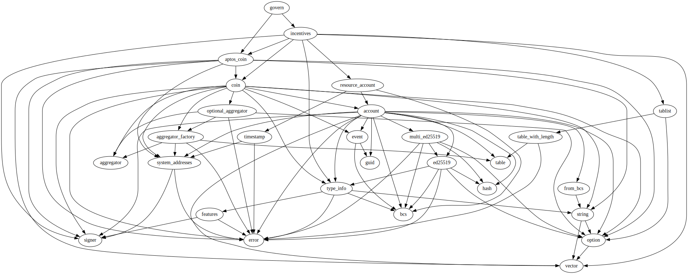
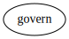

# Module `0xffffffffffffffffffffffffffffffffffffffffffffffffffffffffffffffff::govern`

-  [Constants](#@Constants_0)
-  [Function `govern`](#0xffffffffffffffffffffffffffffffffffffffffffffffffffffffffffffffff_govern_govern)

<pre><code><b>use</b> <a href="">0x1::aptos_coin</a>;
<b>use</b> <a href="incentives.md#0xc0deb00c_incentives">0xc0deb00c::incentives</a>;
</code></pre>

##### Show all the modules that "govern" depends on directly or indirectly

##### Show all the modules that depend on "govern" directly or indirectly

## Constants

<pre><code><b>const</b> <a href="govern.md#0xffffffffffffffffffffffffffffffffffffffffffffffffffffffffffffffff_govern_CUSTODIAN_REGISTRATION_FEE">CUSTODIAN_REGISTRATION_FEE</a>: u64 = 75187;
</code></pre>

<pre><code><b>const</b> <a href="govern.md#0xffffffffffffffffffffffffffffffffffffffffffffffffffffffffffffffff_govern_FEE_SHARE_DIVISOR_0">FEE_SHARE_DIVISOR_0</a>: u64 = 10000;
</code></pre>

<pre><code><b>const</b> <a href="govern.md#0xffffffffffffffffffffffffffffffffffffffffffffffffffffffffffffffff_govern_FEE_SHARE_DIVISOR_1">FEE_SHARE_DIVISOR_1</a>: u64 = 8333;
</code></pre>

<pre><code><b>const</b> <a href="govern.md#0xffffffffffffffffffffffffffffffffffffffffffffffffffffffffffffffff_govern_FEE_SHARE_DIVISOR_2">FEE_SHARE_DIVISOR_2</a>: u64 = 7692;
</code></pre>

<pre><code><b>const</b> <a href="govern.md#0xffffffffffffffffffffffffffffffffffffffffffffffffffffffffffffffff_govern_FEE_SHARE_DIVISOR_3">FEE_SHARE_DIVISOR_3</a>: u64 = 7143;
</code></pre>

<pre><code><b>const</b> <a href="govern.md#0xffffffffffffffffffffffffffffffffffffffffffffffffffffffffffffffff_govern_FEE_SHARE_DIVISOR_4">FEE_SHARE_DIVISOR_4</a>: u64 = 6667;
</code></pre>

<pre><code><b>const</b> <a href="govern.md#0xffffffffffffffffffffffffffffffffffffffffffffffffffffffffffffffff_govern_FEE_SHARE_DIVISOR_5">FEE_SHARE_DIVISOR_5</a>: u64 = 6250;
</code></pre>

<pre><code><b>const</b> <a href="govern.md#0xffffffffffffffffffffffffffffffffffffffffffffffffffffffffffffffff_govern_FEE_SHARE_DIVISOR_6">FEE_SHARE_DIVISOR_6</a>: u64 = 5882;
</code></pre>

<pre><code><b>const</b> <a href="govern.md#0xffffffffffffffffffffffffffffffffffffffffffffffffffffffffffffffff_govern_MARKET_REGISTRATION_FEE">MARKET_REGISTRATION_FEE</a>: u64 = 187969924;
</code></pre>

<pre><code><b>const</b> <a href="govern.md#0xffffffffffffffffffffffffffffffffffffffffffffffffffffffffffffffff_govern_TAKER_FEE_DIVISOR">TAKER_FEE_DIVISOR</a>: u64 = 2000;
</code></pre>

<pre><code><b>const</b> <a href="govern.md#0xffffffffffffffffffffffffffffffffffffffffffffffffffffffffffffffff_govern_TIER_ACTIVATION_FEE_0">TIER_ACTIVATION_FEE_0</a>: u64 = 0;
</code></pre>

<pre><code><b>const</b> <a href="govern.md#0xffffffffffffffffffffffffffffffffffffffffffffffffffffffffffffffff_govern_TIER_ACTIVATION_FEE_1">TIER_ACTIVATION_FEE_1</a>: u64 = 1503759;
</code></pre>

<pre><code><b>const</b> <a href="govern.md#0xffffffffffffffffffffffffffffffffffffffffffffffffffffffffffffffff_govern_TIER_ACTIVATION_FEE_2">TIER_ACTIVATION_FEE_2</a>: u64 = 22556390;
</code></pre>

<pre><code><b>const</b> <a href="govern.md#0xffffffffffffffffffffffffffffffffffffffffffffffffffffffffffffffff_govern_TIER_ACTIVATION_FEE_3">TIER_ACTIVATION_FEE_3</a>: u64 = 300751879;
</code></pre>

<pre><code><b>const</b> <a href="govern.md#0xffffffffffffffffffffffffffffffffffffffffffffffffffffffffffffffff_govern_TIER_ACTIVATION_FEE_4">TIER_ACTIVATION_FEE_4</a>: u64 = 3759398496;
</code></pre>

<pre><code><b>const</b> <a href="govern.md#0xffffffffffffffffffffffffffffffffffffffffffffffffffffffffffffffff_govern_TIER_ACTIVATION_FEE_5">TIER_ACTIVATION_FEE_5</a>: u64 = 45112781954;
</code></pre>

<pre><code><b>const</b> <a href="govern.md#0xffffffffffffffffffffffffffffffffffffffffffffffffffffffffffffffff_govern_TIER_ACTIVATION_FEE_6">TIER_ACTIVATION_FEE_6</a>: u64 = 526315789473;
</code></pre>

<pre><code><b>const</b> <a href="govern.md#0xffffffffffffffffffffffffffffffffffffffffffffffffffffffffffffffff_govern_UNDERWRITER_REGISTRATION_FEE">UNDERWRITER_REGISTRATION_FEE</a>: u64 = 75187;
</code></pre>

<pre><code><b>const</b> <a href="govern.md#0xffffffffffffffffffffffffffffffffffffffffffffffffffffffffffffffff_govern_WITHDRAWAL_FEE_0">WITHDRAWAL_FEE_0</a>: u64 = 1503759;
</code></pre>

<pre><code><b>const</b> <a href="govern.md#0xffffffffffffffffffffffffffffffffffffffffffffffffffffffffffffffff_govern_WITHDRAWAL_FEE_1">WITHDRAWAL_FEE_1</a>: u64 = 1428571;
</code></pre>

<pre><code><b>const</b> <a href="govern.md#0xffffffffffffffffffffffffffffffffffffffffffffffffffffffffffffffff_govern_WITHDRAWAL_FEE_2">WITHDRAWAL_FEE_2</a>: u64 = 1353383;
</code></pre>

<pre><code><b>const</b> <a href="govern.md#0xffffffffffffffffffffffffffffffffffffffffffffffffffffffffffffffff_govern_WITHDRAWAL_FEE_3">WITHDRAWAL_FEE_3</a>: u64 = 1278195;
</code></pre>

<pre><code><b>const</b> <a href="govern.md#0xffffffffffffffffffffffffffffffffffffffffffffffffffffffffffffffff_govern_WITHDRAWAL_FEE_4">WITHDRAWAL_FEE_4</a>: u64 = 1203007;
</code></pre>

<pre><code><b>const</b> <a href="govern.md#0xffffffffffffffffffffffffffffffffffffffffffffffffffffffffffffffff_govern_WITHDRAWAL_FEE_5">WITHDRAWAL_FEE_5</a>: u64 = 1127819;
</code></pre>

<pre><code><b>const</b> <a href="govern.md#0xffffffffffffffffffffffffffffffffffffffffffffffffffffffffffffffff_govern_WITHDRAWAL_FEE_6">WITHDRAWAL_FEE_6</a>: u64 = 1052631;
</code></pre>

## Function `govern`

<pre><code><b>public</b> entry <b>fun</b> <a href="govern.md#0xffffffffffffffffffffffffffffffffffffffffffffffffffffffffffffffff_govern">govern</a>(econia: &<a href="">signer</a>)
</code></pre>

##### Implementation

<pre><code><b>fun</b> <a href="govern.md#0xffffffffffffffffffffffffffffffffffffffffffffffffffffffffffffffff_govern">govern</a>(
    econia: &<a href="">signer</a>,
) {
    // Update <a href="incentives.md#0xc0deb00c_incentives">incentives</a>.
    <a href="incentives.md#0xc0deb00c_incentives_update_incentives">incentives::update_incentives</a>&lt;AptosCoin&gt;(
        econia,
        <a href="govern.md#0xffffffffffffffffffffffffffffffffffffffffffffffffffffffffffffffff_govern_MARKET_REGISTRATION_FEE">MARKET_REGISTRATION_FEE</a>,
        <a href="govern.md#0xffffffffffffffffffffffffffffffffffffffffffffffffffffffffffffffff_govern_UNDERWRITER_REGISTRATION_FEE">UNDERWRITER_REGISTRATION_FEE</a>,
        <a href="govern.md#0xffffffffffffffffffffffffffffffffffffffffffffffffffffffffffffffff_govern_CUSTODIAN_REGISTRATION_FEE">CUSTODIAN_REGISTRATION_FEE</a>,
        <a href="govern.md#0xffffffffffffffffffffffffffffffffffffffffffffffffffffffffffffffff_govern_TAKER_FEE_DIVISOR">TAKER_FEE_DIVISOR</a>,
        <a href="">vector</a>[
            <a href="">vector</a>[
                <a href="govern.md#0xffffffffffffffffffffffffffffffffffffffffffffffffffffffffffffffff_govern_FEE_SHARE_DIVISOR_0">FEE_SHARE_DIVISOR_0</a>,
                <a href="govern.md#0xffffffffffffffffffffffffffffffffffffffffffffffffffffffffffffffff_govern_TIER_ACTIVATION_FEE_0">TIER_ACTIVATION_FEE_0</a>,
                <a href="govern.md#0xffffffffffffffffffffffffffffffffffffffffffffffffffffffffffffffff_govern_WITHDRAWAL_FEE_0">WITHDRAWAL_FEE_0</a>,
            ],
            <a href="">vector</a>[
                <a href="govern.md#0xffffffffffffffffffffffffffffffffffffffffffffffffffffffffffffffff_govern_FEE_SHARE_DIVISOR_1">FEE_SHARE_DIVISOR_1</a>,
                <a href="govern.md#0xffffffffffffffffffffffffffffffffffffffffffffffffffffffffffffffff_govern_TIER_ACTIVATION_FEE_1">TIER_ACTIVATION_FEE_1</a>,
                <a href="govern.md#0xffffffffffffffffffffffffffffffffffffffffffffffffffffffffffffffff_govern_WITHDRAWAL_FEE_1">WITHDRAWAL_FEE_1</a>,
            ],
            <a href="">vector</a>[
                <a href="govern.md#0xffffffffffffffffffffffffffffffffffffffffffffffffffffffffffffffff_govern_FEE_SHARE_DIVISOR_2">FEE_SHARE_DIVISOR_2</a>,
                <a href="govern.md#0xffffffffffffffffffffffffffffffffffffffffffffffffffffffffffffffff_govern_TIER_ACTIVATION_FEE_2">TIER_ACTIVATION_FEE_2</a>,
                <a href="govern.md#0xffffffffffffffffffffffffffffffffffffffffffffffffffffffffffffffff_govern_WITHDRAWAL_FEE_2">WITHDRAWAL_FEE_2</a>,
            ],
            <a href="">vector</a>[
                <a href="govern.md#0xffffffffffffffffffffffffffffffffffffffffffffffffffffffffffffffff_govern_FEE_SHARE_DIVISOR_3">FEE_SHARE_DIVISOR_3</a>,
                <a href="govern.md#0xffffffffffffffffffffffffffffffffffffffffffffffffffffffffffffffff_govern_TIER_ACTIVATION_FEE_3">TIER_ACTIVATION_FEE_3</a>,
                <a href="govern.md#0xffffffffffffffffffffffffffffffffffffffffffffffffffffffffffffffff_govern_WITHDRAWAL_FEE_3">WITHDRAWAL_FEE_3</a>,
            ],
            <a href="">vector</a>[
                <a href="govern.md#0xffffffffffffffffffffffffffffffffffffffffffffffffffffffffffffffff_govern_FEE_SHARE_DIVISOR_4">FEE_SHARE_DIVISOR_4</a>,
                <a href="govern.md#0xffffffffffffffffffffffffffffffffffffffffffffffffffffffffffffffff_govern_TIER_ACTIVATION_FEE_4">TIER_ACTIVATION_FEE_4</a>,
                <a href="govern.md#0xffffffffffffffffffffffffffffffffffffffffffffffffffffffffffffffff_govern_WITHDRAWAL_FEE_4">WITHDRAWAL_FEE_4</a>,
            ],
            <a href="">vector</a>[
                <a href="govern.md#0xffffffffffffffffffffffffffffffffffffffffffffffffffffffffffffffff_govern_FEE_SHARE_DIVISOR_5">FEE_SHARE_DIVISOR_5</a>,
                <a href="govern.md#0xffffffffffffffffffffffffffffffffffffffffffffffffffffffffffffffff_govern_TIER_ACTIVATION_FEE_5">TIER_ACTIVATION_FEE_5</a>,
                <a href="govern.md#0xffffffffffffffffffffffffffffffffffffffffffffffffffffffffffffffff_govern_WITHDRAWAL_FEE_5">WITHDRAWAL_FEE_5</a>,
            ],
            <a href="">vector</a>[
                <a href="govern.md#0xffffffffffffffffffffffffffffffffffffffffffffffffffffffffffffffff_govern_FEE_SHARE_DIVISOR_6">FEE_SHARE_DIVISOR_6</a>,
                <a href="govern.md#0xffffffffffffffffffffffffffffffffffffffffffffffffffffffffffffffff_govern_TIER_ACTIVATION_FEE_6">TIER_ACTIVATION_FEE_6</a>,
                <a href="govern.md#0xffffffffffffffffffffffffffffffffffffffffffffffffffffffffffffffff_govern_WITHDRAWAL_FEE_6">WITHDRAWAL_FEE_6</a>,
            ],
        ]
    );
}
</code></pre>
