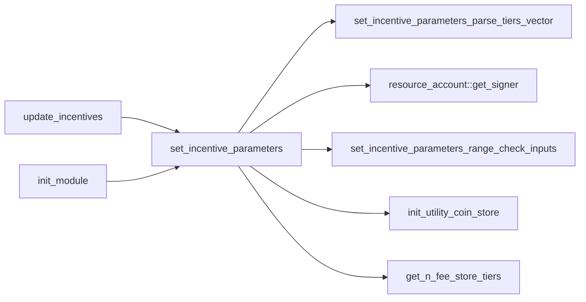
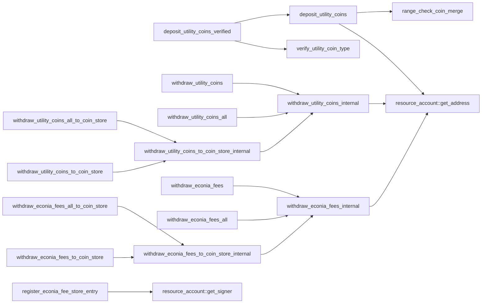
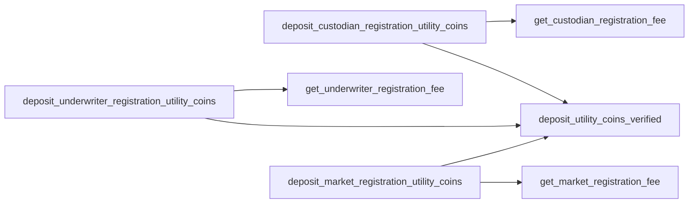
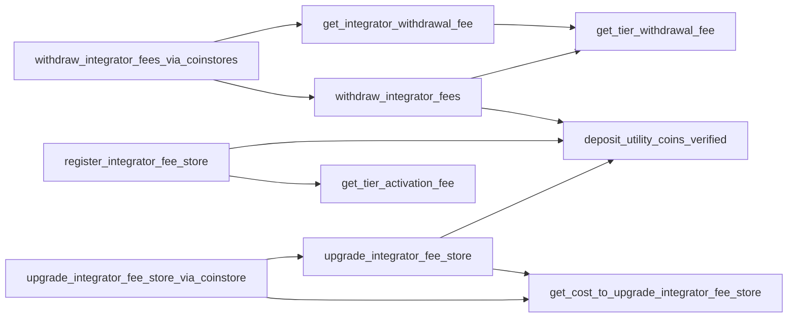
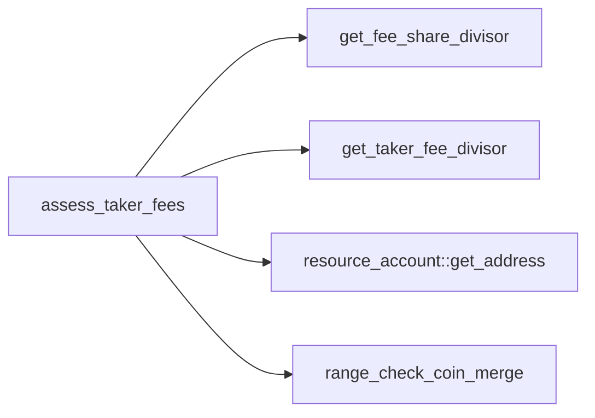
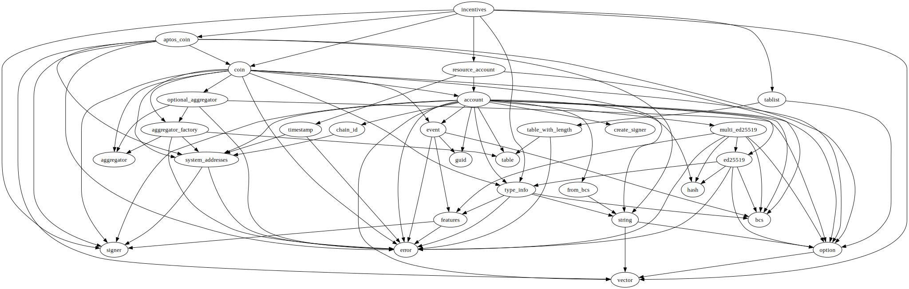
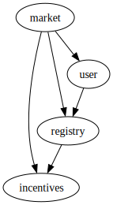

# Module `0xc0deb00c::incentives`

Incentive-associated parameters and data structures.

Contains hard-coded "genesis parameters" that are are set
upon module publication per <code><a href="incentives.md#0xc0deb00c_incentives_init_module">init_module</a>()</code>, and which can be
updated later per <code><a href="incentives.md#0xc0deb00c_incentives_set_incentive_parameters">set_incentive_parameters</a>()</code>.

## General overview sections

[Incentive model](#incentive-model)

[Functions](#functions)

* [Public getters](#public-getters)
* [Other public functions](#other-public-functions)
* [Public entry functions](#public-entry-functions)
* [Public friend functions](#public-friend-functions)

[Dependency charts](#dependency-charts)

* [Incentive parameters setters](#incentive-parameter-setters)
* [Econia fee account operations](#econia-fee-account-operations)
* [Registrant operations](#registrant-operations)
* [Integrator operations](#integrator-operations)
* [Match operations](#match-operations)

[Complete DocGen index](#complete-docgen-index)

## Incentive model

As a permissionless system, Econia mitigates denial-of-service (DoS)
attacks by charging utility coins for assorted operations. Econia
also charges taker fees, denominated in the quote coin for a given
market, which are distributed between integrators and Econia. The
share of taker fees distributed between an integrator and Econia,
for a given market, is determined by the "tier" to which the
integrator has "activated" their fee store: when the matching engine
fills a taker order, the integrator who facilitated the transaction
has a portion of taker fees deposited to their fee store, and Econia
gets the rest, with the split thereof determined by the integrator's
fee store tier for the given market. Econia does not charge maker
fees.

Hence Econia involves 5 major incentive parameters, defined at
<code><a href="incentives.md#0xc0deb00c_incentives_IncentiveParameters">IncentiveParameters</a></code>:

1. The utility coin type.
2. The fee, denominated in the utility coin, to register a market.
3. The fee, denominated in the utility coin, to register as an
underwriter for a generic market.
4. The fee, denominated in the utility coin, to register as
custodian.
5. The taker fee divisor, denoting the portion of quote coins for a
particular trade, paid by the taker, to be split between the
integrator who facilitated the trade, and Econia.

<code><a href="incentives.md#0xc0deb00c_incentives_IncentiveParameters">IncentiveParameters</a></code> also includes a vector of
<code><a href="incentives.md#0xc0deb00c_incentives_IntegratorFeeStoreTierParameters">IntegratorFeeStoreTierParameters</a></code>, which define 3 parameters per
tier:

1. The taker fee divisor, denoting the portion of quote coins for a
particular trade, paid by the taker, to be collected by an
integrator whose fee store is activated to the given tier.
2. The cumulative fee, denominated in the utility coin, to activate
to the given tier.
3. The fee, denominated in the utility coin, to withdraw quote coins
collected as fees, from an integrator's fee store.

Upon module publication, the Econia "genesis parameters" are
set according to hard-coded values via <code><a href="incentives.md#0xc0deb00c_incentives_init_module">init_module</a>()</code>. Later, the
parameters can be updated via <code><a href="incentives.md#0xc0deb00c_incentives_set_incentive_parameters">set_incentive_parameters</a>()</code>, so long
as the number of tiers is not reduced and other minor restrictions
are met. For an implementation-exact description of restrictions and
corresponding abort codes, see:

* <code><a href="incentives.md#0xc0deb00c_incentives_set_incentive_parameters">set_incentive_parameters</a>()</code>
* <code><a href="incentives.md#0xc0deb00c_incentives_set_incentive_parameters_range_check_inputs">set_incentive_parameters_range_check_inputs</a>()</code>
* <code><a href="incentives.md#0xc0deb00c_incentives_set_incentive_parameters_parse_tiers_vector">set_incentive_parameters_parse_tiers_vector</a>()</code>

## Functions

### Public getters

* <code><a href="incentives.md#0xc0deb00c_incentives_get_cost_to_upgrade_integrator_fee_store">get_cost_to_upgrade_integrator_fee_store</a>()</code>
* <code><a href="incentives.md#0xc0deb00c_incentives_get_custodian_registration_fee">get_custodian_registration_fee</a>()</code>
* <code><a href="incentives.md#0xc0deb00c_incentives_get_fee_share_divisor">get_fee_share_divisor</a>()</code>
* <code><a href="incentives.md#0xc0deb00c_incentives_get_integrator_withdrawal_fee">get_integrator_withdrawal_fee</a>()</code>
* <code><a href="incentives.md#0xc0deb00c_incentives_get_market_registration_fee">get_market_registration_fee</a>()</code>
* <code><a href="incentives.md#0xc0deb00c_incentives_get_n_fee_store_tiers">get_n_fee_store_tiers</a>()</code>
* <code><a href="incentives.md#0xc0deb00c_incentives_get_taker_fee_divisor">get_taker_fee_divisor</a>()</code>
* <code><a href="incentives.md#0xc0deb00c_incentives_get_tier_activation_fee">get_tier_activation_fee</a>()</code>
* <code><a href="incentives.md#0xc0deb00c_incentives_get_tier_withdrawal_fee">get_tier_withdrawal_fee</a>()</code>
* <code><a href="incentives.md#0xc0deb00c_incentives_get_underwriter_registration_fee">get_underwriter_registration_fee</a>()</code>
* <code><a href="incentives.md#0xc0deb00c_incentives_is_utility_coin_type">is_utility_coin_type</a>()</code>
* <code><a href="incentives.md#0xc0deb00c_incentives_verify_utility_coin_type">verify_utility_coin_type</a>()</code>

### Other public functions

* <code><a href="incentives.md#0xc0deb00c_incentives_upgrade_integrator_fee_store">upgrade_integrator_fee_store</a>()</code>
* <code><a href="incentives.md#0xc0deb00c_incentives_withdraw_econia_fees">withdraw_econia_fees</a>()</code>
* <code><a href="incentives.md#0xc0deb00c_incentives_withdraw_econia_fees_all">withdraw_econia_fees_all</a>()</code>
* <code><a href="incentives.md#0xc0deb00c_incentives_withdraw_integrator_fees">withdraw_integrator_fees</a>()</code>
* <code><a href="incentives.md#0xc0deb00c_incentives_withdraw_utility_coins">withdraw_utility_coins</a>()</code>
* <code><a href="incentives.md#0xc0deb00c_incentives_withdraw_utility_coins_all">withdraw_utility_coins_all</a>()</code>

### Public entry functions

* <code><a href="incentives.md#0xc0deb00c_incentives_update_incentives">update_incentives</a>()</code>
* <code><a href="incentives.md#0xc0deb00c_incentives_upgrade_integrator_fee_store_via_coinstore">upgrade_integrator_fee_store_via_coinstore</a>()</code>
* <code><a href="incentives.md#0xc0deb00c_incentives_withdraw_econia_fees_all_to_coin_store">withdraw_econia_fees_all_to_coin_store</a>()</code>
* <code><a href="incentives.md#0xc0deb00c_incentives_withdraw_econia_fees_to_coin_store">withdraw_econia_fees_to_coin_store</a>()</code>
* <code><a href="incentives.md#0xc0deb00c_incentives_withdraw_integrator_fees_via_coinstores">withdraw_integrator_fees_via_coinstores</a>()</code>
* <code><a href="incentives.md#0xc0deb00c_incentives_withdraw_utility_coins_all_to_coin_store">withdraw_utility_coins_all_to_coin_store</a>()</code>
* <code><a href="incentives.md#0xc0deb00c_incentives_withdraw_utility_coins_to_coin_store">withdraw_utility_coins_to_coin_store</a>()</code>

### Public friend functions

* <code><a href="incentives.md#0xc0deb00c_incentives_assess_taker_fees">assess_taker_fees</a>()</code>
* <code><a href="incentives.md#0xc0deb00c_incentives_calculate_max_quote_match">calculate_max_quote_match</a>()</code>
* <code><a href="incentives.md#0xc0deb00c_incentives_deposit_custodian_registration_utility_coins">deposit_custodian_registration_utility_coins</a>()</code>
* <code><a href="incentives.md#0xc0deb00c_incentives_deposit_market_registration_utility_coins">deposit_market_registration_utility_coins</a>()</code>
* <code><a href="incentives.md#0xc0deb00c_incentives_deposit_underwriter_registration_utility_coins">deposit_underwriter_registration_utility_coins</a>()</code>
* <code><a href="incentives.md#0xc0deb00c_incentives_register_econia_fee_store_entry">register_econia_fee_store_entry</a>()</code>
* <code><a href="incentives.md#0xc0deb00c_incentives_register_integrator_fee_store">register_integrator_fee_store</a>()</code>

## Dependency charts

The below dependency charts use <code>mermaid.js</code> syntax, which can be
automatically rendered into a diagram (depending on the browser)
when viewing the documentation file generated from source code. If
a browser renders the diagrams with coloring that makes it difficult
to read, try a different browser.

### Incentive parameter setters

### Econia fee account operations

### Registrant operations

### Integrator operations

### Match operations

## Complete DocGen index

The below index is automatically generated from source code:

-  [General overview sections](#@General_overview_sections_0)
-  [Incentive model](#@Incentive_model_1)
-  [Functions](#@Functions_2)
    -  [Public getters](#@Public_getters_3)
    -  [Other public functions](#@Other_public_functions_4)
    -  [Public entry functions](#@Public_entry_functions_5)
    -  [Public friend functions](#@Public_friend_functions_6)
-  [Dependency charts](#@Dependency_charts_7)
    -  [Incentive parameter setters](#@Incentive_parameter_setters_8)
    -  [Econia fee account operations](#@Econia_fee_account_operations_9)
    -  [Registrant operations](#@Registrant_operations_10)
    -  [Integrator operations](#@Integrator_operations_11)
    -  [Match operations](#@Match_operations_12)
-  [Complete DocGen index](#@Complete_DocGen_index_13)
-  [Resource `EconiaFeeStore`](#0xc0deb00c_incentives_EconiaFeeStore)
-  [Resource `IncentiveParameters`](#0xc0deb00c_incentives_IncentiveParameters)
-  [Struct `IntegratorFeeStore`](#0xc0deb00c_incentives_IntegratorFeeStore)
-  [Resource `IntegratorFeeStores`](#0xc0deb00c_incentives_IntegratorFeeStores)
-  [Struct `IntegratorFeeStoreTierParameters`](#0xc0deb00c_incentives_IntegratorFeeStoreTierParameters)
-  [Resource `UtilityCoinStore`](#0xc0deb00c_incentives_UtilityCoinStore)
-  [Constants](#@Constants_14)
-  [Function `get_cost_to_upgrade_integrator_fee_store`](#0xc0deb00c_incentives_get_cost_to_upgrade_integrator_fee_store)
    -  [Type parameters](#@Type_parameters_15)
    -  [Parameters](#@Parameters_16)
    -  [Returns](#@Returns_17)
    -  [Aborts](#@Aborts_18)
    -  [Restrictions](#@Restrictions_19)
    -  [Testing](#@Testing_20)
-  [Function `get_custodian_registration_fee`](#0xc0deb00c_incentives_get_custodian_registration_fee)
    -  [Testing](#@Testing_21)
-  [Function `get_fee_share_divisor`](#0xc0deb00c_incentives_get_fee_share_divisor)
    -  [Testing](#@Testing_22)
-  [Function `get_integrator_withdrawal_fee`](#0xc0deb00c_incentives_get_integrator_withdrawal_fee)
    -  [Restrictions](#@Restrictions_23)
-  [Function `get_market_registration_fee`](#0xc0deb00c_incentives_get_market_registration_fee)
    -  [Testing](#@Testing_24)
-  [Function `get_n_fee_store_tiers`](#0xc0deb00c_incentives_get_n_fee_store_tiers)
    -  [Testing](#@Testing_25)
-  [Function `get_taker_fee_divisor`](#0xc0deb00c_incentives_get_taker_fee_divisor)
    -  [Testing](#@Testing_26)
-  [Function `get_tier_activation_fee`](#0xc0deb00c_incentives_get_tier_activation_fee)
    -  [Testing](#@Testing_27)
-  [Function `get_tier_withdrawal_fee`](#0xc0deb00c_incentives_get_tier_withdrawal_fee)
    -  [Testing](#@Testing_28)
-  [Function `get_underwriter_registration_fee`](#0xc0deb00c_incentives_get_underwriter_registration_fee)
    -  [Testing](#@Testing_29)
-  [Function `is_utility_coin_type`](#0xc0deb00c_incentives_is_utility_coin_type)
    -  [Testing](#@Testing_30)
-  [Function `upgrade_integrator_fee_store`](#0xc0deb00c_incentives_upgrade_integrator_fee_store)
    -  [Type parameters](#@Type_parameters_31)
    -  [Parameters](#@Parameters_32)
-  [Function `verify_utility_coin_type`](#0xc0deb00c_incentives_verify_utility_coin_type)
    -  [Aborts](#@Aborts_33)
    -  [Testing](#@Testing_34)
-  [Function `withdraw_econia_fees`](#0xc0deb00c_incentives_withdraw_econia_fees)
-  [Function `withdraw_econia_fees_all`](#0xc0deb00c_incentives_withdraw_econia_fees_all)
-  [Function `withdraw_integrator_fees`](#0xc0deb00c_incentives_withdraw_integrator_fees)
    -  [Type parameters](#@Type_parameters_35)
    -  [Parameters](#@Parameters_36)
    -  [Returns](#@Returns_37)
-  [Function `withdraw_utility_coins`](#0xc0deb00c_incentives_withdraw_utility_coins)
    -  [Testing](#@Testing_38)
-  [Function `withdraw_utility_coins_all`](#0xc0deb00c_incentives_withdraw_utility_coins_all)
    -  [Testing](#@Testing_39)
-  [Function `update_incentives`](#0xc0deb00c_incentives_update_incentives)
    -  [Testing](#@Testing_40)
-  [Function `upgrade_integrator_fee_store_via_coinstore`](#0xc0deb00c_incentives_upgrade_integrator_fee_store_via_coinstore)
    -  [Testing](#@Testing_41)
-  [Function `withdraw_econia_fees_all_to_coin_store`](#0xc0deb00c_incentives_withdraw_econia_fees_all_to_coin_store)
    -  [Testing](#@Testing_42)
-  [Function `withdraw_econia_fees_to_coin_store`](#0xc0deb00c_incentives_withdraw_econia_fees_to_coin_store)
    -  [Testing](#@Testing_43)
-  [Function `withdraw_integrator_fees_via_coinstores`](#0xc0deb00c_incentives_withdraw_integrator_fees_via_coinstores)
    -  [Type parameters](#@Type_parameters_44)
    -  [Parameters](#@Parameters_45)
-  [Function `withdraw_utility_coins_all_to_coin_store`](#0xc0deb00c_incentives_withdraw_utility_coins_all_to_coin_store)
    -  [Testing](#@Testing_46)
-  [Function `withdraw_utility_coins_to_coin_store`](#0xc0deb00c_incentives_withdraw_utility_coins_to_coin_store)
    -  [Testing](#@Testing_47)
-  [Function `assess_taker_fees`](#0xc0deb00c_incentives_assess_taker_fees)
    -  [Type parameters](#@Type_parameters_48)
    -  [Parameters](#@Parameters_49)
    -  [Returns](#@Returns_50)
    -  [Aborts](#@Aborts_51)
    -  [Assumptions](#@Assumptions_52)
-  [Function `calculate_max_quote_match`](#0xc0deb00c_incentives_calculate_max_quote_match)
    -  [Example buy](#@Example_buy_53)
    -  [Example sell](#@Example_sell_54)
    -  [Variables](#@Variables_55)
    -  [Equations](#@Equations_56)
        -  [Buy](#@Buy_57)
        -  [Sell](#@Sell_58)
    -  [Overflow correction](#@Overflow_correction_59)
    -  [Parameters](#@Parameters_60)
    -  [Returns](#@Returns_61)
    -  [Assumptions](#@Assumptions_62)
    -  [Testing](#@Testing_63)
-  [Function `deposit_custodian_registration_utility_coins`](#0xc0deb00c_incentives_deposit_custodian_registration_utility_coins)
    -  [Testing](#@Testing_64)
-  [Function `deposit_market_registration_utility_coins`](#0xc0deb00c_incentives_deposit_market_registration_utility_coins)
    -  [Testing](#@Testing_65)
-  [Function `deposit_underwriter_registration_utility_coins`](#0xc0deb00c_incentives_deposit_underwriter_registration_utility_coins)
    -  [Testing](#@Testing_66)
-  [Function `register_econia_fee_store_entry`](#0xc0deb00c_incentives_register_econia_fee_store_entry)
-  [Function `register_integrator_fee_store`](#0xc0deb00c_incentives_register_integrator_fee_store)
    -  [Type parameters](#@Type_parameters_67)
    -  [Parameters](#@Parameters_68)
-  [Function `deposit_utility_coins`](#0xc0deb00c_incentives_deposit_utility_coins)
    -  [Aborts](#@Aborts_69)
    -  [Testing](#@Testing_70)
-  [Function `deposit_utility_coins_verified`](#0xc0deb00c_incentives_deposit_utility_coins_verified)
    -  [Aborts](#@Aborts_71)
    -  [Testing](#@Testing_72)
-  [Function `init_module`](#0xc0deb00c_incentives_init_module)
    -  [Testing](#@Testing_73)
-  [Function `init_utility_coin_store`](#0xc0deb00c_incentives_init_utility_coin_store)
    -  [Type Parameters](#@Type_Parameters_74)
    -  [Parameters](#@Parameters_75)
    -  [Aborts](#@Aborts_76)
    -  [Testing](#@Testing_77)
-  [Function `range_check_coin_merge`](#0xc0deb00c_incentives_range_check_coin_merge)
    -  [Aborts](#@Aborts_78)
    -  [Testing](#@Testing_79)
-  [Function `set_incentive_parameters`](#0xc0deb00c_incentives_set_incentive_parameters)
    -  [Type Parameters](#@Type_Parameters_80)
    -  [Parameters](#@Parameters_81)
    -  [Assumptions](#@Assumptions_82)
    -  [Aborts](#@Aborts_83)
-  [Function `set_incentive_parameters_parse_tiers_vector`](#0xc0deb00c_incentives_set_incentive_parameters_parse_tiers_vector)
    -  [Aborts](#@Aborts_84)
    -  [Assumptions](#@Assumptions_85)
    -  [Testing](#@Testing_86)
-  [Function `set_incentive_parameters_range_check_inputs`](#0xc0deb00c_incentives_set_incentive_parameters_range_check_inputs)
    -  [Parameters](#@Parameters_87)
    -  [Aborts](#@Aborts_88)
    -  [Testing](#@Testing_89)
-  [Function `withdraw_econia_fees_internal`](#0xc0deb00c_incentives_withdraw_econia_fees_internal)
    -  [Aborts](#@Aborts_90)
-  [Function `withdraw_econia_fees_to_coin_store_internal`](#0xc0deb00c_incentives_withdraw_econia_fees_to_coin_store_internal)
    -  [Testing](#@Testing_91)
-  [Function `withdraw_utility_coins_internal`](#0xc0deb00c_incentives_withdraw_utility_coins_internal)
    -  [Aborts](#@Aborts_92)
-  [Function `withdraw_utility_coins_to_coin_store_internal`](#0xc0deb00c_incentives_withdraw_utility_coins_to_coin_store_internal)
    -  [Testing](#@Testing_93)

<pre><code><b>use</b> <a href="">0x1::aptos_coin</a>;
<b>use</b> <a href="">0x1::coin</a>;
<b>use</b> <a href="">0x1::signer</a>;
<b>use</b> <a href="">0x1::type_info</a>;
<b>use</b> <a href="">0x1::vector</a>;
<b>use</b> <a href="resource_account.md#0xc0deb00c_resource_account">0xc0deb00c::resource_account</a>;
<b>use</b> <a href="tablist.md#0xc0deb00c_tablist">0xc0deb00c::tablist</a>;
</code></pre>

##### Show all the modules that "incentives" depends on directly or indirectly

##### Show all the modules that depend on "incentives" directly or indirectly

## Resource `EconiaFeeStore`

Portion of taker fees not claimed by an integrator, which are
reserved for Econia.

<pre><code><b>struct</b> <a href="incentives.md#0xc0deb00c_incentives_EconiaFeeStore">EconiaFeeStore</a>&lt;QuoteCoinType&gt; <b>has</b> key
</code></pre>

##### Fields

<dl>
<dt>
<code>map: <a href="tablist.md#0xc0deb00c_tablist_Tablist">tablist::Tablist</a>&lt;u64, <a href="_Coin">coin::Coin</a>&lt;QuoteCoinType&gt;&gt;</code>
</dt>
<dd>
 Map from market ID to fees collected for given market,
 enabling duplicate checks and iterable indexing.
</dd>
</dl>

## Resource `IncentiveParameters`

Incentive parameters for assorted operations.

<pre><code><b>struct</b> <a href="incentives.md#0xc0deb00c_incentives_IncentiveParameters">IncentiveParameters</a> <b>has</b> drop, key
</code></pre>

##### Fields

<dl>
<dt>
<code>utility_coin_type_info: <a href="_TypeInfo">type_info::TypeInfo</a></code>
</dt>
<dd>
 Utility coin type info. Corresponds to the phantom
 <code>CoinType</code> (<code><b>address</b>:module::MyCoin</code> rather than
 <code>aptos_framework::coin::Coin&lt;<b>address</b>:module::MyCoin&gt;</code>) of
 the coin required for utility purposes. Set to <code>APT</code> at
 mainnet launch, later the Econia coin.
</dd>
<dt>
<code>market_registration_fee: u64</code>
</dt>
<dd>
 <code>Coin.value</code> required to register a market.
</dd>
<dt>
<code>underwriter_registration_fee: u64</code>
</dt>
<dd>
 <code>Coin.value</code> required to register as an underwriter.
</dd>
<dt>
<code>custodian_registration_fee: u64</code>
</dt>
<dd>
 <code>Coin.value</code> required to register as a custodian.
</dd>
<dt>
<code>taker_fee_divisor: u64</code>
</dt>
<dd>
 Nominal amount divisor for quote coin fee charged to takers.
 For example, if a transaction involves a quote coin fill of
 1000000 units and the taker fee divisor is 2000, takers pay
 1/2000th (0.05%) of the nominal amount (500 quote coin
 units) in fees. Instituted as a divisor for optimized
 calculations.
</dd>
<dt>
<code>integrator_fee_store_tiers: <a href="">vector</a>&lt;<a href="incentives.md#0xc0deb00c_incentives_IntegratorFeeStoreTierParameters">incentives::IntegratorFeeStoreTierParameters</a>&gt;</code>
</dt>
<dd>
 0-indexed list from tier number to corresponding parameters.
</dd>
</dl>

## Struct `IntegratorFeeStore`

Fee store for a given integrator, on a given market.

<pre><code><b>struct</b> <a href="incentives.md#0xc0deb00c_incentives_IntegratorFeeStore">IntegratorFeeStore</a>&lt;QuoteCoinType&gt; <b>has</b> store
</code></pre>

##### Fields

<dl>
<dt>
<code>tier: u8</code>
</dt>
<dd>
 Activation tier, incremented by paying utility coins.
</dd>
<dt>
<code>coins: <a href="_Coin">coin::Coin</a>&lt;QuoteCoinType&gt;</code>
</dt>
<dd>
 Collected fees, in quote coins for given market.
</dd>
</dl>

## Resource `IntegratorFeeStores`

All of an integrator's <code><a href="incentives.md#0xc0deb00c_incentives_IntegratorFeeStore">IntegratorFeeStore</a></code>s for given
<code>QuoteCoinType</code>.

<pre><code><b>struct</b> <a href="incentives.md#0xc0deb00c_incentives_IntegratorFeeStores">IntegratorFeeStores</a>&lt;QuoteCoinType&gt; <b>has</b> key
</code></pre>

##### Fields

<dl>
<dt>
<code>map: <a href="tablist.md#0xc0deb00c_tablist_Tablist">tablist::Tablist</a>&lt;u64, <a href="incentives.md#0xc0deb00c_incentives_IntegratorFeeStore">incentives::IntegratorFeeStore</a>&lt;QuoteCoinType&gt;&gt;</code>
</dt>
<dd>
 Map from market ID to <code><a href="incentives.md#0xc0deb00c_incentives_IntegratorFeeStore">IntegratorFeeStore</a></code>, enabling
 duplicate checks and iterable indexing.
</dd>
</dl>

## Struct `IntegratorFeeStoreTierParameters`

Integrator fee store tier parameters for a given tier.

<pre><code><b>struct</b> <a href="incentives.md#0xc0deb00c_incentives_IntegratorFeeStoreTierParameters">IntegratorFeeStoreTierParameters</a> <b>has</b> drop, store
</code></pre>

##### Fields

<dl>
<dt>
<code>fee_share_divisor: u64</code>
</dt>
<dd>
 Nominal amount divisor for taker quote coin fee reserved for
 integrators having activated their fee store to the given
 tier. For example, if a transaction involves a quote coin
 fill of 1000000 units and the fee share divisor at the given
 tier is 4000, integrators get 1/4000th (0.025%) of the
 nominal amount (250 quote coin units) in fees at the given
 tier. Instituted as a divisor for optimized calculations.
 May not be larger than the
 <code><a href="incentives.md#0xc0deb00c_incentives_IncentiveParameters">IncentiveParameters</a>.taker_fee_divisor</code>, since the
 integrator fee share is deducted from the taker fee (with
 the remaining proceeds going to an <code><a href="incentives.md#0xc0deb00c_incentives_EconiaFeeStore">EconiaFeeStore</a></code> for the
 given market).
</dd>
<dt>
<code>tier_activation_fee: u64</code>
</dt>
<dd>
 Cumulative cost, in utility coin units, to activate to the
 current tier. For example, if an integrator has already
 activated to tier 3, which has a tier activation fee of 1000
 units, and tier 4 has a tier activation fee of 10000 units,
 the integrator only has to pay 9000 units to activate to
 tier 4.
</dd>
<dt>
<code>withdrawal_fee: u64</code>
</dt>
<dd>
 Cost, in utility coin units, to withdraw from an integrator
 fee store. Shall never be nonzero, since a disincentive is
 required to prevent excessively-frequent withdrawals and
 thus transaction collisions with the matching engine.
</dd>
</dl>

## Resource `UtilityCoinStore`

Container for utility coin fees collected by Econia.

<pre><code><b>struct</b> <a href="incentives.md#0xc0deb00c_incentives_UtilityCoinStore">UtilityCoinStore</a>&lt;CoinType&gt; <b>has</b> key
</code></pre>

##### Fields

<dl>
<dt>
<code>coins: <a href="_Coin">coin::Coin</a>&lt;CoinType&gt;</code>
</dt>
<dd>
 Coins collected as utility fees.
</dd>
</dl>

## Constants

Caller is not Econia, but should be.

<pre><code><b>const</b> <a href="incentives.md#0xc0deb00c_incentives_E_NOT_ECONIA">E_NOT_ECONIA</a>: u64 = 0;
</code></pre>

<code>u64</code> bitmask with all bits set, generated in Python via
<code>hex(int('1' * 64, 2))</code>.

<pre><code><b>const</b> <a href="incentives.md#0xc0deb00c_incentives_HI_64">HI_64</a>: u64 = 18446744073709551615;
</code></pre>

Buy direction flag, as defined in <code><a href="market.md#0xc0deb00c_market">market</a>.<b>move</b></code>.

<pre><code><b>const</b> <a href="incentives.md#0xc0deb00c_incentives_BUY">BUY</a>: bool = <b>false</b>;
</code></pre>

Genesis parameter.

<pre><code><b>const</b> <a href="incentives.md#0xc0deb00c_incentives_CUSTODIAN_REGISTRATION_FEE">CUSTODIAN_REGISTRATION_FEE</a>: u64 = 81967;
</code></pre>

The indicated tier activation fee is too small.

<pre><code><b>const</b> <a href="incentives.md#0xc0deb00c_incentives_E_ACTIVATION_FEE_TOO_SMALL">E_ACTIVATION_FEE_TOO_SMALL</a>: u64 = 9;
</code></pre>

Custodian registration fee is less than the minimum.

<pre><code><b>const</b> <a href="incentives.md#0xc0deb00c_incentives_E_CUSTODIAN_REGISTRATION_FEE_LESS_THAN_MIN">E_CUSTODIAN_REGISTRATION_FEE_LESS_THAN_MIN</a>: u64 = 6;
</code></pre>

Depositing to an Econia fee store would result in an overflow.

<pre><code><b>const</b> <a href="incentives.md#0xc0deb00c_incentives_E_ECONIA_FEE_STORE_OVERFLOW">E_ECONIA_FEE_STORE_OVERFLOW</a>: u64 = 20;
</code></pre>

Passed fee store tiers vector is empty.

<pre><code><b>const</b> <a href="incentives.md#0xc0deb00c_incentives_E_EMPTY_FEE_STORE_TIERS">E_EMPTY_FEE_STORE_TIERS</a>: u64 = 2;
</code></pre>

Indicated fee share divisor for given tier is too big.

<pre><code><b>const</b> <a href="incentives.md#0xc0deb00c_incentives_E_FEE_SHARE_DIVISOR_TOO_BIG">E_FEE_SHARE_DIVISOR_TOO_BIG</a>: u64 = 3;
</code></pre>

The indicated fee share divisor for a given tier is less than
the indicated taker fee divisor.

<pre><code><b>const</b> <a href="incentives.md#0xc0deb00c_incentives_E_FEE_SHARE_DIVISOR_TOO_SMALL">E_FEE_SHARE_DIVISOR_TOO_SMALL</a>: u64 = 4;
</code></pre>

An update to the incentive parameters set indicates a reduction
in fee store tiers.

<pre><code><b>const</b> <a href="incentives.md#0xc0deb00c_incentives_E_FEWER_TIERS">E_FEWER_TIERS</a>: u64 = 16;
</code></pre>

The cost to activate to tier 0 is nonzero.

<pre><code><b>const</b> <a href="incentives.md#0xc0deb00c_incentives_E_FIRST_TIER_ACTIVATION_FEE_NONZERO">E_FIRST_TIER_ACTIVATION_FEE_NONZERO</a>: u64 = 17;
</code></pre>

Depositing to an integrator fee store would result in an
overflow.

<pre><code><b>const</b> <a href="incentives.md#0xc0deb00c_incentives_E_INTEGRATOR_FEE_STORE_OVERFLOW">E_INTEGRATOR_FEE_STORE_OVERFLOW</a>: u64 = 19;
</code></pre>

There is no tier with given number.

<pre><code><b>const</b> <a href="incentives.md#0xc0deb00c_incentives_E_INVALID_TIER">E_INVALID_TIER</a>: u64 = 22;
</code></pre>

Type is not the utility coin type.

<pre><code><b>const</b> <a href="incentives.md#0xc0deb00c_incentives_E_INVALID_UTILITY_COIN_TYPE">E_INVALID_UTILITY_COIN_TYPE</a>: u64 = 12;
</code></pre>

Market registration fee is less than the minimum.

<pre><code><b>const</b> <a href="incentives.md#0xc0deb00c_incentives_E_MARKET_REGISTRATION_FEE_LESS_THAN_MIN">E_MARKET_REGISTRATION_FEE_LESS_THAN_MIN</a>: u64 = 5;
</code></pre>

Indicated tier is not higher than existing tier.

<pre><code><b>const</b> <a href="incentives.md#0xc0deb00c_incentives_E_NOT_AN_UPGRADE">E_NOT_AN_UPGRADE</a>: u64 = 15;
</code></pre>

Type does not correspond to an initialized coin.

<pre><code><b>const</b> <a href="incentives.md#0xc0deb00c_incentives_E_NOT_COIN">E_NOT_COIN</a>: u64 = 1;
</code></pre>

Not enough utility coins provided.

<pre><code><b>const</b> <a href="incentives.md#0xc0deb00c_incentives_E_NOT_ENOUGH_UTILITY_COINS">E_NOT_ENOUGH_UTILITY_COINS</a>: u64 = 13;
</code></pre>

Taker fee divisor is less than the minimum.

<pre><code><b>const</b> <a href="incentives.md#0xc0deb00c_incentives_E_TAKER_DIVISOR_LESS_THAN_MIN">E_TAKER_DIVISOR_LESS_THAN_MIN</a>: u64 = 7;
</code></pre>

Cumulative activation fee for new tier is not greater than that
of current tier.

<pre><code><b>const</b> <a href="incentives.md#0xc0deb00c_incentives_E_TIER_COST_NOT_INCREASE">E_TIER_COST_NOT_INCREASE</a>: u64 = 23;
</code></pre>

The wrong number of fields are passed for a given tier.

<pre><code><b>const</b> <a href="incentives.md#0xc0deb00c_incentives_E_TIER_FIELDS_WRONG_LENGTH">E_TIER_FIELDS_WRONG_LENGTH</a>: u64 = 8;
</code></pre>

Too many integrator fee store tiers indicated.

<pre><code><b>const</b> <a href="incentives.md#0xc0deb00c_incentives_E_TOO_MANY_TIERS">E_TOO_MANY_TIERS</a>: u64 = 14;
</code></pre>

Custodian registration fee is less than the minimum.

<pre><code><b>const</b> <a href="incentives.md#0xc0deb00c_incentives_E_UNDERWRITER_REGISTRATION_FEE_LESS_THAN_MIN">E_UNDERWRITER_REGISTRATION_FEE_LESS_THAN_MIN</a>: u64 = 18;
</code></pre>

Depositing to a utility coin store would result in an overflow.

<pre><code><b>const</b> <a href="incentives.md#0xc0deb00c_incentives_E_UTILITY_COIN_STORE_OVERFLOW">E_UTILITY_COIN_STORE_OVERFLOW</a>: u64 = 21;
</code></pre>

The indicated withdrawal fee is too big.

<pre><code><b>const</b> <a href="incentives.md#0xc0deb00c_incentives_E_WITHDRAWAL_FEE_TOO_BIG">E_WITHDRAWAL_FEE_TOO_BIG</a>: u64 = 10;
</code></pre>

The indicated withdrawal fee is too small.

<pre><code><b>const</b> <a href="incentives.md#0xc0deb00c_incentives_E_WITHDRAWAL_FEE_TOO_SMALL">E_WITHDRAWAL_FEE_TOO_SMALL</a>: u64 = 11;
</code></pre>

Genesis parameter.

<pre><code><b>const</b> <a href="incentives.md#0xc0deb00c_incentives_FEE_SHARE_DIVISOR_0">FEE_SHARE_DIVISOR_0</a>: u64 = 10000;
</code></pre>

Genesis parameter.

<pre><code><b>const</b> <a href="incentives.md#0xc0deb00c_incentives_FEE_SHARE_DIVISOR_1">FEE_SHARE_DIVISOR_1</a>: u64 = 8333;
</code></pre>

Genesis parameter.

<pre><code><b>const</b> <a href="incentives.md#0xc0deb00c_incentives_FEE_SHARE_DIVISOR_2">FEE_SHARE_DIVISOR_2</a>: u64 = 7692;
</code></pre>

Genesis parameter.

<pre><code><b>const</b> <a href="incentives.md#0xc0deb00c_incentives_FEE_SHARE_DIVISOR_3">FEE_SHARE_DIVISOR_3</a>: u64 = 7143;
</code></pre>

Genesis parameter.

<pre><code><b>const</b> <a href="incentives.md#0xc0deb00c_incentives_FEE_SHARE_DIVISOR_4">FEE_SHARE_DIVISOR_4</a>: u64 = 6667;
</code></pre>

Genesis parameter.

<pre><code><b>const</b> <a href="incentives.md#0xc0deb00c_incentives_FEE_SHARE_DIVISOR_5">FEE_SHARE_DIVISOR_5</a>: u64 = 6250;
</code></pre>

Genesis parameter.

<pre><code><b>const</b> <a href="incentives.md#0xc0deb00c_incentives_FEE_SHARE_DIVISOR_6">FEE_SHARE_DIVISOR_6</a>: u64 = 5882;
</code></pre>

Index of fee share in vectorized representation of an
<code><a href="incentives.md#0xc0deb00c_incentives_IntegratorFeeStoreTierParameters">IntegratorFeeStoreTierParameters</a></code>.

<pre><code><b>const</b> <a href="incentives.md#0xc0deb00c_incentives_FEE_SHARE_DIVISOR_INDEX">FEE_SHARE_DIVISOR_INDEX</a>: u64 = 0;
</code></pre>

Genesis parameter.

<pre><code><b>const</b> <a href="incentives.md#0xc0deb00c_incentives_MARKET_REGISTRATION_FEE">MARKET_REGISTRATION_FEE</a>: u64 = 204918032;
</code></pre>

Maximum number of integrator fee store tiers is largest number
that can fit in a <code>u8</code>.

<pre><code><b>const</b> <a href="incentives.md#0xc0deb00c_incentives_MAX_INTEGRATOR_FEE_STORE_TIERS">MAX_INTEGRATOR_FEE_STORE_TIERS</a>: u64 = 255;
</code></pre>

Minimum possible divisor for avoiding divide-by-zero error,
including during denominator calculation for a <code><a href="incentives.md#0xc0deb00c_incentives_SELL">SELL</a></code> in
<code><a href="incentives.md#0xc0deb00c_incentives_calculate_max_quote_match">calculate_max_quote_match</a>()</code>.

<pre><code><b>const</b> <a href="incentives.md#0xc0deb00c_incentives_MIN_DIVISOR">MIN_DIVISOR</a>: u64 = 2;
</code></pre>

Minimum possible flat fee, required to disincentivize excessive
bogus transactions.

<pre><code><b>const</b> <a href="incentives.md#0xc0deb00c_incentives_MIN_FEE">MIN_FEE</a>: u64 = 1;
</code></pre>

Number of fields in an <code><a href="incentives.md#0xc0deb00c_incentives_IntegratorFeeStoreTierParameters">IntegratorFeeStoreTierParameters</a></code>.

<pre><code><b>const</b> <a href="incentives.md#0xc0deb00c_incentives_N_TIER_FIELDS">N_TIER_FIELDS</a>: u64 = 3;
</code></pre>

Sell direction flag, as defined in <code><a href="market.md#0xc0deb00c_market">market</a>.<b>move</b></code>.

<pre><code><b>const</b> <a href="incentives.md#0xc0deb00c_incentives_SELL">SELL</a>: bool = <b>true</b>;
</code></pre>

Genesis parameter.

<pre><code><b>const</b> <a href="incentives.md#0xc0deb00c_incentives_TAKER_FEE_DIVISOR">TAKER_FEE_DIVISOR</a>: u64 = 2000;
</code></pre>

Genesis parameter.

<pre><code><b>const</b> <a href="incentives.md#0xc0deb00c_incentives_TIER_ACTIVATION_FEE_0">TIER_ACTIVATION_FEE_0</a>: u64 = 0;
</code></pre>

Genesis parameter.

<pre><code><b>const</b> <a href="incentives.md#0xc0deb00c_incentives_TIER_ACTIVATION_FEE_1">TIER_ACTIVATION_FEE_1</a>: u64 = 1639344;
</code></pre>

Genesis parameter.

<pre><code><b>const</b> <a href="incentives.md#0xc0deb00c_incentives_TIER_ACTIVATION_FEE_2">TIER_ACTIVATION_FEE_2</a>: u64 = 24590163;
</code></pre>

Genesis parameter.

<pre><code><b>const</b> <a href="incentives.md#0xc0deb00c_incentives_TIER_ACTIVATION_FEE_3">TIER_ACTIVATION_FEE_3</a>: u64 = 327868852;
</code></pre>

Genesis parameter.

<pre><code><b>const</b> <a href="incentives.md#0xc0deb00c_incentives_TIER_ACTIVATION_FEE_4">TIER_ACTIVATION_FEE_4</a>: u64 = 4098360655;
</code></pre>

Genesis parameter.

<pre><code><b>const</b> <a href="incentives.md#0xc0deb00c_incentives_TIER_ACTIVATION_FEE_5">TIER_ACTIVATION_FEE_5</a>: u64 = 49180327868;
</code></pre>

Genesis parameter.

<pre><code><b>const</b> <a href="incentives.md#0xc0deb00c_incentives_TIER_ACTIVATION_FEE_6">TIER_ACTIVATION_FEE_6</a>: u64 = 573770491803;
</code></pre>

Index of tier activation fee in vectorized representation of an
<code><a href="incentives.md#0xc0deb00c_incentives_IntegratorFeeStoreTierParameters">IntegratorFeeStoreTierParameters</a></code>.

<pre><code><b>const</b> <a href="incentives.md#0xc0deb00c_incentives_TIER_ACTIVATION_FEE_INDEX">TIER_ACTIVATION_FEE_INDEX</a>: u64 = 1;
</code></pre>

Genesis parameter.

<pre><code><b>const</b> <a href="incentives.md#0xc0deb00c_incentives_UNDERWRITER_REGISTRATION_FEE">UNDERWRITER_REGISTRATION_FEE</a>: u64 = 81967;
</code></pre>

Genesis parameter.

<pre><code><b>const</b> <a href="incentives.md#0xc0deb00c_incentives_WITHDRAWAL_FEE_0">WITHDRAWAL_FEE_0</a>: u64 = 1639344;
</code></pre>

Genesis parameter.

<pre><code><b>const</b> <a href="incentives.md#0xc0deb00c_incentives_WITHDRAWAL_FEE_1">WITHDRAWAL_FEE_1</a>: u64 = 1557377;
</code></pre>

Genesis parameter.

<pre><code><b>const</b> <a href="incentives.md#0xc0deb00c_incentives_WITHDRAWAL_FEE_2">WITHDRAWAL_FEE_2</a>: u64 = 1475409;
</code></pre>

Genesis parameter.

<pre><code><b>const</b> <a href="incentives.md#0xc0deb00c_incentives_WITHDRAWAL_FEE_3">WITHDRAWAL_FEE_3</a>: u64 = 1393442;
</code></pre>

Genesis parameter.

<pre><code><b>const</b> <a href="incentives.md#0xc0deb00c_incentives_WITHDRAWAL_FEE_4">WITHDRAWAL_FEE_4</a>: u64 = 1311475;
</code></pre>

Genesis parameter.

<pre><code><b>const</b> <a href="incentives.md#0xc0deb00c_incentives_WITHDRAWAL_FEE_5">WITHDRAWAL_FEE_5</a>: u64 = 1229508;
</code></pre>

Genesis parameter.

<pre><code><b>const</b> <a href="incentives.md#0xc0deb00c_incentives_WITHDRAWAL_FEE_6">WITHDRAWAL_FEE_6</a>: u64 = 1147540;
</code></pre>

Index of withdrawal fee in vectorized representation of an
<code><a href="incentives.md#0xc0deb00c_incentives_IntegratorFeeStoreTierParameters">IntegratorFeeStoreTierParameters</a></code>.

<pre><code><b>const</b> <a href="incentives.md#0xc0deb00c_incentives_WITHDRAWAL_FEE_INDEX">WITHDRAWAL_FEE_INDEX</a>: u64 = 2;
</code></pre>

## Function `get_cost_to_upgrade_integrator_fee_store`

Calculate cost to upgrade <code><a href="incentives.md#0xc0deb00c_incentives_IntegratorFeeStore">IntegratorFeeStore</a></code> to higher tier.

### Type parameters

* <code>QuoteCoinType</code>: The quote coin type for market.
* <code>UtilityCoinType</code>: The utility coin type.

### Parameters

* <code>integrator</code>: Integrator account.
* <code>market_id</code>: Market ID for corresponding market.
* <code>new_tier</code>: Tier to upgrade to.

### Returns

* <code>u64</code>: Cost, in utility coins, to upgrade to given tier,
calculated as the difference between the cumulative activation
cost for each tier. For example, if it costs 1000 to activate
to tier 3 and 100 to activate to tier 1, it costs 900 to
upgrade from tier 1 to tier 3.

### Aborts

* <code><a href="incentives.md#0xc0deb00c_incentives_E_NOT_AN_UPGRADE">E_NOT_AN_UPGRADE</a></code>: <code>new_tier</code> is not higher than the one
that the <code><a href="incentives.md#0xc0deb00c_incentives_IntegratorFeeStore">IntegratorFeeStore</a></code> is already activated to.
* <code><a href="incentives.md#0xc0deb00c_incentives_E_TIER_COST_NOT_INCREASE">E_TIER_COST_NOT_INCREASE</a></code>: Cumulative activation fee for new
tier is not greater than that of current tier.

### Restrictions

* Requires signature of integrator to prevent excessive public
queries on an <code><a href="incentives.md#0xc0deb00c_incentives_IntegratorFeeStore">IntegratorFeeStore</a></code> and thus transaction
collisions with the matching engine.

### Testing

* <code>test_get_cost_to_upgrade_integrator_fee_store_not_increase()</code>
* <code>test_get_cost_to_upgrade_integrator_fee_store_not_upgrade()</code>

<pre><code><b>public</b> <b>fun</b> <a href="incentives.md#0xc0deb00c_incentives_get_cost_to_upgrade_integrator_fee_store">get_cost_to_upgrade_integrator_fee_store</a>&lt;QuoteCoinType, UtilityCoinType&gt;(integrator: &<a href="">signer</a>, market_id: u64, new_tier: u8): u64
</code></pre>

##### Implementation

<pre><code><b>public</b> <b>fun</b> <a href="incentives.md#0xc0deb00c_incentives_get_cost_to_upgrade_integrator_fee_store">get_cost_to_upgrade_integrator_fee_store</a>&lt;
    QuoteCoinType,
    UtilityCoinType
&gt;(
    integrator: &<a href="">signer</a>,
    market_id: u64,
    new_tier: u8,
): u64
<b>acquires</b>
    <a href="incentives.md#0xc0deb00c_incentives_IncentiveParameters">IncentiveParameters</a>,
    <a href="incentives.md#0xc0deb00c_incentives_IntegratorFeeStores">IntegratorFeeStores</a>
{
    // Get integrator <b>address</b>.
    <b>let</b> integrator_address = address_of(integrator);
    // Borrow mutable reference <b>to</b> integrator fee stores map for
    // given quote <a href="">coin</a> type.
    <b>let</b> integrator_fee_stores_map_ref_mut =
        &<b>mut</b> <b>borrow_global_mut</b>&lt;<a href="incentives.md#0xc0deb00c_incentives_IntegratorFeeStores">IntegratorFeeStores</a>&lt;QuoteCoinType&gt;&gt;(
            integrator_address).map;
    // Borrow mutable reference <b>to</b> corresponding integrator fee
    // store for given <a href="market.md#0xc0deb00c_market">market</a> ID.
    <b>let</b> integrator_fee_store_ref_mut = <a href="tablist.md#0xc0deb00c_tablist_borrow_mut">tablist::borrow_mut</a>(
        integrator_fee_stores_map_ref_mut, market_id);
    // Get current tier number.
    <b>let</b> current_tier = integrator_fee_store_ref_mut.tier;
    // Assert actually attempting <b>to</b> upgrade <b>to</b> new tier.
    <b>assert</b>!(new_tier &gt; current_tier, <a href="incentives.md#0xc0deb00c_incentives_E_NOT_AN_UPGRADE">E_NOT_AN_UPGRADE</a>);
    // Get cumulative activation fee for current tier.
    <b>let</b> current_tier_fee = <a href="incentives.md#0xc0deb00c_incentives_get_tier_activation_fee">get_tier_activation_fee</a>(current_tier);
    // Get cumulative activation fee for new tier.
    <b>let</b> new_tier_fee = <a href="incentives.md#0xc0deb00c_incentives_get_tier_activation_fee">get_tier_activation_fee</a>(new_tier);
    // Assert new tier fee is greater than current tier fee.
    <b>assert</b>!(new_tier_fee &gt; current_tier_fee, <a href="incentives.md#0xc0deb00c_incentives_E_TIER_COST_NOT_INCREASE">E_TIER_COST_NOT_INCREASE</a>);
    // Return difference in cumulative cost <b>to</b> upgrade.
    new_tier_fee - current_tier_fee
}
</code></pre>

## Function `get_custodian_registration_fee`

Return custodian registration fee.

### Testing

* <code>test_init_update_get_incentives()</code>

<pre><code><b>public</b> <b>fun</b> <a href="incentives.md#0xc0deb00c_incentives_get_custodian_registration_fee">get_custodian_registration_fee</a>(): u64
</code></pre>

##### Implementation

<pre><code><b>public</b> <b>fun</b> <a href="incentives.md#0xc0deb00c_incentives_get_custodian_registration_fee">get_custodian_registration_fee</a>():
u64
<b>acquires</b> <a href="incentives.md#0xc0deb00c_incentives_IncentiveParameters">IncentiveParameters</a> {
    <b>borrow_global</b>&lt;<a href="incentives.md#0xc0deb00c_incentives_IncentiveParameters">IncentiveParameters</a>&gt;(@econia).custodian_registration_fee
}
</code></pre>

## Function `get_fee_share_divisor`

Return integrator fee share divisor for <code>tier</code>.

### Testing

* <code>test_get_fee_share_divisor_invalid_tier()</code>
* <code>test_init_update_get_incentives()</code>

<pre><code><b>public</b> <b>fun</b> <a href="incentives.md#0xc0deb00c_incentives_get_fee_share_divisor">get_fee_share_divisor</a>(tier: u8): u64
</code></pre>

##### Implementation

<pre><code><b>public</b> <b>fun</b> <a href="incentives.md#0xc0deb00c_incentives_get_fee_share_divisor">get_fee_share_divisor</a>(
    tier: u8
): u64
<b>acquires</b> <a href="incentives.md#0xc0deb00c_incentives_IncentiveParameters">IncentiveParameters</a> {
    // Borrow immutable reference <b>to</b> integrator fee store tiers
    // <a href="">vector</a>.
    <b>let</b> integrator_fee_store_tiers_ref =
        &<b>borrow_global</b>&lt;<a href="incentives.md#0xc0deb00c_incentives_IncentiveParameters">IncentiveParameters</a>&gt;(@econia).
            integrator_fee_store_tiers;
    // Assert provided 0-indexed tier number is within range.
    <b>assert</b>!((tier <b>as</b> u64) &lt; <a href="_length">vector::length</a>(integrator_fee_store_tiers_ref),
            <a href="incentives.md#0xc0deb00c_incentives_E_INVALID_TIER">E_INVALID_TIER</a>);
    // Borrow immutable reference <b>to</b> indicated tier parameters.
    <b>let</b> integrator_fee_store_tier_ref = <a href="_borrow">vector::borrow</a>(
        integrator_fee_store_tiers_ref, (tier <b>as</b> u64));
    // Return corresponding fee share divisor.
    integrator_fee_store_tier_ref.fee_share_divisor
}
</code></pre>

## Function `get_integrator_withdrawal_fee`

Return withdrawal fee for given <code>integrator</code> and <code>market_id</code>.

### Restrictions

* Requires signature of integrator to prevent excessive public
queries on an <code><a href="incentives.md#0xc0deb00c_incentives_IntegratorFeeStore">IntegratorFeeStore</a></code> and thus transaction
collisions with the matching engine.

<pre><code><b>public</b> <b>fun</b> <a href="incentives.md#0xc0deb00c_incentives_get_integrator_withdrawal_fee">get_integrator_withdrawal_fee</a>&lt;QuoteCoinType&gt;(integrator: &<a href="">signer</a>, market_id: u64): u64
</code></pre>

##### Implementation

<pre><code><b>public</b> <b>fun</b> <a href="incentives.md#0xc0deb00c_incentives_get_integrator_withdrawal_fee">get_integrator_withdrawal_fee</a>&lt;QuoteCoinType&gt;(
    integrator: &<a href="">signer</a>,
    market_id: u64,
): u64
<b>acquires</b>
    <a href="incentives.md#0xc0deb00c_incentives_IncentiveParameters">IncentiveParameters</a>,
    <a href="incentives.md#0xc0deb00c_incentives_IntegratorFeeStores">IntegratorFeeStores</a>
{
    // Borrow mutable reference <b>to</b> integrator fee stores map for
    // quote <a href="">coin</a> type.
    <b>let</b> integrator_fee_stores_map_ref = &<b>borrow_global</b>&lt;
        <a href="incentives.md#0xc0deb00c_incentives_IntegratorFeeStores">IntegratorFeeStores</a>&lt;QuoteCoinType&gt;&gt;(address_of(integrator)).map;
    // Borrow mutable reference <b>to</b> integrator fee store for given
    // <a href="market.md#0xc0deb00c_market">market</a> ID.
    <b>let</b> integrator_fee_store_ref = <a href="tablist.md#0xc0deb00c_tablist_borrow">tablist::borrow</a>(
        integrator_fee_stores_map_ref, market_id);
    // Return withdrawal fee for given tier.
    <a href="incentives.md#0xc0deb00c_incentives_get_tier_withdrawal_fee">get_tier_withdrawal_fee</a>(integrator_fee_store_ref.tier)
}
</code></pre>

## Function `get_market_registration_fee`

Return market registration fee.

### Testing

* <code>test_init_update_get_incentives()</code>

<pre><code><b>public</b> <b>fun</b> <a href="incentives.md#0xc0deb00c_incentives_get_market_registration_fee">get_market_registration_fee</a>(): u64
</code></pre>

##### Implementation

<pre><code><b>public</b> <b>fun</b> <a href="incentives.md#0xc0deb00c_incentives_get_market_registration_fee">get_market_registration_fee</a>():
u64
<b>acquires</b> <a href="incentives.md#0xc0deb00c_incentives_IncentiveParameters">IncentiveParameters</a> {
    <b>borrow_global</b>&lt;<a href="incentives.md#0xc0deb00c_incentives_IncentiveParameters">IncentiveParameters</a>&gt;(@econia).market_registration_fee
}
</code></pre>

## Function `get_n_fee_store_tiers`

Return number of fee store tiers.

### Testing

* <code>test_init_update_get_incentives()</code>

<pre><code><b>public</b> <b>fun</b> <a href="incentives.md#0xc0deb00c_incentives_get_n_fee_store_tiers">get_n_fee_store_tiers</a>(): u64
</code></pre>

##### Implementation

<pre><code><b>public</b> <b>fun</b> <a href="incentives.md#0xc0deb00c_incentives_get_n_fee_store_tiers">get_n_fee_store_tiers</a>():
u64
<b>acquires</b> <a href="incentives.md#0xc0deb00c_incentives_IncentiveParameters">IncentiveParameters</a> {
    // Borrow immutable reference <b>to</b> integrator fee store tiers
    // <a href="">vector</a>.
    <b>let</b> integrator_fee_store_tiers_ref =
        &<b>borrow_global</b>&lt;<a href="incentives.md#0xc0deb00c_incentives_IncentiveParameters">IncentiveParameters</a>&gt;(@econia).
            integrator_fee_store_tiers;
    // Return its <a href="">vector</a> length
    <a href="_length">vector::length</a>(integrator_fee_store_tiers_ref)
}
</code></pre>

## Function `get_taker_fee_divisor`

Return taker fee divisor.

### Testing

* <code>test_init_update_get_incentives()</code>

<pre><code><b>public</b> <b>fun</b> <a href="incentives.md#0xc0deb00c_incentives_get_taker_fee_divisor">get_taker_fee_divisor</a>(): u64
</code></pre>

##### Implementation

<pre><code><b>public</b> <b>fun</b> <a href="incentives.md#0xc0deb00c_incentives_get_taker_fee_divisor">get_taker_fee_divisor</a>():
u64
<b>acquires</b> <a href="incentives.md#0xc0deb00c_incentives_IncentiveParameters">IncentiveParameters</a> {
    <b>borrow_global</b>&lt;<a href="incentives.md#0xc0deb00c_incentives_IncentiveParameters">IncentiveParameters</a>&gt;(@econia).taker_fee_divisor
}
</code></pre>

## Function `get_tier_activation_fee`

Return fee to activate an <code><a href="incentives.md#0xc0deb00c_incentives_IntegratorFeeStore">IntegratorFeeStore</a></code> to given <code>tier</code>.

### Testing

* <code>test_get_tier_activation_fee_invalid_tier()</code>
* <code>test_init_update_get_incentives()</code>

<pre><code><b>public</b> <b>fun</b> <a href="incentives.md#0xc0deb00c_incentives_get_tier_activation_fee">get_tier_activation_fee</a>(tier: u8): u64
</code></pre>

##### Implementation

<pre><code><b>public</b> <b>fun</b> <a href="incentives.md#0xc0deb00c_incentives_get_tier_activation_fee">get_tier_activation_fee</a>(
    tier: u8
): u64
<b>acquires</b> <a href="incentives.md#0xc0deb00c_incentives_IncentiveParameters">IncentiveParameters</a> {
    // Borrow immutable reference <b>to</b> integrator fee store tiers
    // <a href="">vector</a>.
    <b>let</b> integrator_fee_store_tiers_ref =
        &<b>borrow_global</b>&lt;<a href="incentives.md#0xc0deb00c_incentives_IncentiveParameters">IncentiveParameters</a>&gt;(@econia).
            integrator_fee_store_tiers;
    // Assert provided 0-indexed tier number is within range.
    <b>assert</b>!((tier <b>as</b> u64) &lt; <a href="_length">vector::length</a>(integrator_fee_store_tiers_ref),
            <a href="incentives.md#0xc0deb00c_incentives_E_INVALID_TIER">E_INVALID_TIER</a>);
    // Borrow immutable reference <b>to</b> given tier.
    <b>let</b> integrator_fee_store_tier_ref = <a href="_borrow">vector::borrow</a>(
        integrator_fee_store_tiers_ref, (tier <b>as</b> u64));
    // Return its activation fee.
    integrator_fee_store_tier_ref.tier_activation_fee
}
</code></pre>

## Function `get_tier_withdrawal_fee`

Return fee to withdraw from <code><a href="incentives.md#0xc0deb00c_incentives_IntegratorFeeStore">IntegratorFeeStore</a></code> activated to
given <code>tier</code>.

### Testing

* <code>test_get_tier_withdrawal_fee_invalid_tier()</code>
* <code>test_init_update_get_incentives()</code>

<pre><code><b>public</b> <b>fun</b> <a href="incentives.md#0xc0deb00c_incentives_get_tier_withdrawal_fee">get_tier_withdrawal_fee</a>(tier: u8): u64
</code></pre>

##### Implementation

<pre><code><b>public</b> <b>fun</b> <a href="incentives.md#0xc0deb00c_incentives_get_tier_withdrawal_fee">get_tier_withdrawal_fee</a>(
    tier: u8
): u64
<b>acquires</b> <a href="incentives.md#0xc0deb00c_incentives_IncentiveParameters">IncentiveParameters</a> {
    // Borrow immutable reference <b>to</b> integrator fee store tiers
    // <a href="">vector</a>.
    <b>let</b> integrator_fee_store_tiers_ref =
        &<b>borrow_global</b>&lt;<a href="incentives.md#0xc0deb00c_incentives_IncentiveParameters">IncentiveParameters</a>&gt;(@econia).
            integrator_fee_store_tiers;
    // Assert provided 0-indexed tier number is within range.
    <b>assert</b>!((tier <b>as</b> u64) &lt; <a href="_length">vector::length</a>(integrator_fee_store_tiers_ref),
            <a href="incentives.md#0xc0deb00c_incentives_E_INVALID_TIER">E_INVALID_TIER</a>);
    // Borrow immutable reference <b>to</b> given tier.
    <b>let</b> integrator_fee_store_tier_ref = <a href="_borrow">vector::borrow</a>(
        integrator_fee_store_tiers_ref, (tier <b>as</b> u64));
    // Return its withdrawal fee.
    integrator_fee_store_tier_ref.withdrawal_fee
}
</code></pre>

## Function `get_underwriter_registration_fee`

Return underwriter registration fee.

### Testing

* <code>test_init_update_get_incentives()</code>

<pre><code><b>public</b> <b>fun</b> <a href="incentives.md#0xc0deb00c_incentives_get_underwriter_registration_fee">get_underwriter_registration_fee</a>(): u64
</code></pre>

##### Implementation

<pre><code><b>public</b> <b>fun</b> <a href="incentives.md#0xc0deb00c_incentives_get_underwriter_registration_fee">get_underwriter_registration_fee</a>():
u64
<b>acquires</b> <a href="incentives.md#0xc0deb00c_incentives_IncentiveParameters">IncentiveParameters</a> {
    <b>borrow_global</b>&lt;<a href="incentives.md#0xc0deb00c_incentives_IncentiveParameters">IncentiveParameters</a>&gt;(@econia).
        underwriter_registration_fee
}
</code></pre>

## Function `is_utility_coin_type`

Return <code><b>true</b></code> if <code>T</code> is the utility coin type.

### Testing

* <code>test_init_update_get_incentives()</code>

<pre><code><b>public</b> <b>fun</b> <a href="incentives.md#0xc0deb00c_incentives_is_utility_coin_type">is_utility_coin_type</a>&lt;T&gt;(): bool
</code></pre>

##### Implementation

<pre><code><b>public</b> <b>fun</b> <a href="incentives.md#0xc0deb00c_incentives_is_utility_coin_type">is_utility_coin_type</a>&lt;T&gt;():
bool
<b>acquires</b> <a href="incentives.md#0xc0deb00c_incentives_IncentiveParameters">IncentiveParameters</a> {
    // Return <b>if</b> provided type info is that of the utility <a href="">coin</a>.
    <a href="_type_of">type_info::type_of</a>&lt;T&gt;() ==
        <b>borrow_global</b>&lt;<a href="incentives.md#0xc0deb00c_incentives_IncentiveParameters">IncentiveParameters</a>&gt;(@econia).utility_coin_type_info
}
</code></pre>

## Function `upgrade_integrator_fee_store`

Upgrade <code><a href="incentives.md#0xc0deb00c_incentives_IntegratorFeeStore">IntegratorFeeStore</a></code> to a higher tier.

### Type parameters

* <code>QuoteCoinType</code>: The quote coin type for market.
* <code>UtilityCoinType</code>: The utility coin type.

### Parameters

* <code>integrator</code>: Integrator account.
* <code>market_id</code>: Market ID for corresponding market.
* <code>new_tier</code>: Tier to upgrade to.
* <code>utility_coins</code>: Utility coins paid for upgrade.

<pre><code><b>public</b> <b>fun</b> <a href="incentives.md#0xc0deb00c_incentives_upgrade_integrator_fee_store">upgrade_integrator_fee_store</a>&lt;QuoteCoinType, UtilityCoinType&gt;(integrator: &<a href="">signer</a>, market_id: u64, new_tier: u8, utility_coins: <a href="_Coin">coin::Coin</a>&lt;UtilityCoinType&gt;)
</code></pre>

##### Implementation

<pre><code><b>public</b> <b>fun</b> <a href="incentives.md#0xc0deb00c_incentives_upgrade_integrator_fee_store">upgrade_integrator_fee_store</a>&lt;
    QuoteCoinType,
    UtilityCoinType
&gt;(
    integrator: &<a href="">signer</a>,
    market_id: u64,
    new_tier: u8,
    utility_coins: <a href="_Coin">coin::Coin</a>&lt;UtilityCoinType&gt;
) <b>acquires</b>
    <a href="incentives.md#0xc0deb00c_incentives_IncentiveParameters">IncentiveParameters</a>,
    <a href="incentives.md#0xc0deb00c_incentives_IntegratorFeeStores">IntegratorFeeStores</a>,
    <a href="incentives.md#0xc0deb00c_incentives_UtilityCoinStore">UtilityCoinStore</a>
{
    // Get cost <b>to</b> upgrade <b>to</b> new tier.
    <b>let</b> cost = <a href="incentives.md#0xc0deb00c_incentives_get_cost_to_upgrade_integrator_fee_store">get_cost_to_upgrade_integrator_fee_store</a>&lt;QuoteCoinType,
        UtilityCoinType&gt;(integrator, market_id, new_tier);
    // Deposit verified amount and type of utility coins.
    <a href="incentives.md#0xc0deb00c_incentives_deposit_utility_coins_verified">deposit_utility_coins_verified</a>&lt;UtilityCoinType&gt;(utility_coins, cost);
    // Get integrator <b>address</b>.
    <b>let</b> integrator_address = address_of(integrator);
    // Borrow mutable reference <b>to</b> integrator fee stores map for
    // quote <a href="">coin</a> type.
    <b>let</b> integrator_fee_stores_map_ref_mut =
        &<b>mut</b> <b>borrow_global_mut</b>&lt;<a href="incentives.md#0xc0deb00c_incentives_IntegratorFeeStores">IntegratorFeeStores</a>&lt;QuoteCoinType&gt;&gt;(
            integrator_address).map;
    // Borrow mutable reference <b>to</b> integrator fee store for given
    // <a href="market.md#0xc0deb00c_market">market</a> ID.
    <b>let</b> integrator_fee_store_ref_mut = <a href="tablist.md#0xc0deb00c_tablist_borrow_mut">tablist::borrow_mut</a>(
        integrator_fee_stores_map_ref_mut, market_id);
    // Set the new tier.
    integrator_fee_store_ref_mut.tier = new_tier;
}
</code></pre>

## Function `verify_utility_coin_type`

Assert <code>T</code> is utility coin type.

### Aborts

* <code><a href="incentives.md#0xc0deb00c_incentives_E_INVALID_UTILITY_COIN_TYPE">E_INVALID_UTILITY_COIN_TYPE</a></code>: <code>T</code> is not utility coin type.

### Testing

* <code>test_verify_utility_coin_type()</code>

<pre><code><b>public</b> <b>fun</b> <a href="incentives.md#0xc0deb00c_incentives_verify_utility_coin_type">verify_utility_coin_type</a>&lt;T&gt;()
</code></pre>

##### Implementation

<pre><code><b>public</b> <b>fun</b> <a href="incentives.md#0xc0deb00c_incentives_verify_utility_coin_type">verify_utility_coin_type</a>&lt;T&gt;()
<b>acquires</b> <a href="incentives.md#0xc0deb00c_incentives_IncentiveParameters">IncentiveParameters</a> {
    <b>assert</b>!(<a href="incentives.md#0xc0deb00c_incentives_is_utility_coin_type">is_utility_coin_type</a>&lt;T&gt;(), <a href="incentives.md#0xc0deb00c_incentives_E_INVALID_UTILITY_COIN_TYPE">E_INVALID_UTILITY_COIN_TYPE</a>);
}
</code></pre>

## Function `withdraw_econia_fees`

Withdraw <code>amount</code> of fee coins from an <code><a href="incentives.md#0xc0deb00c_incentives_EconiaFeeStore">EconiaFeeStore</a></code> of given
<code>QuoteCoinType</code> and having <code>market_id</code>, under authority of
<code>econia</code>.

See inner function <code><a href="incentives.md#0xc0deb00c_incentives_withdraw_econia_fees_internal">withdraw_econia_fees_internal</a>()</code>.

Testing

* <code>test_register_assess_withdraw()</code>
* <code>test_withdraw_econia_fees_not_econia()</code>

<pre><code><b>public</b> <b>fun</b> <a href="incentives.md#0xc0deb00c_incentives_withdraw_econia_fees">withdraw_econia_fees</a>&lt;QuoteCoinType&gt;(econia: &<a href="">signer</a>, market_id: u64, amount: u64): <a href="_Coin">coin::Coin</a>&lt;QuoteCoinType&gt;
</code></pre>

##### Implementation

<pre><code><b>public</b> <b>fun</b> <a href="incentives.md#0xc0deb00c_incentives_withdraw_econia_fees">withdraw_econia_fees</a>&lt;QuoteCoinType&gt;(
    econia: &<a href="">signer</a>,
    market_id: u64,
    amount: u64
): <a href="_Coin">coin::Coin</a>&lt;QuoteCoinType&gt;
<b>acquires</b>
    <a href="incentives.md#0xc0deb00c_incentives_EconiaFeeStore">EconiaFeeStore</a>
{
    <a href="incentives.md#0xc0deb00c_incentives_withdraw_econia_fees_internal">withdraw_econia_fees_internal</a>&lt;QuoteCoinType&gt;(
        econia, market_id, <b>false</b>, amount)
}
</code></pre>

## Function `withdraw_econia_fees_all`

Withdraw all fee coins from an <code><a href="incentives.md#0xc0deb00c_incentives_EconiaFeeStore">EconiaFeeStore</a></code> of given
<code>QuoteCoinType</code> and having <code>market_id</code>, under authority of
<code>econia</code>.

See inner function <code><a href="incentives.md#0xc0deb00c_incentives_withdraw_econia_fees_internal">withdraw_econia_fees_internal</a>()</code>.

Testing

* <code>test_register_assess_withdraw()</code>
* <code>test_withdraw_econia_fees_all_not_econia()</code>

<pre><code><b>public</b> <b>fun</b> <a href="incentives.md#0xc0deb00c_incentives_withdraw_econia_fees_all">withdraw_econia_fees_all</a>&lt;QuoteCoinType&gt;(econia: &<a href="">signer</a>, market_id: u64): <a href="_Coin">coin::Coin</a>&lt;QuoteCoinType&gt;
</code></pre>

##### Implementation

<pre><code><b>public</b> <b>fun</b> <a href="incentives.md#0xc0deb00c_incentives_withdraw_econia_fees_all">withdraw_econia_fees_all</a>&lt;QuoteCoinType&gt;(
    econia: &<a href="">signer</a>,
    market_id: u64,
): <a href="_Coin">coin::Coin</a>&lt;QuoteCoinType&gt;
<b>acquires</b>
    <a href="incentives.md#0xc0deb00c_incentives_EconiaFeeStore">EconiaFeeStore</a>
{
    <a href="incentives.md#0xc0deb00c_incentives_withdraw_econia_fees_internal">withdraw_econia_fees_internal</a>&lt;QuoteCoinType&gt;(
        econia, market_id, <b>true</b>, 0)
}
</code></pre>

## Function `withdraw_integrator_fees`

Withdraw all fees from an <code><a href="incentives.md#0xc0deb00c_incentives_IntegratorFeeStore">IntegratorFeeStore</a></code>.

### Type parameters

* <code>QuoteCoinType</code>: The quote coin type for market.
* <code>UtilityCoinType</code>: The utility coin type.

### Parameters

* <code>integrator</code>: Integrator account.
* <code>market_id</code>: Market ID for corresponding market.
* <code>utility_coins</code>: Utility coins paid in order to make
withdrawal, required to disincentivize excessively frequent
withdrawals and thus transaction collisions with the matching
engine.

### Returns

* <code><a href="_Coin">coin::Coin</a>&lt;QuoteCoinType&gt;</code>: Quote coin fees for given market.

<pre><code><b>public</b> <b>fun</b> <a href="incentives.md#0xc0deb00c_incentives_withdraw_integrator_fees">withdraw_integrator_fees</a>&lt;QuoteCoinType, UtilityCoinType&gt;(integrator: &<a href="">signer</a>, market_id: u64, utility_coins: <a href="_Coin">coin::Coin</a>&lt;UtilityCoinType&gt;): <a href="_Coin">coin::Coin</a>&lt;QuoteCoinType&gt;
</code></pre>

##### Implementation

<pre><code><b>public</b> <b>fun</b> <a href="incentives.md#0xc0deb00c_incentives_withdraw_integrator_fees">withdraw_integrator_fees</a>&lt;
    QuoteCoinType,
    UtilityCoinType
&gt;(
    integrator: &<a href="">signer</a>,
    market_id: u64,
    utility_coins: <a href="_Coin">coin::Coin</a>&lt;UtilityCoinType&gt;
): <a href="_Coin">coin::Coin</a>&lt;QuoteCoinType&gt;
<b>acquires</b>
    <a href="incentives.md#0xc0deb00c_incentives_IncentiveParameters">IncentiveParameters</a>,
    <a href="incentives.md#0xc0deb00c_incentives_IntegratorFeeStores">IntegratorFeeStores</a>,
    <a href="incentives.md#0xc0deb00c_incentives_UtilityCoinStore">UtilityCoinStore</a>
{
    // Borrow mutable reference <b>to</b> integrator fee stores map for
    // quote <a href="">coin</a> type.
    <b>let</b> integrator_fee_stores_map_ref_mut = &<b>mut</b> <b>borrow_global_mut</b>&lt;
        <a href="incentives.md#0xc0deb00c_incentives_IntegratorFeeStores">IntegratorFeeStores</a>&lt;QuoteCoinType&gt;&gt;(address_of(integrator)).map;
    // Borrow mutable reference <b>to</b> integrator fee store for given
    // <a href="market.md#0xc0deb00c_market">market</a> ID.
    <b>let</b> integrator_fee_store_ref_mut = <a href="tablist.md#0xc0deb00c_tablist_borrow_mut">tablist::borrow_mut</a>(
        integrator_fee_stores_map_ref_mut, market_id);
    // Get fee <b>to</b> withdraw from fee store at given tier.
    <b>let</b> withdrawal_fee = <a href="incentives.md#0xc0deb00c_incentives_get_tier_withdrawal_fee">get_tier_withdrawal_fee</a>(
        integrator_fee_store_ref_mut.tier);
    // Deposit verified amount and type of utility coins.
    <a href="incentives.md#0xc0deb00c_incentives_deposit_utility_coins_verified">deposit_utility_coins_verified</a>(utility_coins, withdrawal_fee);
    // Extract and <b>return</b> all coins in integrator fee store.
    <a href="_extract_all">coin::extract_all</a>(&<b>mut</b> integrator_fee_store_ref_mut.coins)
}
</code></pre>

## Function `withdraw_utility_coins`

Withdraw <code>amount</code> of utility coins from the <code><a href="incentives.md#0xc0deb00c_incentives_UtilityCoinStore">UtilityCoinStore</a></code>,
under authority of <code>econia</code>.

See inner function <code><a href="incentives.md#0xc0deb00c_incentives_withdraw_utility_coins_internal">withdraw_utility_coins_internal</a>()</code>.

### Testing

* <code>test_deposit_withdraw_utility_coins()</code>
* <code>test_register_assess_withdraw()</code>
* <code>test_withdraw_utility_coins_not_econia()</code>

<pre><code><b>public</b> <b>fun</b> <a href="incentives.md#0xc0deb00c_incentives_withdraw_utility_coins">withdraw_utility_coins</a>&lt;UtilityCoinType&gt;(econia: &<a href="">signer</a>, amount: u64): <a href="_Coin">coin::Coin</a>&lt;UtilityCoinType&gt;
</code></pre>

##### Implementation

<pre><code><b>public</b> <b>fun</b> <a href="incentives.md#0xc0deb00c_incentives_withdraw_utility_coins">withdraw_utility_coins</a>&lt;UtilityCoinType&gt;(
    econia: &<a href="">signer</a>,
    amount: u64
): <a href="_Coin">coin::Coin</a>&lt;UtilityCoinType&gt;
<b>acquires</b>
    <a href="incentives.md#0xc0deb00c_incentives_UtilityCoinStore">UtilityCoinStore</a>
{
    <a href="incentives.md#0xc0deb00c_incentives_withdraw_utility_coins_internal">withdraw_utility_coins_internal</a>&lt;UtilityCoinType&gt;(econia, <b>false</b>, amount)
}
</code></pre>

## Function `withdraw_utility_coins_all`

Withdraw all utility coins from the <code><a href="incentives.md#0xc0deb00c_incentives_UtilityCoinStore">UtilityCoinStore</a></code>, under
authority of <code>econia</code>.

See inner function <code><a href="incentives.md#0xc0deb00c_incentives_withdraw_utility_coins_internal">withdraw_utility_coins_internal</a>()</code>.

### Testing

* <code>test_deposit_withdraw_utility_coins()</code>
* <code>test_register_assess_withdraw()</code>
* <code>test_withdraw_utility_coins_all_not_econia()</code>

<pre><code><b>public</b> <b>fun</b> <a href="incentives.md#0xc0deb00c_incentives_withdraw_utility_coins_all">withdraw_utility_coins_all</a>&lt;UtilityCoinType&gt;(econia: &<a href="">signer</a>): <a href="_Coin">coin::Coin</a>&lt;UtilityCoinType&gt;
</code></pre>

##### Implementation

<pre><code><b>public</b> <b>fun</b> <a href="incentives.md#0xc0deb00c_incentives_withdraw_utility_coins_all">withdraw_utility_coins_all</a>&lt;UtilityCoinType&gt;(
    econia: &<a href="">signer</a>
): <a href="_Coin">coin::Coin</a>&lt;UtilityCoinType&gt;
<b>acquires</b>
    <a href="incentives.md#0xc0deb00c_incentives_UtilityCoinStore">UtilityCoinStore</a>
{
    <a href="incentives.md#0xc0deb00c_incentives_withdraw_utility_coins_internal">withdraw_utility_coins_internal</a>&lt;UtilityCoinType&gt;(econia, <b>true</b>, 0)
}
</code></pre>

## Function `update_incentives`

Wrapped call to <code><a href="incentives.md#0xc0deb00c_incentives_set_incentive_parameters">set_incentive_parameters</a>()</code>, when calling after
initialization.

Accepts same arguments as <code><a href="incentives.md#0xc0deb00c_incentives_set_incentive_parameters">set_incentive_parameters</a>()</code>.

### Testing

* <code>test_init_update_get_incentives()</code>
* <code>test_update_incentives_fewer_tiers()</code>

<pre><code><b>public</b> entry <b>fun</b> <a href="incentives.md#0xc0deb00c_incentives_update_incentives">update_incentives</a>&lt;UtilityCoinType&gt;(econia: &<a href="">signer</a>, market_registration_fee: u64, underwriter_registration_fee: u64, custodian_registration_fee: u64, taker_fee_divisor: u64, integrator_fee_store_tiers: <a href="">vector</a>&lt;<a href="">vector</a>&lt;u64&gt;&gt;)
</code></pre>

##### Implementation

<pre><code><b>public</b> entry <b>fun</b> <a href="incentives.md#0xc0deb00c_incentives_update_incentives">update_incentives</a>&lt;UtilityCoinType&gt;(
    econia: &<a href="">signer</a>,
    market_registration_fee: u64,
    underwriter_registration_fee: u64,
    custodian_registration_fee: u64,
    taker_fee_divisor: u64,
    integrator_fee_store_tiers: <a href="">vector</a>&lt;<a href="">vector</a>&lt;u64&gt;&gt;
) <b>acquires</b>
    <a href="incentives.md#0xc0deb00c_incentives_IncentiveParameters">IncentiveParameters</a>
{
    <a href="incentives.md#0xc0deb00c_incentives_set_incentive_parameters">set_incentive_parameters</a>&lt;UtilityCoinType&gt;(econia,
        market_registration_fee, underwriter_registration_fee,
        custodian_registration_fee, taker_fee_divisor,
        &integrator_fee_store_tiers, <b>true</b>);
}
</code></pre>

## Function `upgrade_integrator_fee_store_via_coinstore`

Wrapped call to <code><a href="incentives.md#0xc0deb00c_incentives_upgrade_integrator_fee_store">upgrade_integrator_fee_store</a>()</code>, for paying
utility coins from an <code>aptos_framework::Coin::CoinStore</code>.

See wrapped function <code><a href="incentives.md#0xc0deb00c_incentives_upgrade_integrator_fee_store">upgrade_integrator_fee_store</a>()</code>.

### Testing

* <code><a href="incentives.md#0xc0deb00c_incentives_upgrade_integrator_fee_store_via_coinstore">upgrade_integrator_fee_store_via_coinstore</a>()</code>

<pre><code><b>public</b> entry <b>fun</b> <a href="incentives.md#0xc0deb00c_incentives_upgrade_integrator_fee_store_via_coinstore">upgrade_integrator_fee_store_via_coinstore</a>&lt;QuoteCoinType, UtilityCoinType&gt;(integrator: &<a href="">signer</a>, market_id: u64, new_tier: u8)
</code></pre>

##### Implementation

<pre><code><b>public</b> entry <b>fun</b> <a href="incentives.md#0xc0deb00c_incentives_upgrade_integrator_fee_store_via_coinstore">upgrade_integrator_fee_store_via_coinstore</a>&lt;
    QuoteCoinType,
    UtilityCoinType
&gt;(
    integrator: &<a href="">signer</a>,
    market_id: u64,
    new_tier: u8,
) <b>acquires</b>
    <a href="incentives.md#0xc0deb00c_incentives_IncentiveParameters">IncentiveParameters</a>,
    <a href="incentives.md#0xc0deb00c_incentives_IntegratorFeeStores">IntegratorFeeStores</a>,
    <a href="incentives.md#0xc0deb00c_incentives_UtilityCoinStore">UtilityCoinStore</a>
{
    // Get cost <b>to</b> upgrade <b>to</b> new tier.
    <b>let</b> cost = <a href="incentives.md#0xc0deb00c_incentives_get_cost_to_upgrade_integrator_fee_store">get_cost_to_upgrade_integrator_fee_store</a>&lt;QuoteCoinType,
        UtilityCoinType&gt;(integrator, market_id, new_tier);
    // Upgrade integrator fee store, paying cost from <a href="">coin</a> store.
    <a href="incentives.md#0xc0deb00c_incentives_upgrade_integrator_fee_store">upgrade_integrator_fee_store</a>&lt;QuoteCoinType, UtilityCoinType&gt;(
        integrator, market_id, new_tier, <a href="_withdraw">coin::withdraw</a>(
            integrator, cost));
}
</code></pre>

## Function `withdraw_econia_fees_all_to_coin_store`

Wrapped call to <code><a href="incentives.md#0xc0deb00c_incentives_withdraw_econia_fees_to_coin_store_internal">withdraw_econia_fees_to_coin_store_internal</a>()</code>,
similar to <code><a href="incentives.md#0xc0deb00c_incentives_withdraw_econia_fees_all">withdraw_econia_fees_all</a>()</code>.

### Testing

* <code>test_withdraw_to_coin_store_econia()</code>

<pre><code><b>public</b> entry <b>fun</b> <a href="incentives.md#0xc0deb00c_incentives_withdraw_econia_fees_all_to_coin_store">withdraw_econia_fees_all_to_coin_store</a>&lt;QuoteCoinType&gt;(econia: &<a href="">signer</a>, market_id: u64)
</code></pre>

##### Implementation

<pre><code><b>public</b> entry <b>fun</b> <a href="incentives.md#0xc0deb00c_incentives_withdraw_econia_fees_all_to_coin_store">withdraw_econia_fees_all_to_coin_store</a>&lt;QuoteCoinType&gt;(
    econia: &<a href="">signer</a>,
    market_id: u64,
) <b>acquires</b>
    <a href="incentives.md#0xc0deb00c_incentives_EconiaFeeStore">EconiaFeeStore</a>
{
    <a href="incentives.md#0xc0deb00c_incentives_withdraw_econia_fees_to_coin_store_internal">withdraw_econia_fees_to_coin_store_internal</a>&lt;QuoteCoinType&gt;(
        econia, market_id, <b>true</b>, 0);
}
</code></pre>

## Function `withdraw_econia_fees_to_coin_store`

Wrapped call to <code><a href="incentives.md#0xc0deb00c_incentives_withdraw_econia_fees_to_coin_store_internal">withdraw_econia_fees_to_coin_store_internal</a>()</code>,
similar to <code><a href="incentives.md#0xc0deb00c_incentives_withdraw_econia_fees">withdraw_econia_fees</a>()</code>.

### Testing

* <code>test_withdraw_to_coin_store_econia()</code>

<pre><code><b>public</b> entry <b>fun</b> <a href="incentives.md#0xc0deb00c_incentives_withdraw_econia_fees_to_coin_store">withdraw_econia_fees_to_coin_store</a>&lt;QuoteCoinType&gt;(econia: &<a href="">signer</a>, market_id: u64, amount: u64)
</code></pre>

##### Implementation

<pre><code><b>public</b> entry <b>fun</b> <a href="incentives.md#0xc0deb00c_incentives_withdraw_econia_fees_to_coin_store">withdraw_econia_fees_to_coin_store</a>&lt;QuoteCoinType&gt;(
    econia: &<a href="">signer</a>,
    market_id: u64,
    amount: u64
) <b>acquires</b>
    <a href="incentives.md#0xc0deb00c_incentives_EconiaFeeStore">EconiaFeeStore</a>
{
    <a href="incentives.md#0xc0deb00c_incentives_withdraw_econia_fees_to_coin_store_internal">withdraw_econia_fees_to_coin_store_internal</a>&lt;QuoteCoinType&gt;(
        econia, market_id, <b>false</b>, amount);
}
</code></pre>

## Function `withdraw_integrator_fees_via_coinstores`

Wrapped call to <code>get_withdraw_integrator_fees()</code>, for paying
utility coins from an <code>aptos_framework::Coin::CoinStore</code> and
depositing quote coins to one too.

See wrapped function <code><a href="incentives.md#0xc0deb00c_incentives_withdraw_integrator_fees">withdraw_integrator_fees</a>()</code>.

### Type parameters

* <code>QuoteCoinType</code>: The quote coin type for market.
* <code>UtilityCoinType</code>: The utility coin type.

### Parameters

* <code>integrator</code>: Integrator account.
* <code>market_id</code>: Market ID of corresponding market.

Testing

* <code>test_register_assess_withdraw()</code>

<pre><code><b>public</b> entry <b>fun</b> <a href="incentives.md#0xc0deb00c_incentives_withdraw_integrator_fees_via_coinstores">withdraw_integrator_fees_via_coinstores</a>&lt;QuoteCoinType, UtilityCoinType&gt;(integrator: &<a href="">signer</a>, market_id: u64)
</code></pre>

##### Implementation

<pre><code><b>public</b> entry <b>fun</b> <a href="incentives.md#0xc0deb00c_incentives_withdraw_integrator_fees_via_coinstores">withdraw_integrator_fees_via_coinstores</a>&lt;
    QuoteCoinType,
    UtilityCoinType
&gt;(
    integrator: &<a href="">signer</a>,
    market_id: u64
) <b>acquires</b>
    <a href="incentives.md#0xc0deb00c_incentives_IncentiveParameters">IncentiveParameters</a>,
    <a href="incentives.md#0xc0deb00c_incentives_IntegratorFeeStores">IntegratorFeeStores</a>,
    <a href="incentives.md#0xc0deb00c_incentives_UtilityCoinStore">UtilityCoinStore</a>
{
    // Get fee <b>to</b> withdraw from integrator fee <a href="">coin</a> store.
    <b>let</b> withdrawal_fee = <a href="incentives.md#0xc0deb00c_incentives_get_integrator_withdrawal_fee">get_integrator_withdrawal_fee</a>&lt;QuoteCoinType&gt;(
        integrator, market_id);
    // Withdraw enough utility coins <b>to</b> pay fee.
    <b>let</b> utility_coins = <a href="_withdraw">coin::withdraw</a>&lt;UtilityCoinType&gt;(
        integrator, withdrawal_fee);
    <b>let</b> quote_coins = // Withdraw integrator fees (quote coins).
        <a href="incentives.md#0xc0deb00c_incentives_withdraw_integrator_fees">withdraw_integrator_fees</a>&lt;QuoteCoinType, UtilityCoinType&gt;(
            integrator, market_id, utility_coins);
    // Get integrator <b>address</b>.
    <b>let</b> integrator_address = address_of(integrator);
    // If integrator does not have quote <a href="">coin</a> store, register one.
    <b>if</b> (!<a href="_is_account_registered">coin::is_account_registered</a>&lt;QuoteCoinType&gt;(integrator_address))
        <a href="_register">coin::register</a>&lt;QuoteCoinType&gt;(integrator);
    // Deposit quote coins <b>to</b> integrator quote <a href="">coin</a> store.
    <a href="_deposit">coin::deposit</a>(address_of(integrator), quote_coins);
}
</code></pre>

## Function `withdraw_utility_coins_all_to_coin_store`

Wrapped <code><a href="incentives.md#0xc0deb00c_incentives_withdraw_utility_coins_to_coin_store_internal">withdraw_utility_coins_to_coin_store_internal</a>()</code> call,
similar to <code><a href="incentives.md#0xc0deb00c_incentives_withdraw_utility_coins_all">withdraw_utility_coins_all</a>()</code>.

### Testing

* <code>test_withdraw_to_coin_store_econia()</code>

<pre><code><b>public</b> entry <b>fun</b> <a href="incentives.md#0xc0deb00c_incentives_withdraw_utility_coins_all_to_coin_store">withdraw_utility_coins_all_to_coin_store</a>&lt;UtilityCoinType&gt;(econia: &<a href="">signer</a>)
</code></pre>

##### Implementation

<pre><code><b>public</b> entry <b>fun</b> <a href="incentives.md#0xc0deb00c_incentives_withdraw_utility_coins_all_to_coin_store">withdraw_utility_coins_all_to_coin_store</a>&lt;UtilityCoinType&gt;(
    econia: &<a href="">signer</a>,
) <b>acquires</b>
    <a href="incentives.md#0xc0deb00c_incentives_UtilityCoinStore">UtilityCoinStore</a>
{
    <a href="incentives.md#0xc0deb00c_incentives_withdraw_utility_coins_to_coin_store_internal">withdraw_utility_coins_to_coin_store_internal</a>&lt;UtilityCoinType&gt;(
        econia, <b>true</b>, 0);
}
</code></pre>

## Function `withdraw_utility_coins_to_coin_store`

Wrapped <code><a href="incentives.md#0xc0deb00c_incentives_withdraw_utility_coins_to_coin_store_internal">withdraw_utility_coins_to_coin_store_internal</a>()</code> call,
similar to <code><a href="incentives.md#0xc0deb00c_incentives_withdraw_utility_coins">withdraw_utility_coins</a>()</code>.

### Testing

* <code>test_withdraw_to_coin_store_econia()</code>

<pre><code><b>public</b> entry <b>fun</b> <a href="incentives.md#0xc0deb00c_incentives_withdraw_utility_coins_to_coin_store">withdraw_utility_coins_to_coin_store</a>&lt;UtilityCoinType&gt;(econia: &<a href="">signer</a>, amount: u64)
</code></pre>

##### Implementation

<pre><code><b>public</b> entry <b>fun</b> <a href="incentives.md#0xc0deb00c_incentives_withdraw_utility_coins_to_coin_store">withdraw_utility_coins_to_coin_store</a>&lt;UtilityCoinType&gt;(
    econia: &<a href="">signer</a>,
    amount: u64
) <b>acquires</b>
    <a href="incentives.md#0xc0deb00c_incentives_UtilityCoinStore">UtilityCoinStore</a>
{
    <a href="incentives.md#0xc0deb00c_incentives_withdraw_utility_coins_to_coin_store_internal">withdraw_utility_coins_to_coin_store_internal</a>&lt;UtilityCoinType&gt;(
        econia, <b>false</b>, amount);
}
</code></pre>

## Function `assess_taker_fees`

Assess fees after a taker fill.

First attempts to assess an integrator's share of taker fees,
then provides Econia with the remaining share. If the
<code>integrator_address</code> does not have an <code><a href="incentives.md#0xc0deb00c_incentives_IntegratorFeeStore">IntegratorFeeStore</a></code> for
the given <code>market_id</code> and <code>QuoteCoinType</code>, all taker fees are
passed on to Econia. Otherwise the integrator's fee share is
determined based on their tier for the given market.

### Type parameters

* <code>QuoteCoinType</code>: Quote coin type for market.

### Parameters

* <code>market_id</code>: Market ID for corresponding market.
* <code>integrator_address</code>: Integrator's address. May be
intentionally marked an address known not to be an integrator,
for example <code>@0x0</code> or <code>@econia</code>, in the service of diverting
all fees to Econia.
* <code>taker_fee_divisor</code>: Taker fee divisor.
* <code>quote_fill</code>: Amount of quote coins filled during taker match.
* <code>quote_coins</code>: Quote coins to withdraw fees from.

### Returns

* <code><a href="_Coin">coin::Coin</a>&lt;QuoteCoinType&gt;</code>: Remaining quote coins after fees
assessed.
* <code>u64</code>: Amount of fees assessed.

### Aborts

* <code><a href="incentives.md#0xc0deb00c_incentives_E_INTEGRATOR_FEE_STORE_OVERFLOW">E_INTEGRATOR_FEE_STORE_OVERFLOW</a></code>: Depositing to integrator
fee store would result in an overflow. Rather than relying on
the underlying coin operation to abort, this check is
performed to provide additional feedback in the unlikely event
that a coin with a supply far in excess of <code><a href="incentives.md#0xc0deb00c_incentives_HI_64">HI_64</a></code> is the
quote coin for a market.
* <code><a href="incentives.md#0xc0deb00c_incentives_E_ECONIA_FEE_STORE_OVERFLOW">E_ECONIA_FEE_STORE_OVERFLOW</a></code>: Depositing to Econia fee store
would result in an overflow per above.

### Assumptions

* <code>taker_fee_divisor</code> is nonzero.

Testing

* <code>test_register_assess_withdraw()</code>

<pre><code><b>public</b>(<b>friend</b>) <b>fun</b> <a href="incentives.md#0xc0deb00c_incentives_assess_taker_fees">assess_taker_fees</a>&lt;QuoteCoinType&gt;(market_id: u64, integrator_address: <b>address</b>, taker_fee_divisor: u64, quote_fill: u64, quote_coins: <a href="_Coin">coin::Coin</a>&lt;QuoteCoinType&gt;): (<a href="_Coin">coin::Coin</a>&lt;QuoteCoinType&gt;, u64)
</code></pre>

##### Implementation

<pre><code><b>public</b>(<b>friend</b>) <b>fun</b> <a href="incentives.md#0xc0deb00c_incentives_assess_taker_fees">assess_taker_fees</a>&lt;QuoteCoinType&gt;(
    market_id: u64,
    integrator_address: <b>address</b>,
    taker_fee_divisor: u64,
    quote_fill: u64,
    quote_coins: <a href="_Coin">coin::Coin</a>&lt;QuoteCoinType&gt;,
): (
    <a href="_Coin">coin::Coin</a>&lt;QuoteCoinType&gt;,
    u64
) <b>acquires</b>
    <a href="incentives.md#0xc0deb00c_incentives_EconiaFeeStore">EconiaFeeStore</a>,
    <a href="incentives.md#0xc0deb00c_incentives_IncentiveParameters">IncentiveParameters</a>,
    <a href="incentives.md#0xc0deb00c_incentives_IntegratorFeeStores">IntegratorFeeStores</a>
{
    // Declare tracker for amount of fees collected by integrator.
    <b>let</b> integrator_fee_share = 0;
    // Calculate total taker fee.
    <b>let</b> total_fee = quote_fill / taker_fee_divisor;
    // If integrator fee stores map for quote <a href="">coin</a> type <b>exists</b> at
    // indicated integrator <b>address</b>:
    <b>if</b> (<b>exists</b>&lt;<a href="incentives.md#0xc0deb00c_incentives_IntegratorFeeStores">IntegratorFeeStores</a>&lt;QuoteCoinType&gt;&gt;(integrator_address)) {
        // Borrow mutable reference <b>to</b> integrator fee stores map.
        <b>let</b> integrator_fee_stores_map_ref_mut =
            &<b>mut</b> <b>borrow_global_mut</b>&lt;<a href="incentives.md#0xc0deb00c_incentives_IntegratorFeeStores">IntegratorFeeStores</a>&lt;QuoteCoinType&gt;&gt;(
                integrator_address).map;
        // Determine <b>if</b> the fee stores map contains an entry for the
        // given <a href="market.md#0xc0deb00c_market">market</a> ID.
        <b>let</b> contains_market_id_entry = <a href="tablist.md#0xc0deb00c_tablist_contains">tablist::contains</a>(
            integrator_fee_stores_map_ref_mut, market_id);
        // If fee stores map contains an entry for given <a href="market.md#0xc0deb00c_market">market</a> ID:
        <b>if</b> (contains_market_id_entry) {
            // Borrow mutable reference <b>to</b> corresponding fee store.
            <b>let</b> integrator_fee_store_ref_mut = <a href="tablist.md#0xc0deb00c_tablist_borrow_mut">tablist::borrow_mut</a>(
                integrator_fee_stores_map_ref_mut, market_id);
            // Get fee share divisor for given tier.
            <b>let</b> fee_share_divisor = <a href="incentives.md#0xc0deb00c_incentives_get_fee_share_divisor">get_fee_share_divisor</a>(
                integrator_fee_store_ref_mut.tier);
            // Calculate resultant integrator fee share.
            integrator_fee_share = quote_fill / fee_share_divisor;
            // Verify merge will not overflow integrator fee store.
            <a href="incentives.md#0xc0deb00c_incentives_range_check_coin_merge">range_check_coin_merge</a>(
                integrator_fee_share, &integrator_fee_store_ref_mut.coins,
                <a href="incentives.md#0xc0deb00c_incentives_E_INTEGRATOR_FEE_STORE_OVERFLOW">E_INTEGRATOR_FEE_STORE_OVERFLOW</a>);
            // Extract resultant amount from supplied quote coins.
            <b>let</b> integrator_fees =
                <a href="_extract">coin::extract</a>(&<b>mut</b> quote_coins, integrator_fee_share);
            // Merge the fees into the corresponding fee store.
            <a href="_merge">coin::merge</a>(&<b>mut</b> integrator_fee_store_ref_mut.coins,
                integrator_fees);
        }
    }; // Integrator fee share <b>has</b> been assessed.
    // Fee share remaining for Econia is the total taker fee amount
    // less the integrator fee share.
    <b>let</b> econia_fee_share = total_fee - integrator_fee_share;
    // Extract resultant amount from supplied quote coins.
    <b>let</b> econia_fees = <a href="_extract">coin::extract</a>(&<b>mut</b> quote_coins, econia_fee_share);
    // Get fee <a href="">account</a> <b>address</b>.
    <b>let</b> fee_account_address = resource_account::get_address();
    // Borrow mutable reference <b>to</b> Econia fee store map for given
    // quote <a href="">coin</a> type.
    <b>let</b> econia_fee_store_map_ref_mut =
        &<b>mut</b> <b>borrow_global_mut</b>&lt;<a href="incentives.md#0xc0deb00c_incentives_EconiaFeeStore">EconiaFeeStore</a>&lt;QuoteCoinType&gt;&gt;(
            fee_account_address).map;
    // Borrow mutable reference <b>to</b> fees for given <a href="market.md#0xc0deb00c_market">market</a> ID.
    <b>let</b> econia_fee_store_coins_ref_mut = <a href="tablist.md#0xc0deb00c_tablist_borrow_mut">tablist::borrow_mut</a>(
        econia_fee_store_map_ref_mut, market_id);
    // Verify merge will not overflow Econia fee store.
    <a href="incentives.md#0xc0deb00c_incentives_range_check_coin_merge">range_check_coin_merge</a>(
        econia_fee_share, econia_fee_store_coins_ref_mut,
        <a href="incentives.md#0xc0deb00c_incentives_E_ECONIA_FEE_STORE_OVERFLOW">E_ECONIA_FEE_STORE_OVERFLOW</a>);
    // Merge the Econia fees into the fee store.
    <a href="_merge">coin::merge</a>(econia_fee_store_coins_ref_mut, econia_fees);
    (quote_coins, total_fee) // Return coins, fee paid.
}
</code></pre>

## Function `calculate_max_quote_match`

Get max quote coin match amount, per user input and fee divisor.

Whether a taker buy or sell, users specify a maximum quote coin
amount when initiating the transaction. This amount indicates
the maximum amount of quote coins they are willing to spend in
the case of a taker buy, and the maximum amount of quote coins
they are willing to receive in the case of a taker sell. The
user-specified amount refers to the net change in taker's quote
coin holdings due to matching and fees, which are assessed after
matching concludes. Hence it is necessary to calculate a maximum
quote match amount prior to matching.

### Example buy

* Taker is willing to spend 105 quote coins.
* Fee is 5% (divisor of 20).
* Max match is thus 100 quote coins.
* Matching engine halts after 100 quote coins filled.
* 5% fee then assessed, withdrawn from takers's quote coins.
* Taker has spent 105 quote coins.

### Example sell

* Taker is willing to receive 100 quote coins.
* Fee is 4% (divisor of 25).
* Max match is thus 104 quote coins.
* Matching engine halts after 104 quote coins filled.
* 4% fee then assessed, withdrawn from quote coins received.
* Taker has received 100 quote coins.

### Variables

The relationship between user-indicated maximum quote coin trade
amount, taker fee divisor, and the amount of quote coins matched
can be described with the following variables:

* $\Delta_t$: Change in quote coins seen by taker.
* $d_t$: Taker fee divisor.
* $q_m$: Quote coins matched.
* $f = \frac{q_m}{d_t}$: Fees assessed.

### Equations

#### Buy

$$q_m = \Delta_t - f = \Delta_t - \frac{q_m}{d_t}$$

$$\Delta_t = q_m + \frac{q_m}{d_t} = q_m(1 + \frac{1}{d_t})$$

$$ q_m = \frac{\Delta_t}{1 + \frac{1}{d_t}} $$

$$ q_m = \frac{d_t \Delta_t}{d_t + 1}$$

#### Sell

$$q_m = \Delta_t + f = \Delta_t + \frac{q_m}{d_t}$$

$$\Delta_t = q_m - \frac{q_m}{d_t} = q_m(1 - \frac{1}{d_t})$$

$$ q_m = \frac{\Delta_t}{1 - \frac{1}{d_t}} $$

$$ q_m = \frac{d_t \Delta_t}{d_t - 1}$$

### Overflow correction

Per above, if a taker specifies that they are willing to receive
<code><a href="incentives.md#0xc0deb00c_incentives_HI_64">HI_64</a></code> coins during a sell, the corresponding max quote match
amount will overflow a <code>u64</code>, since more than <code><a href="incentives.md#0xc0deb00c_incentives_HI_64">HI_64</a></code> quote
coins will need to be matched before a fee is assessed. Hence if
the maximum quote match amount for a sell is calculated to be
in excess of <code><a href="incentives.md#0xc0deb00c_incentives_HI_64">HI_64</a></code>, the maximum quote match amount is simply
corrected to <code><a href="incentives.md#0xc0deb00c_incentives_HI_64">HI_64</a></code>. Here, the maximum user-specified amount
that will not require such correction, $\Delta_{t, m}$ , is
defined in terms of the maximum possible quote match amount
$q_{m, m} = 2^{63} - 1$ (<code><a href="incentives.md#0xc0deb00c_incentives_HI_64">HI_64</a></code>), and the taker fee divisor:

$$ \Delta_{t, m} + \frac{q_{m, m}}{d_t} = q_{m, m} $$

$$ \Delta_{t, m} = q_{m, m} - \frac{q_{m, m}}{d_t} $$

Such an overflow correction does not apply in the case of a
taker buy because the maximum quote match amount is strictly
smaller than the user-specified change in quote coins (the
amount of quote coins the taker is willing to spend).

### Parameters

* <code>direction</code>: <code><a href="incentives.md#0xc0deb00c_incentives_BUY">BUY</a></code> or <code><a href="incentives.md#0xc0deb00c_incentives_SELL">SELL</a></code>.
* <code>taker_fee_divisor</code>: Taker fee divisor.
* <code>max_quote_delta_user</code>: Maximum change in quote coins seen by
user: spent if a <code><a href="incentives.md#0xc0deb00c_incentives_BUY">BUY</a></code> and received if a <code><a href="incentives.md#0xc0deb00c_incentives_SELL">SELL</a></code>.

### Returns

* <code>u64</code>: Maximum amount of quote coins to match.

### Assumptions

* Taker fee divisor is greater than 1.

### Testing

* <code>test_calculate_max_quote_match()</code>
* <code>test_calculate_max_quote_match_overflow()</code>

<pre><code><b>public</b>(<b>friend</b>) <b>fun</b> <a href="incentives.md#0xc0deb00c_incentives_calculate_max_quote_match">calculate_max_quote_match</a>(direction: bool, taker_fee_divisor: u64, max_quote_delta_user: u64): u64
</code></pre>

##### Implementation

<pre><code><b>public</b>(<b>friend</b>) <b>fun</b> <a href="incentives.md#0xc0deb00c_incentives_calculate_max_quote_match">calculate_max_quote_match</a>(
    direction: bool,
    taker_fee_divisor: u64,
    max_quote_delta_user: u64
): u64 {
    // Calculate numerator for both buy and sell equations.
    <b>let</b> numerator = (taker_fee_divisor <b>as</b> u128) *
        (max_quote_delta_user <b>as</b> u128);
    // Calculate denominator based on direction.
    <b>let</b> denominator = <b>if</b> (direction == <a href="incentives.md#0xc0deb00c_incentives_BUY">BUY</a>)
        (taker_fee_divisor + 1 <b>as</b> u128) <b>else</b>
        (taker_fee_divisor - 1 <b>as</b> u128);
    // Calculate maximum quote coins <b>to</b> match.
    <b>let</b> max_quote_match = numerator / denominator;
    // Return corrected sell overflow match amount <b>if</b> needed,
    <b>if</b> (max_quote_match &gt; (<a href="incentives.md#0xc0deb00c_incentives_HI_64">HI_64</a> <b>as</b> u128)) <a href="incentives.md#0xc0deb00c_incentives_HI_64">HI_64</a> <b>else</b>
        (max_quote_match <b>as</b> u64) // Else max quote match amount.
}
</code></pre>

## Function `deposit_custodian_registration_utility_coins`

Deposit <code>coins</code> of <code>UtilityCoinType</code>, verifying that the proper
amount is supplied for custodian registration.

### Testing

* <code>test_deposit_registration_fees_mixed()</code>

<pre><code><b>public</b>(<b>friend</b>) <b>fun</b> <a href="incentives.md#0xc0deb00c_incentives_deposit_custodian_registration_utility_coins">deposit_custodian_registration_utility_coins</a>&lt;UtilityCoinType&gt;(coins: <a href="_Coin">coin::Coin</a>&lt;UtilityCoinType&gt;)
</code></pre>

##### Implementation

<pre><code><b>public</b>(<b>friend</b>) <b>fun</b> <a href="incentives.md#0xc0deb00c_incentives_deposit_custodian_registration_utility_coins">deposit_custodian_registration_utility_coins</a>&lt;
    UtilityCoinType
&gt;(
    coins: <a href="_Coin">coin::Coin</a>&lt;UtilityCoinType&gt;
) <b>acquires</b>
    <a href="incentives.md#0xc0deb00c_incentives_IncentiveParameters">IncentiveParameters</a>,
    <a href="incentives.md#0xc0deb00c_incentives_UtilityCoinStore">UtilityCoinStore</a>
{
    <a href="incentives.md#0xc0deb00c_incentives_deposit_utility_coins_verified">deposit_utility_coins_verified</a>&lt;UtilityCoinType&gt;(coins,
        <a href="incentives.md#0xc0deb00c_incentives_get_custodian_registration_fee">get_custodian_registration_fee</a>());
}
</code></pre>

## Function `deposit_market_registration_utility_coins`

Deposit <code>coins</code> of <code>UtilityCoinType</code>, verifying that the proper
amount is supplied for market registration.

### Testing

* <code>test_deposit_registration_fees_mixed()</code>

<pre><code><b>public</b>(<b>friend</b>) <b>fun</b> <a href="incentives.md#0xc0deb00c_incentives_deposit_market_registration_utility_coins">deposit_market_registration_utility_coins</a>&lt;UtilityCoinType&gt;(coins: <a href="_Coin">coin::Coin</a>&lt;UtilityCoinType&gt;)
</code></pre>

##### Implementation

<pre><code><b>public</b>(<b>friend</b>) <b>fun</b> <a href="incentives.md#0xc0deb00c_incentives_deposit_market_registration_utility_coins">deposit_market_registration_utility_coins</a>&lt;
    UtilityCoinType
&gt;(
    coins: <a href="_Coin">coin::Coin</a>&lt;UtilityCoinType&gt;
) <b>acquires</b>
    <a href="incentives.md#0xc0deb00c_incentives_IncentiveParameters">IncentiveParameters</a>,
    <a href="incentives.md#0xc0deb00c_incentives_UtilityCoinStore">UtilityCoinStore</a>
{
    <a href="incentives.md#0xc0deb00c_incentives_deposit_utility_coins_verified">deposit_utility_coins_verified</a>&lt;UtilityCoinType&gt;(coins,
        <a href="incentives.md#0xc0deb00c_incentives_get_market_registration_fee">get_market_registration_fee</a>());
}
</code></pre>

## Function `deposit_underwriter_registration_utility_coins`

Deposit <code>coins</code> of <code>UtilityCoinType</code>, verifying that the proper
amount is supplied for underwriter registration.

### Testing

* <code>test_deposit_registration_fees_mixed()</code>

<pre><code><b>public</b>(<b>friend</b>) <b>fun</b> <a href="incentives.md#0xc0deb00c_incentives_deposit_underwriter_registration_utility_coins">deposit_underwriter_registration_utility_coins</a>&lt;UtilityCoinType&gt;(coins: <a href="_Coin">coin::Coin</a>&lt;UtilityCoinType&gt;)
</code></pre>

##### Implementation

<pre><code><b>public</b>(<b>friend</b>) <b>fun</b> <a href="incentives.md#0xc0deb00c_incentives_deposit_underwriter_registration_utility_coins">deposit_underwriter_registration_utility_coins</a>&lt;
    UtilityCoinType
&gt;(
    coins: <a href="_Coin">coin::Coin</a>&lt;UtilityCoinType&gt;
) <b>acquires</b>
    <a href="incentives.md#0xc0deb00c_incentives_IncentiveParameters">IncentiveParameters</a>,
    <a href="incentives.md#0xc0deb00c_incentives_UtilityCoinStore">UtilityCoinStore</a>
{
    <a href="incentives.md#0xc0deb00c_incentives_deposit_utility_coins_verified">deposit_utility_coins_verified</a>&lt;UtilityCoinType&gt;(coins,
        <a href="incentives.md#0xc0deb00c_incentives_get_underwriter_registration_fee">get_underwriter_registration_fee</a>());
}
</code></pre>

## Function `register_econia_fee_store_entry`

Register an <code><a href="incentives.md#0xc0deb00c_incentives_EconiaFeeStore">EconiaFeeStore</a></code> entry for given <code>market_id</code> and
<code>QuoteCoinType</code>.

Testing

* <code>test_register_assess_withdraw()</code>

<pre><code><b>public</b>(<b>friend</b>) <b>fun</b> <a href="incentives.md#0xc0deb00c_incentives_register_econia_fee_store_entry">register_econia_fee_store_entry</a>&lt;QuoteCoinType&gt;(market_id: u64)
</code></pre>

##### Implementation

<pre><code><b>public</b>(<b>friend</b>) <b>fun</b> <a href="incentives.md#0xc0deb00c_incentives_register_econia_fee_store_entry">register_econia_fee_store_entry</a>&lt;QuoteCoinType&gt;(
    market_id: u64
) <b>acquires</b>
    <a href="incentives.md#0xc0deb00c_incentives_EconiaFeeStore">EconiaFeeStore</a>,
{
    // Get fee <a href="">account</a> <a href="">signer</a>.
    <b>let</b> fee_account = resource_account::get_signer();
    // Get fee <a href="">account</a> <b>address</b>.
    <b>let</b> fee_account_address = address_of(&fee_account);
    // If an Econia fee store for the quote <a href="">coin</a> type <b>has</b> not
    // already been initialized at the fee <a href="">account</a>:
    <b>if</b> (!<b>exists</b>&lt;<a href="incentives.md#0xc0deb00c_incentives_EconiaFeeStore">EconiaFeeStore</a>&lt;QuoteCoinType&gt;&gt;(fee_account_address))
        // Move <b>to</b> the Econia fee <a href="">account</a> an empty one.
        <b>move_to</b>&lt;<a href="incentives.md#0xc0deb00c_incentives_EconiaFeeStore">EconiaFeeStore</a>&lt;QuoteCoinType&gt;&gt;(&fee_account,
            <a href="incentives.md#0xc0deb00c_incentives_EconiaFeeStore">EconiaFeeStore</a>{map: <a href="tablist.md#0xc0deb00c_tablist_new">tablist::new</a>()});
    // Borrow mutable reference <b>to</b> Econia fee store map for
    // given quote <a href="">coin</a> type.
    <b>let</b> econia_fee_store_map_ref_mut =
        &<b>mut</b> <b>borrow_global_mut</b>&lt;<a href="incentives.md#0xc0deb00c_incentives_EconiaFeeStore">EconiaFeeStore</a>&lt;QuoteCoinType&gt;&gt;(
            fee_account_address).map;
    // Declare zero coins of quote <a href="">coin</a> type
    <b>let</b> zero_coins = <a href="_zero">coin::zero</a>&lt;QuoteCoinType&gt;();
    // Add <b>to</b> fee store map an entry given <a href="market.md#0xc0deb00c_market">market</a> ID and no coins.
    <a href="tablist.md#0xc0deb00c_tablist_add">tablist::add</a>(econia_fee_store_map_ref_mut, market_id, zero_coins);
}
</code></pre>

## Function `register_integrator_fee_store`

Register an <code><a href="incentives.md#0xc0deb00c_incentives_IntegratorFeeStore">IntegratorFeeStore</a></code> entry for given <code>integrator</code>.

### Type parameters

* <code>QuoteCoinType</code>: The quote coin type for market.
* <code>UtilityCoinType</code>: The utility coin type.

### Parameters

* <code>integrator</code>: Integrator account.
* <code>market_id</code>: Market ID for corresponding market.
* <code>tier</code>: <code><a href="incentives.md#0xc0deb00c_incentives_IntegratorFeeStore">IntegratorFeeStore</a></code> tier to activate to.
* <code>utility_coins</code>: Utility coins paid to activate to given tier.

Testing

* <code>test_register_assess_withdraw()</code>
* <code>test_upgrade_integrator_fee_store_via_coinstore()</code>

<pre><code><b>public</b>(<b>friend</b>) <b>fun</b> <a href="incentives.md#0xc0deb00c_incentives_register_integrator_fee_store">register_integrator_fee_store</a>&lt;QuoteCoinType, UtilityCoinType&gt;(integrator: &<a href="">signer</a>, market_id: u64, tier: u8, utility_coins: <a href="_Coin">coin::Coin</a>&lt;UtilityCoinType&gt;)
</code></pre>

##### Implementation

<pre><code><b>public</b>(<b>friend</b>) <b>fun</b> <a href="incentives.md#0xc0deb00c_incentives_register_integrator_fee_store">register_integrator_fee_store</a>&lt;
    QuoteCoinType,
    UtilityCoinType
&gt;(
    integrator: &<a href="">signer</a>,
    market_id: u64,
    tier: u8,
    utility_coins: <a href="_Coin">coin::Coin</a>&lt;UtilityCoinType&gt;
) <b>acquires</b>
    <a href="incentives.md#0xc0deb00c_incentives_IncentiveParameters">IncentiveParameters</a>,
    <a href="incentives.md#0xc0deb00c_incentives_IntegratorFeeStores">IntegratorFeeStores</a>,
    <a href="incentives.md#0xc0deb00c_incentives_UtilityCoinStore">UtilityCoinStore</a>
{
    // Get tier activation fee for given tier.
    <b>let</b> tier_activation_fee = <a href="incentives.md#0xc0deb00c_incentives_get_tier_activation_fee">get_tier_activation_fee</a>(tier);
    // Deposit utility coins, verifying sufficient amount provided.
    // Deposit verified amount and type of utility coins.
    <a href="incentives.md#0xc0deb00c_incentives_deposit_utility_coins_verified">deposit_utility_coins_verified</a>(utility_coins, tier_activation_fee);
    // Get integrator <b>address</b>.
    <b>let</b> integrator_address = address_of(integrator);
    // If an integrator fee store for the quote <a href="">coin</a> type <b>has</b> not
    // already been initialized at the integrator <a href="">account</a>:
    <b>if</b> (!<b>exists</b>&lt;<a href="incentives.md#0xc0deb00c_incentives_IntegratorFeeStores">IntegratorFeeStores</a>&lt;QuoteCoinType&gt;&gt;(integrator_address))
        // Move <b>to</b> the integrator <a href="">account</a> an empty one.
        <b>move_to</b>&lt;<a href="incentives.md#0xc0deb00c_incentives_IntegratorFeeStores">IntegratorFeeStores</a>&lt;QuoteCoinType&gt;&gt;(integrator,
            <a href="incentives.md#0xc0deb00c_incentives_IntegratorFeeStores">IntegratorFeeStores</a>{map: <a href="tablist.md#0xc0deb00c_tablist_new">tablist::new</a>()});
    // Declare integrator fee store for given tier, <b>with</b> no coins.
    <b>let</b> integrator_fee_store =
        <a href="incentives.md#0xc0deb00c_incentives_IntegratorFeeStore">IntegratorFeeStore</a>{tier, coins: <a href="_zero">coin::zero</a>&lt;QuoteCoinType&gt;()};
    // Borrow mutable reference <b>to</b> integrator fee stores map for
    // given quote <a href="">coin</a> type.
    <b>let</b> integrator_fee_stores_map_ref_mut =
        &<b>mut</b> <b>borrow_global_mut</b>&lt;<a href="incentives.md#0xc0deb00c_incentives_IntegratorFeeStores">IntegratorFeeStores</a>&lt;QuoteCoinType&gt;&gt;(
            integrator_address).map;
    // Add <b>to</b> the map an entry having <b>with</b> given <a href="market.md#0xc0deb00c_market">market</a> ID and
    // generated integrator fee store.
    <a href="tablist.md#0xc0deb00c_tablist_add">tablist::add</a>(integrator_fee_stores_map_ref_mut, market_id,
        integrator_fee_store);
}
</code></pre>

## Function `deposit_utility_coins`

Deposit <code>coins</code> to the Econia <code><a href="incentives.md#0xc0deb00c_incentives_UtilityCoinStore">UtilityCoinStore</a></code>.

### Aborts

* <code><a href="incentives.md#0xc0deb00c_incentives_E_UTILITY_COIN_STORE_OVERFLOW">E_UTILITY_COIN_STORE_OVERFLOW</a></code>: Depositing to utility coin
store would result in an overflow. Rather than relying on the
underlying coin operation to abort, this check is performed to
provide additional feedback in the unlikely event that a coin
with a supply far in excess of <code><a href="incentives.md#0xc0deb00c_incentives_HI_64">HI_64</a></code> is used as a utility
coin.

### Testing

* <code>test_deposit_withdraw_utility_coins()</code>

<pre><code><b>fun</b> <a href="incentives.md#0xc0deb00c_incentives_deposit_utility_coins">deposit_utility_coins</a>&lt;UtilityCoinType&gt;(coins: <a href="_Coin">coin::Coin</a>&lt;UtilityCoinType&gt;)
</code></pre>

##### Implementation

<pre><code><b>fun</b> <a href="incentives.md#0xc0deb00c_incentives_deposit_utility_coins">deposit_utility_coins</a>&lt;UtilityCoinType&gt;(
    coins: <a href="_Coin">coin::Coin</a>&lt;UtilityCoinType&gt;
) <b>acquires</b>
    <a href="incentives.md#0xc0deb00c_incentives_UtilityCoinStore">UtilityCoinStore</a>
{
    // Get fee <a href="">account</a> <b>address</b>.
    <b>let</b> fee_account_address = resource_account::get_address();
    // Borrow mutable reference <b>to</b> coins in utility <a href="">coin</a> store.
    <b>let</b> utility_coins_ref_mut =
        &<b>mut</b> <b>borrow_global_mut</b>&lt;<a href="incentives.md#0xc0deb00c_incentives_UtilityCoinStore">UtilityCoinStore</a>&lt;UtilityCoinType&gt;&gt;(
            fee_account_address).coins;
    // Verify merge will not overflow utility <a href="">coin</a> store.
    <a href="incentives.md#0xc0deb00c_incentives_range_check_coin_merge">range_check_coin_merge</a>(<a href="_value">coin::value</a>(&coins),
        utility_coins_ref_mut, <a href="incentives.md#0xc0deb00c_incentives_E_UTILITY_COIN_STORE_OVERFLOW">E_UTILITY_COIN_STORE_OVERFLOW</a>);
    // Merge in deposited coins.
    <a href="_merge">coin::merge</a>(utility_coins_ref_mut, coins);
}
</code></pre>

## Function `deposit_utility_coins_verified`

Verify that <code>UtilityCoinType</code> is the utility coin type and that
<code>coins</code> has at least the <code>min_amount</code>, then deposit all utility
coins to <code><a href="incentives.md#0xc0deb00c_incentives_UtilityCoinStore">UtilityCoinStore</a></code>.

### Aborts

* <code><a href="incentives.md#0xc0deb00c_incentives_E_NOT_ENOUGH_UTILITY_COINS">E_NOT_ENOUGH_UTILITY_COINS</a></code>: Insufficient utility coins
provided.

### Testing

* <code>test_deposit_utility_coins_verified_not_enough()</code>

<pre><code><b>fun</b> <a href="incentives.md#0xc0deb00c_incentives_deposit_utility_coins_verified">deposit_utility_coins_verified</a>&lt;UtilityCoinType&gt;(coins: <a href="_Coin">coin::Coin</a>&lt;UtilityCoinType&gt;, min_amount: u64)
</code></pre>

##### Implementation

<pre><code><b>fun</b> <a href="incentives.md#0xc0deb00c_incentives_deposit_utility_coins_verified">deposit_utility_coins_verified</a>&lt;UtilityCoinType&gt;(
    coins: <a href="_Coin">coin::Coin</a>&lt;UtilityCoinType&gt;,
    min_amount: u64
) <b>acquires</b>
    <a href="incentives.md#0xc0deb00c_incentives_IncentiveParameters">IncentiveParameters</a>,
    <a href="incentives.md#0xc0deb00c_incentives_UtilityCoinStore">UtilityCoinStore</a>
{
    // Verify utility <a href="">coin</a> type.
    <a href="incentives.md#0xc0deb00c_incentives_verify_utility_coin_type">verify_utility_coin_type</a>&lt;UtilityCoinType&gt;();
    // Assert sufficient utility coins provided.
    <b>assert</b>!(<a href="_value">coin::value</a>(&coins) &gt;= min_amount, <a href="incentives.md#0xc0deb00c_incentives_E_NOT_ENOUGH_UTILITY_COINS">E_NOT_ENOUGH_UTILITY_COINS</a>);
    // Deposit all utility coins <b>to</b> utility <a href="">coin</a> store.
    <a href="incentives.md#0xc0deb00c_incentives_deposit_utility_coins">deposit_utility_coins</a>(coins);
}
</code></pre>

## Function `init_module`

Initialize incentives during first-time publication.

Uses hard-coded genesis parameters that can be updated later.

### Testing

* <code>test_init_update_get_incentives()</code>

<pre><code><b>fun</b> <a href="incentives.md#0xc0deb00c_incentives_init_module">init_module</a>(econia: &<a href="">signer</a>)
</code></pre>

##### Implementation

<pre><code><b>fun</b> <a href="incentives.md#0xc0deb00c_incentives_init_module">init_module</a>(
    econia: &<a href="">signer</a>
) <b>acquires</b>
    <a href="incentives.md#0xc0deb00c_incentives_IncentiveParameters">IncentiveParameters</a>
{
    // Vectorize fee store tier parameters.
    <b>let</b> integrator_fee_store_tiers = <a href="">vector</a>[
        <a href="">vector</a>[<a href="incentives.md#0xc0deb00c_incentives_FEE_SHARE_DIVISOR_0">FEE_SHARE_DIVISOR_0</a>,
               <a href="incentives.md#0xc0deb00c_incentives_TIER_ACTIVATION_FEE_0">TIER_ACTIVATION_FEE_0</a>,
               <a href="incentives.md#0xc0deb00c_incentives_WITHDRAWAL_FEE_0">WITHDRAWAL_FEE_0</a>],
        <a href="">vector</a>[<a href="incentives.md#0xc0deb00c_incentives_FEE_SHARE_DIVISOR_1">FEE_SHARE_DIVISOR_1</a>,
               <a href="incentives.md#0xc0deb00c_incentives_TIER_ACTIVATION_FEE_1">TIER_ACTIVATION_FEE_1</a>,
               <a href="incentives.md#0xc0deb00c_incentives_WITHDRAWAL_FEE_1">WITHDRAWAL_FEE_1</a>],
        <a href="">vector</a>[<a href="incentives.md#0xc0deb00c_incentives_FEE_SHARE_DIVISOR_2">FEE_SHARE_DIVISOR_2</a>,
               <a href="incentives.md#0xc0deb00c_incentives_TIER_ACTIVATION_FEE_2">TIER_ACTIVATION_FEE_2</a>,
               <a href="incentives.md#0xc0deb00c_incentives_WITHDRAWAL_FEE_2">WITHDRAWAL_FEE_2</a>],
        <a href="">vector</a>[<a href="incentives.md#0xc0deb00c_incentives_FEE_SHARE_DIVISOR_3">FEE_SHARE_DIVISOR_3</a>,
               <a href="incentives.md#0xc0deb00c_incentives_TIER_ACTIVATION_FEE_3">TIER_ACTIVATION_FEE_3</a>,
               <a href="incentives.md#0xc0deb00c_incentives_WITHDRAWAL_FEE_3">WITHDRAWAL_FEE_3</a>],
        <a href="">vector</a>[<a href="incentives.md#0xc0deb00c_incentives_FEE_SHARE_DIVISOR_4">FEE_SHARE_DIVISOR_4</a>,
               <a href="incentives.md#0xc0deb00c_incentives_TIER_ACTIVATION_FEE_4">TIER_ACTIVATION_FEE_4</a>,
               <a href="incentives.md#0xc0deb00c_incentives_WITHDRAWAL_FEE_4">WITHDRAWAL_FEE_4</a>],
        <a href="">vector</a>[<a href="incentives.md#0xc0deb00c_incentives_FEE_SHARE_DIVISOR_5">FEE_SHARE_DIVISOR_5</a>,
               <a href="incentives.md#0xc0deb00c_incentives_TIER_ACTIVATION_FEE_5">TIER_ACTIVATION_FEE_5</a>,
               <a href="incentives.md#0xc0deb00c_incentives_WITHDRAWAL_FEE_5">WITHDRAWAL_FEE_5</a>],
        <a href="">vector</a>[<a href="incentives.md#0xc0deb00c_incentives_FEE_SHARE_DIVISOR_6">FEE_SHARE_DIVISOR_6</a>,
               <a href="incentives.md#0xc0deb00c_incentives_TIER_ACTIVATION_FEE_6">TIER_ACTIVATION_FEE_6</a>,
               <a href="incentives.md#0xc0deb00c_incentives_WITHDRAWAL_FEE_6">WITHDRAWAL_FEE_6</a>]];
    // Set incentive parameters for the first time.
    <a href="incentives.md#0xc0deb00c_incentives_set_incentive_parameters">set_incentive_parameters</a>&lt;AptosCoin&gt;(econia,
        <a href="incentives.md#0xc0deb00c_incentives_MARKET_REGISTRATION_FEE">MARKET_REGISTRATION_FEE</a>, <a href="incentives.md#0xc0deb00c_incentives_UNDERWRITER_REGISTRATION_FEE">UNDERWRITER_REGISTRATION_FEE</a>,
        <a href="incentives.md#0xc0deb00c_incentives_CUSTODIAN_REGISTRATION_FEE">CUSTODIAN_REGISTRATION_FEE</a>, <a href="incentives.md#0xc0deb00c_incentives_TAKER_FEE_DIVISOR">TAKER_FEE_DIVISOR</a>,
        &integrator_fee_store_tiers, <b>false</b>);
}
</code></pre>

## Function `init_utility_coin_store`

Initialize a <code><a href="incentives.md#0xc0deb00c_incentives_UtilityCoinStore">UtilityCoinStore</a></code> under the Econia fee account.

Returns without initializing if a <code><a href="incentives.md#0xc0deb00c_incentives_UtilityCoinStore">UtilityCoinStore</a></code> already
exists for given <code>CoinType</code>, which may happen in the case of
switching back to a utility coin type after having abandoned it.

### Type Parameters

* <code>CoinType</code>: Utility coin phantom type.

### Parameters

* <code>fee_account</code>: Econia fee account <code><a href="">signer</a></code>.

### Aborts

* <code><a href="incentives.md#0xc0deb00c_incentives_E_NOT_COIN">E_NOT_COIN</a></code>: <code>CoinType</code> does not correspond to an initialized
<code>aptos_framework::coin::Coin</code>.

### Testing

* <code>test_init_utility_coin_store()</code>
* <code>test_init_utility_coin_store_not_coin()</code>

<pre><code><b>fun</b> <a href="incentives.md#0xc0deb00c_incentives_init_utility_coin_store">init_utility_coin_store</a>&lt;CoinType&gt;(fee_account: &<a href="">signer</a>)
</code></pre>

##### Implementation

<pre><code><b>fun</b> <a href="incentives.md#0xc0deb00c_incentives_init_utility_coin_store">init_utility_coin_store</a>&lt;CoinType&gt;(
    fee_account: &<a href="">signer</a>
) {
    // Assert <a href="">coin</a> type corresponds <b>to</b> initialized <a href="">coin</a>.
    <b>assert</b>!(<a href="_is_coin_initialized">coin::is_coin_initialized</a>&lt;CoinType&gt;(), <a href="incentives.md#0xc0deb00c_incentives_E_NOT_COIN">E_NOT_COIN</a>);
    // If a utility <a href="">coin</a> store does not already exist at <a href="">account</a>,
    <b>if</b>(!<b>exists</b>&lt;<a href="incentives.md#0xc0deb00c_incentives_UtilityCoinStore">UtilityCoinStore</a>&lt;CoinType&gt;&gt;(address_of(fee_account)))
        // Move <b>to</b> the fee <a href="">account</a> an initialized one.
        <b>move_to</b>&lt;<a href="incentives.md#0xc0deb00c_incentives_UtilityCoinStore">UtilityCoinStore</a>&lt;CoinType&gt;&gt;(fee_account,
            <a href="incentives.md#0xc0deb00c_incentives_UtilityCoinStore">UtilityCoinStore</a>{coins: <a href="_zero">coin::zero</a>&lt;CoinType&gt;()});
}
</code></pre>

## Function `range_check_coin_merge`

Verify that attempting to merge <code>amount</code> into <code>target_coins</code>
does not overflow a <code>u64</code>, aborting with <code>error_code</code> if it
does.

Since coins can be minted in excess of a <code><a href="incentives.md#0xc0deb00c_incentives_HI_64">HI_64</a></code> supply, this
is an unlikely but potentially catastrophic event, especially
if the overflowed account blocks other transactions from
proceeding. Hence the extra feedback in this module, in the
form of a custom error code for the given operation, which
allows for diagnosis in extreme cases.

### Aborts

* <code>error_code</code>: Proposed coin merge overflows a <code>u64</code>.

### Testing

* <code>test_range_check_coin_merge()</code>

<pre><code><b>fun</b> <a href="incentives.md#0xc0deb00c_incentives_range_check_coin_merge">range_check_coin_merge</a>&lt;CoinType&gt;(amount: u64, target_coins: &<a href="_Coin">coin::Coin</a>&lt;CoinType&gt;, error_code: u64)
</code></pre>

##### Implementation

<pre><code><b>fun</b> <a href="incentives.md#0xc0deb00c_incentives_range_check_coin_merge">range_check_coin_merge</a>&lt;CoinType&gt;(
    amount: u64,
    target_coins: &<a href="_Coin">coin::Coin</a>&lt;CoinType&gt;,
    error_code: u64
) {
    // Get value of target coins.
    <b>let</b> target_value = <a href="_value">coin::value</a>(target_coins);
    // Assert merge does not overflow a u64.
    <b>assert</b>!((amount <b>as</b> u128) + (target_value <b>as</b> u128) &lt;= (<a href="incentives.md#0xc0deb00c_incentives_HI_64">HI_64</a> <b>as</b> u128),
        error_code);
}
</code></pre>

## Function `set_incentive_parameters`

Set all fields for <code><a href="incentives.md#0xc0deb00c_incentives_IncentiveParameters">IncentiveParameters</a></code> under Econia account.

Rather than pass-by-value a
<code><a href="">vector</a>&lt;<a href="incentives.md#0xc0deb00c_incentives_IntegratorFeeStoreTierParameters">IntegratorFeeStoreTierParameters</a>&gt;</code>, mutably reassigns
the values of <code><a href="incentives.md#0xc0deb00c_incentives_IncentiveParameters">IncentiveParameters</a>.integrator_fee_store_tiers</code>
via <code><a href="incentives.md#0xc0deb00c_incentives_set_incentive_parameters_parse_tiers_vector">set_incentive_parameters_parse_tiers_vector</a>()</code>.

### Type Parameters

* <code>UtilityCoinType</code>: Utility coin phantom type.

### Parameters

* <code>econia</code>: Econia account <code><a href="">signer</a></code>.
* <code>market_registration_fee</code>: Market registration fee to set.
* <code>underwriter_registration_fee</code>: Underwriter registration fee
to set.
* <code>custodian_registration_fee</code>: Custodian registration fee to
set.
* <code>taker_fee_divisor</code>: Taker fee divisor to set.
* <code>integrator_fee_store_tiers_ref</code>: Immutable reference to
0-indexed vector of 3-element vectors, with each 3-element
vector containing fields for a corresponding
<code><a href="incentives.md#0xc0deb00c_incentives_IntegratorFeeStoreTierParameters">IntegratorFeeStoreTierParameters</a></code>.
* <code>updating</code>: <code><b>true</b></code> if updating incentive parameters that have
already been set, <code><b>false</b></code> if setting parameters for the first
time.

### Assumptions

* If <code>updating</code> is <code><b>true</b></code>, an <code><a href="incentives.md#0xc0deb00c_incentives_IncentiveParameters">IncentiveParameters</a></code> already
exists at the Econia account.
* If <code>updating</code> is <code><b>false</b></code>, an <code><a href="incentives.md#0xc0deb00c_incentives_IncentiveParameters">IncentiveParameters</a></code> does not
exist at the Econia account.

### Aborts

* <code><a href="incentives.md#0xc0deb00c_incentives_E_FEWER_TIERS">E_FEWER_TIERS</a></code>: <code>updating</code> is <code><b>true</b></code> and the new parameter
set indicates a reduction in the number of fee store
activation tiers, which would mean that integrators who had
previously upgraded to the highest tier would become subject
to undefined behavior.

<pre><code><b>fun</b> <a href="incentives.md#0xc0deb00c_incentives_set_incentive_parameters">set_incentive_parameters</a>&lt;UtilityCoinType&gt;(econia: &<a href="">signer</a>, market_registration_fee: u64, underwriter_registration_fee: u64, custodian_registration_fee: u64, taker_fee_divisor: u64, integrator_fee_store_tiers_ref: &<a href="">vector</a>&lt;<a href="">vector</a>&lt;u64&gt;&gt;, updating: bool)
</code></pre>

##### Implementation

<pre><code><b>fun</b> <a href="incentives.md#0xc0deb00c_incentives_set_incentive_parameters">set_incentive_parameters</a>&lt;UtilityCoinType&gt;(
    econia: &<a href="">signer</a>,
    market_registration_fee: u64,
    underwriter_registration_fee: u64,
    custodian_registration_fee: u64,
    taker_fee_divisor: u64,
    integrator_fee_store_tiers_ref: &<a href="">vector</a>&lt;<a href="">vector</a>&lt;u64&gt;&gt;,
    updating: bool
) <b>acquires</b>
    <a href="incentives.md#0xc0deb00c_incentives_IncentiveParameters">IncentiveParameters</a>
{
    // Range check inputs.
    <a href="incentives.md#0xc0deb00c_incentives_set_incentive_parameters_range_check_inputs">set_incentive_parameters_range_check_inputs</a>(econia,
        market_registration_fee, underwriter_registration_fee,
        custodian_registration_fee, taker_fee_divisor,
        integrator_fee_store_tiers_ref);
    // Get fee <a href="">account</a> <a href="">signer</a>.
    <b>let</b> fee_account = resource_account::get_signer();
    // Initialize a utility <a href="">coin</a> store under the fee <a href="">account</a> (aborts
    // <b>if</b> not an initialized <a href="">coin</a> type).
    <a href="incentives.md#0xc0deb00c_incentives_init_utility_coin_store">init_utility_coin_store</a>&lt;UtilityCoinType&gt;(&fee_account);
    <b>if</b> (updating) { // If updating previously-set values:
        // Get number of tiers before upgrade.
        <b>let</b> n_old_tiers = <a href="incentives.md#0xc0deb00c_incentives_get_n_fee_store_tiers">get_n_fee_store_tiers</a>();
        // Get number of tiers in new parameter set.
        <b>let</b> n_new_tiers = <a href="_length">vector::length</a>(integrator_fee_store_tiers_ref);
        // Assert new parameter set indicates at least <b>as</b> many fee
        // store tiers <b>as</b> the set from before the upgrade.
        <b>assert</b>!(n_new_tiers &gt;= n_old_tiers, <a href="incentives.md#0xc0deb00c_incentives_E_FEWER_TIERS">E_FEWER_TIERS</a>);
        // Borrow a mutable reference <b>to</b> the incentive parameters
        // resource at the Econia <a href="">account</a>.
        <b>let</b> incentive_parameters_ref_mut =
            <b>borrow_global_mut</b>&lt;<a href="incentives.md#0xc0deb00c_incentives_IncentiveParameters">IncentiveParameters</a>&gt;(@econia);
        // Set integrator fee stores <b>to</b> empty <a href="">vector</a> before
        // moving from.
        incentive_parameters_ref_mut.integrator_fee_store_tiers =
            <a href="_empty">vector::empty</a>();
        // Move from and drop the existing incentive parameters
        // resource at the Econia <a href="">account</a>.
        <b>move_from</b>&lt;<a href="incentives.md#0xc0deb00c_incentives_IncentiveParameters">IncentiveParameters</a>&gt;(@econia);
    };
    // Get utility <a href="">coin</a> type info.
    <b>let</b> utility_coin_type_info = <a href="_type_of">type_info::type_of</a>&lt;UtilityCoinType&gt;();
    // Declare integrator fee store tiers <a href="">vector</a> <b>as</b> empty.
    <b>let</b> integrator_fee_store_tiers = <a href="_empty">vector::empty</a>();
    // Initialize an incentive parameters resource <b>with</b>
    // range-checked inputs and empty tiers <a href="">vector</a>.
    <b>move_to</b>&lt;<a href="incentives.md#0xc0deb00c_incentives_IncentiveParameters">IncentiveParameters</a>&gt;(econia, <a href="incentives.md#0xc0deb00c_incentives_IncentiveParameters">IncentiveParameters</a>{
        utility_coin_type_info, market_registration_fee,
        underwriter_registration_fee, custodian_registration_fee,
        taker_fee_divisor, integrator_fee_store_tiers});
    // Borrow a mutable reference <b>to</b> the incentive parameters
    // resource at the Econia <a href="">account</a>.
    <b>let</b> incentive_parameters_ref_mut =
        <b>borrow_global_mut</b>&lt;<a href="incentives.md#0xc0deb00c_incentives_IncentiveParameters">IncentiveParameters</a>&gt;(@econia);
    // Parse in integrator fee store tier parameters.
    <a href="incentives.md#0xc0deb00c_incentives_set_incentive_parameters_parse_tiers_vector">set_incentive_parameters_parse_tiers_vector</a>(
        taker_fee_divisor, integrator_fee_store_tiers_ref,
        &<b>mut</b> incentive_parameters_ref_mut.integrator_fee_store_tiers);
}
</code></pre>

## Function `set_incentive_parameters_parse_tiers_vector`

Parse vectorized fee store tier parameters passed to
<code><a href="incentives.md#0xc0deb00c_incentives_set_incentive_parameters">set_incentive_parameters</a>()</code>.

* <code>taker_fee_divisor</code>: Taker fee divisor just set.
* <code>integrator_fee_store_tiers_ref</code>: Immutable reference to
0-indexed vector of 3-element vectors, with each 3-element
vector containing fields for a corresponding
<code><a href="incentives.md#0xc0deb00c_incentives_IntegratorFeeStoreTierParameters">IntegratorFeeStoreTierParameters</a></code>.
* <code>integrator_fee_store_tiers_target_ref_mut</code>: Mutable reference
to the <code><a href="incentives.md#0xc0deb00c_incentives_IncentiveParameters">IncentiveParameters</a>.integrator_fee_store_tiers</code> field
to parse into.

### Aborts

* <code><a href="incentives.md#0xc0deb00c_incentives_E_TIER_FIELDS_WRONG_LENGTH">E_TIER_FIELDS_WRONG_LENGTH</a></code>: An indicated inner vector from
<code>integrator_fee_store_tiers_ref</code> is the wrong length.
* <code><a href="incentives.md#0xc0deb00c_incentives_E_FEE_SHARE_DIVISOR_TOO_BIG">E_FEE_SHARE_DIVISOR_TOO_BIG</a></code>: Fee share divisor does not
decrease with tier number.
* <code><a href="incentives.md#0xc0deb00c_incentives_E_FEE_SHARE_DIVISOR_TOO_SMALL">E_FEE_SHARE_DIVISOR_TOO_SMALL</a></code>: A fee share divisor is less
than taker fee divisor.
* <code><a href="incentives.md#0xc0deb00c_incentives_E_FIRST_TIER_ACTIVATION_FEE_NONZERO">E_FIRST_TIER_ACTIVATION_FEE_NONZERO</a></code>: Tier activation fee for
first tier is nonzero.
* <code><a href="incentives.md#0xc0deb00c_incentives_E_ACTIVATION_FEE_TOO_SMALL">E_ACTIVATION_FEE_TOO_SMALL</a></code>: Tier activation fee does not
increase with tier number.
* <code><a href="incentives.md#0xc0deb00c_incentives_E_WITHDRAWAL_FEE_TOO_BIG">E_WITHDRAWAL_FEE_TOO_BIG</a></code>: Withdrawal fee does not decrease
with tier number.
* <code><a href="incentives.md#0xc0deb00c_incentives_E_WITHDRAWAL_FEE_TOO_SMALL">E_WITHDRAWAL_FEE_TOO_SMALL</a></code>: The withdrawal fee for a given
tier does not meet minimum threshold.

### Assumptions

* <code>taker_fee_divisor</code> has been range-checked via
<code><a href="incentives.md#0xc0deb00c_incentives_set_incentive_parameters_range_check_inputs">set_incentive_parameters_range_check_inputs</a>()</code>.
* An <code><a href="incentives.md#0xc0deb00c_incentives_IncentiveParameters">IncentiveParameters</a></code> exists at the Econia account.
* <code>integrator_fee_store_tiers_ref</code> does not indicate an empty
vector.
* <code>integrator_fee_store_tiers_target_ref_mut</code> indicates an empty
vector.

### Testing

* <code>test_set_incentive_params_parse_tiers_vec_activate_0()</code>
* <code>test_set_incentive_params_parse_tiers_vec_activate_1()</code>
* <code>test_set_incentive_params_parse_tiers_vec_divisor_big_0()</code>
* <code>test_set_incentive_params_parse_tiers_vec_divisor_big_1()</code>
* <code>test_set_incentive_params_parse_tiers_vec_divisor_small()</code>
* <code>test_set_incentive_params_parse_tiers_vec_withdraw_big_0()</code>
* <code>test_set_incentive_params_parse_tiers_vec_withdraw_big_1()</code>
* <code>test_set_incentive_params_parse_tiers_vec_withdraw_small()</code>
* <code>test_set_incentive_params_parse_tiers_vec_wrong_length()</code>

<pre><code><b>fun</b> <a href="incentives.md#0xc0deb00c_incentives_set_incentive_parameters_parse_tiers_vector">set_incentive_parameters_parse_tiers_vector</a>(taker_fee_divisor: u64, integrator_fee_store_tiers_ref: &<a href="">vector</a>&lt;<a href="">vector</a>&lt;u64&gt;&gt;, integrator_fee_store_tiers_target_ref_mut: &<b>mut</b> <a href="">vector</a>&lt;<a href="incentives.md#0xc0deb00c_incentives_IntegratorFeeStoreTierParameters">incentives::IntegratorFeeStoreTierParameters</a>&gt;)
</code></pre>

##### Implementation

<pre><code><b>fun</b> <a href="incentives.md#0xc0deb00c_incentives_set_incentive_parameters_parse_tiers_vector">set_incentive_parameters_parse_tiers_vector</a>(
    taker_fee_divisor: u64,
    integrator_fee_store_tiers_ref: &<a href="">vector</a>&lt;<a href="">vector</a>&lt;u64&gt;&gt;,
    integrator_fee_store_tiers_target_ref_mut:
        &<b>mut</b> <a href="">vector</a>&lt;<a href="incentives.md#0xc0deb00c_incentives_IntegratorFeeStoreTierParameters">IntegratorFeeStoreTierParameters</a>&gt;
) {
    // Initialize tracker variables for the fee store parameters of
    // the last parsed tier.
    <b>let</b> (divisor_last, activation_fee_last, withdrawal_fee_last) = (
                <a href="incentives.md#0xc0deb00c_incentives_HI_64">HI_64</a>,                   0,               <a href="incentives.md#0xc0deb00c_incentives_HI_64">HI_64</a>);
    // Get number of specified integrator fee store tiers.
    <b>let</b> n_tiers = <a href="_length">vector::length</a>(integrator_fee_store_tiers_ref);
    <b>let</b> i = 0; // Declare counter for <b>loop</b> variable.
    <b>while</b> (i &lt; n_tiers) { // Loop over all specified tiers
        // Borrow immutable reference <b>to</b> fields for given tier.
        <b>let</b> tier_fields_ref =
            <a href="_borrow">vector::borrow</a>(integrator_fee_store_tiers_ref, i);
        // Assert containing <a href="">vector</a> is correct length.
        <b>assert</b>!(<a href="_length">vector::length</a>(tier_fields_ref) == <a href="incentives.md#0xc0deb00c_incentives_N_TIER_FIELDS">N_TIER_FIELDS</a>,
            <a href="incentives.md#0xc0deb00c_incentives_E_TIER_FIELDS_WRONG_LENGTH">E_TIER_FIELDS_WRONG_LENGTH</a>);
        // Borrow immutable reference <b>to</b> fee share divisor.
        <b>let</b> fee_share_divisor_ref =
            <a href="_borrow">vector::borrow</a>(tier_fields_ref, <a href="incentives.md#0xc0deb00c_incentives_FEE_SHARE_DIVISOR_INDEX">FEE_SHARE_DIVISOR_INDEX</a>);
        // Assert indicated fee share divisor is less than divisor
        // from last tier.
        <b>assert</b>!(*fee_share_divisor_ref &lt; divisor_last,
            <a href="incentives.md#0xc0deb00c_incentives_E_FEE_SHARE_DIVISOR_TOO_BIG">E_FEE_SHARE_DIVISOR_TOO_BIG</a>);
        // Assert indicated fee share divisor is greater than or
        // equal <b>to</b> taker fee divisor.
        <b>assert</b>!(*fee_share_divisor_ref &gt;= taker_fee_divisor,
            <a href="incentives.md#0xc0deb00c_incentives_E_FEE_SHARE_DIVISOR_TOO_SMALL">E_FEE_SHARE_DIVISOR_TOO_SMALL</a>);
        // Borrow immutable reference <b>to</b> tier activation fee.
        <b>let</b> tier_activation_fee_ref =
            <a href="_borrow">vector::borrow</a>(tier_fields_ref, <a href="incentives.md#0xc0deb00c_incentives_TIER_ACTIVATION_FEE_INDEX">TIER_ACTIVATION_FEE_INDEX</a>);
        <b>if</b> (i == 0) { // If parsing parameters for first tier:
            // Assert activation fee is 0.
            <b>assert</b>!(*tier_activation_fee_ref == 0,
                <a href="incentives.md#0xc0deb00c_incentives_E_FIRST_TIER_ACTIVATION_FEE_NONZERO">E_FIRST_TIER_ACTIVATION_FEE_NONZERO</a>);
        } <b>else</b> { // If parameters for tier that is not first:
            // Assert activation fee greater than that of last tier.
            <b>assert</b>!(*tier_activation_fee_ref &gt; activation_fee_last,
                <a href="incentives.md#0xc0deb00c_incentives_E_ACTIVATION_FEE_TOO_SMALL">E_ACTIVATION_FEE_TOO_SMALL</a>);
        };
        // Borrow immutable reference <b>to</b> withdrawal fee.
        <b>let</b> withdrawal_fee_ref =
            <a href="_borrow">vector::borrow</a>(tier_fields_ref, <a href="incentives.md#0xc0deb00c_incentives_WITHDRAWAL_FEE_INDEX">WITHDRAWAL_FEE_INDEX</a>);
        // Assert withdrawal fee is less than that of last tier.
        <b>assert</b>!(*withdrawal_fee_ref &lt; withdrawal_fee_last,
            <a href="incentives.md#0xc0deb00c_incentives_E_WITHDRAWAL_FEE_TOO_BIG">E_WITHDRAWAL_FEE_TOO_BIG</a>);
        // Assert withdrawal fee meets minimum threshold.
        <b>assert</b>!(*withdrawal_fee_ref &gt;= <a href="incentives.md#0xc0deb00c_incentives_MIN_FEE">MIN_FEE</a>,
                <a href="incentives.md#0xc0deb00c_incentives_E_WITHDRAWAL_FEE_TOO_SMALL">E_WITHDRAWAL_FEE_TOO_SMALL</a>);
        // Mark indicated tier in target tiers <a href="">vector</a>.
        <a href="_push_back">vector::push_back</a>(integrator_fee_store_tiers_target_ref_mut,
            <a href="incentives.md#0xc0deb00c_incentives_IntegratorFeeStoreTierParameters">IntegratorFeeStoreTierParameters</a>{
                fee_share_divisor: *fee_share_divisor_ref,
                tier_activation_fee: *tier_activation_fee_ref,
                withdrawal_fee: *withdrawal_fee_ref});
        // Store divisor for comparison during next iteration.
        divisor_last = *fee_share_divisor_ref;
        // Store activation fee <b>to</b> compare during next iteration.
        activation_fee_last = *tier_activation_fee_ref;
        // Store withdrawal fee <b>to</b> compare during next iteration.
        withdrawal_fee_last = *withdrawal_fee_ref;
        i = i + 1; // Increment <b>loop</b> counter
    };
}
</code></pre>

## Function `set_incentive_parameters_range_check_inputs`

Range check inputs for <code><a href="incentives.md#0xc0deb00c_incentives_set_incentive_parameters">set_incentive_parameters</a>()</code>.

### Parameters

* <code>econia</code>: Econia account <code><a href="">signer</a></code>.
* <code>market_registration_fee</code>: Market registration fee to set.
* <code>underwriter_registration_fee</code>: Underwriter registration fee
to set.
* <code>custodian_registration_fee</code>: Custodian registration fee to
set.
* <code>taker_fee_divisor</code>: Taker fee divisor to set.
* <code>integrator_fee_store_tiers_ref</code>: Immutable reference to
0-indexed vector of 3-element vectors, with each 3-element
vector containing fields for a corresponding
<code><a href="incentives.md#0xc0deb00c_incentives_IntegratorFeeStoreTierParameters">IntegratorFeeStoreTierParameters</a></code>.

### Aborts

* <code><a href="incentives.md#0xc0deb00c_incentives_E_NOT_ECONIA">E_NOT_ECONIA</a></code>: <code>econia</code> is not Econia account.
* <code><a href="incentives.md#0xc0deb00c_incentives_E_MARKET_REGISTRATION_FEE_LESS_THAN_MIN">E_MARKET_REGISTRATION_FEE_LESS_THAN_MIN</a></code>:
<code>market_registration_fee</code> does not meet minimum threshold.
* <code><a href="incentives.md#0xc0deb00c_incentives_E_UNDERWRITER_REGISTRATION_FEE_LESS_THAN_MIN">E_UNDERWRITER_REGISTRATION_FEE_LESS_THAN_MIN</a></code>:
<code>underwriter_registration_fee</code> does not meet minimum
threshold.
* <code><a href="incentives.md#0xc0deb00c_incentives_E_CUSTODIAN_REGISTRATION_FEE_LESS_THAN_MIN">E_CUSTODIAN_REGISTRATION_FEE_LESS_THAN_MIN</a></code>:
<code>custodian_registration_fee</code> does not meet minimum threshold.
* <code><a href="incentives.md#0xc0deb00c_incentives_E_TAKER_DIVISOR_LESS_THAN_MIN">E_TAKER_DIVISOR_LESS_THAN_MIN</a></code>: <code>taker_fee_divisor</code> does not
meet minimum threshold.
* <code><a href="incentives.md#0xc0deb00c_incentives_E_EMPTY_FEE_STORE_TIERS">E_EMPTY_FEE_STORE_TIERS</a></code>: <code>integrator_fee_store_tiers_ref</code>
indicates an empty vector.
* <code><a href="incentives.md#0xc0deb00c_incentives_E_TOO_MANY_TIERS">E_TOO_MANY_TIERS</a></code>: <code>integrator_fee_store_tiers_ref</code> indicates
a vector that is too long.

### Testing

* <code>test_set_incentive_params_range_check_inputs_custodian_fee()</code>
* <code>test_set_incentive_params_range_check_inputs_divisor()</code>
* <code>test_set_incentive_params_range_check_inputs_market_fee()</code>
* <code>test_set_incentive_params_range_check_inputs_not_econia()</code>
* <code>test_set_incentive_params_range_check_inputs_underwriter()</code>
* <code>test_set_incentive_params_range_check_inputs_vector_empty()</code>
* <code>test_set_incentive_params_range_check_inputs_vector_long()</code>

<pre><code><b>fun</b> <a href="incentives.md#0xc0deb00c_incentives_set_incentive_parameters_range_check_inputs">set_incentive_parameters_range_check_inputs</a>(econia: &<a href="">signer</a>, market_registration_fee: u64, underwriter_registration_fee: u64, custodian_registration_fee: u64, taker_fee_divisor: u64, integrator_fee_store_tiers_ref: &<a href="">vector</a>&lt;<a href="">vector</a>&lt;u64&gt;&gt;)
</code></pre>

##### Implementation

<pre><code><b>fun</b> <a href="incentives.md#0xc0deb00c_incentives_set_incentive_parameters_range_check_inputs">set_incentive_parameters_range_check_inputs</a>(
    econia: &<a href="">signer</a>,
    market_registration_fee: u64,
    underwriter_registration_fee: u64,
    custodian_registration_fee: u64,
    taker_fee_divisor: u64,
    integrator_fee_store_tiers_ref: &<a href="">vector</a>&lt;<a href="">vector</a>&lt;u64&gt;&gt;
) {
    // Assert <a href="">signer</a> is from Econia <a href="">account</a>.
    <b>assert</b>!(address_of(econia) == @econia, <a href="incentives.md#0xc0deb00c_incentives_E_NOT_ECONIA">E_NOT_ECONIA</a>);
    // Assert <a href="market.md#0xc0deb00c_market">market</a> registration fee meets minimum threshold.
    <b>assert</b>!(market_registration_fee &gt;= <a href="incentives.md#0xc0deb00c_incentives_MIN_FEE">MIN_FEE</a>,
        <a href="incentives.md#0xc0deb00c_incentives_E_MARKET_REGISTRATION_FEE_LESS_THAN_MIN">E_MARKET_REGISTRATION_FEE_LESS_THAN_MIN</a>);
    // Assert underwriter registration fee meets minimum threshold.
    <b>assert</b>!(underwriter_registration_fee &gt;= <a href="incentives.md#0xc0deb00c_incentives_MIN_FEE">MIN_FEE</a>,
        <a href="incentives.md#0xc0deb00c_incentives_E_UNDERWRITER_REGISTRATION_FEE_LESS_THAN_MIN">E_UNDERWRITER_REGISTRATION_FEE_LESS_THAN_MIN</a>);
    // Assert custodian registration fee meets minimum threshold.
    <b>assert</b>!(custodian_registration_fee &gt;= <a href="incentives.md#0xc0deb00c_incentives_MIN_FEE">MIN_FEE</a>,
        <a href="incentives.md#0xc0deb00c_incentives_E_CUSTODIAN_REGISTRATION_FEE_LESS_THAN_MIN">E_CUSTODIAN_REGISTRATION_FEE_LESS_THAN_MIN</a>);
    // Assert taker fee divisor is meets minimum threshold.
    <b>assert</b>!(taker_fee_divisor &gt;= <a href="incentives.md#0xc0deb00c_incentives_MIN_DIVISOR">MIN_DIVISOR</a>,
        <a href="incentives.md#0xc0deb00c_incentives_E_TAKER_DIVISOR_LESS_THAN_MIN">E_TAKER_DIVISOR_LESS_THAN_MIN</a>);
    // Assert integrator fee store parameters <a href="">vector</a> not empty.
    <b>assert</b>!(!<a href="_is_empty">vector::is_empty</a>(integrator_fee_store_tiers_ref),
        <a href="incentives.md#0xc0deb00c_incentives_E_EMPTY_FEE_STORE_TIERS">E_EMPTY_FEE_STORE_TIERS</a>);
    // Assert integrator fee store parameters <a href="">vector</a> not too long.
    <b>assert</b>!(<a href="_length">vector::length</a>(integrator_fee_store_tiers_ref) &lt;=
        <a href="incentives.md#0xc0deb00c_incentives_MAX_INTEGRATOR_FEE_STORE_TIERS">MAX_INTEGRATOR_FEE_STORE_TIERS</a>, <a href="incentives.md#0xc0deb00c_incentives_E_TOO_MANY_TIERS">E_TOO_MANY_TIERS</a>);
}
</code></pre>

## Function `withdraw_econia_fees_internal`

Withdraw all fee coins from an <code><a href="incentives.md#0xc0deb00c_incentives_EconiaFeeStore">EconiaFeeStore</a></code> for given
<code>QuoteCoinType</code> and <code>market_id</code> if <code>all</code> is <code><b>true</b></code>, otherwise
withdraw <code>amount</code> (which may correspond to all coins), aborting
if <code><a href="">account</a></code> is not Econia.

### Aborts

* <code><a href="incentives.md#0xc0deb00c_incentives_E_NOT_ECONIA">E_NOT_ECONIA</a></code>: <code><a href="">account</a></code> is not Econia account.

<pre><code><b>fun</b> <a href="incentives.md#0xc0deb00c_incentives_withdraw_econia_fees_internal">withdraw_econia_fees_internal</a>&lt;QuoteCoinType&gt;(<a href="">account</a>: &<a href="">signer</a>, market_id: u64, all: bool, amount: u64): <a href="_Coin">coin::Coin</a>&lt;QuoteCoinType&gt;
</code></pre>

##### Implementation

<pre><code><b>fun</b> <a href="incentives.md#0xc0deb00c_incentives_withdraw_econia_fees_internal">withdraw_econia_fees_internal</a>&lt;QuoteCoinType&gt;(
    <a href="">account</a>: &<a href="">signer</a>,
    market_id: u64,
    all: bool,
    amount: u64
): <a href="_Coin">coin::Coin</a>&lt;QuoteCoinType&gt;
<b>acquires</b>
    <a href="incentives.md#0xc0deb00c_incentives_EconiaFeeStore">EconiaFeeStore</a>
{
    // Assert <a href="">account</a> is Econia.
    <b>assert</b>!(address_of(<a href="">account</a>) == @econia, <a href="incentives.md#0xc0deb00c_incentives_E_NOT_ECONIA">E_NOT_ECONIA</a>);
    // Get fee <a href="">account</a> <b>address</b>.
    <b>let</b> fee_account_address = resource_account::get_address();
    // Borrow mutable reference <b>to</b> Econia fee store map for given
    // quote <a href="">coin</a> type.
    <b>let</b> econia_fee_store_map_ref_mut =
        &<b>mut</b> <b>borrow_global_mut</b>&lt;<a href="incentives.md#0xc0deb00c_incentives_EconiaFeeStore">EconiaFeeStore</a>&lt;QuoteCoinType&gt;&gt;(
            fee_account_address).map;
    // Borrow mutable reference <b>to</b> fees for given <a href="market.md#0xc0deb00c_market">market</a> ID.
    <b>let</b> fee_coins_ref_mut = <a href="tablist.md#0xc0deb00c_tablist_borrow_mut">tablist::borrow_mut</a>(
        econia_fee_store_map_ref_mut, market_id);
    // If flagged <b>to</b> extract all, extract all and <b>return</b>.
    <b>if</b> (all) <a href="_extract_all">coin::extract_all</a>(fee_coins_ref_mut) <b>else</b>
        // Else extract specified amount and <b>return</b>.
        <a href="_extract">coin::extract</a>(fee_coins_ref_mut, amount)
}
</code></pre>

## Function `withdraw_econia_fees_to_coin_store_internal`

Wrapped call to <code><a href="incentives.md#0xc0deb00c_incentives_withdraw_econia_fees_internal">withdraw_econia_fees_internal</a>()</code>, for
depositing withdrawn coins to an
<code>aptos_framework::coin::CoinStore</code>.

### Testing

* <code>test_withdraw_to_coin_store_econia()</code>

<pre><code><b>fun</b> <a href="incentives.md#0xc0deb00c_incentives_withdraw_econia_fees_to_coin_store_internal">withdraw_econia_fees_to_coin_store_internal</a>&lt;QuoteCoinType&gt;(econia: &<a href="">signer</a>, market_id: u64, all: bool, amount: u64)
</code></pre>

##### Implementation

<pre><code><b>fun</b> <a href="incentives.md#0xc0deb00c_incentives_withdraw_econia_fees_to_coin_store_internal">withdraw_econia_fees_to_coin_store_internal</a>&lt;QuoteCoinType&gt;(
    econia: &<a href="">signer</a>,
    market_id: u64,
    all: bool,
    amount: u64
) <b>acquires</b> <a href="incentives.md#0xc0deb00c_incentives_EconiaFeeStore">EconiaFeeStore</a> {
    // Withdraw coins from fee store, verifying Econia <a href="">signer</a>.
    <b>let</b> coins = <a href="incentives.md#0xc0deb00c_incentives_withdraw_econia_fees_internal">withdraw_econia_fees_internal</a>&lt;QuoteCoinType&gt;(
        econia, market_id, all, amount);
    // If Econia does not have <a href="">coin</a> store for <a href="">coin</a> type:
    <b>if</b> (!<a href="_is_account_registered">coin::is_account_registered</a>&lt;QuoteCoinType&gt;(@econia))
        // Register one.
        <a href="_register">coin::register</a>&lt;QuoteCoinType&gt;(econia);
    // Deposit quote coins <b>to</b> <a href="">coin</a> store under Econia <a href="">account</a>.
    <a href="_deposit">coin::deposit</a>(@econia, coins);
}
</code></pre>

## Function `withdraw_utility_coins_internal`

Withdraw all utility coins from the <code><a href="incentives.md#0xc0deb00c_incentives_UtilityCoinStore">UtilityCoinStore</a></code> if <code>all</code>
is <code><b>true</b></code>, otherwise withdraw <code>amount</code> (which may correspond to
all coins), aborting if <code><a href="">account</a></code> is not Econia.

### Aborts

* <code><a href="incentives.md#0xc0deb00c_incentives_E_NOT_ECONIA">E_NOT_ECONIA</a></code>: <code><a href="">account</a></code> is not Econia account.

<pre><code><b>fun</b> <a href="incentives.md#0xc0deb00c_incentives_withdraw_utility_coins_internal">withdraw_utility_coins_internal</a>&lt;UtilityCoinType&gt;(<a href="">account</a>: &<a href="">signer</a>, all: bool, amount: u64): <a href="_Coin">coin::Coin</a>&lt;UtilityCoinType&gt;
</code></pre>

##### Implementation

<pre><code><b>fun</b> <a href="incentives.md#0xc0deb00c_incentives_withdraw_utility_coins_internal">withdraw_utility_coins_internal</a>&lt;UtilityCoinType&gt;(
    <a href="">account</a>: &<a href="">signer</a>,
    all: bool,
    amount: u64
): <a href="_Coin">coin::Coin</a>&lt;UtilityCoinType&gt;
<b>acquires</b>
    <a href="incentives.md#0xc0deb00c_incentives_UtilityCoinStore">UtilityCoinStore</a>
{
    // Assert <a href="">account</a> is Econia.
    <b>assert</b>!(address_of(<a href="">account</a>) == @econia, <a href="incentives.md#0xc0deb00c_incentives_E_NOT_ECONIA">E_NOT_ECONIA</a>);
    // Get fee <a href="">account</a> <b>address</b>.
    <b>let</b> fee_account_address = resource_account::get_address();
    // Borrow mutable reference <b>to</b> coins in utility <a href="">coin</a> store.
    <b>let</b> utility_coins_ref_mut =
        &<b>mut</b> <b>borrow_global_mut</b>&lt;<a href="incentives.md#0xc0deb00c_incentives_UtilityCoinStore">UtilityCoinStore</a>&lt;UtilityCoinType&gt;&gt;(
            fee_account_address).coins;
    // If flagged <b>to</b> extract all, extract all and <b>return</b>.
    <b>if</b> (all) <a href="_extract_all">coin::extract_all</a>(utility_coins_ref_mut) <b>else</b>
        // Else extract specified amount and <b>return</b>.
        <a href="_extract">coin::extract</a>(utility_coins_ref_mut, amount)
}
</code></pre>

## Function `withdraw_utility_coins_to_coin_store_internal`

Wrapped call to <code><a href="incentives.md#0xc0deb00c_incentives_withdraw_utility_coins_internal">withdraw_utility_coins_internal</a>()</code>, for
depositing withdrawn coins to an
<code>aptos_framework::coin::CoinStore</code>.

### Testing

* <code>test_withdraw_to_coin_store_econia()</code>

<pre><code><b>fun</b> <a href="incentives.md#0xc0deb00c_incentives_withdraw_utility_coins_to_coin_store_internal">withdraw_utility_coins_to_coin_store_internal</a>&lt;UtilityCoinType&gt;(econia: &<a href="">signer</a>, all: bool, amount: u64)
</code></pre>

##### Implementation

<pre><code><b>fun</b> <a href="incentives.md#0xc0deb00c_incentives_withdraw_utility_coins_to_coin_store_internal">withdraw_utility_coins_to_coin_store_internal</a>&lt;UtilityCoinType&gt;(
    econia: &<a href="">signer</a>,
    all: bool,
    amount: u64
) <b>acquires</b> <a href="incentives.md#0xc0deb00c_incentives_UtilityCoinStore">UtilityCoinStore</a> {
    // Withdraw coins from fee store, verifying Econia <a href="">signer</a>.
    <b>let</b> coins = <a href="incentives.md#0xc0deb00c_incentives_withdraw_utility_coins_internal">withdraw_utility_coins_internal</a>&lt;UtilityCoinType&gt;(
        econia, all, amount);
    // If Econia does not have <a href="">coin</a> store for <a href="">coin</a> type:
    <b>if</b> (!<a href="_is_account_registered">coin::is_account_registered</a>&lt;UtilityCoinType&gt;(@econia))
        // Register one.
        <a href="_register">coin::register</a>&lt;UtilityCoinType&gt;(econia);
    // Deposit utility coins <b>to</b> <a href="">coin</a> store under Econia <a href="">account</a>.
    <a href="_deposit">coin::deposit</a>(@econia, coins);
}
</code></pre>
