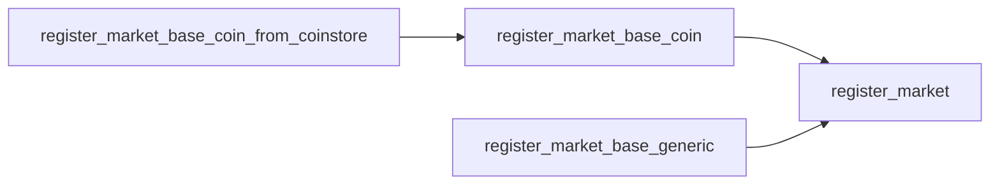
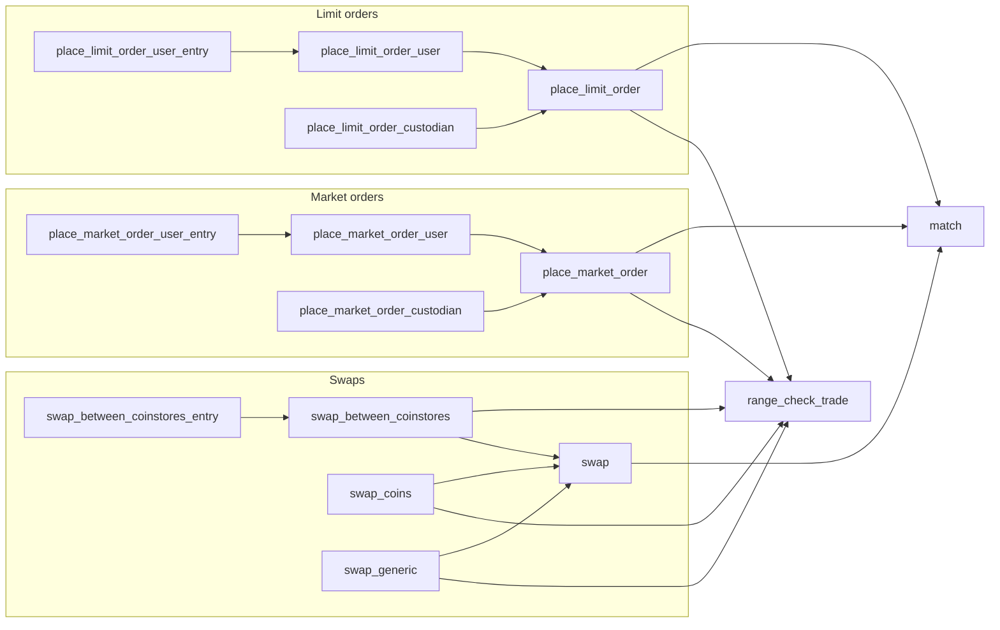
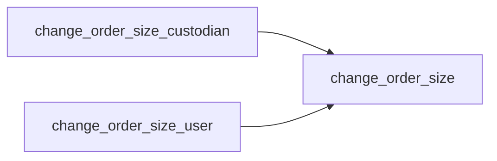
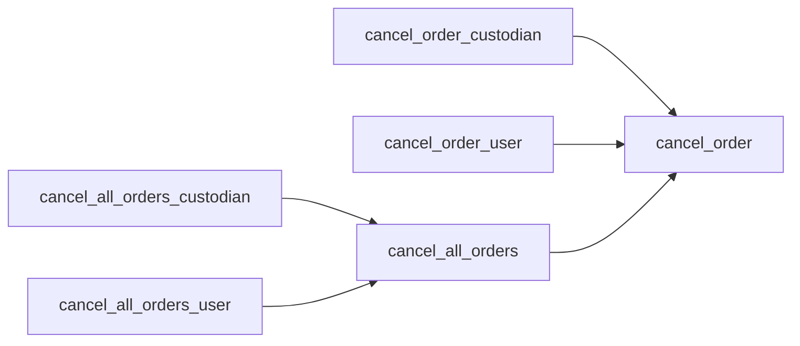
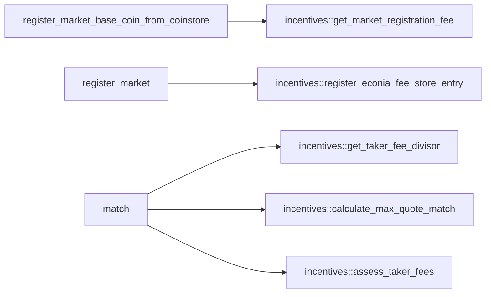
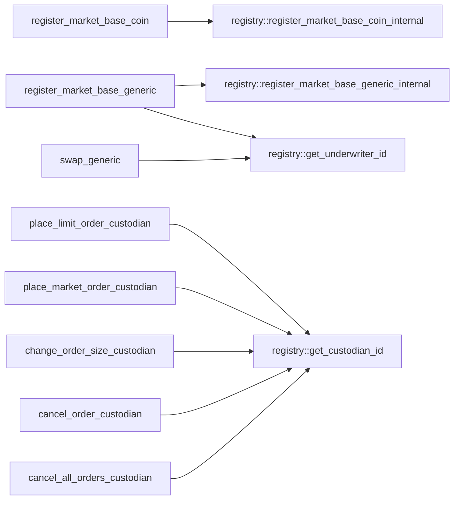
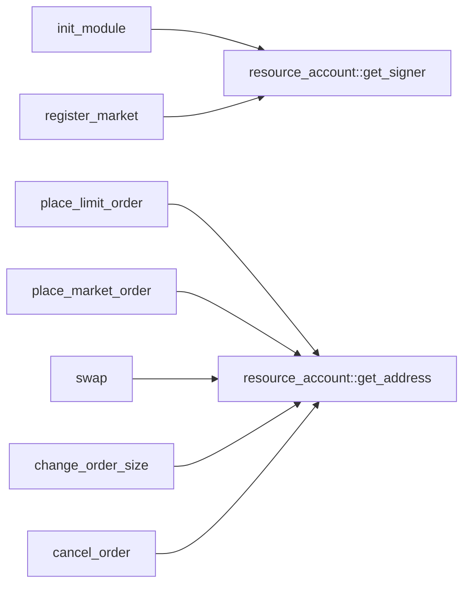
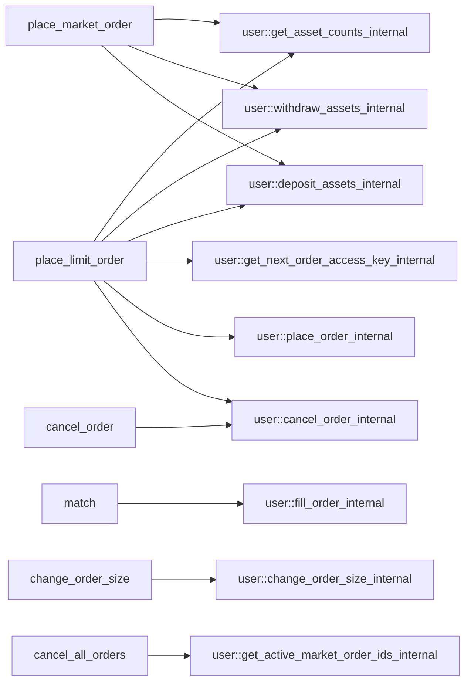

# Module `0xc0deb00c::market`

## Dependency charts

The below dependency charts use <code>mermaid.js</code> syntax, which can be
automatically rendered into a diagram (depending on the browser)
when viewing the documentation file generated from source code. If
a browser renders the diagrams with coloring that makes it difficult
to read, try a different browser.

### Internal dependencies

These charts describe dependencies between <code><a href="market.md#0xc0deb00c_market">market</a></code> functions.

Market registration:

Placing orders:

Changing order size:

Cancelling orders:

### External module dependencies

These charts describe <code><a href="market.md#0xc0deb00c_market">market</a></code> function dependencies on functions
from other Econia modules, other than <code><a href="avl_queue.md#0xc0deb00c_avl_queue">avl_queue</a></code> and <code><a href="tablist.md#0xc0deb00c_tablist">tablist</a></code>,
which are essentially data structure libraries.

<code><a href="incentives.md#0xc0deb00c_incentives">incentives</a></code>:

<code><a href="registry.md#0xc0deb00c_registry">registry</a></code>:

<code><a href="">resource_account</a></code>:

<code><a href="user.md#0xc0deb00c_user">user</a></code>:

## Order management testing

While market registration functions can be simply tested on their
own, order management functions are more efficiently tested through
integrated tests that verify multiple logical branches, returns,
and state updates for each test. Abort tests, however, must still be
tested individually for each function.

### Functions with aborts

Function aborts to test:

* [ ] <code><a href="market.md#0xc0deb00c_market_cancel_order">cancel_order</a>()</code>
* [ ] <code><a href="market.md#0xc0deb00c_market_change_order_size">change_order_size</a>()</code>
* [ ] <code><a href="market.md#0xc0deb00c_market_match">match</a>()</code>
* [x] <code><a href="market.md#0xc0deb00c_market_place_limit_order">place_limit_order</a>()</code>
* [x] <code><a href="market.md#0xc0deb00c_market_range_check_trade">range_check_trade</a>()</code>
* [ ] <code><a href="market.md#0xc0deb00c_market_swap">swap</a>()</code>

### Return proxies

Various order management functions have returns, and verifying the
returns of some functions verifies the returns of associated inner
functions. For example, the collective verification of the returns
of <code><a href="market.md#0xc0deb00c_market_swap_coins">swap_coins</a>()</code> and <code><a href="market.md#0xc0deb00c_market_swap_generic">swap_generic</a>()</code> verifies the returns of both
<code><a href="market.md#0xc0deb00c_market_swap">swap</a>()</code> and <code><a href="market.md#0xc0deb00c_market_match">match</a>()</code>, such that the combination of <code><a href="market.md#0xc0deb00c_market_swap_coins">swap_coins</a>()</code>
and <code><a href="market.md#0xc0deb00c_market_swap_generic">swap_generic</a>()</code> can be considered a "return proxy" of both
<code><a href="market.md#0xc0deb00c_market_swap">swap</a>()</code> and of <code><a href="market.md#0xc0deb00c_market_match">match</a>()</code>. Hence the most efficient test suite
involves return verification for the minimal return proxy set:

| Function                         | Return proxy                |
|----------------------------------|-----------------------------|
| <code><a href="market.md#0xc0deb00c_market_place_limit_order_custodian">place_limit_order_custodian</a>()</code>  | None                        |
| <code><a href="market.md#0xc0deb00c_market_place_limit_order_user">place_limit_order_user</a>()</code>       | None                        |
| <code><a href="market.md#0xc0deb00c_market_place_market_order_custodian">place_market_order_custodian</a>()</code> | None                        |
| <code><a href="market.md#0xc0deb00c_market_place_market_order_user">place_market_order_user</a>()</code>      | None                        |
| <code><a href="market.md#0xc0deb00c_market_swap_between_coinstores">swap_between_coinstores</a>()</code>      | None                        |
| <code><a href="market.md#0xc0deb00c_market_swap_coins">swap_coins</a>()</code>                   | None                        |
| <code><a href="market.md#0xc0deb00c_market_swap_generic">swap_generic</a>()</code>                 | None                        |
| <code><a href="market.md#0xc0deb00c_market_match">match</a>()</code>                   | <code><a href="market.md#0xc0deb00c_market_swap_coins">swap_coins</a>()</code>, <code><a href="market.md#0xc0deb00c_market_swap_generic">swap_generic</a>()</code> |
| <code><a href="market.md#0xc0deb00c_market_place_limit_order">place_limit_order</a>()</code>            | <code><a href="market.md#0xc0deb00c_market_place_limit_order_user">place_limit_order_user</a>()</code>  |
| <code><a href="market.md#0xc0deb00c_market_place_market_order">place_market_order</a>()</code>           | <code><a href="market.md#0xc0deb00c_market_place_market_order_user">place_market_order_user</a>()</code> |
| <code><a href="market.md#0xc0deb00c_market_swap">swap</a>()</code>                    | <code><a href="market.md#0xc0deb00c_market_swap_coins">swap_coins</a>()</code>, <code><a href="market.md#0xc0deb00c_market_swap_generic">swap_generic</a>()</code> |

Function returns to test:

* [x] <code><a href="market.md#0xc0deb00c_market_place_limit_order_custodian">place_limit_order_custodian</a>()</code>
* [x] <code><a href="market.md#0xc0deb00c_market_place_limit_order_user">place_limit_order_user</a>()</code>
* [x] <code><a href="market.md#0xc0deb00c_market_place_market_order_custodian">place_market_order_custodian</a>()</code>
* [x] <code><a href="market.md#0xc0deb00c_market_place_market_order_user">place_market_order_user</a>()</code>
* [x] <code><a href="market.md#0xc0deb00c_market_swap_between_coinstores">swap_between_coinstores</a>()</code>
* [x] <code><a href="market.md#0xc0deb00c_market_swap_coins">swap_coins</a>()</code>
* [x] <code><a href="market.md#0xc0deb00c_market_swap_generic">swap_generic</a>()</code>

### Invocation proxies

Similarly, verifying the invocation of some functions verifies the
invocation of associated inner functions. For example,
<code><a href="market.md#0xc0deb00c_market_cancel_all_orders_user">cancel_all_orders_user</a>()</code> can be considered an invocation proxy
of <code><a href="market.md#0xc0deb00c_market_cancel_all_orders">cancel_all_orders</a>()</code> and of <code><a href="market.md#0xc0deb00c_market_cancel_order">cancel_order</a>()</code>. Here, to provide
100% invocation coverage, only functions at the top of the
dependency stack must be verified.

Function invocations to test:

* [ ] <code><a href="market.md#0xc0deb00c_market_place_limit_order_user_entry">place_limit_order_user_entry</a>()</code>
* [x] <code><a href="market.md#0xc0deb00c_market_place_limit_order_custodian">place_limit_order_custodian</a>()</code>
* [ ] <code><a href="market.md#0xc0deb00c_market_place_market_order_user_entry">place_market_order_user_entry</a>()</code>
* [x] <code><a href="market.md#0xc0deb00c_market_place_market_order_custodian">place_market_order_custodian</a>()</code>
* [x] <code><a href="market.md#0xc0deb00c_market_swap_between_coinstores_entry">swap_between_coinstores_entry</a>()</code>
* [x] <code><a href="market.md#0xc0deb00c_market_swap_coins">swap_coins</a>()</code>
* [x] <code><a href="market.md#0xc0deb00c_market_swap_generic">swap_generic</a>()</code>
* [ ] <code><a href="market.md#0xc0deb00c_market_change_order_size_custodian">change_order_size_custodian</a>()</code>
* [ ] <code><a href="market.md#0xc0deb00c_market_change_order_size_user">change_order_size_user</a>()</code>
* [ ] <code><a href="market.md#0xc0deb00c_market_cancel_order_custodian">cancel_order_custodian</a>()</code>
* [ ] <code><a href="market.md#0xc0deb00c_market_cancel_order_user">cancel_order_user</a>()</code>
* [ ] <code><a href="market.md#0xc0deb00c_market_cancel_all_orders_custodian">cancel_all_orders_custodian</a>()</code>
* [ ] <code><a href="market.md#0xc0deb00c_market_cancel_all_orders_user">cancel_all_orders_user</a>()</code>

### Branching functions

Functions with logical branches to test:

* [x] <code><a href="market.md#0xc0deb00c_market_swap_between_coinstores">swap_between_coinstores</a>()</code>
* [x] <code><a href="market.md#0xc0deb00c_market_swap_coins">swap_coins</a>()</code>
* [x] <code><a href="market.md#0xc0deb00c_market_swap_generic">swap_generic</a>()</code>
* [ ] <code><a href="market.md#0xc0deb00c_market_cancel_all_orders">cancel_all_orders</a>()</code>
* [ ] <code><a href="market.md#0xc0deb00c_market_cancel_order">cancel_order</a>()</code>
* [ ] <code><a href="market.md#0xc0deb00c_market_change_order_size">change_order_size</a>()</code>
* [ ] <code><a href="market.md#0xc0deb00c_market_match">match</a>()</code>
* [x] <code><a href="market.md#0xc0deb00c_market_place_limit_order">place_limit_order</a>()</code>
* [x] <code><a href="market.md#0xc0deb00c_market_place_market_order">place_market_order</a>()</code>
* [x] <code><a href="market.md#0xc0deb00c_market_range_check_trade">range_check_trade</a>()</code>
* [ ] <code><a href="market.md#0xc0deb00c_market_swap">swap</a>()</code>

See each function for its logical branches.

## Complete DocGen index

The below index is automatically generated from source code:

-  [Dependency charts](#@Dependency_charts_0)
    -  [Internal dependencies](#@Internal_dependencies_1)
    -  [External module dependencies](#@External_module_dependencies_2)
-  [Order management testing](#@Order_management_testing_3)
    -  [Functions with aborts](#@Functions_with_aborts_4)
    -  [Return proxies](#@Return_proxies_5)
    -  [Invocation proxies](#@Invocation_proxies_6)
    -  [Branching functions](#@Branching_functions_7)
-  [Complete DocGen index](#@Complete_DocGen_index_8)
-  [Struct `MakerEvent`](#0xc0deb00c_market_MakerEvent)
-  [Struct `Order`](#0xc0deb00c_market_Order)
-  [Struct `OrderBook`](#0xc0deb00c_market_OrderBook)
-  [Resource `OrderBooks`](#0xc0deb00c_market_OrderBooks)
-  [Struct `TakerEvent`](#0xc0deb00c_market_TakerEvent)
-  [Constants](#@Constants_9)
-  [Function `cancel_all_orders_custodian`](#0xc0deb00c_market_cancel_all_orders_custodian)
-  [Function `cancel_order_custodian`](#0xc0deb00c_market_cancel_order_custodian)
-  [Function `change_order_size_custodian`](#0xc0deb00c_market_change_order_size_custodian)
-  [Function `place_limit_order_custodian`](#0xc0deb00c_market_place_limit_order_custodian)
    -  [Invocation and return testing](#@Invocation_and_return_testing_10)
-  [Function `place_limit_order_user`](#0xc0deb00c_market_place_limit_order_user)
    -  [Invocation and return testing](#@Invocation_and_return_testing_11)
-  [Function `place_market_order_custodian`](#0xc0deb00c_market_place_market_order_custodian)
    -  [Invocation and return testing](#@Invocation_and_return_testing_12)
-  [Function `place_market_order_user`](#0xc0deb00c_market_place_market_order_user)
    -  [Invocation and return testing](#@Invocation_and_return_testing_13)
-  [Function `register_market_base_coin`](#0xc0deb00c_market_register_market_base_coin)
    -  [Type parameters](#@Type_parameters_14)
    -  [Parameters](#@Parameters_15)
    -  [Returns](#@Returns_16)
    -  [Testing](#@Testing_17)
-  [Function `register_market_base_generic`](#0xc0deb00c_market_register_market_base_generic)
    -  [Type parameters](#@Type_parameters_18)
    -  [Parameters](#@Parameters_19)
    -  [Returns](#@Returns_20)
    -  [Testing](#@Testing_21)
-  [Function `swap_between_coinstores`](#0xc0deb00c_market_swap_between_coinstores)
    -  [Type Parameters](#@Type_Parameters_22)
    -  [Parameters](#@Parameters_23)
    -  [Returns](#@Returns_24)
    -  [Testing](#@Testing_25)
-  [Function `swap_coins`](#0xc0deb00c_market_swap_coins)
    -  [Type Parameters](#@Type_Parameters_26)
    -  [Parameters](#@Parameters_27)
    -  [Returns](#@Returns_28)
    -  [Terminology](#@Terminology_29)
    -  [Testing](#@Testing_30)
-  [Function `swap_generic`](#0xc0deb00c_market_swap_generic)
    -  [Type Parameters](#@Type_Parameters_31)
    -  [Parameters](#@Parameters_32)
    -  [Returns](#@Returns_33)
    -  [Testing](#@Testing_34)
-  [Function `cancel_all_orders_user`](#0xc0deb00c_market_cancel_all_orders_user)
-  [Function `cancel_order_user`](#0xc0deb00c_market_cancel_order_user)
-  [Function `change_order_size_user`](#0xc0deb00c_market_change_order_size_user)
-  [Function `place_limit_order_user_entry`](#0xc0deb00c_market_place_limit_order_user_entry)
-  [Function `place_market_order_user_entry`](#0xc0deb00c_market_place_market_order_user_entry)
-  [Function `register_market_base_coin_from_coinstore`](#0xc0deb00c_market_register_market_base_coin_from_coinstore)
    -  [Testing](#@Testing_35)
-  [Function `swap_between_coinstores_entry`](#0xc0deb00c_market_swap_between_coinstores_entry)
    -  [Invocation testing](#@Invocation_testing_36)

<pre><code><b>use</b> <a href="">0x1::account</a>;
<b>use</b> <a href="">0x1::coin</a>;
<b>use</b> <a href="">0x1::event</a>;
<b>use</b> <a href="">0x1::option</a>;
<b>use</b> <a href="">0x1::signer</a>;
<b>use</b> <a href="">0x1::string</a>;
<b>use</b> <a href="">0x1::type_info</a>;
<b>use</b> <a href="avl_queue.md#0xc0deb00c_avl_queue">0xc0deb00c::avl_queue</a>;
<b>use</b> <a href="incentives.md#0xc0deb00c_incentives">0xc0deb00c::incentives</a>;
<b>use</b> <a href="registry.md#0xc0deb00c_registry">0xc0deb00c::registry</a>;
<b>use</b> <a href="resource_account.md#0xc0deb00c_resource_account">0xc0deb00c::resource_account</a>;
<b>use</b> <a href="tablist.md#0xc0deb00c_tablist">0xc0deb00c::tablist</a>;
<b>use</b> <a href="user.md#0xc0deb00c_user">0xc0deb00c::user</a>;
</code></pre>

## Struct `MakerEvent`

Emitted when a maker order is placed, cancelled, evicted, or its
size is manually changed.

<pre><code><b>struct</b> <a href="market.md#0xc0deb00c_market_MakerEvent">MakerEvent</a> <b>has</b> drop, store
</code></pre>

## Struct `Order`

An order on the order book.

<pre><code><b>struct</b> <a href="market.md#0xc0deb00c_market_Order">Order</a> <b>has</b> store
</code></pre>

## Struct `OrderBook`

An order book for a given market. Contains
<code><a href="registry.md#0xc0deb00c_registry_MarketInfo">registry::MarketInfo</a></code> field duplicates to reduce global storage
item queries against the registry.

<pre><code><b>struct</b> <a href="market.md#0xc0deb00c_market_OrderBook">OrderBook</a> <b>has</b> store
</code></pre>

## Resource `OrderBooks`

Order book map for all Econia order books.

<pre><code><b>struct</b> <a href="market.md#0xc0deb00c_market_OrderBooks">OrderBooks</a> <b>has</b> key
</code></pre>

## Struct `TakerEvent`

Emitted when a taker order fills against a maker order. If a
taker order fills against multiple maker orders, a separate
event is emitted for each one.

<pre><code><b>struct</b> <a href="market.md#0xc0deb00c_market_TakerEvent">TakerEvent</a> <b>has</b> drop, store
</code></pre>

## Constants

Ascending AVL queue flag, for asks AVL queue.

<pre><code><b>const</b> <a href="market.md#0xc0deb00c_market_ASCENDING">ASCENDING</a>: bool = <b>true</b>;
</code></pre>

Descending AVL queue flag, for bids AVL queue.

<pre><code><b>const</b> <a href="market.md#0xc0deb00c_market_DESCENDING">DESCENDING</a>: bool = <b>false</b>;
</code></pre>

<code>u64</code> bitmask with all bits set, generated in Python via
<code>hex(int('1' * 64, 2))</code>.

<pre><code><b>const</b> <a href="market.md#0xc0deb00c_market_HI_64">HI_64</a>: u64 = 18446744073709551615;
</code></pre>

Flag for null value when null defined as 0.

<pre><code><b>const</b> <a href="market.md#0xc0deb00c_market_NIL">NIL</a>: u64 = 0;
</code></pre>

Flag for buy direction.

<pre><code><b>const</b> <a href="market.md#0xc0deb00c_market_BUY">BUY</a>: bool = <b>true</b>;
</code></pre>

Flag for sell direction.

<pre><code><b>const</b> <a href="market.md#0xc0deb00c_market_SELL">SELL</a>: bool = <b>false</b>;
</code></pre>

Base asset type is invalid.

<pre><code><b>const</b> <a href="market.md#0xc0deb00c_market_E_INVALID_BASE">E_INVALID_BASE</a>: u64 = 7;
</code></pre>

No market with given ID.

<pre><code><b>const</b> <a href="market.md#0xc0deb00c_market_E_INVALID_MARKET_ID">E_INVALID_MARKET_ID</a>: u64 = 6;
</code></pre>

Quote asset type is invalid.

<pre><code><b>const</b> <a href="market.md#0xc0deb00c_market_E_INVALID_QUOTE">E_INVALID_QUOTE</a>: u64 = 8;
</code></pre>

Custodian ID flag for no custodian.

<pre><code><b>const</b> <a href="market.md#0xc0deb00c_market_NO_CUSTODIAN">NO_CUSTODIAN</a>: u64 = 0;
</code></pre>

Underwriter ID flag for no underwriter.

<pre><code><b>const</b> <a href="market.md#0xc0deb00c_market_NO_UNDERWRITER">NO_UNDERWRITER</a>: u64 = 0;
</code></pre>

Flag for ask side.

<pre><code><b>const</b> <a href="market.md#0xc0deb00c_market_ASK">ASK</a>: bool = <b>true</b>;
</code></pre>

Flag for bid side.

<pre><code><b>const</b> <a href="market.md#0xc0deb00c_market_BID">BID</a>: bool = <b>false</b>;
</code></pre>

Market order ID invalid.

<pre><code><b>const</b> <a href="market.md#0xc0deb00c_market_E_INVALID_MARKET_ORDER_ID">E_INVALID_MARKET_ORDER_ID</a>: u64 = 22;
</code></pre>

Underwriter invalid for given market.

<pre><code><b>const</b> <a href="market.md#0xc0deb00c_market_E_INVALID_UNDERWRITER">E_INVALID_UNDERWRITER</a>: u64 = 21;
</code></pre>

Not enough asset to trade away.

<pre><code><b>const</b> <a href="market.md#0xc0deb00c_market_E_NOT_ENOUGH_ASSET_OUT">E_NOT_ENOUGH_ASSET_OUT</a>: u64 = 5;
</code></pre>

Filling order would overflow asset received from trade.

<pre><code><b>const</b> <a href="market.md#0xc0deb00c_market_E_OVERFLOW_ASSET_IN">E_OVERFLOW_ASSET_IN</a>: u64 = 4;
</code></pre>

Order price specified as 0.

<pre><code><b>const</b> <a href="market.md#0xc0deb00c_market_E_PRICE_0">E_PRICE_0</a>: u64 = 11;
</code></pre>

Order price exceeds maximum allowable price.

<pre><code><b>const</b> <a href="market.md#0xc0deb00c_market_E_PRICE_TOO_HIGH">E_PRICE_TOO_HIGH</a>: u64 = 12;
</code></pre>

Maximum possible price that can be encoded in 32 bits. Generated
in Python via <code>hex(int('1' * 32, 2))</code>.

<pre><code><b>const</b> <a href="market.md#0xc0deb00c_market_MAX_PRICE">MAX_PRICE</a>: u64 = 4294967295;
</code></pre>

Flag for <code><a href="market.md#0xc0deb00c_market_MakerEvent">MakerEvent</a>.type</code> when order is cancelled.

<pre><code><b>const</b> <a href="market.md#0xc0deb00c_market_CANCEL">CANCEL</a>: u8 = 0;
</code></pre>

Flag for <code><a href="market.md#0xc0deb00c_market_MakerEvent">MakerEvent</a>.type</code> when order size is changed.

<pre><code><b>const</b> <a href="market.md#0xc0deb00c_market_CHANGE">CHANGE</a>: u8 = 1;
</code></pre>

Critical tree height above which evictions may take place.

<pre><code><b>const</b> <a href="market.md#0xc0deb00c_market_CRITICAL_HEIGHT">CRITICAL_HEIGHT</a>: u8 = 10;
</code></pre>

Flag for <code><a href="market.md#0xc0deb00c_market_MakerEvent">MakerEvent</a>.type</code> when order is evicted.

<pre><code><b>const</b> <a href="market.md#0xc0deb00c_market_EVICT">EVICT</a>: u8 = 2;
</code></pre>

Fill-or-abort price does not cross the spread.

<pre><code><b>const</b> <a href="market.md#0xc0deb00c_market_E_FILL_OR_ABORT_NOT_CROSS_SPREAD">E_FILL_OR_ABORT_NOT_CROSS_SPREAD</a>: u64 = 25;
</code></pre>

Custodian not authorized for operation.

<pre><code><b>const</b> <a href="market.md#0xc0deb00c_market_E_INVALID_CUSTODIAN">E_INVALID_CUSTODIAN</a>: u64 = 23;
</code></pre>

Invalid restriction flag.

<pre><code><b>const</b> <a href="market.md#0xc0deb00c_market_E_INVALID_RESTRICTION">E_INVALID_RESTRICTION</a>: u64 = 18;
</code></pre>

Invalid user indicated for operation.

<pre><code><b>const</b> <a href="market.md#0xc0deb00c_market_E_INVALID_USER">E_INVALID_USER</a>: u64 = 24;
</code></pre>

Maximum base trade amount specified as 0.

<pre><code><b>const</b> <a href="market.md#0xc0deb00c_market_E_MAX_BASE_0">E_MAX_BASE_0</a>: u64 = 0;
</code></pre>

Maximum quote trade amount specified as 0.

<pre><code><b>const</b> <a href="market.md#0xc0deb00c_market_E_MAX_QUOTE_0">E_MAX_QUOTE_0</a>: u64 = 1;
</code></pre>

Minimum base trade amount exceeds maximum base trade amount.

<pre><code><b>const</b> <a href="market.md#0xc0deb00c_market_E_MIN_BASE_EXCEEDS_MAX">E_MIN_BASE_EXCEEDS_MAX</a>: u64 = 2;
</code></pre>

Minimum base asset trade amount requirement not met.

<pre><code><b>const</b> <a href="market.md#0xc0deb00c_market_E_MIN_BASE_NOT_TRADED">E_MIN_BASE_NOT_TRADED</a>: u64 = 9;
</code></pre>

Minimum quote trade amount exceeds maximum quote trade amount.

<pre><code><b>const</b> <a href="market.md#0xc0deb00c_market_E_MIN_QUOTE_EXCEEDS_MAX">E_MIN_QUOTE_EXCEEDS_MAX</a>: u64 = 3;
</code></pre>

Minimum quote coin trade amount requirement not met.

<pre><code><b>const</b> <a href="market.md#0xc0deb00c_market_E_MIN_QUOTE_NOT_TRADED">E_MIN_QUOTE_NOT_TRADED</a>: u64 = 10;
</code></pre>

Post-or-abort limit order price crosses spread.

<pre><code><b>const</b> <a href="market.md#0xc0deb00c_market_E_POST_OR_ABORT_CROSSES_SPREAD">E_POST_OR_ABORT_CROSSES_SPREAD</a>: u64 = 13;
</code></pre>

No room to insert order with such low price-time priority.

<pre><code><b>const</b> <a href="market.md#0xc0deb00c_market_E_PRICE_TIME_PRIORITY_TOO_LOW">E_PRICE_TIME_PRIORITY_TOO_LOW</a>: u64 = 20;
</code></pre>

Taker and maker have same address.

<pre><code><b>const</b> <a href="market.md#0xc0deb00c_market_E_SELF_MATCH">E_SELF_MATCH</a>: u64 = 19;
</code></pre>

Limit order size results in base asset amount overflow.

<pre><code><b>const</b> <a href="market.md#0xc0deb00c_market_E_SIZE_BASE_OVERFLOW">E_SIZE_BASE_OVERFLOW</a>: u64 = 15;
</code></pre>

Limit order size and price results in quote amount overflow.

<pre><code><b>const</b> <a href="market.md#0xc0deb00c_market_E_SIZE_PRICE_QUOTE_OVERFLOW">E_SIZE_PRICE_QUOTE_OVERFLOW</a>: u64 = 17;
</code></pre>

Limit order size and price results in ticks amount overflow.

<pre><code><b>const</b> <a href="market.md#0xc0deb00c_market_E_SIZE_PRICE_TICKS_OVERFLOW">E_SIZE_PRICE_TICKS_OVERFLOW</a>: u64 = 16;
</code></pre>

Limit order size does not meet minimum size for market.

<pre><code><b>const</b> <a href="market.md#0xc0deb00c_market_E_SIZE_TOO_SMALL">E_SIZE_TOO_SMALL</a>: u64 = 14;
</code></pre>

Flag for fill-or-abort order restriction.

<pre><code><b>const</b> <a href="market.md#0xc0deb00c_market_FILL_OR_ABORT">FILL_OR_ABORT</a>: u8 = 1;
</code></pre>

All bits set in integer of width required to encode price.
Generated in Python via <code>hex(int('1' * 32, 2))</code>.

<pre><code><b>const</b> <a href="market.md#0xc0deb00c_market_HI_PRICE">HI_PRICE</a>: u64 = 4294967295;
</code></pre>

Flag for immediate-or-cancel order restriction.

<pre><code><b>const</b> <a href="market.md#0xc0deb00c_market_IMMEDIATE_OR_CANCEL">IMMEDIATE_OR_CANCEL</a>: u8 = 2;
</code></pre>

Flag to trade max possible asset amount: <code>u64</code> bitmask with all
bits set, generated in Python via <code>hex(int('1' * 64, 2))</code>.

<pre><code><b>const</b> <a href="market.md#0xc0deb00c_market_MAX_POSSIBLE">MAX_POSSIBLE</a>: u64 = 18446744073709551615;
</code></pre>

Flag for no order restriction.

<pre><code><b>const</b> <a href="market.md#0xc0deb00c_market_NO_RESTRICTION">NO_RESTRICTION</a>: u8 = 0;
</code></pre>

Number of restriction flags.

<pre><code><b>const</b> <a href="market.md#0xc0deb00c_market_N_RESTRICTIONS">N_RESTRICTIONS</a>: u8 = 3;
</code></pre>

Flag for <code><a href="market.md#0xc0deb00c_market_MakerEvent">MakerEvent</a>.type</code> when order is placed.

<pre><code><b>const</b> <a href="market.md#0xc0deb00c_market_PLACE">PLACE</a>: u8 = 3;
</code></pre>

Flag for post-or-abort order restriction.

<pre><code><b>const</b> <a href="market.md#0xc0deb00c_market_POST_OR_ABORT">POST_OR_ABORT</a>: u8 = 3;
</code></pre>

Number of bits maker order counter is shifted in a market order
ID.

<pre><code><b>const</b> <a href="market.md#0xc0deb00c_market_SHIFT_COUNTER">SHIFT_COUNTER</a>: u8 = 64;
</code></pre>

Taker address flag for when taker is unknown.

<pre><code><b>const</b> <a href="market.md#0xc0deb00c_market_UNKNOWN_TAKER">UNKNOWN_TAKER</a>: <b>address</b> = 0;
</code></pre>

## Function `cancel_all_orders_custodian`

Public function wrapper for <code><a href="market.md#0xc0deb00c_market_cancel_all_orders">cancel_all_orders</a>()</code> for cancelling
orders under authority of delegated custodian.

<pre><code><b>public</b> <b>fun</b> <a href="market.md#0xc0deb00c_market_cancel_all_orders_custodian">cancel_all_orders_custodian</a>(user_address: <b>address</b>, market_id: u64, side: bool, custodian_capability_ref: &<a href="registry.md#0xc0deb00c_registry_CustodianCapability">registry::CustodianCapability</a>)
</code></pre>

## Function `cancel_order_custodian`

Public function wrapper for <code><a href="market.md#0xc0deb00c_market_cancel_order">cancel_order</a>()</code> for cancelling
order under authority of delegated custodian.

<pre><code><b>public</b> <b>fun</b> <a href="market.md#0xc0deb00c_market_cancel_order_custodian">cancel_order_custodian</a>(user_address: <b>address</b>, market_id: u64, side: bool, market_order_id: u128, custodian_capability_ref: &<a href="registry.md#0xc0deb00c_registry_CustodianCapability">registry::CustodianCapability</a>)
</code></pre>

## Function `change_order_size_custodian`

Public function wrapper for <code><a href="market.md#0xc0deb00c_market_change_order_size">change_order_size</a>()</code> for changing
order size under authority of delegated custodian.

<pre><code><b>public</b> <b>fun</b> <a href="market.md#0xc0deb00c_market_change_order_size_custodian">change_order_size_custodian</a>(user_address: <b>address</b>, market_id: u64, side: bool, market_order_id: u128, new_size: u64, custodian_capability_ref: &<a href="registry.md#0xc0deb00c_registry_CustodianCapability">registry::CustodianCapability</a>)
</code></pre>

## Function `place_limit_order_custodian`

Public function wrapper for <code><a href="market.md#0xc0deb00c_market_place_limit_order">place_limit_order</a>()</code> for placing
order under authority of delegated custodian.

### Invocation and return testing

* <code>test_place_limit_order_no_cross_bid_custodian()</code>

<pre><code><b>public</b> <b>fun</b> <a href="market.md#0xc0deb00c_market_place_limit_order_custodian">place_limit_order_custodian</a>&lt;BaseType, QuoteType&gt;(user_address: <b>address</b>, market_id: u64, integrator: <b>address</b>, side: bool, size: u64, price: u64, restriction: u8, custodian_capability_ref: &<a href="registry.md#0xc0deb00c_registry_CustodianCapability">registry::CustodianCapability</a>): (u128, u64, u64, u64)
</code></pre>

## Function `place_limit_order_user`

Public function wrapper for <code><a href="market.md#0xc0deb00c_market_place_limit_order">place_limit_order</a>()</code> for placing
order under authority of signing user.

### Invocation and return testing

* <code>test_place_limit_order_crosses_ask_exact()</code>
* <code>test_place_limit_order_crosses_ask_partial()</code>
* <code>test_place_limit_order_crosses_ask_partial_cancel()</code>
* <code>test_place_limit_order_crosses_bid_exact()</code>
* <code>test_place_limit_order_crosses_bid_partial()</code>
* <code>test_place_limit_order_evict()</code>
* <code>test_place_limit_order_no_cross_ask_user()</code>

<pre><code><b>public</b> <b>fun</b> <a href="market.md#0xc0deb00c_market_place_limit_order_user">place_limit_order_user</a>&lt;BaseType, QuoteType&gt;(<a href="user.md#0xc0deb00c_user">user</a>: &<a href="">signer</a>, market_id: u64, integrator: <b>address</b>, side: bool, size: u64, price: u64, restriction: u8): (u128, u64, u64, u64)
</code></pre>

## Function `place_market_order_custodian`

Public function wrapper for <code><a href="market.md#0xc0deb00c_market_place_market_order">place_market_order</a>()</code> for placing
order under authority of delegated custodian.

### Invocation and return testing

* <code>test_place_market_order_max_base_sell_custodian()</code>
* <code>test_place_market_order_max_quote_buy_custodian()</code>

<pre><code><b>public</b> <b>fun</b> <a href="market.md#0xc0deb00c_market_place_market_order_custodian">place_market_order_custodian</a>&lt;BaseType, QuoteType&gt;(user_address: <b>address</b>, market_id: u64, integrator: <b>address</b>, direction: bool, min_base: u64, max_base: u64, min_quote: u64, max_quote: u64, limit_price: u64, custodian_capability_ref: &<a href="registry.md#0xc0deb00c_registry_CustodianCapability">registry::CustodianCapability</a>): (u64, u64, u64)
</code></pre>

## Function `place_market_order_user`

Public function wrapper for <code><a href="market.md#0xc0deb00c_market_place_market_order">place_market_order</a>()</code> for placing
order under authority of signing user.

### Invocation and return testing

* <code>test_place_market_order_max_base_buy_user()</code>
* <code>test_place_market_order_max_quote_sell_user()</code>

<pre><code><b>public</b> <b>fun</b> <a href="market.md#0xc0deb00c_market_place_market_order_user">place_market_order_user</a>&lt;BaseType, QuoteType&gt;(<a href="user.md#0xc0deb00c_user">user</a>: &<a href="">signer</a>, market_id: u64, integrator: <b>address</b>, direction: bool, min_base: u64, max_base: u64, min_quote: u64, max_quote: u64, limit_price: u64): (u64, u64, u64)
</code></pre>

## Function `register_market_base_coin`

Register pure coin market, return resultant market ID.

See inner function <code><a href="market.md#0xc0deb00c_market_register_market">register_market</a>()</code>.

### Type parameters

* <code>BaseType</code>: Base coin type for market.
* <code>QuoteType</code>: Quote coin type for market.
* <code>UtilityType</code>: Utility coin type, specified at
<code><a href="incentives.md#0xc0deb00c_incentives_IncentiveParameters">incentives::IncentiveParameters</a>.utility_coin_type_info</code>.

### Parameters

* <code>lot_size</code>: <code><a href="registry.md#0xc0deb00c_registry_MarketInfo">registry::MarketInfo</a>.lot_size</code> for market.
* <code>tick_size</code>: <code><a href="registry.md#0xc0deb00c_registry_MarketInfo">registry::MarketInfo</a>.tick_size</code> for market.
* <code>min_size</code>: <code><a href="registry.md#0xc0deb00c_registry_MarketInfo">registry::MarketInfo</a>.min_size</code> for market.
* <code>utility_coins</code>: Utility coins paid to register a market. See
<code><a href="incentives.md#0xc0deb00c_incentives_IncentiveParameters">incentives::IncentiveParameters</a>.market_registration_fee</code>.

### Returns

* <code>u64</code>: Market ID for new market.

### Testing

* <code>test_register_markets()</code>

<pre><code><b>public</b> <b>fun</b> <a href="market.md#0xc0deb00c_market_register_market_base_coin">register_market_base_coin</a>&lt;BaseType, QuoteType, UtilityType&gt;(lot_size: u64, tick_size: u64, min_size: u64, utility_coins: <a href="_Coin">coin::Coin</a>&lt;UtilityType&gt;): u64
</code></pre>

## Function `register_market_base_generic`

Register generic market, return resultant market ID.

See inner function <code><a href="market.md#0xc0deb00c_market_register_market">register_market</a>()</code>.

Generic base name restrictions described at
<code><a href="registry.md#0xc0deb00c_registry_register_market_base_generic_internal">registry::register_market_base_generic_internal</a>()</code>.

### Type parameters

* <code>QuoteType</code>: Quote coin type for market.
* <code>UtilityType</code>: Utility coin type, specified at
<code><a href="incentives.md#0xc0deb00c_incentives_IncentiveParameters">incentives::IncentiveParameters</a>.utility_coin_type_info</code>.

### Parameters

* <code>base_name_generic</code>: <code><a href="registry.md#0xc0deb00c_registry_MarketInfo">registry::MarketInfo</a>.base_name_generic</code>
for market.
* <code>lot_size</code>: <code><a href="registry.md#0xc0deb00c_registry_MarketInfo">registry::MarketInfo</a>.lot_size</code> for market.
* <code>tick_size</code>: <code><a href="registry.md#0xc0deb00c_registry_MarketInfo">registry::MarketInfo</a>.tick_size</code> for market.
* <code>min_size</code>: <code><a href="registry.md#0xc0deb00c_registry_MarketInfo">registry::MarketInfo</a>.min_size</code> for market.
* <code>utility_coins</code>: Utility coins paid to register a market. See
<code><a href="incentives.md#0xc0deb00c_incentives_IncentiveParameters">incentives::IncentiveParameters</a>.market_registration_fee</code>.
* <code>underwriter_capability_ref</code>: Immutable reference to market
underwriter capability.

### Returns

* <code>u64</code>: Market ID for new market.

### Testing

* <code>test_register_markets()</code>

<pre><code><b>public</b> <b>fun</b> <a href="market.md#0xc0deb00c_market_register_market_base_generic">register_market_base_generic</a>&lt;QuoteType, UtilityType&gt;(base_name_generic: <a href="_String">string::String</a>, lot_size: u64, tick_size: u64, min_size: u64, utility_coins: <a href="_Coin">coin::Coin</a>&lt;UtilityType&gt;, underwriter_capability_ref: &<a href="registry.md#0xc0deb00c_registry_UnderwriterCapability">registry::UnderwriterCapability</a>): u64
</code></pre>

## Function `swap_between_coinstores`

Swap against the order book between a user's coin stores.

Initializes an <code>aptos_framework::coin::CoinStore</code> for each coin
type that does not yet have one.

### Type Parameters

* <code>BaseType</code>: Same as for <code><a href="market.md#0xc0deb00c_market_match">match</a>()</code>.
* <code>QuoteType</code>: Same as for <code><a href="market.md#0xc0deb00c_market_match">match</a>()</code>.

### Parameters

* <code><a href="user.md#0xc0deb00c_user">user</a></code>: Account of swapping user.
* <code>market_id</code>: Same as for <code><a href="market.md#0xc0deb00c_market_match">match</a>()</code>.
* <code>integrator</code>: Same as for <code><a href="market.md#0xc0deb00c_market_match">match</a>()</code>.
* <code>direction</code>: Same as for <code><a href="market.md#0xc0deb00c_market_match">match</a>()</code>.
* <code>min_base</code>: Same as for <code><a href="market.md#0xc0deb00c_market_match">match</a>()</code>.
* <code>max_base</code>: Same as for <code><a href="market.md#0xc0deb00c_market_match">match</a>()</code>. If passed as <code><a href="market.md#0xc0deb00c_market_MAX_POSSIBLE">MAX_POSSIBLE</a></code>
will attempt to trade maximum possible amount for coin store.
* <code>min_quote</code>: Same as for <code><a href="market.md#0xc0deb00c_market_match">match</a>()</code>.
* <code>max_quote</code>: Same as for <code><a href="market.md#0xc0deb00c_market_match">match</a>()</code>. If passed as
<code><a href="market.md#0xc0deb00c_market_MAX_POSSIBLE">MAX_POSSIBLE</a></code> will attempt to trade maximum possible amount
for coin store.
* <code>limit_price</code>: Same as for <code><a href="market.md#0xc0deb00c_market_match">match</a>()</code>.

### Returns

* <code>u64</code>: Base asset trade amount, same as for <code><a href="market.md#0xc0deb00c_market_match">match</a>()</code>.
* <code>u64</code>: Quote coin trade amount, same as for <code><a href="market.md#0xc0deb00c_market_match">match</a>()</code>.
* <code>u64</code>: Quote coin fees paid, same as for <code><a href="market.md#0xc0deb00c_market_match">match</a>()</code>.

### Testing

* <code>test_swap_between_coinstores_max_possible_base_buy()</code>
* <code>test_swap_between_coinstores_max_possible_base_sell()</code>
* <code>test_swap_between_coinstores_max_possible_quote_buy()</code>
* <code>test_swap_between_coinstores_max_possible_quote_sell()</code>
* <code>test_swap_between_coinstores_register_base_store()</code>
* <code>test_swap_between_coinstores_register_quote_store()</code>

<pre><code><b>public</b> <b>fun</b> <a href="market.md#0xc0deb00c_market_swap_between_coinstores">swap_between_coinstores</a>&lt;BaseType, QuoteType&gt;(<a href="user.md#0xc0deb00c_user">user</a>: &<a href="">signer</a>, market_id: u64, integrator: <b>address</b>, direction: bool, min_base: u64, max_base: u64, min_quote: u64, max_quote: u64, limit_price: u64): (u64, u64, u64)
</code></pre>

## Function `swap_coins`

Swap standalone coins against the order book.

If a buy, attempts to spend all quote coins. If a sell, attempts
to sell all base coins.

Passes all base coins to matching engine if a buy or a sell, and
passes all quote coins to matching engine if a buy. If a sell,
does not pass any quote coins to matching engine, to avoid
intermediate quote match overflow that could occur prior to fee
assessment.

### Type Parameters

* <code>BaseType</code>: Same as for <code><a href="market.md#0xc0deb00c_market_match">match</a>()</code>.
* <code>QuoteType</code>: Same as for <code><a href="market.md#0xc0deb00c_market_match">match</a>()</code>.

### Parameters

* <code>market_id</code>: Same as for <code><a href="market.md#0xc0deb00c_market_match">match</a>()</code>.
* <code>integrator</code>: Same as for <code><a href="market.md#0xc0deb00c_market_match">match</a>()</code>.
* <code>direction</code>: Same as for <code><a href="market.md#0xc0deb00c_market_match">match</a>()</code>.
* <code>min_base</code>: Same as for <code><a href="market.md#0xc0deb00c_market_match">match</a>()</code>.
* <code>max_base</code>: Same as for <code><a href="market.md#0xc0deb00c_market_match">match</a>()</code>. Ignored if a sell. Else if
passed as <code><a href="market.md#0xc0deb00c_market_MAX_POSSIBLE">MAX_POSSIBLE</a></code> will attempt to trade maximum
possible amount for passed coin holdings.
* <code>min_quote</code>: Same as for <code><a href="market.md#0xc0deb00c_market_match">match</a>()</code>.
* <code>max_quote</code>: Same as for <code><a href="market.md#0xc0deb00c_market_match">match</a>()</code>. Ignored if a buy. Else if
passed as <code><a href="market.md#0xc0deb00c_market_MAX_POSSIBLE">MAX_POSSIBLE</a></code> will attempt to trade maximum
possible amount for passed coin holdings.
* <code>limit_price</code>: Same as for <code><a href="market.md#0xc0deb00c_market_match">match</a>()</code>.
* <code>base_coins</code>: Same as <code>optional_base_coins</code> for <code><a href="market.md#0xc0deb00c_market_match">match</a>()</code>, but
unpacked.
* <code>quote_coins</code>: Same as for <code><a href="market.md#0xc0deb00c_market_match">match</a>()</code>.

### Returns

* <code>Coin&lt;BaseType&gt;</code>: Updated base coin holdings, same as for
<code><a href="market.md#0xc0deb00c_market_match">match</a>()</code> but unpacked.
* <code>Coin&lt;QuoteType&gt;</code>: Updated quote coin holdings, same as for
<code><a href="market.md#0xc0deb00c_market_match">match</a>()</code>.
* <code>u64</code>: Base coin trade amount, same as for <code><a href="market.md#0xc0deb00c_market_match">match</a>()</code>.
* <code>u64</code>: Quote coin trade amount, same as for <code><a href="market.md#0xc0deb00c_market_match">match</a>()</code>.
* <code>u64</code>: Quote coin fees paid, same as for <code><a href="market.md#0xc0deb00c_market_match">match</a>()</code>.

### Terminology

* The "inbound" asset is the asset received from a trade: base
coins in the case of a buy, quote coins in the case of a sell.
* The "outbound" asset is the asset traded away: quote coins in
the case of a buy, base coins in the case of a sell.

### Testing

* <code>test_swap_coins_buy_max_base_limiting()</code>
* <code>test_swap_coins_buy_no_max_quote_limiting()</code>
* <code>test_swap_coins_buy_no_max_base_limiting()</code>
* <code>test_swap_coins_sell_max_quote_limiting()</code>
* <code>test_swap_coins_sell_no_max_base_limiting()</code>
* <code>test_swap_coins_sell_no_max_quote_limiting()</code>

<pre><code><b>public</b> <b>fun</b> <a href="market.md#0xc0deb00c_market_swap_coins">swap_coins</a>&lt;BaseType, QuoteType&gt;(market_id: u64, integrator: <b>address</b>, direction: bool, min_base: u64, max_base: u64, min_quote: u64, max_quote: u64, limit_price: u64, base_coins: <a href="_Coin">coin::Coin</a>&lt;BaseType&gt;, quote_coins: <a href="_Coin">coin::Coin</a>&lt;QuoteType&gt;): (<a href="_Coin">coin::Coin</a>&lt;BaseType&gt;, <a href="_Coin">coin::Coin</a>&lt;QuoteType&gt;, u64, u64, u64)
</code></pre>

## Function `swap_generic`

Swap against the order book for a generic market, under
authority of market underwriter.

Passes all quote coins to matching engine if a buy. If a sell,
does not pass any quote coins to matching engine, to avoid
intermediate quote match overflow that could occur prior to fee
assessment.

### Type Parameters

* <code>QuoteType</code>: Same as for <code><a href="market.md#0xc0deb00c_market_match">match</a>()</code>.

### Parameters

* <code>market_id</code>: Same as for <code><a href="market.md#0xc0deb00c_market_match">match</a>()</code>.
* <code>integrator</code>: Same as for <code><a href="market.md#0xc0deb00c_market_match">match</a>()</code>.
* <code>direction</code>: Same as for <code><a href="market.md#0xc0deb00c_market_match">match</a>()</code>.
* <code>min_base</code>: Same as for <code><a href="market.md#0xc0deb00c_market_match">match</a>()</code>.
* <code>max_base</code>: Same as for <code><a href="market.md#0xc0deb00c_market_match">match</a>()</code>.
* <code>min_quote</code>: Same as for <code><a href="market.md#0xc0deb00c_market_match">match</a>()</code>.
* <code>max_quote</code>: Same as for <code><a href="market.md#0xc0deb00c_market_match">match</a>()</code>. Ignored if a buy. Else if
passed as <code><a href="market.md#0xc0deb00c_market_MAX_POSSIBLE">MAX_POSSIBLE</a></code> will attempt to trade maximum
possible amount for passed coin holdings.
* <code>limit_price</code>: Same as for <code><a href="market.md#0xc0deb00c_market_match">match</a>()</code>.
* <code>quote_coins</code>: Same as for <code><a href="market.md#0xc0deb00c_market_match">match</a>()</code>.
* <code>underwriter_capability_ref</code>: Immutable reference to
underwriter capability for given market.

### Returns

* <code>Coin&lt;QuoteType&gt;</code>: Updated quote coin holdings, same as for
<code><a href="market.md#0xc0deb00c_market_match">match</a>()</code>.
* <code>u64</code>: Base asset trade amount, same as for <code><a href="market.md#0xc0deb00c_market_match">match</a>()</code>.
* <code>u64</code>: Quote coin trade amount, same as for <code><a href="market.md#0xc0deb00c_market_match">match</a>()</code>.
* <code>u64</code>: Quote coin fees paid, same as for <code><a href="market.md#0xc0deb00c_market_match">match</a>()</code>.

### Testing

* <code>test_swap_generic_buy_base_limiting()</code>
* <code>test_swap_generic_buy_quote_limiting()</code>
* <code>test_swap_generic_sell_max_quote_limiting()</code>
* <code>test_swap_generic_sell_no_max_base_limiting()</code>
* <code>test_swap_generic_sell_no_max_quote_limiting()</code>

<pre><code><b>public</b> <b>fun</b> <a href="market.md#0xc0deb00c_market_swap_generic">swap_generic</a>&lt;QuoteType&gt;(market_id: u64, integrator: <b>address</b>, direction: bool, min_base: u64, max_base: u64, min_quote: u64, max_quote: u64, limit_price: u64, quote_coins: <a href="_Coin">coin::Coin</a>&lt;QuoteType&gt;, underwriter_capability_ref: &<a href="registry.md#0xc0deb00c_registry_UnderwriterCapability">registry::UnderwriterCapability</a>): (<a href="_Coin">coin::Coin</a>&lt;QuoteType&gt;, u64, u64, u64)
</code></pre>

## Function `cancel_all_orders_user`

Public entry function wrapper for <code><a href="market.md#0xc0deb00c_market_cancel_all_orders">cancel_all_orders</a>()</code> for
cancelling orders under authority of signing user.

<pre><code><b>public</b> entry <b>fun</b> <a href="market.md#0xc0deb00c_market_cancel_all_orders_user">cancel_all_orders_user</a>(<a href="user.md#0xc0deb00c_user">user</a>: &<a href="">signer</a>, market_id: u64, side: bool)
</code></pre>

## Function `cancel_order_user`

Public entry function wrapper for <code><a href="market.md#0xc0deb00c_market_cancel_order">cancel_order</a>()</code> for
cancelling order under authority of signing user.

<pre><code><b>public</b> entry <b>fun</b> <a href="market.md#0xc0deb00c_market_cancel_order_user">cancel_order_user</a>(<a href="user.md#0xc0deb00c_user">user</a>: &<a href="">signer</a>, market_id: u64, side: bool, market_order_id: u128)
</code></pre>

## Function `change_order_size_user`

Public entry function wrapper for <code><a href="market.md#0xc0deb00c_market_change_order_size">change_order_size</a>()</code> for
changing order size under authority of signing user.

<pre><code><b>public</b> entry <b>fun</b> <a href="market.md#0xc0deb00c_market_change_order_size_user">change_order_size_user</a>(<a href="user.md#0xc0deb00c_user">user</a>: &<a href="">signer</a>, market_id: u64, side: bool, market_order_id: u128, new_size: u64)
</code></pre>

## Function `place_limit_order_user_entry`

Public entry function wrapper for <code><a href="market.md#0xc0deb00c_market_place_limit_order_user">place_limit_order_user</a>()</code>.

<pre><code><b>public</b> entry <b>fun</b> <a href="market.md#0xc0deb00c_market_place_limit_order_user_entry">place_limit_order_user_entry</a>&lt;BaseType, QuoteType&gt;(<a href="user.md#0xc0deb00c_user">user</a>: &<a href="">signer</a>, market_id: u64, integrator: <b>address</b>, side: bool, size: u64, price: u64, restriction: u8)
</code></pre>

## Function `place_market_order_user_entry`

Public entry function wrapper for <code><a href="market.md#0xc0deb00c_market_place_market_order_user">place_market_order_user</a>()</code>.

<pre><code><b>public</b> entry <b>fun</b> <a href="market.md#0xc0deb00c_market_place_market_order_user_entry">place_market_order_user_entry</a>&lt;BaseType, QuoteType&gt;(<a href="user.md#0xc0deb00c_user">user</a>: &<a href="">signer</a>, market_id: u64, integrator: <b>address</b>, direction: bool, min_base: u64, max_base: u64, min_quote: u64, max_quote: u64, limit_price: u64)
</code></pre>

## Function `register_market_base_coin_from_coinstore`

Wrapped call to <code><a href="market.md#0xc0deb00c_market_register_market_base_coin">register_market_base_coin</a>()</code> for paying utility
coins from an <code>aptos_framework::coin::CoinStore</code>.

### Testing

* <code>test_register_markets()</code>

<pre><code><b>public</b> entry <b>fun</b> <a href="market.md#0xc0deb00c_market_register_market_base_coin_from_coinstore">register_market_base_coin_from_coinstore</a>&lt;BaseType, QuoteType, UtilityType&gt;(<a href="user.md#0xc0deb00c_user">user</a>: &<a href="">signer</a>, lot_size: u64, tick_size: u64, min_size: u64)
</code></pre>

## Function `swap_between_coinstores_entry`

Public entry function wrapper for <code><a href="market.md#0xc0deb00c_market_swap_between_coinstores">swap_between_coinstores</a>()</code>.

### Invocation testing

* <code>test_swap_between_coinstores_register_base_store()</code>
* <code>test_swap_between_coinstores_register_quote_store()</code>

<pre><code><b>public</b> entry <b>fun</b> <a href="market.md#0xc0deb00c_market_swap_between_coinstores_entry">swap_between_coinstores_entry</a>&lt;BaseType, QuoteType&gt;(<a href="user.md#0xc0deb00c_user">user</a>: &<a href="">signer</a>, market_id: u64, integrator: <b>address</b>, direction: bool, min_base: u64, max_base: u64, min_quote: u64, max_quote: u64, limit_price: u64)
</code></pre>
