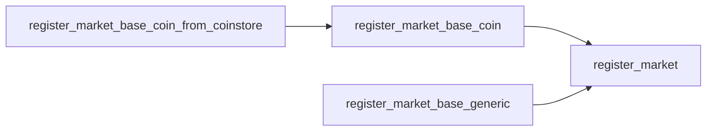
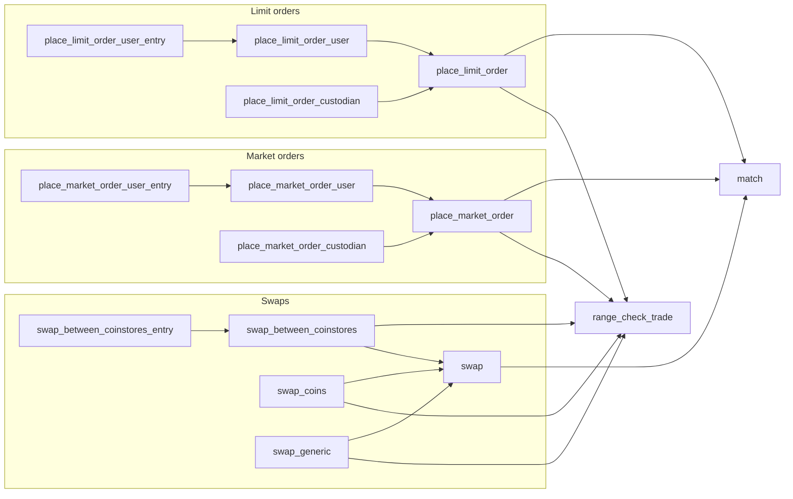
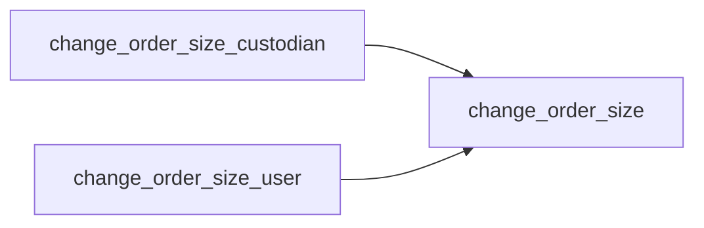
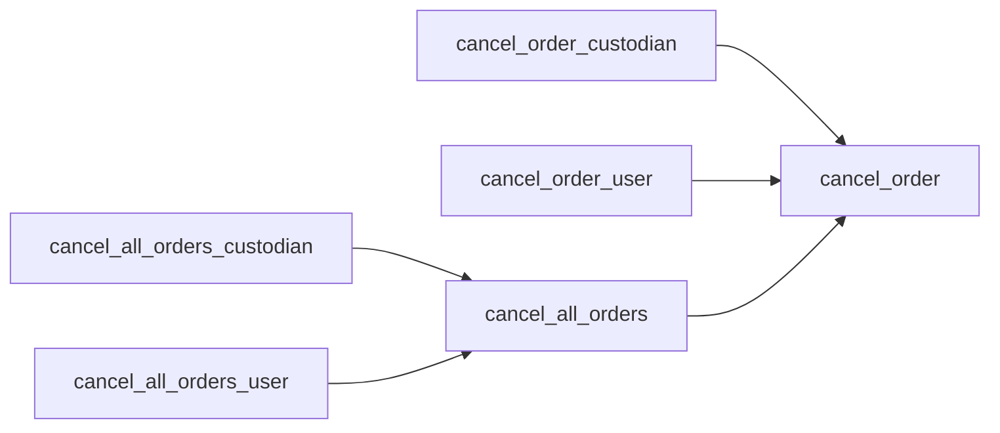
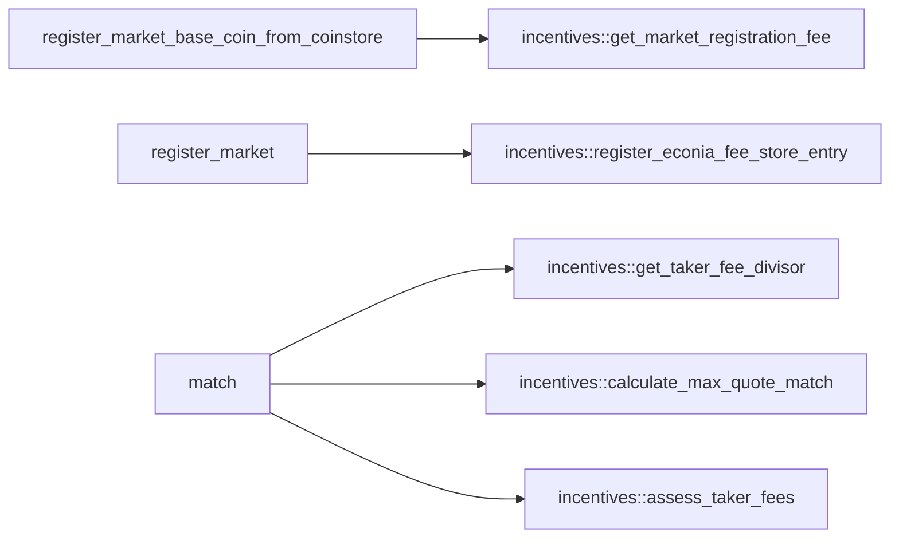
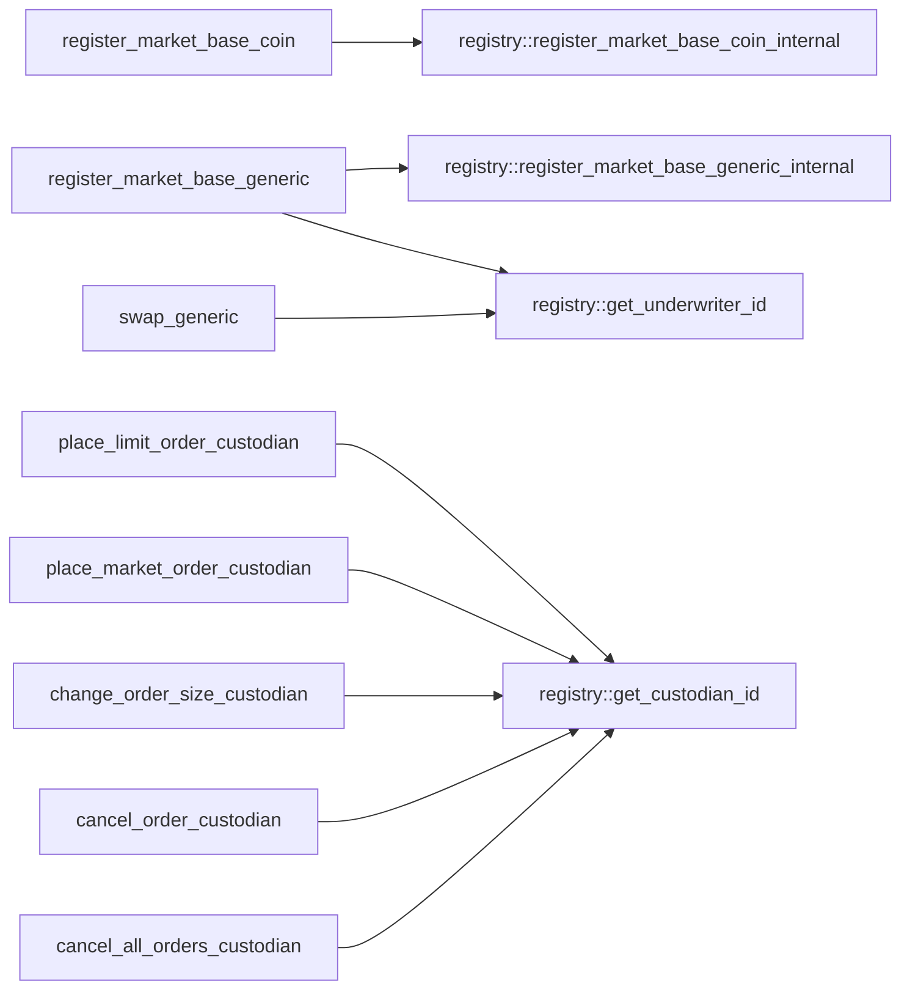
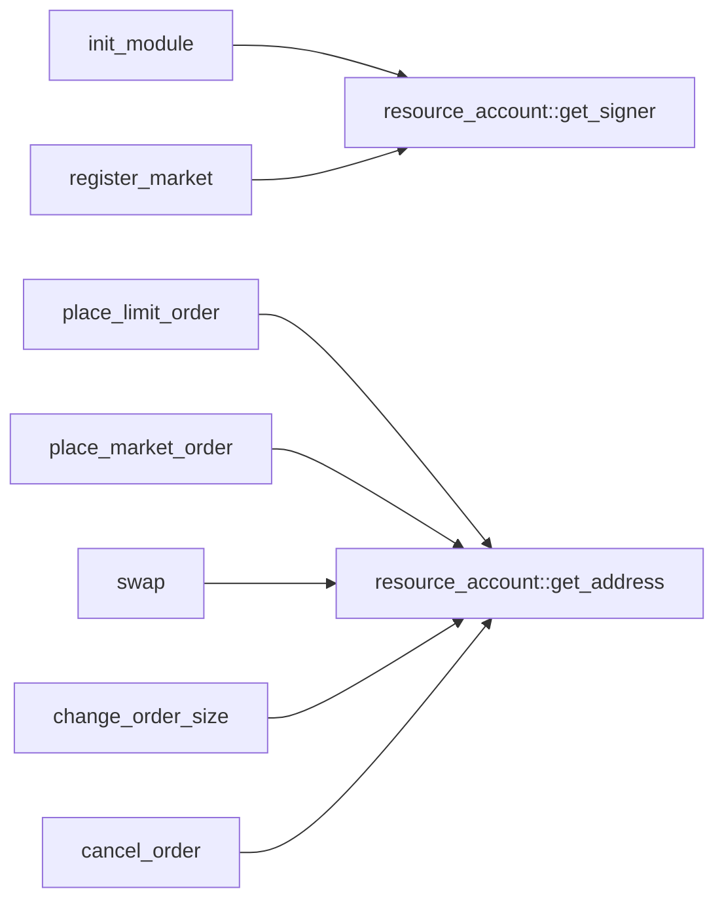
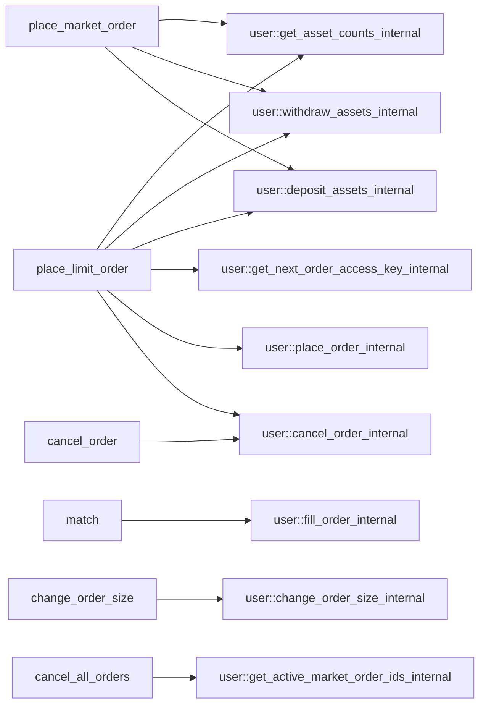

# Module `0xc0deb00c::market`

Market functionality for order book operations.

For each registered market, Econia has an order book stored under a
global resource account. When someone registers a market, a new
order book entry is added under the resource account at a new market
ID.

Once a market is registered, signing users and delegated custodians
can place limit orders on the book as makers, takers can place
market orders or swaps against the order book, and makers can cancel
or change the size of any outstanding orders they have on the book.

Econia implements an atomic matching engine for processing taker
fills against maker orders on the book, and emits events in response
to changes in order book state. Notably, Econia evicts the ask or
bid with the lowest price-time priority when inserting a limit order
to a binary search tree that exceeds a critical height.

Multiple API variants are supported for market registration and
order management function, to enable diagnostic function returns,
public entry calls, etc.

When a maker places a limit order, they are issued a "market order
ID" that is unique to the given market. The maker order price is
encoded in the market order ID, as well as a counter for the number
of orders that have been placed on the corresponding order book.

## General overview sections

[Public function index](#public-function-index)

* [Constant getters](#constant-getters)
* [Market registration](#market-registration)
* [Market order IDs](#market-order-ids)
* [Limit orders](#limit-orders)
* [Market orders](#market-orders)
* [Swaps](#swaps)
* [Change order size](#change-order-size)
* [Cancel orders](#cancel-orders)

[Indexing](#indexing)

[Dependency charts](#dependency-charts)

* [Internal dependencies](#internal-dependencies)
* [External module dependencies](#external-module-dependencies)

[Order management testing](#order-management-testing)

* [Functions with aborts](#functions-with-aborts)
* [Return proxies](#return-proxies)
* [Invocation proxies](#invocation-proxies)
* [Branching functions](#branching-functions)

[Complete DocGen index](#complete-docgen-index)

## Public function index

See the [dependency charts](#dependency-charts) for a visual map of
associated function wrappers.

### Constant getters

* <code><a href="market.md#0xc0deb00c_market_get_ASK">get_ASK</a>()</code>
* <code><a href="market.md#0xc0deb00c_market_get_BID">get_BID</a>()</code>
* <code><a href="market.md#0xc0deb00c_market_get_BUY">get_BUY</a>()</code>
* <code><a href="market.md#0xc0deb00c_market_get_FILL_OR_ABORT">get_FILL_OR_ABORT</a>()</code>
* <code><a href="market.md#0xc0deb00c_market_get_HI_PRICE">get_HI_PRICE</a>()</code>
* <code><a href="market.md#0xc0deb00c_market_get_IMMEDIATE_OR_CANCEL">get_IMMEDIATE_OR_CANCEL</a>()</code>
* <code><a href="market.md#0xc0deb00c_market_get_MAX_POSSIBLE">get_MAX_POSSIBLE</a>()</code>
* <code><a href="market.md#0xc0deb00c_market_get_NO_CUSTODIAN">get_NO_CUSTODIAN</a>()</code>
* <code><a href="market.md#0xc0deb00c_market_get_NO_RESTRICTION">get_NO_RESTRICTION</a>()</code>
* <code><a href="market.md#0xc0deb00c_market_get_NO_UNDERWRITER">get_NO_UNDERWRITER</a>()</code>
* <code><a href="market.md#0xc0deb00c_market_get_POST_OR_ABORT">get_POST_OR_ABORT</a>()</code>
* <code><a href="market.md#0xc0deb00c_market_get_SELL">get_SELL</a>()</code>

### Market registration

* <code><a href="market.md#0xc0deb00c_market_register_market_base_coin">register_market_base_coin</a>()</code>
* <code><a href="market.md#0xc0deb00c_market_register_market_base_coin_from_coinstore">register_market_base_coin_from_coinstore</a>()</code>
* <code><a href="market.md#0xc0deb00c_market_register_market_base_generic">register_market_base_generic</a>()</code>

### Market order IDs

* <code><a href="market.md#0xc0deb00c_market_get_market_order_id_counter">get_market_order_id_counter</a>()</code>
* <code><a href="market.md#0xc0deb00c_market_get_market_order_id_price">get_market_order_id_price</a>()</code>

### Limit orders

* <code><a href="market.md#0xc0deb00c_market_place_limit_order_custodian">place_limit_order_custodian</a>()</code>
* <code><a href="market.md#0xc0deb00c_market_place_limit_order_user">place_limit_order_user</a>()</code>
* <code><a href="market.md#0xc0deb00c_market_place_limit_order_user_entry">place_limit_order_user_entry</a>()</code>

### Market orders

* <code><a href="market.md#0xc0deb00c_market_place_market_order_custodian">place_market_order_custodian</a>()</code>
* <code><a href="market.md#0xc0deb00c_market_place_market_order_user">place_market_order_user</a>()</code>
* <code><a href="market.md#0xc0deb00c_market_place_market_order_user_entry">place_market_order_user_entry</a>()</code>

### Swaps

* <code><a href="market.md#0xc0deb00c_market_swap_between_coinstores">swap_between_coinstores</a>()</code>
* <code><a href="market.md#0xc0deb00c_market_swap_between_coinstores_entry">swap_between_coinstores_entry</a>()</code>
* <code><a href="market.md#0xc0deb00c_market_swap_coins">swap_coins</a>()</code>
* <code><a href="market.md#0xc0deb00c_market_swap_generic">swap_generic</a>()</code>

### Change order size

* <code><a href="market.md#0xc0deb00c_market_change_order_size_custodian">change_order_size_custodian</a>()</code>
* <code><a href="market.md#0xc0deb00c_market_change_order_size_user">change_order_size_user</a>()</code>

### Cancel orders

* <code><a href="market.md#0xc0deb00c_market_cancel_order_custodian">cancel_order_custodian</a>()</code>
* <code><a href="market.md#0xc0deb00c_market_cancel_order_user">cancel_order_user</a>()</code>
* <code><a href="market.md#0xc0deb00c_market_cancel_all_orders_custodian">cancel_all_orders_custodian</a>()</code>
* <code><a href="market.md#0xc0deb00c_market_cancel_all_orders_user">cancel_all_orders_user</a>()</code>

## Indexing

An order book can be indexed off-chain via <code><a href="market.md#0xc0deb00c_market_index_orders_sdk">index_orders_sdk</a>()</code>, an
SDK-generative function for use with <code><b>move</b>-<b>to</b>-ts</code>.

Once an order book has been indexed, the off-chain model can be kept
current by monitoring <code><a href="market.md#0xc0deb00c_market_MakerEvent">MakerEvent</a></code> and <code><a href="market.md#0xc0deb00c_market_TakerEvent">TakerEvent</a></code> emissions from
the following functions:

* <code><a href="market.md#0xc0deb00c_market_cancel_order">cancel_order</a>()</code>
* <code><a href="market.md#0xc0deb00c_market_change_order_size">change_order_size</a>()</code>
* <code><a href="market.md#0xc0deb00c_market_match">match</a>()</code>
* <code><a href="market.md#0xc0deb00c_market_place_limit_order">place_limit_order</a>()</code>

## Dependency charts

The below dependency charts use <code>mermaid.js</code> syntax, which can be
automatically rendered into a diagram (depending on the browser)
when viewing the documentation file generated from source code. If
a browser renders the diagrams with coloring that makes it difficult
to read, try a different browser.

### Internal dependencies

These charts describe dependencies between <code><a href="market.md#0xc0deb00c_market">market</a></code> functions.

Market registration:

Placing orders:

Changing order size:

Cancelling orders:

### External module dependencies

These charts describe <code><a href="market.md#0xc0deb00c_market">market</a></code> function dependencies on functions
from other Econia modules, other than <code><a href="avl_queue.md#0xc0deb00c_avl_queue">avl_queue</a></code> and <code><a href="tablist.md#0xc0deb00c_tablist">tablist</a></code>,
which are essentially data structure libraries.

<code><a href="incentives.md#0xc0deb00c_incentives">incentives</a></code>:

<code><a href="registry.md#0xc0deb00c_registry">registry</a></code>:

<code><a href="">resource_account</a></code>:

<code><a href="user.md#0xc0deb00c_user">user</a></code>:

## Order management testing

While market registration functions can be simply verified with
straightforward tests, order management functions are more
comprehensively tested through integrated tests that verify multiple
logical branches, returns, and state updates. Aborts are tested
individually for each function.

### Functions with aborts

Function aborts to test:

* [x] <code><a href="market.md#0xc0deb00c_market_cancel_order">cancel_order</a>()</code>
* [x] <code><a href="market.md#0xc0deb00c_market_change_order_size">change_order_size</a>()</code>
* [x] <code><a href="market.md#0xc0deb00c_market_match">match</a>()</code>
* [x] <code><a href="market.md#0xc0deb00c_market_place_limit_order">place_limit_order</a>()</code>
* [x] <code><a href="market.md#0xc0deb00c_market_range_check_trade">range_check_trade</a>()</code>
* [x] <code><a href="market.md#0xc0deb00c_market_swap">swap</a>()</code>

### Return proxies

Various order management functions have returns, and verifying the
returns of some functions verifies the returns of associated inner
functions. For example, the collective verification of the returns
of <code><a href="market.md#0xc0deb00c_market_swap_coins">swap_coins</a>()</code> and <code><a href="market.md#0xc0deb00c_market_swap_generic">swap_generic</a>()</code> verifies the returns of both
<code><a href="market.md#0xc0deb00c_market_swap">swap</a>()</code> and <code><a href="market.md#0xc0deb00c_market_match">match</a>()</code>, such that the combination of <code><a href="market.md#0xc0deb00c_market_swap_coins">swap_coins</a>()</code>
and <code><a href="market.md#0xc0deb00c_market_swap_generic">swap_generic</a>()</code> can be considered a "return proxy" of both
<code><a href="market.md#0xc0deb00c_market_swap">swap</a>()</code> and of <code><a href="market.md#0xc0deb00c_market_match">match</a>()</code>. Hence the most efficient test suite
involves return verification for the minimal return proxy set:

| Function                         | Return proxy                |
|----------------------------------|-----------------------------|
| <code><a href="market.md#0xc0deb00c_market_match">match</a>()</code>                   | <code><a href="market.md#0xc0deb00c_market_swap_coins">swap_coins</a>()</code>, <code><a href="market.md#0xc0deb00c_market_swap_generic">swap_generic</a>()</code> |
| <code><a href="market.md#0xc0deb00c_market_place_limit_order">place_limit_order</a>()</code>            | <code><a href="market.md#0xc0deb00c_market_place_limit_order_user">place_limit_order_user</a>()</code>  |
| <code><a href="market.md#0xc0deb00c_market_place_limit_order_custodian">place_limit_order_custodian</a>()</code>  | None                        |
| <code><a href="market.md#0xc0deb00c_market_place_limit_order_user">place_limit_order_user</a>()</code>       | None                        |
| <code><a href="market.md#0xc0deb00c_market_place_market_order">place_market_order</a>()</code>           | <code><a href="market.md#0xc0deb00c_market_place_market_order_user">place_market_order_user</a>()</code> |
| <code><a href="market.md#0xc0deb00c_market_place_market_order_custodian">place_market_order_custodian</a>()</code> | None                        |
| <code><a href="market.md#0xc0deb00c_market_place_market_order_user">place_market_order_user</a>()</code>      | None                        |
| <code><a href="market.md#0xc0deb00c_market_swap">swap</a>()</code>                    | <code><a href="market.md#0xc0deb00c_market_swap_coins">swap_coins</a>()</code>, <code><a href="market.md#0xc0deb00c_market_swap_generic">swap_generic</a>()</code> |
| <code><a href="market.md#0xc0deb00c_market_swap_between_coinstores">swap_between_coinstores</a>()</code>      | None                        |
| <code><a href="market.md#0xc0deb00c_market_swap_coins">swap_coins</a>()</code>                   | None                        |
| <code><a href="market.md#0xc0deb00c_market_swap_generic">swap_generic</a>()</code>                 | None                        |

Function returns to test:

* [x] <code><a href="market.md#0xc0deb00c_market_place_limit_order_custodian">place_limit_order_custodian</a>()</code>
* [x] <code><a href="market.md#0xc0deb00c_market_place_limit_order_user">place_limit_order_user</a>()</code>
* [x] <code><a href="market.md#0xc0deb00c_market_place_market_order_custodian">place_market_order_custodian</a>()</code>
* [x] <code><a href="market.md#0xc0deb00c_market_place_market_order_user">place_market_order_user</a>()</code>
* [x] <code><a href="market.md#0xc0deb00c_market_swap_between_coinstores">swap_between_coinstores</a>()</code>
* [x] <code><a href="market.md#0xc0deb00c_market_swap_coins">swap_coins</a>()</code>
* [x] <code><a href="market.md#0xc0deb00c_market_swap_generic">swap_generic</a>()</code>

### Invocation proxies

Similarly, verifying the invocation of some functions verifies the
invocation of associated inner functions. For example,
<code><a href="market.md#0xc0deb00c_market_cancel_all_orders_user">cancel_all_orders_user</a>()</code> can be considered an invocation proxy
of <code><a href="market.md#0xc0deb00c_market_cancel_all_orders">cancel_all_orders</a>()</code> and of <code><a href="market.md#0xc0deb00c_market_cancel_order">cancel_order</a>()</code>. Here, to provide
100% invocation coverage, only functions at the top of the
dependency stack must be verified.

Function invocations to test:

* [x] <code><a href="market.md#0xc0deb00c_market_cancel_all_orders_custodian">cancel_all_orders_custodian</a>()</code>
* [x] <code><a href="market.md#0xc0deb00c_market_cancel_all_orders_user">cancel_all_orders_user</a>()</code>
* [x] <code><a href="market.md#0xc0deb00c_market_cancel_order_custodian">cancel_order_custodian</a>()</code>
* [x] <code><a href="market.md#0xc0deb00c_market_cancel_order_user">cancel_order_user</a>()</code>
* [x] <code><a href="market.md#0xc0deb00c_market_change_order_size_custodian">change_order_size_custodian</a>()</code>
* [x] <code><a href="market.md#0xc0deb00c_market_change_order_size_user">change_order_size_user</a>()</code>
* [x] <code><a href="market.md#0xc0deb00c_market_place_limit_order_user_entry">place_limit_order_user_entry</a>()</code>
* [x] <code><a href="market.md#0xc0deb00c_market_place_limit_order_custodian">place_limit_order_custodian</a>()</code>
* [x] <code><a href="market.md#0xc0deb00c_market_place_market_order_user_entry">place_market_order_user_entry</a>()</code>
* [x] <code><a href="market.md#0xc0deb00c_market_place_market_order_custodian">place_market_order_custodian</a>()</code>
* [x] <code><a href="market.md#0xc0deb00c_market_swap_between_coinstores_entry">swap_between_coinstores_entry</a>()</code>
* [x] <code><a href="market.md#0xc0deb00c_market_swap_coins">swap_coins</a>()</code>
* [x] <code><a href="market.md#0xc0deb00c_market_swap_generic">swap_generic</a>()</code>

### Branching functions

Functions with logical branches to test:

* [x] <code><a href="market.md#0xc0deb00c_market_cancel_all_orders">cancel_all_orders</a>()</code>
* [x] <code><a href="market.md#0xc0deb00c_market_cancel_order">cancel_order</a>()</code>
* [x] <code><a href="market.md#0xc0deb00c_market_change_order_size">change_order_size</a>()</code>
* [x] <code><a href="market.md#0xc0deb00c_market_match">match</a>()</code>
* [x] <code><a href="market.md#0xc0deb00c_market_place_limit_order">place_limit_order</a>()</code>
* [x] <code><a href="market.md#0xc0deb00c_market_place_market_order">place_market_order</a>()</code>
* [x] <code><a href="market.md#0xc0deb00c_market_range_check_trade">range_check_trade</a>()</code>
* [x] <code><a href="market.md#0xc0deb00c_market_swap_between_coinstores">swap_between_coinstores</a>()</code>
* [x] <code><a href="market.md#0xc0deb00c_market_swap_coins">swap_coins</a>()</code>
* [x] <code><a href="market.md#0xc0deb00c_market_swap_generic">swap_generic</a>()</code>
* [x] <code><a href="market.md#0xc0deb00c_market_swap">swap</a>()</code>

See each function for its logical branches.

## Complete DocGen index

The below index is automatically generated from source code:

-  [General overview sections](#@General_overview_sections_0)
-  [Public function index](#@Public_function_index_1)
    -  [Constant getters](#@Constant_getters_2)
    -  [Market registration](#@Market_registration_3)
    -  [Market order IDs](#@Market_order_IDs_4)
    -  [Limit orders](#@Limit_orders_5)
    -  [Market orders](#@Market_orders_6)
    -  [Swaps](#@Swaps_7)
    -  [Change order size](#@Change_order_size_8)
    -  [Cancel orders](#@Cancel_orders_9)
-  [Indexing](#@Indexing_10)
-  [Dependency charts](#@Dependency_charts_11)
    -  [Internal dependencies](#@Internal_dependencies_12)
    -  [External module dependencies](#@External_module_dependencies_13)
-  [Order management testing](#@Order_management_testing_14)
    -  [Functions with aborts](#@Functions_with_aborts_15)
    -  [Return proxies](#@Return_proxies_16)
    -  [Invocation proxies](#@Invocation_proxies_17)
    -  [Branching functions](#@Branching_functions_18)
-  [Complete DocGen index](#@Complete_DocGen_index_19)
-  [Struct `MakerEvent`](#0xc0deb00c_market_MakerEvent)
-  [Struct `Order`](#0xc0deb00c_market_Order)
-  [Struct `OrderBook`](#0xc0deb00c_market_OrderBook)
-  [Resource `OrderBooks`](#0xc0deb00c_market_OrderBooks)
-  [Struct `TakerEvent`](#0xc0deb00c_market_TakerEvent)
-  [Resource `Orders`](#0xc0deb00c_market_Orders)
-  [Constants](#@Constants_20)
-  [Function `cancel_all_orders_custodian`](#0xc0deb00c_market_cancel_all_orders_custodian)
    -  [Invocation testing](#@Invocation_testing_21)
-  [Function `cancel_order_custodian`](#0xc0deb00c_market_cancel_order_custodian)
    -  [Invocation testing](#@Invocation_testing_22)
-  [Function `change_order_size_custodian`](#0xc0deb00c_market_change_order_size_custodian)
    -  [Invocation testing](#@Invocation_testing_23)
-  [Function `get_ASK`](#0xc0deb00c_market_get_ASK)
    -  [Testing](#@Testing_24)
-  [Function `get_BID`](#0xc0deb00c_market_get_BID)
    -  [Testing](#@Testing_25)
-  [Function `get_BUY`](#0xc0deb00c_market_get_BUY)
    -  [Testing](#@Testing_26)
-  [Function `get_FILL_OR_ABORT`](#0xc0deb00c_market_get_FILL_OR_ABORT)
    -  [Testing](#@Testing_27)
-  [Function `get_HI_PRICE`](#0xc0deb00c_market_get_HI_PRICE)
    -  [Testing](#@Testing_28)
-  [Function `get_IMMEDIATE_OR_CANCEL`](#0xc0deb00c_market_get_IMMEDIATE_OR_CANCEL)
    -  [Testing](#@Testing_29)
-  [Function `get_market_order_id_counter`](#0xc0deb00c_market_get_market_order_id_counter)
    -  [Testing](#@Testing_30)
-  [Function `get_market_order_id_price`](#0xc0deb00c_market_get_market_order_id_price)
    -  [Testing](#@Testing_31)
-  [Function `get_MAX_POSSIBLE`](#0xc0deb00c_market_get_MAX_POSSIBLE)
    -  [Testing](#@Testing_32)
-  [Function `get_NO_CUSTODIAN`](#0xc0deb00c_market_get_NO_CUSTODIAN)
    -  [Testing](#@Testing_33)
-  [Function `get_NO_RESTRICTION`](#0xc0deb00c_market_get_NO_RESTRICTION)
    -  [Testing](#@Testing_34)
-  [Function `get_NO_UNDERWRITER`](#0xc0deb00c_market_get_NO_UNDERWRITER)
    -  [Testing](#@Testing_35)
-  [Function `get_POST_OR_ABORT`](#0xc0deb00c_market_get_POST_OR_ABORT)
    -  [Testing](#@Testing_36)
-  [Function `get_SELL`](#0xc0deb00c_market_get_SELL)
    -  [Testing](#@Testing_37)
-  [Function `place_limit_order_custodian`](#0xc0deb00c_market_place_limit_order_custodian)
    -  [Invocation and return testing](#@Invocation_and_return_testing_38)
-  [Function `place_limit_order_user`](#0xc0deb00c_market_place_limit_order_user)
    -  [Invocation and return testing](#@Invocation_and_return_testing_39)
-  [Function `place_market_order_custodian`](#0xc0deb00c_market_place_market_order_custodian)
    -  [Invocation and return testing](#@Invocation_and_return_testing_40)
-  [Function `place_market_order_user`](#0xc0deb00c_market_place_market_order_user)
    -  [Invocation and return testing](#@Invocation_and_return_testing_41)
-  [Function `register_market_base_coin`](#0xc0deb00c_market_register_market_base_coin)
    -  [Type parameters](#@Type_parameters_42)
    -  [Parameters](#@Parameters_43)
    -  [Returns](#@Returns_44)
    -  [Testing](#@Testing_45)
-  [Function `register_market_base_generic`](#0xc0deb00c_market_register_market_base_generic)
    -  [Type parameters](#@Type_parameters_46)
    -  [Parameters](#@Parameters_47)
    -  [Returns](#@Returns_48)
    -  [Testing](#@Testing_49)
-  [Function `swap_between_coinstores`](#0xc0deb00c_market_swap_between_coinstores)
    -  [Type Parameters](#@Type_Parameters_50)
    -  [Parameters](#@Parameters_51)
    -  [Returns](#@Returns_52)
    -  [Testing](#@Testing_53)
-  [Function `swap_coins`](#0xc0deb00c_market_swap_coins)
    -  [Type Parameters](#@Type_Parameters_54)
    -  [Parameters](#@Parameters_55)
    -  [Returns](#@Returns_56)
    -  [Terminology](#@Terminology_57)
    -  [Testing](#@Testing_58)
-  [Function `swap_generic`](#0xc0deb00c_market_swap_generic)
    -  [Type Parameters](#@Type_Parameters_59)
    -  [Parameters](#@Parameters_60)
    -  [Returns](#@Returns_61)
    -  [Testing](#@Testing_62)
-  [Function `cancel_all_orders_user`](#0xc0deb00c_market_cancel_all_orders_user)
    -  [Invocation testing](#@Invocation_testing_63)
-  [Function `cancel_order_user`](#0xc0deb00c_market_cancel_order_user)
    -  [Invocation testing](#@Invocation_testing_64)
-  [Function `change_order_size_user`](#0xc0deb00c_market_change_order_size_user)
    -  [Invocation testing](#@Invocation_testing_65)
-  [Function `place_limit_order_user_entry`](#0xc0deb00c_market_place_limit_order_user_entry)
    -  [Invocation testing](#@Invocation_testing_66)
-  [Function `place_market_order_user_entry`](#0xc0deb00c_market_place_market_order_user_entry)
    -  [Invocation testing](#@Invocation_testing_67)
-  [Function `register_market_base_coin_from_coinstore`](#0xc0deb00c_market_register_market_base_coin_from_coinstore)
    -  [Testing](#@Testing_68)
-  [Function `swap_between_coinstores_entry`](#0xc0deb00c_market_swap_between_coinstores_entry)
    -  [Invocation testing](#@Invocation_testing_69)
-  [Function `cancel_all_orders`](#0xc0deb00c_market_cancel_all_orders)
    -  [Parameters](#@Parameters_70)
    -  [Expected value testing](#@Expected_value_testing_71)
-  [Function `cancel_order`](#0xc0deb00c_market_cancel_order)
    -  [Parameters](#@Parameters_72)
    -  [Aborts](#@Aborts_73)
    -  [Emits](#@Emits_74)
    -  [Expected value testing](#@Expected_value_testing_75)
    -  [Failure testing](#@Failure_testing_76)
-  [Function `change_order_size`](#0xc0deb00c_market_change_order_size)
    -  [Parameters](#@Parameters_77)
    -  [Aborts](#@Aborts_78)
    -  [Emits](#@Emits_79)
    -  [Expected value testing](#@Expected_value_testing_80)
    -  [Failure testing](#@Failure_testing_81)
-  [Function `init_module`](#0xc0deb00c_market_init_module)
-  [Function `match`](#0xc0deb00c_market_match)
    -  [Type Parameters](#@Type_Parameters_82)
    -  [Parameters](#@Parameters_83)
    -  [Returns](#@Returns_84)
    -  [Emits](#@Emits_85)
    -  [Aborts](#@Aborts_86)
    -  [Expected value testing](#@Expected_value_testing_87)
    -  [Failure testing](#@Failure_testing_88)
-  [Function `place_limit_order`](#0xc0deb00c_market_place_limit_order)
    -  [Type Parameters](#@Type_Parameters_89)
    -  [Parameters](#@Parameters_90)
    -  [Returns](#@Returns_91)
    -  [Aborts](#@Aborts_92)
    -  [Emits](#@Emits_93)
    -  [Restrictions](#@Restrictions_94)
    -  [Minimum size](#@Minimum_size_95)
    -  [Expected value testing](#@Expected_value_testing_96)
    -  [Failure testing](#@Failure_testing_97)
-  [Function `place_market_order`](#0xc0deb00c_market_place_market_order)
    -  [Type Parameters](#@Type_Parameters_98)
    -  [Parameters](#@Parameters_99)
    -  [Returns](#@Returns_100)
    -  [Aborts](#@Aborts_101)
    -  [Expected value testing](#@Expected_value_testing_102)
    -  [Failure testing](#@Failure_testing_103)
-  [Function `range_check_trade`](#0xc0deb00c_market_range_check_trade)
    -  [Terminology](#@Terminology_104)
    -  [Parameters](#@Parameters_105)
    -  [Aborts](#@Aborts_106)
    -  [Failure testing](#@Failure_testing_107)
-  [Function `register_market`](#0xc0deb00c_market_register_market)
    -  [Type parameters](#@Type_parameters_108)
    -  [Parameters](#@Parameters_109)
    -  [Returns](#@Returns_110)
    -  [Testing](#@Testing_111)
-  [Function `swap`](#0xc0deb00c_market_swap)
    -  [Type Parameters](#@Type_Parameters_112)
    -  [Parameters](#@Parameters_113)
    -  [Returns](#@Returns_114)
    -  [Aborts](#@Aborts_115)
    -  [Expected value testing](#@Expected_value_testing_116)
    -  [Failure testing](#@Failure_testing_117)
-  [Function `index_orders_sdk`](#0xc0deb00c_market_index_orders_sdk)
    -  [Testing](#@Testing_118)

<pre><code><b>use</b> <a href="">0x1::account</a>;
<b>use</b> <a href="">0x1::coin</a>;
<b>use</b> <a href="">0x1::event</a>;
<b>use</b> <a href="">0x1::option</a>;
<b>use</b> <a href="">0x1::signer</a>;
<b>use</b> <a href="">0x1::string</a>;
<b>use</b> <a href="">0x1::type_info</a>;
<b>use</b> <a href="avl_queue.md#0xc0deb00c_avl_queue">0xc0deb00c::avl_queue</a>;
<b>use</b> <a href="incentives.md#0xc0deb00c_incentives">0xc0deb00c::incentives</a>;
<b>use</b> <a href="registry.md#0xc0deb00c_registry">0xc0deb00c::registry</a>;
<b>use</b> <a href="resource_account.md#0xc0deb00c_resource_account">0xc0deb00c::resource_account</a>;
<b>use</b> <a href="tablist.md#0xc0deb00c_tablist">0xc0deb00c::tablist</a>;
<b>use</b> <a href="user.md#0xc0deb00c_user">0xc0deb00c::user</a>;
</code></pre>

## Struct `MakerEvent`

Emitted when a maker order is placed, cancelled, evicted, or its
size is manually changed.

<pre><code><b>struct</b> <a href="market.md#0xc0deb00c_market_MakerEvent">MakerEvent</a> <b>has</b> drop, store
</code></pre>

##### Fields

<dl>
<dt>
<code>market_id: u64</code>
</dt>
<dd>
 Market ID of corresponding market.
</dd>
<dt>
<code>side: bool</code>
</dt>
<dd>
 <code><a href="market.md#0xc0deb00c_market_ASK">ASK</a></code> or <code><a href="market.md#0xc0deb00c_market_BID">BID</a></code>, the side of the maker order.
</dd>
<dt>
<code>market_order_id: u128</code>
</dt>
<dd>
 Market order ID, unique within given market.
</dd>
<dt>
<code><a href="user.md#0xc0deb00c_user">user</a>: <b>address</b></code>
</dt>
<dd>
 Address of user holding maker order.
</dd>
<dt>
<code>custodian_id: u64</code>
</dt>
<dd>
 For given maker, ID of custodian required to approve order
 operations and withdrawals on given market account.
</dd>
<dt>
<code>type: u8</code>
</dt>
<dd>
 <code><a href="market.md#0xc0deb00c_market_CANCEL">CANCEL</a></code>, <code><a href="market.md#0xc0deb00c_market_CHANGE">CHANGE</a></code>, <code><a href="market.md#0xc0deb00c_market_EVICT">EVICT</a></code>, or <code><a href="market.md#0xc0deb00c_market_PLACE">PLACE</a></code>, the event type.
</dd>
<dt>
<code>size: u64</code>
</dt>
<dd>
 The size, in lots, on the book after an order has been
 placed or its size has been manually changed. Else the size
 on the book before the order was cancelled or evicted.
</dd>
<dt>
<code>price: u64</code>
</dt>
<dd>
 Order price, in ticks per lot.
</dd>
</dl>

## Struct `Order`

An order on the order book.

<pre><code><b>struct</b> <a href="market.md#0xc0deb00c_market_Order">Order</a> <b>has</b> store
</code></pre>

##### Fields

<dl>
<dt>
<code>size: u64</code>
</dt>
<dd>
 Number of lots to be filled.
</dd>
<dt>
<code>price: u64</code>
</dt>
<dd>
 Order price, in ticks per lot.
</dd>
<dt>
<code><a href="user.md#0xc0deb00c_user">user</a>: <b>address</b></code>
</dt>
<dd>
 Address of user holding order.
</dd>
<dt>
<code>custodian_id: u64</code>
</dt>
<dd>
 For given user, ID of custodian required to approve order
 operations and withdrawals on given market account.
</dd>
<dt>
<code>order_access_key: u64</code>
</dt>
<dd>
 User-side access key for storage-optimized lookup.
</dd>
</dl>

## Struct `OrderBook`

An order book for a given market. Contains
<code><a href="registry.md#0xc0deb00c_registry_MarketInfo">registry::MarketInfo</a></code> field duplicates to reduce global storage
item queries against the registry.

<pre><code><b>struct</b> <a href="market.md#0xc0deb00c_market_OrderBook">OrderBook</a> <b>has</b> store
</code></pre>

##### Fields

<dl>
<dt>
<code>base_type: <a href="_TypeInfo">type_info::TypeInfo</a></code>
</dt>
<dd>
 <code><a href="registry.md#0xc0deb00c_registry_MarketInfo">registry::MarketInfo</a>.base_type</code>.
</dd>
<dt>
<code>base_name_generic: <a href="_String">string::String</a></code>
</dt>
<dd>
 <code><a href="registry.md#0xc0deb00c_registry_MarketInfo">registry::MarketInfo</a>.base_name_generic</code>.
</dd>
<dt>
<code>quote_type: <a href="_TypeInfo">type_info::TypeInfo</a></code>
</dt>
<dd>
 <code><a href="registry.md#0xc0deb00c_registry_MarketInfo">registry::MarketInfo</a>.quote_type</code>.
</dd>
<dt>
<code>lot_size: u64</code>
</dt>
<dd>
 <code><a href="registry.md#0xc0deb00c_registry_MarketInfo">registry::MarketInfo</a>.lot_size</code>.
</dd>
<dt>
<code>tick_size: u64</code>
</dt>
<dd>
 <code><a href="registry.md#0xc0deb00c_registry_MarketInfo">registry::MarketInfo</a>.tick_size</code>.
</dd>
<dt>
<code>min_size: u64</code>
</dt>
<dd>
 <code><a href="registry.md#0xc0deb00c_registry_MarketInfo">registry::MarketInfo</a>.min_size</code>.
</dd>
<dt>
<code>underwriter_id: u64</code>
</dt>
<dd>
 <code><a href="registry.md#0xc0deb00c_registry_MarketInfo">registry::MarketInfo</a>.underwriter_id</code>.
</dd>
<dt>
<code>asks: <a href="avl_queue.md#0xc0deb00c_avl_queue_AVLqueue">avl_queue::AVLqueue</a>&lt;<a href="market.md#0xc0deb00c_market_Order">market::Order</a>&gt;</code>
</dt>
<dd>
 Asks AVL queue.
</dd>
<dt>
<code>bids: <a href="avl_queue.md#0xc0deb00c_avl_queue_AVLqueue">avl_queue::AVLqueue</a>&lt;<a href="market.md#0xc0deb00c_market_Order">market::Order</a>&gt;</code>
</dt>
<dd>
 Bids AVL queue.
</dd>
<dt>
<code>counter: u64</code>
</dt>
<dd>
 Cumulative number of maker orders placed on book.
</dd>
<dt>
<code>maker_events: <a href="_EventHandle">event::EventHandle</a>&lt;<a href="market.md#0xc0deb00c_market_MakerEvent">market::MakerEvent</a>&gt;</code>
</dt>
<dd>
 Event handle for maker events.
</dd>
<dt>
<code>taker_events: <a href="_EventHandle">event::EventHandle</a>&lt;<a href="market.md#0xc0deb00c_market_TakerEvent">market::TakerEvent</a>&gt;</code>
</dt>
<dd>
 Event handle for taker events.
</dd>
</dl>

## Resource `OrderBooks`

Order book map for all Econia order books.

<pre><code><b>struct</b> <a href="market.md#0xc0deb00c_market_OrderBooks">OrderBooks</a> <b>has</b> key
</code></pre>

##### Fields

<dl>
<dt>
<code>map: <a href="tablist.md#0xc0deb00c_tablist_Tablist">tablist::Tablist</a>&lt;u64, <a href="market.md#0xc0deb00c_market_OrderBook">market::OrderBook</a>&gt;</code>
</dt>
<dd>
 Map from market ID to corresponding order book. Enables
 off-chain iterated indexing by market ID.
</dd>
</dl>

## Struct `TakerEvent`

Emitted when a taker order fills against a maker order. If a
taker order fills against multiple maker orders, a separate
event is emitted for each one.

<pre><code><b>struct</b> <a href="market.md#0xc0deb00c_market_TakerEvent">TakerEvent</a> <b>has</b> drop, store
</code></pre>

##### Fields

<dl>
<dt>
<code>market_id: u64</code>
</dt>
<dd>
 Market ID of corresponding market.
</dd>
<dt>
<code>side: bool</code>
</dt>
<dd>
 <code><a href="market.md#0xc0deb00c_market_ASK">ASK</a></code> or <code><a href="market.md#0xc0deb00c_market_BID">BID</a></code>, the side of the maker order.
</dd>
<dt>
<code>market_order_id: u128</code>
</dt>
<dd>
 Order ID, unique within given market, of maker order just
 filled against.
</dd>
<dt>
<code>maker: <b>address</b></code>
</dt>
<dd>
 Address of user holding maker order.
</dd>
<dt>
<code>custodian_id: u64</code>
</dt>
<dd>
 For given maker, ID of custodian required to approve order
 operations and withdrawals on given market account.
</dd>
<dt>
<code>size: u64</code>
</dt>
<dd>
 The size filled, in lots.
</dd>
<dt>
<code>price: u64</code>
</dt>
<dd>
 Fill price, in ticks per lot.
</dd>
</dl>

## Resource `Orders`

All <code><a href="market.md#0xc0deb00c_market_Order">Order</a></code> instances from an <code><a href="market.md#0xc0deb00c_market_OrderBook">OrderBook</a></code>, indexed by side and
sorted by price-time priority. Only for SDK generation.

<pre><code><b>struct</b> <a href="market.md#0xc0deb00c_market_Orders">Orders</a> <b>has</b> key
</code></pre>

##### Fields

<dl>
<dt>
<code>asks: <a href="">vector</a>&lt;<a href="market.md#0xc0deb00c_market_Order">market::Order</a>&gt;</code>
</dt>
<dd>
 Asks sorted by price-time priority: oldest order at lowest
 price first in vector.
</dd>
<dt>
<code>bids: <a href="">vector</a>&lt;<a href="market.md#0xc0deb00c_market_Order">market::Order</a>&gt;</code>
</dt>
<dd>
 Bids sorted by price-time priority: oldest order at highest
 price first in vector.
</dd>
</dl>

## Constants

Ascending AVL queue flag, for asks AVL queue.

<pre><code><b>const</b> <a href="market.md#0xc0deb00c_market_ASCENDING">ASCENDING</a>: bool = <b>true</b>;
</code></pre>

Descending AVL queue flag, for bids AVL queue.

<pre><code><b>const</b> <a href="market.md#0xc0deb00c_market_DESCENDING">DESCENDING</a>: bool = <b>false</b>;
</code></pre>

<code>u64</code> bitmask with all bits set, generated in Python via
<code>hex(int('1' * 64, 2))</code>.

<pre><code><b>const</b> <a href="market.md#0xc0deb00c_market_HI_64">HI_64</a>: u64 = 18446744073709551615;
</code></pre>

Flag for null value when null defined as 0.

<pre><code><b>const</b> <a href="market.md#0xc0deb00c_market_NIL">NIL</a>: u64 = 0;
</code></pre>

Flag for buy direction.

<pre><code><b>const</b> <a href="market.md#0xc0deb00c_market_BUY">BUY</a>: bool = <b>false</b>;
</code></pre>

Flag for sell direction.

<pre><code><b>const</b> <a href="market.md#0xc0deb00c_market_SELL">SELL</a>: bool = <b>true</b>;
</code></pre>

Base asset type is invalid.

<pre><code><b>const</b> <a href="market.md#0xc0deb00c_market_E_INVALID_BASE">E_INVALID_BASE</a>: u64 = 7;
</code></pre>

No market with given ID.

<pre><code><b>const</b> <a href="market.md#0xc0deb00c_market_E_INVALID_MARKET_ID">E_INVALID_MARKET_ID</a>: u64 = 6;
</code></pre>

Quote asset type is invalid.

<pre><code><b>const</b> <a href="market.md#0xc0deb00c_market_E_INVALID_QUOTE">E_INVALID_QUOTE</a>: u64 = 8;
</code></pre>

Custodian ID flag for no custodian.

<pre><code><b>const</b> <a href="market.md#0xc0deb00c_market_NO_CUSTODIAN">NO_CUSTODIAN</a>: u64 = 0;
</code></pre>

Underwriter ID flag for no underwriter.

<pre><code><b>const</b> <a href="market.md#0xc0deb00c_market_NO_UNDERWRITER">NO_UNDERWRITER</a>: u64 = 0;
</code></pre>

Flag for ask side.

<pre><code><b>const</b> <a href="market.md#0xc0deb00c_market_ASK">ASK</a>: bool = <b>true</b>;
</code></pre>

Flag for bid side.

<pre><code><b>const</b> <a href="market.md#0xc0deb00c_market_BID">BID</a>: bool = <b>false</b>;
</code></pre>

Market order ID invalid.

<pre><code><b>const</b> <a href="market.md#0xc0deb00c_market_E_INVALID_MARKET_ORDER_ID">E_INVALID_MARKET_ORDER_ID</a>: u64 = 22;
</code></pre>

Underwriter invalid for given market.

<pre><code><b>const</b> <a href="market.md#0xc0deb00c_market_E_INVALID_UNDERWRITER">E_INVALID_UNDERWRITER</a>: u64 = 21;
</code></pre>

Not enough asset to trade away.

<pre><code><b>const</b> <a href="market.md#0xc0deb00c_market_E_NOT_ENOUGH_ASSET_OUT">E_NOT_ENOUGH_ASSET_OUT</a>: u64 = 5;
</code></pre>

Filling order would overflow asset received from trade.

<pre><code><b>const</b> <a href="market.md#0xc0deb00c_market_E_OVERFLOW_ASSET_IN">E_OVERFLOW_ASSET_IN</a>: u64 = 4;
</code></pre>

Order price specified as 0.

<pre><code><b>const</b> <a href="market.md#0xc0deb00c_market_E_PRICE_0">E_PRICE_0</a>: u64 = 11;
</code></pre>

Order price exceeds maximum allowable price.

<pre><code><b>const</b> <a href="market.md#0xc0deb00c_market_E_PRICE_TOO_HIGH">E_PRICE_TOO_HIGH</a>: u64 = 12;
</code></pre>

All bits set in integer of width required to encode price.
Generated in Python via <code>hex(int('1' * 32, 2))</code>.

<pre><code><b>const</b> <a href="market.md#0xc0deb00c_market_HI_PRICE">HI_PRICE</a>: u64 = 4294967295;
</code></pre>

Flag to abort during a self match.

<pre><code><b>const</b> <a href="market.md#0xc0deb00c_market_ABORT">ABORT</a>: u8 = 0;
</code></pre>

Flag for <code><a href="market.md#0xc0deb00c_market_MakerEvent">MakerEvent</a>.type</code> when order is cancelled.

<pre><code><b>const</b> <a href="market.md#0xc0deb00c_market_CANCEL">CANCEL</a>: u8 = 0;
</code></pre>

Flag to cancel maker and taker order during a self match.

<pre><code><b>const</b> <a href="market.md#0xc0deb00c_market_CANCEL_BOTH">CANCEL_BOTH</a>: u8 = 1;
</code></pre>

Flag to cancel maker order only during a self match.

<pre><code><b>const</b> <a href="market.md#0xc0deb00c_market_CANCEL_MAKER">CANCEL_MAKER</a>: u8 = 2;
</code></pre>

Flag to cancel taker order only during a self match.

<pre><code><b>const</b> <a href="market.md#0xc0deb00c_market_CANCEL_TAKER">CANCEL_TAKER</a>: u8 = 3;
</code></pre>

Flag for <code><a href="market.md#0xc0deb00c_market_MakerEvent">MakerEvent</a>.type</code> when order size is changed.

<pre><code><b>const</b> <a href="market.md#0xc0deb00c_market_CHANGE">CHANGE</a>: u8 = 1;
</code></pre>

Critical tree height above which evictions may take place.

<pre><code><b>const</b> <a href="market.md#0xc0deb00c_market_CRITICAL_HEIGHT">CRITICAL_HEIGHT</a>: u8 = 18;
</code></pre>

Flag for <code><a href="market.md#0xc0deb00c_market_MakerEvent">MakerEvent</a>.type</code> when order is evicted.

<pre><code><b>const</b> <a href="market.md#0xc0deb00c_market_EVICT">EVICT</a>: u8 = 2;
</code></pre>

Fill-or-abort price does not cross the spread.

<pre><code><b>const</b> <a href="market.md#0xc0deb00c_market_E_FILL_OR_ABORT_NOT_CROSS_SPREAD">E_FILL_OR_ABORT_NOT_CROSS_SPREAD</a>: u64 = 25;
</code></pre>

AVL queue head price does not match head order price.

<pre><code><b>const</b> <a href="market.md#0xc0deb00c_market_E_HEAD_KEY_PRICE_MISMATCH">E_HEAD_KEY_PRICE_MISMATCH</a>: u64 = 26;
</code></pre>

Custodian not authorized for operation.

<pre><code><b>const</b> <a href="market.md#0xc0deb00c_market_E_INVALID_CUSTODIAN">E_INVALID_CUSTODIAN</a>: u64 = 23;
</code></pre>

Invalid restriction flag.

<pre><code><b>const</b> <a href="market.md#0xc0deb00c_market_E_INVALID_RESTRICTION">E_INVALID_RESTRICTION</a>: u64 = 18;
</code></pre>

Invalid self match behavior flag.

<pre><code><b>const</b> <a href="market.md#0xc0deb00c_market_E_INVALID_SELF_MATCH_BEHAVIOR">E_INVALID_SELF_MATCH_BEHAVIOR</a>: u64 = 28;
</code></pre>

Invalid user indicated for operation.

<pre><code><b>const</b> <a href="market.md#0xc0deb00c_market_E_INVALID_USER">E_INVALID_USER</a>: u64 = 24;
</code></pre>

Maximum base trade amount specified as 0.

<pre><code><b>const</b> <a href="market.md#0xc0deb00c_market_E_MAX_BASE_0">E_MAX_BASE_0</a>: u64 = 0;
</code></pre>

Maximum quote trade amount specified as 0.

<pre><code><b>const</b> <a href="market.md#0xc0deb00c_market_E_MAX_QUOTE_0">E_MAX_QUOTE_0</a>: u64 = 1;
</code></pre>

Minimum base trade amount exceeds maximum base trade amount.

<pre><code><b>const</b> <a href="market.md#0xc0deb00c_market_E_MIN_BASE_EXCEEDS_MAX">E_MIN_BASE_EXCEEDS_MAX</a>: u64 = 2;
</code></pre>

Minimum base asset trade amount requirement not met.

<pre><code><b>const</b> <a href="market.md#0xc0deb00c_market_E_MIN_BASE_NOT_TRADED">E_MIN_BASE_NOT_TRADED</a>: u64 = 9;
</code></pre>

Minimum quote trade amount exceeds maximum quote trade amount.

<pre><code><b>const</b> <a href="market.md#0xc0deb00c_market_E_MIN_QUOTE_EXCEEDS_MAX">E_MIN_QUOTE_EXCEEDS_MAX</a>: u64 = 3;
</code></pre>

Minimum quote coin trade amount requirement not met.

<pre><code><b>const</b> <a href="market.md#0xc0deb00c_market_E_MIN_QUOTE_NOT_TRADED">E_MIN_QUOTE_NOT_TRADED</a>: u64 = 10;
</code></pre>

Simulation query called by invalid account.

<pre><code><b>const</b> <a href="market.md#0xc0deb00c_market_E_NOT_SIMULATION_ACCOUNT">E_NOT_SIMULATION_ACCOUNT</a>: u64 = 27;
</code></pre>

Post-or-abort limit order price crosses spread.

<pre><code><b>const</b> <a href="market.md#0xc0deb00c_market_E_POST_OR_ABORT_CROSSES_SPREAD">E_POST_OR_ABORT_CROSSES_SPREAD</a>: u64 = 13;
</code></pre>

No room to insert order with such low price-time priority.

<pre><code><b>const</b> <a href="market.md#0xc0deb00c_market_E_PRICE_TIME_PRIORITY_TOO_LOW">E_PRICE_TIME_PRIORITY_TOO_LOW</a>: u64 = 20;
</code></pre>

A self match occurs when self match behavior is abort.

<pre><code><b>const</b> <a href="market.md#0xc0deb00c_market_E_SELF_MATCH">E_SELF_MATCH</a>: u64 = 19;
</code></pre>

Limit order size results in base asset amount overflow.

<pre><code><b>const</b> <a href="market.md#0xc0deb00c_market_E_SIZE_BASE_OVERFLOW">E_SIZE_BASE_OVERFLOW</a>: u64 = 15;
</code></pre>

Limit order size and price results in quote amount overflow.

<pre><code><b>const</b> <a href="market.md#0xc0deb00c_market_E_SIZE_PRICE_QUOTE_OVERFLOW">E_SIZE_PRICE_QUOTE_OVERFLOW</a>: u64 = 17;
</code></pre>

Limit order size and price results in ticks amount overflow.

<pre><code><b>const</b> <a href="market.md#0xc0deb00c_market_E_SIZE_PRICE_TICKS_OVERFLOW">E_SIZE_PRICE_TICKS_OVERFLOW</a>: u64 = 16;
</code></pre>

Limit order size does not meet minimum size for market.

<pre><code><b>const</b> <a href="market.md#0xc0deb00c_market_E_SIZE_TOO_SMALL">E_SIZE_TOO_SMALL</a>: u64 = 14;
</code></pre>

Flag for fill-or-abort order restriction.

<pre><code><b>const</b> <a href="market.md#0xc0deb00c_market_FILL_OR_ABORT">FILL_OR_ABORT</a>: u8 = 1;
</code></pre>

Flag for immediate-or-cancel order restriction.

<pre><code><b>const</b> <a href="market.md#0xc0deb00c_market_IMMEDIATE_OR_CANCEL">IMMEDIATE_OR_CANCEL</a>: u8 = 2;
</code></pre>

Flag to trade max possible asset amount: <code>u64</code> bitmask with all
bits set, generated in Python via <code>hex(int('1' * 64, 2))</code>.

<pre><code><b>const</b> <a href="market.md#0xc0deb00c_market_MAX_POSSIBLE">MAX_POSSIBLE</a>: u64 = 18446744073709551615;
</code></pre>

Taker address flag for when taker order does not originate from
a market account.

<pre><code><b>const</b> <a href="market.md#0xc0deb00c_market_NO_MARKET_ACCOUNT">NO_MARKET_ACCOUNT</a>: <b>address</b> = 0;
</code></pre>

Flag for no order restriction.

<pre><code><b>const</b> <a href="market.md#0xc0deb00c_market_NO_RESTRICTION">NO_RESTRICTION</a>: u8 = 0;
</code></pre>

Number of restriction flags.

<pre><code><b>const</b> <a href="market.md#0xc0deb00c_market_N_RESTRICTIONS">N_RESTRICTIONS</a>: u8 = 3;
</code></pre>

Flag for <code><a href="market.md#0xc0deb00c_market_MakerEvent">MakerEvent</a>.type</code> when order is placed.

<pre><code><b>const</b> <a href="market.md#0xc0deb00c_market_PLACE">PLACE</a>: u8 = 3;
</code></pre>

Flag for post-or-abort order restriction.

<pre><code><b>const</b> <a href="market.md#0xc0deb00c_market_POST_OR_ABORT">POST_OR_ABORT</a>: u8 = 3;
</code></pre>

Number of bits maker order counter is shifted in a market order
ID.

<pre><code><b>const</b> <a href="market.md#0xc0deb00c_market_SHIFT_COUNTER">SHIFT_COUNTER</a>: u8 = 64;
</code></pre>

## Function `cancel_all_orders_custodian`

Public function wrapper for <code><a href="market.md#0xc0deb00c_market_cancel_all_orders">cancel_all_orders</a>()</code> for cancelling
orders under authority of delegated custodian.

### Invocation testing

* <code>test_cancel_all_orders_ask_custodian()</code>

<pre><code><b>public</b> <b>fun</b> <a href="market.md#0xc0deb00c_market_cancel_all_orders_custodian">cancel_all_orders_custodian</a>(user_address: <b>address</b>, market_id: u64, side: bool, custodian_capability_ref: &<a href="registry.md#0xc0deb00c_registry_CustodianCapability">registry::CustodianCapability</a>)
</code></pre>

##### Implementation

<pre><code><b>public</b> <b>fun</b> <a href="market.md#0xc0deb00c_market_cancel_all_orders_custodian">cancel_all_orders_custodian</a>(
    user_address: <b>address</b>,
    market_id: u64,
    side: bool,
    custodian_capability_ref: &CustodianCapability
) <b>acquires</b> <a href="market.md#0xc0deb00c_market_OrderBooks">OrderBooks</a> {
    <a href="market.md#0xc0deb00c_market_cancel_all_orders">cancel_all_orders</a>(
        user_address,
        market_id,
        <a href="registry.md#0xc0deb00c_registry_get_custodian_id">registry::get_custodian_id</a>(custodian_capability_ref),
        side);
}
</code></pre>

## Function `cancel_order_custodian`

Public function wrapper for <code><a href="market.md#0xc0deb00c_market_cancel_order">cancel_order</a>()</code> for cancelling
order under authority of delegated custodian.

### Invocation testing

* <code>test_cancel_order_ask_custodian()</code>

<pre><code><b>public</b> <b>fun</b> <a href="market.md#0xc0deb00c_market_cancel_order_custodian">cancel_order_custodian</a>(user_address: <b>address</b>, market_id: u64, side: bool, market_order_id: u128, custodian_capability_ref: &<a href="registry.md#0xc0deb00c_registry_CustodianCapability">registry::CustodianCapability</a>)
</code></pre>

##### Implementation

<pre><code><b>public</b> <b>fun</b> <a href="market.md#0xc0deb00c_market_cancel_order_custodian">cancel_order_custodian</a>(
    user_address: <b>address</b>,
    market_id: u64,
    side: bool,
    market_order_id: u128,
    custodian_capability_ref: &CustodianCapability
) <b>acquires</b> <a href="market.md#0xc0deb00c_market_OrderBooks">OrderBooks</a> {
    <a href="market.md#0xc0deb00c_market_cancel_order">cancel_order</a>(
        user_address,
        market_id,
        <a href="registry.md#0xc0deb00c_registry_get_custodian_id">registry::get_custodian_id</a>(custodian_capability_ref),
        side,
        market_order_id);
}
</code></pre>

## Function `change_order_size_custodian`

Public function wrapper for <code><a href="market.md#0xc0deb00c_market_change_order_size">change_order_size</a>()</code> for changing
order size under authority of delegated custodian.

### Invocation testing

* <code>test_change_order_size_ask_custodian()</code>

<pre><code><b>public</b> <b>fun</b> <a href="market.md#0xc0deb00c_market_change_order_size_custodian">change_order_size_custodian</a>(user_address: <b>address</b>, market_id: u64, side: bool, market_order_id: u128, new_size: u64, custodian_capability_ref: &<a href="registry.md#0xc0deb00c_registry_CustodianCapability">registry::CustodianCapability</a>)
</code></pre>

##### Implementation

<pre><code><b>public</b> <b>fun</b> <a href="market.md#0xc0deb00c_market_change_order_size_custodian">change_order_size_custodian</a>(
    user_address: <b>address</b>,
    market_id: u64,
    side: bool,
    market_order_id: u128,
    new_size: u64,
    custodian_capability_ref: &CustodianCapability
) <b>acquires</b> <a href="market.md#0xc0deb00c_market_OrderBooks">OrderBooks</a> {
    <a href="market.md#0xc0deb00c_market_change_order_size">change_order_size</a>(
        user_address,
        market_id,
        <a href="registry.md#0xc0deb00c_registry_get_custodian_id">registry::get_custodian_id</a>(custodian_capability_ref),
        side,
        market_order_id,
        new_size);
}
</code></pre>

## Function `get_ASK`

Public constant getter for <code><a href="market.md#0xc0deb00c_market_ASK">ASK</a></code>.

### Testing

* <code>test_get_ASK()</code>

<pre><code><b>public</b> <b>fun</b> <a href="market.md#0xc0deb00c_market_get_ASK">get_ASK</a>(): bool
</code></pre>

##### Implementation

<pre><code><b>public</b> <b>fun</b> <a href="market.md#0xc0deb00c_market_get_ASK">get_ASK</a>(): bool {<a href="market.md#0xc0deb00c_market_ASK">ASK</a>}
</code></pre>

## Function `get_BID`

Public constant getter for <code><a href="market.md#0xc0deb00c_market_BID">BID</a></code>.

### Testing

* <code>test_get_BID()</code>

<pre><code><b>public</b> <b>fun</b> <a href="market.md#0xc0deb00c_market_get_BID">get_BID</a>(): bool
</code></pre>

##### Implementation

<pre><code><b>public</b> <b>fun</b> <a href="market.md#0xc0deb00c_market_get_BID">get_BID</a>(): bool {<a href="market.md#0xc0deb00c_market_BID">BID</a>}
</code></pre>

## Function `get_BUY`

Public constant getter for <code><a href="market.md#0xc0deb00c_market_BUY">BUY</a></code>.

### Testing

* <code>test_get_BUY()</code>

<pre><code><b>public</b> <b>fun</b> <a href="market.md#0xc0deb00c_market_get_BUY">get_BUY</a>(): bool
</code></pre>

##### Implementation

<pre><code><b>public</b> <b>fun</b> <a href="market.md#0xc0deb00c_market_get_BUY">get_BUY</a>(): bool {<a href="market.md#0xc0deb00c_market_BUY">BUY</a>}
</code></pre>

## Function `get_FILL_OR_ABORT`

Public constant getter for <code><a href="market.md#0xc0deb00c_market_FILL_OR_ABORT">FILL_OR_ABORT</a></code>.

### Testing

* <code>test_get_FILL_OR_ABORT()</code>

<pre><code><b>public</b> <b>fun</b> <a href="market.md#0xc0deb00c_market_get_FILL_OR_ABORT">get_FILL_OR_ABORT</a>(): u8
</code></pre>

##### Implementation

<pre><code><b>public</b> <b>fun</b> <a href="market.md#0xc0deb00c_market_get_FILL_OR_ABORT">get_FILL_OR_ABORT</a>(): u8 {<a href="market.md#0xc0deb00c_market_FILL_OR_ABORT">FILL_OR_ABORT</a>}
</code></pre>

## Function `get_HI_PRICE`

Public constant getter for <code><a href="market.md#0xc0deb00c_market_HI_PRICE">HI_PRICE</a></code>.

### Testing

* <code>test_get_HI_PRICE()</code>

<pre><code><b>public</b> <b>fun</b> <a href="market.md#0xc0deb00c_market_get_HI_PRICE">get_HI_PRICE</a>(): u64
</code></pre>

##### Implementation

<pre><code><b>public</b> <b>fun</b> <a href="market.md#0xc0deb00c_market_get_HI_PRICE">get_HI_PRICE</a>(): u64 {<a href="market.md#0xc0deb00c_market_HI_PRICE">HI_PRICE</a>}
</code></pre>

## Function `get_IMMEDIATE_OR_CANCEL`

Public constant getter for <code><a href="market.md#0xc0deb00c_market_IMMEDIATE_OR_CANCEL">IMMEDIATE_OR_CANCEL</a></code>.

### Testing

* <code>test_get_IMMEDIATE_OR_CANCEL()</code>

<pre><code><b>public</b> <b>fun</b> <a href="market.md#0xc0deb00c_market_get_IMMEDIATE_OR_CANCEL">get_IMMEDIATE_OR_CANCEL</a>(): u8
</code></pre>

##### Implementation

<pre><code><b>public</b> <b>fun</b> <a href="market.md#0xc0deb00c_market_get_IMMEDIATE_OR_CANCEL">get_IMMEDIATE_OR_CANCEL</a>(): u8 {<a href="market.md#0xc0deb00c_market_IMMEDIATE_OR_CANCEL">IMMEDIATE_OR_CANCEL</a>}
</code></pre>

## Function `get_market_order_id_counter`

Return maker order counter encoded in market order ID.

### Testing

* <code>test_place_limit_order_no_cross_ask_user()</code>
* <code>test_place_limit_order_no_cross_bid_custodian()</code>

<pre><code><b>public</b> <b>fun</b> <a href="market.md#0xc0deb00c_market_get_market_order_id_counter">get_market_order_id_counter</a>(market_order_id: u128): u64
</code></pre>

##### Implementation

<pre><code><b>public</b> <b>fun</b> <a href="market.md#0xc0deb00c_market_get_market_order_id_counter">get_market_order_id_counter</a>(
    market_order_id: u128
): u64 {
    (((market_order_id &gt;&gt; <a href="market.md#0xc0deb00c_market_SHIFT_COUNTER">SHIFT_COUNTER</a>) & (<a href="market.md#0xc0deb00c_market_HI_64">HI_64</a> <b>as</b> u128)) <b>as</b> u64)
}
</code></pre>

## Function `get_market_order_id_price`

Return order price encoded in market order ID.

### Testing

* <code>test_place_limit_order_no_cross_ask_user()</code>
* <code>test_place_limit_order_no_cross_bid_custodian()</code>

<pre><code><b>public</b> <b>fun</b> <a href="market.md#0xc0deb00c_market_get_market_order_id_price">get_market_order_id_price</a>(market_order_id: u128): u64
</code></pre>

##### Implementation

<pre><code><b>public</b> <b>fun</b> <a href="market.md#0xc0deb00c_market_get_market_order_id_price">get_market_order_id_price</a>(
    market_order_id: u128
): u64 {
    ((market_order_id & (<a href="market.md#0xc0deb00c_market_HI_PRICE">HI_PRICE</a> <b>as</b> u128)) <b>as</b> u64)
}
</code></pre>

## Function `get_MAX_POSSIBLE`

Public constant getter for <code><a href="market.md#0xc0deb00c_market_MAX_POSSIBLE">MAX_POSSIBLE</a></code>.

### Testing

* <code>test_get_MAX_POSSIBLE()</code>

<pre><code><b>public</b> <b>fun</b> <a href="market.md#0xc0deb00c_market_get_MAX_POSSIBLE">get_MAX_POSSIBLE</a>(): u64
</code></pre>

##### Implementation

<pre><code><b>public</b> <b>fun</b> <a href="market.md#0xc0deb00c_market_get_MAX_POSSIBLE">get_MAX_POSSIBLE</a>(): u64 {<a href="market.md#0xc0deb00c_market_MAX_POSSIBLE">MAX_POSSIBLE</a>}
</code></pre>

## Function `get_NO_CUSTODIAN`

Public constant getter for <code><a href="market.md#0xc0deb00c_market_NO_CUSTODIAN">NO_CUSTODIAN</a></code>.

### Testing

* <code>test_get_NO_CUSTODIAN()</code>

<pre><code><b>public</b> <b>fun</b> <a href="market.md#0xc0deb00c_market_get_NO_CUSTODIAN">get_NO_CUSTODIAN</a>(): u64
</code></pre>

##### Implementation

<pre><code><b>public</b> <b>fun</b> <a href="market.md#0xc0deb00c_market_get_NO_CUSTODIAN">get_NO_CUSTODIAN</a>(): u64 {<a href="market.md#0xc0deb00c_market_NO_CUSTODIAN">NO_CUSTODIAN</a>}
</code></pre>

## Function `get_NO_RESTRICTION`

Public constant getter for <code><a href="market.md#0xc0deb00c_market_NO_RESTRICTION">NO_RESTRICTION</a></code>.

### Testing

* <code>test_get_NO_RESTRICTION()</code>

<pre><code><b>public</b> <b>fun</b> <a href="market.md#0xc0deb00c_market_get_NO_RESTRICTION">get_NO_RESTRICTION</a>(): u8
</code></pre>

##### Implementation

<pre><code><b>public</b> <b>fun</b> <a href="market.md#0xc0deb00c_market_get_NO_RESTRICTION">get_NO_RESTRICTION</a>(): u8 {<a href="market.md#0xc0deb00c_market_NO_RESTRICTION">NO_RESTRICTION</a>}
</code></pre>

## Function `get_NO_UNDERWRITER`

Public constant getter for <code><a href="market.md#0xc0deb00c_market_NO_UNDERWRITER">NO_UNDERWRITER</a></code>.

### Testing

* <code>test_get_NO_UNDERWRITER()</code>

<pre><code><b>public</b> <b>fun</b> <a href="market.md#0xc0deb00c_market_get_NO_UNDERWRITER">get_NO_UNDERWRITER</a>(): u64
</code></pre>

##### Implementation

<pre><code><b>public</b> <b>fun</b> <a href="market.md#0xc0deb00c_market_get_NO_UNDERWRITER">get_NO_UNDERWRITER</a>(): u64 {<a href="market.md#0xc0deb00c_market_NO_UNDERWRITER">NO_UNDERWRITER</a>}
</code></pre>

## Function `get_POST_OR_ABORT`

Public constant getter for <code><a href="market.md#0xc0deb00c_market_POST_OR_ABORT">POST_OR_ABORT</a></code>.

### Testing

* <code>test_get_POST_OR_ABORT()</code>

<pre><code><b>public</b> <b>fun</b> <a href="market.md#0xc0deb00c_market_get_POST_OR_ABORT">get_POST_OR_ABORT</a>(): u8
</code></pre>

##### Implementation

<pre><code><b>public</b> <b>fun</b> <a href="market.md#0xc0deb00c_market_get_POST_OR_ABORT">get_POST_OR_ABORT</a>(): u8 {<a href="market.md#0xc0deb00c_market_POST_OR_ABORT">POST_OR_ABORT</a>}
</code></pre>

## Function `get_SELL`

Public constant getter for <code><a href="market.md#0xc0deb00c_market_SELL">SELL</a></code>.

### Testing

* <code>test_get_SELL()</code>

<pre><code><b>public</b> <b>fun</b> <a href="market.md#0xc0deb00c_market_get_SELL">get_SELL</a>(): bool
</code></pre>

##### Implementation

<pre><code><b>public</b> <b>fun</b> <a href="market.md#0xc0deb00c_market_get_SELL">get_SELL</a>(): bool {<a href="market.md#0xc0deb00c_market_SELL">SELL</a>}
</code></pre>

## Function `place_limit_order_custodian`

Public function wrapper for <code><a href="market.md#0xc0deb00c_market_place_limit_order">place_limit_order</a>()</code> for placing
order under authority of delegated custodian.

### Invocation and return testing

* <code>test_place_limit_order_no_cross_bid_custodian()</code>

<pre><code><b>public</b> <b>fun</b> <a href="market.md#0xc0deb00c_market_place_limit_order_custodian">place_limit_order_custodian</a>&lt;BaseType, QuoteType&gt;(user_address: <b>address</b>, market_id: u64, integrator: <b>address</b>, side: bool, size: u64, price: u64, restriction: u8, self_match_behavior: u8, custodian_capability_ref: &<a href="registry.md#0xc0deb00c_registry_CustodianCapability">registry::CustodianCapability</a>): (u128, u64, u64, u64)
</code></pre>

##### Implementation

<pre><code><b>public</b> <b>fun</b> <a href="market.md#0xc0deb00c_market_place_limit_order_custodian">place_limit_order_custodian</a>&lt;
    BaseType,
    QuoteType
&gt;(
    user_address: <b>address</b>,
    market_id: u64,
    integrator: <b>address</b>,
    side: bool,
    size: u64,
    price: u64,
    restriction: u8,
    self_match_behavior: u8,
    custodian_capability_ref: &CustodianCapability
): (
    u128,
    u64,
    u64,
    u64
) <b>acquires</b> <a href="market.md#0xc0deb00c_market_OrderBooks">OrderBooks</a> {
    <a href="market.md#0xc0deb00c_market_place_limit_order">place_limit_order</a>&lt;
        BaseType,
        QuoteType
    &gt;(
        user_address,
        market_id,
        <a href="registry.md#0xc0deb00c_registry_get_custodian_id">registry::get_custodian_id</a>(custodian_capability_ref),
        integrator,
        side,
        size,
        price,
        restriction,
        self_match_behavior,
        <a href="market.md#0xc0deb00c_market_CRITICAL_HEIGHT">CRITICAL_HEIGHT</a>)
}
</code></pre>

## Function `place_limit_order_user`

Public function wrapper for <code><a href="market.md#0xc0deb00c_market_place_limit_order">place_limit_order</a>()</code> for placing
order under authority of signing user.

### Invocation and return testing

* <code>test_place_limit_order_crosses_ask_exact()</code>
* <code>test_place_limit_order_crosses_ask_partial()</code>
* <code>test_place_limit_order_crosses_ask_partial_cancel()</code>
* <code>test_place_limit_order_crosses_bid_exact()</code>
* <code>test_place_limit_order_crosses_bid_partial()</code>
* <code>test_place_limit_order_evict()</code>
* <code>test_place_limit_order_no_cross_ask_user()</code>

<pre><code><b>public</b> <b>fun</b> <a href="market.md#0xc0deb00c_market_place_limit_order_user">place_limit_order_user</a>&lt;BaseType, QuoteType&gt;(<a href="user.md#0xc0deb00c_user">user</a>: &<a href="">signer</a>, market_id: u64, integrator: <b>address</b>, side: bool, size: u64, price: u64, restriction: u8, self_match_behavior: u8): (u128, u64, u64, u64)
</code></pre>

##### Implementation

<pre><code><b>public</b> <b>fun</b> <a href="market.md#0xc0deb00c_market_place_limit_order_user">place_limit_order_user</a>&lt;
    BaseType,
    QuoteType
&gt;(
    <a href="user.md#0xc0deb00c_user">user</a>: &<a href="">signer</a>,
    market_id: u64,
    integrator: <b>address</b>,
    side: bool,
    size: u64,
    price: u64,
    restriction: u8,
    self_match_behavior: u8
): (
    u128,
    u64,
    u64,
    u64
) <b>acquires</b> <a href="market.md#0xc0deb00c_market_OrderBooks">OrderBooks</a> {
    <a href="market.md#0xc0deb00c_market_place_limit_order">place_limit_order</a>&lt;
        BaseType,
        QuoteType
    &gt;(
        address_of(<a href="user.md#0xc0deb00c_user">user</a>),
        market_id,
        <a href="market.md#0xc0deb00c_market_NO_CUSTODIAN">NO_CUSTODIAN</a>,
        integrator,
        side,
        size,
        price,
        restriction,
        self_match_behavior,
        <a href="market.md#0xc0deb00c_market_CRITICAL_HEIGHT">CRITICAL_HEIGHT</a>)
}
</code></pre>

## Function `place_market_order_custodian`

Public function wrapper for <code><a href="market.md#0xc0deb00c_market_place_market_order">place_market_order</a>()</code> for placing
order under authority of delegated custodian.

### Invocation and return testing

* <code>test_place_market_order_max_base_sell_custodian()</code>
* <code>test_place_market_order_max_quote_buy_custodian()</code>

<pre><code><b>public</b> <b>fun</b> <a href="market.md#0xc0deb00c_market_place_market_order_custodian">place_market_order_custodian</a>&lt;BaseType, QuoteType&gt;(user_address: <b>address</b>, market_id: u64, integrator: <b>address</b>, direction: bool, min_base: u64, max_base: u64, min_quote: u64, max_quote: u64, limit_price: u64, self_match_behavior: u8, custodian_capability_ref: &<a href="registry.md#0xc0deb00c_registry_CustodianCapability">registry::CustodianCapability</a>): (u64, u64, u64)
</code></pre>

##### Implementation

<pre><code><b>public</b> <b>fun</b> <a href="market.md#0xc0deb00c_market_place_market_order_custodian">place_market_order_custodian</a>&lt;
    BaseType,
    QuoteType
&gt;(
    user_address: <b>address</b>,
    market_id: u64,
    integrator: <b>address</b>,
    direction: bool,
    min_base: u64,
    max_base: u64,
    min_quote: u64,
    max_quote: u64,
    limit_price: u64,
    self_match_behavior: u8,
    custodian_capability_ref: &CustodianCapability
): (
    u64,
    u64,
    u64
) <b>acquires</b> <a href="market.md#0xc0deb00c_market_OrderBooks">OrderBooks</a> {
    <a href="market.md#0xc0deb00c_market_place_market_order">place_market_order</a>&lt;BaseType, QuoteType&gt;(
        user_address,
        market_id,
        <a href="registry.md#0xc0deb00c_registry_get_custodian_id">registry::get_custodian_id</a>(custodian_capability_ref),
        integrator,
        direction,
        min_base,
        max_base,
        min_quote,
        max_quote,
        limit_price,
        self_match_behavior)
}
</code></pre>

## Function `place_market_order_user`

Public function wrapper for <code><a href="market.md#0xc0deb00c_market_place_market_order">place_market_order</a>()</code> for placing
order under authority of signing user.

### Invocation and return testing

* <code>test_place_market_order_max_base_buy_user()</code>
* <code>test_place_market_order_max_quote_sell_user()</code>

<pre><code><b>public</b> <b>fun</b> <a href="market.md#0xc0deb00c_market_place_market_order_user">place_market_order_user</a>&lt;BaseType, QuoteType&gt;(<a href="user.md#0xc0deb00c_user">user</a>: &<a href="">signer</a>, market_id: u64, integrator: <b>address</b>, direction: bool, min_base: u64, max_base: u64, min_quote: u64, max_quote: u64, limit_price: u64, self_match_behavior: u8): (u64, u64, u64)
</code></pre>

##### Implementation

<pre><code><b>public</b> <b>fun</b> <a href="market.md#0xc0deb00c_market_place_market_order_user">place_market_order_user</a>&lt;
    BaseType,
    QuoteType
&gt;(
    <a href="user.md#0xc0deb00c_user">user</a>: &<a href="">signer</a>,
    market_id: u64,
    integrator: <b>address</b>,
    direction: bool,
    min_base: u64,
    max_base: u64,
    min_quote: u64,
    max_quote: u64,
    limit_price: u64,
    self_match_behavior: u8
): (
    u64,
    u64,
    u64
) <b>acquires</b> <a href="market.md#0xc0deb00c_market_OrderBooks">OrderBooks</a> {
    <a href="market.md#0xc0deb00c_market_place_market_order">place_market_order</a>&lt;BaseType, QuoteType&gt;(
        address_of(<a href="user.md#0xc0deb00c_user">user</a>),
        market_id,
        <a href="market.md#0xc0deb00c_market_NO_CUSTODIAN">NO_CUSTODIAN</a>,
        integrator,
        direction,
        min_base,
        max_base,
        min_quote,
        max_quote,
        limit_price,
        self_match_behavior)
}
</code></pre>

## Function `register_market_base_coin`

Register pure coin market, return resultant market ID.

See inner function <code><a href="market.md#0xc0deb00c_market_register_market">register_market</a>()</code>.

### Type parameters

* <code>BaseType</code>: Base coin type for market.
* <code>QuoteType</code>: Quote coin type for market.
* <code>UtilityType</code>: Utility coin type, specified at
<code><a href="incentives.md#0xc0deb00c_incentives_IncentiveParameters">incentives::IncentiveParameters</a>.utility_coin_type_info</code>.

### Parameters

* <code>lot_size</code>: <code><a href="registry.md#0xc0deb00c_registry_MarketInfo">registry::MarketInfo</a>.lot_size</code> for market.
* <code>tick_size</code>: <code><a href="registry.md#0xc0deb00c_registry_MarketInfo">registry::MarketInfo</a>.tick_size</code> for market.
* <code>min_size</code>: <code><a href="registry.md#0xc0deb00c_registry_MarketInfo">registry::MarketInfo</a>.min_size</code> for market.
* <code>utility_coins</code>: Utility coins paid to register a market. See
<code><a href="incentives.md#0xc0deb00c_incentives_IncentiveParameters">incentives::IncentiveParameters</a>.market_registration_fee</code>.

### Returns

* <code>u64</code>: Market ID for new market.

### Testing

* <code>test_register_markets()</code>

<pre><code><b>public</b> <b>fun</b> <a href="market.md#0xc0deb00c_market_register_market_base_coin">register_market_base_coin</a>&lt;BaseType, QuoteType, UtilityType&gt;(lot_size: u64, tick_size: u64, min_size: u64, utility_coins: <a href="_Coin">coin::Coin</a>&lt;UtilityType&gt;): u64
</code></pre>

##### Implementation

<pre><code><b>public</b> <b>fun</b> <a href="market.md#0xc0deb00c_market_register_market_base_coin">register_market_base_coin</a>&lt;
    BaseType,
    QuoteType,
    UtilityType
&gt;(
    lot_size: u64,
    tick_size: u64,
    min_size: u64,
    utility_coins: Coin&lt;UtilityType&gt;
): u64
<b>acquires</b> <a href="market.md#0xc0deb00c_market_OrderBooks">OrderBooks</a> {
    // Register <a href="market.md#0xc0deb00c_market">market</a> in <b>global</b> <a href="registry.md#0xc0deb00c_registry">registry</a>, storing <a href="market.md#0xc0deb00c_market">market</a> ID.
    <b>let</b> market_id = <a href="registry.md#0xc0deb00c_registry_register_market_base_coin_internal">registry::register_market_base_coin_internal</a>&lt;
        BaseType, QuoteType, UtilityType&gt;(lot_size, tick_size, min_size,
        utility_coins);
    // Register order book and quote <a href="">coin</a> fee store, <b>return</b> <a href="market.md#0xc0deb00c_market">market</a>
    // ID.
    <a href="market.md#0xc0deb00c_market_register_market">register_market</a>&lt;BaseType, QuoteType&gt;(
        market_id, <a href="_utf8">string::utf8</a>(b""), lot_size, tick_size, min_size,
        <a href="market.md#0xc0deb00c_market_NO_UNDERWRITER">NO_UNDERWRITER</a>)
}
</code></pre>

## Function `register_market_base_generic`

Register generic market, return resultant market ID.

See inner function <code><a href="market.md#0xc0deb00c_market_register_market">register_market</a>()</code>.

Generic base name restrictions described at
<code><a href="registry.md#0xc0deb00c_registry_register_market_base_generic_internal">registry::register_market_base_generic_internal</a>()</code>.

### Type parameters

* <code>QuoteType</code>: Quote coin type for market.
* <code>UtilityType</code>: Utility coin type, specified at
<code><a href="incentives.md#0xc0deb00c_incentives_IncentiveParameters">incentives::IncentiveParameters</a>.utility_coin_type_info</code>.

### Parameters

* <code>base_name_generic</code>: <code><a href="registry.md#0xc0deb00c_registry_MarketInfo">registry::MarketInfo</a>.base_name_generic</code>
for market.
* <code>lot_size</code>: <code><a href="registry.md#0xc0deb00c_registry_MarketInfo">registry::MarketInfo</a>.lot_size</code> for market.
* <code>tick_size</code>: <code><a href="registry.md#0xc0deb00c_registry_MarketInfo">registry::MarketInfo</a>.tick_size</code> for market.
* <code>min_size</code>: <code><a href="registry.md#0xc0deb00c_registry_MarketInfo">registry::MarketInfo</a>.min_size</code> for market.
* <code>utility_coins</code>: Utility coins paid to register a market. See
<code><a href="incentives.md#0xc0deb00c_incentives_IncentiveParameters">incentives::IncentiveParameters</a>.market_registration_fee</code>.
* <code>underwriter_capability_ref</code>: Immutable reference to market
underwriter capability.

### Returns

* <code>u64</code>: Market ID for new market.

### Testing

* <code>test_register_markets()</code>

<pre><code><b>public</b> <b>fun</b> <a href="market.md#0xc0deb00c_market_register_market_base_generic">register_market_base_generic</a>&lt;QuoteType, UtilityType&gt;(base_name_generic: <a href="_String">string::String</a>, lot_size: u64, tick_size: u64, min_size: u64, utility_coins: <a href="_Coin">coin::Coin</a>&lt;UtilityType&gt;, underwriter_capability_ref: &<a href="registry.md#0xc0deb00c_registry_UnderwriterCapability">registry::UnderwriterCapability</a>): u64
</code></pre>

##### Implementation

<pre><code><b>public</b> <b>fun</b> <a href="market.md#0xc0deb00c_market_register_market_base_generic">register_market_base_generic</a>&lt;
    QuoteType,
    UtilityType
&gt;(
    base_name_generic: String,
    lot_size: u64,
    tick_size: u64,
    min_size: u64,
    utility_coins: Coin&lt;UtilityType&gt;,
    underwriter_capability_ref: &UnderwriterCapability
): u64
<b>acquires</b> <a href="market.md#0xc0deb00c_market_OrderBooks">OrderBooks</a> {
    // Register <a href="market.md#0xc0deb00c_market">market</a> in <b>global</b> <a href="registry.md#0xc0deb00c_registry">registry</a>, storing <a href="market.md#0xc0deb00c_market">market</a> ID.
    <b>let</b> market_id = <a href="registry.md#0xc0deb00c_registry_register_market_base_generic_internal">registry::register_market_base_generic_internal</a>&lt;
        QuoteType, UtilityType&gt;(base_name_generic, lot_size, tick_size,
        min_size, underwriter_capability_ref, utility_coins);
    // Register order book and quote <a href="">coin</a> fee store, <b>return</b> <a href="market.md#0xc0deb00c_market">market</a>
    // ID.
    <a href="market.md#0xc0deb00c_market_register_market">register_market</a>&lt;GenericAsset, QuoteType&gt;(
        market_id, base_name_generic, lot_size, tick_size, min_size,
        <a href="registry.md#0xc0deb00c_registry_get_underwriter_id">registry::get_underwriter_id</a>(underwriter_capability_ref))
}
</code></pre>

## Function `swap_between_coinstores`

Swap against the order book between a user's coin stores.

Initializes an <code>aptos_framework::coin::CoinStore</code> for each coin
type that does not yet have one.

### Type Parameters

* <code>BaseType</code>: Same as for <code><a href="market.md#0xc0deb00c_market_match">match</a>()</code>.
* <code>QuoteType</code>: Same as for <code><a href="market.md#0xc0deb00c_market_match">match</a>()</code>.

### Parameters

* <code><a href="user.md#0xc0deb00c_user">user</a></code>: Account of swapping user.
* <code>market_id</code>: Same as for <code><a href="market.md#0xc0deb00c_market_match">match</a>()</code>.
* <code>integrator</code>: Same as for <code><a href="market.md#0xc0deb00c_market_match">match</a>()</code>.
* <code>direction</code>: Same as for <code><a href="market.md#0xc0deb00c_market_match">match</a>()</code>.
* <code>min_base</code>: Same as for <code><a href="market.md#0xc0deb00c_market_match">match</a>()</code>.
* <code>max_base</code>: Same as for <code><a href="market.md#0xc0deb00c_market_match">match</a>()</code>. If passed as <code><a href="market.md#0xc0deb00c_market_MAX_POSSIBLE">MAX_POSSIBLE</a></code>
will attempt to trade maximum possible amount for coin store.
* <code>min_quote</code>: Same as for <code><a href="market.md#0xc0deb00c_market_match">match</a>()</code>.
* <code>max_quote</code>: Same as for <code><a href="market.md#0xc0deb00c_market_match">match</a>()</code>. If passed as
<code><a href="market.md#0xc0deb00c_market_MAX_POSSIBLE">MAX_POSSIBLE</a></code> will attempt to trade maximum possible amount
for coin store.
* <code>limit_price</code>: Same as for <code><a href="market.md#0xc0deb00c_market_match">match</a>()</code>.

### Returns

* <code>u64</code>: Base asset trade amount, same as for <code><a href="market.md#0xc0deb00c_market_match">match</a>()</code>.
* <code>u64</code>: Quote coin trade amount, same as for <code><a href="market.md#0xc0deb00c_market_match">match</a>()</code>.
* <code>u64</code>: Quote coin fees paid, same as for <code><a href="market.md#0xc0deb00c_market_match">match</a>()</code>.

### Testing

* <code>test_swap_between_coinstores_max_possible_base_buy()</code>
* <code>test_swap_between_coinstores_max_possible_base_sell()</code>
* <code>test_swap_between_coinstores_max_possible_quote_buy()</code>
* <code>test_swap_between_coinstores_max_possible_quote_sell()</code>
* <code>test_swap_between_coinstores_register_base_store()</code>
* <code>test_swap_between_coinstores_register_quote_store()</code>

<pre><code><b>public</b> <b>fun</b> <a href="market.md#0xc0deb00c_market_swap_between_coinstores">swap_between_coinstores</a>&lt;BaseType, QuoteType&gt;(<a href="user.md#0xc0deb00c_user">user</a>: &<a href="">signer</a>, market_id: u64, integrator: <b>address</b>, direction: bool, min_base: u64, max_base: u64, min_quote: u64, max_quote: u64, limit_price: u64): (u64, u64, u64)
</code></pre>

##### Implementation

<pre><code><b>public</b> <b>fun</b> <a href="market.md#0xc0deb00c_market_swap_between_coinstores">swap_between_coinstores</a>&lt;
    BaseType,
    QuoteType
&gt;(
    <a href="user.md#0xc0deb00c_user">user</a>: &<a href="">signer</a>,
    market_id: u64,
    integrator: <b>address</b>,
    direction: bool,
    min_base: u64,
    max_base: u64,
    min_quote: u64,
    max_quote: u64,
    limit_price: u64
): (
    u64,
    u64,
    u64
) <b>acquires</b> <a href="market.md#0xc0deb00c_market_OrderBooks">OrderBooks</a> {
    <b>let</b> user_address = address_of(<a href="user.md#0xc0deb00c_user">user</a>); // Get <a href="user.md#0xc0deb00c_user">user</a> <b>address</b>.
    // Register base <a href="">coin</a> store <b>if</b> <a href="user.md#0xc0deb00c_user">user</a> does not have one.
    <b>if</b> (!<a href="_is_account_registered">coin::is_account_registered</a>&lt;BaseType&gt;(user_address))
        <a href="_register">coin::register</a>&lt;BaseType&gt;(<a href="user.md#0xc0deb00c_user">user</a>);
    // Register quote <a href="">coin</a> store <b>if</b> <a href="user.md#0xc0deb00c_user">user</a> does not have one.
    <b>if</b> (!<a href="_is_account_registered">coin::is_account_registered</a>&lt;QuoteType&gt;(user_address))
        <a href="_register">coin::register</a>&lt;QuoteType&gt;(<a href="user.md#0xc0deb00c_user">user</a>);
    <b>let</b> (base_value, quote_value) = // Get <a href="">coin</a> value amounts.
        (<a href="_balance">coin::balance</a>&lt;BaseType&gt;(user_address),
         <a href="_balance">coin::balance</a>&lt;QuoteType&gt;(user_address));
    // If max base <b>to</b> trade flagged <b>as</b> max possible, <b>update</b> it:
    <b>if</b> (max_base == <a href="market.md#0xc0deb00c_market_MAX_POSSIBLE">MAX_POSSIBLE</a>) max_base = <b>if</b> (direction == <a href="market.md#0xc0deb00c_market_BUY">BUY</a>)
        // If a buy, max <b>to</b> trade is amount that can fit in
        // <a href="">coin</a> store, <b>else</b> is the amount in the <a href="">coin</a> store.
        (<a href="market.md#0xc0deb00c_market_HI_64">HI_64</a> - base_value) <b>else</b> base_value;
    // If max quote <b>to</b> trade flagged <b>as</b> max possible, <b>update</b> it:
    <b>if</b> (max_quote == <a href="market.md#0xc0deb00c_market_MAX_POSSIBLE">MAX_POSSIBLE</a>) max_quote = <b>if</b> (direction == <a href="market.md#0xc0deb00c_market_BUY">BUY</a>)
        // If a buy, max <b>to</b> trade is amount in <a href="">coin</a> store, <b>else</b> is
        // the amount that could fit in the <a href="">coin</a> store.
        quote_value <b>else</b> (<a href="market.md#0xc0deb00c_market_HI_64">HI_64</a> - quote_value);
    <a href="market.md#0xc0deb00c_market_range_check_trade">range_check_trade</a>( // Range check trade amounts.
        direction, min_base, max_base, min_quote, max_quote,
        base_value, base_value, quote_value, quote_value);
    // Get <a href="">option</a>-wrapped base coins and quote coins for matching:
    <b>let</b> (optional_base_coins, quote_coins) = <b>if</b> (direction == <a href="market.md#0xc0deb00c_market_BUY">BUY</a>)
        // If a buy, need no base but need max quote.
        (<a href="_some">option::some</a>(<a href="_zero">coin::zero</a>&lt;BaseType&gt;()),
         <a href="_withdraw">coin::withdraw</a>&lt;QuoteType&gt;(<a href="user.md#0xc0deb00c_user">user</a>, max_quote)) <b>else</b>
        // If a sell, need max base but not quote.
        (<a href="_some">option::some</a>(<a href="_withdraw">coin::withdraw</a>&lt;BaseType&gt;(<a href="user.md#0xc0deb00c_user">user</a>, max_base)),
         <a href="_zero">coin::zero</a>&lt;QuoteType&gt;());
    // Swap against order book, storing optionally modified <a href="">coin</a>
    // inputs, base and quote trade amounts, and quote fees paid.
    <b>let</b> (optional_base_coins, quote_coins, base_traded, quote_traded, fees)
        = <a href="market.md#0xc0deb00c_market_swap">swap</a>(market_id, <a href="market.md#0xc0deb00c_market_NO_UNDERWRITER">NO_UNDERWRITER</a>, integrator, direction, min_base,
               max_base, min_quote, max_quote, limit_price,
               optional_base_coins, quote_coins);
    // Deposit base coins back <b>to</b> <a href="user.md#0xc0deb00c_user">user</a>'s <a href="">coin</a> store.
    <a href="_deposit">coin::deposit</a>(user_address, <a href="_destroy_some">option::destroy_some</a>(optional_base_coins));
    // Deposit quote coins back <b>to</b> <a href="user.md#0xc0deb00c_user">user</a>'s <a href="">coin</a> store.
    <a href="_deposit">coin::deposit</a>(user_address, quote_coins);
    (base_traded, quote_traded, fees) // Return match results.
}
</code></pre>

## Function `swap_coins`

Swap standalone coins against the order book.

If a buy, attempts to spend all quote coins. If a sell, attempts
to sell all base coins.

Passes all base coins to matching engine if a buy or a sell, and
passes all quote coins to matching engine if a buy. If a sell,
does not pass any quote coins to matching engine, to avoid
intermediate quote match overflow that could occur prior to fee
assessment.

### Type Parameters

* <code>BaseType</code>: Same as for <code><a href="market.md#0xc0deb00c_market_match">match</a>()</code>.
* <code>QuoteType</code>: Same as for <code><a href="market.md#0xc0deb00c_market_match">match</a>()</code>.

### Parameters

* <code>market_id</code>: Same as for <code><a href="market.md#0xc0deb00c_market_match">match</a>()</code>.
* <code>integrator</code>: Same as for <code><a href="market.md#0xc0deb00c_market_match">match</a>()</code>.
* <code>direction</code>: Same as for <code><a href="market.md#0xc0deb00c_market_match">match</a>()</code>.
* <code>min_base</code>: Same as for <code><a href="market.md#0xc0deb00c_market_match">match</a>()</code>.
* <code>max_base</code>: Same as for <code><a href="market.md#0xc0deb00c_market_match">match</a>()</code>. Ignored if a sell. Else if
passed as <code><a href="market.md#0xc0deb00c_market_MAX_POSSIBLE">MAX_POSSIBLE</a></code> will attempt to trade maximum
possible amount for passed coin holdings.
* <code>min_quote</code>: Same as for <code><a href="market.md#0xc0deb00c_market_match">match</a>()</code>.
* <code>max_quote</code>: Same as for <code><a href="market.md#0xc0deb00c_market_match">match</a>()</code>. Ignored if a buy. Else if
passed as <code><a href="market.md#0xc0deb00c_market_MAX_POSSIBLE">MAX_POSSIBLE</a></code> will attempt to trade maximum
possible amount for passed coin holdings.
* <code>limit_price</code>: Same as for <code><a href="market.md#0xc0deb00c_market_match">match</a>()</code>.
* <code>base_coins</code>: Same as <code>optional_base_coins</code> for <code><a href="market.md#0xc0deb00c_market_match">match</a>()</code>, but
unpacked.
* <code>quote_coins</code>: Same as for <code><a href="market.md#0xc0deb00c_market_match">match</a>()</code>.

### Returns

* <code>Coin&lt;BaseType&gt;</code>: Updated base coin holdings, same as for
<code><a href="market.md#0xc0deb00c_market_match">match</a>()</code> but unpacked.
* <code>Coin&lt;QuoteType&gt;</code>: Updated quote coin holdings, same as for
<code><a href="market.md#0xc0deb00c_market_match">match</a>()</code>.
* <code>u64</code>: Base coin trade amount, same as for <code><a href="market.md#0xc0deb00c_market_match">match</a>()</code>.
* <code>u64</code>: Quote coin trade amount, same as for <code><a href="market.md#0xc0deb00c_market_match">match</a>()</code>.
* <code>u64</code>: Quote coin fees paid, same as for <code><a href="market.md#0xc0deb00c_market_match">match</a>()</code>.

### Terminology

* The "inbound" asset is the asset received from a trade: base
coins in the case of a buy, quote coins in the case of a sell.
* The "outbound" asset is the asset traded away: quote coins in
the case of a buy, base coins in the case of a sell.

### Testing

* <code>test_swap_coins_buy_max_base_limiting()</code>
* <code>test_swap_coins_buy_no_max_quote_limiting()</code>
* <code>test_swap_coins_buy_no_max_base_limiting()</code>
* <code>test_swap_coins_sell_max_quote_limiting()</code>
* <code>test_swap_coins_sell_no_max_base_limiting()</code>
* <code>test_swap_coins_sell_no_max_quote_limiting()</code>

<pre><code><b>public</b> <b>fun</b> <a href="market.md#0xc0deb00c_market_swap_coins">swap_coins</a>&lt;BaseType, QuoteType&gt;(market_id: u64, integrator: <b>address</b>, direction: bool, min_base: u64, max_base: u64, min_quote: u64, max_quote: u64, limit_price: u64, base_coins: <a href="_Coin">coin::Coin</a>&lt;BaseType&gt;, quote_coins: <a href="_Coin">coin::Coin</a>&lt;QuoteType&gt;): (<a href="_Coin">coin::Coin</a>&lt;BaseType&gt;, <a href="_Coin">coin::Coin</a>&lt;QuoteType&gt;, u64, u64, u64)
</code></pre>

##### Implementation

<pre><code><b>public</b> <b>fun</b> <a href="market.md#0xc0deb00c_market_swap_coins">swap_coins</a>&lt;
    BaseType,
    QuoteType
&gt;(
    market_id: u64,
    integrator: <b>address</b>,
    direction: bool,
    min_base: u64,
    max_base: u64,
    min_quote: u64,
    max_quote: u64,
    limit_price: u64,
    base_coins: Coin&lt;BaseType&gt;,
    quote_coins: Coin&lt;QuoteType&gt;
): (
    Coin&lt;BaseType&gt;,
    Coin&lt;QuoteType&gt;,
    u64,
    u64,
    u64
) <b>acquires</b> <a href="market.md#0xc0deb00c_market_OrderBooks">OrderBooks</a> {
    <b>let</b> (base_value, quote_value) = // Get <a href="">coin</a> value amounts.
        (<a href="_value">coin::value</a>(&base_coins), <a href="_value">coin::value</a>(&quote_coins));
    // Get <a href="">option</a> wrapped base coins.
    <b>let</b> optional_base_coins = <a href="_some">option::some</a>(base_coins);
    // Get quote coins <b>to</b> route through matching engine and <b>update</b>
    // max match amounts based on side. If a swap buy:
    <b>let</b> quote_coins_to_match = <b>if</b> (direction == <a href="market.md#0xc0deb00c_market_BUY">BUY</a>) {
        // Max quote <b>to</b> trade is amount passed in.
        max_quote = quote_value;
        // If max base amount <b>to</b> trade is max possible flag, <b>update</b>
        // <b>to</b> max amount that can be received.
        <b>if</b> (max_base == <a href="market.md#0xc0deb00c_market_MAX_POSSIBLE">MAX_POSSIBLE</a>) max_base = (<a href="market.md#0xc0deb00c_market_HI_64">HI_64</a> - base_value);
        // Pass all quote coins <b>to</b> matching engine.
        <a href="_extract">coin::extract</a>(&<b>mut</b> quote_coins, max_quote)
    } <b>else</b> { // If a swap sell:
        // Max base <b>to</b> trade is amount passed in.
        max_base = base_value;
        // If max quote amount <b>to</b> trade is max possible flag, <b>update</b>
        // <b>to</b> max amount that can be received.
        <b>if</b> (max_quote == <a href="market.md#0xc0deb00c_market_MAX_POSSIBLE">MAX_POSSIBLE</a>) max_quote = (<a href="market.md#0xc0deb00c_market_HI_64">HI_64</a> - quote_value);
        // Do not pass <a href="">any</a> quote coins <b>to</b> matching engine.
        <a href="_zero">coin::zero</a>()
    };
    <a href="market.md#0xc0deb00c_market_range_check_trade">range_check_trade</a>( // Range check trade amounts.
        direction, min_base, max_base, min_quote, max_quote,
        base_value, base_value, quote_value, quote_value);
    // Swap against order book, storing optionally modified <a href="">coin</a>
    // inputs, base and quote trade amounts, and quote fees paid.
    <b>let</b> (optional_base_coins, quote_coins_matched, base_traded,
         quote_traded, fees) = <a href="market.md#0xc0deb00c_market_swap">swap</a>(
            market_id, <a href="market.md#0xc0deb00c_market_NO_UNDERWRITER">NO_UNDERWRITER</a>, integrator, direction, min_base,
            max_base, min_quote, max_quote, limit_price,
            optional_base_coins, quote_coins_to_match);
    // Merge matched quote coins back into holdings.
    <a href="_merge">coin::merge</a>(&<b>mut</b> quote_coins, quote_coins_matched);
    // Get base coins from <a href="">option</a>.
    <b>let</b> base_coins = <a href="_destroy_some">option::destroy_some</a>(optional_base_coins);
    // Return all coins.
    (base_coins, quote_coins, base_traded, quote_traded, fees)
}
</code></pre>

## Function `swap_generic`

Swap against the order book for a generic market, under
authority of market underwriter.

Passes all quote coins to matching engine if a buy. If a sell,
does not pass any quote coins to matching engine, to avoid
intermediate quote match overflow that could occur prior to fee
assessment.

### Type Parameters

* <code>QuoteType</code>: Same as for <code><a href="market.md#0xc0deb00c_market_match">match</a>()</code>.

### Parameters

* <code>market_id</code>: Same as for <code><a href="market.md#0xc0deb00c_market_match">match</a>()</code>.
* <code>integrator</code>: Same as for <code><a href="market.md#0xc0deb00c_market_match">match</a>()</code>.
* <code>direction</code>: Same as for <code><a href="market.md#0xc0deb00c_market_match">match</a>()</code>.
* <code>min_base</code>: Same as for <code><a href="market.md#0xc0deb00c_market_match">match</a>()</code>.
* <code>max_base</code>: Same as for <code><a href="market.md#0xc0deb00c_market_match">match</a>()</code>.
* <code>min_quote</code>: Same as for <code><a href="market.md#0xc0deb00c_market_match">match</a>()</code>.
* <code>max_quote</code>: Same as for <code><a href="market.md#0xc0deb00c_market_match">match</a>()</code>. Ignored if a buy. Else if
passed as <code><a href="market.md#0xc0deb00c_market_MAX_POSSIBLE">MAX_POSSIBLE</a></code> will attempt to trade maximum
possible amount for passed coin holdings.
* <code>limit_price</code>: Same as for <code><a href="market.md#0xc0deb00c_market_match">match</a>()</code>.
* <code>quote_coins</code>: Same as for <code><a href="market.md#0xc0deb00c_market_match">match</a>()</code>.
* <code>underwriter_capability_ref</code>: Immutable reference to
underwriter capability for given market.

### Returns

* <code>Coin&lt;QuoteType&gt;</code>: Updated quote coin holdings, same as for
<code><a href="market.md#0xc0deb00c_market_match">match</a>()</code>.
* <code>u64</code>: Base asset trade amount, same as for <code><a href="market.md#0xc0deb00c_market_match">match</a>()</code>.
* <code>u64</code>: Quote coin trade amount, same as for <code><a href="market.md#0xc0deb00c_market_match">match</a>()</code>.
* <code>u64</code>: Quote coin fees paid, same as for <code><a href="market.md#0xc0deb00c_market_match">match</a>()</code>.

### Testing

* <code>test_swap_generic_buy_base_limiting()</code>
* <code>test_swap_generic_buy_quote_limiting()</code>
* <code>test_swap_generic_sell_max_quote_limiting()</code>
* <code>test_swap_generic_sell_no_max_base_limiting()</code>
* <code>test_swap_generic_sell_no_max_quote_limiting()</code>

<pre><code><b>public</b> <b>fun</b> <a href="market.md#0xc0deb00c_market_swap_generic">swap_generic</a>&lt;QuoteType&gt;(market_id: u64, integrator: <b>address</b>, direction: bool, min_base: u64, max_base: u64, min_quote: u64, max_quote: u64, limit_price: u64, quote_coins: <a href="_Coin">coin::Coin</a>&lt;QuoteType&gt;, underwriter_capability_ref: &<a href="registry.md#0xc0deb00c_registry_UnderwriterCapability">registry::UnderwriterCapability</a>): (<a href="_Coin">coin::Coin</a>&lt;QuoteType&gt;, u64, u64, u64)
</code></pre>

##### Implementation

<pre><code><b>public</b> <b>fun</b> <a href="market.md#0xc0deb00c_market_swap_generic">swap_generic</a>&lt;
    QuoteType
&gt;(
    market_id: u64,
    integrator: <b>address</b>,
    direction: bool,
    min_base: u64,
    max_base: u64,
    min_quote: u64,
    max_quote: u64,
    limit_price: u64,
    quote_coins: Coin&lt;QuoteType&gt;,
    underwriter_capability_ref: &UnderwriterCapability
): (
    Coin&lt;QuoteType&gt;,
    u64,
    u64,
    u64
) <b>acquires</b> <a href="market.md#0xc0deb00c_market_OrderBooks">OrderBooks</a> {
    <b>let</b> underwriter_id = // Get underwriter ID.
        <a href="registry.md#0xc0deb00c_registry_get_underwriter_id">registry::get_underwriter_id</a>(underwriter_capability_ref);
    // Get quote <a href="">coin</a> value.
    <b>let</b> quote_value = <a href="_value">coin::value</a>(&quote_coins);
    // Get base asset value holdings and quote coins <b>to</b> route
    // through matching engine, and <b>update</b> max match amounts based
    // on side. If a swap buy:
    <b>let</b> (base_value, quote_coins_to_match) = <b>if</b> (direction == <a href="market.md#0xc0deb00c_market_BUY">BUY</a>) {
        // Max quote <b>to</b> trade is amount passed in.
        max_quote = quote_value;
        // Do not pass in base asset, and pass all quote coins <b>to</b>
        // matching engine.
        (0, <a href="_extract">coin::extract</a>(&<b>mut</b> quote_coins, max_quote))
    } <b>else</b> { // If a swap sell:
        // If max quote amount <b>to</b> trade is max possible flag, <b>update</b>
        // <b>to</b> max amount that can be received.
        <b>if</b> (max_quote == <a href="market.md#0xc0deb00c_market_MAX_POSSIBLE">MAX_POSSIBLE</a>) max_quote = (<a href="market.md#0xc0deb00c_market_HI_64">HI_64</a> - quote_value);
        // Effective base asset holdings are max trade amount, do
        // not pass and quote coins <b>to</b> matching engine.
        (max_base, <a href="_zero">coin::zero</a>())
    };
    <a href="market.md#0xc0deb00c_market_range_check_trade">range_check_trade</a>( // Range check trade amounts.
        direction, min_base, max_base, min_quote, max_quote,
        base_value, base_value, quote_value, quote_value);
    // Swap against order book, storing optionally modified quote
    // <a href="">coin</a> input, base and quote trade amounts, quote fees paid.
    <b>let</b> (optional_base_coins, quote_coins_matched, base_traded,
         quote_traded, fees) = <a href="market.md#0xc0deb00c_market_swap">swap</a>(
            market_id, underwriter_id, integrator, direction, min_base,
            max_base, min_quote, max_quote, limit_price, <a href="_none">option::none</a>(),
            quote_coins_to_match);
    // Destroy empty base <a href="">coin</a> <a href="">option</a>.
    <a href="_destroy_none">option::destroy_none</a>&lt;Coin&lt;GenericAsset&gt;&gt;(optional_base_coins);
    // Merge matched quote coins back into holdings.
    <a href="_merge">coin::merge</a>(&<b>mut</b> quote_coins, quote_coins_matched);
    // Return quote coins, amount of base traded, amount of quote
    // traded, and quote fees paid.
    (quote_coins, base_traded, quote_traded, fees)
}
</code></pre>

## Function `cancel_all_orders_user`

Public entry function wrapper for <code><a href="market.md#0xc0deb00c_market_cancel_all_orders">cancel_all_orders</a>()</code> for
cancelling orders under authority of signing user.

### Invocation testing

* <code>test_cancel_all_orders_bid_user()</code>

<pre><code><b>public</b> entry <b>fun</b> <a href="market.md#0xc0deb00c_market_cancel_all_orders_user">cancel_all_orders_user</a>(<a href="user.md#0xc0deb00c_user">user</a>: &<a href="">signer</a>, market_id: u64, side: bool)
</code></pre>

##### Implementation

<pre><code><b>public</b> entry <b>fun</b> <a href="market.md#0xc0deb00c_market_cancel_all_orders_user">cancel_all_orders_user</a>(
    <a href="user.md#0xc0deb00c_user">user</a>: &<a href="">signer</a>,
    market_id: u64,
    side: bool,
) <b>acquires</b> <a href="market.md#0xc0deb00c_market_OrderBooks">OrderBooks</a> {
    <a href="market.md#0xc0deb00c_market_cancel_all_orders">cancel_all_orders</a>(
        address_of(<a href="user.md#0xc0deb00c_user">user</a>),
        market_id,
        <a href="market.md#0xc0deb00c_market_NO_CUSTODIAN">NO_CUSTODIAN</a>,
        side);
}
</code></pre>

## Function `cancel_order_user`

Public entry function wrapper for <code><a href="market.md#0xc0deb00c_market_cancel_order">cancel_order</a>()</code> for
cancelling order under authority of signing user.

### Invocation testing

* <code>test_cancel_order_bid_user()</code>

<pre><code><b>public</b> entry <b>fun</b> <a href="market.md#0xc0deb00c_market_cancel_order_user">cancel_order_user</a>(<a href="user.md#0xc0deb00c_user">user</a>: &<a href="">signer</a>, market_id: u64, side: bool, market_order_id: u128)
</code></pre>

##### Implementation

<pre><code><b>public</b> entry <b>fun</b> <a href="market.md#0xc0deb00c_market_cancel_order_user">cancel_order_user</a>(
    <a href="user.md#0xc0deb00c_user">user</a>: &<a href="">signer</a>,
    market_id: u64,
    side: bool,
    market_order_id: u128
) <b>acquires</b> <a href="market.md#0xc0deb00c_market_OrderBooks">OrderBooks</a> {
    <a href="market.md#0xc0deb00c_market_cancel_order">cancel_order</a>(
        address_of(<a href="user.md#0xc0deb00c_user">user</a>),
        market_id,
        <a href="market.md#0xc0deb00c_market_NO_CUSTODIAN">NO_CUSTODIAN</a>,
        side,
        market_order_id);
}
</code></pre>

## Function `change_order_size_user`

Public entry function wrapper for <code><a href="market.md#0xc0deb00c_market_change_order_size">change_order_size</a>()</code> for
changing order size under authority of signing user.

### Invocation testing

* <code>test_change_order_size_bid_user()</code>

<pre><code><b>public</b> entry <b>fun</b> <a href="market.md#0xc0deb00c_market_change_order_size_user">change_order_size_user</a>(<a href="user.md#0xc0deb00c_user">user</a>: &<a href="">signer</a>, market_id: u64, side: bool, market_order_id: u128, new_size: u64)
</code></pre>

##### Implementation

<pre><code><b>public</b> entry <b>fun</b> <a href="market.md#0xc0deb00c_market_change_order_size_user">change_order_size_user</a>(
    <a href="user.md#0xc0deb00c_user">user</a>: &<a href="">signer</a>,
    market_id: u64,
    side: bool,
    market_order_id: u128,
    new_size: u64
) <b>acquires</b> <a href="market.md#0xc0deb00c_market_OrderBooks">OrderBooks</a> {
    <a href="market.md#0xc0deb00c_market_change_order_size">change_order_size</a>(
        address_of(<a href="user.md#0xc0deb00c_user">user</a>),
        market_id,
        <a href="market.md#0xc0deb00c_market_NO_CUSTODIAN">NO_CUSTODIAN</a>,
        side,
        market_order_id,
        new_size);
}
</code></pre>

## Function `place_limit_order_user_entry`

Public entry function wrapper for <code><a href="market.md#0xc0deb00c_market_place_limit_order_user">place_limit_order_user</a>()</code>.

### Invocation testing

* <code>test_place_limit_order_user_entry()</code>

<pre><code><b>public</b> entry <b>fun</b> <a href="market.md#0xc0deb00c_market_place_limit_order_user_entry">place_limit_order_user_entry</a>&lt;BaseType, QuoteType&gt;(<a href="user.md#0xc0deb00c_user">user</a>: &<a href="">signer</a>, market_id: u64, integrator: <b>address</b>, side: bool, size: u64, price: u64, restriction: u8, self_match_behavior: u8)
</code></pre>

##### Implementation

<pre><code><b>public</b> entry <b>fun</b> <a href="market.md#0xc0deb00c_market_place_limit_order_user_entry">place_limit_order_user_entry</a>&lt;
    BaseType,
    QuoteType
&gt;(
    <a href="user.md#0xc0deb00c_user">user</a>: &<a href="">signer</a>,
    market_id: u64,
    integrator: <b>address</b>,
    side: bool,
    size: u64,
    price: u64,
    restriction: u8,
    self_match_behavior: u8
) <b>acquires</b> <a href="market.md#0xc0deb00c_market_OrderBooks">OrderBooks</a> {
    <a href="market.md#0xc0deb00c_market_place_limit_order_user">place_limit_order_user</a>&lt;BaseType, QuoteType&gt;(
        <a href="user.md#0xc0deb00c_user">user</a>, market_id, integrator, side, size, price, restriction,
        self_match_behavior);
}
</code></pre>

## Function `place_market_order_user_entry`

Public entry function wrapper for <code><a href="market.md#0xc0deb00c_market_place_market_order_user">place_market_order_user</a>()</code>.

### Invocation testing

* <code>test_place_market_order_user_entry()</code>

<pre><code><b>public</b> entry <b>fun</b> <a href="market.md#0xc0deb00c_market_place_market_order_user_entry">place_market_order_user_entry</a>&lt;BaseType, QuoteType&gt;(<a href="user.md#0xc0deb00c_user">user</a>: &<a href="">signer</a>, market_id: u64, integrator: <b>address</b>, direction: bool, min_base: u64, max_base: u64, min_quote: u64, max_quote: u64, limit_price: u64, self_match_behavior: u8)
</code></pre>

##### Implementation

<pre><code><b>public</b> entry <b>fun</b> <a href="market.md#0xc0deb00c_market_place_market_order_user_entry">place_market_order_user_entry</a>&lt;
    BaseType,
    QuoteType
&gt;(
    <a href="user.md#0xc0deb00c_user">user</a>: &<a href="">signer</a>,
    market_id: u64,
    integrator: <b>address</b>,
    direction: bool,
    min_base: u64,
    max_base: u64,
    min_quote: u64,
    max_quote: u64,
    limit_price: u64,
    self_match_behavior: u8
) <b>acquires</b> <a href="market.md#0xc0deb00c_market_OrderBooks">OrderBooks</a> {
    <a href="market.md#0xc0deb00c_market_place_market_order_user">place_market_order_user</a>&lt;BaseType, QuoteType&gt;(
        <a href="user.md#0xc0deb00c_user">user</a>, market_id, integrator, direction, min_base, max_base,
        min_quote, max_quote, limit_price, self_match_behavior);
}
</code></pre>

## Function `register_market_base_coin_from_coinstore`

Wrapped call to <code><a href="market.md#0xc0deb00c_market_register_market_base_coin">register_market_base_coin</a>()</code> for paying utility
coins from an <code>aptos_framework::coin::CoinStore</code>.

### Testing

* <code>test_register_markets()</code>

<pre><code><b>public</b> entry <b>fun</b> <a href="market.md#0xc0deb00c_market_register_market_base_coin_from_coinstore">register_market_base_coin_from_coinstore</a>&lt;BaseType, QuoteType, UtilityType&gt;(<a href="user.md#0xc0deb00c_user">user</a>: &<a href="">signer</a>, lot_size: u64, tick_size: u64, min_size: u64)
</code></pre>

##### Implementation

<pre><code><b>public</b> entry <b>fun</b> <a href="market.md#0xc0deb00c_market_register_market_base_coin_from_coinstore">register_market_base_coin_from_coinstore</a>&lt;
    BaseType,
    QuoteType,
    UtilityType
&gt;(
    <a href="user.md#0xc0deb00c_user">user</a>: &<a href="">signer</a>,
    lot_size: u64,
    tick_size: u64,
    min_size: u64
) <b>acquires</b> <a href="market.md#0xc0deb00c_market_OrderBooks">OrderBooks</a> {
    // Get <a href="market.md#0xc0deb00c_market">market</a> registration fee, denominated in utility coins.
    <b>let</b> fee = <a href="incentives.md#0xc0deb00c_incentives_get_market_registration_fee">incentives::get_market_registration_fee</a>();
    // Register <a href="market.md#0xc0deb00c_market">market</a> <b>with</b> base <a href="">coin</a>, paying fees from <a href="">coin</a> store.
    <a href="market.md#0xc0deb00c_market_register_market_base_coin">register_market_base_coin</a>&lt;BaseType, QuoteType, UtilityType&gt;(
        lot_size, tick_size, min_size, <a href="_withdraw">coin::withdraw</a>(<a href="user.md#0xc0deb00c_user">user</a>, fee));
}
</code></pre>

## Function `swap_between_coinstores_entry`

Public entry function wrapper for <code><a href="market.md#0xc0deb00c_market_swap_between_coinstores">swap_between_coinstores</a>()</code>.

### Invocation testing

* <code>test_swap_between_coinstores_register_base_store()</code>
* <code>test_swap_between_coinstores_register_quote_store()</code>

<pre><code><b>public</b> entry <b>fun</b> <a href="market.md#0xc0deb00c_market_swap_between_coinstores_entry">swap_between_coinstores_entry</a>&lt;BaseType, QuoteType&gt;(<a href="user.md#0xc0deb00c_user">user</a>: &<a href="">signer</a>, market_id: u64, integrator: <b>address</b>, direction: bool, min_base: u64, max_base: u64, min_quote: u64, max_quote: u64, limit_price: u64)
</code></pre>

##### Implementation

<pre><code><b>public</b> entry <b>fun</b> <a href="market.md#0xc0deb00c_market_swap_between_coinstores_entry">swap_between_coinstores_entry</a>&lt;
    BaseType,
    QuoteType
&gt;(
    <a href="user.md#0xc0deb00c_user">user</a>: &<a href="">signer</a>,
    market_id: u64,
    integrator: <b>address</b>,
    direction: bool,
    min_base: u64,
    max_base: u64,
    min_quote: u64,
    max_quote: u64,
    limit_price: u64
) <b>acquires</b> <a href="market.md#0xc0deb00c_market_OrderBooks">OrderBooks</a> {
    <a href="market.md#0xc0deb00c_market_swap_between_coinstores">swap_between_coinstores</a>&lt;BaseType, QuoteType&gt;(
        <a href="user.md#0xc0deb00c_user">user</a>, market_id, integrator, direction, min_base, max_base,
        min_quote, max_quote, limit_price);
}
</code></pre>

## Function `cancel_all_orders`

Cancel all of a user's open maker orders.

### Parameters

* <code><a href="user.md#0xc0deb00c_user">user</a></code>: Same as for <code><a href="market.md#0xc0deb00c_market_cancel_order">cancel_order</a>()</code>.
* <code>market_id</code>: Same as for <code><a href="market.md#0xc0deb00c_market_cancel_order">cancel_order</a>()</code>.
* <code>custodian_id</code>: Same as for <code><a href="market.md#0xc0deb00c_market_cancel_order">cancel_order</a>()</code>.
* <code>side</code>: Same as for <code><a href="market.md#0xc0deb00c_market_cancel_order">cancel_order</a>()</code>.

### Expected value testing

* <code>test_cancel_all_orders_ask_custodian()</code>
* <code>test_cancel_all_orders_bid_user()</code>

<pre><code><b>fun</b> <a href="market.md#0xc0deb00c_market_cancel_all_orders">cancel_all_orders</a>(<a href="user.md#0xc0deb00c_user">user</a>: <b>address</b>, market_id: u64, custodian_id: u64, side: bool)
</code></pre>

##### Implementation

<pre><code><b>fun</b> <a href="market.md#0xc0deb00c_market_cancel_all_orders">cancel_all_orders</a>(
    <a href="user.md#0xc0deb00c_user">user</a>: <b>address</b>,
    market_id: u64,
    custodian_id: u64,
    side: bool
) <b>acquires</b> <a href="market.md#0xc0deb00c_market_OrderBooks">OrderBooks</a> {
    // Get <a href="user.md#0xc0deb00c_user">user</a>'s active <a href="market.md#0xc0deb00c_market">market</a> order IDs.
    <b>let</b> market_order_ids = <a href="user.md#0xc0deb00c_user_get_active_market_order_ids_internal">user::get_active_market_order_ids_internal</a>(
        <a href="user.md#0xc0deb00c_user">user</a>, market_id, custodian_id, side);
    // Get number of <a href="market.md#0xc0deb00c_market">market</a> order IDs, init <b>loop</b> index variable.
    <b>let</b> (n_orders, i) = (<a href="_length">vector::length</a>(&market_order_ids), 0);
    <b>while</b> (i &lt; n_orders) { // Loop over all active orders.
        // Cancel <a href="market.md#0xc0deb00c_market">market</a> order for current iteration.
        <a href="market.md#0xc0deb00c_market_cancel_order">cancel_order</a>(<a href="user.md#0xc0deb00c_user">user</a>, market_id, custodian_id, side,
                     *<a href="_borrow">vector::borrow</a>(&market_order_ids, i));
        i = i + 1; // Increment <b>loop</b> counter.
    }
}
</code></pre>

## Function `cancel_order`

Cancel maker order on order book and in user's market account.

### Parameters

* <code><a href="user.md#0xc0deb00c_user">user</a></code>: Address of user holding maker order.
* <code>market_id</code>: Market ID of market.
* <code>custodian_id</code>: Market account custodian ID.
* <code>side</code>: <code><a href="market.md#0xc0deb00c_market_ASK">ASK</a></code> or <code><a href="market.md#0xc0deb00c_market_BID">BID</a></code>, the maker order side.
* <code>market_order_id</code>: Market order ID of order on order book.

### Aborts

* <code><a href="market.md#0xc0deb00c_market_E_INVALID_MARKET_ORDER_ID">E_INVALID_MARKET_ORDER_ID</a></code>: Market order ID passed as <code><a href="market.md#0xc0deb00c_market_NIL">NIL</a></code>.
* <code><a href="market.md#0xc0deb00c_market_E_INVALID_MARKET_ID">E_INVALID_MARKET_ID</a></code>: No market with given ID.
* <code><a href="market.md#0xc0deb00c_market_E_INVALID_USER">E_INVALID_USER</a></code>: Mismatch between <code><a href="user.md#0xc0deb00c_user">user</a></code> and user for order
on book having given market order ID.
* <code><a href="market.md#0xc0deb00c_market_E_INVALID_CUSTODIAN">E_INVALID_CUSTODIAN</a></code>: Mismatch between <code>custodian_id</code> and
custodian ID of order on order book having market order ID.

### Emits

* <code><a href="market.md#0xc0deb00c_market_MakerEvent">MakerEvent</a></code>: Information about the maker order cancelled.

### Expected value testing

* <code>test_cancel_order_ask_custodian()</code>
* <code>test_cancel_order_bid_user()</code>

### Failure testing

* <code>test_cancel_order_invalid_custodian()</code>
* <code>test_cancel_order_invalid_market_id()</code>
* <code>test_cancel_order_invalid_market_order_id()</code>
* <code>test_cancel_order_invalid_user()</code>

<pre><code><b>fun</b> <a href="market.md#0xc0deb00c_market_cancel_order">cancel_order</a>(<a href="user.md#0xc0deb00c_user">user</a>: <b>address</b>, market_id: u64, custodian_id: u64, side: bool, market_order_id: u128)
</code></pre>

##### Implementation

<pre><code><b>fun</b> <a href="market.md#0xc0deb00c_market_cancel_order">cancel_order</a>(
    <a href="user.md#0xc0deb00c_user">user</a>: <b>address</b>,
    market_id: u64,
    custodian_id: u64,
    side: bool,
    market_order_id: u128
) <b>acquires</b> <a href="market.md#0xc0deb00c_market_OrderBooks">OrderBooks</a> {
    // Assert <a href="market.md#0xc0deb00c_market">market</a> order ID not passed <b>as</b> reserved null flag.
    <b>assert</b>!(market_order_id != (<a href="market.md#0xc0deb00c_market_NIL">NIL</a> <b>as</b> u128), <a href="market.md#0xc0deb00c_market_E_INVALID_MARKET_ORDER_ID">E_INVALID_MARKET_ORDER_ID</a>);
    // Get <b>address</b> of resource <a href="">account</a> <b>where</b> order books are stored.
    <b>let</b> resource_address = resource_account::get_address();
    <b>let</b> order_books_map_ref_mut = // Mutably borrow order books map.
        &<b>mut</b> <b>borrow_global_mut</b>&lt;<a href="market.md#0xc0deb00c_market_OrderBooks">OrderBooks</a>&gt;(resource_address).map;
    // Assert order books map <b>has</b> order book <b>with</b> given <a href="market.md#0xc0deb00c_market">market</a> ID.
    <b>assert</b>!(<a href="tablist.md#0xc0deb00c_tablist_contains">tablist::contains</a>(order_books_map_ref_mut, market_id),
            <a href="market.md#0xc0deb00c_market_E_INVALID_MARKET_ID">E_INVALID_MARKET_ID</a>);
    <b>let</b> order_book_ref_mut = // Mutably borrow <a href="market.md#0xc0deb00c_market">market</a> order book.
        <a href="tablist.md#0xc0deb00c_tablist_borrow_mut">tablist::borrow_mut</a>(order_books_map_ref_mut, market_id);
    // Mutably borrow corresponding orders AVL queue.
    <b>let</b> orders_ref_mut = <b>if</b> (side == <a href="market.md#0xc0deb00c_market_ASK">ASK</a>) &<b>mut</b> order_book_ref_mut.asks
        <b>else</b> &<b>mut</b> order_book_ref_mut.bids;
    // Get AVL queue access key from <a href="market.md#0xc0deb00c_market">market</a> order ID.
    <b>let</b> avlq_access_key = ((market_order_id & (<a href="market.md#0xc0deb00c_market_HI_64">HI_64</a> <b>as</b> u128)) <b>as</b> u64);
    // Remove order from AVL queue, storing its fields.
    <b>let</b> <a href="market.md#0xc0deb00c_market_Order">Order</a>{size, price, <a href="user.md#0xc0deb00c_user">user</a>: order_user, custodian_id:
              order_custodian_id, order_access_key} = <a href="avl_queue.md#0xc0deb00c_avl_queue_remove">avl_queue::remove</a>(
        orders_ref_mut, avlq_access_key);
    // Assert passed maker <b>address</b> is <a href="user.md#0xc0deb00c_user">user</a> holding order.
    <b>assert</b>!(<a href="user.md#0xc0deb00c_user">user</a> == order_user, <a href="market.md#0xc0deb00c_market_E_INVALID_USER">E_INVALID_USER</a>);
    // Assert passed custodian ID matches that from order.
    <b>assert</b>!(custodian_id == order_custodian_id, <a href="market.md#0xc0deb00c_market_E_INVALID_CUSTODIAN">E_INVALID_CUSTODIAN</a>);
    // Cancel order <a href="user.md#0xc0deb00c_user">user</a>-side, thus verifying <a href="market.md#0xc0deb00c_market">market</a> order ID.
    <a href="user.md#0xc0deb00c_user_cancel_order_internal">user::cancel_order_internal</a>(<a href="user.md#0xc0deb00c_user">user</a>, market_id, custodian_id, side, size,
                                price, order_access_key, market_order_id);
    // Emit a maker cancel <a href="">event</a>.
    <a href="_emit_event">event::emit_event</a>(&<b>mut</b> order_book_ref_mut.maker_events, <a href="market.md#0xc0deb00c_market_MakerEvent">MakerEvent</a>{
        market_id, side, market_order_id, <a href="user.md#0xc0deb00c_user">user</a>, custodian_id,
        type: <a href="market.md#0xc0deb00c_market_CANCEL">CANCEL</a>, size, price});
}
</code></pre>

## Function `change_order_size`

Change maker order size on book and in user's market account.

### Parameters

* <code><a href="user.md#0xc0deb00c_user">user</a></code>: Address of user holding maker order.
* <code>market_id</code>: Market ID of market.
* <code>custodian_id</code>: Market account custodian ID.
* <code>side</code>: <code><a href="market.md#0xc0deb00c_market_ASK">ASK</a></code> or <code><a href="market.md#0xc0deb00c_market_BID">BID</a></code>, the maker order side.
* <code>market_order_id</code>: Market order ID of order on order book.
* <code>new_size</code>: The new order size to change to.

### Aborts

* <code><a href="market.md#0xc0deb00c_market_E_INVALID_MARKET_ORDER_ID">E_INVALID_MARKET_ORDER_ID</a></code>: Market order ID passed as <code><a href="market.md#0xc0deb00c_market_NIL">NIL</a></code>.
* <code><a href="market.md#0xc0deb00c_market_E_INVALID_MARKET_ID">E_INVALID_MARKET_ID</a></code>: No market with given ID.
* <code><a href="market.md#0xc0deb00c_market_E_INVALID_USER">E_INVALID_USER</a></code>: Mismatch between <code><a href="user.md#0xc0deb00c_user">user</a></code> and user for order
on book having given market order ID.
* <code><a href="market.md#0xc0deb00c_market_E_INVALID_CUSTODIAN">E_INVALID_CUSTODIAN</a></code>: Mismatch between <code>custodian_id</code> and
custodian ID of order on order book having market order ID.

### Emits

* <code><a href="market.md#0xc0deb00c_market_MakerEvent">MakerEvent</a></code>: Information about the changed maker order.

### Expected value testing

* <code>test_change_order_size_ask_custodian()</code>
* <code>test_change_order_size_bid_user()</code>

### Failure testing

* <code>test_change_order_size_invalid_custodian()</code>
* <code>test_change_order_size_invalid_market_id()</code>
* <code>test_change_order_size_invalid_market_order_id()</code>
* <code>test_change_order_size_invalid_user()</code>

<pre><code><b>fun</b> <a href="market.md#0xc0deb00c_market_change_order_size">change_order_size</a>(<a href="user.md#0xc0deb00c_user">user</a>: <b>address</b>, market_id: u64, custodian_id: u64, side: bool, market_order_id: u128, new_size: u64)
</code></pre>

##### Implementation

<pre><code><b>fun</b> <a href="market.md#0xc0deb00c_market_change_order_size">change_order_size</a>(
    <a href="user.md#0xc0deb00c_user">user</a>: <b>address</b>,
    market_id: u64,
    custodian_id: u64,
    side: bool,
    market_order_id: u128,
    new_size: u64
) <b>acquires</b> <a href="market.md#0xc0deb00c_market_OrderBooks">OrderBooks</a> {
    // Assert <a href="market.md#0xc0deb00c_market">market</a> order ID not passed <b>as</b> reserved null flag.
    <b>assert</b>!(market_order_id != (<a href="market.md#0xc0deb00c_market_NIL">NIL</a> <b>as</b> u128), <a href="market.md#0xc0deb00c_market_E_INVALID_MARKET_ORDER_ID">E_INVALID_MARKET_ORDER_ID</a>);
    // Get <b>address</b> of resource <a href="">account</a> <b>where</b> order books are stored.
    <b>let</b> resource_address = resource_account::get_address();
    <b>let</b> order_books_map_ref_mut = // Mutably borrow order books map.
        &<b>mut</b> <b>borrow_global_mut</b>&lt;<a href="market.md#0xc0deb00c_market_OrderBooks">OrderBooks</a>&gt;(resource_address).map;
    // Assert order books map <b>has</b> order book <b>with</b> given <a href="market.md#0xc0deb00c_market">market</a> ID.
    <b>assert</b>!(<a href="tablist.md#0xc0deb00c_tablist_contains">tablist::contains</a>(order_books_map_ref_mut, market_id),
            <a href="market.md#0xc0deb00c_market_E_INVALID_MARKET_ID">E_INVALID_MARKET_ID</a>);
    <b>let</b> order_book_ref_mut = // Mutably borrow <a href="market.md#0xc0deb00c_market">market</a> order book.
        <a href="tablist.md#0xc0deb00c_tablist_borrow_mut">tablist::borrow_mut</a>(order_books_map_ref_mut, market_id);
    // Mutably borrow corresponding orders AVL queue.
    <b>let</b> orders_ref_mut = <b>if</b> (side == <a href="market.md#0xc0deb00c_market_ASK">ASK</a>) &<b>mut</b> order_book_ref_mut.asks
        <b>else</b> &<b>mut</b> order_book_ref_mut.bids;
    // Get AVL queue access key from <a href="market.md#0xc0deb00c_market">market</a> order ID.
    <b>let</b> avlq_access_key = ((market_order_id & (<a href="market.md#0xc0deb00c_market_HI_64">HI_64</a> <b>as</b> u128)) <b>as</b> u64);
    <b>let</b> order_ref_mut = // Mutably borrow order on order book.
        <a href="avl_queue.md#0xc0deb00c_avl_queue_borrow_mut">avl_queue::borrow_mut</a>(orders_ref_mut, avlq_access_key);
    // Assert passed <a href="user.md#0xc0deb00c_user">user</a> <b>address</b> is <a href="user.md#0xc0deb00c_user">user</a> holding order.
    <b>assert</b>!(<a href="user.md#0xc0deb00c_user">user</a> == order_ref_mut.<a href="user.md#0xc0deb00c_user">user</a>, <a href="market.md#0xc0deb00c_market_E_INVALID_USER">E_INVALID_USER</a>);
    // Assert passed custodian ID matches that from order.
    <b>assert</b>!(custodian_id == order_ref_mut.custodian_id,
            <a href="market.md#0xc0deb00c_market_E_INVALID_CUSTODIAN">E_INVALID_CUSTODIAN</a>);
    // Change order size <a href="user.md#0xc0deb00c_user">user</a>-side, thus verifying <a href="market.md#0xc0deb00c_market">market</a> order ID
    // and new size.
    <a href="user.md#0xc0deb00c_user_change_order_size_internal">user::change_order_size_internal</a>(
        <a href="user.md#0xc0deb00c_user">user</a>, market_id, custodian_id, side, order_ref_mut.size, new_size,
        order_ref_mut.price, order_ref_mut.order_access_key, market_order_id);
    // Update order on book <b>with</b> new size.
    order_ref_mut.size = new_size;
    // Emit a maker change <a href="">event</a>.
    <a href="_emit_event">event::emit_event</a>(&<b>mut</b> order_book_ref_mut.maker_events, <a href="market.md#0xc0deb00c_market_MakerEvent">MakerEvent</a>{
        market_id, side, market_order_id, <a href="user.md#0xc0deb00c_user">user</a>, custodian_id, type: <a href="market.md#0xc0deb00c_market_CHANGE">CHANGE</a>,
        size: order_ref_mut.size, price: order_ref_mut.price});
}
</code></pre>

## Function `init_module`

Initialize the order books map upon module publication.

<pre><code><b>fun</b> <a href="market.md#0xc0deb00c_market_init_module">init_module</a>(_econia: &<a href="">signer</a>)
</code></pre>

##### Implementation

<pre><code><b>fun</b> <a href="market.md#0xc0deb00c_market_init_module">init_module</a>(
    _econia: &<a href="">signer</a>
) {
    // Get Econia resource <a href="">account</a> <a href="">signer</a>.
    <b>let</b> <a href="">resource_account</a> = resource_account::get_signer();
    // Initialize order books map under resource <a href="">account</a>.
    <b>move_to</b>(&<a href="">resource_account</a>, <a href="market.md#0xc0deb00c_market_OrderBooks">OrderBooks</a>{map: <a href="tablist.md#0xc0deb00c_tablist_new">tablist::new</a>()})
}
</code></pre>

## Function `match`

Match a taker order against the order book.

### Type Parameters

* <code>BaseType</code>: Base asset type for market.
<code><a href="registry.md#0xc0deb00c_registry_GenericAsset">registry::GenericAsset</a></code> if a generic market.
* <code>QuoteType</code>: Quote coin type for market.

### Parameters

* <code>market_id</code>: Market ID of market.
* <code>order_book_ref_mut</code>: Mutable reference to market order book.
* <code>taker</code>: Address of taker whose order is matched. Passed as
<code><a href="market.md#0xc0deb00c_market_NO_MARKET_ACCOUNT">NO_MARKET_ACCOUNT</a></code> when taker order originates from a swap.
* <code>custodian_id</code>: Custodian ID associated with a taker market
account, if any. Should be passed as <code><a href="market.md#0xc0deb00c_market_NO_CUSTODIAN">NO_CUSTODIAN</a></code> if <code>taker</code>
is <code><a href="market.md#0xc0deb00c_market_NO_MARKET_ACCOUNT">NO_MARKET_ACCOUNT</a></code>.
* <code>integrator</code>: The integrator for the taker order, who collects
a portion of taker fees at their
<code><a href="incentives.md#0xc0deb00c_incentives_IntegratorFeeStore">incentives::IntegratorFeeStore</a></code> for the given market. May be
passed as an address known not to be an integrator, for
example <code>@0x0</code> or <code>@econia</code>, in the service of diverting all
fees to Econia.
* <code>direction</code>: <code><a href="market.md#0xc0deb00c_market_BUY">BUY</a></code> or <code><a href="market.md#0xc0deb00c_market_SELL">SELL</a></code>, from the taker's perspective. If
a <code><a href="market.md#0xc0deb00c_market_BUY">BUY</a></code>, fills against asks, else against bids.
* <code>min_base</code>: Minimum base asset units to be traded by taker,
either received or traded away.
* <code>max_base</code>: Maximum base asset units to be traded by taker,
either received or traded away.
* <code>min_quote</code>: Minimum quote asset units to be traded by taker,
either received or traded away. Exclusive of fees: refers to
the net change in taker's quote holdings after the match.
* <code>max_quote</code>: Maximum quote asset units to be traded by taker,
either received or traded away. Exclusive of fees: refers to
the net change in taker's quote holdings after the match.
* <code>limit_price</code>: If direction is <code><a href="market.md#0xc0deb00c_market_BUY">BUY</a></code>, the price above which
matching should halt. If direction is <code><a href="market.md#0xc0deb00c_market_SELL">SELL</a></code>, the price below
which matching should halt. Can be passed as <code><a href="market.md#0xc0deb00c_market_HI_PRICE">HI_PRICE</a></code> if a
<code><a href="market.md#0xc0deb00c_market_BUY">BUY</a></code> or <code>0</code> if a <code><a href="market.md#0xc0deb00c_market_SELL">SELL</a></code> to approve matching at any price.
* <code>self_match_behavior</code>: <code><a href="market.md#0xc0deb00c_market_ABORT">ABORT</a></code>, <code><a href="market.md#0xc0deb00c_market_CANCEL_BOTH">CANCEL_BOTH</a></code>, <code><a href="market.md#0xc0deb00c_market_CANCEL_MAKER">CANCEL_MAKER</a></code>,
or <code><a href="market.md#0xc0deb00c_market_CANCEL_TAKER">CANCEL_TAKER</a></code>. Ignored if no self matching takes place.
* <code>optional_base_coins</code>: None if <code>BaseType</code> is
<code><a href="registry.md#0xc0deb00c_registry_GenericAsset">registry::GenericAsset</a></code> (market is generic), else base coin
holdings for pure coin market, which are incremented if
<code>direction</code> is <code><a href="market.md#0xc0deb00c_market_BUY">BUY</a></code> and decremented if <code>direction</code> is <code><a href="market.md#0xc0deb00c_market_SELL">SELL</a></code>.
* <code>quote_coins</code>: Quote coin holdings for market, which are
decremented if <code>direction</code> is <code><a href="market.md#0xc0deb00c_market_BUY">BUY</a></code> and incremented if
<code>direction</code> is <code><a href="market.md#0xc0deb00c_market_SELL">SELL</a></code>.

### Returns

* <code>Option&lt;Coin&lt;BaseType&gt;&gt;</code>: None if <code>BaseType</code> is
<code><a href="registry.md#0xc0deb00c_registry_GenericAsset">registry::GenericAsset</a></code>, else updated <code>optional_base_coins</code>
holdings after matching.
* <code>Coin&lt;QuoteType&gt;</code>: Updated <code>quote_coins</code> holdings after
matching.
* <code>u64</code>: Base asset amount traded by taker: net change in
taker's base holdings.
* <code>u64</code>: Quote coin amount traded by taker, inclusive of fees:
net change in taker's quote coin holdings.
* <code>u64</code>: Amount of quote coin fees paid.
* <code>bool</code>: <code><b>true</b></code> if a self match that results in a taker cancel.

### Emits

* <code><a href="market.md#0xc0deb00c_market_TakerEvent">TakerEvent</a></code>: Information about a fill against a maker order,
emitted for each separate maker order that is filled against.

### Aborts

* <code><a href="market.md#0xc0deb00c_market_E_PRICE_TOO_HIGH">E_PRICE_TOO_HIGH</a></code>: Order price exceeds maximum allowable
price.
* <code><a href="market.md#0xc0deb00c_market_E_HEAD_KEY_PRICE_MISMATCH">E_HEAD_KEY_PRICE_MISMATCH</a></code>: AVL queue head price does not
match head order price.
* <code><a href="market.md#0xc0deb00c_market_E_SELF_MATCH">E_SELF_MATCH</a></code>: A self match occurs when <code>self_match_behavior</code>
is <code><a href="market.md#0xc0deb00c_market_ABORT">ABORT</a></code>.
* <code><a href="market.md#0xc0deb00c_market_E_INVALID_SELF_MATCH_BEHAVIOR">E_INVALID_SELF_MATCH_BEHAVIOR</a></code>: A self match occurs but an
invalid flag is passed.
* <code><a href="market.md#0xc0deb00c_market_E_MIN_BASE_NOT_TRADED">E_MIN_BASE_NOT_TRADED</a></code>: Minimum base asset trade amount
requirement not met.
* <code><a href="market.md#0xc0deb00c_market_E_MIN_QUOTE_NOT_TRADED">E_MIN_QUOTE_NOT_TRADED</a></code>: Minimum quote asset trade amount
requirement not met.

### Expected value testing

* <code>test_match_complete_fill_no_lots_buy()</code>
* <code>test_match_complete_fill_no_ticks_sell()</code>
* <code>test_match_empty()</code>
* <code>test_match_fill_size_0()</code>
* <code>test_match_loop_twice()</code>
* <code>test_match_partial_fill_lot_limited_sell()</code>
* <code>test_match_partial_fill_tick_limited_buy()</code>
* <code>test_match_price_break_buy()</code>
* <code>test_match_price_break_sell()</code>

### Failure testing

* <code>test_match_min_base_not_traded()</code>
* <code>test_match_min_quote_not_traded()</code>
* <code>test_match_price_mismatch()</code>
* <code>test_match_price_too_high()</code>
* <code>test_match_self_match()</code>

<pre><code><b>fun</b> <a href="market.md#0xc0deb00c_market_match">match</a>&lt;BaseType, QuoteType&gt;(market_id: u64, order_book_ref_mut: &<b>mut</b> <a href="market.md#0xc0deb00c_market_OrderBook">market::OrderBook</a>, taker: <b>address</b>, custodian_id: u64, integrator: <b>address</b>, direction: bool, min_base: u64, max_base: u64, min_quote: u64, max_quote: u64, limit_price: u64, self_match_behavior: u8, optional_base_coins: <a href="_Option">option::Option</a>&lt;<a href="_Coin">coin::Coin</a>&lt;BaseType&gt;&gt;, quote_coins: <a href="_Coin">coin::Coin</a>&lt;QuoteType&gt;): (<a href="_Option">option::Option</a>&lt;<a href="_Coin">coin::Coin</a>&lt;BaseType&gt;&gt;, <a href="_Coin">coin::Coin</a>&lt;QuoteType&gt;, u64, u64, u64, bool)
</code></pre>

##### Implementation

<pre><code><b>fun</b> <a href="market.md#0xc0deb00c_market_match">match</a>&lt;
    BaseType,
    QuoteType
&gt;(
    market_id: u64,
    order_book_ref_mut: &<b>mut</b> <a href="market.md#0xc0deb00c_market_OrderBook">OrderBook</a>,
    taker: <b>address</b>,
    custodian_id: u64,
    integrator: <b>address</b>,
    direction: bool,
    min_base: u64,
    max_base: u64,
    min_quote: u64,
    max_quote: u64,
    limit_price: u64,
    self_match_behavior: u8,
    optional_base_coins: Option&lt;Coin&lt;BaseType&gt;&gt;,
    quote_coins: Coin&lt;QuoteType&gt;,
): (
    Option&lt;Coin&lt;BaseType&gt;&gt;,
    Coin&lt;QuoteType&gt;,
    u64,
    u64,
    u64,
    bool
) {
    // Assert price is not too high.
    <b>assert</b>!(limit_price &lt;= <a href="market.md#0xc0deb00c_market_HI_PRICE">HI_PRICE</a>, <a href="market.md#0xc0deb00c_market_E_PRICE_TOO_HIGH">E_PRICE_TOO_HIGH</a>);
    // Taker buy fills against asks, sell against bids.
    <b>let</b> side = <b>if</b> (direction == <a href="market.md#0xc0deb00c_market_BUY">BUY</a>) <a href="market.md#0xc0deb00c_market_ASK">ASK</a> <b>else</b> <a href="market.md#0xc0deb00c_market_BID">BID</a>;
    <b>let</b> (lot_size, tick_size) = (order_book_ref_mut.lot_size,
        order_book_ref_mut.tick_size); // Get lot and tick sizes.
    // Get taker fee divisor.
    <b>let</b> taker_fee_divisor = <a href="incentives.md#0xc0deb00c_incentives_get_taker_fee_divisor">incentives::get_taker_fee_divisor</a>();
    // Get max quote coins <b>to</b> match.
    <b>let</b> max_quote_match = <a href="incentives.md#0xc0deb00c_incentives_calculate_max_quote_match">incentives::calculate_max_quote_match</a>(
        direction, taker_fee_divisor, max_quote);
    // Calculate max amounts of lots and ticks <b>to</b> fill.
    <b>let</b> (max_lots, max_ticks) =
        (max_base / lot_size, max_quote_match / tick_size);
    // Initialize counters for number of lots and ticks <b>to</b> fill.
    <b>let</b> (lots_until_max, ticks_until_max) = (max_lots, max_ticks);
    // Mutably borrow corresponding orders AVL queue.
    <b>let</b> orders_ref_mut = <b>if</b> (side == <a href="market.md#0xc0deb00c_market_ASK">ASK</a>) &<b>mut</b> order_book_ref_mut.asks
        <b>else</b> &<b>mut</b> order_book_ref_mut.bids;
    // Assume it is not the case that a self match led <b>to</b> a taker
    // order cancellation.
    <b>let</b> self_match_taker_cancel = <b>false</b>;
    // While there are orders <b>to</b> match against:
    <b>while</b> (!<a href="avl_queue.md#0xc0deb00c_avl_queue_is_empty">avl_queue::is_empty</a>(orders_ref_mut)) {
        <b>let</b> price = // Get price of order at head of AVL queue.
            *<a href="_borrow">option::borrow</a>(&<a href="avl_queue.md#0xc0deb00c_avl_queue_get_head_key">avl_queue::get_head_key</a>(orders_ref_mut));
        // Break <b>if</b> price too high <b>to</b> buy at or too low <b>to</b> sell at.
        <b>if</b> (((direction == <a href="market.md#0xc0deb00c_market_BUY">BUY</a> ) && (price &gt; limit_price)) ||
            ((direction == <a href="market.md#0xc0deb00c_market_SELL">SELL</a>) && (price &lt; limit_price))) <b>break</b>;
        // Calculate max number of lots that could be filled
        // at order price, limited by ticks left <b>to</b> fill until max.
        <b>let</b> max_fill_size_ticks = ticks_until_max / price;
        // Max fill size is lesser of tick-limited fill size and
        // lot-limited fill size.
        <b>let</b> max_fill_size = <b>if</b> (max_fill_size_ticks &lt; lots_until_max)
            max_fill_size_ticks <b>else</b> lots_until_max;
        // Mutably borrow order at head of AVL queue.
        <b>let</b> order_ref_mut = <a href="avl_queue.md#0xc0deb00c_avl_queue_borrow_head_mut">avl_queue::borrow_head_mut</a>(orders_ref_mut);
        // Assert AVL queue head price matches that of order.
        <b>assert</b>!(order_ref_mut.price == price, <a href="market.md#0xc0deb00c_market_E_HEAD_KEY_PRICE_MISMATCH">E_HEAD_KEY_PRICE_MISMATCH</a>);
        // Get fill size and <b>if</b> a complete fill against book.
        <b>let</b> (fill_size, complete_fill) =
            // If max fill size is less than order size, fill size
            // is max fill size and is an incomplete fill. Else
            // order gets completely filled.
            <b>if</b> (max_fill_size &lt; order_ref_mut.size)
               (max_fill_size, <b>false</b>) <b>else</b> (order_ref_mut.size, <b>true</b>);
        <b>if</b> (fill_size == 0) <b>break</b>; // Break <b>if</b> no lots <b>to</b> fill.
        // Get maker <a href="user.md#0xc0deb00c_user">user</a> <b>address</b> and custodian ID for maker's
        // <a href="market.md#0xc0deb00c_market">market</a> <a href="">account</a>.
        <b>let</b> (maker, maker_custodian_id) =
            (order_ref_mut.<a href="user.md#0xc0deb00c_user">user</a>, order_ref_mut.custodian_id);
        <b>let</b> self_match = // Determine <b>if</b> a self match.
            ((taker == maker) && (custodian_id == maker_custodian_id));
        <b>if</b> (self_match) { // If a self match:
            // Assert self match behavior is not <b>abort</b>.
            <b>assert</b>!(self_match_behavior != <a href="market.md#0xc0deb00c_market_ABORT">ABORT</a>, <a href="market.md#0xc0deb00c_market_E_SELF_MATCH">E_SELF_MATCH</a>);
            // Assume not cancelling maker order.
            <b>let</b> cancel_maker_order = <b>false</b>;
            // If self match behavior is cancel both:
            <b>if</b> (self_match_behavior == <a href="market.md#0xc0deb00c_market_CANCEL_BOTH">CANCEL_BOTH</a>) {
                (cancel_maker_order, self_match_taker_cancel) =
                    (<b>true</b>, <b>true</b>); // Flag orders for cancellation.
            // If self match behavior is cancel maker order:
            } <b>else</b> <b>if</b> (self_match_behavior == <a href="market.md#0xc0deb00c_market_CANCEL_MAKER">CANCEL_MAKER</a>) {
                cancel_maker_order = <b>true</b>; // Flag for cancellation.
            // If self match behavior is cancel taker order:
            } <b>else</b> <b>if</b> (self_match_behavior == <a href="market.md#0xc0deb00c_market_CANCEL_TAKER">CANCEL_TAKER</a>) {
                // Flag for cancellation.
                self_match_taker_cancel = <b>true</b>;
            // Otherwise invalid self match behavior specified.
            } <b>else</b> <b>abort</b> <a href="market.md#0xc0deb00c_market_E_INVALID_SELF_MATCH_BEHAVIOR">E_INVALID_SELF_MATCH_BEHAVIOR</a>;
            // If maker order should be canceled:
            <b>if</b> (cancel_maker_order) {
                // Cancel from maker's <a href="market.md#0xc0deb00c_market">market</a> <a href="">account</a>, storing
                // <a href="market.md#0xc0deb00c_market">market</a> order ID.
                <b>let</b> market_order_id = <a href="user.md#0xc0deb00c_user_cancel_order_internal">user::cancel_order_internal</a>(
                    maker, market_id, maker_custodian_id, side,
                    order_ref_mut.size, price,
                    order_ref_mut.order_access_key, (<a href="market.md#0xc0deb00c_market_NIL">NIL</a> <b>as</b> u128));
                // Get AVL queue access key from <a href="market.md#0xc0deb00c_market">market</a> order ID.
                <b>let</b> avlq_access_key =
                    ((market_order_id & (<a href="market.md#0xc0deb00c_market_HI_64">HI_64</a> <b>as</b> u128)) <b>as</b> u64);
                // Remove order from AVL queue, storing size.
                <b>let</b> <a href="market.md#0xc0deb00c_market_Order">Order</a>{size, price: _, <a href="user.md#0xc0deb00c_user">user</a>: _, custodian_id: _,
                          order_access_key: _} = <a href="avl_queue.md#0xc0deb00c_avl_queue_remove">avl_queue::remove</a>(
                    orders_ref_mut, avlq_access_key);
                // Get maker events handle.
                <b>let</b> maker_handle = &<b>mut</b> order_book_ref_mut.maker_events;
                // Emit a maker cancel <a href="">event</a>.
                <a href="_emit_event">event::emit_event</a>(maker_handle, <a href="market.md#0xc0deb00c_market_MakerEvent">MakerEvent</a>{
                    market_id, side, market_order_id, <a href="user.md#0xc0deb00c_user">user</a>: maker,
                    custodian_id: maker_custodian_id, type: <a href="market.md#0xc0deb00c_market_CANCEL">CANCEL</a>,
                    size, price});
            }; // Optional maker order cancellation complete.
            // Break out of <b>loop</b> <b>if</b> a self match taker cancel.
            <b>if</b> (self_match_taker_cancel) <b>break</b>;
        } <b>else</b> { // If not a self match:
            // Get ticks filled.
            <b>let</b> ticks_filled = fill_size * price;
            // Decrement counter for lots <b>to</b> fill until max reached.
            lots_until_max = lots_until_max - fill_size;
            // Decrement counter for ticks <b>to</b> fill until max.
            ticks_until_max = ticks_until_max - ticks_filled;
            // Declare <b>return</b> assignment variable.
            <b>let</b> market_order_id;
            // Fill matched order <a href="user.md#0xc0deb00c_user">user</a> side, store <a href="market.md#0xc0deb00c_market">market</a> order ID.
            (optional_base_coins, quote_coins, market_order_id) =
                <a href="user.md#0xc0deb00c_user_fill_order_internal">user::fill_order_internal</a>&lt;BaseType, QuoteType&gt;(
                    maker, market_id, maker_custodian_id, side,
                    order_ref_mut.order_access_key, order_ref_mut.size,
                    fill_size, complete_fill, optional_base_coins,
                    quote_coins, fill_size * lot_size,
                    ticks_filled * tick_size);
            // Get taker events handle.
            <b>let</b> taker_handle = &<b>mut</b> order_book_ref_mut.taker_events;
            // Emit corresponding taker <a href="">event</a>.
            <a href="_emit_event">event::emit_event</a>(taker_handle, <a href="market.md#0xc0deb00c_market_TakerEvent">TakerEvent</a>{
                market_id, side, market_order_id, maker, custodian_id:
                maker_custodian_id, size: fill_size, price});
            // If order on book completely filled:
            <b>if</b> (complete_fill) {
                <b>let</b> avlq_access_key = // Get AVL queue access key.
                    ((market_order_id & (<a href="market.md#0xc0deb00c_market_HI_64">HI_64</a> <b>as</b> u128)) <b>as</b> u64);
                <b>let</b> order = // Remove order from AVL queue.
                    <a href="avl_queue.md#0xc0deb00c_avl_queue_remove">avl_queue::remove</a>(orders_ref_mut, avlq_access_key);
                <b>let</b> <a href="market.md#0xc0deb00c_market_Order">Order</a>{size: _, price: _, <a href="user.md#0xc0deb00c_user">user</a>: _, custodian_id: _,
                        order_access_key: _} = order; // Unpack order.
                // Break out of <b>loop</b> <b>if</b> no more lots or ticks <b>to</b> fill.
                <b>if</b> ((lots_until_max == 0) || (ticks_until_max == 0)) <b>break</b>
            } <b>else</b> { // If order on book not completely filled:
                // Decrement order size by amount filled.
                order_ref_mut.size = order_ref_mut.size - fill_size;
                <b>break</b> // Stop matching.
            }
        }; // Done processing counterparty match.
    }; // Done looping over head of AVL queue for given side.
    <b>let</b> (base_fill, quote_fill) = // Calculate base and quote fills.
        (((max_lots  - lots_until_max ) * lot_size),
         ((max_ticks - ticks_until_max) * tick_size));
    // Assess taker fees, storing taker fees paid.
    <b>let</b> (quote_coins, fees_paid) = <a href="incentives.md#0xc0deb00c_incentives_assess_taker_fees">incentives::assess_taker_fees</a>&lt;
        QuoteType&gt;(market_id, integrator, taker_fee_divisor, quote_fill,
        quote_coins);
    // If a buy, taker pays quote required for fills, and additional
    // fee assessed after matching. If a sell, taker receives quote
    // from fills, then <b>has</b> a portion assessed <b>as</b> fees.
    <b>let</b> quote_traded = <b>if</b> (direction == <a href="market.md#0xc0deb00c_market_BUY">BUY</a>) (quote_fill + fees_paid)
        <b>else</b> (quote_fill - fees_paid);
    // Assert minimum base asset trade amount met.
    <b>assert</b>!(base_fill &gt;= min_base, <a href="market.md#0xc0deb00c_market_E_MIN_BASE_NOT_TRADED">E_MIN_BASE_NOT_TRADED</a>);
    // Assert minimum quote <a href="">coin</a> trade amount met.
    <b>assert</b>!(quote_traded &gt;= min_quote, <a href="market.md#0xc0deb00c_market_E_MIN_QUOTE_NOT_TRADED">E_MIN_QUOTE_NOT_TRADED</a>);
    // Return optional base <a href="">coin</a>, quote coins, trade amounts, and
    // self match taker cancel flag.
    (optional_base_coins, quote_coins, base_fill, quote_traded, fees_paid,
     self_match_taker_cancel)
}
</code></pre>

## Function `place_limit_order`

Place limit order against order book from user market account.

### Type Parameters

* <code>BaseType</code>: Same as for <code><a href="market.md#0xc0deb00c_market_match">match</a>()</code>.
* <code>QuoteType</code>: Same as for <code><a href="market.md#0xc0deb00c_market_match">match</a>()</code>.

### Parameters

* <code>user_address</code>: User address for market account.
* <code>market_id</code>: Same as for <code><a href="market.md#0xc0deb00c_market_match">match</a>()</code>.
* <code>custodian_id</code>: Custodian ID for market account.
* <code>integrator</code>: Same as for <code><a href="market.md#0xc0deb00c_market_match">match</a>()</code>, only receives fees if
order fills across the spread.
* <code>side</code>: <code><a href="market.md#0xc0deb00c_market_ASK">ASK</a></code> or <code><a href="market.md#0xc0deb00c_market_BID">BID</a></code>, the side on which to place an order as
a maker.
* <code>size</code>: The size, in lots, to fill.
* <code>price</code>: The limit order price, in ticks per lot.
* <code>restriction</code>: <code><a href="market.md#0xc0deb00c_market_FILL_OR_ABORT">FILL_OR_ABORT</a></code>, <code><a href="market.md#0xc0deb00c_market_IMMEDIATE_OR_CANCEL">IMMEDIATE_OR_CANCEL</a></code>,
<code><a href="market.md#0xc0deb00c_market_POST_OR_ABORT">POST_OR_ABORT</a></code>, or <code><a href="market.md#0xc0deb00c_market_NO_RESTRICTION">NO_RESTRICTION</a></code>.
* <code>self_match_behavior</code>: Same as for <code><a href="market.md#0xc0deb00c_market_match">match</a>()</code>.
* <code>critical_height</code>: The AVL queue height above which evictions
may take place. Should only be passed as <code><a href="market.md#0xc0deb00c_market_CRITICAL_HEIGHT">CRITICAL_HEIGHT</a></code>.
Accepted as an argument to simplify testing.

### Returns

* <code>u128</code>: Market order ID of limit order placed on book, if one
was placed. Else <code><a href="market.md#0xc0deb00c_market_NIL">NIL</a></code>.
* <code>u64</code>: Base asset trade amount as a taker, same as for
<code><a href="market.md#0xc0deb00c_market_match">match</a>()</code>, if order fills across the spread.
* <code>u64</code>: Quote asset trade amount as a taker, same as for
<code><a href="market.md#0xc0deb00c_market_match">match</a>()</code>, if order fills across the spread.
* <code>u64</code>: Quote coin fees paid as a taker, same as for <code><a href="market.md#0xc0deb00c_market_match">match</a>()</code>,
if order fills across the spread.

### Aborts

* <code><a href="market.md#0xc0deb00c_market_E_INVALID_RESTRICTION">E_INVALID_RESTRICTION</a></code>: Invalid restriction flag.
* <code><a href="market.md#0xc0deb00c_market_E_PRICE_0">E_PRICE_0</a></code>: Order price specified as 0.
* <code><a href="market.md#0xc0deb00c_market_E_PRICE_TOO_HIGH">E_PRICE_TOO_HIGH</a></code>: Order price exceeds maximum allowed
price.
* <code><a href="market.md#0xc0deb00c_market_E_INVALID_BASE">E_INVALID_BASE</a></code>: Base asset type is invalid.
* <code><a href="market.md#0xc0deb00c_market_E_INVALID_QUOTE">E_INVALID_QUOTE</a></code>: Quote asset type is invalid.
* <code><a href="market.md#0xc0deb00c_market_E_SIZE_TOO_SMALL">E_SIZE_TOO_SMALL</a></code>: Limit order size does not meet minimum
size for market.
* <code><a href="market.md#0xc0deb00c_market_E_FILL_OR_ABORT_NOT_CROSS_SPREAD">E_FILL_OR_ABORT_NOT_CROSS_SPREAD</a></code>: Fill-or-abort price does
not cross the spread.
* <code><a href="market.md#0xc0deb00c_market_E_POST_OR_ABORT_CROSSES_SPREAD">E_POST_OR_ABORT_CROSSES_SPREAD</a></code>: Post-or-abort price crosses
the spread.
* <code><a href="market.md#0xc0deb00c_market_E_SIZE_BASE_OVERFLOW">E_SIZE_BASE_OVERFLOW</a></code>: The product of order size and market
lot size results in a base asset unit overflow.
* <code><a href="market.md#0xc0deb00c_market_E_SIZE_PRICE_TICKS_OVERFLOW">E_SIZE_PRICE_TICKS_OVERFLOW</a></code>: The product of order size and
price results in a tick amount overflow.
* <code><a href="market.md#0xc0deb00c_market_E_SIZE_PRICE_QUOTE_OVERFLOW">E_SIZE_PRICE_QUOTE_OVERFLOW</a></code>: The product of order size,
price, and market tick size results in a quote asset unit
overflow.
* <code><a href="market.md#0xc0deb00c_market_E_PRICE_TIME_PRIORITY_TOO_LOW">E_PRICE_TIME_PRIORITY_TOO_LOW</a></code>: Order would result in lowest
price-time priority if inserted to AVL queue, but AVL queue
does not have room for any more orders.

### Emits

* <code><a href="market.md#0xc0deb00c_market_MakerEvent">MakerEvent</a></code>: Information about the user's maker order placed
on the order book, if one was placed.
* <code><a href="market.md#0xc0deb00c_market_MakerEvent">MakerEvent</a></code>: Information about the maker order evicted from
the order book, if required to fit user's maker order on the
book.

### Restrictions

* A post-or-abort order aborts if its price crosses the spread.
* A fill-or-abort order aborts if it is not completely filled
as a taker order. Here, a corresponding minimum base trade
amount is passed to <code><a href="market.md#0xc0deb00c_market_match">match</a>()</code>, which aborts if the minimum
amount is not filled.
* An immediate-or-cancel order fills as a taker if possible,
then returns.

### Minimum size

* If order partially fills as a taker and there is still size
left as a maker, minimum order size condition must be met
again for the maker portion.

### Expected value testing

* <code>test_place_limit_order_crosses_ask_exact()</code>
* <code>test_place_limit_order_crosses_ask_partial()</code>
* <code>test_place_limit_order_crosses_ask_partial_cancel()</code>
* <code>test_place_limit_order_crosses_bid_exact()</code>
* <code>test_place_limit_order_crosses_bid_partial()</code>
* <code>test_place_limit_order_crosses_bid_partial_cancel()</code>
* <code>test_place_limit_order_evict()</code>
* <code>test_place_limit_order_no_cross_ask_user()</code>
* <code>test_place_limit_order_no_cross_bid_custodian()</code>
* <code>test_place_limit_order_still_crosses_ask()</code>
* <code>test_place_limit_order_still_crosses_bid()</code>

### Failure testing

* <code>test_place_limit_order_base_overflow()</code>
* <code>test_place_limit_order_fill_or_abort_not_cross()</code>
* <code>test_place_limit_order_fill_or_abort_partial()</code>
* <code>test_place_limit_order_invalid_base()</code>
* <code>test_place_limit_order_invalid_quote()</code>
* <code>test_place_limit_order_invalid_restriction()</code>
* <code>test_place_limit_order_no_price()</code>
* <code>test_place_limit_order_post_or_abort_crosses()</code>
* <code>test_place_limit_order_price_hi()</code>
* <code>test_place_limit_order_price_time_priority_low()</code>
* <code>test_place_limit_order_quote_overflow()</code>
* <code>test_place_limit_order_size_lo()</code>
* <code>test_place_limit_order_ticks_overflow()</code>

<pre><code><b>fun</b> <a href="market.md#0xc0deb00c_market_place_limit_order">place_limit_order</a>&lt;BaseType, QuoteType&gt;(user_address: <b>address</b>, market_id: u64, custodian_id: u64, integrator: <b>address</b>, side: bool, size: u64, price: u64, restriction: u8, self_match_behavior: u8, critical_height: u8): (u128, u64, u64, u64)
</code></pre>

##### Implementation

<pre><code><b>fun</b> <a href="market.md#0xc0deb00c_market_place_limit_order">place_limit_order</a>&lt;
    BaseType,
    QuoteType,
&gt;(
    user_address: <b>address</b>,
    market_id: u64,
    custodian_id: u64,
    integrator: <b>address</b>,
    side: bool,
    size: u64,
    price: u64,
    restriction: u8,
    self_match_behavior: u8,
    critical_height: u8
): (
    u128,
    u64,
    u64,
    u64
) <b>acquires</b> <a href="market.md#0xc0deb00c_market_OrderBooks">OrderBooks</a> {
    // Assert valid order restriction flag.
    <b>assert</b>!(restriction &lt;= <a href="market.md#0xc0deb00c_market_N_RESTRICTIONS">N_RESTRICTIONS</a>, <a href="market.md#0xc0deb00c_market_E_INVALID_RESTRICTION">E_INVALID_RESTRICTION</a>);
    <b>assert</b>!(price != 0, <a href="market.md#0xc0deb00c_market_E_PRICE_0">E_PRICE_0</a>); // Assert nonzero price.
    // Assert price is not too high.
    <b>assert</b>!(price &lt;= <a href="market.md#0xc0deb00c_market_HI_PRICE">HI_PRICE</a>, <a href="market.md#0xc0deb00c_market_E_PRICE_TOO_HIGH">E_PRICE_TOO_HIGH</a>);
    // Get <a href="user.md#0xc0deb00c_user">user</a>'s available and ceiling asset counts.
    <b>let</b> (_, base_available, base_ceiling, _, quote_available,
         quote_ceiling) = <a href="user.md#0xc0deb00c_user_get_asset_counts_internal">user::get_asset_counts_internal</a>(
            user_address, market_id, custodian_id);
    // If asset count check does not <b>abort</b>, then <a href="market.md#0xc0deb00c_market">market</a> <b>exists</b>, so
    // get <b>address</b> of resource <a href="">account</a> for borrowing order book.
    <b>let</b> resource_address = resource_account::get_address();
    <b>let</b> order_books_map_ref_mut = // Mutably borrow order books map.
        &<b>mut</b> <b>borrow_global_mut</b>&lt;<a href="market.md#0xc0deb00c_market_OrderBooks">OrderBooks</a>&gt;(resource_address).map;
    <b>let</b> order_book_ref_mut = // Mutably borrow <a href="market.md#0xc0deb00c_market">market</a> order book.
        <a href="tablist.md#0xc0deb00c_tablist_borrow_mut">tablist::borrow_mut</a>(order_books_map_ref_mut, market_id);
    <b>assert</b>!(<a href="_type_of">type_info::type_of</a>&lt;BaseType&gt;() // Assert base type.
            == order_book_ref_mut.base_type, <a href="market.md#0xc0deb00c_market_E_INVALID_BASE">E_INVALID_BASE</a>);
    <b>assert</b>!(<a href="_type_of">type_info::type_of</a>&lt;QuoteType&gt;() // Assert quote type.
            == order_book_ref_mut.quote_type, <a href="market.md#0xc0deb00c_market_E_INVALID_QUOTE">E_INVALID_QUOTE</a>);
    // Assert order size is at least minimum size for <a href="market.md#0xc0deb00c_market">market</a>.
    <b>assert</b>!(size &gt;= order_book_ref_mut.min_size, <a href="market.md#0xc0deb00c_market_E_SIZE_TOO_SMALL">E_SIZE_TOO_SMALL</a>);
    // Get <a href="market.md#0xc0deb00c_market">market</a> underwriter ID.
    <b>let</b> underwriter_id = order_book_ref_mut.underwriter_id;
    // <a href="market.md#0xc0deb00c_market_Order">Order</a> crosses spread <b>if</b> an ask and would trail behind bids
    // AVL queue head, or <b>if</b> a bid and would trail behind asks AVL
    // queue head.
    <b>let</b> crosses_spread = <b>if</b> (side == <a href="market.md#0xc0deb00c_market_ASK">ASK</a>)
        !<a href="avl_queue.md#0xc0deb00c_avl_queue_would_update_head">avl_queue::would_update_head</a>(&order_book_ref_mut.bids, price) <b>else</b>
        !<a href="avl_queue.md#0xc0deb00c_avl_queue_would_update_head">avl_queue::would_update_head</a>(&order_book_ref_mut.asks, price);
    // Assert order crosses spread <b>if</b> fill-or-<b>abort</b>.
    <b>assert</b>!(!((restriction == <a href="market.md#0xc0deb00c_market_FILL_OR_ABORT">FILL_OR_ABORT</a>) && !crosses_spread),
            <a href="market.md#0xc0deb00c_market_E_FILL_OR_ABORT_NOT_CROSS_SPREAD">E_FILL_OR_ABORT_NOT_CROSS_SPREAD</a>);
    // Assert order does not cross spread <b>if</b> <b>post</b>-or-<b>abort</b>.
    <b>assert</b>!(!((restriction == <a href="market.md#0xc0deb00c_market_POST_OR_ABORT">POST_OR_ABORT</a>) && crosses_spread),
            <a href="market.md#0xc0deb00c_market_E_POST_OR_ABORT_CROSSES_SPREAD">E_POST_OR_ABORT_CROSSES_SPREAD</a>);
    // Calculate base asset amount corresponding <b>to</b> size in lots.
    <b>let</b> base = (size <b>as</b> u128) * (order_book_ref_mut.lot_size <b>as</b> u128);
    // Assert corresponding base asset amount fits in a u64.
    <b>assert</b>!(base &lt;= (<a href="market.md#0xc0deb00c_market_HI_64">HI_64</a> <b>as</b> u128), <a href="market.md#0xc0deb00c_market_E_SIZE_BASE_OVERFLOW">E_SIZE_BASE_OVERFLOW</a>);
    // Calculate tick amount corresponding <b>to</b> size in lots.
    <b>let</b> ticks = (size <b>as</b> u128) * (price <b>as</b> u128);
    // Assert corresponding tick amount fits in a u64.
    <b>assert</b>!(ticks &lt;= (<a href="market.md#0xc0deb00c_market_HI_64">HI_64</a> <b>as</b> u128), <a href="market.md#0xc0deb00c_market_E_SIZE_PRICE_TICKS_OVERFLOW">E_SIZE_PRICE_TICKS_OVERFLOW</a>);
    // Calculate amount of quote required <b>to</b> fill size at price.
    <b>let</b> quote = ticks * (order_book_ref_mut.tick_size <b>as</b> u128);
    // Assert corresponding quote amount fits in a u64.
    <b>assert</b>!(quote &lt;= (<a href="market.md#0xc0deb00c_market_HI_64">HI_64</a> <b>as</b> u128), <a href="market.md#0xc0deb00c_market_E_SIZE_PRICE_QUOTE_OVERFLOW">E_SIZE_PRICE_QUOTE_OVERFLOW</a>);
    // Max base <b>to</b> trade is amount calculated from size, lot size.
    <b>let</b> max_base = (base <b>as</b> u64);
    // If a fill-or-<b>abort</b> order, must fill <b>as</b> a taker order <b>with</b>
    // a minimum trade amount equal <b>to</b> max base. Else no <b>min</b>.
    <b>let</b> min_base = <b>if</b> (restriction == <a href="market.md#0xc0deb00c_market_FILL_OR_ABORT">FILL_OR_ABORT</a>) max_base <b>else</b> 0;
    // No need <b>to</b> specify <b>min</b> quote <b>if</b> filling <b>as</b> a taker order
    // since <b>min</b> base is specified.
    <b>let</b> min_quote = 0;
    // Get max quote <b>to</b> trade. If price crosses spread:
    <b>let</b> max_quote = <b>if</b> (crosses_spread) { // If fills <b>as</b> taker:
        <b>if</b> (side == <a href="market.md#0xc0deb00c_market_ASK">ASK</a>) { // If an ask, filling <b>as</b> taker sell:
            // <a href="market.md#0xc0deb00c_market_Order">Order</a> will fill at prices that are at least <b>as</b> high
            // <b>as</b> specified order price, and <a href="user.md#0xc0deb00c_user">user</a> will receive more
            // quote than calculated from order size and price.
            // Hence max quote <b>to</b> trade is amount that will fit in
            // <a href="market.md#0xc0deb00c_market">market</a> <a href="">account</a>.
            (<a href="market.md#0xc0deb00c_market_HI_64">HI_64</a> - quote_ceiling)
        } <b>else</b> { // If a bid, filling <b>as</b> a taker buy:
            // <a href="market.md#0xc0deb00c_market_Order">Order</a> will fill at prices that are at most <b>as</b> high <b>as</b>
            // specified order price, and <a href="user.md#0xc0deb00c_user">user</a> will have <b>to</b> pay at
            // most the amount from order size and price, plus fees.
            // Since max base is marked <b>as</b> amount corresponding <b>to</b>
            // order size, matching engine will halt once enough
            // base <b>has</b> been filled. Hence mark that max quote <b>to</b>
            // trade is amount that <a href="user.md#0xc0deb00c_user">user</a> <b>has</b> available <b>to</b> spend, <b>to</b>
            // provide a buffer against integer division truncation
            // that may occur when matching engine calculates max
            // quote <b>to</b> match.
            quote_available
        }
    } <b>else</b> { // If no portion of order fills <b>as</b> a taker:
        (quote <b>as</b> u64) // Max quote is amount from size and price.
    };
    // If an ask, trade direction <b>to</b> range check is sell, <b>else</b> buy.
    <b>let</b> direction = <b>if</b> (side == <a href="market.md#0xc0deb00c_market_ASK">ASK</a>) <a href="market.md#0xc0deb00c_market_SELL">SELL</a> <b>else</b> <a href="market.md#0xc0deb00c_market_BUY">BUY</a>;
    <a href="market.md#0xc0deb00c_market_range_check_trade">range_check_trade</a>( // Range check trade amounts.
        direction, min_base, max_base, min_quote, max_quote,
        base_available, base_ceiling, quote_available, quote_ceiling);
    // Assume no <a href="assets.md#0xc0deb00c_assets">assets</a> traded <b>as</b> a taker.
    <b>let</b> (base_traded, quote_traded, fees) = (0, 0, 0);
    <b>if</b> (crosses_spread) { // If order price crosses spread:
        // Calculate max base and quote <b>to</b> withdraw. If a buy:
        <b>let</b> (base_withdraw, quote_withdraw) = <b>if</b> (direction == <a href="market.md#0xc0deb00c_market_BUY">BUY</a>)
            // Withdraw quote <b>to</b> buy base, <b>else</b> sell base for quote.
            (0, max_quote) <b>else</b> (max_base, 0);
        // Withdraw optional base coins and quote coins for match,
        // verifying base type and quote type for <a href="market.md#0xc0deb00c_market">market</a>.
        <b>let</b> (optional_base_coins, quote_coins) =
            <a href="user.md#0xc0deb00c_user_withdraw_assets_internal">user::withdraw_assets_internal</a>&lt;BaseType, QuoteType&gt;(
                user_address, market_id, custodian_id, base_withdraw,
                quote_withdraw, underwriter_id);
        // Declare <b>return</b> assignment variable.
        <b>let</b> self_match_cancel;
        // Match against order book, storing optionally modified
        // asset inputs, base and quote trade amounts, quote fees
        // paid, and <b>if</b> a self match <b>requires</b> canceling the rest of
        // the order.
        (optional_base_coins, quote_coins, base_traded, quote_traded, fees,
         self_match_cancel) = <a href="market.md#0xc0deb00c_market_match">match</a>(
            market_id, order_book_ref_mut, user_address, custodian_id,
            integrator, direction, min_base, max_base, min_quote,
            max_quote, price, self_match_behavior, optional_base_coins,
            quote_coins);
        // Calculate amount of base deposited back <b>to</b> <a href="market.md#0xc0deb00c_market">market</a> <a href="">account</a>.
        <b>let</b> base_deposit = <b>if</b> (direction == <a href="market.md#0xc0deb00c_market_BUY">BUY</a>) base_traded <b>else</b>
            base_withdraw - base_traded;
        // Deposit <a href="assets.md#0xc0deb00c_assets">assets</a> back <b>to</b> <a href="user.md#0xc0deb00c_user">user</a>'s <a href="market.md#0xc0deb00c_market">market</a> <a href="">account</a>.
        <a href="user.md#0xc0deb00c_user_deposit_assets_internal">user::deposit_assets_internal</a>&lt;BaseType, QuoteType&gt;(
            user_address, market_id, custodian_id, base_deposit,
            optional_base_coins, quote_coins, underwriter_id);
        // <a href="market.md#0xc0deb00c_market_Order">Order</a> still crosses spread <b>if</b> an ask and would trail
        // behind bids AVL queue head, or <b>if</b> a bid and would trail
        // behind asks AVL queue head: can happen <b>if</b> an ask (taker
        // sell) and quote ceiling reached, or <b>if</b> a bid (taker buy)
        // and all available quote spent.
        <b>let</b> still_crosses_spread = <b>if</b> (side == <a href="market.md#0xc0deb00c_market_ASK">ASK</a>)
            !<a href="avl_queue.md#0xc0deb00c_avl_queue_would_update_head">avl_queue::would_update_head</a>(&order_book_ref_mut.bids, price)
            <b>else</b>
            !<a href="avl_queue.md#0xc0deb00c_avl_queue_would_update_head">avl_queue::would_update_head</a>(&order_book_ref_mut.asks, price);
        // If matching engine halted but order still crosses spread,
        // or <b>if</b> a self match that <b>requires</b> canceling the rest of
        // of the order, then mark no size left <b>to</b> <b>post</b> <b>as</b> a maker.
        size = <b>if</b> (still_crosses_spread || self_match_cancel) 0 <b>else</b>
            // Else <b>update</b> size <b>to</b> amount left <b>to</b> fill <b>post</b>-match.
            size - (base_traded / order_book_ref_mut.lot_size);
    }; // Done <b>with</b> optional matching <b>as</b> a taker across the spread.
    // Return without <a href="market.md#0xc0deb00c_market">market</a> order ID <b>if</b> immediate-or-cancel or <b>if</b>
    // remaining size <b>to</b> fill after matching does not meet minimum
    // size requirement for <a href="market.md#0xc0deb00c_market">market</a>.
    <b>if</b> ((restriction == <a href="market.md#0xc0deb00c_market_IMMEDIATE_OR_CANCEL">IMMEDIATE_OR_CANCEL</a>) ||
        (size &lt; order_book_ref_mut.min_size))
        <b>return</b> ((<a href="market.md#0xc0deb00c_market_NIL">NIL</a> <b>as</b> u128), base_traded, quote_traded, fees);
    // Get next order access key for <a href="user.md#0xc0deb00c_user">user</a>-side order placement.
    <b>let</b> order_access_key = <a href="user.md#0xc0deb00c_user_get_next_order_access_key_internal">user::get_next_order_access_key_internal</a>(
        user_address, market_id, custodian_id, side);
    // Get orders AVL queue for maker side.
    <b>let</b> orders_ref_mut = <b>if</b> (side == <a href="market.md#0xc0deb00c_market_ASK">ASK</a>) &<b>mut</b> order_book_ref_mut.asks <b>else</b>
        &<b>mut</b> order_book_ref_mut.bids;
    // Declare order <b>to</b> insert <b>to</b> book.
    <b>let</b> order = <a href="market.md#0xc0deb00c_market_Order">Order</a>{size, price, <a href="user.md#0xc0deb00c_user">user</a>: user_address, custodian_id,
                      order_access_key};
    // Get new AVL queue access key, evictee access key, and evictee
    // value by attempting <b>to</b> insert for given critical height.
    <b>let</b> (avlq_access_key, evictee_access_key, evictee_value) =
        <a href="avl_queue.md#0xc0deb00c_avl_queue_insert_check_eviction">avl_queue::insert_check_eviction</a>(
            orders_ref_mut, price, order, critical_height);
    // Assert that order could be inserted <b>to</b> AVL queue.
    <b>assert</b>!(avlq_access_key != <a href="market.md#0xc0deb00c_market_NIL">NIL</a>, <a href="market.md#0xc0deb00c_market_E_PRICE_TIME_PRIORITY_TOO_LOW">E_PRICE_TIME_PRIORITY_TOO_LOW</a>);
    // Get <a href="market.md#0xc0deb00c_market">market</a> order ID from AVL queue access key, counter.
    <b>let</b> market_order_id = (avlq_access_key <b>as</b> u128) |
        ((order_book_ref_mut.counter <b>as</b> u128) &lt;&lt; <a href="market.md#0xc0deb00c_market_SHIFT_COUNTER">SHIFT_COUNTER</a>);
    // Increment maker counter.
    order_book_ref_mut.counter = order_book_ref_mut.counter + 1;
    <a href="user.md#0xc0deb00c_user_place_order_internal">user::place_order_internal</a>( // Place order <a href="user.md#0xc0deb00c_user">user</a>-side.
        user_address, market_id, custodian_id, side, size, price,
        market_order_id, order_access_key);
    // Emit a maker place <a href="">event</a>.
    <a href="_emit_event">event::emit_event</a>(&<b>mut</b> order_book_ref_mut.maker_events, <a href="market.md#0xc0deb00c_market_MakerEvent">MakerEvent</a>{
        market_id, side, market_order_id, <a href="user.md#0xc0deb00c_user">user</a>: user_address,
        custodian_id, type: <a href="market.md#0xc0deb00c_market_PLACE">PLACE</a>, size, price});
    <b>if</b> (evictee_access_key == <a href="market.md#0xc0deb00c_market_NIL">NIL</a>) { // If no eviction required:
        // Destroy empty evictee value <a href="">option</a>.
        <a href="_destroy_none">option::destroy_none</a>(evictee_value);
    } <b>else</b> { // If had <b>to</b> evict order at AVL queue tail:
        // Unpack evicted order, storing fields for <a href="">event</a>.
        <b>let</b> <a href="market.md#0xc0deb00c_market_Order">Order</a>{size, price, <a href="user.md#0xc0deb00c_user">user</a>, custodian_id, order_access_key} =
            <a href="_destroy_some">option::destroy_some</a>(evictee_value);
        // Cancel order <a href="user.md#0xc0deb00c_user">user</a>-side, storing its <a href="market.md#0xc0deb00c_market">market</a> order ID.
        <b>let</b> market_order_id_cancel = <a href="user.md#0xc0deb00c_user_cancel_order_internal">user::cancel_order_internal</a>(
            <a href="user.md#0xc0deb00c_user">user</a>, market_id, custodian_id, side, size, price,
            order_access_key, (<a href="market.md#0xc0deb00c_market_NIL">NIL</a> <b>as</b> u128));
        // Emit a maker evict <a href="">event</a>.
        <a href="_emit_event">event::emit_event</a>(&<b>mut</b> order_book_ref_mut.maker_events, <a href="market.md#0xc0deb00c_market_MakerEvent">MakerEvent</a>{
            market_id, side, market_order_id: market_order_id_cancel, <a href="user.md#0xc0deb00c_user">user</a>,
            custodian_id, type: <a href="market.md#0xc0deb00c_market_EVICT">EVICT</a>, size, price});
    };
    // Return <a href="market.md#0xc0deb00c_market">market</a> order ID and taker trade amounts.
    <b>return</b> (market_order_id, base_traded, quote_traded, fees)
}
</code></pre>

## Function `place_market_order`

Place market order against order book from user market account.

### Type Parameters

* <code>BaseType</code>: Same as for <code><a href="market.md#0xc0deb00c_market_match">match</a>()</code>.
* <code>QuoteType</code>: Same as for <code><a href="market.md#0xc0deb00c_market_match">match</a>()</code>.

### Parameters

* <code>user_address</code>: User address for market account.
* <code>market_id</code>: Same as for <code><a href="market.md#0xc0deb00c_market_match">match</a>()</code>.
* <code>custodian_id</code>: Custodian ID for market account.
* <code>integrator</code>: Same as for <code><a href="market.md#0xc0deb00c_market_match">match</a>()</code>.
* <code>direction</code>: Same as for <code><a href="market.md#0xc0deb00c_market_match">match</a>()</code>.
* <code>min_base</code>: Same as for <code><a href="market.md#0xc0deb00c_market_match">match</a>()</code>.
* <code>max_base</code>: Same as for <code><a href="market.md#0xc0deb00c_market_match">match</a>()</code>. If passed as <code><a href="market.md#0xc0deb00c_market_MAX_POSSIBLE">MAX_POSSIBLE</a></code>
will attempt to trade maximum possible amount for market
account.
* <code>min_quote</code>: Same as for <code><a href="market.md#0xc0deb00c_market_match">match</a>()</code>.
* <code>max_quote</code>: Same as for <code><a href="market.md#0xc0deb00c_market_match">match</a>()</code>. If passed as
<code><a href="market.md#0xc0deb00c_market_MAX_POSSIBLE">MAX_POSSIBLE</a></code> will attempt to trade maximum possible amount
for market account.
* <code>limit_price</code>: Same as for <code><a href="market.md#0xc0deb00c_market_match">match</a>()</code>.
* <code>self_match_behavior</code>: Same as for <code><a href="market.md#0xc0deb00c_market_match">match</a>()</code>.

### Returns

* <code>u64</code>: Base asset trade amount, same as for <code><a href="market.md#0xc0deb00c_market_match">match</a>()</code>.
* <code>u64</code>: Quote coin trade amount, same as for <code><a href="market.md#0xc0deb00c_market_match">match</a>()</code>.
* <code>u64</code>: Quote coin fees paid, same as for <code><a href="market.md#0xc0deb00c_market_match">match</a>()</code>.

### Aborts

* <code><a href="market.md#0xc0deb00c_market_E_INVALID_BASE">E_INVALID_BASE</a></code>: Base asset type is invalid.
* <code><a href="market.md#0xc0deb00c_market_E_INVALID_QUOTE">E_INVALID_QUOTE</a></code>: Quote asset type is invalid.

### Expected value testing

* <code>test_place_market_order_max_base_buy_user()</code>
* <code>test_place_market_order_max_base_sell_custodian()</code>
* <code>test_place_market_order_max_quote_buy_custodian()</code>
* <code>test_place_market_order_max_quote_sell_user()</code>

### Failure testing

* <code>test_place_market_order_invalid_base()</code>
* <code>test_place_market_order_invalid_quote()</code>

<pre><code><b>fun</b> <a href="market.md#0xc0deb00c_market_place_market_order">place_market_order</a>&lt;BaseType, QuoteType&gt;(user_address: <b>address</b>, market_id: u64, custodian_id: u64, integrator: <b>address</b>, direction: bool, min_base: u64, max_base: u64, min_quote: u64, max_quote: u64, limit_price: u64, self_match_behavior: u8): (u64, u64, u64)
</code></pre>

##### Implementation

<pre><code><b>fun</b> <a href="market.md#0xc0deb00c_market_place_market_order">place_market_order</a>&lt;
    BaseType,
    QuoteType
&gt;(
    user_address: <b>address</b>,
    market_id: u64,
    custodian_id: u64,
    integrator: <b>address</b>,
    direction: bool,
    min_base: u64,
    max_base: u64,
    min_quote: u64,
    max_quote: u64,
    limit_price: u64,
    self_match_behavior: u8
): (
    u64,
    u64,
    u64
) <b>acquires</b> <a href="market.md#0xc0deb00c_market_OrderBooks">OrderBooks</a> {
    // Get <a href="user.md#0xc0deb00c_user">user</a>'s available and ceiling asset counts.
    <b>let</b> (_, base_available, base_ceiling, _, quote_available,
         quote_ceiling) = <a href="user.md#0xc0deb00c_user_get_asset_counts_internal">user::get_asset_counts_internal</a>(
            user_address, market_id, custodian_id);
    // If asset count check does not <b>abort</b>, then <a href="market.md#0xc0deb00c_market">market</a> <b>exists</b>, so
    // get <b>address</b> of resource <a href="">account</a> for borrowing order book.
    <b>let</b> resource_address = resource_account::get_address();
    <b>let</b> order_books_map_ref_mut = // Mutably borrow order books map.
        &<b>mut</b> <b>borrow_global_mut</b>&lt;<a href="market.md#0xc0deb00c_market_OrderBooks">OrderBooks</a>&gt;(resource_address).map;
    <b>let</b> order_book_ref_mut = // Mutably borrow <a href="market.md#0xc0deb00c_market">market</a> order book.
        <a href="tablist.md#0xc0deb00c_tablist_borrow_mut">tablist::borrow_mut</a>(order_books_map_ref_mut, market_id);
    <b>assert</b>!(<a href="_type_of">type_info::type_of</a>&lt;BaseType&gt;() // Assert base type.
            == order_book_ref_mut.base_type, <a href="market.md#0xc0deb00c_market_E_INVALID_BASE">E_INVALID_BASE</a>);
    <b>assert</b>!(<a href="_type_of">type_info::type_of</a>&lt;QuoteType&gt;() // Assert quote type.
            == order_book_ref_mut.quote_type, <a href="market.md#0xc0deb00c_market_E_INVALID_QUOTE">E_INVALID_QUOTE</a>);
    // Get <a href="market.md#0xc0deb00c_market">market</a> underwriter ID.
    <b>let</b> underwriter_id = order_book_ref_mut.underwriter_id;
    // If max base <b>to</b> trade flagged <b>as</b> max possible and a buy,
    // <b>update</b> <b>to</b> max amount that can be bought. If a sell, <b>update</b>
    // <b>to</b> all available <b>to</b> sell.
    <b>if</b> (max_base == <a href="market.md#0xc0deb00c_market_MAX_POSSIBLE">MAX_POSSIBLE</a>) max_base = <b>if</b> (direction == <a href="market.md#0xc0deb00c_market_BUY">BUY</a>)
        (<a href="market.md#0xc0deb00c_market_HI_64">HI_64</a> - base_ceiling) <b>else</b> base_available;
    // If max quote <b>to</b> trade flagged <b>as</b> max possible and a buy,
    // <b>update</b> <b>to</b> max amount that can spend. If a sell, <b>update</b>
    // <b>to</b> max amount that can receive when selling.
    <b>if</b> (max_quote == <a href="market.md#0xc0deb00c_market_MAX_POSSIBLE">MAX_POSSIBLE</a>) max_quote = <b>if</b> (direction == <a href="market.md#0xc0deb00c_market_BUY">BUY</a>)
        quote_available <b>else</b> (<a href="market.md#0xc0deb00c_market_HI_64">HI_64</a> - quote_ceiling);
    <a href="market.md#0xc0deb00c_market_range_check_trade">range_check_trade</a>( // Range check trade amounts.
        direction, min_base, max_base, min_quote, max_quote,
        base_available, base_ceiling, quote_available, quote_ceiling);
    // Calculate max base and quote <b>to</b> withdraw. If a buy:
    <b>let</b> (base_withdraw, quote_withdraw) = <b>if</b> (direction == <a href="market.md#0xc0deb00c_market_BUY">BUY</a>)
        // Withdraw quote <b>to</b> buy base, <b>else</b> sell base for quote.
        (0, max_quote) <b>else</b> (max_base, 0);
    // Withdraw optional base coins and quote coins for match,
    // verifying base type and quote type for <a href="market.md#0xc0deb00c_market">market</a>.
    <b>let</b> (optional_base_coins, quote_coins) =
        <a href="user.md#0xc0deb00c_user_withdraw_assets_internal">user::withdraw_assets_internal</a>&lt;BaseType, QuoteType&gt;(
            user_address, market_id, custodian_id, base_withdraw,
            quote_withdraw, underwriter_id);
    // Match against order book, storing optionally modified asset
    // inputs, base and quote trade amounts, and quote fees paid.
    <b>let</b> (optional_base_coins, quote_coins, base_traded, quote_traded, fees,
         _) = <a href="market.md#0xc0deb00c_market_match">match</a>(market_id, order_book_ref_mut, user_address,
                    custodian_id, integrator, direction, min_base,
                    max_base, min_quote, max_quote, limit_price,
                    self_match_behavior, optional_base_coins, quote_coins);
    // Calculate amount of base deposited back <b>to</b> <a href="market.md#0xc0deb00c_market">market</a> <a href="">account</a>.
    <b>let</b> base_deposit = <b>if</b> (direction == <a href="market.md#0xc0deb00c_market_BUY">BUY</a>) base_traded <b>else</b>
        (base_withdraw - base_traded);
    // Deposit <a href="assets.md#0xc0deb00c_assets">assets</a> back <b>to</b> <a href="user.md#0xc0deb00c_user">user</a>'s <a href="market.md#0xc0deb00c_market">market</a> <a href="">account</a>.
    <a href="user.md#0xc0deb00c_user_deposit_assets_internal">user::deposit_assets_internal</a>&lt;BaseType, QuoteType&gt;(
        user_address, market_id, custodian_id, base_deposit,
        optional_base_coins, quote_coins, underwriter_id);
    // Return base and quote traded by <a href="user.md#0xc0deb00c_user">user</a>, fees paid.
    (base_traded, quote_traded, fees)
}
</code></pre>

## Function `range_check_trade`

Range check minimum and maximum asset trade amounts.

Should be called before <code><a href="market.md#0xc0deb00c_market_match">match</a>()</code>.

### Terminology

* "Inbound asset" is asset received by user.
* "Outbound asset" is asset traded away by by user.
* "Available asset" is the the user's holdings for either base
or quote. When trading from a user's market account,
corresponds to either <code><a href="user.md#0xc0deb00c_user_MarketAccount">user::MarketAccount</a>.base_available</code> or
<code><a href="user.md#0xc0deb00c_user_MarketAccount">user::MarketAccount</a>.quote_available</code>. When trading from a
user's <code>aptos_framework::coin::CoinStore</code> or from standalone
coins, corresponds to coin value.
* "Asset ceiling" is the amount that the available asset amount
could increase to beyond its present amount, even if the
indicated trade were not executed. When trading from a user's
market account, corresponds to either
<code><a href="user.md#0xc0deb00c_user_MarketAccount">user::MarketAccount</a>.base_ceiling</code> or
<code><a href="user.md#0xc0deb00c_user_MarketAccount">user::MarketAccount</a>.quote_ceiling</code>. When trading from a
user's <code>aptos_framework::coin::CoinStore</code> or from standalone
coins, is the same as available amount.

### Parameters

* <code>direction</code>: <code><a href="market.md#0xc0deb00c_market_BUY">BUY</a></code> or <code><a href="market.md#0xc0deb00c_market_SELL">SELL</a></code>.
* <code>min_base</code>: Minimum amount of change in base holdings after
trade.
* <code>max_base</code>: Maximum amount of change in base holdings after
trade.
* <code>min_quote</code>: Minimum amount of change in quote holdings after
trade.
* <code>max_quote</code>: Maximum amount of change in quote holdings after
trade.
* <code>base_available</code>: Available base asset amount.
* <code>base_ceiling</code>: Base asset ceiling, only checked when a <code><a href="market.md#0xc0deb00c_market_BUY">BUY</a></code>.
* <code>quote_available</code>: Available quote asset amount.
* <code>quote_ceiling</code>: Quote asset ceiling, only checked when a
<code><a href="market.md#0xc0deb00c_market_SELL">SELL</a></code>.

### Aborts

* <code><a href="market.md#0xc0deb00c_market_E_MAX_BASE_0">E_MAX_BASE_0</a></code>: Maximum base trade amount specified as 0.
* <code><a href="market.md#0xc0deb00c_market_E_MAX_QUOTE_0">E_MAX_QUOTE_0</a></code>: Maximum quote trade amount specified as 0.
* <code><a href="market.md#0xc0deb00c_market_E_MIN_BASE_EXCEEDS_MAX">E_MIN_BASE_EXCEEDS_MAX</a></code>: Minimum base trade amount is larger
than maximum base trade amount.
* <code><a href="market.md#0xc0deb00c_market_E_MIN_QUOTE_EXCEEDS_MAX">E_MIN_QUOTE_EXCEEDS_MAX</a></code>: Minimum quote trade amount is
larger than maximum quote trade amount.
* <code><a href="market.md#0xc0deb00c_market_E_OVERFLOW_ASSET_IN">E_OVERFLOW_ASSET_IN</a></code>: Filling order would overflow asset
received from trade.
* <code><a href="market.md#0xc0deb00c_market_E_NOT_ENOUGH_ASSET_OUT">E_NOT_ENOUGH_ASSET_OUT</a></code>: Not enough asset to trade away.

### Failure testing

* <code>test_range_check_trade_asset_in_buy()</code>
* <code>test_range_check_trade_asset_in_sell()</code>
* <code>test_range_check_trade_asset_out_buy()</code>
* <code>test_range_check_trade_asset_out_sell()</code>
* <code>test_range_check_trade_base_0()</code>
* <code>test_range_check_trade_min_base_exceeds_max()</code>
* <code>test_range_check_trade_min_quote_exceeds_max()</code>
* <code>test_range_check_trade_quote_0()</code>

<pre><code><b>fun</b> <a href="market.md#0xc0deb00c_market_range_check_trade">range_check_trade</a>(direction: bool, min_base: u64, max_base: u64, min_quote: u64, max_quote: u64, base_available: u64, base_ceiling: u64, quote_available: u64, quote_ceiling: u64)
</code></pre>

##### Implementation

<pre><code><b>fun</b> <a href="market.md#0xc0deb00c_market_range_check_trade">range_check_trade</a>(
    direction: bool,
    min_base: u64,
    max_base: u64,
    min_quote: u64,
    max_quote: u64,
    base_available: u64,
    base_ceiling: u64,
    quote_available: u64,
    quote_ceiling: u64
) {
    // Assert nonzero max base trade amount.
    <b>assert</b>!(max_base &gt; 0, <a href="market.md#0xc0deb00c_market_E_MAX_BASE_0">E_MAX_BASE_0</a>);
    // Assert nonzero max quote trade amount.
    <b>assert</b>!(max_quote &gt; 0, <a href="market.md#0xc0deb00c_market_E_MAX_QUOTE_0">E_MAX_QUOTE_0</a>);
    // Assert minimum base less than or equal <b>to</b> maximum.
    <b>assert</b>!(min_base &lt;= max_base, <a href="market.md#0xc0deb00c_market_E_MIN_BASE_EXCEEDS_MAX">E_MIN_BASE_EXCEEDS_MAX</a>);
    // Assert minimum quote less than or equal <b>to</b> maximum.
    <b>assert</b>!(min_quote &lt;= max_quote, <a href="market.md#0xc0deb00c_market_E_MIN_QUOTE_EXCEEDS_MAX">E_MIN_QUOTE_EXCEEDS_MAX</a>);
    // Get inbound asset ceiling and max trade amount, outbound
    // asset available and max trade amount.
    <b>let</b> (in_ceiling, in_max, out_available, out_max) =
        <b>if</b> (direction == <a href="market.md#0xc0deb00c_market_BUY">BUY</a>) // If trade is in buy direction:
            // Getting base and trading away quote.
            (base_ceiling, max_base, quote_available, max_quote) <b>else</b>
            // Else a sell, so getting quote and trading away base.
            (quote_ceiling, max_quote, base_available, max_base);
    // Calculate maximum possible inbound asset ceiling <b>post</b>-match.
    <b>let</b> in_ceiling_max = (in_ceiling <b>as</b> u128) + (in_max <b>as</b> u128);
    // Assert max possible inbound asset ceiling does not overflow.
    <b>assert</b>!(in_ceiling_max &lt;= (<a href="market.md#0xc0deb00c_market_HI_64">HI_64</a> <b>as</b> u128), <a href="market.md#0xc0deb00c_market_E_OVERFLOW_ASSET_IN">E_OVERFLOW_ASSET_IN</a>);
    // Assert enough outbound asset <b>to</b> cover max trade amount.
    <b>assert</b>!(out_max &lt;= out_available, <a href="market.md#0xc0deb00c_market_E_NOT_ENOUGH_ASSET_OUT">E_NOT_ENOUGH_ASSET_OUT</a>);
}
</code></pre>

## Function `register_market`

Register order book, fee store under Econia resource account.

Should only be called by <code><a href="market.md#0xc0deb00c_market_register_market_base_coin">register_market_base_coin</a>()</code> or
<code><a href="market.md#0xc0deb00c_market_register_market_base_generic">register_market_base_generic</a>()</code>.

See <code><a href="registry.md#0xc0deb00c_registry_MarketInfo">registry::MarketInfo</a></code> for commentary on lot size, tick
size, minimum size, and 32-bit prices.

### Type parameters

* <code>BaseType</code>: Base type for market.
* <code>QuoteType</code>: Quote coin type for market.

### Parameters

* <code>market_id</code>: Market ID for new market.
* <code>base_name_generic</code>: <code><a href="registry.md#0xc0deb00c_registry_MarketInfo">registry::MarketInfo</a>.base_name_generic</code>
for market.
* <code>lot_size</code>: <code><a href="registry.md#0xc0deb00c_registry_MarketInfo">registry::MarketInfo</a>.lot_size</code> for market.
* <code>tick_size</code>: <code><a href="registry.md#0xc0deb00c_registry_MarketInfo">registry::MarketInfo</a>.tick_size</code> for market.
* <code>min_size</code>: <code><a href="registry.md#0xc0deb00c_registry_MarketInfo">registry::MarketInfo</a>.min_size</code> for market.
* <code>underwriter_id</code>: <code><a href="registry.md#0xc0deb00c_registry_MarketInfo">registry::MarketInfo</a>.min_size</code> for market.

### Returns

* <code>u64</code>: Market ID for new market.

### Testing

* <code>test_register_markets()</code>

<pre><code><b>fun</b> <a href="market.md#0xc0deb00c_market_register_market">register_market</a>&lt;BaseType, QuoteType&gt;(market_id: u64, base_name_generic: <a href="_String">string::String</a>, lot_size: u64, tick_size: u64, min_size: u64, underwriter_id: u64): u64
</code></pre>

##### Implementation

<pre><code><b>fun</b> <a href="market.md#0xc0deb00c_market_register_market">register_market</a>&lt;
    BaseType,
    QuoteType
&gt;(
    market_id: u64,
    base_name_generic: String,
    lot_size: u64,
    tick_size: u64,
    min_size: u64,
    underwriter_id: u64
): u64
<b>acquires</b> <a href="market.md#0xc0deb00c_market_OrderBooks">OrderBooks</a> {
    // Get Econia resource <a href="">account</a> <a href="">signer</a>.
    <b>let</b> <a href="">resource_account</a> = resource_account::get_signer();
    // Get resource <a href="">account</a> <b>address</b>.
    <b>let</b> resource_address = address_of(&<a href="">resource_account</a>);
    <b>let</b> order_books_map_ref_mut = // Mutably borrow order books map.
        &<b>mut</b> <b>borrow_global_mut</b>&lt;<a href="market.md#0xc0deb00c_market_OrderBooks">OrderBooks</a>&gt;(resource_address).map;
    // Add order book entry <b>to</b> order books map.
    <a href="tablist.md#0xc0deb00c_tablist_add">tablist::add</a>(order_books_map_ref_mut, market_id, <a href="market.md#0xc0deb00c_market_OrderBook">OrderBook</a>{
        base_type: <a href="_type_of">type_info::type_of</a>&lt;BaseType&gt;(),
        base_name_generic,
        quote_type: <a href="_type_of">type_info::type_of</a>&lt;QuoteType&gt;(),
        lot_size,
        tick_size,
        min_size,
        underwriter_id,
        asks: <a href="avl_queue.md#0xc0deb00c_avl_queue_new">avl_queue::new</a>&lt;<a href="market.md#0xc0deb00c_market_Order">Order</a>&gt;(<a href="market.md#0xc0deb00c_market_ASCENDING">ASCENDING</a>, 0, 0),
        bids: <a href="avl_queue.md#0xc0deb00c_avl_queue_new">avl_queue::new</a>&lt;<a href="market.md#0xc0deb00c_market_Order">Order</a>&gt;(<a href="market.md#0xc0deb00c_market_DESCENDING">DESCENDING</a>, 0, 0),
        counter: 0,
        maker_events:
            <a href="_new_event_handle">account::new_event_handle</a>&lt;<a href="market.md#0xc0deb00c_market_MakerEvent">MakerEvent</a>&gt;(&<a href="">resource_account</a>),
        taker_events:
            <a href="_new_event_handle">account::new_event_handle</a>&lt;<a href="market.md#0xc0deb00c_market_TakerEvent">TakerEvent</a>&gt;(&<a href="">resource_account</a>)});
    // Register an Econia fee store entry for <a href="market.md#0xc0deb00c_market">market</a> quote <a href="">coin</a>.
    <a href="incentives.md#0xc0deb00c_incentives_register_econia_fee_store_entry">incentives::register_econia_fee_store_entry</a>&lt;QuoteType&gt;(market_id);
    market_id // Return <a href="market.md#0xc0deb00c_market">market</a> ID.
}
</code></pre>

## Function `swap`

Match a taker's swap order against order book for given market.

### Type Parameters

* <code>BaseType</code>: Same as for <code><a href="market.md#0xc0deb00c_market_match">match</a>()</code>.
* <code>QuoteType</code>: Same as for <code><a href="market.md#0xc0deb00c_market_match">match</a>()</code>.

### Parameters

* <code>market_id</code>: Same as for <code><a href="market.md#0xc0deb00c_market_match">match</a>()</code>.
* <code>underwriter_id</code>: ID of underwriter to verify if <code>BaseType</code>
is <code><a href="registry.md#0xc0deb00c_registry_GenericAsset">registry::GenericAsset</a></code>, else may be passed as
<code><a href="market.md#0xc0deb00c_market_NO_UNDERWRITER">NO_UNDERWRITER</a></code>.
* <code>integrator</code>: Same as for <code><a href="market.md#0xc0deb00c_market_match">match</a>()</code>.
* <code>direction</code>: Same as for <code><a href="market.md#0xc0deb00c_market_match">match</a>()</code>.
* <code>min_base</code>: Same as for <code><a href="market.md#0xc0deb00c_market_match">match</a>()</code>.
* <code>max_base</code>: Same as for <code><a href="market.md#0xc0deb00c_market_match">match</a>()</code>.
* <code>min_quote</code>: Same as for <code><a href="market.md#0xc0deb00c_market_match">match</a>()</code>.
* <code>max_quote</code>: Same as for <code><a href="market.md#0xc0deb00c_market_match">match</a>()</code>.
* <code>limit_price</code>: Same as for <code><a href="market.md#0xc0deb00c_market_match">match</a>()</code>.
* <code>optional_base_coins</code>: Same as for <code><a href="market.md#0xc0deb00c_market_match">match</a>()</code>.
* <code>quote_coins</code>: Same as for <code><a href="market.md#0xc0deb00c_market_match">match</a>()</code>.

### Returns

* <code>Option&lt;Coin&lt;BaseType&gt;&gt;</code>: Optional updated base coin holdings,
same as for <code><a href="market.md#0xc0deb00c_market_match">match</a>()</code>.
* <code>Coin&lt;QuoteType&gt;</code>: Updated quote coin holdings, same as for
<code><a href="market.md#0xc0deb00c_market_match">match</a>()</code>.
* <code>u64</code>: Base asset trade amount, same as for <code><a href="market.md#0xc0deb00c_market_match">match</a>()</code>.
* <code>u64</code>: Quote coin trade amount, same as for <code><a href="market.md#0xc0deb00c_market_match">match</a>()</code>.
* <code>u64</code>: Quote coin fees paid, same as for <code><a href="market.md#0xc0deb00c_market_match">match</a>()</code>.

### Aborts

* <code><a href="market.md#0xc0deb00c_market_E_INVALID_MARKET_ID">E_INVALID_MARKET_ID</a></code>: No market with given ID.
* <code><a href="market.md#0xc0deb00c_market_E_INVALID_UNDERWRITER">E_INVALID_UNDERWRITER</a></code>: Underwriter invalid for given market.
* <code><a href="market.md#0xc0deb00c_market_E_INVALID_BASE">E_INVALID_BASE</a></code>: Base asset type is invalid.
* <code><a href="market.md#0xc0deb00c_market_E_INVALID_QUOTE">E_INVALID_QUOTE</a></code>: Quote asset type is invalid.

### Expected value testing

* Covered by <code><a href="market.md#0xc0deb00c_market_swap_between_coinstores">swap_between_coinstores</a>()</code>, <code><a href="market.md#0xc0deb00c_market_swap_coins">swap_coins</a>()</code>, and
<code><a href="market.md#0xc0deb00c_market_swap_generic">swap_generic</a>()</code> testing.

### Failure testing

* <code>test_swap_invalid_base()</code>
* <code>test_swap_invalid_market_id()</code>
* <code>test_swap_invalid_quote()</code>
* <code>test_swap_invalid_underwriter()</code>

<pre><code><b>fun</b> <a href="market.md#0xc0deb00c_market_swap">swap</a>&lt;BaseType, QuoteType&gt;(market_id: u64, underwriter_id: u64, integrator: <b>address</b>, direction: bool, min_base: u64, max_base: u64, min_quote: u64, max_quote: u64, limit_price: u64, optional_base_coins: <a href="_Option">option::Option</a>&lt;<a href="_Coin">coin::Coin</a>&lt;BaseType&gt;&gt;, quote_coins: <a href="_Coin">coin::Coin</a>&lt;QuoteType&gt;): (<a href="_Option">option::Option</a>&lt;<a href="_Coin">coin::Coin</a>&lt;BaseType&gt;&gt;, <a href="_Coin">coin::Coin</a>&lt;QuoteType&gt;, u64, u64, u64)
</code></pre>

##### Implementation

<pre><code><b>fun</b> <a href="market.md#0xc0deb00c_market_swap">swap</a>&lt;
    BaseType,
    QuoteType
&gt;(
    market_id: u64,
    underwriter_id: u64,
    integrator: <b>address</b>,
    direction: bool,
    min_base: u64,
    max_base: u64,
    min_quote: u64,
    max_quote: u64,
    limit_price: u64,
    optional_base_coins: Option&lt;Coin&lt;BaseType&gt;&gt;,
    quote_coins: Coin&lt;QuoteType&gt;
): (
    Option&lt;Coin&lt;BaseType&gt;&gt;,
    Coin&lt;QuoteType&gt;,
    u64,
    u64,
    u64
) <b>acquires</b> <a href="market.md#0xc0deb00c_market_OrderBooks">OrderBooks</a> {
    // Get <b>address</b> of resource <a href="">account</a> <b>where</b> order books are stored.
    <b>let</b> resource_address = resource_account::get_address();
    <b>let</b> order_books_map_ref_mut = // Mutably borrow order books map.
        &<b>mut</b> <b>borrow_global_mut</b>&lt;<a href="market.md#0xc0deb00c_market_OrderBooks">OrderBooks</a>&gt;(resource_address).map;
    // Assert order books map <b>has</b> order book <b>with</b> given <a href="market.md#0xc0deb00c_market">market</a> ID.
    <b>assert</b>!(<a href="tablist.md#0xc0deb00c_tablist_contains">tablist::contains</a>(order_books_map_ref_mut, market_id),
            <a href="market.md#0xc0deb00c_market_E_INVALID_MARKET_ID">E_INVALID_MARKET_ID</a>);
    <b>let</b> order_book_ref_mut = // Mutably borrow <a href="market.md#0xc0deb00c_market">market</a> order book.
        <a href="tablist.md#0xc0deb00c_tablist_borrow_mut">tablist::borrow_mut</a>(order_books_map_ref_mut, market_id);
    // If passed an underwriter ID, verify it matches <a href="market.md#0xc0deb00c_market">market</a>.
    <b>if</b> (underwriter_id != <a href="market.md#0xc0deb00c_market_NO_UNDERWRITER">NO_UNDERWRITER</a>)
        <b>assert</b>!(underwriter_id == order_book_ref_mut.underwriter_id,
                <a href="market.md#0xc0deb00c_market_E_INVALID_UNDERWRITER">E_INVALID_UNDERWRITER</a>);
    <b>assert</b>!(<a href="_type_of">type_info::type_of</a>&lt;BaseType&gt;() // Assert base type.
            == order_book_ref_mut.base_type, <a href="market.md#0xc0deb00c_market_E_INVALID_BASE">E_INVALID_BASE</a>);
    <b>assert</b>!(<a href="_type_of">type_info::type_of</a>&lt;QuoteType&gt;() // Assert quote type.
            == order_book_ref_mut.quote_type, <a href="market.md#0xc0deb00c_market_E_INVALID_QUOTE">E_INVALID_QUOTE</a>);
    // Declare <b>return</b> assignment variables.
    <b>let</b> (base_traded, quote_traded, fees);
    (optional_base_coins, quote_coins, base_traded, quote_traded, fees, _)
        = <a href="market.md#0xc0deb00c_market_match">match</a>&lt;BaseType, QuoteType&gt;( // Match against order book.
            market_id, order_book_ref_mut, <a href="market.md#0xc0deb00c_market_NO_MARKET_ACCOUNT">NO_MARKET_ACCOUNT</a>, <a href="market.md#0xc0deb00c_market_NO_CUSTODIAN">NO_CUSTODIAN</a>,
            integrator, direction, min_base, max_base, min_quote,
            max_quote, limit_price, <a href="market.md#0xc0deb00c_market_ABORT">ABORT</a>, optional_base_coins,
            quote_coins);
    // Return optionally modified asset inputs, trade amounts, fees.
    (optional_base_coins, quote_coins, base_traded, quote_traded, fees)
}
</code></pre>

## Function `index_orders_sdk`

Index order book for given market ID into ask and bid vectors.

Only for <code><b>move</b>-<b>to</b>-ts</code> SDK generation.

Requires <code>@econia</code> as a signer, which can be generated during
transaction simulation.

May have to be run on a full node with a high gas limit and low
gas unit price that allows the simulation to process all orders
on the order book.

### Testing

* <code>test_index_orders_sdk()</code>
* <code>test_index_orders_sdk_not_sim_account()</code>

<pre><code><b>public</b> entry <b>fun</b> <a href="market.md#0xc0deb00c_market_index_orders_sdk">index_orders_sdk</a>(<a href="">account</a>: &<a href="">signer</a>, market_id: u64)
</code></pre>

##### Implementation

<pre><code><b>public</b> entry <b>fun</b> <a href="market.md#0xc0deb00c_market_index_orders_sdk">index_orders_sdk</a>(
    <a href="">account</a>: &<a href="">signer</a>,
    market_id: u64,
) <b>acquires</b>
    <a href="market.md#0xc0deb00c_market_OrderBooks">OrderBooks</a>,
    <a href="market.md#0xc0deb00c_market_Orders">Orders</a>
{
    // Assert <a href="">account</a> <a href="">signer</a> passed appropriately during simulation.
    <b>assert</b>!(address_of(<a href="">account</a>) == @econia, <a href="market.md#0xc0deb00c_market_E_NOT_SIMULATION_ACCOUNT">E_NOT_SIMULATION_ACCOUNT</a>);
    // Get <b>address</b> of resource <a href="">account</a> <b>where</b> order books are stored.
    <b>let</b> resource_address = resource_account::get_address();
    <b>let</b> order_books_map_ref_mut = // Mutably borrow order books map.
        &<b>mut</b> <b>borrow_global_mut</b>&lt;<a href="market.md#0xc0deb00c_market_OrderBooks">OrderBooks</a>&gt;(resource_address).map;
    <b>let</b> order_book_ref_mut = // Mutably borrow <a href="market.md#0xc0deb00c_market">market</a> order book.
        <a href="tablist.md#0xc0deb00c_tablist_borrow_mut">tablist::borrow_mut</a>(order_books_map_ref_mut, market_id);
    // Declare orders resource. If an orders resource <b>exists</b> at
    // simulation <a href="">account</a>:
    <b>let</b> orders = <b>if</b> (<b>exists</b>&lt;<a href="market.md#0xc0deb00c_market_Orders">Orders</a>&gt;(@econia)) {
        // Move extant orders resource from <a href="">account</a>.
        <b>let</b> orders = <b>move_from</b>&lt;<a href="market.md#0xc0deb00c_market_Orders">Orders</a>&gt;(@econia);
        // Get number of asks and bids from previous query.
        <b>let</b> (n_asks, n_bids) =
            (<a href="_length">vector::length</a>(&orders.asks), <a href="_length">vector::length</a>(&orders.bids));
        <b>let</b> i = 0; // Initialize <b>loop</b> counter.
        <b>while</b> (i &lt; n_asks) { // Loop over all asks.
            // Unpack ask at back of <a href="">vector</a>.
            <b>let</b> <a href="market.md#0xc0deb00c_market_Order">Order</a>{size: _, price: _, <a href="user.md#0xc0deb00c_user">user</a>: _, custodian_id: _,
                      order_access_key: _} =
                        <a href="_pop_back">vector::pop_back</a>(&<b>mut</b> orders.asks);
            i = i + 1; // Increment <b>loop</b> variable.
        };
        i = 0; // Re-init <b>loop</b> counter for bids.
        <b>while</b> (i &lt; n_bids) { // Loop over all bids.
            // Unpack bid at back of <a href="">vector</a>.
            <b>let</b> <a href="market.md#0xc0deb00c_market_Order">Order</a>{size: _, price: _, <a href="user.md#0xc0deb00c_user">user</a>: _, custodian_id: _,
                      order_access_key: _} =
                        <a href="_pop_back">vector::pop_back</a>(&<b>mut</b> orders.bids);
            i = i + 1; // Increment <b>loop</b> variable.
        };
        orders // <a href="market.md#0xc0deb00c_market_Orders">Orders</a> resource now <b>local</b> and vectors empty.
    } <b>else</b> { // If no orders resource at simulation <a href="">account</a>:
        // Declare empty orders resource.
        <a href="market.md#0xc0deb00c_market_Orders">Orders</a>{asks: <a href="_empty">vector::empty</a>(), bids: <a href="_empty">vector::empty</a>()}
    };
    // While asks <b>to</b> index:
    <b>while</b>(!<a href="avl_queue.md#0xc0deb00c_avl_queue_is_empty">avl_queue::is_empty</a>(&order_book_ref_mut.asks)) {
        // Push back onto asks <a href="">vector</a> the ask nearest the spread.
        <a href="_push_back">vector::push_back</a>(
            &<b>mut</b> orders.asks,
            <a href="avl_queue.md#0xc0deb00c_avl_queue_pop_head">avl_queue::pop_head</a>(&<b>mut</b> order_book_ref_mut.asks));
    };
    // While bids <b>to</b> index:
    <b>while</b>(!<a href="avl_queue.md#0xc0deb00c_avl_queue_is_empty">avl_queue::is_empty</a>(&order_book_ref_mut.bids)) {
        // Push back onto bids <a href="">vector</a> the bid nearest the spread.
        <a href="_push_back">vector::push_back</a>(
            &<b>mut</b> orders.bids,
            <a href="avl_queue.md#0xc0deb00c_avl_queue_pop_head">avl_queue::pop_head</a>(&<b>mut</b> order_book_ref_mut.bids));
    };
    // Move orders resource <b>to</b> SDK <a href="">account</a>, marking the query value
    // that should be returned.
    <b>move_to</b>&lt;<a href="market.md#0xc0deb00c_market_Orders">Orders</a>&gt;(<a href="">account</a>, orders)
}
</code></pre>
