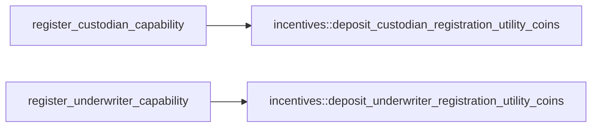
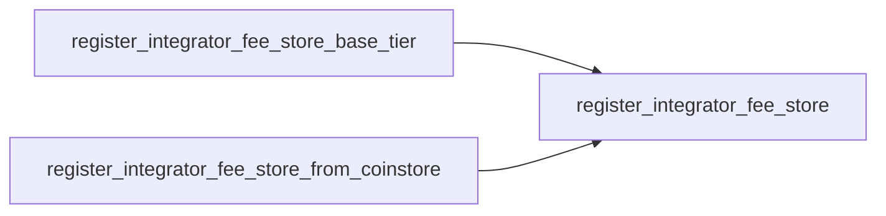
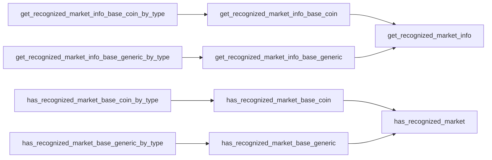
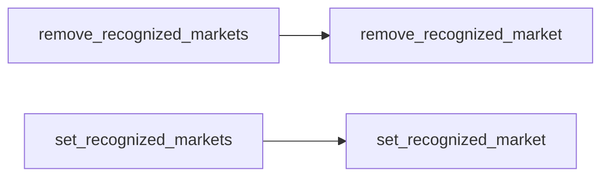
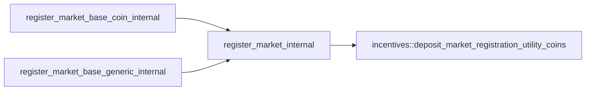

# Module `0xc0deb00c::registry`

Market and capability registration operations.

Econia relies on a global market registry, which supports
permissionless registration of markets, as well as capabilities.
Custodian capabilities are required to approve order operations and
withdrawals, while underwriter capabilities are required to approve
generic asset amounts.

The registry is paired with a recognized market list that tabulates
a recognized market for select trading pairs. The recognized market
list can only be managed by the Econia account, and provides a set
of public APIs that allow lookup of an official market based on a
trading pair.

Custodian capabilities and underwriter capabilities are 1-indexed,
with an ID of 0 reserved as a flag for null. For consistency, market
IDs are 1-indexed too.

## General overview sections

[Public function index](#public-function-index)

* [Capability management](#capability-management)
* [Integrator fee store setup](#integrator-fee-store-setup)
* [Recognized market lookup](#recognized-market-lookup)
* [Recognized market management](#recognized-market-management)

[Dependency charts](#dependency-charts)

* [Capability registration](#capability-registration)
* [Fee store registration](#fee-store-registration)
* [Recognized market getters](#recognized-market-getters)
* [Recognized market setters](#recognized-market-setters)
* [Internal market registration](#internal-market-registration)

[Complete DocGen index](#complete-docgen-index)

## Public function index

### Capability management

* <code><a href="registry.md#0xc0deb00c_registry_get_custodian_id">get_custodian_id</a>()</code>
* <code><a href="registry.md#0xc0deb00c_registry_get_underwriter_id">get_underwriter_id</a>()</code>
* <code><a href="registry.md#0xc0deb00c_registry_register_custodian_capability">register_custodian_capability</a>()</code>
* <code><a href="registry.md#0xc0deb00c_registry_register_underwriter_capability">register_underwriter_capability</a>()</code>

### Integrator fee store setup

* <code><a href="registry.md#0xc0deb00c_registry_register_integrator_fee_store">register_integrator_fee_store</a>()</code>
* <code><a href="registry.md#0xc0deb00c_registry_register_integrator_fee_store_base_tier">register_integrator_fee_store_base_tier</a>()</code>
* <code><a href="registry.md#0xc0deb00c_registry_register_integrator_fee_store_from_coinstore">register_integrator_fee_store_from_coinstore</a>()</code>

### Recognized market lookup

* <code><a href="registry.md#0xc0deb00c_registry_get_recognized_market_info_base_coin">get_recognized_market_info_base_coin</a>()</code>
* <code><a href="registry.md#0xc0deb00c_registry_get_recognized_market_info_base_coin_by_type">get_recognized_market_info_base_coin_by_type</a>()</code>
* <code><a href="registry.md#0xc0deb00c_registry_get_recognized_market_info_base_generic">get_recognized_market_info_base_generic</a>()</code>
* <code><a href="registry.md#0xc0deb00c_registry_get_recognized_market_info_base_generic_by_type">get_recognized_market_info_base_generic_by_type</a>()</code>
* <code><a href="registry.md#0xc0deb00c_registry_has_recognized_market_base_coin">has_recognized_market_base_coin</a>()</code>
* <code><a href="registry.md#0xc0deb00c_registry_has_recognized_market_base_coin_by_type">has_recognized_market_base_coin_by_type</a>()</code>
* <code><a href="registry.md#0xc0deb00c_registry_has_recognized_market_base_generic">has_recognized_market_base_generic</a>()</code>
* <code><a href="registry.md#0xc0deb00c_registry_has_recognized_market_base_generic_by_type">has_recognized_market_base_generic_by_type</a>()</code>

### Recognized market management

* <code><a href="registry.md#0xc0deb00c_registry_remove_recognized_market">remove_recognized_market</a>()</code>
* <code><a href="registry.md#0xc0deb00c_registry_remove_recognized_markets">remove_recognized_markets</a>()</code>
* <code><a href="registry.md#0xc0deb00c_registry_set_recognized_market">set_recognized_market</a>()</code>
* <code><a href="registry.md#0xc0deb00c_registry_set_recognized_markets">set_recognized_markets</a>()</code>

(These are public entry functions.)

## Dependency charts

The below dependency charts use <code>mermaid.js</code> syntax, which can be
automatically rendered into a diagram (depending on the browser)
when viewing the documentation file generated from source code. If
a browser renders the diagrams with coloring that makes it difficult
to read, try a different browser.

### Capability registration

### Fee store registration

### Recognized market getters

### Recognized market setters

### Internal market registration

## Complete DocGen index

The below index is automatically generated from source code:

-  [General overview sections](#@General_overview_sections_0)
-  [Public function index](#@Public_function_index_1)
    -  [Capability management](#@Capability_management_2)
    -  [Integrator fee store setup](#@Integrator_fee_store_setup_3)
    -  [Recognized market lookup](#@Recognized_market_lookup_4)
    -  [Recognized market management](#@Recognized_market_management_5)
-  [Dependency charts](#@Dependency_charts_6)
    -  [Capability registration](#@Capability_registration_7)
    -  [Fee store registration](#@Fee_store_registration_8)
    -  [Recognized market getters](#@Recognized_market_getters_9)
    -  [Recognized market setters](#@Recognized_market_setters_10)
    -  [Internal market registration](#@Internal_market_registration_11)
-  [Complete DocGen index](#@Complete_DocGen_index_12)
-  [Struct `CustodianCapability`](#0xc0deb00c_registry_CustodianCapability)
-  [Resource `GenericAsset`](#0xc0deb00c_registry_GenericAsset)
-  [Struct `MarketInfo`](#0xc0deb00c_registry_MarketInfo)
-  [Struct `MarketRegistrationEvent`](#0xc0deb00c_registry_MarketRegistrationEvent)
-  [Struct `RecognizedMarketEvent`](#0xc0deb00c_registry_RecognizedMarketEvent)
-  [Struct `RecognizedMarketInfo`](#0xc0deb00c_registry_RecognizedMarketInfo)
-  [Resource `RecognizedMarkets`](#0xc0deb00c_registry_RecognizedMarkets)
-  [Resource `Registry`](#0xc0deb00c_registry_Registry)
-  [Struct `TradingPair`](#0xc0deb00c_registry_TradingPair)
-  [Struct `UnderwriterCapability`](#0xc0deb00c_registry_UnderwriterCapability)
-  [Constants](#@Constants_13)
-  [Function `get_custodian_id`](#0xc0deb00c_registry_get_custodian_id)
    -  [Testing](#@Testing_14)
-  [Function `get_recognized_market_info_base_coin`](#0xc0deb00c_registry_get_recognized_market_info_base_coin)
    -  [Parameters](#@Parameters_15)
    -  [Testing](#@Testing_16)
-  [Function `get_recognized_market_info_base_coin_by_type`](#0xc0deb00c_registry_get_recognized_market_info_base_coin_by_type)
    -  [Type parameters](#@Type_parameters_17)
    -  [Testing](#@Testing_18)
-  [Function `get_recognized_market_info_base_generic`](#0xc0deb00c_registry_get_recognized_market_info_base_generic)
    -  [Parameters](#@Parameters_19)
    -  [Testing](#@Testing_20)
-  [Function `get_recognized_market_info_base_generic_by_type`](#0xc0deb00c_registry_get_recognized_market_info_base_generic_by_type)
    -  [Type parameters](#@Type_parameters_21)
    -  [Parameters](#@Parameters_22)
    -  [Testing](#@Testing_23)
-  [Function `get_underwriter_id`](#0xc0deb00c_registry_get_underwriter_id)
    -  [Testing](#@Testing_24)
-  [Function `has_recognized_market_base_coin`](#0xc0deb00c_registry_has_recognized_market_base_coin)
    -  [Parameters](#@Parameters_25)
    -  [Testing](#@Testing_26)
-  [Function `has_recognized_market_base_coin_by_type`](#0xc0deb00c_registry_has_recognized_market_base_coin_by_type)
    -  [Type parameters](#@Type_parameters_27)
    -  [Testing](#@Testing_28)
-  [Function `has_recognized_market_base_generic`](#0xc0deb00c_registry_has_recognized_market_base_generic)
    -  [Parameters](#@Parameters_29)
    -  [Testing](#@Testing_30)
-  [Function `has_recognized_market_base_generic_by_type`](#0xc0deb00c_registry_has_recognized_market_base_generic_by_type)
    -  [Type parameters](#@Type_parameters_31)
    -  [Parameters](#@Parameters_32)
    -  [Testing](#@Testing_33)
-  [Function `register_custodian_capability`](#0xc0deb00c_registry_register_custodian_capability)
    -  [Testing](#@Testing_34)
-  [Function `register_integrator_fee_store`](#0xc0deb00c_registry_register_integrator_fee_store)
    -  [Type parameters](#@Type_parameters_35)
    -  [Parameters](#@Parameters_36)
    -  [Aborts](#@Aborts_37)
    -  [Testing](#@Testing_38)
-  [Function `register_underwriter_capability`](#0xc0deb00c_registry_register_underwriter_capability)
    -  [Testing](#@Testing_39)
-  [Function `register_integrator_fee_store_base_tier`](#0xc0deb00c_registry_register_integrator_fee_store_base_tier)
    -  [Testing](#@Testing_40)
-  [Function `register_integrator_fee_store_from_coinstore`](#0xc0deb00c_registry_register_integrator_fee_store_from_coinstore)
    -  [Testing](#@Testing_41)
-  [Function `remove_recognized_market`](#0xc0deb00c_registry_remove_recognized_market)
    -  [Parameters](#@Parameters_42)
    -  [Emits](#@Emits_43)
    -  [Aborts](#@Aborts_44)
    -  [Assumptions](#@Assumptions_45)
    -  [Testing](#@Testing_46)
-  [Function `remove_recognized_markets`](#0xc0deb00c_registry_remove_recognized_markets)
    -  [Testing](#@Testing_47)
-  [Function `set_recognized_market`](#0xc0deb00c_registry_set_recognized_market)
    -  [Parameters](#@Parameters_48)
    -  [Emits](#@Emits_49)
    -  [Aborts](#@Aborts_50)
    -  [Assumptions](#@Assumptions_51)
    -  [Testing](#@Testing_52)
-  [Function `set_recognized_markets`](#0xc0deb00c_registry_set_recognized_markets)
    -  [Testing](#@Testing_53)
-  [Function `get_market_info_for_market_account`](#0xc0deb00c_registry_get_market_info_for_market_account)
    -  [Parameters](#@Parameters_54)
    -  [Returns](#@Returns_55)
    -  [Aborts](#@Aborts_56)
    -  [Testing](#@Testing_57)
-  [Function `is_registered_custodian_id`](#0xc0deb00c_registry_is_registered_custodian_id)
    -  [Testing](#@Testing_58)
-  [Function `register_market_base_coin_internal`](#0xc0deb00c_registry_register_market_base_coin_internal)
    -  [Aborts](#@Aborts_59)
    -  [Testing](#@Testing_60)
-  [Function `register_market_base_generic_internal`](#0xc0deb00c_registry_register_market_base_generic_internal)
    -  [Aborts](#@Aborts_61)
    -  [Testing](#@Testing_62)

<pre><code><b>use</b> <a href="">0x1::account</a>;
<b>use</b> <a href="">0x1::coin</a>;
<b>use</b> <a href="">0x1::event</a>;
<b>use</b> <a href="">0x1::option</a>;
<b>use</b> <a href="">0x1::signer</a>;
<b>use</b> <a href="">0x1::string</a>;
<b>use</b> <a href="">0x1::table</a>;
<b>use</b> <a href="">0x1::type_info</a>;
<b>use</b> <a href="incentives.md#0xc0deb00c_incentives">0xc0deb00c::incentives</a>;
<b>use</b> <a href="tablist.md#0xc0deb00c_tablist">0xc0deb00c::tablist</a>;
</code></pre>

## Struct `CustodianCapability`

Custodian capability required to approve order operations and
withdrawals. Administered to third-party registrants who may
store it as they wish.

<pre><code><b>struct</b> <a href="registry.md#0xc0deb00c_registry_CustodianCapability">CustodianCapability</a> <b>has</b> store
</code></pre>

## Resource `GenericAsset`

Type flag for generic asset. Must be passed as base asset type
argument for generic market operations. Has key ability to
restrict unexpected malicious attack vectors.

<pre><code><b>struct</b> <a href="registry.md#0xc0deb00c_registry_GenericAsset">GenericAsset</a> <b>has</b> key
</code></pre>

## Struct `MarketInfo`

Information about a market.

<pre><code><b>struct</b> <a href="registry.md#0xc0deb00c_registry_MarketInfo">MarketInfo</a> <b>has</b> <b>copy</b>, drop, store
</code></pre>

## Struct `MarketRegistrationEvent`

Emitted when a market is registered.

<pre><code><b>struct</b> <a href="registry.md#0xc0deb00c_registry_MarketRegistrationEvent">MarketRegistrationEvent</a> <b>has</b> drop, store
</code></pre>

## Struct `RecognizedMarketEvent`

Emitted when a recognized market is added, removed, or updated.

<pre><code><b>struct</b> <a href="registry.md#0xc0deb00c_registry_RecognizedMarketEvent">RecognizedMarketEvent</a> <b>has</b> drop, store
</code></pre>

## Struct `RecognizedMarketInfo`

Recognized market info for a given trading pair.

<pre><code><b>struct</b> <a href="registry.md#0xc0deb00c_registry_RecognizedMarketInfo">RecognizedMarketInfo</a> <b>has</b> <b>copy</b>, drop, store
</code></pre>

## Resource `RecognizedMarkets`

Recognized markets for specific trading pairs.

<pre><code><b>struct</b> <a href="registry.md#0xc0deb00c_registry_RecognizedMarkets">RecognizedMarkets</a> <b>has</b> key
</code></pre>

## Resource `Registry`

Global registration information.

<pre><code><b>struct</b> <a href="registry.md#0xc0deb00c_registry_Registry">Registry</a> <b>has</b> key
</code></pre>

## Struct `TradingPair`

A combination of a base asset and a quote asset.

<pre><code><b>struct</b> <a href="registry.md#0xc0deb00c_registry_TradingPair">TradingPair</a> <b>has</b> <b>copy</b>, drop, store
</code></pre>

## Struct `UnderwriterCapability`

Underwriter capability required to verify generic asset
amounts. Administered to third-party registrants who may store
it as they wish.

<pre><code><b>struct</b> <a href="registry.md#0xc0deb00c_registry_UnderwriterCapability">UnderwriterCapability</a> <b>has</b> store
</code></pre>

## Constants

Caller is not Econia, but should be.

<pre><code><b>const</b> <a href="registry.md#0xc0deb00c_registry_E_NOT_ECONIA">E_NOT_ECONIA</a>: u64 = 9;
</code></pre>

Base coin type has not been initialized for a pure coin market.

<pre><code><b>const</b> <a href="registry.md#0xc0deb00c_registry_E_BASE_NOT_COIN">E_BASE_NOT_COIN</a>: u64 = 6;
</code></pre>

Base and quote asset descriptors are identical.

<pre><code><b>const</b> <a href="registry.md#0xc0deb00c_registry_E_BASE_QUOTE_SAME">E_BASE_QUOTE_SAME</a>: u64 = 4;
</code></pre>

Generic base asset descriptor has too few characters.

<pre><code><b>const</b> <a href="registry.md#0xc0deb00c_registry_E_GENERIC_TOO_FEW_CHARACTERS">E_GENERIC_TOO_FEW_CHARACTERS</a>: u64 = 7;
</code></pre>

Generic base asset descriptor has too many characters.

<pre><code><b>const</b> <a href="registry.md#0xc0deb00c_registry_E_GENERIC_TOO_MANY_CHARACTERS">E_GENERIC_TOO_MANY_CHARACTERS</a>: u64 = 8;
</code></pre>

Base asset type is invalid.

<pre><code><b>const</b> <a href="registry.md#0xc0deb00c_registry_E_INVALID_BASE">E_INVALID_BASE</a>: u64 = 13;
</code></pre>

Market ID is invalid.

<pre><code><b>const</b> <a href="registry.md#0xc0deb00c_registry_E_INVALID_MARKET_ID">E_INVALID_MARKET_ID</a>: u64 = 12;
</code></pre>

Quote asset type is invalid.

<pre><code><b>const</b> <a href="registry.md#0xc0deb00c_registry_E_INVALID_QUOTE">E_INVALID_QUOTE</a>: u64 = 14;
</code></pre>

Lot size specified as 0.

<pre><code><b>const</b> <a href="registry.md#0xc0deb00c_registry_E_LOT_SIZE_0">E_LOT_SIZE_0</a>: u64 = 0;
</code></pre>

Market is already registered.

<pre><code><b>const</b> <a href="registry.md#0xc0deb00c_registry_E_MARKET_REGISTERED">E_MARKET_REGISTERED</a>: u64 = 5;
</code></pre>

Minimum order size specified as 0.

<pre><code><b>const</b> <a href="registry.md#0xc0deb00c_registry_E_MIN_SIZE_0">E_MIN_SIZE_0</a>: u64 = 2;
</code></pre>

Trading pair does not have recognized market.

<pre><code><b>const</b> <a href="registry.md#0xc0deb00c_registry_E_NO_RECOGNIZED_MARKET">E_NO_RECOGNIZED_MARKET</a>: u64 = 10;
</code></pre>

Quote asset type has not been initialized as a coin.

<pre><code><b>const</b> <a href="registry.md#0xc0deb00c_registry_E_QUOTE_NOT_COIN">E_QUOTE_NOT_COIN</a>: u64 = 3;
</code></pre>

Tick size specified as 0.

<pre><code><b>const</b> <a href="registry.md#0xc0deb00c_registry_E_TICK_SIZE_0">E_TICK_SIZE_0</a>: u64 = 1;
</code></pre>

Market info is not recognized for given trading pair.

<pre><code><b>const</b> <a href="registry.md#0xc0deb00c_registry_E_WRONG_RECOGNIZED_MARKET">E_WRONG_RECOGNIZED_MARKET</a>: u64 = 11;
</code></pre>

Maximum number of characters permitted in a generic asset name,
equal to the maximum number of characters permitted in a comment
line per PEP 8.

<pre><code><b>const</b> <a href="registry.md#0xc0deb00c_registry_MAX_CHARACTERS_GENERIC">MAX_CHARACTERS_GENERIC</a>: u64 = 72;
</code></pre>

Minimum number of characters permitted in a generic asset name,
equal to the number of spaces in an indentation level per PEP 8.

<pre><code><b>const</b> <a href="registry.md#0xc0deb00c_registry_MIN_CHARACTERS_GENERIC">MIN_CHARACTERS_GENERIC</a>: u64 = 4;
</code></pre>

Custodian ID flag for no custodian.

<pre><code><b>const</b> <a href="registry.md#0xc0deb00c_registry_NO_CUSTODIAN">NO_CUSTODIAN</a>: u64 = 0;
</code></pre>

Underwriter ID flag for no underwriter.

<pre><code><b>const</b> <a href="registry.md#0xc0deb00c_registry_NO_UNDERWRITER">NO_UNDERWRITER</a>: u64 = 0;
</code></pre>

## Function `get_custodian_id`

Return serial ID of given <code><a href="registry.md#0xc0deb00c_registry_CustodianCapability">CustodianCapability</a></code>.

### Testing

* <code>test_register_capabilities()</code>

<pre><code><b>public</b> <b>fun</b> <a href="registry.md#0xc0deb00c_registry_get_custodian_id">get_custodian_id</a>(custodian_capability_ref: &<a href="registry.md#0xc0deb00c_registry_CustodianCapability">registry::CustodianCapability</a>): u64
</code></pre>

## Function `get_recognized_market_info_base_coin`

Wrapper for <code><a href="registry.md#0xc0deb00c_registry_get_recognized_market_info">get_recognized_market_info</a>()</code> for coin base asset.

### Parameters

* <code>base_type</code>: Base asset phantom coin type info.
* <code>quote_type</code>: Quote asset phantom coin type info.

### Testing

* <code>test_set_remove_check_recognized_markets()</code>

<pre><code><b>public</b> <b>fun</b> <a href="registry.md#0xc0deb00c_registry_get_recognized_market_info_base_coin">get_recognized_market_info_base_coin</a>(base_type: <a href="_TypeInfo">type_info::TypeInfo</a>, quote_type: <a href="_TypeInfo">type_info::TypeInfo</a>): (u64, u64, u64, u64, u64)
</code></pre>

## Function `get_recognized_market_info_base_coin_by_type`

Wrapper for <code><a href="registry.md#0xc0deb00c_registry_get_recognized_market_info_base_coin">get_recognized_market_info_base_coin</a>()</code> with
type parameters.

### Type parameters

* <code>BaseCoinType</code>: Base asset phantom coin type.
* <code>QuoteCoinType</code>: Quote asset phantom coin type.

### Testing

* <code>test_set_remove_check_recognized_markets()</code>

<pre><code><b>public</b> <b>fun</b> <a href="registry.md#0xc0deb00c_registry_get_recognized_market_info_base_coin_by_type">get_recognized_market_info_base_coin_by_type</a>&lt;BaseCoinType, QuoteCoinType&gt;(): (u64, u64, u64, u64, u64)
</code></pre>

## Function `get_recognized_market_info_base_generic`

Wrapper for <code><a href="registry.md#0xc0deb00c_registry_get_recognized_market_info">get_recognized_market_info</a>()</code> for generic base
asset.

### Parameters

* <code>base_name_generic</code>: Generic base asset name.
* <code>quote_type</code>: Quote asset phantom coin type info.

### Testing

* <code>test_set_remove_check_recognized_markets()</code>

<pre><code><b>public</b> <b>fun</b> <a href="registry.md#0xc0deb00c_registry_get_recognized_market_info_base_generic">get_recognized_market_info_base_generic</a>(base_name_generic: <a href="_String">string::String</a>, quote_type: <a href="_TypeInfo">type_info::TypeInfo</a>): (u64, u64, u64, u64, u64)
</code></pre>

## Function `get_recognized_market_info_base_generic_by_type`

Wrapper for <code><a href="registry.md#0xc0deb00c_registry_get_recognized_market_info_base_generic">get_recognized_market_info_base_generic</a>()</code> with
quote type parameter.

### Type parameters

* <code>QuoteCoinType</code>: Quote asset phantom coin type.

### Parameters

* <code>base_name_generic</code>: Generic base asset name.

### Testing

* <code>test_set_remove_check_recognized_markets()</code>

<pre><code><b>public</b> <b>fun</b> <a href="registry.md#0xc0deb00c_registry_get_recognized_market_info_base_generic_by_type">get_recognized_market_info_base_generic_by_type</a>&lt;QuoteCoinType&gt;(base_name_generic: <a href="_String">string::String</a>): (u64, u64, u64, u64, u64)
</code></pre>

## Function `get_underwriter_id`

Return serial ID of given <code><a href="registry.md#0xc0deb00c_registry_UnderwriterCapability">UnderwriterCapability</a></code>.

### Testing

* <code>test_register_capabilities()</code>

<pre><code><b>public</b> <b>fun</b> <a href="registry.md#0xc0deb00c_registry_get_underwriter_id">get_underwriter_id</a>(underwriter_capability_ref: &<a href="registry.md#0xc0deb00c_registry_UnderwriterCapability">registry::UnderwriterCapability</a>): u64
</code></pre>

## Function `has_recognized_market_base_coin`

Wrapper for <code><a href="registry.md#0xc0deb00c_registry_has_recognized_market">has_recognized_market</a>()</code> for coin base asset.

### Parameters

* <code>base_type</code>: Base asset phantom coin type info.
* <code>quote_type</code>: Quote asset phantom coin type info.

### Testing

* <code>test_set_remove_check_recognized_markets()</code>

<pre><code><b>public</b> <b>fun</b> <a href="registry.md#0xc0deb00c_registry_has_recognized_market_base_coin">has_recognized_market_base_coin</a>(base_type: <a href="_TypeInfo">type_info::TypeInfo</a>, quote_type: <a href="_TypeInfo">type_info::TypeInfo</a>): bool
</code></pre>

## Function `has_recognized_market_base_coin_by_type`

Wrapper for <code><a href="registry.md#0xc0deb00c_registry_has_recognized_market_base_coin">has_recognized_market_base_coin</a>()</code> with type
parameters.

### Type parameters

* <code>BaseCoinType</code>: Base asset phantom coin type.
* <code>QuoteCoinType</code>: Quote asset phantom coin type.

### Testing

* <code>test_set_remove_check_recognized_markets()</code>

<pre><code><b>public</b> <b>fun</b> <a href="registry.md#0xc0deb00c_registry_has_recognized_market_base_coin_by_type">has_recognized_market_base_coin_by_type</a>&lt;BaseCoinType, QuoteCoinType&gt;(): bool
</code></pre>

## Function `has_recognized_market_base_generic`

Wrapper for <code><a href="registry.md#0xc0deb00c_registry_has_recognized_market">has_recognized_market</a>()</code> for generic base asset.

### Parameters

* <code>base_name_generic</code>: Generic base asset name.
* <code>quote_type</code>: Quote asset phantom coin type info.

### Testing

* <code>test_set_remove_check_recognized_markets()</code>

<pre><code><b>public</b> <b>fun</b> <a href="registry.md#0xc0deb00c_registry_has_recognized_market_base_generic">has_recognized_market_base_generic</a>(base_name_generic: <a href="_String">string::String</a>, quote_type: <a href="_TypeInfo">type_info::TypeInfo</a>): bool
</code></pre>

## Function `has_recognized_market_base_generic_by_type`

Wrapper for <code><a href="registry.md#0xc0deb00c_registry_has_recognized_market_base_generic">has_recognized_market_base_generic</a>()</code> with quote
type parameter.

### Type parameters

* <code>QuoteCoinType</code>: Quote asset phantom coin type.

### Parameters

* <code>base_name_generic</code>: Generic base asset name.

### Testing

* <code>test_set_remove_check_recognized_markets()</code>

<pre><code><b>public</b> <b>fun</b> <a href="registry.md#0xc0deb00c_registry_has_recognized_market_base_generic_by_type">has_recognized_market_base_generic_by_type</a>&lt;QuoteCoinType&gt;(base_name_generic: <a href="_String">string::String</a>): bool
</code></pre>

## Function `register_custodian_capability`

Return a unique <code><a href="registry.md#0xc0deb00c_registry_CustodianCapability">CustodianCapability</a></code>.

Increment the number of registered custodians, then issue a
capability with the corresponding serial ID. Requires utility
coins to cover the custodian registration fee.

### Testing

* <code>test_register_capabilities()</code>

<pre><code><b>public</b> <b>fun</b> <a href="registry.md#0xc0deb00c_registry_register_custodian_capability">register_custodian_capability</a>&lt;UtilityCoinType&gt;(utility_coins: <a href="_Coin">coin::Coin</a>&lt;UtilityCoinType&gt;): <a href="registry.md#0xc0deb00c_registry_CustodianCapability">registry::CustodianCapability</a>
</code></pre>

## Function `register_integrator_fee_store`

Register integrator fee store to given tier on given market.

### Type parameters

* <code>QuoteCoinType</code>: The quote coin type for market.
* <code>UtilityCoinType</code>: The utility coin type.

### Parameters

* <code>integrator</code>: Integrator account.
* <code>market_id</code>: Market ID for corresponding market.
* <code>tier</code>: <code><a href="incentives.md#0xc0deb00c_incentives_IntegratorFeeStore">incentives::IntegratorFeeStore</a></code> tier to activate to.
* <code>utility_coins</code>: Utility coins paid to activate to given tier.

### Aborts

* <code><a href="registry.md#0xc0deb00c_registry_E_INVALID_MARKET_ID">E_INVALID_MARKET_ID</a></code>: No such registered market ID.
* <code><a href="registry.md#0xc0deb00c_registry_E_INVALID_QUOTE">E_INVALID_QUOTE</a></code>: Invalid quote coin type for market.

### Testing

* <code>test_register_integrator_fee_store_invalid_market_id()</code>
* <code>test_register_integrator_fee_store_invalid_quote()</code>
* <code>test_register_integrator_fee_stores()</code>

<pre><code><b>public</b> <b>fun</b> <a href="registry.md#0xc0deb00c_registry_register_integrator_fee_store">register_integrator_fee_store</a>&lt;QuoteCoinType, UtilityCoinType&gt;(integrator: &<a href="">signer</a>, market_id: u64, tier: u8, utility_coins: <a href="_Coin">coin::Coin</a>&lt;UtilityCoinType&gt;)
</code></pre>

## Function `register_underwriter_capability`

Return a unique <code><a href="registry.md#0xc0deb00c_registry_UnderwriterCapability">UnderwriterCapability</a></code>.

Increment the number of registered underwriters, then issue a
capability with the corresponding serial ID. Requires utility
coins to cover the underwriter registration fee.

### Testing

* <code>test_register_capabilities()</code>

<pre><code><b>public</b> <b>fun</b> <a href="registry.md#0xc0deb00c_registry_register_underwriter_capability">register_underwriter_capability</a>&lt;UtilityCoinType&gt;(utility_coins: <a href="_Coin">coin::Coin</a>&lt;UtilityCoinType&gt;): <a href="registry.md#0xc0deb00c_registry_UnderwriterCapability">registry::UnderwriterCapability</a>
</code></pre>

## Function `register_integrator_fee_store_base_tier`

Wrapped call to <code><a href="registry.md#0xc0deb00c_registry_register_integrator_fee_store">register_integrator_fee_store</a>()</code> for activating
to base tier, which does not require utility coins.

### Testing

* <code>test_register_integrator_fee_stores()</code>

<pre><code><b>public</b> entry <b>fun</b> <a href="registry.md#0xc0deb00c_registry_register_integrator_fee_store_base_tier">register_integrator_fee_store_base_tier</a>&lt;QuoteCoinType, UtilityCoinType&gt;(integrator: &<a href="">signer</a>, market_id: u64)
</code></pre>

## Function `register_integrator_fee_store_from_coinstore`

Wrapped call to <code><a href="registry.md#0xc0deb00c_registry_register_integrator_fee_store">register_integrator_fee_store</a>()</code> for paying
utility coins from an <code>aptos_framework::coin::CoinStore</code>.

### Testing

* <code>test_register_integrator_fee_stores()</code>

<pre><code><b>public</b> entry <b>fun</b> <a href="registry.md#0xc0deb00c_registry_register_integrator_fee_store_from_coinstore">register_integrator_fee_store_from_coinstore</a>&lt;QuoteCoinType, UtilityCoinType&gt;(integrator: &<a href="">signer</a>, market_id: u64, tier: u8)
</code></pre>

## Function `remove_recognized_market`

Remove market having given ID from recognized markets list.

### Parameters

* <code><a href="">account</a></code>: Econia account.
* <code>market_id</code>: Market ID to recognize.

### Emits

* <code><a href="registry.md#0xc0deb00c_registry_RecognizedMarketEvent">RecognizedMarketEvent</a></code>: Info about recognized market for
given trading pair.

### Aborts

* <code><a href="registry.md#0xc0deb00c_registry_E_NOT_ECONIA">E_NOT_ECONIA</a></code>: <code><a href="">account</a></code> is not Econia.
* <code><a href="registry.md#0xc0deb00c_registry_E_NO_RECOGNIZED_MARKET">E_NO_RECOGNIZED_MARKET</a></code>: Market having given ID is not a
recognized market.
* <code><a href="registry.md#0xc0deb00c_registry_E_WRONG_RECOGNIZED_MARKET">E_WRONG_RECOGNIZED_MARKET</a></code>: Market info is not recognized for
given trading pair.

### Assumptions

* <code>market_id</code> corresponds to a registered market.

### Testing

* <code>test_remove_recognized_market_no_recognized()</code>
* <code>test_remove_recognized_market_not_econia()</code>
* <code>test_remove_recognized_market_wrong_market()</code>
* <code>test_set_remove_check_recognized_markets()</code>

<pre><code><b>public</b> entry <b>fun</b> <a href="registry.md#0xc0deb00c_registry_remove_recognized_market">remove_recognized_market</a>(<a href="">account</a>: &<a href="">signer</a>, market_id: u64)
</code></pre>

## Function `remove_recognized_markets`

Wrapper for <code><a href="registry.md#0xc0deb00c_registry_remove_recognized_market">remove_recognized_market</a>()</code> with market IDs vector.

### Testing

* <code>test_set_remove_check_recognized_markets()</code>

<pre><code><b>public</b> entry <b>fun</b> <a href="registry.md#0xc0deb00c_registry_remove_recognized_markets">remove_recognized_markets</a>(<a href="">account</a>: &<a href="">signer</a>, market_ids: <a href="">vector</a>&lt;u64&gt;)
</code></pre>

## Function `set_recognized_market`

Set market having given ID as recognized market.

### Parameters

* <code><a href="">account</a></code>: Econia account.
* <code>market_id</code>: Market ID to recognize.

### Emits

* <code><a href="registry.md#0xc0deb00c_registry_RecognizedMarketEvent">RecognizedMarketEvent</a></code>: Info about recognized market for
given trading pair.

### Aborts

* <code><a href="registry.md#0xc0deb00c_registry_E_NOT_ECONIA">E_NOT_ECONIA</a></code>: <code><a href="">account</a></code> is not Econia.

### Assumptions

* <code>market_id</code> corresponds to a registered market.

### Testing

* <code>test_set_recognized_market_not_econia()</code>
* <code>test_set_recognized_market_update()</code>
* <code>test_set_remove_check_recognized_markets()</code>

<pre><code><b>public</b> entry <b>fun</b> <a href="registry.md#0xc0deb00c_registry_set_recognized_market">set_recognized_market</a>(<a href="">account</a>: &<a href="">signer</a>, market_id: u64)
</code></pre>

## Function `set_recognized_markets`

Wrapper for <code><a href="registry.md#0xc0deb00c_registry_set_recognized_market">set_recognized_market</a>()</code> with market IDs vector.

### Testing

* <code>test_set_remove_check_recognized_markets()</code>

<pre><code><b>public</b> entry <b>fun</b> <a href="registry.md#0xc0deb00c_registry_set_recognized_markets">set_recognized_markets</a>(<a href="">account</a>: &<a href="">signer</a>, market_ids: <a href="">vector</a>&lt;u64&gt;)
</code></pre>

## Function `get_market_info_for_market_account`

Check types, return market info for market account registration.

Restricted to friends to prevent excessive public queries
against the registry.

### Parameters

* <code>market_id</code>: Market ID to check.
* <code>base_type</code>: Base type to check.
* <code>quote_type</code>: Quote type to check.

### Returns

* <code>String</code>: <code><a href="registry.md#0xc0deb00c_registry_MarketInfo">MarketInfo</a>.base_name_generic</code>.
* <code>u64</code>: <code><a href="registry.md#0xc0deb00c_registry_MarketInfo">MarketInfo</a>.lot_size</code>.
* <code>u64</code>: <code><a href="registry.md#0xc0deb00c_registry_MarketInfo">MarketInfo</a>.tick_size</code>.
* <code>u64</code>: <code><a href="registry.md#0xc0deb00c_registry_MarketInfo">MarketInfo</a>.min_size</code>.
* <code>u64</code>: <code><a href="registry.md#0xc0deb00c_registry_MarketInfo">MarketInfo</a>.underwriter_id</code>.

### Aborts

* <code><a href="registry.md#0xc0deb00c_registry_E_INVALID_MARKET_ID">E_INVALID_MARKET_ID</a></code>: Market ID is invalid.
* <code><a href="registry.md#0xc0deb00c_registry_E_INVALID_BASE">E_INVALID_BASE</a></code>: Base asset type is invalid.
* <code><a href="registry.md#0xc0deb00c_registry_E_INVALID_QUOTE">E_INVALID_QUOTE</a></code>: Quote asset type is invalid.

### Testing

* <code>test_get_market_info_for_market_account()</code>
* <code>test_get_market_info_for_market_account_invalid_base()</code>
* <code>test_get_market_info_for_market_account_invalid_market_id()</code>
* <code>test_get_market_info_for_market_account_invalid_quote()</code>

<pre><code><b>public</b>(<b>friend</b>) <b>fun</b> <a href="registry.md#0xc0deb00c_registry_get_market_info_for_market_account">get_market_info_for_market_account</a>(market_id: u64, base_type: <a href="_TypeInfo">type_info::TypeInfo</a>, quote_type: <a href="_TypeInfo">type_info::TypeInfo</a>): (<a href="_String">string::String</a>, u64, u64, u64, u64)
</code></pre>

## Function `is_registered_custodian_id`

Return <code><b>true</b></code> if <code>custodian_id</code> has been registered.

Restricted to friends to prevent excessive public queries
against the registry.

### Testing

* <code>test_register_capabilities()</code>

<pre><code><b>public</b>(<b>friend</b>) <b>fun</b> <a href="registry.md#0xc0deb00c_registry_is_registered_custodian_id">is_registered_custodian_id</a>(custodian_id: u64): bool
</code></pre>

## Function `register_market_base_coin_internal`

Wrapped market registration call for a base coin type.

See inner function <code><a href="registry.md#0xc0deb00c_registry_register_market_internal">register_market_internal</a>()</code>.

### Aborts

* <code><a href="registry.md#0xc0deb00c_registry_E_BASE_NOT_COIN">E_BASE_NOT_COIN</a></code>: Base coin type is not initialized.

### Testing

* <code>test_register_market_base_not_coin()</code>
* <code>test_register_market_base_coin_internal()</code>

<pre><code><b>public</b>(<b>friend</b>) <b>fun</b> <a href="registry.md#0xc0deb00c_registry_register_market_base_coin_internal">register_market_base_coin_internal</a>&lt;BaseCoinType, QuoteCoinType, UtilityCoinType&gt;(lot_size: u64, tick_size: u64, min_size: u64, utility_coins: <a href="_Coin">coin::Coin</a>&lt;UtilityCoinType&gt;): u64
</code></pre>

## Function `register_market_base_generic_internal`

Wrapped market registration call for a generic base type,
requiring immutable reference to corresponding
<code><a href="registry.md#0xc0deb00c_registry_UnderwriterCapability">UnderwriterCapability</a></code> for the market, and <code>base_type</code>
descriptor.

See inner function <code><a href="registry.md#0xc0deb00c_registry_register_market_internal">register_market_internal</a>()</code>.

### Aborts

* <code><a href="registry.md#0xc0deb00c_registry_E_GENERIC_TOO_FEW_CHARACTERS">E_GENERIC_TOO_FEW_CHARACTERS</a></code>: Asset descriptor is too short.
* <code><a href="registry.md#0xc0deb00c_registry_E_GENERIC_TOO_MANY_CHARACTERS">E_GENERIC_TOO_MANY_CHARACTERS</a></code>: Asset descriptor is too long.

### Testing

* <code>test_register_market_base_generic_internal()</code>
* <code>test_register_market_generic_name_too_few()</code>
* <code>test_register_market_generic_name_too_many()</code>

<pre><code><b>public</b>(<b>friend</b>) <b>fun</b> <a href="registry.md#0xc0deb00c_registry_register_market_base_generic_internal">register_market_base_generic_internal</a>&lt;QuoteCoinType, UtilityCoinType&gt;(base_name_generic: <a href="_String">string::String</a>, lot_size: u64, tick_size: u64, min_size: u64, underwriter_capability_ref: &<a href="registry.md#0xc0deb00c_registry_UnderwriterCapability">registry::UnderwriterCapability</a>, utility_coins: <a href="_Coin">coin::Coin</a>&lt;UtilityCoinType&gt;): u64
</code></pre>
