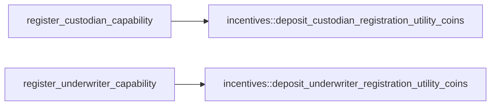
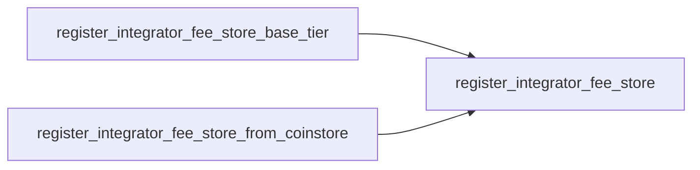
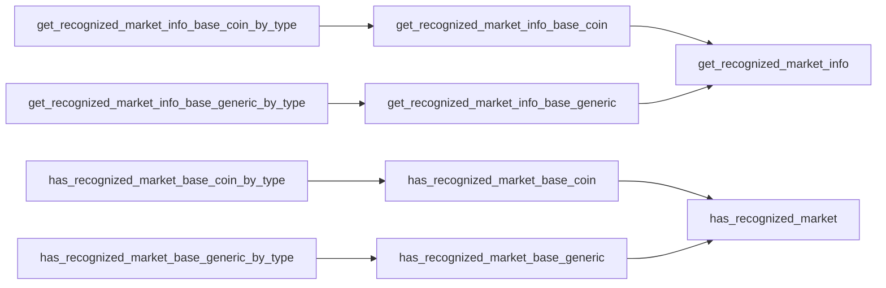
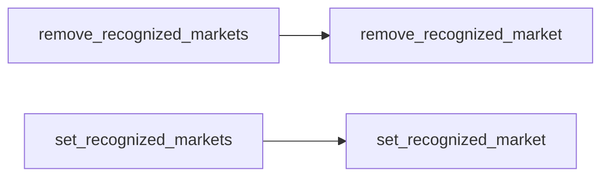
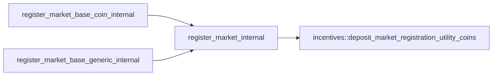
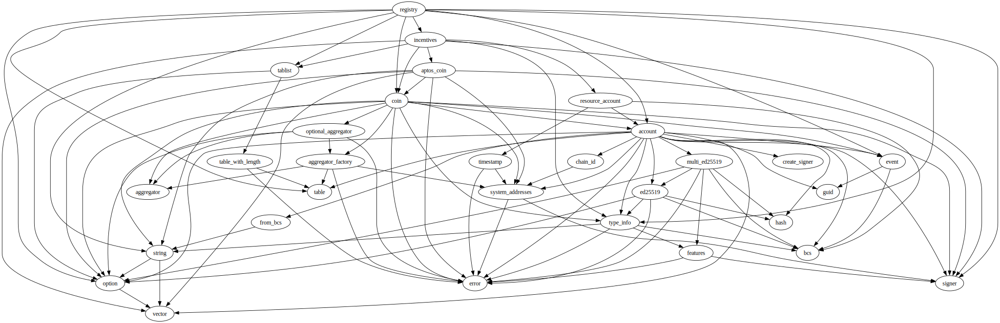
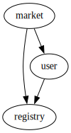

# Module `0xc0deb00c::registry`

Market and capability registration operations.

Econia relies on a global market registry, which supports
permissionless registration of markets, as well as capabilities.
Custodian capabilities are required to approve order operations and
withdrawals, while underwriter capabilities are required to approve
generic asset amounts.

The registry is paired with a recognized market list that tabulates
a recognized market for select trading pairs. The recognized market
list can only be managed by the Econia account, and provides a set
of public APIs that allow lookup of an official market based on a
trading pair.

Custodian capabilities and underwriter capabilities are 1-indexed,
with an ID of 0 reserved as a flag for null. For consistency, market
IDs are 1-indexed too.

## General overview sections

[Public function index](#public-function-index)

* [Constant getters](#constant-getters)
* [Capability management](#capability-management)
* [Integrator fee store setup](#integrator-fee-store-setup)
* [Recognized market lookup](#recognized-market-lookup)
* [Recognized market management](#recognized-market-management)

[Dependency charts](#dependency-charts)

* [Capability registration](#capability-registration)
* [Fee store registration](#fee-store-registration)
* [Recognized market getters](#recognized-market-getters)
* [Recognized market setters](#recognized-market-setters)
* [Internal market registration](#internal-market-registration)

[Complete DocGen index](#complete-docgen-index)

## Public function index

### Constant getters

* <code><a href="registry.md#0xc0deb00c_registry_get_MAX_CHARACTERS_GENERIC">get_MAX_CHARACTERS_GENERIC</a>()</code>
* <code><a href="registry.md#0xc0deb00c_registry_get_MIN_CHARACTERS_GENERIC">get_MIN_CHARACTERS_GENERIC</a>()</code>
* <code><a href="registry.md#0xc0deb00c_registry_get_NO_CUSTODIAN">get_NO_CUSTODIAN</a>()</code>
* <code><a href="registry.md#0xc0deb00c_registry_get_NO_UNDERWRITER">get_NO_UNDERWRITER</a>()</code>

### Capability management

* <code><a href="registry.md#0xc0deb00c_registry_get_custodian_id">get_custodian_id</a>()</code>
* <code><a href="registry.md#0xc0deb00c_registry_get_underwriter_id">get_underwriter_id</a>()</code>
* <code><a href="registry.md#0xc0deb00c_registry_register_custodian_capability">register_custodian_capability</a>()</code>
* <code><a href="registry.md#0xc0deb00c_registry_register_underwriter_capability">register_underwriter_capability</a>()</code>

### Integrator fee store setup

* <code><a href="registry.md#0xc0deb00c_registry_register_integrator_fee_store">register_integrator_fee_store</a>()</code>
* <code><a href="registry.md#0xc0deb00c_registry_register_integrator_fee_store_base_tier">register_integrator_fee_store_base_tier</a>()</code>
* <code><a href="registry.md#0xc0deb00c_registry_register_integrator_fee_store_from_coinstore">register_integrator_fee_store_from_coinstore</a>()</code>

### Recognized market lookup

* <code><a href="registry.md#0xc0deb00c_registry_get_recognized_market_info_base_coin">get_recognized_market_info_base_coin</a>()</code>
* <code><a href="registry.md#0xc0deb00c_registry_get_recognized_market_info_base_coin_by_type">get_recognized_market_info_base_coin_by_type</a>()</code>
* <code><a href="registry.md#0xc0deb00c_registry_get_recognized_market_info_base_generic">get_recognized_market_info_base_generic</a>()</code>
* <code><a href="registry.md#0xc0deb00c_registry_get_recognized_market_info_base_generic_by_type">get_recognized_market_info_base_generic_by_type</a>()</code>
* <code><a href="registry.md#0xc0deb00c_registry_has_recognized_market_base_coin">has_recognized_market_base_coin</a>()</code>
* <code><a href="registry.md#0xc0deb00c_registry_has_recognized_market_base_coin_by_type">has_recognized_market_base_coin_by_type</a>()</code>
* <code><a href="registry.md#0xc0deb00c_registry_has_recognized_market_base_generic">has_recognized_market_base_generic</a>()</code>
* <code><a href="registry.md#0xc0deb00c_registry_has_recognized_market_base_generic_by_type">has_recognized_market_base_generic_by_type</a>()</code>

### Recognized market management

* <code><a href="registry.md#0xc0deb00c_registry_remove_recognized_market">remove_recognized_market</a>()</code>
* <code><a href="registry.md#0xc0deb00c_registry_remove_recognized_markets">remove_recognized_markets</a>()</code>
* <code><a href="registry.md#0xc0deb00c_registry_set_recognized_market">set_recognized_market</a>()</code>
* <code><a href="registry.md#0xc0deb00c_registry_set_recognized_markets">set_recognized_markets</a>()</code>

(These are public entry functions.)

## Dependency charts

The below dependency charts use <code>mermaid.js</code> syntax, which can be
automatically rendered into a diagram (depending on the browser)
when viewing the documentation file generated from source code. If
a browser renders the diagrams with coloring that makes it difficult
to read, try a different browser.

### Capability registration

### Fee store registration

### Recognized market getters

### Recognized market setters

### Internal market registration

## Complete DocGen index

The below index is automatically generated from source code:

-  [General overview sections](#@General_overview_sections_0)
-  [Public function index](#@Public_function_index_1)
    -  [Constant getters](#@Constant_getters_2)
    -  [Capability management](#@Capability_management_3)
    -  [Integrator fee store setup](#@Integrator_fee_store_setup_4)
    -  [Recognized market lookup](#@Recognized_market_lookup_5)
    -  [Recognized market management](#@Recognized_market_management_6)
-  [Dependency charts](#@Dependency_charts_7)
    -  [Capability registration](#@Capability_registration_8)
    -  [Fee store registration](#@Fee_store_registration_9)
    -  [Recognized market getters](#@Recognized_market_getters_10)
    -  [Recognized market setters](#@Recognized_market_setters_11)
    -  [Internal market registration](#@Internal_market_registration_12)
-  [Complete DocGen index](#@Complete_DocGen_index_13)
-  [Struct `CustodianCapability`](#0xc0deb00c_registry_CustodianCapability)
-  [Resource `GenericAsset`](#0xc0deb00c_registry_GenericAsset)
-  [Struct `MarketInfo`](#0xc0deb00c_registry_MarketInfo)
-  [Struct `MarketRegistrationEvent`](#0xc0deb00c_registry_MarketRegistrationEvent)
-  [Struct `RecognizedMarketEvent`](#0xc0deb00c_registry_RecognizedMarketEvent)
-  [Struct `RecognizedMarketInfo`](#0xc0deb00c_registry_RecognizedMarketInfo)
-  [Resource `RecognizedMarkets`](#0xc0deb00c_registry_RecognizedMarkets)
-  [Resource `Registry`](#0xc0deb00c_registry_Registry)
-  [Struct `TradingPair`](#0xc0deb00c_registry_TradingPair)
-  [Struct `UnderwriterCapability`](#0xc0deb00c_registry_UnderwriterCapability)
-  [Constants](#@Constants_14)
-  [Function `get_custodian_id`](#0xc0deb00c_registry_get_custodian_id)
    -  [Testing](#@Testing_15)
-  [Function `get_recognized_market_info_base_coin`](#0xc0deb00c_registry_get_recognized_market_info_base_coin)
    -  [Parameters](#@Parameters_16)
    -  [Testing](#@Testing_17)
-  [Function `get_recognized_market_info_base_coin_by_type`](#0xc0deb00c_registry_get_recognized_market_info_base_coin_by_type)
    -  [Type parameters](#@Type_parameters_18)
    -  [Testing](#@Testing_19)
-  [Function `get_recognized_market_info_base_generic`](#0xc0deb00c_registry_get_recognized_market_info_base_generic)
    -  [Parameters](#@Parameters_20)
    -  [Testing](#@Testing_21)
-  [Function `get_recognized_market_info_base_generic_by_type`](#0xc0deb00c_registry_get_recognized_market_info_base_generic_by_type)
    -  [Type parameters](#@Type_parameters_22)
    -  [Parameters](#@Parameters_23)
    -  [Testing](#@Testing_24)
-  [Function `get_MAX_CHARACTERS_GENERIC`](#0xc0deb00c_registry_get_MAX_CHARACTERS_GENERIC)
    -  [Testing](#@Testing_25)
-  [Function `get_MIN_CHARACTERS_GENERIC`](#0xc0deb00c_registry_get_MIN_CHARACTERS_GENERIC)
    -  [Testing](#@Testing_26)
-  [Function `get_NO_CUSTODIAN`](#0xc0deb00c_registry_get_NO_CUSTODIAN)
    -  [Testing](#@Testing_27)
-  [Function `get_NO_UNDERWRITER`](#0xc0deb00c_registry_get_NO_UNDERWRITER)
    -  [Testing](#@Testing_28)
-  [Function `get_underwriter_id`](#0xc0deb00c_registry_get_underwriter_id)
    -  [Testing](#@Testing_29)
-  [Function `has_recognized_market_base_coin`](#0xc0deb00c_registry_has_recognized_market_base_coin)
    -  [Parameters](#@Parameters_30)
    -  [Testing](#@Testing_31)
-  [Function `has_recognized_market_base_coin_by_type`](#0xc0deb00c_registry_has_recognized_market_base_coin_by_type)
    -  [Type parameters](#@Type_parameters_32)
    -  [Testing](#@Testing_33)
-  [Function `has_recognized_market_base_generic`](#0xc0deb00c_registry_has_recognized_market_base_generic)
    -  [Parameters](#@Parameters_34)
    -  [Testing](#@Testing_35)
-  [Function `has_recognized_market_base_generic_by_type`](#0xc0deb00c_registry_has_recognized_market_base_generic_by_type)
    -  [Type parameters](#@Type_parameters_36)
    -  [Parameters](#@Parameters_37)
    -  [Testing](#@Testing_38)
-  [Function `register_custodian_capability`](#0xc0deb00c_registry_register_custodian_capability)
    -  [Testing](#@Testing_39)
-  [Function `register_integrator_fee_store`](#0xc0deb00c_registry_register_integrator_fee_store)
    -  [Type parameters](#@Type_parameters_40)
    -  [Parameters](#@Parameters_41)
    -  [Aborts](#@Aborts_42)
    -  [Testing](#@Testing_43)
-  [Function `register_underwriter_capability`](#0xc0deb00c_registry_register_underwriter_capability)
    -  [Testing](#@Testing_44)
-  [Function `register_integrator_fee_store_base_tier`](#0xc0deb00c_registry_register_integrator_fee_store_base_tier)
    -  [Testing](#@Testing_45)
-  [Function `register_integrator_fee_store_from_coinstore`](#0xc0deb00c_registry_register_integrator_fee_store_from_coinstore)
    -  [Testing](#@Testing_46)
-  [Function `remove_recognized_market`](#0xc0deb00c_registry_remove_recognized_market)
    -  [Parameters](#@Parameters_47)
    -  [Emits](#@Emits_48)
    -  [Aborts](#@Aborts_49)
    -  [Assumptions](#@Assumptions_50)
    -  [Testing](#@Testing_51)
-  [Function `remove_recognized_markets`](#0xc0deb00c_registry_remove_recognized_markets)
    -  [Testing](#@Testing_52)
-  [Function `set_recognized_market`](#0xc0deb00c_registry_set_recognized_market)
    -  [Parameters](#@Parameters_53)
    -  [Emits](#@Emits_54)
    -  [Aborts](#@Aborts_55)
    -  [Assumptions](#@Assumptions_56)
    -  [Testing](#@Testing_57)
-  [Function `set_recognized_markets`](#0xc0deb00c_registry_set_recognized_markets)
    -  [Testing](#@Testing_58)
-  [Function `get_market_info_for_market_account`](#0xc0deb00c_registry_get_market_info_for_market_account)
    -  [Parameters](#@Parameters_59)
    -  [Returns](#@Returns_60)
    -  [Aborts](#@Aborts_61)
    -  [Testing](#@Testing_62)
-  [Function `is_registered_custodian_id`](#0xc0deb00c_registry_is_registered_custodian_id)
    -  [Testing](#@Testing_63)
-  [Function `register_market_base_coin_internal`](#0xc0deb00c_registry_register_market_base_coin_internal)
    -  [Aborts](#@Aborts_64)
    -  [Testing](#@Testing_65)
-  [Function `register_market_base_generic_internal`](#0xc0deb00c_registry_register_market_base_generic_internal)
    -  [Aborts](#@Aborts_66)
    -  [Testing](#@Testing_67)
-  [Function `get_recognized_market_info`](#0xc0deb00c_registry_get_recognized_market_info)
    -  [Parameters](#@Parameters_68)
    -  [Returns](#@Returns_69)
    -  [Aborts](#@Aborts_70)
    -  [Testing](#@Testing_71)
-  [Function `has_recognized_market`](#0xc0deb00c_registry_has_recognized_market)
    -  [Testing](#@Testing_72)
-  [Function `init_module`](#0xc0deb00c_registry_init_module)
-  [Function `register_market_internal`](#0xc0deb00c_registry_register_market_internal)
    -  [Type parameters](#@Type_parameters_73)
    -  [Parameters](#@Parameters_74)
    -  [Emits](#@Emits_75)
    -  [Aborts](#@Aborts_76)
    -  [Assumptions](#@Assumptions_77)
    -  [Testing](#@Testing_78)

<pre><code><b>use</b> <a href="">0x1::account</a>;
<b>use</b> <a href="">0x1::coin</a>;
<b>use</b> <a href="">0x1::event</a>;
<b>use</b> <a href="">0x1::option</a>;
<b>use</b> <a href="">0x1::signer</a>;
<b>use</b> <a href="">0x1::string</a>;
<b>use</b> <a href="">0x1::table</a>;
<b>use</b> <a href="">0x1::type_info</a>;
<b>use</b> <a href="incentives.md#0xc0deb00c_incentives">0xc0deb00c::incentives</a>;
<b>use</b> <a href="tablist.md#0xc0deb00c_tablist">0xc0deb00c::tablist</a>;
</code></pre>

##### Show all the modules that "registry" depends on directly or indirectly

##### Show all the modules that depend on "registry" directly or indirectly

## Struct `CustodianCapability`

Custodian capability required to approve order operations and
withdrawals. Administered to third-party registrants who may
store it as they wish.

<pre><code><b>struct</b> <a href="registry.md#0xc0deb00c_registry_CustodianCapability">CustodianCapability</a> <b>has</b> store
</code></pre>

##### Fields

<dl>
<dt>
<code>custodian_id: u64</code>
</dt>
<dd>
 Serial ID, 1-indexed, generated upon registration as a
 custodian.
</dd>
</dl>

## Resource `GenericAsset`

Type flag for generic asset. Must be passed as base asset type
argument for generic market operations. Has key ability to
restrict unexpected malicious attack vectors.

<pre><code><b>struct</b> <a href="registry.md#0xc0deb00c_registry_GenericAsset">GenericAsset</a> <b>has</b> key
</code></pre>

##### Fields

<dl>
<dt>
<code>dummy_field: bool</code>
</dt>
<dd>

</dd>
</dl>

## Struct `MarketInfo`

Information about a market.

<pre><code><b>struct</b> <a href="registry.md#0xc0deb00c_registry_MarketInfo">MarketInfo</a> <b>has</b> <b>copy</b>, drop, store
</code></pre>

##### Fields

<dl>
<dt>
<code>base_type: <a href="_TypeInfo">type_info::TypeInfo</a></code>
</dt>
<dd>
 Base asset type info. When base asset is an
 <code>aptos_framework::coin::Coin</code>, corresponds to the phantom
 <code>CoinType</code> (<code><b>address</b>:module::MyCoin</code> rather than
 <code>aptos_framework::coin::Coin&lt;<b>address</b>:module::MyCoin&gt;</code>).
 Otherwise should be <code><a href="registry.md#0xc0deb00c_registry_GenericAsset">GenericAsset</a></code>.
</dd>
<dt>
<code>base_name_generic: <a href="_String">string::String</a></code>
</dt>
<dd>
 Custom base asset name for a generic market, provided by the
 underwriter who registers the market. Empty if a pure coin
 market.
</dd>
<dt>
<code>quote_type: <a href="_TypeInfo">type_info::TypeInfo</a></code>
</dt>
<dd>
 Quote asset coin type info. Corresponds to a phantom
 <code>CoinType</code> (<code><b>address</b>:module::MyCoin</code> rather than
 <code>aptos_framework::coin::Coin&lt;<b>address</b>:module::MyCoin&gt;</code>).
</dd>
<dt>
<code>lot_size: u64</code>
</dt>
<dd>
 Number of base units exchanged per lot (when base asset is
 a coin, corresponds to <code>aptos_framework::coin::Coin.value</code>).
</dd>
<dt>
<code>tick_size: u64</code>
</dt>
<dd>
 Number of quote coin units exchanged per tick (corresponds
 to <code>aptos_framework::coin::Coin.value</code>).
</dd>
<dt>
<code>min_size: u64</code>
</dt>
<dd>
 Minimum number of lots per order.
</dd>
<dt>
<code>underwriter_id: u64</code>
</dt>
<dd>
 <code><a href="registry.md#0xc0deb00c_registry_NO_UNDERWRITER">NO_UNDERWRITER</a></code> if a pure coin market, otherwise ID of
 underwriter capability required to verify generic asset
 amounts. A market-wide ID that only applies to markets
 having a generic base asset.
</dd>
</dl>

## Struct `MarketRegistrationEvent`

Emitted when a market is registered.

<pre><code><b>struct</b> <a href="registry.md#0xc0deb00c_registry_MarketRegistrationEvent">MarketRegistrationEvent</a> <b>has</b> drop, store
</code></pre>

##### Fields

<dl>
<dt>
<code>market_id: u64</code>
</dt>
<dd>
 Market ID of the market just registered.
</dd>
<dt>
<code>base_type: <a href="_TypeInfo">type_info::TypeInfo</a></code>
</dt>
<dd>
 Base asset type info.
</dd>
<dt>
<code>base_name_generic: <a href="_String">string::String</a></code>
</dt>
<dd>
 Base asset generic name, if any.
</dd>
<dt>
<code>quote_type: <a href="_TypeInfo">type_info::TypeInfo</a></code>
</dt>
<dd>
 Quote asset type info.
</dd>
<dt>
<code>lot_size: u64</code>
</dt>
<dd>
 Number of base units exchanged per lot.
</dd>
<dt>
<code>tick_size: u64</code>
</dt>
<dd>
 Number of quote units exchanged per tick.
</dd>
<dt>
<code>min_size: u64</code>
</dt>
<dd>
 Minimum number of lots per order.
</dd>
<dt>
<code>underwriter_id: u64</code>
</dt>
<dd>
 <code><a href="registry.md#0xc0deb00c_registry_NO_UNDERWRITER">NO_UNDERWRITER</a></code> if a pure coin market, otherwise ID of
 underwriter capability required to verify generic asset
 amounts.
</dd>
</dl>

## Struct `RecognizedMarketEvent`

Emitted when a recognized market is added, removed, or updated.

<pre><code><b>struct</b> <a href="registry.md#0xc0deb00c_registry_RecognizedMarketEvent">RecognizedMarketEvent</a> <b>has</b> drop, store
</code></pre>

##### Fields

<dl>
<dt>
<code>trading_pair: <a href="registry.md#0xc0deb00c_registry_TradingPair">registry::TradingPair</a></code>
</dt>
<dd>
 The associated trading pair.
</dd>
<dt>
<code>recognized_market_info: <a href="_Option">option::Option</a>&lt;<a href="registry.md#0xc0deb00c_registry_RecognizedMarketInfo">registry::RecognizedMarketInfo</a>&gt;</code>
</dt>
<dd>
 The recognized market info for the given trading pair after
 an addition or update. None if a removal.
</dd>
</dl>

## Struct `RecognizedMarketInfo`

Recognized market info for a given trading pair.

<pre><code><b>struct</b> <a href="registry.md#0xc0deb00c_registry_RecognizedMarketInfo">RecognizedMarketInfo</a> <b>has</b> <b>copy</b>, drop, store
</code></pre>

##### Fields

<dl>
<dt>
<code>market_id: u64</code>
</dt>
<dd>
 Market ID of recognized market, 0-indexed.
</dd>
<dt>
<code>lot_size: u64</code>
</dt>
<dd>
 Number of base units exchanged per lot.
</dd>
<dt>
<code>tick_size: u64</code>
</dt>
<dd>
 Number of quote units exchanged per tick.
</dd>
<dt>
<code>min_size: u64</code>
</dt>
<dd>
 Minimum number of lots per order.
</dd>
<dt>
<code>underwriter_id: u64</code>
</dt>
<dd>
 <code><a href="registry.md#0xc0deb00c_registry_NO_UNDERWRITER">NO_UNDERWRITER</a></code> if a pure coin market, otherwise ID of
 underwriter capability required to verify generic asset
 amounts.
</dd>
</dl>

## Resource `RecognizedMarkets`

Recognized markets for specific trading pairs.

<pre><code><b>struct</b> <a href="registry.md#0xc0deb00c_registry_RecognizedMarkets">RecognizedMarkets</a> <b>has</b> key
</code></pre>

##### Fields

<dl>
<dt>
<code>map: <a href="tablist.md#0xc0deb00c_tablist_Tablist">tablist::Tablist</a>&lt;<a href="registry.md#0xc0deb00c_registry_TradingPair">registry::TradingPair</a>, <a href="registry.md#0xc0deb00c_registry_RecognizedMarketInfo">registry::RecognizedMarketInfo</a>&gt;</code>
</dt>
<dd>
 Map from trading pair info to market information for the
 recognized market, if any, for given trading pair. Enables
 off-chain iterated indexing by market ID.
</dd>
<dt>
<code>recognized_market_events: <a href="_EventHandle">event::EventHandle</a>&lt;<a href="registry.md#0xc0deb00c_registry_RecognizedMarketEvent">registry::RecognizedMarketEvent</a>&gt;</code>
</dt>
<dd>
 Event handle for recognized market events.
</dd>
</dl>

## Resource `Registry`

Global registration information.

<pre><code><b>struct</b> <a href="registry.md#0xc0deb00c_registry_Registry">Registry</a> <b>has</b> key
</code></pre>

##### Fields

<dl>
<dt>
<code>market_id_to_info: <a href="tablist.md#0xc0deb00c_tablist_Tablist">tablist::Tablist</a>&lt;u64, <a href="registry.md#0xc0deb00c_registry_MarketInfo">registry::MarketInfo</a>&gt;</code>
</dt>
<dd>
 Map from 1-indexed market ID to corresponding market info,
 enabling off-chain iterated indexing by market ID.
</dd>
<dt>
<code>market_info_to_id: <a href="_Table">table::Table</a>&lt;<a href="registry.md#0xc0deb00c_registry_MarketInfo">registry::MarketInfo</a>, u64&gt;</code>
</dt>
<dd>
 Map from market info to corresponding 1-indexed market ID,
 enabling market duplicate checks.
</dd>
<dt>
<code>n_custodians: u64</code>
</dt>
<dd>
 The number of registered custodians.
</dd>
<dt>
<code>n_underwriters: u64</code>
</dt>
<dd>
 The number of registered underwriters.
</dd>
<dt>
<code>market_registration_events: <a href="_EventHandle">event::EventHandle</a>&lt;<a href="registry.md#0xc0deb00c_registry_MarketRegistrationEvent">registry::MarketRegistrationEvent</a>&gt;</code>
</dt>
<dd>
 Event handle for market registration events.
</dd>
</dl>

## Struct `TradingPair`

A combination of a base asset and a quote asset.

<pre><code><b>struct</b> <a href="registry.md#0xc0deb00c_registry_TradingPair">TradingPair</a> <b>has</b> <b>copy</b>, drop, store
</code></pre>

##### Fields

<dl>
<dt>
<code>base_type: <a href="_TypeInfo">type_info::TypeInfo</a></code>
</dt>
<dd>
 Base asset type info.
</dd>
<dt>
<code>base_name_generic: <a href="_String">string::String</a></code>
</dt>
<dd>
 Base asset generic name, if any.
</dd>
<dt>
<code>quote_type: <a href="_TypeInfo">type_info::TypeInfo</a></code>
</dt>
<dd>
 Quote asset type info.
</dd>
</dl>

## Struct `UnderwriterCapability`

Underwriter capability required to verify generic asset
amounts. Administered to third-party registrants who may store
it as they wish.

<pre><code><b>struct</b> <a href="registry.md#0xc0deb00c_registry_UnderwriterCapability">UnderwriterCapability</a> <b>has</b> store
</code></pre>

##### Fields

<dl>
<dt>
<code>underwriter_id: u64</code>
</dt>
<dd>
 Serial ID, 1-indexed, generated upon registration as an
 underwriter.
</dd>
</dl>

## Constants

Caller is not Econia, but should be.

<pre><code><b>const</b> <a href="registry.md#0xc0deb00c_registry_E_NOT_ECONIA">E_NOT_ECONIA</a>: u64 = 9;
</code></pre>

Base coin type has not been initialized for a pure coin market.

<pre><code><b>const</b> <a href="registry.md#0xc0deb00c_registry_E_BASE_NOT_COIN">E_BASE_NOT_COIN</a>: u64 = 6;
</code></pre>

Base and quote asset descriptors are identical.

<pre><code><b>const</b> <a href="registry.md#0xc0deb00c_registry_E_BASE_QUOTE_SAME">E_BASE_QUOTE_SAME</a>: u64 = 4;
</code></pre>

Generic base asset descriptor has too few characters.

<pre><code><b>const</b> <a href="registry.md#0xc0deb00c_registry_E_GENERIC_TOO_FEW_CHARACTERS">E_GENERIC_TOO_FEW_CHARACTERS</a>: u64 = 7;
</code></pre>

Generic base asset descriptor has too many characters.

<pre><code><b>const</b> <a href="registry.md#0xc0deb00c_registry_E_GENERIC_TOO_MANY_CHARACTERS">E_GENERIC_TOO_MANY_CHARACTERS</a>: u64 = 8;
</code></pre>

Base asset type is invalid.

<pre><code><b>const</b> <a href="registry.md#0xc0deb00c_registry_E_INVALID_BASE">E_INVALID_BASE</a>: u64 = 13;
</code></pre>

Market ID is invalid.

<pre><code><b>const</b> <a href="registry.md#0xc0deb00c_registry_E_INVALID_MARKET_ID">E_INVALID_MARKET_ID</a>: u64 = 12;
</code></pre>

Quote asset type is invalid.

<pre><code><b>const</b> <a href="registry.md#0xc0deb00c_registry_E_INVALID_QUOTE">E_INVALID_QUOTE</a>: u64 = 14;
</code></pre>

Lot size specified as 0.

<pre><code><b>const</b> <a href="registry.md#0xc0deb00c_registry_E_LOT_SIZE_0">E_LOT_SIZE_0</a>: u64 = 0;
</code></pre>

Market is already registered.

<pre><code><b>const</b> <a href="registry.md#0xc0deb00c_registry_E_MARKET_REGISTERED">E_MARKET_REGISTERED</a>: u64 = 5;
</code></pre>

Minimum order size specified as 0.

<pre><code><b>const</b> <a href="registry.md#0xc0deb00c_registry_E_MIN_SIZE_0">E_MIN_SIZE_0</a>: u64 = 2;
</code></pre>

Trading pair does not have recognized market.

<pre><code><b>const</b> <a href="registry.md#0xc0deb00c_registry_E_NO_RECOGNIZED_MARKET">E_NO_RECOGNIZED_MARKET</a>: u64 = 10;
</code></pre>

Quote asset type has not been initialized as a coin.

<pre><code><b>const</b> <a href="registry.md#0xc0deb00c_registry_E_QUOTE_NOT_COIN">E_QUOTE_NOT_COIN</a>: u64 = 3;
</code></pre>

Tick size specified as 0.

<pre><code><b>const</b> <a href="registry.md#0xc0deb00c_registry_E_TICK_SIZE_0">E_TICK_SIZE_0</a>: u64 = 1;
</code></pre>

Market ID is not recognized for corresponding trading pair.

<pre><code><b>const</b> <a href="registry.md#0xc0deb00c_registry_E_WRONG_RECOGNIZED_MARKET">E_WRONG_RECOGNIZED_MARKET</a>: u64 = 11;
</code></pre>

Maximum number of characters permitted in a generic asset name,
equal to the maximum number of characters permitted in a comment
line per PEP 8.

<pre><code><b>const</b> <a href="registry.md#0xc0deb00c_registry_MAX_CHARACTERS_GENERIC">MAX_CHARACTERS_GENERIC</a>: u64 = 72;
</code></pre>

Minimum number of characters permitted in a generic asset name,
equal to the number of spaces in an indentation level per PEP 8.

<pre><code><b>const</b> <a href="registry.md#0xc0deb00c_registry_MIN_CHARACTERS_GENERIC">MIN_CHARACTERS_GENERIC</a>: u64 = 4;
</code></pre>

Custodian ID flag for no custodian.

<pre><code><b>const</b> <a href="registry.md#0xc0deb00c_registry_NO_CUSTODIAN">NO_CUSTODIAN</a>: u64 = 0;
</code></pre>

Underwriter ID flag for no underwriter.

<pre><code><b>const</b> <a href="registry.md#0xc0deb00c_registry_NO_UNDERWRITER">NO_UNDERWRITER</a>: u64 = 0;
</code></pre>

## Function `get_custodian_id`

Return serial ID of given <code><a href="registry.md#0xc0deb00c_registry_CustodianCapability">CustodianCapability</a></code>.

### Testing

* <code>test_register_capabilities()</code>

<pre><code><b>public</b> <b>fun</b> <a href="registry.md#0xc0deb00c_registry_get_custodian_id">get_custodian_id</a>(custodian_capability_ref: &<a href="registry.md#0xc0deb00c_registry_CustodianCapability">registry::CustodianCapability</a>): u64
</code></pre>

##### Implementation

<pre><code><b>public</b> <b>fun</b> <a href="registry.md#0xc0deb00c_registry_get_custodian_id">get_custodian_id</a>(
    custodian_capability_ref: &<a href="registry.md#0xc0deb00c_registry_CustodianCapability">CustodianCapability</a>
): u64 {
    custodian_capability_ref.custodian_id
}
</code></pre>

## Function `get_recognized_market_info_base_coin`

Wrapper for <code><a href="registry.md#0xc0deb00c_registry_get_recognized_market_info">get_recognized_market_info</a>()</code> for coin base asset.

### Parameters

* <code>base_type</code>: Base asset phantom coin type info.
* <code>quote_type</code>: Quote asset phantom coin type info.

### Testing

* <code>test_set_remove_check_recognized_markets()</code>

<pre><code><b>public</b> <b>fun</b> <a href="registry.md#0xc0deb00c_registry_get_recognized_market_info_base_coin">get_recognized_market_info_base_coin</a>(base_type: <a href="_TypeInfo">type_info::TypeInfo</a>, quote_type: <a href="_TypeInfo">type_info::TypeInfo</a>): (u64, u64, u64, u64, u64)
</code></pre>

##### Implementation

<pre><code><b>public</b> <b>fun</b> <a href="registry.md#0xc0deb00c_registry_get_recognized_market_info_base_coin">get_recognized_market_info_base_coin</a>(
    base_type: TypeInfo,
    quote_type: TypeInfo
): (
    u64,
    u64,
    u64,
    u64,
    u64
) <b>acquires</b> <a href="registry.md#0xc0deb00c_registry_RecognizedMarkets">RecognizedMarkets</a> {
    // Get empty generic base asset name.
    <b>let</b> base_name_generic = <a href="_utf8">string::utf8</a>(b"");
    <b>let</b> trading_pair = // Pack trading pair.
        <a href="registry.md#0xc0deb00c_registry_TradingPair">TradingPair</a>{base_type, base_name_generic, quote_type};
    // Get recognized <a href="market.md#0xc0deb00c_market">market</a> info.
    <a href="registry.md#0xc0deb00c_registry_get_recognized_market_info">get_recognized_market_info</a>(trading_pair)
}
</code></pre>

## Function `get_recognized_market_info_base_coin_by_type`

Wrapper for <code><a href="registry.md#0xc0deb00c_registry_get_recognized_market_info_base_coin">get_recognized_market_info_base_coin</a>()</code> with
type parameters.

### Type parameters

* <code>BaseCoinType</code>: Base asset phantom coin type.
* <code>QuoteCoinType</code>: Quote asset phantom coin type.

### Testing

* <code>test_set_remove_check_recognized_markets()</code>

<pre><code><b>public</b> <b>fun</b> <a href="registry.md#0xc0deb00c_registry_get_recognized_market_info_base_coin_by_type">get_recognized_market_info_base_coin_by_type</a>&lt;BaseCoinType, QuoteCoinType&gt;(): (u64, u64, u64, u64, u64)
</code></pre>

##### Implementation

<pre><code><b>public</b> <b>fun</b> <a href="registry.md#0xc0deb00c_registry_get_recognized_market_info_base_coin_by_type">get_recognized_market_info_base_coin_by_type</a>&lt;
    BaseCoinType,
    QuoteCoinType
&gt;(): (
    u64,
    u64,
    u64,
    u64,
    u64
) <b>acquires</b> <a href="registry.md#0xc0deb00c_registry_RecognizedMarkets">RecognizedMarkets</a> {
    <a href="registry.md#0xc0deb00c_registry_get_recognized_market_info_base_coin">get_recognized_market_info_base_coin</a>(
        <a href="_type_of">type_info::type_of</a>&lt;BaseCoinType&gt;(),
        <a href="_type_of">type_info::type_of</a>&lt;QuoteCoinType&gt;())
}
</code></pre>

## Function `get_recognized_market_info_base_generic`

Wrapper for <code><a href="registry.md#0xc0deb00c_registry_get_recognized_market_info">get_recognized_market_info</a>()</code> for generic base
asset.

### Parameters

* <code>base_name_generic</code>: Generic base asset name.
* <code>quote_type</code>: Quote asset phantom coin type info.

### Testing

* <code>test_set_remove_check_recognized_markets()</code>

<pre><code><b>public</b> <b>fun</b> <a href="registry.md#0xc0deb00c_registry_get_recognized_market_info_base_generic">get_recognized_market_info_base_generic</a>(base_name_generic: <a href="_String">string::String</a>, quote_type: <a href="_TypeInfo">type_info::TypeInfo</a>): (u64, u64, u64, u64, u64)
</code></pre>

##### Implementation

<pre><code><b>public</b> <b>fun</b> <a href="registry.md#0xc0deb00c_registry_get_recognized_market_info_base_generic">get_recognized_market_info_base_generic</a>(
    base_name_generic: String,
    quote_type: TypeInfo
): (
    u64,
    u64,
    u64,
    u64,
    u64
) <b>acquires</b> <a href="registry.md#0xc0deb00c_registry_RecognizedMarkets">RecognizedMarkets</a> {
    // Get generic base asset type info.
    <b>let</b> base_type = <a href="_type_of">type_info::type_of</a>&lt;<a href="registry.md#0xc0deb00c_registry_GenericAsset">GenericAsset</a>&gt;();
    <b>let</b> trading_pair = // Pack trading pair.
        <a href="registry.md#0xc0deb00c_registry_TradingPair">TradingPair</a>{base_type, base_name_generic, quote_type};
    // Get recognized <a href="market.md#0xc0deb00c_market">market</a> info.
    <a href="registry.md#0xc0deb00c_registry_get_recognized_market_info">get_recognized_market_info</a>(trading_pair)
}
</code></pre>

## Function `get_recognized_market_info_base_generic_by_type`

Wrapper for <code><a href="registry.md#0xc0deb00c_registry_get_recognized_market_info_base_generic">get_recognized_market_info_base_generic</a>()</code> with
quote type parameter.

### Type parameters

* <code>QuoteCoinType</code>: Quote asset phantom coin type.

### Parameters

* <code>base_name_generic</code>: Generic base asset name.

### Testing

* <code>test_set_remove_check_recognized_markets()</code>

<pre><code><b>public</b> <b>fun</b> <a href="registry.md#0xc0deb00c_registry_get_recognized_market_info_base_generic_by_type">get_recognized_market_info_base_generic_by_type</a>&lt;QuoteCoinType&gt;(base_name_generic: <a href="_String">string::String</a>): (u64, u64, u64, u64, u64)
</code></pre>

##### Implementation

<pre><code><b>public</b> <b>fun</b> <a href="registry.md#0xc0deb00c_registry_get_recognized_market_info_base_generic_by_type">get_recognized_market_info_base_generic_by_type</a>&lt;
    QuoteCoinType
&gt;(
    base_name_generic: String,
): (
    u64,
    u64,
    u64,
    u64,
    u64
) <b>acquires</b> <a href="registry.md#0xc0deb00c_registry_RecognizedMarkets">RecognizedMarkets</a> {
    <a href="registry.md#0xc0deb00c_registry_get_recognized_market_info_base_generic">get_recognized_market_info_base_generic</a>(
        base_name_generic,
        <a href="_type_of">type_info::type_of</a>&lt;QuoteCoinType&gt;())
}
</code></pre>

## Function `get_MAX_CHARACTERS_GENERIC`

Public constant getter for <code><a href="registry.md#0xc0deb00c_registry_MAX_CHARACTERS_GENERIC">MAX_CHARACTERS_GENERIC</a></code>.

### Testing

* <code>test_get_MAX_CHARACTERS_GENERIC()</code>

<pre><code><b>public</b> <b>fun</b> <a href="registry.md#0xc0deb00c_registry_get_MAX_CHARACTERS_GENERIC">get_MAX_CHARACTERS_GENERIC</a>(): u64
</code></pre>

##### Implementation

<pre><code><b>public</b> <b>fun</b> <a href="registry.md#0xc0deb00c_registry_get_MAX_CHARACTERS_GENERIC">get_MAX_CHARACTERS_GENERIC</a>(): u64 {<a href="registry.md#0xc0deb00c_registry_MAX_CHARACTERS_GENERIC">MAX_CHARACTERS_GENERIC</a>}
</code></pre>

## Function `get_MIN_CHARACTERS_GENERIC`

Public constant getter for <code><a href="registry.md#0xc0deb00c_registry_MIN_CHARACTERS_GENERIC">MIN_CHARACTERS_GENERIC</a></code>.

### Testing

* <code>test_get_MIN_CHARACTERS_GENERIC()</code>

<pre><code><b>public</b> <b>fun</b> <a href="registry.md#0xc0deb00c_registry_get_MIN_CHARACTERS_GENERIC">get_MIN_CHARACTERS_GENERIC</a>(): u64
</code></pre>

##### Implementation

<pre><code><b>public</b> <b>fun</b> <a href="registry.md#0xc0deb00c_registry_get_MIN_CHARACTERS_GENERIC">get_MIN_CHARACTERS_GENERIC</a>(): u64 {<a href="registry.md#0xc0deb00c_registry_MIN_CHARACTERS_GENERIC">MIN_CHARACTERS_GENERIC</a>}
</code></pre>

## Function `get_NO_CUSTODIAN`

Public constant getter for <code><a href="registry.md#0xc0deb00c_registry_NO_CUSTODIAN">NO_CUSTODIAN</a></code>.

### Testing

* <code>test_get_NO_CUSTODIAN()</code>

<pre><code><b>public</b> <b>fun</b> <a href="registry.md#0xc0deb00c_registry_get_NO_CUSTODIAN">get_NO_CUSTODIAN</a>(): u64
</code></pre>

##### Implementation

<pre><code><b>public</b> <b>fun</b> <a href="registry.md#0xc0deb00c_registry_get_NO_CUSTODIAN">get_NO_CUSTODIAN</a>(): u64 {<a href="registry.md#0xc0deb00c_registry_NO_CUSTODIAN">NO_CUSTODIAN</a>}
</code></pre>

## Function `get_NO_UNDERWRITER`

Public constant getter for <code><a href="registry.md#0xc0deb00c_registry_NO_UNDERWRITER">NO_UNDERWRITER</a></code>.

### Testing

* <code>test_get_NO_UNDERWRITER()</code>

<pre><code><b>public</b> <b>fun</b> <a href="registry.md#0xc0deb00c_registry_get_NO_UNDERWRITER">get_NO_UNDERWRITER</a>(): u64
</code></pre>

##### Implementation

<pre><code><b>public</b> <b>fun</b> <a href="registry.md#0xc0deb00c_registry_get_NO_UNDERWRITER">get_NO_UNDERWRITER</a>(): u64 {<a href="registry.md#0xc0deb00c_registry_NO_UNDERWRITER">NO_UNDERWRITER</a>}
</code></pre>

## Function `get_underwriter_id`

Return serial ID of given <code><a href="registry.md#0xc0deb00c_registry_UnderwriterCapability">UnderwriterCapability</a></code>.

### Testing

* <code>test_register_capabilities()</code>

<pre><code><b>public</b> <b>fun</b> <a href="registry.md#0xc0deb00c_registry_get_underwriter_id">get_underwriter_id</a>(underwriter_capability_ref: &<a href="registry.md#0xc0deb00c_registry_UnderwriterCapability">registry::UnderwriterCapability</a>): u64
</code></pre>

##### Implementation

<pre><code><b>public</b> <b>fun</b> <a href="registry.md#0xc0deb00c_registry_get_underwriter_id">get_underwriter_id</a>(
    underwriter_capability_ref: &<a href="registry.md#0xc0deb00c_registry_UnderwriterCapability">UnderwriterCapability</a>
): u64 {
    underwriter_capability_ref.underwriter_id
}
</code></pre>

## Function `has_recognized_market_base_coin`

Wrapper for <code><a href="registry.md#0xc0deb00c_registry_has_recognized_market">has_recognized_market</a>()</code> for coin base asset.

### Parameters

* <code>base_type</code>: Base asset phantom coin type info.
* <code>quote_type</code>: Quote asset phantom coin type info.

### Testing

* <code>test_set_remove_check_recognized_markets()</code>

<pre><code><b>public</b> <b>fun</b> <a href="registry.md#0xc0deb00c_registry_has_recognized_market_base_coin">has_recognized_market_base_coin</a>(base_type: <a href="_TypeInfo">type_info::TypeInfo</a>, quote_type: <a href="_TypeInfo">type_info::TypeInfo</a>): bool
</code></pre>

##### Implementation

<pre><code><b>public</b> <b>fun</b> <a href="registry.md#0xc0deb00c_registry_has_recognized_market_base_coin">has_recognized_market_base_coin</a>(
    base_type: TypeInfo,
    quote_type: TypeInfo
): bool
<b>acquires</b> <a href="registry.md#0xc0deb00c_registry_RecognizedMarkets">RecognizedMarkets</a> {
    // Get empty generic base asset name.
    <b>let</b> base_name_generic = <a href="_utf8">string::utf8</a>(b"");
    <b>let</b> trading_pair = // Pack trading pair.
        <a href="registry.md#0xc0deb00c_registry_TradingPair">TradingPair</a>{base_type, base_name_generic, quote_type};
    // Check <b>if</b> trading pair <b>has</b> recognized <a href="market.md#0xc0deb00c_market">market</a>.
    <a href="registry.md#0xc0deb00c_registry_has_recognized_market">has_recognized_market</a>(trading_pair)
}
</code></pre>

## Function `has_recognized_market_base_coin_by_type`

Wrapper for <code><a href="registry.md#0xc0deb00c_registry_has_recognized_market_base_coin">has_recognized_market_base_coin</a>()</code> with type
parameters.

### Type parameters

* <code>BaseCoinType</code>: Base asset phantom coin type.
* <code>QuoteCoinType</code>: Quote asset phantom coin type.

### Testing

* <code>test_set_remove_check_recognized_markets()</code>

<pre><code><b>public</b> <b>fun</b> <a href="registry.md#0xc0deb00c_registry_has_recognized_market_base_coin_by_type">has_recognized_market_base_coin_by_type</a>&lt;BaseCoinType, QuoteCoinType&gt;(): bool
</code></pre>

##### Implementation

<pre><code><b>public</b> <b>fun</b> <a href="registry.md#0xc0deb00c_registry_has_recognized_market_base_coin_by_type">has_recognized_market_base_coin_by_type</a>&lt;
    BaseCoinType,
    QuoteCoinType
&gt;(): bool
<b>acquires</b> <a href="registry.md#0xc0deb00c_registry_RecognizedMarkets">RecognizedMarkets</a> {
    <a href="registry.md#0xc0deb00c_registry_has_recognized_market_base_coin">has_recognized_market_base_coin</a>(
        <a href="_type_of">type_info::type_of</a>&lt;BaseCoinType&gt;(),
        <a href="_type_of">type_info::type_of</a>&lt;QuoteCoinType&gt;())
}
</code></pre>

## Function `has_recognized_market_base_generic`

Wrapper for <code><a href="registry.md#0xc0deb00c_registry_has_recognized_market">has_recognized_market</a>()</code> for generic base asset.

### Parameters

* <code>base_name_generic</code>: Generic base asset name.
* <code>quote_type</code>: Quote asset phantom coin type info.

### Testing

* <code>test_set_remove_check_recognized_markets()</code>

<pre><code><b>public</b> <b>fun</b> <a href="registry.md#0xc0deb00c_registry_has_recognized_market_base_generic">has_recognized_market_base_generic</a>(base_name_generic: <a href="_String">string::String</a>, quote_type: <a href="_TypeInfo">type_info::TypeInfo</a>): bool
</code></pre>

##### Implementation

<pre><code><b>public</b> <b>fun</b> <a href="registry.md#0xc0deb00c_registry_has_recognized_market_base_generic">has_recognized_market_base_generic</a>(
    base_name_generic: String,
    quote_type: TypeInfo
): bool
<b>acquires</b> <a href="registry.md#0xc0deb00c_registry_RecognizedMarkets">RecognizedMarkets</a> {
    // Get generic base asset type info.
    <b>let</b> base_type = <a href="_type_of">type_info::type_of</a>&lt;<a href="registry.md#0xc0deb00c_registry_GenericAsset">GenericAsset</a>&gt;();
    <b>let</b> trading_pair = // Pack trading pair.
        <a href="registry.md#0xc0deb00c_registry_TradingPair">TradingPair</a>{base_type, base_name_generic, quote_type};
    // Check <b>if</b> trading pair <b>has</b> recognized <a href="market.md#0xc0deb00c_market">market</a>.
    <a href="registry.md#0xc0deb00c_registry_has_recognized_market">has_recognized_market</a>(trading_pair)
}
</code></pre>

## Function `has_recognized_market_base_generic_by_type`

Wrapper for <code><a href="registry.md#0xc0deb00c_registry_has_recognized_market_base_generic">has_recognized_market_base_generic</a>()</code> with quote
type parameter.

### Type parameters

* <code>QuoteCoinType</code>: Quote asset phantom coin type.

### Parameters

* <code>base_name_generic</code>: Generic base asset name.

### Testing

* <code>test_set_remove_check_recognized_markets()</code>

<pre><code><b>public</b> <b>fun</b> <a href="registry.md#0xc0deb00c_registry_has_recognized_market_base_generic_by_type">has_recognized_market_base_generic_by_type</a>&lt;QuoteCoinType&gt;(base_name_generic: <a href="_String">string::String</a>): bool
</code></pre>

##### Implementation

<pre><code><b>public</b> <b>fun</b> <a href="registry.md#0xc0deb00c_registry_has_recognized_market_base_generic_by_type">has_recognized_market_base_generic_by_type</a>&lt;
    QuoteCoinType
&gt;(
    base_name_generic: String,
): bool
<b>acquires</b> <a href="registry.md#0xc0deb00c_registry_RecognizedMarkets">RecognizedMarkets</a> {
    <a href="registry.md#0xc0deb00c_registry_has_recognized_market_base_generic">has_recognized_market_base_generic</a>(
        base_name_generic,
        <a href="_type_of">type_info::type_of</a>&lt;QuoteCoinType&gt;())
}
</code></pre>

## Function `register_custodian_capability`

Return a unique <code><a href="registry.md#0xc0deb00c_registry_CustodianCapability">CustodianCapability</a></code>.

Increment the number of registered custodians, then issue a
capability with the corresponding serial ID. Requires utility
coins to cover the custodian registration fee.

### Testing

* <code>test_register_capabilities()</code>

<pre><code><b>public</b> <b>fun</b> <a href="registry.md#0xc0deb00c_registry_register_custodian_capability">register_custodian_capability</a>&lt;UtilityCoinType&gt;(utility_coins: <a href="_Coin">coin::Coin</a>&lt;UtilityCoinType&gt;): <a href="registry.md#0xc0deb00c_registry_CustodianCapability">registry::CustodianCapability</a>
</code></pre>

##### Implementation

<pre><code><b>public</b> <b>fun</b> <a href="registry.md#0xc0deb00c_registry_register_custodian_capability">register_custodian_capability</a>&lt;UtilityCoinType&gt;(
    utility_coins: Coin&lt;UtilityCoinType&gt;
): <a href="registry.md#0xc0deb00c_registry_CustodianCapability">CustodianCapability</a>
<b>acquires</b> <a href="registry.md#0xc0deb00c_registry_Registry">Registry</a> {
    // Borrow mutable reference <b>to</b> <a href="registry.md#0xc0deb00c_registry">registry</a>.
    <b>let</b> registry_ref_mut = <b>borrow_global_mut</b>&lt;<a href="registry.md#0xc0deb00c_registry_Registry">Registry</a>&gt;(@econia);
    // Set custodian serial ID <b>to</b> the new number of custodians.
    <b>let</b> custodian_id = registry_ref_mut.n_custodians + 1;
    // Update the <a href="registry.md#0xc0deb00c_registry">registry</a> for the new count.
    registry_ref_mut.n_custodians = custodian_id;
    <a href="incentives.md#0xc0deb00c_incentives">incentives</a>:: // Deposit provided utility coins.
        deposit_custodian_registration_utility_coins(utility_coins);
    // Pack and <b>return</b> corresponding capability.
    <a href="registry.md#0xc0deb00c_registry_CustodianCapability">CustodianCapability</a>{custodian_id}
}
</code></pre>

## Function `register_integrator_fee_store`

Register integrator fee store to given tier on given market.

### Type parameters

* <code>QuoteCoinType</code>: The quote coin type for market.
* <code>UtilityCoinType</code>: The utility coin type.

### Parameters

* <code>integrator</code>: Integrator account.
* <code>market_id</code>: Market ID for corresponding market.
* <code>tier</code>: <code><a href="incentives.md#0xc0deb00c_incentives_IntegratorFeeStore">incentives::IntegratorFeeStore</a></code> tier to activate to.
* <code>utility_coins</code>: Utility coins paid to activate to given tier.

### Aborts

* <code><a href="registry.md#0xc0deb00c_registry_E_INVALID_MARKET_ID">E_INVALID_MARKET_ID</a></code>: No such registered market ID.
* <code><a href="registry.md#0xc0deb00c_registry_E_INVALID_QUOTE">E_INVALID_QUOTE</a></code>: Invalid quote coin type for market.

### Testing

* <code>test_register_integrator_fee_store_invalid_market_id()</code>
* <code>test_register_integrator_fee_store_invalid_quote()</code>
* <code>test_register_integrator_fee_stores()</code>

<pre><code><b>public</b> <b>fun</b> <a href="registry.md#0xc0deb00c_registry_register_integrator_fee_store">register_integrator_fee_store</a>&lt;QuoteCoinType, UtilityCoinType&gt;(integrator: &<a href="">signer</a>, market_id: u64, tier: u8, utility_coins: <a href="_Coin">coin::Coin</a>&lt;UtilityCoinType&gt;)
</code></pre>

##### Implementation

<pre><code><b>public</b> <b>fun</b> <a href="registry.md#0xc0deb00c_registry_register_integrator_fee_store">register_integrator_fee_store</a>&lt;
    QuoteCoinType,
    UtilityCoinType
&gt;(
    integrator: &<a href="">signer</a>,
    market_id: u64,
    tier: u8,
    utility_coins: Coin&lt;UtilityCoinType&gt;
) <b>acquires</b> <a href="registry.md#0xc0deb00c_registry_Registry">Registry</a> {
    <b>let</b> market_map_ref = // Immutably borrow markets map.
        &<b>borrow_global</b>&lt;<a href="registry.md#0xc0deb00c_registry_Registry">Registry</a>&gt;(@econia).market_id_to_info;
    // Assert <a href="market.md#0xc0deb00c_market">market</a> ID is registered.
    <b>assert</b>!(<a href="tablist.md#0xc0deb00c_tablist_contains">tablist::contains</a>(market_map_ref, market_id),
            <a href="registry.md#0xc0deb00c_registry_E_INVALID_MARKET_ID">E_INVALID_MARKET_ID</a>);
    // Immutably borrow <a href="market.md#0xc0deb00c_market">market</a> info.
    <b>let</b> market_info_ref = <a href="tablist.md#0xc0deb00c_tablist_borrow">tablist::borrow</a>(market_map_ref, market_id);
    // Assert quote type.
    <b>assert</b>!(market_info_ref.quote_type ==
            <a href="_type_of">type_info::type_of</a>&lt;QuoteCoinType&gt;(), <a href="registry.md#0xc0deb00c_registry_E_INVALID_QUOTE">E_INVALID_QUOTE</a>);
    // Register an integrator fee store at integrator's <a href="">account</a>.
    <a href="incentives.md#0xc0deb00c_incentives_register_integrator_fee_store">incentives::register_integrator_fee_store</a>&lt;
        QuoteCoinType, UtilityCoinType&gt;(integrator, market_id, tier,
        utility_coins);
}
</code></pre>

## Function `register_underwriter_capability`

Return a unique <code><a href="registry.md#0xc0deb00c_registry_UnderwriterCapability">UnderwriterCapability</a></code>.

Increment the number of registered underwriters, then issue a
capability with the corresponding serial ID. Requires utility
coins to cover the underwriter registration fee.

### Testing

* <code>test_register_capabilities()</code>

<pre><code><b>public</b> <b>fun</b> <a href="registry.md#0xc0deb00c_registry_register_underwriter_capability">register_underwriter_capability</a>&lt;UtilityCoinType&gt;(utility_coins: <a href="_Coin">coin::Coin</a>&lt;UtilityCoinType&gt;): <a href="registry.md#0xc0deb00c_registry_UnderwriterCapability">registry::UnderwriterCapability</a>
</code></pre>

##### Implementation

<pre><code><b>public</b> <b>fun</b> <a href="registry.md#0xc0deb00c_registry_register_underwriter_capability">register_underwriter_capability</a>&lt;UtilityCoinType&gt;(
    utility_coins: Coin&lt;UtilityCoinType&gt;
): <a href="registry.md#0xc0deb00c_registry_UnderwriterCapability">UnderwriterCapability</a>
<b>acquires</b> <a href="registry.md#0xc0deb00c_registry_Registry">Registry</a> {
    // Borrow mutable reference <b>to</b> <a href="registry.md#0xc0deb00c_registry">registry</a>.
    <b>let</b> registry_ref_mut = <b>borrow_global_mut</b>&lt;<a href="registry.md#0xc0deb00c_registry_Registry">Registry</a>&gt;(@econia);
    // Set underwriter serial ID <b>to</b> the new number of underwriters.
    <b>let</b> underwriter_id = registry_ref_mut.n_underwriters + 1;
    // Update the <a href="registry.md#0xc0deb00c_registry">registry</a> for the new count.
    registry_ref_mut.n_underwriters = underwriter_id;
    <a href="incentives.md#0xc0deb00c_incentives">incentives</a>:: // Deposit provided utility coins.
        deposit_underwriter_registration_utility_coins(utility_coins);
    // Pack and <b>return</b> corresponding capability.
    <a href="registry.md#0xc0deb00c_registry_UnderwriterCapability">UnderwriterCapability</a>{underwriter_id}
}
</code></pre>

## Function `register_integrator_fee_store_base_tier`

Wrapped call to <code><a href="registry.md#0xc0deb00c_registry_register_integrator_fee_store">register_integrator_fee_store</a>()</code> for activating
to base tier, which does not require utility coins.

### Testing

* <code>test_register_integrator_fee_stores()</code>

<pre><code><b>public</b> entry <b>fun</b> <a href="registry.md#0xc0deb00c_registry_register_integrator_fee_store_base_tier">register_integrator_fee_store_base_tier</a>&lt;QuoteCoinType, UtilityCoinType&gt;(integrator: &<a href="">signer</a>, market_id: u64)
</code></pre>

##### Implementation

<pre><code><b>public</b> entry <b>fun</b> <a href="registry.md#0xc0deb00c_registry_register_integrator_fee_store_base_tier">register_integrator_fee_store_base_tier</a>&lt;
    QuoteCoinType,
    UtilityCoinType
&gt;(
    integrator: &<a href="">signer</a>,
    market_id: u64,
) <b>acquires</b> <a href="registry.md#0xc0deb00c_registry_Registry">Registry</a> {
    <a href="registry.md#0xc0deb00c_registry_register_integrator_fee_store">register_integrator_fee_store</a>&lt;QuoteCoinType, UtilityCoinType&gt;(
        integrator, market_id, 0, <a href="_zero">coin::zero</a>&lt;UtilityCoinType&gt;());
}
</code></pre>

## Function `register_integrator_fee_store_from_coinstore`

Wrapped call to <code><a href="registry.md#0xc0deb00c_registry_register_integrator_fee_store">register_integrator_fee_store</a>()</code> for paying
utility coins from an <code>aptos_framework::coin::CoinStore</code>.

### Testing

* <code>test_register_integrator_fee_stores()</code>

<pre><code><b>public</b> entry <b>fun</b> <a href="registry.md#0xc0deb00c_registry_register_integrator_fee_store_from_coinstore">register_integrator_fee_store_from_coinstore</a>&lt;QuoteCoinType, UtilityCoinType&gt;(integrator: &<a href="">signer</a>, market_id: u64, tier: u8)
</code></pre>

##### Implementation

<pre><code><b>public</b> entry <b>fun</b> <a href="registry.md#0xc0deb00c_registry_register_integrator_fee_store_from_coinstore">register_integrator_fee_store_from_coinstore</a>&lt;
    QuoteCoinType,
    UtilityCoinType
&gt;(
    integrator: &<a href="">signer</a>,
    market_id: u64,
    tier: u8
) <b>acquires</b> <a href="registry.md#0xc0deb00c_registry_Registry">Registry</a> {
    <a href="registry.md#0xc0deb00c_registry_register_integrator_fee_store">register_integrator_fee_store</a>&lt;QuoteCoinType, UtilityCoinType&gt;(
        integrator, market_id, tier, <a href="_withdraw">coin::withdraw</a>&lt;UtilityCoinType&gt;(
            integrator, <a href="incentives.md#0xc0deb00c_incentives_get_tier_activation_fee">incentives::get_tier_activation_fee</a>(tier)));
}
</code></pre>

## Function `remove_recognized_market`

Remove market having given ID from recognized markets list.

### Parameters

* <code><a href="">account</a></code>: Econia account.
* <code>market_id</code>: Market ID to recognize.

### Emits

* <code><a href="registry.md#0xc0deb00c_registry_RecognizedMarketEvent">RecognizedMarketEvent</a></code>: Info about recognized market for
given trading pair.

### Aborts

* <code><a href="registry.md#0xc0deb00c_registry_E_NOT_ECONIA">E_NOT_ECONIA</a></code>: <code><a href="">account</a></code> is not Econia.
* <code><a href="registry.md#0xc0deb00c_registry_E_NO_RECOGNIZED_MARKET">E_NO_RECOGNIZED_MARKET</a></code>: Market having given ID is not a
recognized market.
* <code><a href="registry.md#0xc0deb00c_registry_E_WRONG_RECOGNIZED_MARKET">E_WRONG_RECOGNIZED_MARKET</a></code>: Market ID is not recognized for
corresponding trading pair.

### Assumptions

* <code>market_id</code> corresponds to a registered market.

### Testing

* <code>test_remove_recognized_market_no_recognized()</code>
* <code>test_remove_recognized_market_not_econia()</code>
* <code>test_remove_recognized_market_wrong_market()</code>
* <code>test_set_remove_check_recognized_markets()</code>

<pre><code><b>public</b> entry <b>fun</b> <a href="registry.md#0xc0deb00c_registry_remove_recognized_market">remove_recognized_market</a>(<a href="">account</a>: &<a href="">signer</a>, market_id: u64)
</code></pre>

##### Implementation

<pre><code><b>public</b> entry <b>fun</b> <a href="registry.md#0xc0deb00c_registry_remove_recognized_market">remove_recognized_market</a>(
    <a href="">account</a>: &<a href="">signer</a>,
    market_id: u64
) <b>acquires</b>
    <a href="registry.md#0xc0deb00c_registry_RecognizedMarkets">RecognizedMarkets</a>,
    <a href="registry.md#0xc0deb00c_registry_Registry">Registry</a>
{
    // Assert <a href="">account</a> is Econia.
    <b>assert</b>!(address_of(<a href="">account</a>) == @econia, <a href="registry.md#0xc0deb00c_registry_E_NOT_ECONIA">E_NOT_ECONIA</a>);
    <b>let</b> markets_map_ref = // Immutably borrow markets map.
        &<b>borrow_global</b>&lt;<a href="registry.md#0xc0deb00c_registry_Registry">Registry</a>&gt;(@econia).market_id_to_info;
    // Immutably borrow info for <a href="market.md#0xc0deb00c_market">market</a> having given ID.
    <b>let</b> market_info_ref = <a href="tablist.md#0xc0deb00c_tablist_borrow">tablist::borrow</a>(markets_map_ref, market_id);
    <b>let</b> trading_pair = // Pack trading pair from <a href="market.md#0xc0deb00c_market">market</a> info.
        <a href="registry.md#0xc0deb00c_registry_TradingPair">TradingPair</a>{base_type: market_info_ref.base_type,
                    base_name_generic: market_info_ref.base_name_generic,
                    quote_type: market_info_ref.quote_type};
    // Mutably borrow recognized markets resource.
    <b>let</b> recognized_markets_ref_mut =
        <b>borrow_global_mut</b>&lt;<a href="registry.md#0xc0deb00c_registry_RecognizedMarkets">RecognizedMarkets</a>&gt;(@econia);
    // Mutably borrow recognized markets map.
    <b>let</b> recognized_map_ref_mut = &<b>mut</b> recognized_markets_ref_mut.map;
    <b>assert</b>!( // Assert trading pair <b>has</b> a recognized <a href="market.md#0xc0deb00c_market">market</a>.
        <a href="tablist.md#0xc0deb00c_tablist_contains">tablist::contains</a>(recognized_map_ref_mut, trading_pair),
        <a href="registry.md#0xc0deb00c_registry_E_NO_RECOGNIZED_MARKET">E_NO_RECOGNIZED_MARKET</a>);
    // Get recognized <a href="market.md#0xc0deb00c_market">market</a> ID for corresponding trading pair.
    <b>let</b> recognized_market_id_for_trading_pair =
        <a href="tablist.md#0xc0deb00c_tablist_borrow">tablist::borrow</a>(recognized_map_ref_mut, trading_pair).market_id;
    // Assert passed <a href="market.md#0xc0deb00c_market">market</a> ID matches that of recognized <a href="market.md#0xc0deb00c_market">market</a> ID
    // for given trading pair.
    <b>assert</b>!(recognized_market_id_for_trading_pair == market_id,
            <a href="registry.md#0xc0deb00c_registry_E_WRONG_RECOGNIZED_MARKET">E_WRONG_RECOGNIZED_MARKET</a>);
    // Remove entry for given trading pair.
    <a href="tablist.md#0xc0deb00c_tablist_remove">tablist::remove</a>(recognized_map_ref_mut, trading_pair);
    // Mutably borrow recognized markets events handle.
    <b>let</b> event_handle_ref_mut =
        &<b>mut</b> recognized_markets_ref_mut.recognized_market_events;
    // Emit a recognized <a href="market.md#0xc0deb00c_market">market</a> <a href="">event</a>.
    <a href="_emit_event">event::emit_event</a>(event_handle_ref_mut, <a href="registry.md#0xc0deb00c_registry_RecognizedMarketEvent">RecognizedMarketEvent</a>{
        trading_pair, recognized_market_info: <a href="_none">option::none</a>()});
}
</code></pre>

## Function `remove_recognized_markets`

Wrapper for <code><a href="registry.md#0xc0deb00c_registry_remove_recognized_market">remove_recognized_market</a>()</code> with market IDs vector.

### Testing

* <code>test_set_remove_check_recognized_markets()</code>

<pre><code><b>public</b> entry <b>fun</b> <a href="registry.md#0xc0deb00c_registry_remove_recognized_markets">remove_recognized_markets</a>(<a href="">account</a>: &<a href="">signer</a>, market_ids: <a href="">vector</a>&lt;u64&gt;)
</code></pre>

##### Implementation

<pre><code><b>public</b> entry <b>fun</b> <a href="registry.md#0xc0deb00c_registry_remove_recognized_markets">remove_recognized_markets</a>(
    <a href="">account</a>: &<a href="">signer</a>,
    market_ids: <a href="">vector</a>&lt;u64&gt;
) <b>acquires</b>
    <a href="registry.md#0xc0deb00c_registry_RecognizedMarkets">RecognizedMarkets</a>,
    <a href="registry.md#0xc0deb00c_registry_Registry">Registry</a>
{
    // Get number of markets <b>to</b> remove.
    <b>let</b> n_markets = <a href="_length">vector::length</a>(&market_ids);
    <b>let</b> i = 0; // Declare <b>loop</b> counter.
    <b>while</b> (i &lt; n_markets) { // Loop over all markets in <a href="">vector</a>:
        // Get <a href="market.md#0xc0deb00c_market">market</a> ID <b>to</b> remove.
        <b>let</b> market_id = *<a href="_borrow">vector::borrow</a>(&market_ids, i);
        // Remove <b>as</b> recognized <a href="market.md#0xc0deb00c_market">market</a>.
        <a href="registry.md#0xc0deb00c_registry_remove_recognized_market">remove_recognized_market</a>(<a href="">account</a>, market_id);
        i = i + 1; // Increment <b>loop</b> counter.
    }
}
</code></pre>

## Function `set_recognized_market`

Set market having given ID as recognized market.

### Parameters

* <code><a href="">account</a></code>: Econia account.
* <code>market_id</code>: Market ID to recognize.

### Emits

* <code><a href="registry.md#0xc0deb00c_registry_RecognizedMarketEvent">RecognizedMarketEvent</a></code>: Info about recognized market for
given trading pair.

### Aborts

* <code><a href="registry.md#0xc0deb00c_registry_E_NOT_ECONIA">E_NOT_ECONIA</a></code>: <code><a href="">account</a></code> is not Econia.

### Assumptions

* <code>market_id</code> corresponds to a registered market.

### Testing

* <code>test_set_recognized_market_not_econia()</code>
* <code>test_set_recognized_market_update()</code>
* <code>test_set_remove_check_recognized_markets()</code>

<pre><code><b>public</b> entry <b>fun</b> <a href="registry.md#0xc0deb00c_registry_set_recognized_market">set_recognized_market</a>(<a href="">account</a>: &<a href="">signer</a>, market_id: u64)
</code></pre>

##### Implementation

<pre><code><b>public</b> entry <b>fun</b> <a href="registry.md#0xc0deb00c_registry_set_recognized_market">set_recognized_market</a>(
    <a href="">account</a>: &<a href="">signer</a>,
    market_id: u64
) <b>acquires</b>
    <a href="registry.md#0xc0deb00c_registry_RecognizedMarkets">RecognizedMarkets</a>,
    <a href="registry.md#0xc0deb00c_registry_Registry">Registry</a>
{
    // Assert <a href="">account</a> is Econia.
    <b>assert</b>!(address_of(<a href="">account</a>) == @econia, <a href="registry.md#0xc0deb00c_registry_E_NOT_ECONIA">E_NOT_ECONIA</a>);
    <b>let</b> markets_map_ref = // Immutably borrow markets map.
        &<b>borrow_global</b>&lt;<a href="registry.md#0xc0deb00c_registry_Registry">Registry</a>&gt;(@econia).market_id_to_info;
    // Immutably borrow info for <a href="market.md#0xc0deb00c_market">market</a> having given ID.
    <b>let</b> market_info_ref = <a href="tablist.md#0xc0deb00c_tablist_borrow">tablist::borrow</a>(markets_map_ref, market_id);
    // Get recognized <a href="market.md#0xc0deb00c_market">market</a> info parameters.
    <b>let</b> (base_type, base_name_generic, quote_type, lot_size, tick_size,
         min_size, underwriter_id) =
        (market_info_ref.base_type, market_info_ref.base_name_generic,
         market_info_ref.quote_type, market_info_ref.lot_size,
         market_info_ref.tick_size, market_info_ref.min_size,
         market_info_ref.underwriter_id);
    <b>let</b> trading_pair = // Pack trading pair.
        <a href="registry.md#0xc0deb00c_registry_TradingPair">TradingPair</a>{base_type, base_name_generic, quote_type};
    // Pack recognized <a href="market.md#0xc0deb00c_market">market</a> info.
    <b>let</b> recognized_market_info = <a href="registry.md#0xc0deb00c_registry_RecognizedMarketInfo">RecognizedMarketInfo</a>{
        market_id, lot_size, tick_size, min_size, underwriter_id};
    // Mutably borrow recognized markets resource.
    <b>let</b> recognized_markets_ref_mut =
        <b>borrow_global_mut</b>&lt;<a href="registry.md#0xc0deb00c_registry_RecognizedMarkets">RecognizedMarkets</a>&gt;(@econia);
    // Mutably borrow recognized markets map.
    <b>let</b> recognized_map_ref_mut = &<b>mut</b> recognized_markets_ref_mut.map;
    <b>let</b> new = // New <b>if</b> trading pair not already recognized.
        !<a href="tablist.md#0xc0deb00c_tablist_contains">tablist::contains</a>(recognized_map_ref_mut, trading_pair);
    // If new trading pair, add an entry <b>to</b> map.
    <b>if</b> (new) <a href="tablist.md#0xc0deb00c_tablist_add">tablist::add</a>(
        recognized_map_ref_mut, trading_pair, recognized_market_info)
    // Otherwise <b>update</b> existing entry.
    <b>else</b> *<a href="tablist.md#0xc0deb00c_tablist_borrow_mut">tablist::borrow_mut</a>(recognized_map_ref_mut, trading_pair) =
            recognized_market_info;
    // Pack <a href="market.md#0xc0deb00c_market">market</a> info in an <a href="">option</a>.
    <b>let</b> optional_market_info = <a href="_some">option::some</a>(recognized_market_info);
    // Mutably borrow recognized markets events handle.
    <b>let</b> event_handle_ref_mut =
        &<b>mut</b> recognized_markets_ref_mut.recognized_market_events;
    // Emit a recognized <a href="market.md#0xc0deb00c_market">market</a> <a href="">event</a>.
    <a href="_emit_event">event::emit_event</a>(event_handle_ref_mut, <a href="registry.md#0xc0deb00c_registry_RecognizedMarketEvent">RecognizedMarketEvent</a>{
        trading_pair, recognized_market_info: optional_market_info});
}
</code></pre>

## Function `set_recognized_markets`

Wrapper for <code><a href="registry.md#0xc0deb00c_registry_set_recognized_market">set_recognized_market</a>()</code> with market IDs vector.

### Testing

* <code>test_set_remove_check_recognized_markets()</code>

<pre><code><b>public</b> entry <b>fun</b> <a href="registry.md#0xc0deb00c_registry_set_recognized_markets">set_recognized_markets</a>(<a href="">account</a>: &<a href="">signer</a>, market_ids: <a href="">vector</a>&lt;u64&gt;)
</code></pre>

##### Implementation

<pre><code><b>public</b> entry <b>fun</b> <a href="registry.md#0xc0deb00c_registry_set_recognized_markets">set_recognized_markets</a>(
    <a href="">account</a>: &<a href="">signer</a>,
    market_ids: <a href="">vector</a>&lt;u64&gt;
) <b>acquires</b>
    <a href="registry.md#0xc0deb00c_registry_RecognizedMarkets">RecognizedMarkets</a>,
    <a href="registry.md#0xc0deb00c_registry_Registry">Registry</a>
{
    // Get number of markets <b>to</b> set.
    <b>let</b> n_markets = <a href="_length">vector::length</a>(&market_ids);
    <b>let</b> i = 0; // Declare <b>loop</b> counter.
    <b>while</b> (i &lt; n_markets) { // Loop over all markets in <a href="">vector</a>:
        // Get <a href="market.md#0xc0deb00c_market">market</a> ID <b>to</b> set.
        <b>let</b> market_id = *<a href="_borrow">vector::borrow</a>(&market_ids, i);
        // Set <b>as</b> recognized <a href="market.md#0xc0deb00c_market">market</a>.
        <a href="registry.md#0xc0deb00c_registry_set_recognized_market">set_recognized_market</a>(<a href="">account</a>, market_id);
        i = i + 1; // Increment <b>loop</b> counter.
    }
}
</code></pre>

## Function `get_market_info_for_market_account`

Check types, return market info for market account registration.

Restricted to friends to prevent excessive public queries
against the registry.

### Parameters

* <code>market_id</code>: Market ID to check.
* <code>base_type</code>: Base type to check.
* <code>quote_type</code>: Quote type to check.

### Returns

* <code>String</code>: <code><a href="registry.md#0xc0deb00c_registry_MarketInfo">MarketInfo</a>.base_name_generic</code>.
* <code>u64</code>: <code><a href="registry.md#0xc0deb00c_registry_MarketInfo">MarketInfo</a>.lot_size</code>.
* <code>u64</code>: <code><a href="registry.md#0xc0deb00c_registry_MarketInfo">MarketInfo</a>.tick_size</code>.
* <code>u64</code>: <code><a href="registry.md#0xc0deb00c_registry_MarketInfo">MarketInfo</a>.min_size</code>.
* <code>u64</code>: <code><a href="registry.md#0xc0deb00c_registry_MarketInfo">MarketInfo</a>.underwriter_id</code>.

### Aborts

* <code><a href="registry.md#0xc0deb00c_registry_E_INVALID_MARKET_ID">E_INVALID_MARKET_ID</a></code>: Market ID is invalid.
* <code><a href="registry.md#0xc0deb00c_registry_E_INVALID_BASE">E_INVALID_BASE</a></code>: Base asset type is invalid.
* <code><a href="registry.md#0xc0deb00c_registry_E_INVALID_QUOTE">E_INVALID_QUOTE</a></code>: Quote asset type is invalid.

### Testing

* <code>test_get_market_info_for_market_account()</code>
* <code>test_get_market_info_for_market_account_invalid_base()</code>
* <code>test_get_market_info_for_market_account_invalid_market_id()</code>
* <code>test_get_market_info_for_market_account_invalid_quote()</code>

<pre><code><b>public</b>(<b>friend</b>) <b>fun</b> <a href="registry.md#0xc0deb00c_registry_get_market_info_for_market_account">get_market_info_for_market_account</a>(market_id: u64, base_type: <a href="_TypeInfo">type_info::TypeInfo</a>, quote_type: <a href="_TypeInfo">type_info::TypeInfo</a>): (<a href="_String">string::String</a>, u64, u64, u64, u64)
</code></pre>

##### Implementation

<pre><code><b>public</b>(<b>friend</b>) <b>fun</b> <a href="registry.md#0xc0deb00c_registry_get_market_info_for_market_account">get_market_info_for_market_account</a>(
    market_id: u64,
    base_type: TypeInfo,
    quote_type: TypeInfo
): (
    String,
    u64,
    u64,
    u64,
    u64
) <b>acquires</b> <a href="registry.md#0xc0deb00c_registry_Registry">Registry</a> {
    <b>let</b> markets_map_ref = // Immutably borrow markets map.
        &<b>borrow_global</b>&lt;<a href="registry.md#0xc0deb00c_registry_Registry">Registry</a>&gt;(@econia).market_id_to_info;
    <b>assert</b>!( // Assert <a href="market.md#0xc0deb00c_market">market</a> ID corresponds <b>to</b> registered <a href="market.md#0xc0deb00c_market">market</a>.
        <a href="tablist.md#0xc0deb00c_tablist_contains">tablist::contains</a>(markets_map_ref, market_id),
        <a href="registry.md#0xc0deb00c_registry_E_INVALID_MARKET_ID">E_INVALID_MARKET_ID</a>);
    // Immutably borrow <a href="market.md#0xc0deb00c_market">market</a> info for <a href="market.md#0xc0deb00c_market">market</a> ID.
    <b>let</b> market_info_ref = <a href="tablist.md#0xc0deb00c_tablist_borrow">tablist::borrow</a>(markets_map_ref, market_id);
    // Assert valid base asset type info.
    <b>assert</b>!(base_type == market_info_ref.base_type, <a href="registry.md#0xc0deb00c_registry_E_INVALID_BASE">E_INVALID_BASE</a>);
    // Assert valid quote asset type info.
    <b>assert</b>!(quote_type == market_info_ref.quote_type, <a href="registry.md#0xc0deb00c_registry_E_INVALID_QUOTE">E_INVALID_QUOTE</a>);
    (market_info_ref.base_name_generic, // Return <a href="market.md#0xc0deb00c_market">market</a> info.
     market_info_ref.lot_size,
     market_info_ref.tick_size,
     market_info_ref.min_size,
     market_info_ref.underwriter_id)
}
</code></pre>

## Function `is_registered_custodian_id`

Return <code><b>true</b></code> if <code>custodian_id</code> has been registered.

Restricted to friends to prevent excessive public queries
against the registry.

### Testing

* <code>test_register_capabilities()</code>

<pre><code><b>public</b>(<b>friend</b>) <b>fun</b> <a href="registry.md#0xc0deb00c_registry_is_registered_custodian_id">is_registered_custodian_id</a>(custodian_id: u64): bool
</code></pre>

##### Implementation

<pre><code><b>public</b>(<b>friend</b>) <b>fun</b> <a href="registry.md#0xc0deb00c_registry_is_registered_custodian_id">is_registered_custodian_id</a>(
    custodian_id: u64
): bool
<b>acquires</b> <a href="registry.md#0xc0deb00c_registry_Registry">Registry</a> {
    // Get number of registered custodians.
    <b>let</b> n_custodians = <b>borrow_global</b>&lt;<a href="registry.md#0xc0deb00c_registry_Registry">Registry</a>&gt;(@econia).n_custodians;
    // Return <b>if</b> custodian ID is less than or equal <b>to</b> number of
    // registered custodians and, <b>if</b> is not flag for no custodian.
    (custodian_id &lt;= n_custodians) && (custodian_id != <a href="registry.md#0xc0deb00c_registry_NO_CUSTODIAN">NO_CUSTODIAN</a>)
}
</code></pre>

## Function `register_market_base_coin_internal`

Wrapped market registration call for a base coin type.

See inner function <code><a href="registry.md#0xc0deb00c_registry_register_market_internal">register_market_internal</a>()</code>.

### Aborts

* <code><a href="registry.md#0xc0deb00c_registry_E_BASE_NOT_COIN">E_BASE_NOT_COIN</a></code>: Base coin type is not initialized.

### Testing

* <code>test_register_market_base_not_coin()</code>
* <code>test_register_market_base_coin_internal()</code>

<pre><code><b>public</b>(<b>friend</b>) <b>fun</b> <a href="registry.md#0xc0deb00c_registry_register_market_base_coin_internal">register_market_base_coin_internal</a>&lt;BaseCoinType, QuoteCoinType, UtilityCoinType&gt;(lot_size: u64, tick_size: u64, min_size: u64, utility_coins: <a href="_Coin">coin::Coin</a>&lt;UtilityCoinType&gt;): u64
</code></pre>

##### Implementation

<pre><code><b>public</b>(<b>friend</b>) <b>fun</b> <a href="registry.md#0xc0deb00c_registry_register_market_base_coin_internal">register_market_base_coin_internal</a>&lt;
    BaseCoinType,
    QuoteCoinType,
    UtilityCoinType
&gt;(
    lot_size: u64,
    tick_size: u64,
    min_size: u64,
    utility_coins: Coin&lt;UtilityCoinType&gt;
): u64
<b>acquires</b> <a href="registry.md#0xc0deb00c_registry_Registry">Registry</a> {
    // Assert base <a href="">coin</a> type is initialized.
    <b>assert</b>!(<a href="_is_coin_initialized">coin::is_coin_initialized</a>&lt;BaseCoinType&gt;(), <a href="registry.md#0xc0deb00c_registry_E_BASE_NOT_COIN">E_BASE_NOT_COIN</a>);
    // Add <b>to</b> the <a href="registry.md#0xc0deb00c_registry">registry</a> a corresponding entry, returning new
    // <a href="market.md#0xc0deb00c_market">market</a> ID.
    <a href="registry.md#0xc0deb00c_registry_register_market_internal">register_market_internal</a>&lt;QuoteCoinType, UtilityCoinType&gt;(
        <a href="_type_of">type_info::type_of</a>&lt;BaseCoinType&gt;(), <a href="_utf8">string::utf8</a>(b""), lot_size,
        tick_size, min_size, <a href="registry.md#0xc0deb00c_registry_NO_UNDERWRITER">NO_UNDERWRITER</a>, utility_coins)
}
</code></pre>

## Function `register_market_base_generic_internal`

Wrapped market registration call for a generic base type,
requiring immutable reference to corresponding
<code><a href="registry.md#0xc0deb00c_registry_UnderwriterCapability">UnderwriterCapability</a></code> for the market, and <code>base_type</code>
descriptor.

See inner function <code><a href="registry.md#0xc0deb00c_registry_register_market_internal">register_market_internal</a>()</code>.

### Aborts

* <code><a href="registry.md#0xc0deb00c_registry_E_GENERIC_TOO_FEW_CHARACTERS">E_GENERIC_TOO_FEW_CHARACTERS</a></code>: Asset descriptor is too short.
* <code><a href="registry.md#0xc0deb00c_registry_E_GENERIC_TOO_MANY_CHARACTERS">E_GENERIC_TOO_MANY_CHARACTERS</a></code>: Asset descriptor is too long.

### Testing

* <code>test_register_market_base_generic_internal()</code>
* <code>test_register_market_generic_name_too_few()</code>
* <code>test_register_market_generic_name_too_many()</code>

<pre><code><b>public</b>(<b>friend</b>) <b>fun</b> <a href="registry.md#0xc0deb00c_registry_register_market_base_generic_internal">register_market_base_generic_internal</a>&lt;QuoteCoinType, UtilityCoinType&gt;(base_name_generic: <a href="_String">string::String</a>, lot_size: u64, tick_size: u64, min_size: u64, underwriter_capability_ref: &<a href="registry.md#0xc0deb00c_registry_UnderwriterCapability">registry::UnderwriterCapability</a>, utility_coins: <a href="_Coin">coin::Coin</a>&lt;UtilityCoinType&gt;): u64
</code></pre>

##### Implementation

<pre><code><b>public</b>(<b>friend</b>) <b>fun</b> <a href="registry.md#0xc0deb00c_registry_register_market_base_generic_internal">register_market_base_generic_internal</a>&lt;
    QuoteCoinType,
    UtilityCoinType
&gt;(
    base_name_generic: String,
    lot_size: u64,
    tick_size: u64,
    min_size: u64,
    underwriter_capability_ref: &<a href="registry.md#0xc0deb00c_registry_UnderwriterCapability">UnderwriterCapability</a>,
    utility_coins: Coin&lt;UtilityCoinType&gt;
): u64
<b>acquires</b> <a href="registry.md#0xc0deb00c_registry_Registry">Registry</a> {
    // Get generic asset name length.
    <b>let</b> name_length = <a href="_length">string::length</a>(&base_name_generic);
    <b>assert</b>!( // Assert generic base asset <a href="">string</a> is not too short.
        name_length &gt;= <a href="registry.md#0xc0deb00c_registry_MIN_CHARACTERS_GENERIC">MIN_CHARACTERS_GENERIC</a>,
        <a href="registry.md#0xc0deb00c_registry_E_GENERIC_TOO_FEW_CHARACTERS">E_GENERIC_TOO_FEW_CHARACTERS</a>);
    <b>assert</b>!( // Assert generic base asset <a href="">string</a> is not too long.
        name_length &lt;= <a href="registry.md#0xc0deb00c_registry_MAX_CHARACTERS_GENERIC">MAX_CHARACTERS_GENERIC</a>,
        <a href="registry.md#0xc0deb00c_registry_E_GENERIC_TOO_MANY_CHARACTERS">E_GENERIC_TOO_MANY_CHARACTERS</a>);
    // Get underwriter ID.
    <b>let</b> underwriter_id = underwriter_capability_ref.underwriter_id;
    // Add <b>to</b> the <a href="registry.md#0xc0deb00c_registry">registry</a> a corresponding entry, returning new
    // <a href="market.md#0xc0deb00c_market">market</a> ID.
    <a href="registry.md#0xc0deb00c_registry_register_market_internal">register_market_internal</a>&lt;QuoteCoinType, UtilityCoinType&gt;(
        <a href="_type_of">type_info::type_of</a>&lt;<a href="registry.md#0xc0deb00c_registry_GenericAsset">GenericAsset</a>&gt;(), base_name_generic, lot_size,
        tick_size, min_size, underwriter_id, utility_coins)
}
</code></pre>

## Function `get_recognized_market_info`

Return recognized market info for given trading pair.

### Parameters

* <code>trading_pair</code>: Trading pair to look up.

### Returns

* <code>u64</code>: <code><a href="registry.md#0xc0deb00c_registry_RecognizedMarketInfo">RecognizedMarketInfo</a>.market_id</code>
* <code>u64</code>: <code><a href="registry.md#0xc0deb00c_registry_RecognizedMarketInfo">RecognizedMarketInfo</a>.lot_size</code>
* <code>u64</code>: <code><a href="registry.md#0xc0deb00c_registry_RecognizedMarketInfo">RecognizedMarketInfo</a>.tick_size</code>
* <code>u64</code>: <code><a href="registry.md#0xc0deb00c_registry_RecognizedMarketInfo">RecognizedMarketInfo</a>.min_size</code>
* <code>u64</code>: <code><a href="registry.md#0xc0deb00c_registry_RecognizedMarketInfo">RecognizedMarketInfo</a>.underwriter_id</code>

### Aborts

* <code><a href="registry.md#0xc0deb00c_registry_E_NO_RECOGNIZED_MARKET">E_NO_RECOGNIZED_MARKET</a></code>: Trading pair has no recognized
market.

### Testing

* <code>test_get_recognized_market_info_no_market()</code>
* <code>test_set_remove_check_recognized_markets()</code>

<pre><code><b>fun</b> <a href="registry.md#0xc0deb00c_registry_get_recognized_market_info">get_recognized_market_info</a>(trading_pair: <a href="registry.md#0xc0deb00c_registry_TradingPair">registry::TradingPair</a>): (u64, u64, u64, u64, u64)
</code></pre>

##### Implementation

<pre><code><b>fun</b> <a href="registry.md#0xc0deb00c_registry_get_recognized_market_info">get_recognized_market_info</a>(
    trading_pair: <a href="registry.md#0xc0deb00c_registry_TradingPair">TradingPair</a>
): (
    u64,
    u64,
    u64,
    u64,
    u64
) <b>acquires</b> <a href="registry.md#0xc0deb00c_registry_RecognizedMarkets">RecognizedMarkets</a> {
    // Mutably borrow recognized markets map.
    <b>let</b> recognized_map_ref =
        &<b>borrow_global</b>&lt;<a href="registry.md#0xc0deb00c_registry_RecognizedMarkets">RecognizedMarkets</a>&gt;(@econia).map;
    // Assert is actually recognized.
    <b>assert</b>!(<a href="tablist.md#0xc0deb00c_tablist_contains">tablist::contains</a>(recognized_map_ref, trading_pair),
            <a href="registry.md#0xc0deb00c_registry_E_NO_RECOGNIZED_MARKET">E_NO_RECOGNIZED_MARKET</a>);
    // Immutably borrow corresponding recognized <a href="market.md#0xc0deb00c_market">market</a> info.
    <b>let</b> recognized_market_info_ref =
        *<a href="tablist.md#0xc0deb00c_tablist_borrow">tablist::borrow</a>(recognized_map_ref, trading_pair);
    // Return recognized <a href="market.md#0xc0deb00c_market">market</a> info.
    (recognized_market_info_ref.market_id,
     recognized_market_info_ref.lot_size,
     recognized_market_info_ref.tick_size,
     recognized_market_info_ref.min_size,
     recognized_market_info_ref.underwriter_id)
}
</code></pre>

## Function `has_recognized_market`

Return <code><b>true</b></code> if given <code><a href="registry.md#0xc0deb00c_registry_TradingPair">TradingPair</a></code> has recognized market.

### Testing

* <code>test_set_remove_check_recognized_markets()</code>

<pre><code><b>fun</b> <a href="registry.md#0xc0deb00c_registry_has_recognized_market">has_recognized_market</a>(trading_pair: <a href="registry.md#0xc0deb00c_registry_TradingPair">registry::TradingPair</a>): bool
</code></pre>

##### Implementation

<pre><code><b>fun</b> <a href="registry.md#0xc0deb00c_registry_has_recognized_market">has_recognized_market</a>(
    trading_pair: <a href="registry.md#0xc0deb00c_registry_TradingPair">TradingPair</a>
): bool
<b>acquires</b> <a href="registry.md#0xc0deb00c_registry_RecognizedMarkets">RecognizedMarkets</a> {
    // Mutably borrow recognized markets map.
    <b>let</b> recognized_map_ref =
        &<b>borrow_global</b>&lt;<a href="registry.md#0xc0deb00c_registry_RecognizedMarkets">RecognizedMarkets</a>&gt;(@econia).map;
    // Return <b>if</b> map contains entry for given trading pair.
    <a href="tablist.md#0xc0deb00c_tablist_contains">tablist::contains</a>(recognized_map_ref, trading_pair)
}
</code></pre>

## Function `init_module`

Initialize the Econia registry and recognized markets list upon
module publication.

<pre><code><b>fun</b> <a href="registry.md#0xc0deb00c_registry_init_module">init_module</a>(econia: &<a href="">signer</a>)
</code></pre>

##### Implementation

<pre><code><b>fun</b> <a href="registry.md#0xc0deb00c_registry_init_module">init_module</a>(
    econia: &<a href="">signer</a>
) {
    // Initialize <a href="registry.md#0xc0deb00c_registry">registry</a>.
    <b>move_to</b>(econia, <a href="registry.md#0xc0deb00c_registry_Registry">Registry</a>{
        market_id_to_info: <a href="tablist.md#0xc0deb00c_tablist_new">tablist::new</a>(),
        market_info_to_id: <a href="_new">table::new</a>(),
        n_custodians: 0,
        n_underwriters: 0,
        market_registration_events:
            <a href="_new_event_handle">account::new_event_handle</a>&lt;<a href="registry.md#0xc0deb00c_registry_MarketRegistrationEvent">MarketRegistrationEvent</a>&gt;(econia)});
    // Initialize recognized markets list.
    <b>move_to</b>(econia, <a href="registry.md#0xc0deb00c_registry_RecognizedMarkets">RecognizedMarkets</a>{
        map: <a href="tablist.md#0xc0deb00c_tablist_new">tablist::new</a>(),
        recognized_market_events:
            <a href="_new_event_handle">account::new_event_handle</a>&lt;<a href="registry.md#0xc0deb00c_registry_RecognizedMarketEvent">RecognizedMarketEvent</a>&gt;(econia)});
}
</code></pre>

## Function `register_market_internal`

Register a market in the global registry.

### Type parameters

* <code>QuoteCoinType</code>: The quote coin type for the market.
* <code>UtilityCoinType</code>: The utility coin type.

### Parameters

* <code>base_type</code>: The base coin type info for a pure coin market,
otherwise that of <code><a href="registry.md#0xc0deb00c_registry_GenericAsset">GenericAsset</a></code>.
* <code>base_name_generic</code>: Base asset generic name, if any.
* <code>lot_size</code>: Lot size for the market.
* <code>tick_size</code>: Tick size for the market.
* <code>min_size</code>: Minimum lots per order for market.
* <code>underwriter_id</code>: <code><a href="registry.md#0xc0deb00c_registry_NO_UNDERWRITER">NO_UNDERWRITER</a></code> if a pure coin market,
otherwise ID of market underwriter.
* <code>utility_coins</code>: Utility coins paid to register a market.

### Emits

* <code><a href="registry.md#0xc0deb00c_registry_MarketRegistrationEvent">MarketRegistrationEvent</a></code>: Parameters of market just
registered.

### Aborts

* <code><a href="registry.md#0xc0deb00c_registry_E_LOT_SIZE_0">E_LOT_SIZE_0</a></code>: Lot size is 0.
* <code><a href="registry.md#0xc0deb00c_registry_E_TICK_SIZE_0">E_TICK_SIZE_0</a></code>: Tick size is 0.
* <code><a href="registry.md#0xc0deb00c_registry_E_MIN_SIZE_0">E_MIN_SIZE_0</a></code>: Minimum size is 0.
* <code><a href="registry.md#0xc0deb00c_registry_E_QUOTE_NOT_COIN">E_QUOTE_NOT_COIN</a></code>: Quote coin type not initialized as coin.
* <code><a href="registry.md#0xc0deb00c_registry_E_BASE_QUOTE_SAME">E_BASE_QUOTE_SAME</a></code>: Base and quote type are the same.
* <code><a href="registry.md#0xc0deb00c_registry_E_MARKET_REGISTERED">E_MARKET_REGISTERED</a></code>: Markets map already contains an entry
for specified market info.

### Assumptions

* <code>underwriter_id</code> has been properly passed by either
<code><a href="registry.md#0xc0deb00c_registry_register_market_base_coin_internal">register_market_base_coin_internal</a>()</code> or
<code><a href="registry.md#0xc0deb00c_registry_register_market_base_generic_internal">register_market_base_generic_internal</a>()</code>.

### Testing

* <code>test_register_market_base_coin_internal()</code>
* <code>test_register_market_base_generic_internal()</code>
* <code>test_register_market_lot_size_0()</code>
* <code>test_register_market_min_size_0()</code>
* <code>test_register_market_quote_not_coin()</code>
* <code>test_register_market_registered()</code>
* <code>test_register_market_same_type()</code>
* <code>test_register_market_tick_size_0()</code>

<pre><code><b>fun</b> <a href="registry.md#0xc0deb00c_registry_register_market_internal">register_market_internal</a>&lt;QuoteCoinType, UtilityCoinType&gt;(base_type: <a href="_TypeInfo">type_info::TypeInfo</a>, base_name_generic: <a href="_String">string::String</a>, lot_size: u64, tick_size: u64, min_size: u64, underwriter_id: u64, utility_coins: <a href="_Coin">coin::Coin</a>&lt;UtilityCoinType&gt;): u64
</code></pre>

##### Implementation

<pre><code><b>fun</b> <a href="registry.md#0xc0deb00c_registry_register_market_internal">register_market_internal</a>&lt;
    QuoteCoinType,
    UtilityCoinType
&gt;(
    base_type: TypeInfo,
    base_name_generic: String,
    lot_size: u64,
    tick_size: u64,
    min_size: u64,
    underwriter_id: u64,
    utility_coins: Coin&lt;UtilityCoinType&gt;
): u64
<b>acquires</b> <a href="registry.md#0xc0deb00c_registry_Registry">Registry</a> {
    // Assert lot size is nonzero.
    <b>assert</b>!(lot_size &gt; 0, <a href="registry.md#0xc0deb00c_registry_E_LOT_SIZE_0">E_LOT_SIZE_0</a>);
    // Assert tick size is nonzero.
    <b>assert</b>!(tick_size &gt; 0, <a href="registry.md#0xc0deb00c_registry_E_TICK_SIZE_0">E_TICK_SIZE_0</a>);
    // Assert minimum size is nonzero.
    <b>assert</b>!(min_size &gt; 0, <a href="registry.md#0xc0deb00c_registry_E_MIN_SIZE_0">E_MIN_SIZE_0</a>);
    // Assert quote <a href="">coin</a> type is initialized.
    <b>assert</b>!(<a href="_is_coin_initialized">coin::is_coin_initialized</a>&lt;QuoteCoinType&gt;(), <a href="registry.md#0xc0deb00c_registry_E_QUOTE_NOT_COIN">E_QUOTE_NOT_COIN</a>);
    // Get quote <a href="">coin</a> type.
    <b>let</b> quote_type = <a href="_type_of">type_info::type_of</a>&lt;QuoteCoinType&gt;();
    // Assert base and quote type names are not the same.
    <b>assert</b>!(base_type != quote_type, <a href="registry.md#0xc0deb00c_registry_E_BASE_QUOTE_SAME">E_BASE_QUOTE_SAME</a>);
    <b>let</b> market_info = <a href="registry.md#0xc0deb00c_registry_MarketInfo">MarketInfo</a>{ // Pack <a href="market.md#0xc0deb00c_market">market</a> info.
        base_type, base_name_generic, quote_type, lot_size, tick_size,
        min_size, underwriter_id};
    // Mutably borrow <a href="registry.md#0xc0deb00c_registry">registry</a>.
    <b>let</b> registry_ref_mut = <b>borrow_global_mut</b>&lt;<a href="registry.md#0xc0deb00c_registry_Registry">Registry</a>&gt;(@econia);
    // Mutably borrow map from <a href="market.md#0xc0deb00c_market">market</a> info <b>to</b> <a href="market.md#0xc0deb00c_market">market</a> ID.
    <b>let</b> info_to_id_ref_mut = &<b>mut</b> registry_ref_mut.market_info_to_id;
    <b>assert</b>!( // Assert <a href="market.md#0xc0deb00c_market">market</a> not registered.
        !<a href="_contains">table::contains</a>(info_to_id_ref_mut, market_info),
        <a href="registry.md#0xc0deb00c_registry_E_MARKET_REGISTERED">E_MARKET_REGISTERED</a>);
    // Mutably borrow map from <a href="market.md#0xc0deb00c_market">market</a> ID <b>to</b> <a href="market.md#0xc0deb00c_market">market</a> info.
    <b>let</b> id_to_info_ref_mut = &<b>mut</b> registry_ref_mut.market_id_to_info;
    // Get 1-indexed <a href="market.md#0xc0deb00c_market">market</a> ID.
    <b>let</b> market_id = <a href="tablist.md#0xc0deb00c_tablist_length">tablist::length</a>(id_to_info_ref_mut) + 1;
    // Register a <a href="market.md#0xc0deb00c_market">market</a> entry in map from <a href="market.md#0xc0deb00c_market">market</a> info <b>to</b> <a href="market.md#0xc0deb00c_market">market</a> ID.
    <a href="_add">table::add</a>(info_to_id_ref_mut, market_info, market_id);
    // Register a <a href="market.md#0xc0deb00c_market">market</a> entry in map from <a href="market.md#0xc0deb00c_market">market</a> ID <b>to</b> <a href="market.md#0xc0deb00c_market">market</a> info.
    <a href="tablist.md#0xc0deb00c_tablist_add">tablist::add</a>(id_to_info_ref_mut, market_id, market_info);
    // Mutably borrow <a href="market.md#0xc0deb00c_market">market</a> registration events handle.
    <b>let</b> event_handle_ref_mut =
        &<b>mut</b> registry_ref_mut.market_registration_events;
    // Emit a <a href="market.md#0xc0deb00c_market">market</a> registration <a href="">event</a>.
    <a href="_emit_event">event::emit_event</a>(event_handle_ref_mut, <a href="registry.md#0xc0deb00c_registry_MarketRegistrationEvent">MarketRegistrationEvent</a>{
        market_id, base_type, base_name_generic, quote_type, lot_size,
        tick_size, min_size, underwriter_id});
    <a href="incentives.md#0xc0deb00c_incentives_deposit_market_registration_utility_coins">incentives::deposit_market_registration_utility_coins</a>&lt;UtilityCoinType&gt;(
            utility_coins); // Deposit utility coins.
    market_id // Return <a href="market.md#0xc0deb00c_market">market</a> ID.
}
</code></pre>
