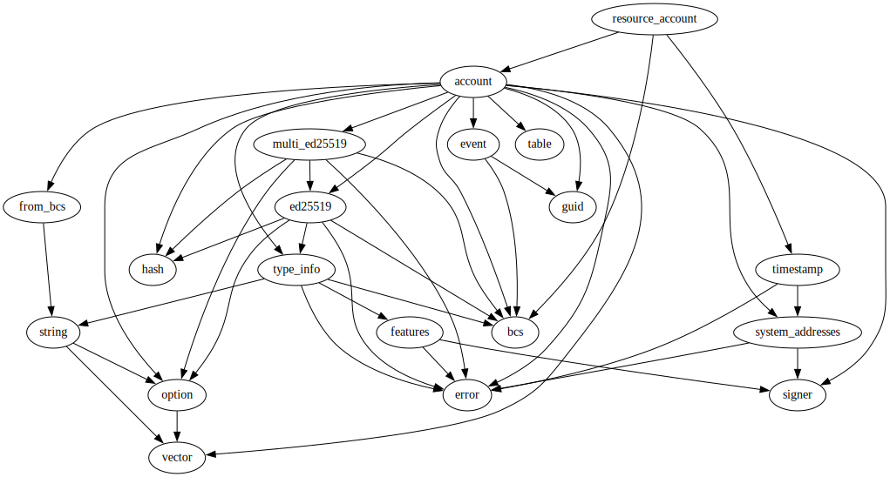
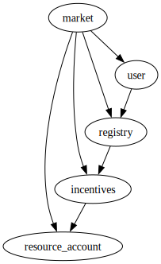

# Module `0xc0deb00c::resource_account`

Manages an Econia-owned resource account.

-  [Resource `SignerCapabilityStore`](#0xc0deb00c_resource_account_SignerCapabilityStore)
-  [Function `get_address`](#0xc0deb00c_resource_account_get_address)
    -  [Testing](#@Testing_0)
-  [Function `get_signer`](#0xc0deb00c_resource_account_get_signer)
    -  [Testing](#@Testing_1)
-  [Function `init_module`](#0xc0deb00c_resource_account_init_module)
    -  [Seed considerations](#@Seed_considerations_2)
    -  [Testing](#@Testing_3)

<pre><code><b>use</b> <a href="">0x1::account</a>;
<b>use</b> <a href="">0x1::bcs</a>;
<b>use</b> <a href="">0x1::timestamp</a>;
</code></pre>

##### Show all the modules that "resource_account" depends on directly or indirectly

##### Show all the modules that depend on "resource_account" directly or indirectly

## Resource `SignerCapabilityStore`

Stores a signing capability for the Econia resource account.

<pre><code><b>struct</b> <a href="resource_account.md#0xc0deb00c_resource_account_SignerCapabilityStore">SignerCapabilityStore</a> <b>has</b> key
</code></pre>

##### Fields

<dl>
<dt>
<code>signer_capability: <a href="_SignerCapability">account::SignerCapability</a></code>
</dt>
<dd>
 Signer capability for Econia resource account.
</dd>
</dl>

## Function `get_address`

Return resource account address.

### Testing

* <code>test_mixed()</code>

<pre><code><b>public</b>(<b>friend</b>) <b>fun</b> <a href="resource_account.md#0xc0deb00c_resource_account_get_address">get_address</a>(): <b>address</b>
</code></pre>

##### Implementation

<pre><code><b>public</b>(<b>friend</b>) <b>fun</b> <a href="resource_account.md#0xc0deb00c_resource_account_get_address">get_address</a>():
<b>address</b>
<b>acquires</b> <a href="resource_account.md#0xc0deb00c_resource_account_SignerCapabilityStore">SignerCapabilityStore</a> {
    // Immutably borrow <a href="">signer</a> capability.
    <b>let</b> signer_capability_ref =
        &<b>borrow_global</b>&lt;<a href="resource_account.md#0xc0deb00c_resource_account_SignerCapabilityStore">SignerCapabilityStore</a>&gt;(@econia).signer_capability;
    // Return its <b>address</b>.
    <a href="_get_signer_capability_address">account::get_signer_capability_address</a>(signer_capability_ref)
}
</code></pre>

## Function `get_signer`

Return resource account signer.

### Testing

* <code>test_mixed()</code>

<pre><code><b>public</b>(<b>friend</b>) <b>fun</b> <a href="resource_account.md#0xc0deb00c_resource_account_get_signer">get_signer</a>(): <a href="">signer</a>
</code></pre>

##### Implementation

<pre><code><b>public</b>(<b>friend</b>) <b>fun</b> <a href="resource_account.md#0xc0deb00c_resource_account_get_signer">get_signer</a>():
<a href="">signer</a>
<b>acquires</b> <a href="resource_account.md#0xc0deb00c_resource_account_SignerCapabilityStore">SignerCapabilityStore</a> {
    // Immutably borrow <a href="">signer</a> capability.
    <b>let</b> signer_capability_ref =
        &<b>borrow_global</b>&lt;<a href="resource_account.md#0xc0deb00c_resource_account_SignerCapabilityStore">SignerCapabilityStore</a>&gt;(@econia).signer_capability;
    // Return associated <a href="">signer</a>.
    <a href="_create_signer_with_capability">account::create_signer_with_capability</a>(signer_capability_ref)
}
</code></pre>

## Function `init_module`

Initialize the Econia resource account upon module publication.

### Seed considerations

Uses block timestamp as a seed for future-proofing the potential
creation of additional resource accounts via the Econia account:
the use of a seed that is not hard-coded mitigates the threat
of resource account creation blockage via mismanaged seeds,
assuming in this case that multiple resource accounts are not
created during the same block.

### Testing

* <code>test_mixed()</code>

<pre><code><b>fun</b> <a href="resource_account.md#0xc0deb00c_resource_account_init_module">init_module</a>(econia: &<a href="">signer</a>)
</code></pre>

##### Implementation

<pre><code><b>fun</b> <a href="resource_account.md#0xc0deb00c_resource_account_init_module">init_module</a>(
    econia: &<a href="">signer</a>
) {
    // Get resource <a href="">account</a> time seed.
    <b>let</b> time_seed = <a href="_to_bytes">bcs::to_bytes</a>(&<a href="_now_microseconds">timestamp::now_microseconds</a>());
    // Create resource <a href="">account</a>, storing <a href="">signer</a> capability.
    <b>let</b> (_, signer_capability) =
        <a href="_create_resource_account">account::create_resource_account</a>(econia, time_seed);
    // Store signing capability under Econia <a href="">account</a>.
    <b>move_to</b>(econia, <a href="resource_account.md#0xc0deb00c_resource_account_SignerCapabilityStore">SignerCapabilityStore</a>{signer_capability});
}
</code></pre>
