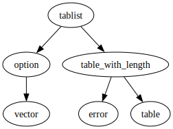
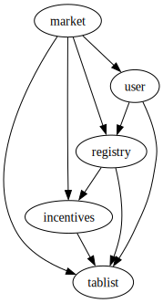

# Module `0xc0deb00c::tablist`

Tablist: a hybrid between a table and a doubly linked list.

Modeled off of what was previously <code>aptos_std::iterable_table.<b>move</b></code>,
which had been removed from <code>aptos_std</code> as of the time of this
writing.

Accepts key-value pairs having key type <code>K</code> and value type <code>V</code>.

See <code>test_iterate()</code> and <code>test_iterate_remove()</code> for iteration
syntax.

## Complete docgen index

The below index is automatically generated from source code:

-  [Complete docgen index](#@Complete_docgen_index_0)
-  [Struct `Node`](#0xc0deb00c_tablist_Node)
-  [Struct `Tablist`](#0xc0deb00c_tablist_Tablist)
-  [Constants](#@Constants_1)
-  [Function `add`](#0xc0deb00c_tablist_add)
    -  [Testing](#@Testing_2)
-  [Function `borrow`](#0xc0deb00c_tablist_borrow)
    -  [Testing](#@Testing_3)
-  [Function `borrow_iterable`](#0xc0deb00c_tablist_borrow_iterable)
    -  [Testing](#@Testing_4)
-  [Function `borrow_iterable_mut`](#0xc0deb00c_tablist_borrow_iterable_mut)
    -  [Testing](#@Testing_5)
-  [Function `borrow_mut`](#0xc0deb00c_tablist_borrow_mut)
    -  [Testing](#@Testing_6)
-  [Function `contains`](#0xc0deb00c_tablist_contains)
    -  [Testing](#@Testing_7)
-  [Function `destroy_empty`](#0xc0deb00c_tablist_destroy_empty)
    -  [Aborts](#@Aborts_8)
    -  [Testing](#@Testing_9)
-  [Function `get_head_key`](#0xc0deb00c_tablist_get_head_key)
    -  [Testing](#@Testing_10)
-  [Function `get_tail_key`](#0xc0deb00c_tablist_get_tail_key)
    -  [Testing](#@Testing_11)
-  [Function `length`](#0xc0deb00c_tablist_length)
    -  [Testing](#@Testing_12)
-  [Function `new`](#0xc0deb00c_tablist_new)
    -  [Testing](#@Testing_13)
-  [Function `is_empty`](#0xc0deb00c_tablist_is_empty)
    -  [Testing](#@Testing_14)
-  [Function `remove`](#0xc0deb00c_tablist_remove)
    -  [Testing](#@Testing_15)
-  [Function `remove_iterable`](#0xc0deb00c_tablist_remove_iterable)
    -  [Testing](#@Testing_16)
-  [Function `singleton`](#0xc0deb00c_tablist_singleton)
    -  [Testing](#@Testing_17)

<pre><code><b>use</b> <a href="">0x1::option</a>;
<b>use</b> <a href="">0x1::table_with_length</a>;
</code></pre>

##### Show all the modules that "tablist" depends on directly or indirectly

##### Show all the modules that depend on "tablist" directly or indirectly

## Struct `Node`

A tablist node, pointing to the previous and next nodes, if any.

<pre><code><b>struct</b> <a href="tablist.md#0xc0deb00c_tablist_Node">Node</a>&lt;K: <b>copy</b>, drop, store, V: store&gt; <b>has</b> store
</code></pre>

##### Fields

<dl>
<dt>
<code>value: V</code>
</dt>
<dd>
 Value from a key-value pair.
</dd>
<dt>
<code>previous: <a href="_Option">option::Option</a>&lt;K&gt;</code>
</dt>
<dd>
 Key of previous tablist node, if any.
</dd>
<dt>
<code>next: <a href="_Option">option::Option</a>&lt;K&gt;</code>
</dt>
<dd>
 Key of next tablist node, if any.
</dd>
</dl>

## Struct `Tablist`

A hybrid between a table and a doubly linked list.

<pre><code><b>struct</b> <a href="tablist.md#0xc0deb00c_tablist_Tablist">Tablist</a>&lt;K: <b>copy</b>, drop, store, V: store&gt; <b>has</b> store
</code></pre>

##### Fields

<dl>
<dt>
<code><a href="">table</a>: <a href="_TableWithLength">table_with_length::TableWithLength</a>&lt;K, <a href="tablist.md#0xc0deb00c_tablist_Node">tablist::Node</a>&lt;K, V&gt;&gt;</code>
</dt>
<dd>
 All nodes in the tablist.
</dd>
<dt>
<code>head: <a href="_Option">option::Option</a>&lt;K&gt;</code>
</dt>
<dd>
 Key of tablist head node, if any.
</dd>
<dt>
<code>tail: <a href="_Option">option::Option</a>&lt;K&gt;</code>
</dt>
<dd>
 Key of tablist tail node, if any.
</dd>
</dl>

## Constants

Attempting to destroy a tablist that is not empty.

<pre><code><b>const</b> <a href="tablist.md#0xc0deb00c_tablist_E_DESTROY_NOT_EMPTY">E_DESTROY_NOT_EMPTY</a>: u64 = 0;
</code></pre>

## Function `add`

Add <code>key</code>-<code>value</code> pair to given <code><a href="tablist.md#0xc0deb00c_tablist_Tablist">Tablist</a></code>, aborting if <code>key</code>
already present.

### Testing

* <code>test_mixed()</code>

<pre><code><b>public</b> <b>fun</b> <a href="tablist.md#0xc0deb00c_tablist_add">add</a>&lt;K: <b>copy</b>, drop, store, V: store&gt;(tablist_ref_mut: &<b>mut</b> <a href="tablist.md#0xc0deb00c_tablist_Tablist">tablist::Tablist</a>&lt;K, V&gt;, key: K, value: V)
</code></pre>

##### Implementation

<pre><code><b>public</b> <b>fun</b> <a href="tablist.md#0xc0deb00c_tablist_add">add</a>&lt;
    K: <b>copy</b> + drop + store,
    V: store
&gt;(
    tablist_ref_mut: &<b>mut</b> <a href="tablist.md#0xc0deb00c_tablist_Tablist">Tablist</a>&lt;K, V&gt;,
    key: K,
    value: V
) {
    <b>let</b> node = <a href="tablist.md#0xc0deb00c_tablist_Node">Node</a>{value, previous: tablist_ref_mut.tail,
        next: <a href="_none">option::none</a>()}; // Wrap value in a node.
    // Add node <b>to</b> the inner <a href="">table</a>.
    <a href="_add">table_with_length::add</a>(&<b>mut</b> tablist_ref_mut.<a href="">table</a>, key, node);
    // If adding the first node in the <a href="tablist.md#0xc0deb00c_tablist">tablist</a>:
    <b>if</b> (<a href="_is_none">option::is_none</a>(&tablist_ref_mut.head)) {
        // Mark key <b>as</b> the new head.
        tablist_ref_mut.head = <a href="_some">option::some</a>(key);
    } <b>else</b> { // If adding node that is not first node in <a href="tablist.md#0xc0deb00c_tablist">tablist</a>:
        // Get the <b>old</b> tail node key.
        <b>let</b> old_tail = <a href="_borrow">option::borrow</a>(&tablist_ref_mut.tail);
        // Update the <b>old</b> tail node <b>to</b> have the new key <b>as</b> next.
        <a href="_borrow_mut">table_with_length::borrow_mut</a>(
            &<b>mut</b> tablist_ref_mut.<a href="">table</a>, *old_tail).next =
                <a href="_some">option::some</a>(key);
    };
    // Update the <a href="tablist.md#0xc0deb00c_tablist">tablist</a> tail <b>to</b> the new key.
    tablist_ref_mut.tail = <a href="_some">option::some</a>(key);
}
</code></pre>

## Function `borrow`

Return immutable reference to the value that <code>key</code> maps to,
aborting if <code>key</code> is not in given <code><a href="tablist.md#0xc0deb00c_tablist_Tablist">Tablist</a></code>.

### Testing

* <code>test_mixed()</code>

<pre><code><b>public</b> <b>fun</b> <a href="tablist.md#0xc0deb00c_tablist_borrow">borrow</a>&lt;K: <b>copy</b>, drop, store, V: store&gt;(tablist_ref: &<a href="tablist.md#0xc0deb00c_tablist_Tablist">tablist::Tablist</a>&lt;K, V&gt;, key: K): &V
</code></pre>

##### Implementation

<pre><code><b>public</b> <b>fun</b> <a href="tablist.md#0xc0deb00c_tablist_borrow">borrow</a>&lt;
    K: <b>copy</b> + drop + store,
    V: store
&gt;(
    tablist_ref: &<a href="tablist.md#0xc0deb00c_tablist_Tablist">Tablist</a>&lt;K, V&gt;,
    key: K,
): &V {
    &<a href="_borrow">table_with_length::borrow</a>(&tablist_ref.<a href="">table</a>, key).value
}
</code></pre>

## Function `borrow_iterable`

Borrow the <code><a href="tablist.md#0xc0deb00c_tablist_Node">Node</a></code> in the given <code><a href="tablist.md#0xc0deb00c_tablist_Tablist">Tablist</a></code> having key, returning:

* Immutable reference to corresponding value.
* Key of previous <code><a href="tablist.md#0xc0deb00c_tablist_Node">Node</a></code> in the <code><a href="tablist.md#0xc0deb00c_tablist_Tablist">Tablist</a></code>, if any.
* Key of next <code><a href="tablist.md#0xc0deb00c_tablist_Node">Node</a></code> in the <code><a href="tablist.md#0xc0deb00c_tablist_Tablist">Tablist</a></code>, if any.

Aborts if there is no entry for <code>key</code>.

### Testing

* <code>test_iterate()</code>

<pre><code><b>public</b> <b>fun</b> <a href="tablist.md#0xc0deb00c_tablist_borrow_iterable">borrow_iterable</a>&lt;K: <b>copy</b>, drop, store, V: store&gt;(tablist_ref: &<a href="tablist.md#0xc0deb00c_tablist_Tablist">tablist::Tablist</a>&lt;K, V&gt;, key: K): (&V, <a href="_Option">option::Option</a>&lt;K&gt;, <a href="_Option">option::Option</a>&lt;K&gt;)
</code></pre>

##### Implementation

<pre><code><b>public</b> <b>fun</b> <a href="tablist.md#0xc0deb00c_tablist_borrow_iterable">borrow_iterable</a>&lt;
    K: <b>copy</b> + drop + store,
    V: store
&gt;(
    tablist_ref: &<a href="tablist.md#0xc0deb00c_tablist_Tablist">Tablist</a>&lt;K, V&gt;,
    key: K,
): (
    &V,
    Option&lt;K&gt;,
    Option&lt;K&gt;
) {
    <b>let</b> node_ref = // Borrow immutable reference <b>to</b> node having key.
        <a href="_borrow">table_with_length::borrow</a>(&tablist_ref.<a href="">table</a>, key);
    // Return corresponding fields.
    (&node_ref.value, node_ref.previous, node_ref.next)
}
</code></pre>

## Function `borrow_iterable_mut`

Mutably borrow the <code><a href="tablist.md#0xc0deb00c_tablist_Node">Node</a></code> in given <code><a href="tablist.md#0xc0deb00c_tablist_Tablist">Tablist</a></code> having <code>key</code>,
returning:

* Mutable reference to corresponding value.
* Key of previous <code><a href="tablist.md#0xc0deb00c_tablist_Node">Node</a></code> in the <code><a href="tablist.md#0xc0deb00c_tablist_Tablist">Tablist</a></code>, if any.
* Key of next <code><a href="tablist.md#0xc0deb00c_tablist_Node">Node</a></code> in the <code><a href="tablist.md#0xc0deb00c_tablist_Tablist">Tablist</a></code>, if any.

Aborts if there is no entry for <code>key</code>.

### Testing

* <code>test_iterate()</code>

<pre><code><b>public</b> <b>fun</b> <a href="tablist.md#0xc0deb00c_tablist_borrow_iterable_mut">borrow_iterable_mut</a>&lt;K: <b>copy</b>, drop, store, V: store&gt;(tablist_ref_mut: &<b>mut</b> <a href="tablist.md#0xc0deb00c_tablist_Tablist">tablist::Tablist</a>&lt;K, V&gt;, key: K): (&<b>mut</b> V, <a href="_Option">option::Option</a>&lt;K&gt;, <a href="_Option">option::Option</a>&lt;K&gt;)
</code></pre>

##### Implementation

<pre><code><b>public</b> <b>fun</b> <a href="tablist.md#0xc0deb00c_tablist_borrow_iterable_mut">borrow_iterable_mut</a>&lt;
    K: <b>copy</b> + drop + store,
    V: store
&gt;(
    tablist_ref_mut: &<b>mut</b> <a href="tablist.md#0xc0deb00c_tablist_Tablist">Tablist</a>&lt;K, V&gt;,
    key: K,
): (
    &<b>mut</b> V,
    Option&lt;K&gt;,
    Option&lt;K&gt;
) {
    // Borrow mutable reference <b>to</b> node having key.
    <b>let</b> node_ref_mut = <a href="_borrow_mut">table_with_length::borrow_mut</a>(
        &<b>mut</b> tablist_ref_mut.<a href="">table</a>, key);
    // Return corresponding fields.
    (&<b>mut</b> node_ref_mut.value, node_ref_mut.previous, node_ref_mut.next)
}
</code></pre>

## Function `borrow_mut`

Return mutable reference to the value that <code>key</code> maps to,
aborting if <code>key</code> is not in given <code><a href="tablist.md#0xc0deb00c_tablist_Tablist">Tablist</a></code>.

Aborts if there is no entry for <code>key</code>.

### Testing

* <code>test_mixed()</code>

<pre><code><b>public</b> <b>fun</b> <a href="tablist.md#0xc0deb00c_tablist_borrow_mut">borrow_mut</a>&lt;K: <b>copy</b>, drop, store, V: store&gt;(tablist_ref_mut: &<b>mut</b> <a href="tablist.md#0xc0deb00c_tablist_Tablist">tablist::Tablist</a>&lt;K, V&gt;, key: K): &<b>mut</b> V
</code></pre>

##### Implementation

<pre><code><b>public</b> <b>fun</b> <a href="tablist.md#0xc0deb00c_tablist_borrow_mut">borrow_mut</a>&lt;
    K: <b>copy</b> + drop + store,
    V: store
&gt;(
    tablist_ref_mut: &<b>mut</b> <a href="tablist.md#0xc0deb00c_tablist_Tablist">Tablist</a>&lt;K, V&gt;,
    key: K,
): &<b>mut</b> V {
    &<b>mut</b> <a href="_borrow_mut">table_with_length::borrow_mut</a>(
        &<b>mut</b> tablist_ref_mut.<a href="">table</a>, key).value
}
</code></pre>

## Function `contains`

Return <code><b>true</b></code> if given <code><a href="tablist.md#0xc0deb00c_tablist_Tablist">Tablist</a></code> contains <code>key</code>, else <code><b>false</b></code>.

### Testing

* <code>test_mixed()</code>

<pre><code><b>public</b> <b>fun</b> <a href="tablist.md#0xc0deb00c_tablist_contains">contains</a>&lt;K: <b>copy</b>, drop, store, V: store&gt;(tablist_ref: &<a href="tablist.md#0xc0deb00c_tablist_Tablist">tablist::Tablist</a>&lt;K, V&gt;, key: K): bool
</code></pre>

##### Implementation

<pre><code><b>public</b> <b>fun</b> <a href="tablist.md#0xc0deb00c_tablist_contains">contains</a>&lt;
    K: <b>copy</b> + drop + store,
    V: store
&gt;(
    tablist_ref: &<a href="tablist.md#0xc0deb00c_tablist_Tablist">Tablist</a>&lt;K, V&gt;,
    key: K,
): bool {
    <a href="_contains">table_with_length::contains</a>(&tablist_ref.<a href="">table</a>, key)
}
</code></pre>

## Function `destroy_empty`

Destroy an empty <code><a href="tablist.md#0xc0deb00c_tablist_Tablist">Tablist</a></code>, aborting if not empty.

### Aborts

* <code><a href="tablist.md#0xc0deb00c_tablist_E_DESTROY_NOT_EMPTY">E_DESTROY_NOT_EMPTY</a></code>: The tablist is not empty.

### Testing

* <code>test_destroy_empty_not_empty()</code>
* <code>test_mixed()</code>

<pre><code><b>public</b> <b>fun</b> <a href="tablist.md#0xc0deb00c_tablist_destroy_empty">destroy_empty</a>&lt;K: <b>copy</b>, drop, store, V: store&gt;(<a href="tablist.md#0xc0deb00c_tablist">tablist</a>: <a href="tablist.md#0xc0deb00c_tablist_Tablist">tablist::Tablist</a>&lt;K, V&gt;)
</code></pre>

##### Implementation

<pre><code><b>public</b> <b>fun</b> <a href="tablist.md#0xc0deb00c_tablist_destroy_empty">destroy_empty</a>&lt;
    K: <b>copy</b> + drop + store,
    V: store
&gt;(
    <a href="tablist.md#0xc0deb00c_tablist">tablist</a>: <a href="tablist.md#0xc0deb00c_tablist_Tablist">Tablist</a>&lt;K, V&gt;
) {
    // Assert <a href="tablist.md#0xc0deb00c_tablist">tablist</a> is empty before attempting <b>to</b> unpack.
    <b>assert</b>!(<a href="tablist.md#0xc0deb00c_tablist_is_empty">is_empty</a>(&<a href="tablist.md#0xc0deb00c_tablist">tablist</a>), <a href="tablist.md#0xc0deb00c_tablist_E_DESTROY_NOT_EMPTY">E_DESTROY_NOT_EMPTY</a>);
    // Unpack, destroying head and tail fields.
    <b>let</b> <a href="tablist.md#0xc0deb00c_tablist_Tablist">Tablist</a>{<a href="">table</a>, head: _, tail: _} = <a href="tablist.md#0xc0deb00c_tablist">tablist</a>;
    // Destroy empty inner <a href="">table</a>.
    <a href="_destroy_empty">table_with_length::destroy_empty</a>(<a href="">table</a>);
}
</code></pre>

## Function `get_head_key`

Return optional head key from given <code><a href="tablist.md#0xc0deb00c_tablist_Tablist">Tablist</a></code>.

### Testing

* <code>test_mixed()</code>

<pre><code><b>public</b> <b>fun</b> <a href="tablist.md#0xc0deb00c_tablist_get_head_key">get_head_key</a>&lt;K: <b>copy</b>, drop, store, V: store&gt;(tablist_ref: &<a href="tablist.md#0xc0deb00c_tablist_Tablist">tablist::Tablist</a>&lt;K, V&gt;): <a href="_Option">option::Option</a>&lt;K&gt;
</code></pre>

##### Implementation

<pre><code><b>public</b> <b>fun</b> <a href="tablist.md#0xc0deb00c_tablist_get_head_key">get_head_key</a>&lt;
    K: <b>copy</b> + drop + store,
    V: store
&gt;(
    tablist_ref: &<a href="tablist.md#0xc0deb00c_tablist_Tablist">Tablist</a>&lt;K, V&gt;
): Option&lt;K&gt; {
    tablist_ref.head
}
</code></pre>

## Function `get_tail_key`

Return optional tail key in given <code><a href="tablist.md#0xc0deb00c_tablist_Tablist">Tablist</a></code>.

### Testing

* <code>test_mixed()</code>

<pre><code><b>public</b> <b>fun</b> <a href="tablist.md#0xc0deb00c_tablist_get_tail_key">get_tail_key</a>&lt;K: <b>copy</b>, drop, store, V: store&gt;(tablist_ref: &<a href="tablist.md#0xc0deb00c_tablist_Tablist">tablist::Tablist</a>&lt;K, V&gt;): <a href="_Option">option::Option</a>&lt;K&gt;
</code></pre>

##### Implementation

<pre><code><b>public</b> <b>fun</b> <a href="tablist.md#0xc0deb00c_tablist_get_tail_key">get_tail_key</a>&lt;
    K: <b>copy</b> + drop + store,
    V: store
&gt;(
    tablist_ref: &<a href="tablist.md#0xc0deb00c_tablist_Tablist">Tablist</a>&lt;K, V&gt;
): Option&lt;K&gt; {
    tablist_ref.tail
}
</code></pre>

## Function `length`

Return number of elements in given <code><a href="tablist.md#0xc0deb00c_tablist_Tablist">Tablist</a></code>.

### Testing

* <code>test_mixed()</code>

<pre><code><b>public</b> <b>fun</b> <a href="tablist.md#0xc0deb00c_tablist_length">length</a>&lt;K: <b>copy</b>, drop, store, V: store&gt;(tablist_ref: &<a href="tablist.md#0xc0deb00c_tablist_Tablist">tablist::Tablist</a>&lt;K, V&gt;): u64
</code></pre>

##### Implementation

<pre><code><b>public</b> <b>fun</b> <a href="tablist.md#0xc0deb00c_tablist_length">length</a>&lt;
    K: <b>copy</b> + drop + store,
    V: store
&gt;(
    tablist_ref: &<a href="tablist.md#0xc0deb00c_tablist_Tablist">Tablist</a>&lt;K, V&gt;
): u64 {
    <a href="_length">table_with_length::length</a>(&tablist_ref.<a href="">table</a>)
}
</code></pre>

## Function `new`

Return an empty <code><a href="tablist.md#0xc0deb00c_tablist_Tablist">Tablist</a></code>.

### Testing

* <code>test_mixed()</code>

<pre><code><b>public</b> <b>fun</b> <a href="tablist.md#0xc0deb00c_tablist_new">new</a>&lt;K: <b>copy</b>, drop, store, V: store&gt;(): <a href="tablist.md#0xc0deb00c_tablist_Tablist">tablist::Tablist</a>&lt;K, V&gt;
</code></pre>

##### Implementation

<pre><code><b>public</b> <b>fun</b> <a href="tablist.md#0xc0deb00c_tablist_new">new</a>&lt;
    K: <b>copy</b> + drop + store,
    V: store
&gt;(): <a href="tablist.md#0xc0deb00c_tablist_Tablist">Tablist</a>&lt;K, V&gt; {
    <a href="tablist.md#0xc0deb00c_tablist_Tablist">Tablist</a>{
        <a href="">table</a>: <a href="_new">table_with_length::new</a>(),
        head: <a href="_none">option::none</a>(),
        tail: <a href="_none">option::none</a>()
    }
}
</code></pre>

## Function `is_empty`

Return <code><b>true</b></code> if given <code><a href="tablist.md#0xc0deb00c_tablist_Tablist">Tablist</a></code> is empty, else <code><b>false</b></code>.

### Testing

* <code>test_mixed()</code>

<pre><code><b>public</b> <b>fun</b> <a href="tablist.md#0xc0deb00c_tablist_is_empty">is_empty</a>&lt;K: <b>copy</b>, drop, store, V: store&gt;(tablist_ref: &<a href="tablist.md#0xc0deb00c_tablist_Tablist">tablist::Tablist</a>&lt;K, V&gt;): bool
</code></pre>

##### Implementation

<pre><code><b>public</b> <b>fun</b> <a href="tablist.md#0xc0deb00c_tablist_is_empty">is_empty</a>&lt;
    K: <b>copy</b> + drop + store,
    V: store
&gt;(
    tablist_ref: &<a href="tablist.md#0xc0deb00c_tablist_Tablist">Tablist</a>&lt;K, V&gt;
): bool {
    <a href="_empty">table_with_length::empty</a>(&tablist_ref.<a href="">table</a>)
}
</code></pre>

## Function `remove`

Remove <code>key</code> from given <code><a href="tablist.md#0xc0deb00c_tablist_Tablist">Tablist</a></code>, returning the value <code>key</code>
mapped to.

See wrapped function <code><a href="tablist.md#0xc0deb00c_tablist_remove_iterable">remove_iterable</a>()</code>.

Aborts if there is no entry for <code>key</code>.

### Testing

* <code>test_mixed()</code>

<pre><code><b>public</b> <b>fun</b> <a href="tablist.md#0xc0deb00c_tablist_remove">remove</a>&lt;K: <b>copy</b>, drop, store, V: store&gt;(tablist_ref_mut: &<b>mut</b> <a href="tablist.md#0xc0deb00c_tablist_Tablist">tablist::Tablist</a>&lt;K, V&gt;, key: K): V
</code></pre>

##### Implementation

<pre><code><b>public</b> <b>fun</b> <a href="tablist.md#0xc0deb00c_tablist_remove">remove</a>&lt;
    K: <b>copy</b> + drop + store,
    V: store
&gt;(
    tablist_ref_mut: &<b>mut</b> <a href="tablist.md#0xc0deb00c_tablist_Tablist">Tablist</a>&lt;K, V&gt;,
    key: K
): V {
    // Get value via iterable removal.
    <b>let</b> (value, _, _) = <a href="tablist.md#0xc0deb00c_tablist_remove_iterable">remove_iterable</a>(tablist_ref_mut, key);
    value // Return value.
}
</code></pre>

## Function `remove_iterable`

Remove <code>key</code> from given <code><a href="tablist.md#0xc0deb00c_tablist_Tablist">Tablist</a></code>, returning the value <code>key</code>
mapped to, the previous key it mapped to (if any), and the
next key it mapped to (if any).

Aborts if there is no entry for <code>key</code>.

### Testing

* <code>test_iterate_remove()</code>

<pre><code><b>public</b> <b>fun</b> <a href="tablist.md#0xc0deb00c_tablist_remove_iterable">remove_iterable</a>&lt;K: <b>copy</b>, drop, store, V: store&gt;(tablist_ref_mut: &<b>mut</b> <a href="tablist.md#0xc0deb00c_tablist_Tablist">tablist::Tablist</a>&lt;K, V&gt;, key: K): (V, <a href="_Option">option::Option</a>&lt;K&gt;, <a href="_Option">option::Option</a>&lt;K&gt;)
</code></pre>

##### Implementation

<pre><code><b>public</b> <b>fun</b> <a href="tablist.md#0xc0deb00c_tablist_remove_iterable">remove_iterable</a>&lt;
    K: <b>copy</b> + drop + store,
    V: store
&gt;(
    tablist_ref_mut: &<b>mut</b> <a href="tablist.md#0xc0deb00c_tablist_Tablist">Tablist</a>&lt;K, V&gt;,
    key: K
): (
    V,
    Option&lt;K&gt;,
    Option&lt;K&gt;
) {
    // Unpack from inner <a href="">table</a> the node <b>with</b> the given key.
    <b>let</b> <a href="tablist.md#0xc0deb00c_tablist_Node">Node</a>{value, previous, next} = <a href="_remove">table_with_length::remove</a>(
        &<b>mut</b> tablist_ref_mut.<a href="">table</a>, key);
    // If the node was the head of the <a href="tablist.md#0xc0deb00c_tablist">tablist</a>:
    <b>if</b> (<a href="_is_none">option::is_none</a>(&previous)) { // If no previous node:
        // Set <b>as</b> the <a href="tablist.md#0xc0deb00c_tablist">tablist</a> head the node's next field.
        tablist_ref_mut.head = next;
    } <b>else</b> { // If node was not head of the <a href="tablist.md#0xc0deb00c_tablist">tablist</a>:
        // Update the node having the previous key <b>to</b> have <b>as</b> its
        // next field the next field of the removed node.
        <a href="_borrow_mut">table_with_length::borrow_mut</a>(&<b>mut</b> tablist_ref_mut.<a href="">table</a>,
            *<a href="_borrow">option::borrow</a>(&previous)).next = next;
    };
    // If the node was the tail of the <a href="tablist.md#0xc0deb00c_tablist">tablist</a>:
    <b>if</b> (<a href="_is_none">option::is_none</a>(&next)) { // If no next node:
        // Set <b>as</b> the <a href="tablist.md#0xc0deb00c_tablist">tablist</a> tail the node's previous field.
        tablist_ref_mut.tail = previous;
    } <b>else</b> { // If node was not tail of <a href="tablist.md#0xc0deb00c_tablist">tablist</a>:
        // Update the node having the next key <b>to</b> have <b>as</b> its
        // previous field the previous field of the removed node.
        <a href="_borrow_mut">table_with_length::borrow_mut</a>(&<b>mut</b> tablist_ref_mut.<a href="">table</a>,
            *<a href="_borrow">option::borrow</a>(&next)).previous = previous;
    };
    // Return node value, previous field, and next field.
    (value, previous, next)
}
</code></pre>

## Function `singleton`

Return a new <code><a href="tablist.md#0xc0deb00c_tablist_Tablist">Tablist</a></code> containing <code>key</code>-<code>value</code> pair.

### Testing

* <code>test_mixed()</code>

<pre><code><b>public</b> <b>fun</b> <a href="tablist.md#0xc0deb00c_tablist_singleton">singleton</a>&lt;K: <b>copy</b>, drop, store, V: store&gt;(key: K, value: V): <a href="tablist.md#0xc0deb00c_tablist_Tablist">tablist::Tablist</a>&lt;K, V&gt;
</code></pre>

##### Implementation

<pre><code><b>public</b> <b>fun</b> <a href="tablist.md#0xc0deb00c_tablist_singleton">singleton</a>&lt;
    K: <b>copy</b> + drop + store,
    V: store
&gt;(
    key: K,
    value: V
): <a href="tablist.md#0xc0deb00c_tablist_Tablist">Tablist</a>&lt;K, V&gt; {
    <b>let</b> <a href="tablist.md#0xc0deb00c_tablist">tablist</a> = <a href="tablist.md#0xc0deb00c_tablist_new">new</a>&lt;K, V&gt;(); // Declare empty <a href="tablist.md#0xc0deb00c_tablist">tablist</a>
    <a href="tablist.md#0xc0deb00c_tablist_add">add</a>(&<b>mut</b> <a href="tablist.md#0xc0deb00c_tablist">tablist</a>, key, value); // Insert key-value pair.
    <a href="tablist.md#0xc0deb00c_tablist">tablist</a> // Return <a href="tablist.md#0xc0deb00c_tablist">tablist</a>.
}
</code></pre>
