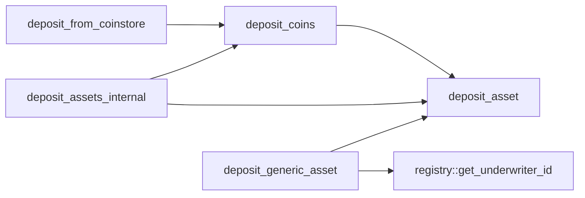
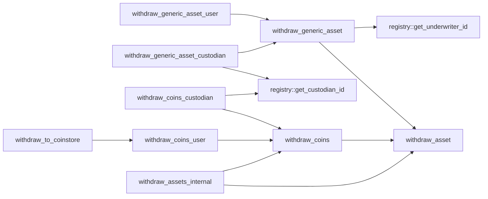
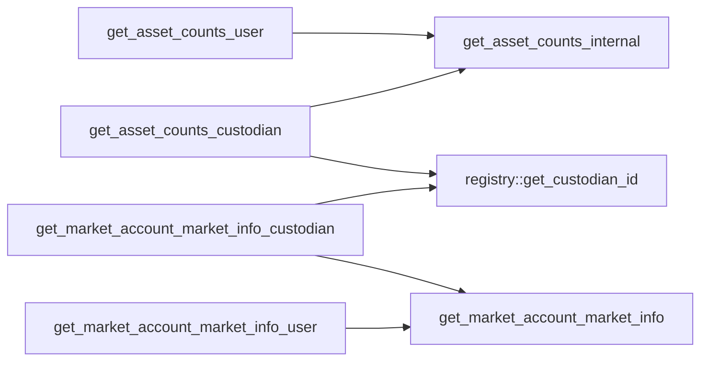
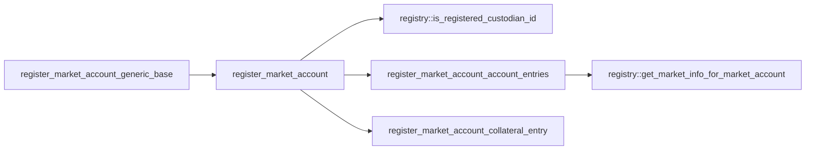
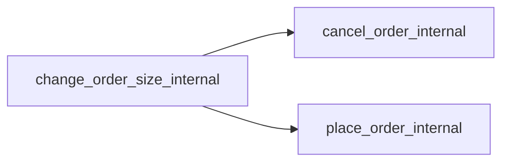
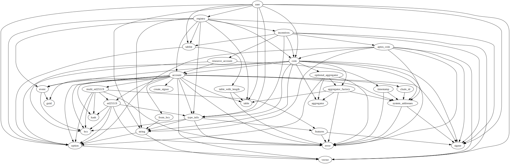
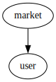

# Module `0xc0deb00c::user`

User-side asset, collateral, and order management.

Contains data structures and functionality for tracking a user's
assets and open orders. Upon market account registration, users can
either preside over their own account, or delegate custody to a
custodian who manage their orders and withdrawals. For each market,
a user can open multiple market accounts, each with a unique
custodian.

## General overview sections

[Architecture](#architecture)

* [Market account IDs](#market-account-IDs)
* [Market accounts](#market-accounts)
* [Orders and access keys](#orders-and-access-keys)
* [Market order IDs](#market-order-IDs)

[Function index](#function-index)

* [Public functions](#public-functions)
* [Public entry functions](#public-entry-functions)
* [Public friend functions](#public-friend-functions)
* [Dependency charts](#dependency-charts)

[Complete DocGen index](#complete-docgen-index)

## Architecture

### Market account IDs

Markets, defined in the global registry, are assigned a 1-indexed
<code>u64</code> market ID, as are custodians. The concatenated result of a
market ID and a custodian ID is known as a market account ID, which
is used as a key in assorted user-side lookup operations: the 64
least-significant bits in a market account ID are the custodian ID
for the given market account (<code><a href="user.md#0xc0deb00c_user_NIL">NIL</a></code> if no delegated custodian),
while the 64 most-significant bits are the market ID. See
<code><a href="user.md#0xc0deb00c_user_get_custodian_id">get_custodian_id</a>()</code>, <code><a href="user.md#0xc0deb00c_user_get_market_account_id">get_market_account_id</a>()</code>, and
<code><a href="user.md#0xc0deb00c_user_get_market_id">get_market_id</a>()</code> for implementation details.

### Market accounts

When a user opens a market account, a <code><a href="user.md#0xc0deb00c_user_MarketAccount">MarketAccount</a></code> entry is
added to their <code><a href="user.md#0xc0deb00c_user_MarketAccounts">MarketAccounts</a></code>, and a coin entry is added to their
<code><a href="user.md#0xc0deb00c_user_Collateral">Collateral</a></code> for the given market's quote coin type. If the market's
base asset is a coin, a <code><a href="user.md#0xc0deb00c_user_Collateral">Collateral</a></code> entry is similarly created for
the base coin type.

### Orders and access keys

When users place an order on the order book, an <code><a href="user.md#0xc0deb00c_user_Order">Order</a></code> is added to
their corresponding <code><a href="user.md#0xc0deb00c_user_MarketAccount">MarketAccount</a></code>. If they then cancel the order,
the corresponding <code><a href="user.md#0xc0deb00c_user_Order">Order</a></code> is not deallocated, but rather, marked
"inactive" and pushed onto a stack of inactive orders for the
corresponding side (<code><a href="user.md#0xc0deb00c_user_MarketAccount">MarketAccount</a>.asks_stack_top</code> or
<code><a href="user.md#0xc0deb00c_user_MarketAccount">MarketAccount</a>.bids_stack_top</code>). Then, when a user places another
order, rather than allocating a new <code><a href="user.md#0xc0deb00c_user_Order">Order</a></code>, the inactive order at
the top of the stack is popped off the stack and marked active.

This approach is motivated by global storage gas costs: as of the
time of this writing, per-item creations cost approximately 16.7
times as much as per-item writes, and there is no incentive to
deallocate from memory. Hence the inactive stack paradigm allows
for orders to be recycled in a way that reduces overall storage
costs. In practice, however, this means that each <code><a href="user.md#0xc0deb00c_user_Order">Order</a></code> is
assigned a static "access key" that persists throughout subsequent
active order states: if a user places an order, cancels the order,
then places another order, the <code><a href="user.md#0xc0deb00c_user_Order">Order</a></code> will have the same access key
in each active instance. In other words, access keys are the lookup
ID in the relevant <code><a href="user.md#0xc0deb00c_user_Order">Order</a></code> data structure for the given side
(<code><a href="user.md#0xc0deb00c_user_MarketAccount">MarketAccount</a>.asks</code> or <code><a href="user.md#0xc0deb00c_user_MarketAccount">MarketAccount</a>.bids</code>), and are not
necessarily unique for orders across time.

### Market order IDs

Market order IDs, however, are unique across time for a given market
ID, and are tracked in a users' <code><a href="user.md#0xc0deb00c_user_Order">Order</a>.market_order_id</code>. A market
order ID is a unique identifier for an order on a given order book.

## Function index

### Public functions

Constant getters:

* <code><a href="user.md#0xc0deb00c_user_get_ASK">get_ASK</a>()</code>
* <code><a href="user.md#0xc0deb00c_user_get_BID">get_BID</a>()</code>
* <code><a href="user.md#0xc0deb00c_user_get_NO_CUSTODIAN">get_NO_CUSTODIAN</a>()</code>

Asset transfer:

* <code><a href="user.md#0xc0deb00c_user_deposit_coins">deposit_coins</a>()</code>
* <code><a href="user.md#0xc0deb00c_user_deposit_generic_asset">deposit_generic_asset</a>()</code>
* <code><a href="user.md#0xc0deb00c_user_withdraw_coins_custodian">withdraw_coins_custodian</a>()</code>
* <code><a href="user.md#0xc0deb00c_user_withdraw_coins_user">withdraw_coins_user</a>()</code>
* <code><a href="user.md#0xc0deb00c_user_withdraw_generic_asset_custodian">withdraw_generic_asset_custodian</a>()</code>
* <code><a href="user.md#0xc0deb00c_user_withdraw_generic_asset_user">withdraw_generic_asset_user</a>()</code>

Market account lookup:

* <code><a href="user.md#0xc0deb00c_user_get_all_market_account_ids_for_market_id">get_all_market_account_ids_for_market_id</a>()</code>
* <code><a href="user.md#0xc0deb00c_user_get_all_market_account_ids_for_user">get_all_market_account_ids_for_user</a>()</code>
* <code><a href="user.md#0xc0deb00c_user_get_asset_counts_custodian">get_asset_counts_custodian</a>()</code>
* <code><a href="user.md#0xc0deb00c_user_get_asset_counts_user">get_asset_counts_user</a>()</code>
* <code><a href="user.md#0xc0deb00c_user_get_market_account_market_info_custodian">get_market_account_market_info_custodian</a>()</code>
* <code><a href="user.md#0xc0deb00c_user_get_market_account_market_info_user">get_market_account_market_info_user</a>()</code>
* <code><a href="user.md#0xc0deb00c_user_has_market_account_by_market_account_id">has_market_account_by_market_account_id</a>()</code>
* <code><a href="user.md#0xc0deb00c_user_has_market_account_by_market_id">has_market_account_by_market_id</a>()</code>

Market account ID lookup:

* <code><a href="user.md#0xc0deb00c_user_get_custodian_id">get_custodian_id</a>()</code>
* <code><a href="user.md#0xc0deb00c_user_get_market_account_id">get_market_account_id</a>()</code>
* <code><a href="user.md#0xc0deb00c_user_get_market_id">get_market_id</a>()</code>

### Public entry functions

Asset transfer:

* <code><a href="user.md#0xc0deb00c_user_deposit_from_coinstore">deposit_from_coinstore</a>()</code>
* <code><a href="user.md#0xc0deb00c_user_withdraw_to_coinstore">withdraw_to_coinstore</a>()</code>

Account registration:

* <code><a href="user.md#0xc0deb00c_user_register_market_account">register_market_account</a>()</code>
* <code><a href="user.md#0xc0deb00c_user_register_market_account_generic_base">register_market_account_generic_base</a>()</code>

### Public friend functions

Order management:

* <code><a href="user.md#0xc0deb00c_user_cancel_order_internal">cancel_order_internal</a>()</code>
* <code><a href="user.md#0xc0deb00c_user_change_order_size_internal">change_order_size_internal</a>()</code>
* <code><a href="user.md#0xc0deb00c_user_fill_order_internal">fill_order_internal</a>()</code>
* <code><a href="user.md#0xc0deb00c_user_place_order_internal">place_order_internal</a>()</code>

Asset management:

* <code><a href="user.md#0xc0deb00c_user_deposit_assets_internal">deposit_assets_internal</a>()</code>
* <code><a href="user.md#0xc0deb00c_user_get_asset_counts_internal">get_asset_counts_internal</a>()</code>
* <code><a href="user.md#0xc0deb00c_user_withdraw_assets_internal">withdraw_assets_internal</a>()</code>

Order identifiers:

* <code><a href="user.md#0xc0deb00c_user_get_next_order_access_key_internal">get_next_order_access_key_internal</a>()</code>
* <code><a href="user.md#0xc0deb00c_user_get_active_market_order_ids_internal">get_active_market_order_ids_internal</a>()</code>

### Dependency charts

The below dependency charts use <code>mermaid.js</code> syntax, which can be
automatically rendered into a diagram (depending on the browser)
when viewing the documentation file generated from source code. If
a browser renders the diagrams with coloring that makes it difficult
to read, try a different browser.

Deposits:

Withdrawals:

Market account lookup:

Market account registration:

Internal order management:

## Complete DocGen index

The below index is automatically generated from source code:

-  [General overview sections](#@General_overview_sections_0)
-  [Architecture](#@Architecture_1)
    -  [Market account IDs](#@Market_account_IDs_2)
    -  [Market accounts](#@Market_accounts_3)
    -  [Orders and access keys](#@Orders_and_access_keys_4)
    -  [Market order IDs](#@Market_order_IDs_5)
-  [Function index](#@Function_index_6)
    -  [Public functions](#@Public_functions_7)
    -  [Public entry functions](#@Public_entry_functions_8)
    -  [Public friend functions](#@Public_friend_functions_9)
    -  [Dependency charts](#@Dependency_charts_10)
-  [Complete DocGen index](#@Complete_DocGen_index_11)
-  [Resource `Collateral`](#0xc0deb00c_user_Collateral)
-  [Struct `MarketAccount`](#0xc0deb00c_user_MarketAccount)
-  [Resource `MarketAccounts`](#0xc0deb00c_user_MarketAccounts)
-  [Struct `Order`](#0xc0deb00c_user_Order)
-  [Constants](#@Constants_12)
-  [Function `deposit_coins`](#0xc0deb00c_user_deposit_coins)
    -  [Aborts](#@Aborts_13)
    -  [Testing](#@Testing_14)
-  [Function `deposit_generic_asset`](#0xc0deb00c_user_deposit_generic_asset)
    -  [Testing](#@Testing_15)
-  [Function `get_all_market_account_ids_for_market_id`](#0xc0deb00c_user_get_all_market_account_ids_for_market_id)
    -  [Parameters](#@Parameters_16)
    -  [Returns](#@Returns_17)
    -  [Gas considerations](#@Gas_considerations_18)
    -  [Testing](#@Testing_19)
-  [Function `get_all_market_account_ids_for_user`](#0xc0deb00c_user_get_all_market_account_ids_for_user)
    -  [Parameters](#@Parameters_20)
    -  [Returns](#@Returns_21)
    -  [Gas considerations](#@Gas_considerations_22)
    -  [Testing](#@Testing_23)
-  [Function `get_ASK`](#0xc0deb00c_user_get_ASK)
    -  [Testing](#@Testing_24)
-  [Function `get_asset_counts_custodian`](#0xc0deb00c_user_get_asset_counts_custodian)
    -  [Testing](#@Testing_25)
-  [Function `get_asset_counts_user`](#0xc0deb00c_user_get_asset_counts_user)
    -  [Testing](#@Testing_26)
-  [Function `get_BID`](#0xc0deb00c_user_get_BID)
    -  [Testing](#@Testing_27)
-  [Function `get_custodian_id`](#0xc0deb00c_user_get_custodian_id)
    -  [Testing](#@Testing_28)
-  [Function `get_market_account_id`](#0xc0deb00c_user_get_market_account_id)
    -  [Testing](#@Testing_29)
-  [Function `get_market_account_market_info_custodian`](#0xc0deb00c_user_get_market_account_market_info_custodian)
    -  [Testing](#@Testing_30)
-  [Function `get_market_account_market_info_user`](#0xc0deb00c_user_get_market_account_market_info_user)
    -  [Testing](#@Testing_31)
-  [Function `get_market_id`](#0xc0deb00c_user_get_market_id)
    -  [Testing](#@Testing_32)
-  [Function `get_NO_CUSTODIAN`](#0xc0deb00c_user_get_NO_CUSTODIAN)
    -  [Testing](#@Testing_33)
-  [Function `has_market_account_by_market_account_id`](#0xc0deb00c_user_has_market_account_by_market_account_id)
    -  [Testing](#@Testing_34)
-  [Function `has_market_account_by_market_id`](#0xc0deb00c_user_has_market_account_by_market_id)
    -  [Testing](#@Testing_35)
-  [Function `withdraw_coins_custodian`](#0xc0deb00c_user_withdraw_coins_custodian)
    -  [Testing](#@Testing_36)
-  [Function `withdraw_coins_user`](#0xc0deb00c_user_withdraw_coins_user)
    -  [Testing](#@Testing_37)
-  [Function `withdraw_generic_asset_custodian`](#0xc0deb00c_user_withdraw_generic_asset_custodian)
    -  [Testing](#@Testing_38)
-  [Function `withdraw_generic_asset_user`](#0xc0deb00c_user_withdraw_generic_asset_user)
    -  [Testing](#@Testing_39)
-  [Function `deposit_from_coinstore`](#0xc0deb00c_user_deposit_from_coinstore)
    -  [Testing](#@Testing_40)
-  [Function `register_market_account`](#0xc0deb00c_user_register_market_account)
    -  [Type parameters](#@Type_parameters_41)
    -  [Parameters](#@Parameters_42)
    -  [Aborts](#@Aborts_43)
    -  [Testing](#@Testing_44)
-  [Function `register_market_account_generic_base`](#0xc0deb00c_user_register_market_account_generic_base)
    -  [Testing](#@Testing_45)
-  [Function `withdraw_to_coinstore`](#0xc0deb00c_user_withdraw_to_coinstore)
    -  [Testing](#@Testing_46)
-  [Function `cancel_order_internal`](#0xc0deb00c_user_cancel_order_internal)
    -  [Parameters](#@Parameters_47)
    -  [Returns](#@Returns_48)
    -  [Terminology](#@Terminology_49)
    -  [Aborts](#@Aborts_50)
    -  [Assumptions](#@Assumptions_51)
    -  [Expected value testing](#@Expected_value_testing_52)
    -  [Failure testing](#@Failure_testing_53)
-  [Function `change_order_size_internal`](#0xc0deb00c_user_change_order_size_internal)
    -  [Parameters](#@Parameters_54)
    -  [Aborts](#@Aborts_55)
    -  [Assumptions](#@Assumptions_56)
    -  [Testing](#@Testing_57)
-  [Function `deposit_assets_internal`](#0xc0deb00c_user_deposit_assets_internal)
    -  [Type parameters](#@Type_parameters_58)
    -  [Parameters](#@Parameters_59)
    -  [Testing](#@Testing_60)
-  [Function `fill_order_internal`](#0xc0deb00c_user_fill_order_internal)
    -  [Type parameters](#@Type_parameters_61)
    -  [Parameters](#@Parameters_62)
    -  [Returns](#@Returns_63)
    -  [Aborts](#@Aborts_64)
    -  [Assumptions](#@Assumptions_65)
    -  [Testing](#@Testing_66)
-  [Function `get_asset_counts_internal`](#0xc0deb00c_user_get_asset_counts_internal)
    -  [Parameters](#@Parameters_67)
    -  [Returns](#@Returns_68)
    -  [Aborts](#@Aborts_69)
    -  [Testing](#@Testing_70)
-  [Function `get_active_market_order_ids_internal`](#0xc0deb00c_user_get_active_market_order_ids_internal)
    -  [Parameters](#@Parameters_71)
    -  [Returns](#@Returns_72)
    -  [Aborts](#@Aborts_73)
    -  [Testing](#@Testing_74)
-  [Function `get_next_order_access_key_internal`](#0xc0deb00c_user_get_next_order_access_key_internal)
    -  [Parameters](#@Parameters_75)
    -  [Returns](#@Returns_76)
    -  [Aborts](#@Aborts_77)
    -  [Testing](#@Testing_78)
-  [Function `place_order_internal`](#0xc0deb00c_user_place_order_internal)
    -  [Parameters](#@Parameters_79)
    -  [Terminology](#@Terminology_80)
    -  [Assumptions](#@Assumptions_81)
    -  [Aborts](#@Aborts_82)
    -  [Expected value testing](#@Expected_value_testing_83)
    -  [Failure testing](#@Failure_testing_84)
-  [Function `withdraw_assets_internal`](#0xc0deb00c_user_withdraw_assets_internal)
    -  [Type parameters](#@Type_parameters_85)
    -  [Parameters](#@Parameters_86)
    -  [Returns](#@Returns_87)
    -  [Testing](#@Testing_88)
-  [Function `deposit_asset`](#0xc0deb00c_user_deposit_asset)
    -  [Type parameters](#@Type_parameters_89)
    -  [Parameters](#@Parameters_90)
    -  [Aborts](#@Aborts_91)
    -  [Assumptions](#@Assumptions_92)
    -  [Testing](#@Testing_93)
-  [Function `get_market_account_market_info`](#0xc0deb00c_user_get_market_account_market_info)
    -  [Parameters](#@Parameters_94)
    -  [Returns](#@Returns_95)
    -  [Aborts](#@Aborts_96)
    -  [Testing](#@Testing_97)
-  [Function `register_market_account_account_entries`](#0xc0deb00c_user_register_market_account_account_entries)
    -  [Type parameters](#@Type_parameters_98)
    -  [Parameters](#@Parameters_99)
    -  [Aborts](#@Aborts_100)
    -  [Testing](#@Testing_101)
-  [Function `register_market_account_collateral_entry`](#0xc0deb00c_user_register_market_account_collateral_entry)
    -  [Type parameters](#@Type_parameters_102)
    -  [Parameters](#@Parameters_103)
    -  [Testing](#@Testing_104)
-  [Function `withdraw_asset`](#0xc0deb00c_user_withdraw_asset)
    -  [Type parameters](#@Type_parameters_105)
    -  [Parameters](#@Parameters_106)
    -  [Returns](#@Returns_107)
    -  [Aborts](#@Aborts_108)
    -  [Testing](#@Testing_109)
-  [Function `withdraw_coins`](#0xc0deb00c_user_withdraw_coins)
    -  [Testing](#@Testing_110)
-  [Function `withdraw_generic_asset`](#0xc0deb00c_user_withdraw_generic_asset)
    -  [Testing](#@Testing_111)

<pre><code><b>use</b> <a href="">0x1::coin</a>;
<b>use</b> <a href="">0x1::option</a>;
<b>use</b> <a href="">0x1::signer</a>;
<b>use</b> <a href="">0x1::string</a>;
<b>use</b> <a href="">0x1::table</a>;
<b>use</b> <a href="">0x1::type_info</a>;
<b>use</b> <a href="">0x1::vector</a>;
<b>use</b> <a href="registry.md#0xc0deb00c_registry">0xc0deb00c::registry</a>;
<b>use</b> <a href="tablist.md#0xc0deb00c_tablist">0xc0deb00c::tablist</a>;
</code></pre>

##### Show all the modules that "user" depends on directly or indirectly

##### Show all the modules that depend on "user" directly or indirectly

## Resource `Collateral`

All of a user's collateral across all market accounts.

<pre><code><b>struct</b> <a href="user.md#0xc0deb00c_user_Collateral">Collateral</a>&lt;CoinType&gt; <b>has</b> key
</code></pre>

##### Fields

<dl>
<dt>
<code>map: <a href="tablist.md#0xc0deb00c_tablist_Tablist">tablist::Tablist</a>&lt;u128, <a href="_Coin">coin::Coin</a>&lt;CoinType&gt;&gt;</code>
</dt>
<dd>
 Map from market account ID to collateral for market account.
 Separated into different table entries to reduce transaction
 collisions across markets. Enables off-chain iterated
 indexing by market account ID.
</dd>
</dl>

## Struct `MarketAccount`

Represents a user's open orders and asset counts for a given
market account ID. Contains <code><a href="registry.md#0xc0deb00c_registry_MarketInfo">registry::MarketInfo</a></code> field
duplicates to reduce global storage item queries against the
registry.

<pre><code><b>struct</b> <a href="user.md#0xc0deb00c_user_MarketAccount">MarketAccount</a> <b>has</b> store
</code></pre>

##### Fields

<dl>
<dt>
<code>base_type: <a href="_TypeInfo">type_info::TypeInfo</a></code>
</dt>
<dd>
 <code><a href="registry.md#0xc0deb00c_registry_MarketInfo">registry::MarketInfo</a>.base_type</code>.
</dd>
<dt>
<code>base_name_generic: <a href="_String">string::String</a></code>
</dt>
<dd>
 <code><a href="registry.md#0xc0deb00c_registry_MarketInfo">registry::MarketInfo</a>.base_name_generic</code>.
</dd>
<dt>
<code>quote_type: <a href="_TypeInfo">type_info::TypeInfo</a></code>
</dt>
<dd>
 <code><a href="registry.md#0xc0deb00c_registry_MarketInfo">registry::MarketInfo</a>.quote_type</code>.
</dd>
<dt>
<code>lot_size: u64</code>
</dt>
<dd>
 <code><a href="registry.md#0xc0deb00c_registry_MarketInfo">registry::MarketInfo</a>.lot_size</code>.
</dd>
<dt>
<code>tick_size: u64</code>
</dt>
<dd>
 <code><a href="registry.md#0xc0deb00c_registry_MarketInfo">registry::MarketInfo</a>.tick_size</code>.
</dd>
<dt>
<code>min_size: u64</code>
</dt>
<dd>
 <code><a href="registry.md#0xc0deb00c_registry_MarketInfo">registry::MarketInfo</a>.min_size</code>.
</dd>
<dt>
<code>underwriter_id: u64</code>
</dt>
<dd>
 <code><a href="registry.md#0xc0deb00c_registry_MarketInfo">registry::MarketInfo</a>.underwriter_id</code>.
</dd>
<dt>
<code>asks: <a href="tablist.md#0xc0deb00c_tablist_Tablist">tablist::Tablist</a>&lt;u64, <a href="user.md#0xc0deb00c_user_Order">user::Order</a>&gt;</code>
</dt>
<dd>
 Map from order access key to open ask order.
</dd>
<dt>
<code>bids: <a href="tablist.md#0xc0deb00c_tablist_Tablist">tablist::Tablist</a>&lt;u64, <a href="user.md#0xc0deb00c_user_Order">user::Order</a>&gt;</code>
</dt>
<dd>
 Map from order access key to open bid order.
</dd>
<dt>
<code>asks_stack_top: u64</code>
</dt>
<dd>
 Access key of ask order at top of inactive stack, if any.
</dd>
<dt>
<code>bids_stack_top: u64</code>
</dt>
<dd>
 Access key of bid order at top of inactive stack, if any.
</dd>
<dt>
<code>base_total: u64</code>
</dt>
<dd>
 Total base asset units held as collateral.
</dd>
<dt>
<code>base_available: u64</code>
</dt>
<dd>
 Base asset units available to withdraw.
</dd>
<dt>
<code>base_ceiling: u64</code>
</dt>
<dd>
 Amount <code>base_total</code> will increase to if all open bids fill.
</dd>
<dt>
<code>quote_total: u64</code>
</dt>
<dd>
 Total quote asset units held as collateral.
</dd>
<dt>
<code>quote_available: u64</code>
</dt>
<dd>
 Quote asset units available to withdraw.
</dd>
<dt>
<code>quote_ceiling: u64</code>
</dt>
<dd>
 Amount <code>quote_total</code> will increase to if all open asks fill.
</dd>
</dl>

## Resource `MarketAccounts`

All of a user's market accounts.

<pre><code><b>struct</b> <a href="user.md#0xc0deb00c_user_MarketAccounts">MarketAccounts</a> <b>has</b> key
</code></pre>

##### Fields

<dl>
<dt>
<code>map: <a href="_Table">table::Table</a>&lt;u128, <a href="user.md#0xc0deb00c_user_MarketAccount">user::MarketAccount</a>&gt;</code>
</dt>
<dd>
 Map from market account ID to <code><a href="user.md#0xc0deb00c_user_MarketAccount">MarketAccount</a></code>.
</dd>
<dt>
<code>custodians: <a href="tablist.md#0xc0deb00c_tablist_Tablist">tablist::Tablist</a>&lt;u64, <a href="">vector</a>&lt;u64&gt;&gt;</code>
</dt>
<dd>
 Map from market ID to vector of custodian IDs for which
 a market account has been registered on the given market.
 Enables off-chain iterated indexing by market account ID and
 assorted on-chain queries.
</dd>
</dl>

## Struct `Order`

An open order, either ask or bid.

<pre><code><b>struct</b> <a href="user.md#0xc0deb00c_user_Order">Order</a> <b>has</b> store
</code></pre>

##### Fields

<dl>
<dt>
<code>market_order_id: u128</code>
</dt>
<dd>
 Market order ID. <code><a href="user.md#0xc0deb00c_user_NIL">NIL</a></code> if inactive.
</dd>
<dt>
<code>size: u64</code>
</dt>
<dd>
 Order size left to fill, in lots. When <code>market_order_id</code> is
 <code><a href="user.md#0xc0deb00c_user_NIL">NIL</a></code>, indicates access key of next inactive order in stack.
</dd>
</dl>

## Constants

<code>u64</code> bitmask with all bits set, generated in Python via
<code>hex(int('1' * 64, 2))</code>.

<pre><code><b>const</b> <a href="user.md#0xc0deb00c_user_HI_64">HI_64</a>: u64 = 18446744073709551615;
</code></pre>

Flag for null value when null defined as 0.

<pre><code><b>const</b> <a href="user.md#0xc0deb00c_user_NIL">NIL</a>: u64 = 0;
</code></pre>

Custodian ID flag for no custodian.

<pre><code><b>const</b> <a href="user.md#0xc0deb00c_user_NO_CUSTODIAN">NO_CUSTODIAN</a>: u64 = 0;
</code></pre>

Underwriter ID flag for no underwriter.

<pre><code><b>const</b> <a href="user.md#0xc0deb00c_user_NO_UNDERWRITER">NO_UNDERWRITER</a>: u64 = 0;
</code></pre>

Flag for ask side

<pre><code><b>const</b> <a href="user.md#0xc0deb00c_user_ASK">ASK</a>: bool = <b>true</b>;
</code></pre>

Flag for bid side

<pre><code><b>const</b> <a href="user.md#0xc0deb00c_user_BID">BID</a>: bool = <b>false</b>;
</code></pre>

Expected order access key does not match assigned order access
key.

<pre><code><b>const</b> <a href="user.md#0xc0deb00c_user_E_ACCESS_KEY_MISMATCH">E_ACCESS_KEY_MISMATCH</a>: u64 = 17;
</code></pre>

Asset type is not in trading pair for market.

<pre><code><b>const</b> <a href="user.md#0xc0deb00c_user_E_ASSET_NOT_IN_PAIR">E_ASSET_NOT_IN_PAIR</a>: u64 = 4;
</code></pre>

No change in order size.

<pre><code><b>const</b> <a href="user.md#0xc0deb00c_user_E_CHANGE_ORDER_NO_CHANGE">E_CHANGE_ORDER_NO_CHANGE</a>: u64 = 14;
</code></pre>

Mismatch between coin value and indicated amount.

<pre><code><b>const</b> <a href="user.md#0xc0deb00c_user_E_COIN_AMOUNT_MISMATCH">E_COIN_AMOUNT_MISMATCH</a>: u64 = 16;
</code></pre>

Coin type is generic asset.

<pre><code><b>const</b> <a href="user.md#0xc0deb00c_user_E_COIN_TYPE_IS_GENERIC_ASSET">E_COIN_TYPE_IS_GENERIC_ASSET</a>: u64 = 18;
</code></pre>

Deposit would overflow asset ceiling.

<pre><code><b>const</b> <a href="user.md#0xc0deb00c_user_E_DEPOSIT_OVERFLOW_ASSET_CEILING">E_DEPOSIT_OVERFLOW_ASSET_CEILING</a>: u64 = 5;
</code></pre>

Market account already exists.

<pre><code><b>const</b> <a href="user.md#0xc0deb00c_user_E_EXISTS_MARKET_ACCOUNT">E_EXISTS_MARKET_ACCOUNT</a>: u64 = 0;
</code></pre>

Market order ID mismatch with user's open order.

<pre><code><b>const</b> <a href="user.md#0xc0deb00c_user_E_INVALID_MARKET_ORDER_ID">E_INVALID_MARKET_ORDER_ID</a>: u64 = 15;
</code></pre>

Underwriter is not valid for indicated market.

<pre><code><b>const</b> <a href="user.md#0xc0deb00c_user_E_INVALID_UNDERWRITER">E_INVALID_UNDERWRITER</a>: u64 = 6;
</code></pre>

Not enough asset to trade away.

<pre><code><b>const</b> <a href="user.md#0xc0deb00c_user_E_NOT_ENOUGH_ASSET_OUT">E_NOT_ENOUGH_ASSET_OUT</a>: u64 = 13;
</code></pre>

No market account resource found.

<pre><code><b>const</b> <a href="user.md#0xc0deb00c_user_E_NO_MARKET_ACCOUNT">E_NO_MARKET_ACCOUNT</a>: u64 = 3;
</code></pre>

No market accounts resource found.

<pre><code><b>const</b> <a href="user.md#0xc0deb00c_user_E_NO_MARKET_ACCOUNTS">E_NO_MARKET_ACCOUNTS</a>: u64 = 2;
</code></pre>

Filling order would overflow asset received from trade.

<pre><code><b>const</b> <a href="user.md#0xc0deb00c_user_E_OVERFLOW_ASSET_IN">E_OVERFLOW_ASSET_IN</a>: u64 = 12;
</code></pre>

Price is zero.

<pre><code><b>const</b> <a href="user.md#0xc0deb00c_user_E_PRICE_0">E_PRICE_0</a>: u64 = 8;
</code></pre>

Price exceeds maximum possible price.

<pre><code><b>const</b> <a href="user.md#0xc0deb00c_user_E_PRICE_TOO_HIGH">E_PRICE_TOO_HIGH</a>: u64 = 9;
</code></pre>

Size is below minimum size for market.

<pre><code><b>const</b> <a href="user.md#0xc0deb00c_user_E_SIZE_TOO_LOW">E_SIZE_TOO_LOW</a>: u64 = 10;
</code></pre>

Mismatch between expected size before operation and actual size
before operation.

<pre><code><b>const</b> <a href="user.md#0xc0deb00c_user_E_START_SIZE_MISMATCH">E_START_SIZE_MISMATCH</a>: u64 = 19;
</code></pre>

Ticks to fill an order overflows a <code>u64</code>.

<pre><code><b>const</b> <a href="user.md#0xc0deb00c_user_E_TICKS_OVERFLOW">E_TICKS_OVERFLOW</a>: u64 = 11;
</code></pre>

Custodian ID has not been registered.

<pre><code><b>const</b> <a href="user.md#0xc0deb00c_user_E_UNREGISTERED_CUSTODIAN">E_UNREGISTERED_CUSTODIAN</a>: u64 = 1;
</code></pre>

Too little available for withdrawal.

<pre><code><b>const</b> <a href="user.md#0xc0deb00c_user_E_WITHDRAW_TOO_LITTLE_AVAILABLE">E_WITHDRAW_TOO_LITTLE_AVAILABLE</a>: u64 = 7;
</code></pre>

Maximum possible price that can be encoded in 32 bits. Generated
in Python via <code>hex(int('1' * 32, 2))</code>.

<pre><code><b>const</b> <a href="user.md#0xc0deb00c_user_HI_PRICE">HI_PRICE</a>: u64 = 4294967295;
</code></pre>

Number of bits market ID is shifted in market account ID.

<pre><code><b>const</b> <a href="user.md#0xc0deb00c_user_SHIFT_MARKET_ID">SHIFT_MARKET_ID</a>: u8 = 64;
</code></pre>

## Function `deposit_coins`

Wrapped call to <code><a href="user.md#0xc0deb00c_user_deposit_asset">deposit_asset</a>()</code> for depositing coins.

### Aborts

* <code><a href="user.md#0xc0deb00c_user_E_COIN_TYPE_IS_GENERIC_ASSET">E_COIN_TYPE_IS_GENERIC_ASSET</a></code>: Coin type is generic asset,
corresponding to the Econia account having initialized a coin
of type <code>GenericAsset</code>.

### Testing

* <code>test_deposit_coins_generic()</code>
* <code>test_deposits()</code>

<pre><code><b>public</b> <b>fun</b> <a href="user.md#0xc0deb00c_user_deposit_coins">deposit_coins</a>&lt;CoinType&gt;(user_address: <b>address</b>, market_id: u64, custodian_id: u64, coins: <a href="_Coin">coin::Coin</a>&lt;CoinType&gt;)
</code></pre>

##### Implementation

<pre><code><b>public</b> <b>fun</b> <a href="user.md#0xc0deb00c_user_deposit_coins">deposit_coins</a>&lt;
    CoinType
&gt;(
    user_address: <b>address</b>,
    market_id: u64,
    custodian_id: u64,
    coins: Coin&lt;CoinType&gt;
) <b>acquires</b>
    <a href="user.md#0xc0deb00c_user_Collateral">Collateral</a>,
    <a href="user.md#0xc0deb00c_user_MarketAccounts">MarketAccounts</a>
{
    // Check <b>if</b> <a href="">coin</a> type is generic asset.
    <b>let</b> coin_type_is_generic_asset = <a href="_type_of">type_info::type_of</a>&lt;CoinType&gt;() ==
                                     <a href="_type_of">type_info::type_of</a>&lt;GenericAsset&gt;();
    // Assert <a href="">coin</a> type is not generic asset.
    <b>assert</b>!(!coin_type_is_generic_asset, <a href="user.md#0xc0deb00c_user_E_COIN_TYPE_IS_GENERIC_ASSET">E_COIN_TYPE_IS_GENERIC_ASSET</a>);
    <a href="user.md#0xc0deb00c_user_deposit_asset">deposit_asset</a>&lt;CoinType&gt;( // Deposit asset.
        user_address,
        market_id,
        custodian_id,
        <a href="_value">coin::value</a>(&coins),
        <a href="_some">option::some</a>(coins),
        <a href="user.md#0xc0deb00c_user_NO_UNDERWRITER">NO_UNDERWRITER</a>);
}
</code></pre>

## Function `deposit_generic_asset`

Wrapped call to <code><a href="user.md#0xc0deb00c_user_deposit_asset">deposit_asset</a>()</code> for depositing generic asset.

### Testing

* <code>test_deposits()</code>

<pre><code><b>public</b> <b>fun</b> <a href="user.md#0xc0deb00c_user_deposit_generic_asset">deposit_generic_asset</a>(user_address: <b>address</b>, market_id: u64, custodian_id: u64, amount: u64, underwriter_capability_ref: &<a href="registry.md#0xc0deb00c_registry_UnderwriterCapability">registry::UnderwriterCapability</a>)
</code></pre>

##### Implementation

<pre><code><b>public</b> <b>fun</b> <a href="user.md#0xc0deb00c_user_deposit_generic_asset">deposit_generic_asset</a>(
    user_address: <b>address</b>,
    market_id: u64,
    custodian_id: u64,
    amount: u64,
    underwriter_capability_ref: &UnderwriterCapability
) <b>acquires</b>
    <a href="user.md#0xc0deb00c_user_Collateral">Collateral</a>,
    <a href="user.md#0xc0deb00c_user_MarketAccounts">MarketAccounts</a>
{
    <a href="user.md#0xc0deb00c_user_deposit_asset">deposit_asset</a>&lt;GenericAsset&gt;(
        user_address,
        market_id,
        custodian_id,
        amount,
        <a href="_none">option::none</a>(),
        <a href="registry.md#0xc0deb00c_registry_get_underwriter_id">registry::get_underwriter_id</a>(underwriter_capability_ref));
}
</code></pre>

## Function `get_all_market_account_ids_for_market_id`

Return all market account IDs associated with market ID.

### Parameters

* <code><a href="user.md#0xc0deb00c_user">user</a></code>: Address of user to check market account IDs for.
* <code>market_id</code>: Market ID to check market accounts for.

### Returns

* <code><a href="">vector</a>&lt;u128&gt;</code>: Vector of user's market account IDs for given
market, empty if no market accounts.

### Gas considerations

Loops over all elements within a vector that is itself a single
item in global storage, and returns a vector via pass-by-value.

### Testing

* <code>test_market_account_getters()</code>

<pre><code><b>public</b> <b>fun</b> <a href="user.md#0xc0deb00c_user_get_all_market_account_ids_for_market_id">get_all_market_account_ids_for_market_id</a>(<a href="user.md#0xc0deb00c_user">user</a>: <b>address</b>, market_id: u64): <a href="">vector</a>&lt;u128&gt;
</code></pre>

##### Implementation

<pre><code><b>public</b> <b>fun</b> <a href="user.md#0xc0deb00c_user_get_all_market_account_ids_for_market_id">get_all_market_account_ids_for_market_id</a>(
    <a href="user.md#0xc0deb00c_user">user</a>: <b>address</b>,
    market_id: u64
): <a href="">vector</a>&lt;u128&gt;
<b>acquires</b> <a href="user.md#0xc0deb00c_user_MarketAccounts">MarketAccounts</a> {
    <b>let</b> market_account_ids = <a href="_empty">vector::empty</a>(); // Init empty <a href="">vector</a>.
    // Return empty <b>if</b> <a href="user.md#0xc0deb00c_user">user</a> <b>has</b> no <a href="market.md#0xc0deb00c_market">market</a> accounts resource.
    <b>if</b> (!<b>exists</b>&lt;<a href="user.md#0xc0deb00c_user_MarketAccounts">MarketAccounts</a>&gt;(<a href="user.md#0xc0deb00c_user">user</a>)) <b>return</b> market_account_ids;
    <b>let</b> custodians_map_ref = // Immutably borrow custodians map.
        &<b>borrow_global</b>&lt;<a href="user.md#0xc0deb00c_user_MarketAccounts">MarketAccounts</a>&gt;(<a href="user.md#0xc0deb00c_user">user</a>).custodians;
    // Return empty <b>if</b> <a href="user.md#0xc0deb00c_user">user</a> <b>has</b> no <a href="market.md#0xc0deb00c_market">market</a> accounts for given <a href="market.md#0xc0deb00c_market">market</a>.
    <b>if</b> (!<a href="tablist.md#0xc0deb00c_tablist_contains">tablist::contains</a>(custodians_map_ref, market_id))
        <b>return</b> market_account_ids;
    // Immutably borrow list of custodians for given <a href="market.md#0xc0deb00c_market">market</a>.
    <b>let</b> custodians_ref = <a href="tablist.md#0xc0deb00c_tablist_borrow">tablist::borrow</a>(custodians_map_ref, market_id);
    // Initialize <b>loop</b> counter and number of elements in <a href="">vector</a>.
    <b>let</b> (i, n_custodians) = (0, <a href="_length">vector::length</a>(custodians_ref));
    <b>while</b> (i &lt; n_custodians) { // Loop over all elements.
        // Get custodian ID.
        <b>let</b> custodian_id = *<a href="_borrow">vector::borrow</a>(custodians_ref, i);
        // Get <a href="market.md#0xc0deb00c_market">market</a> <a href="">account</a> ID.
        <b>let</b> market_account_id = ((market_id <b>as</b> u128) &lt;&lt; <a href="user.md#0xc0deb00c_user_SHIFT_MARKET_ID">SHIFT_MARKET_ID</a>) |
                                (custodian_id <b>as</b> u128);
        // Push back onto ongoing <a href="market.md#0xc0deb00c_market">market</a> <a href="">account</a> ID <a href="">vector</a>.
        <a href="_push_back">vector::push_back</a>(&<b>mut</b> market_account_ids, market_account_id);
        i = i + 1; // Increment <b>loop</b> counter
    };
    market_account_ids // Return <a href="market.md#0xc0deb00c_market">market</a> <a href="">account</a> IDs.
}
</code></pre>

## Function `get_all_market_account_ids_for_user`

Return all of a user's market account IDs.

### Parameters

* <code><a href="user.md#0xc0deb00c_user">user</a></code>: Address of user to check market account IDs for.

### Returns

* <code><a href="">vector</a>&lt;u128&gt;</code>: Vector of user's market account IDs, empty if
no market accounts.

### Gas considerations

For each market that a user has market accounts for, loops over
a separate item in global storage, incurring a per-item read
cost. Additionally loops over a vector for each such per-item
read, incurring linearly-scaled vector operation costs. Returns
a vector via pass-by-value.

### Testing

* <code>test_market_account_getters()</code>

<pre><code><b>public</b> <b>fun</b> <a href="user.md#0xc0deb00c_user_get_all_market_account_ids_for_user">get_all_market_account_ids_for_user</a>(<a href="user.md#0xc0deb00c_user">user</a>: <b>address</b>): <a href="">vector</a>&lt;u128&gt;
</code></pre>

##### Implementation

<pre><code><b>public</b> <b>fun</b> <a href="user.md#0xc0deb00c_user_get_all_market_account_ids_for_user">get_all_market_account_ids_for_user</a>(
    <a href="user.md#0xc0deb00c_user">user</a>: <b>address</b>,
): <a href="">vector</a>&lt;u128&gt;
<b>acquires</b> <a href="user.md#0xc0deb00c_user_MarketAccounts">MarketAccounts</a> {
    <b>let</b> market_account_ids = <a href="_empty">vector::empty</a>(); // Init empty <a href="">vector</a>.
    // Return empty <b>if</b> <a href="user.md#0xc0deb00c_user">user</a> <b>has</b> no <a href="market.md#0xc0deb00c_market">market</a> accounts resource.
    <b>if</b> (!<b>exists</b>&lt;<a href="user.md#0xc0deb00c_user_MarketAccounts">MarketAccounts</a>&gt;(<a href="user.md#0xc0deb00c_user">user</a>)) <b>return</b> market_account_ids;
    <b>let</b> custodians_map_ref = // Immutably borrow custodians map.
        &<b>borrow_global</b>&lt;<a href="user.md#0xc0deb00c_user_MarketAccounts">MarketAccounts</a>&gt;(<a href="user.md#0xc0deb00c_user">user</a>).custodians;
    // Get <a href="market.md#0xc0deb00c_market">market</a> ID <a href="">option</a> at head of <a href="market.md#0xc0deb00c_market">market</a> ID list.
    <b>let</b> market_id_option = <a href="tablist.md#0xc0deb00c_tablist_get_head_key">tablist::get_head_key</a>(custodians_map_ref);
    // While <a href="market.md#0xc0deb00c_market">market</a> IDs left <b>to</b> <b>loop</b> over:
    <b>while</b> (<a href="_is_some">option::is_some</a>(&market_id_option)) {
        // Get <a href="market.md#0xc0deb00c_market">market</a> ID.
        <b>let</b> market_id = *<a href="_borrow">option::borrow</a>(&market_id_option);
        // Immutably borrow list of custodians for given <a href="market.md#0xc0deb00c_market">market</a> and
        // next <a href="market.md#0xc0deb00c_market">market</a> ID <a href="">option</a> in list.
        <b>let</b> (custodians_ref, _, next) = <a href="tablist.md#0xc0deb00c_tablist_borrow_iterable">tablist::borrow_iterable</a>(
            custodians_map_ref, market_id);
        // Initialize <b>loop</b> counter and number of elements in <a href="">vector</a>.
        <b>let</b> (i, n_custodians) = (0, <a href="_length">vector::length</a>(custodians_ref));
        <b>while</b> (i &lt; n_custodians) { // Loop over all elements.
            // Get custodian ID.
            <b>let</b> custodian_id = *<a href="_borrow">vector::borrow</a>(custodians_ref, i);
            <b>let</b> market_account_id = // Get <a href="market.md#0xc0deb00c_market">market</a> <a href="">account</a> ID.
                ((market_id <b>as</b> u128) &lt;&lt; <a href="user.md#0xc0deb00c_user_SHIFT_MARKET_ID">SHIFT_MARKET_ID</a>) |
                (custodian_id <b>as</b> u128);
            // Push back onto ongoing <a href="market.md#0xc0deb00c_market">market</a> <a href="">account</a> ID <a href="">vector</a>.
            <a href="_push_back">vector::push_back</a>(&<b>mut</b> market_account_ids, market_account_id);
            i = i + 1; // Increment <b>loop</b> counter
        };
        // Review next <a href="market.md#0xc0deb00c_market">market</a> ID <a href="">option</a> in list.
        market_id_option = next;
    };
    market_account_ids // Return <a href="market.md#0xc0deb00c_market">market</a> <a href="">account</a> IDs.
}
</code></pre>

## Function `get_ASK`

Public constant getter for <code><a href="user.md#0xc0deb00c_user_ASK">ASK</a></code>.

### Testing

* <code>test_get_ASK()</code>

<pre><code><b>public</b> <b>fun</b> <a href="user.md#0xc0deb00c_user_get_ASK">get_ASK</a>(): bool
</code></pre>

##### Implementation

<pre><code><b>public</b> <b>fun</b> <a href="user.md#0xc0deb00c_user_get_ASK">get_ASK</a>(): bool {<a href="user.md#0xc0deb00c_user_ASK">ASK</a>}
</code></pre>

## Function `get_asset_counts_custodian`

Wrapped call to <code><a href="user.md#0xc0deb00c_user_get_asset_counts_internal">get_asset_counts_internal</a>()</code> for custodian.

Restricted to custodian for given market account to prevent
excessive public queries and thus transaction collisions.

### Testing

* <code>test_deposits()</code>

<pre><code><b>public</b> <b>fun</b> <a href="user.md#0xc0deb00c_user_get_asset_counts_custodian">get_asset_counts_custodian</a>(user_address: <b>address</b>, market_id: u64, custodian_capability_ref: &<a href="registry.md#0xc0deb00c_registry_CustodianCapability">registry::CustodianCapability</a>): (u64, u64, u64, u64, u64, u64)
</code></pre>

##### Implementation

<pre><code><b>public</b> <b>fun</b> <a href="user.md#0xc0deb00c_user_get_asset_counts_custodian">get_asset_counts_custodian</a>(
    user_address: <b>address</b>,
    market_id: u64,
    custodian_capability_ref: &CustodianCapability
): (
    u64,
    u64,
    u64,
    u64,
    u64,
    u64
) <b>acquires</b> <a href="user.md#0xc0deb00c_user_MarketAccounts">MarketAccounts</a> {
    <a href="user.md#0xc0deb00c_user_get_asset_counts_internal">get_asset_counts_internal</a>(
        user_address, market_id,
        <a href="registry.md#0xc0deb00c_registry_get_custodian_id">registry::get_custodian_id</a>(custodian_capability_ref))
}
</code></pre>

## Function `get_asset_counts_user`

Wrapped call to <code><a href="user.md#0xc0deb00c_user_get_asset_counts_internal">get_asset_counts_internal</a>()</code> for signing user.

Restricted to signing user for given market account to prevent
excessive public queries and thus transaction collisions.

### Testing

* <code>test_deposits()</code>

<pre><code><b>public</b> <b>fun</b> <a href="user.md#0xc0deb00c_user_get_asset_counts_user">get_asset_counts_user</a>(<a href="user.md#0xc0deb00c_user">user</a>: &<a href="">signer</a>, market_id: u64): (u64, u64, u64, u64, u64, u64)
</code></pre>

##### Implementation

<pre><code><b>public</b> <b>fun</b> <a href="user.md#0xc0deb00c_user_get_asset_counts_user">get_asset_counts_user</a>(
    <a href="user.md#0xc0deb00c_user">user</a>: &<a href="">signer</a>,
    market_id: u64
): (
    u64,
    u64,
    u64,
    u64,
    u64,
    u64
) <b>acquires</b> <a href="user.md#0xc0deb00c_user_MarketAccounts">MarketAccounts</a> {
    <a href="user.md#0xc0deb00c_user_get_asset_counts_internal">get_asset_counts_internal</a>(address_of(<a href="user.md#0xc0deb00c_user">user</a>), market_id, <a href="user.md#0xc0deb00c_user_NO_CUSTODIAN">NO_CUSTODIAN</a>)
}
</code></pre>

## Function `get_BID`

Public constant getter for <code><a href="user.md#0xc0deb00c_user_BID">BID</a></code>.

### Testing

* <code>test_get_BID()</code>

<pre><code><b>public</b> <b>fun</b> <a href="user.md#0xc0deb00c_user_get_BID">get_BID</a>(): bool
</code></pre>

##### Implementation

<pre><code><b>public</b> <b>fun</b> <a href="user.md#0xc0deb00c_user_get_BID">get_BID</a>(): bool {<a href="user.md#0xc0deb00c_user_BID">BID</a>}
</code></pre>

## Function `get_custodian_id`

Return custodian ID encoded in market account ID.

### Testing

* <code>test_market_account_id_getters()</code>

<pre><code><b>public</b> <b>fun</b> <a href="user.md#0xc0deb00c_user_get_custodian_id">get_custodian_id</a>(market_account_id: u128): u64
</code></pre>

##### Implementation

<pre><code><b>public</b> <b>fun</b> <a href="user.md#0xc0deb00c_user_get_custodian_id">get_custodian_id</a>(
    market_account_id: u128
): u64 {
    ((market_account_id & (<a href="user.md#0xc0deb00c_user_HI_64">HI_64</a> <b>as</b> u128)) <b>as</b> u64)
}
</code></pre>

## Function `get_market_account_id`

Return market account ID with encoded market and custodian IDs.

### Testing

* <code>test_market_account_id_getters()</code>

<pre><code><b>public</b> <b>fun</b> <a href="user.md#0xc0deb00c_user_get_market_account_id">get_market_account_id</a>(market_id: u64, custodian_id: u64): u128
</code></pre>

##### Implementation

<pre><code><b>public</b> <b>fun</b> <a href="user.md#0xc0deb00c_user_get_market_account_id">get_market_account_id</a>(
    market_id: u64,
    custodian_id: u64
): u128 {
    ((market_id <b>as</b> u128) &lt;&lt; <a href="user.md#0xc0deb00c_user_SHIFT_MARKET_ID">SHIFT_MARKET_ID</a>) | (custodian_id <b>as</b> u128)
}
</code></pre>

## Function `get_market_account_market_info_custodian`

Wrapped call to <code><a href="user.md#0xc0deb00c_user_get_market_account_market_info">get_market_account_market_info</a>()</code> for
custodian.

Restricted to custodian for given market account to prevent
excessive public queries and thus transaction collisions.

### Testing

* <code>test_register_market_accounts()</code>

<pre><code><b>public</b> <b>fun</b> <a href="user.md#0xc0deb00c_user_get_market_account_market_info_custodian">get_market_account_market_info_custodian</a>(user_address: <b>address</b>, market_id: u64, custodian_capability_ref: &<a href="registry.md#0xc0deb00c_registry_CustodianCapability">registry::CustodianCapability</a>): (<a href="_TypeInfo">type_info::TypeInfo</a>, <a href="_String">string::String</a>, <a href="_TypeInfo">type_info::TypeInfo</a>, u64, u64, u64, u64)
</code></pre>

##### Implementation

<pre><code><b>public</b> <b>fun</b> <a href="user.md#0xc0deb00c_user_get_market_account_market_info_custodian">get_market_account_market_info_custodian</a>(
    user_address: <b>address</b>,
    market_id: u64,
    custodian_capability_ref: &CustodianCapability
): (
    TypeInfo,
    String,
    TypeInfo,
    u64,
    u64,
    u64,
    u64
) <b>acquires</b> <a href="user.md#0xc0deb00c_user_MarketAccounts">MarketAccounts</a> {
    <a href="user.md#0xc0deb00c_user_get_market_account_market_info">get_market_account_market_info</a>(
        user_address, market_id,
        <a href="registry.md#0xc0deb00c_registry_get_custodian_id">registry::get_custodian_id</a>(custodian_capability_ref))
}
</code></pre>

## Function `get_market_account_market_info_user`

Wrapped call to <code><a href="user.md#0xc0deb00c_user_get_market_account_market_info">get_market_account_market_info</a>()</code> for signing
user.

Restricted to signing user for given market account to prevent
excessive public queries and thus transaction collisions.

### Testing

* <code>test_register_market_accounts()</code>

<pre><code><b>public</b> <b>fun</b> <a href="user.md#0xc0deb00c_user_get_market_account_market_info_user">get_market_account_market_info_user</a>(<a href="user.md#0xc0deb00c_user">user</a>: &<a href="">signer</a>, market_id: u64): (<a href="_TypeInfo">type_info::TypeInfo</a>, <a href="_String">string::String</a>, <a href="_TypeInfo">type_info::TypeInfo</a>, u64, u64, u64, u64)
</code></pre>

##### Implementation

<pre><code><b>public</b> <b>fun</b> <a href="user.md#0xc0deb00c_user_get_market_account_market_info_user">get_market_account_market_info_user</a>(
    <a href="user.md#0xc0deb00c_user">user</a>: &<a href="">signer</a>,
    market_id: u64
): (
    TypeInfo,
    String,
    TypeInfo,
    u64,
    u64,
    u64,
    u64
) <b>acquires</b> <a href="user.md#0xc0deb00c_user_MarketAccounts">MarketAccounts</a> {
    <a href="user.md#0xc0deb00c_user_get_market_account_market_info">get_market_account_market_info</a>(
        address_of(<a href="user.md#0xc0deb00c_user">user</a>), market_id, <a href="user.md#0xc0deb00c_user_NO_CUSTODIAN">NO_CUSTODIAN</a>)
}
</code></pre>

## Function `get_market_id`

Return market ID encoded in market account ID.

### Testing

* <code>test_market_account_id_getters()</code>

<pre><code><b>public</b> <b>fun</b> <a href="user.md#0xc0deb00c_user_get_market_id">get_market_id</a>(market_account_id: u128): u64
</code></pre>

##### Implementation

<pre><code><b>public</b> <b>fun</b> <a href="user.md#0xc0deb00c_user_get_market_id">get_market_id</a>(
    market_account_id: u128
): u64 {
    (market_account_id &gt;&gt; <a href="user.md#0xc0deb00c_user_SHIFT_MARKET_ID">SHIFT_MARKET_ID</a> <b>as</b> u64)
}
</code></pre>

## Function `get_NO_CUSTODIAN`

Public constant getter for <code><a href="user.md#0xc0deb00c_user_NO_CUSTODIAN">NO_CUSTODIAN</a></code>.

### Testing

* <code>test_get_NO_CUSTODIAN()</code>

<pre><code><b>public</b> <b>fun</b> <a href="user.md#0xc0deb00c_user_get_NO_CUSTODIAN">get_NO_CUSTODIAN</a>(): u64
</code></pre>

##### Implementation

<pre><code><b>public</b> <b>fun</b> <a href="user.md#0xc0deb00c_user_get_NO_CUSTODIAN">get_NO_CUSTODIAN</a>(): u64 {<a href="user.md#0xc0deb00c_user_NO_CUSTODIAN">NO_CUSTODIAN</a>}
</code></pre>

## Function `has_market_account_by_market_account_id`

Return <code><b>true</b></code> if <code><a href="user.md#0xc0deb00c_user">user</a></code> has market account registered with
given <code>market_account_id</code>.

### Testing

* <code>test_market_account_getters()</code>

<pre><code><b>public</b> <b>fun</b> <a href="user.md#0xc0deb00c_user_has_market_account_by_market_account_id">has_market_account_by_market_account_id</a>(<a href="user.md#0xc0deb00c_user">user</a>: <b>address</b>, market_account_id: u128): bool
</code></pre>

##### Implementation

<pre><code><b>public</b> <b>fun</b> <a href="user.md#0xc0deb00c_user_has_market_account_by_market_account_id">has_market_account_by_market_account_id</a>(
    <a href="user.md#0xc0deb00c_user">user</a>: <b>address</b>,
    market_account_id: u128
): bool
<b>acquires</b> <a href="user.md#0xc0deb00c_user_MarketAccounts">MarketAccounts</a> {
    // Return <b>false</b> <b>if</b> <a href="user.md#0xc0deb00c_user">user</a> <b>has</b> no <a href="market.md#0xc0deb00c_market">market</a> accounts resource.
    <b>if</b> (!<b>exists</b>&lt;<a href="user.md#0xc0deb00c_user_MarketAccounts">MarketAccounts</a>&gt;(<a href="user.md#0xc0deb00c_user">user</a>)) <b>return</b> <b>false</b>;
    // Immutably borrow <a href="market.md#0xc0deb00c_market">market</a> accounts map.
    <b>let</b> market_accounts_map =
        &<b>borrow_global</b>&lt;<a href="user.md#0xc0deb00c_user_MarketAccounts">MarketAccounts</a>&gt;(<a href="user.md#0xc0deb00c_user">user</a>).map;
    // Return <b>if</b> map <b>has</b> entry for given <a href="market.md#0xc0deb00c_market">market</a> <a href="">account</a> ID.
    <a href="_contains">table::contains</a>(market_accounts_map, market_account_id)
}
</code></pre>

## Function `has_market_account_by_market_id`

Return <code><b>true</b></code> if <code><a href="user.md#0xc0deb00c_user">user</a></code> has at least one market account
registered with given <code>market_id</code>.

### Testing

* <code>test_market_account_getters()</code>

<pre><code><b>public</b> <b>fun</b> <a href="user.md#0xc0deb00c_user_has_market_account_by_market_id">has_market_account_by_market_id</a>(<a href="user.md#0xc0deb00c_user">user</a>: <b>address</b>, market_id: u64): bool
</code></pre>

##### Implementation

<pre><code><b>public</b> <b>fun</b> <a href="user.md#0xc0deb00c_user_has_market_account_by_market_id">has_market_account_by_market_id</a>(
    <a href="user.md#0xc0deb00c_user">user</a>: <b>address</b>,
    market_id: u64
): bool
<b>acquires</b> <a href="user.md#0xc0deb00c_user_MarketAccounts">MarketAccounts</a> {
    // Return <b>false</b> <b>if</b> <a href="user.md#0xc0deb00c_user">user</a> <b>has</b> no <a href="market.md#0xc0deb00c_market">market</a> accounts resource.
    <b>if</b> (!<b>exists</b>&lt;<a href="user.md#0xc0deb00c_user_MarketAccounts">MarketAccounts</a>&gt;(<a href="user.md#0xc0deb00c_user">user</a>)) <b>return</b> <b>false</b>;
    <b>let</b> custodians_map_ref = // Immutably borrow custodians map.
        &<b>borrow_global</b>&lt;<a href="user.md#0xc0deb00c_user_MarketAccounts">MarketAccounts</a>&gt;(<a href="user.md#0xc0deb00c_user">user</a>).custodians;
    // Return <b>if</b> custodians map <b>has</b> entry for given <a href="market.md#0xc0deb00c_market">market</a> ID.
    <a href="tablist.md#0xc0deb00c_tablist_contains">tablist::contains</a>(custodians_map_ref, market_id)
}
</code></pre>

## Function `withdraw_coins_custodian`

Wrapped call to <code><a href="user.md#0xc0deb00c_user_withdraw_coins">withdraw_coins</a>()</code> for withdrawing under
authority of delegated custodian.

### Testing

* <code>test_withdrawals()</code>

<pre><code><b>public</b> <b>fun</b> <a href="user.md#0xc0deb00c_user_withdraw_coins_custodian">withdraw_coins_custodian</a>&lt;CoinType&gt;(user_address: <b>address</b>, market_id: u64, amount: u64, custodian_capability_ref: &<a href="registry.md#0xc0deb00c_registry_CustodianCapability">registry::CustodianCapability</a>): <a href="_Coin">coin::Coin</a>&lt;CoinType&gt;
</code></pre>

##### Implementation

<pre><code><b>public</b> <b>fun</b> <a href="user.md#0xc0deb00c_user_withdraw_coins_custodian">withdraw_coins_custodian</a>&lt;
    CoinType
&gt;(
    user_address: <b>address</b>,
    market_id: u64,
    amount: u64,
    custodian_capability_ref: &CustodianCapability
): Coin&lt;CoinType&gt;
<b>acquires</b>
    <a href="user.md#0xc0deb00c_user_Collateral">Collateral</a>,
    <a href="user.md#0xc0deb00c_user_MarketAccounts">MarketAccounts</a>
{
    <a href="user.md#0xc0deb00c_user_withdraw_coins">withdraw_coins</a>&lt;CoinType&gt;(
        user_address,
        market_id,
        <a href="registry.md#0xc0deb00c_registry_get_custodian_id">registry::get_custodian_id</a>(custodian_capability_ref),
        amount)
}
</code></pre>

## Function `withdraw_coins_user`

Wrapped call to <code><a href="user.md#0xc0deb00c_user_withdraw_coins">withdraw_coins</a>()</code> for withdrawing under
authority of signing user.

### Testing

* <code>test_withdrawals()</code>

<pre><code><b>public</b> <b>fun</b> <a href="user.md#0xc0deb00c_user_withdraw_coins_user">withdraw_coins_user</a>&lt;CoinType&gt;(<a href="user.md#0xc0deb00c_user">user</a>: &<a href="">signer</a>, market_id: u64, amount: u64): <a href="_Coin">coin::Coin</a>&lt;CoinType&gt;
</code></pre>

##### Implementation

<pre><code><b>public</b> <b>fun</b> <a href="user.md#0xc0deb00c_user_withdraw_coins_user">withdraw_coins_user</a>&lt;
    CoinType
&gt;(
    <a href="user.md#0xc0deb00c_user">user</a>: &<a href="">signer</a>,
    market_id: u64,
    amount: u64,
): Coin&lt;CoinType&gt;
<b>acquires</b>
    <a href="user.md#0xc0deb00c_user_Collateral">Collateral</a>,
    <a href="user.md#0xc0deb00c_user_MarketAccounts">MarketAccounts</a>
{
    <a href="user.md#0xc0deb00c_user_withdraw_coins">withdraw_coins</a>&lt;CoinType&gt;(
        address_of(<a href="user.md#0xc0deb00c_user">user</a>),
        market_id,
        <a href="user.md#0xc0deb00c_user_NO_CUSTODIAN">NO_CUSTODIAN</a>,
        amount)
}
</code></pre>

## Function `withdraw_generic_asset_custodian`

Wrapped call to <code><a href="user.md#0xc0deb00c_user_withdraw_generic_asset">withdraw_generic_asset</a>()</code> for withdrawing under
authority of delegated custodian.

### Testing

* <code>test_withdrawals()</code>

<pre><code><b>public</b> <b>fun</b> <a href="user.md#0xc0deb00c_user_withdraw_generic_asset_custodian">withdraw_generic_asset_custodian</a>(user_address: <b>address</b>, market_id: u64, amount: u64, custodian_capability_ref: &<a href="registry.md#0xc0deb00c_registry_CustodianCapability">registry::CustodianCapability</a>, underwriter_capability_ref: &<a href="registry.md#0xc0deb00c_registry_UnderwriterCapability">registry::UnderwriterCapability</a>)
</code></pre>

##### Implementation

<pre><code><b>public</b> <b>fun</b> <a href="user.md#0xc0deb00c_user_withdraw_generic_asset_custodian">withdraw_generic_asset_custodian</a>(
    user_address: <b>address</b>,
    market_id: u64,
    amount: u64,
    custodian_capability_ref: &CustodianCapability,
    underwriter_capability_ref: &UnderwriterCapability
) <b>acquires</b>
    <a href="user.md#0xc0deb00c_user_Collateral">Collateral</a>,
    <a href="user.md#0xc0deb00c_user_MarketAccounts">MarketAccounts</a>
{
    <a href="user.md#0xc0deb00c_user_withdraw_generic_asset">withdraw_generic_asset</a>(
        user_address,
        market_id,
        <a href="registry.md#0xc0deb00c_registry_get_custodian_id">registry::get_custodian_id</a>(custodian_capability_ref),
        amount,
        underwriter_capability_ref)
}
</code></pre>

## Function `withdraw_generic_asset_user`

Wrapped call to <code><a href="user.md#0xc0deb00c_user_withdraw_generic_asset">withdraw_generic_asset</a>()</code> for withdrawing under
authority of signing user.

### Testing

* <code>test_withdrawals()</code>

<pre><code><b>public</b> <b>fun</b> <a href="user.md#0xc0deb00c_user_withdraw_generic_asset_user">withdraw_generic_asset_user</a>(<a href="user.md#0xc0deb00c_user">user</a>: &<a href="">signer</a>, market_id: u64, amount: u64, underwriter_capability_ref: &<a href="registry.md#0xc0deb00c_registry_UnderwriterCapability">registry::UnderwriterCapability</a>)
</code></pre>

##### Implementation

<pre><code><b>public</b> <b>fun</b> <a href="user.md#0xc0deb00c_user_withdraw_generic_asset_user">withdraw_generic_asset_user</a>(
    <a href="user.md#0xc0deb00c_user">user</a>: &<a href="">signer</a>,
    market_id: u64,
    amount: u64,
    underwriter_capability_ref: &UnderwriterCapability
) <b>acquires</b>
    <a href="user.md#0xc0deb00c_user_Collateral">Collateral</a>,
    <a href="user.md#0xc0deb00c_user_MarketAccounts">MarketAccounts</a>
{
    <a href="user.md#0xc0deb00c_user_withdraw_generic_asset">withdraw_generic_asset</a>(
        address_of(<a href="user.md#0xc0deb00c_user">user</a>),
        market_id,
        <a href="user.md#0xc0deb00c_user_NO_CUSTODIAN">NO_CUSTODIAN</a>,
        amount,
        underwriter_capability_ref)
}
</code></pre>

## Function `deposit_from_coinstore`

Wrapped call to <code><a href="user.md#0xc0deb00c_user_deposit_coins">deposit_coins</a>()</code> for depositing from an
<code>aptos_framework::coin::CoinStore</code>.

### Testing

* <code>test_deposits()</code>

<pre><code><b>public</b> entry <b>fun</b> <a href="user.md#0xc0deb00c_user_deposit_from_coinstore">deposit_from_coinstore</a>&lt;CoinType&gt;(<a href="user.md#0xc0deb00c_user">user</a>: &<a href="">signer</a>, market_id: u64, custodian_id: u64, amount: u64)
</code></pre>

##### Implementation

<pre><code><b>public</b> entry <b>fun</b> <a href="user.md#0xc0deb00c_user_deposit_from_coinstore">deposit_from_coinstore</a>&lt;
    CoinType
&gt;(
    <a href="user.md#0xc0deb00c_user">user</a>: &<a href="">signer</a>,
    market_id: u64,
    custodian_id: u64,
    amount: u64
) <b>acquires</b>
    <a href="user.md#0xc0deb00c_user_Collateral">Collateral</a>,
    <a href="user.md#0xc0deb00c_user_MarketAccounts">MarketAccounts</a>
{
    <a href="user.md#0xc0deb00c_user_deposit_coins">deposit_coins</a>&lt;CoinType&gt;(
        address_of(<a href="user.md#0xc0deb00c_user">user</a>),
        market_id,
        custodian_id,
        <a href="_withdraw">coin::withdraw</a>&lt;CoinType&gt;(<a href="user.md#0xc0deb00c_user">user</a>, amount));
}
</code></pre>

## Function `register_market_account`

Register market account for indicated market and custodian.

Verifies market ID and asset types via internal call to
<code><a href="user.md#0xc0deb00c_user_register_market_account_account_entries">register_market_account_account_entries</a>()</code>.

### Type parameters

* <code>BaseType</code>: Base type for indicated market. If base asset is
a generic asset, must be passed as <code><a href="registry.md#0xc0deb00c_registry_GenericAsset">registry::GenericAsset</a></code>
(alternatively use <code>register_market_account_base_generic()</code>).
* <code>QuoteType</code>: Quote type for indicated market.

### Parameters

* <code><a href="user.md#0xc0deb00c_user">user</a></code>: User registering a market account.
* <code>market_id</code>: Market ID for given market.
* <code>custodian_id</code>: Custodian ID to register account with, or
<code><a href="user.md#0xc0deb00c_user_NO_CUSTODIAN">NO_CUSTODIAN</a></code>.

### Aborts

* <code><a href="user.md#0xc0deb00c_user_E_UNREGISTERED_CUSTODIAN">E_UNREGISTERED_CUSTODIAN</a></code>: Custodian ID has not been
registered.

### Testing

* <code>test_register_market_account_unregistered_custodian()</code>
* <code>test_register_market_accounts()</code>

<pre><code><b>public</b> entry <b>fun</b> <a href="user.md#0xc0deb00c_user_register_market_account">register_market_account</a>&lt;BaseType, QuoteType&gt;(<a href="user.md#0xc0deb00c_user">user</a>: &<a href="">signer</a>, market_id: u64, custodian_id: u64)
</code></pre>

##### Implementation

<pre><code><b>public</b> entry <b>fun</b> <a href="user.md#0xc0deb00c_user_register_market_account">register_market_account</a>&lt;
    BaseType,
    QuoteType
&gt;(
    <a href="user.md#0xc0deb00c_user">user</a>: &<a href="">signer</a>,
    market_id: u64,
    custodian_id: u64
) <b>acquires</b>
    <a href="user.md#0xc0deb00c_user_Collateral">Collateral</a>,
    <a href="user.md#0xc0deb00c_user_MarketAccounts">MarketAccounts</a>
{
    // If custodian ID indicated, <b>assert</b> it is registered.
    <b>if</b> (custodian_id != <a href="user.md#0xc0deb00c_user_NO_CUSTODIAN">NO_CUSTODIAN</a>) <b>assert</b>!(
        <a href="registry.md#0xc0deb00c_registry_is_registered_custodian_id">registry::is_registered_custodian_id</a>(custodian_id),
        <a href="user.md#0xc0deb00c_user_E_UNREGISTERED_CUSTODIAN">E_UNREGISTERED_CUSTODIAN</a>);
    <b>let</b> market_account_id = // Get <a href="market.md#0xc0deb00c_market">market</a> <a href="">account</a> ID.
        ((market_id <b>as</b> u128) &lt;&lt; <a href="user.md#0xc0deb00c_user_SHIFT_MARKET_ID">SHIFT_MARKET_ID</a>) | (custodian_id <b>as</b> u128);
    // Register <a href="market.md#0xc0deb00c_market">market</a> accounts map entries, verifying <a href="market.md#0xc0deb00c_market">market</a> ID and
    // asset types.
    <a href="user.md#0xc0deb00c_user_register_market_account_account_entries">register_market_account_account_entries</a>&lt;BaseType, QuoteType&gt;(
        <a href="user.md#0xc0deb00c_user">user</a>, market_account_id, market_id, custodian_id);
    // Register collateral entry <b>if</b> base type is <a href="">coin</a> (otherwise
    // is a generic asset and no collateral entry required).
    <b>if</b> (<a href="_is_coin_initialized">coin::is_coin_initialized</a>&lt;BaseType&gt;())
        <a href="user.md#0xc0deb00c_user_register_market_account_collateral_entry">register_market_account_collateral_entry</a>&lt;BaseType&gt;(
            <a href="user.md#0xc0deb00c_user">user</a>, market_account_id);
    // Register quote asset collateral entry for quote <a href="">coin</a> type
    // (quote type for a verified <a href="market.md#0xc0deb00c_market">market</a> must be a <a href="">coin</a>).
    <a href="user.md#0xc0deb00c_user_register_market_account_collateral_entry">register_market_account_collateral_entry</a>&lt;QuoteType&gt;(
        <a href="user.md#0xc0deb00c_user">user</a>, market_account_id);
}
</code></pre>

## Function `register_market_account_generic_base`

Wrapped <code><a href="user.md#0xc0deb00c_user_register_market_account">register_market_account</a>()</code> call for generic base asset.

### Testing

* <code>test_register_market_accounts()</code>

<pre><code><b>public</b> entry <b>fun</b> <a href="user.md#0xc0deb00c_user_register_market_account_generic_base">register_market_account_generic_base</a>&lt;QuoteType&gt;(<a href="user.md#0xc0deb00c_user">user</a>: &<a href="">signer</a>, market_id: u64, custodian_id: u64)
</code></pre>

##### Implementation

<pre><code><b>public</b> entry <b>fun</b> <a href="user.md#0xc0deb00c_user_register_market_account_generic_base">register_market_account_generic_base</a>&lt;
    QuoteType
&gt;(
    <a href="user.md#0xc0deb00c_user">user</a>: &<a href="">signer</a>,
    market_id: u64,
    custodian_id: u64
) <b>acquires</b>
    <a href="user.md#0xc0deb00c_user_Collateral">Collateral</a>,
    <a href="user.md#0xc0deb00c_user_MarketAccounts">MarketAccounts</a>
{
    <a href="user.md#0xc0deb00c_user_register_market_account">register_market_account</a>&lt;GenericAsset, QuoteType&gt;(
        <a href="user.md#0xc0deb00c_user">user</a>, market_id, custodian_id);
}
</code></pre>

## Function `withdraw_to_coinstore`

Wrapped call to <code><a href="user.md#0xc0deb00c_user_withdraw_coins_user">withdraw_coins_user</a>()</code> for withdrawing from
market account to user's <code>aptos_framework::coin::CoinStore</code>.

### Testing

* <code>test_withdrawals()</code>

<pre><code><b>public</b> entry <b>fun</b> <a href="user.md#0xc0deb00c_user_withdraw_to_coinstore">withdraw_to_coinstore</a>&lt;CoinType&gt;(<a href="user.md#0xc0deb00c_user">user</a>: &<a href="">signer</a>, market_id: u64, amount: u64)
</code></pre>

##### Implementation

<pre><code><b>public</b> entry <b>fun</b> <a href="user.md#0xc0deb00c_user_withdraw_to_coinstore">withdraw_to_coinstore</a>&lt;
    CoinType
&gt;(
    <a href="user.md#0xc0deb00c_user">user</a>: &<a href="">signer</a>,
    market_id: u64,
    amount: u64,
) <b>acquires</b>
    <a href="user.md#0xc0deb00c_user_Collateral">Collateral</a>,
    <a href="user.md#0xc0deb00c_user_MarketAccounts">MarketAccounts</a>
{
    // Register <a href="">coin</a> store <b>if</b> <a href="user.md#0xc0deb00c_user">user</a> does not have one.
    <b>if</b> (!<a href="_is_account_registered">coin::is_account_registered</a>&lt;CoinType&gt;(address_of(<a href="user.md#0xc0deb00c_user">user</a>)))
        <a href="_register">coin::register</a>&lt;CoinType&gt;(<a href="user.md#0xc0deb00c_user">user</a>);
    // Deposit <b>to</b> <a href="">coin</a> store coins withdrawn from <a href="market.md#0xc0deb00c_market">market</a> <a href="">account</a>.
    <a href="_deposit">coin::deposit</a>&lt;CoinType&gt;(address_of(<a href="user.md#0xc0deb00c_user">user</a>), <a href="user.md#0xc0deb00c_user_withdraw_coins_user">withdraw_coins_user</a>(
        <a href="user.md#0xc0deb00c_user">user</a>, market_id, amount));
}
</code></pre>

## Function `cancel_order_internal`

Cancel order from a user's tablist of open orders on given side.

Updates asset counts, pushes order onto top of inactive orders
stack, and overwrites its fields accordingly.

Accepts as an argument a market order ID, which is checked
against the market order ID in the user's corresponding <code><a href="user.md#0xc0deb00c_user_Order">Order</a></code>.
This check is bypassed when the market order ID is passed as
<code><a href="user.md#0xc0deb00c_user_NIL">NIL</a></code>, which should only happen when cancellation is motivated
by an eviction or by a self match cancel: market order IDs are
not tracked in order book state, so during these two operations,
<code><a href="user.md#0xc0deb00c_user_cancel_order_internal">cancel_order_internal</a>()</code> is simply called with a <code><a href="user.md#0xc0deb00c_user_NIL">NIL</a></code> market
order ID argument. Custodians or users who manually trigger
order cancellations for their own order do have to pass market
order IDs, however, to verify that they are not passing a
malicious market order ID (portions of which essentially
function as pointers into AVL queue state).

### Parameters

* <code>user_address</code>: User address for market account.
* <code>market_id</code>: Market ID for market account.
* <code>custodian_id</code>: Custodian ID for market account.
* <code>side</code>: <code><a href="user.md#0xc0deb00c_user_ASK">ASK</a></code> or <code><a href="user.md#0xc0deb00c_user_BID">BID</a></code>, the side on which an order was placed.
* <code>start_size</code>: The open order size before filling.
* <code>price</code>: Order price, in ticks per lot.
* <code>order_access_key</code>: Order access key for user order lookup.
* <code>market_order_id</code>: <code><a href="user.md#0xc0deb00c_user_NIL">NIL</a></code> if order cancellation originates from
an eviction or a self match cancel, otherwise the market order
ID encoded in the user's <code><a href="user.md#0xc0deb00c_user_Order">Order</a></code>.

### Returns

* <code>u128</code>: Market order ID for corresponding order.

### Terminology

* The "inbound" asset is the asset that would have been received
from a trade if the cancelled order had been filled.
* The "outbound" asset is the asset that would have been traded
away if the cancelled order had been filled.

### Aborts

* <code><a href="user.md#0xc0deb00c_user_E_START_SIZE_MISMATCH">E_START_SIZE_MISMATCH</a></code>: Mismatch between expected size before
operation and actual size before operation.
* <code><a href="user.md#0xc0deb00c_user_E_INVALID_MARKET_ORDER_ID">E_INVALID_MARKET_ORDER_ID</a></code>: Market order ID mismatch with
user's open order, when market order ID not passed as <code><a href="user.md#0xc0deb00c_user_NIL">NIL</a></code>.

### Assumptions

* Only called when also cancelling an order from the order book.
* User has an open order under indicated market account with
provided access key, but not necessarily with provided market
order ID (if market order ID is not <code><a href="user.md#0xc0deb00c_user_NIL">NIL</a></code>): if order
cancellation is manually actuated by a custodian or user,
then it had to have been successfully placed on the book to
begin with for the given access key. Market order IDs,
however, are not maintained in order book state and so could
be potentially be passed by a malicious user or custodian who
intends to alter order book state per above.
* If market order ID is <code><a href="user.md#0xc0deb00c_user_NIL">NIL</a></code>, is only called during an eviction
or a self match cancel.
* <code>price</code> matches that encoded in market order ID from cancelled
order if market order ID is not <code><a href="user.md#0xc0deb00c_user_NIL">NIL</a></code>.

### Expected value testing

* <code>test_place_cancel_order_ask()</code>
* <code>test_place_cancel_order_bid()</code>
* <code>test_place_cancel_order_stack()</code>

### Failure testing

* <code>test_cancel_order_internal_invalid_market_order_id()</code>
* <code>test_cancel_order_internal_start_size_mismatch()</code>

<pre><code><b>public</b>(<b>friend</b>) <b>fun</b> <a href="user.md#0xc0deb00c_user_cancel_order_internal">cancel_order_internal</a>(user_address: <b>address</b>, market_id: u64, custodian_id: u64, side: bool, start_size: u64, price: u64, order_access_key: u64, market_order_id: u128): u128
</code></pre>

##### Implementation

<pre><code><b>public</b>(<b>friend</b>) <b>fun</b> <a href="user.md#0xc0deb00c_user_cancel_order_internal">cancel_order_internal</a>(
    user_address: <b>address</b>,
    market_id: u64,
    custodian_id: u64,
    side: bool,
    start_size: u64,
    price: u64,
    order_access_key: u64,
    market_order_id: u128
): u128
<b>acquires</b> <a href="user.md#0xc0deb00c_user_MarketAccounts">MarketAccounts</a> {
    // Mutably borrow <a href="market.md#0xc0deb00c_market">market</a> accounts map.
    <b>let</b> market_accounts_map_ref_mut =
        &<b>mut</b> <b>borrow_global_mut</b>&lt;<a href="user.md#0xc0deb00c_user_MarketAccounts">MarketAccounts</a>&gt;(user_address).map;
    <b>let</b> market_account_id = // Get <a href="market.md#0xc0deb00c_market">market</a> <a href="">account</a> ID.
        ((market_id <b>as</b> u128) &lt;&lt; <a href="user.md#0xc0deb00c_user_SHIFT_MARKET_ID">SHIFT_MARKET_ID</a>) | (custodian_id <b>as</b> u128);
    <b>let</b> market_account_ref_mut = // Mutably borrow <a href="market.md#0xc0deb00c_market">market</a> <a href="">account</a>.
        <a href="_borrow_mut">table::borrow_mut</a>(market_accounts_map_ref_mut, market_account_id);
    // Mutably borrow orders <a href="tablist.md#0xc0deb00c_tablist">tablist</a>, inactive orders stack top,
    // inbound asset ceiling, and outbound asset available fields,
    // and determine size multiplier for calculating change in
    // available and ceiling fields, based on order side.
    <b>let</b> (orders_ref_mut, stack_top_ref_mut, in_ceiling_ref_mut,
         out_available_ref_mut, size_multiplier_ceiling,
         size_multiplier_available) = <b>if</b> (side == <a href="user.md#0xc0deb00c_user_ASK">ASK</a>) (
            &<b>mut</b> market_account_ref_mut.asks,
            &<b>mut</b> market_account_ref_mut.asks_stack_top,
            &<b>mut</b> market_account_ref_mut.quote_ceiling,
            &<b>mut</b> market_account_ref_mut.base_available,
            price * market_account_ref_mut.tick_size,
            market_account_ref_mut.lot_size
        ) <b>else</b> (
            &<b>mut</b> market_account_ref_mut.bids,
            &<b>mut</b> market_account_ref_mut.bids_stack_top,
            &<b>mut</b> market_account_ref_mut.base_ceiling,
            &<b>mut</b> market_account_ref_mut.quote_available,
            market_account_ref_mut.lot_size,
            price * market_account_ref_mut.tick_size);
    <b>let</b> order_ref_mut = // Mutably borrow order <b>to</b> remove.
        <a href="tablist.md#0xc0deb00c_tablist_borrow_mut">tablist::borrow_mut</a>(orders_ref_mut, order_access_key);
    <b>let</b> size = order_ref_mut.size; // Store order's size field.
    // Assert order starts off <b>with</b> expected size.
    <b>assert</b>!(size == start_size, <a href="user.md#0xc0deb00c_user_E_START_SIZE_MISMATCH">E_START_SIZE_MISMATCH</a>);
    // If passed <a href="market.md#0xc0deb00c_market">market</a> order ID is null, reassign its value <b>to</b> the
    // <a href="market.md#0xc0deb00c_market">market</a> order ID encoded in the order. Else <b>assert</b> that it is
    // equal <b>to</b> <a href="market.md#0xc0deb00c_market">market</a> order ID in <a href="user.md#0xc0deb00c_user">user</a>'s order.
    <b>if</b> (market_order_id == (<a href="user.md#0xc0deb00c_user_NIL">NIL</a> <b>as</b> u128))
        market_order_id = order_ref_mut.market_order_id <b>else</b>
        <b>assert</b>!(order_ref_mut.market_order_id == market_order_id,
                <a href="user.md#0xc0deb00c_user_E_INVALID_MARKET_ORDER_ID">E_INVALID_MARKET_ORDER_ID</a>);
    // Clear out order's <a href="market.md#0xc0deb00c_market">market</a> order ID field.
    order_ref_mut.market_order_id = (<a href="user.md#0xc0deb00c_user_NIL">NIL</a> <b>as</b> u128);
    // Mark order's size field <b>to</b> indicate top of inactive stack.
    order_ref_mut.size = *stack_top_ref_mut;
    // Reassign stack top field <b>to</b> indicate newly inactive order.
    *stack_top_ref_mut = order_access_key;
    // Calculate increment amount for outbound available field.
    <b>let</b> available_increment_amount = size * size_multiplier_available;
    *out_available_ref_mut = // Increment available field.
        *out_available_ref_mut + available_increment_amount;
    // Calculate decrement amount for inbound ceiling field.
    <b>let</b> ceiling_decrement_amount = size * size_multiplier_ceiling;
    *in_ceiling_ref_mut = // Decrement ceiling field.
        *in_ceiling_ref_mut - ceiling_decrement_amount;
    market_order_id // Return <a href="market.md#0xc0deb00c_market">market</a> order ID.
}
</code></pre>

## Function `change_order_size_internal`

Change the size of a user's open order on given side.

### Parameters

* <code>user_address</code>: User address for market account.
* <code>market_id</code>: Market ID for market account.
* <code>custodian_id</code>: Custodian ID for market account.
* <code>side</code>: <code><a href="user.md#0xc0deb00c_user_ASK">ASK</a></code> or <code><a href="user.md#0xc0deb00c_user_BID">BID</a></code>, the side on which an order was placed.
* <code>start_size</code>: The open order size before size change.
* <code>new_size</code>: New order size, in lots, checked during inner call
to <code><a href="user.md#0xc0deb00c_user_place_order_internal">place_order_internal</a>()</code>.
* <code>price</code>: Order price, in ticks per lot.
* <code>order_access_key</code>: Order access key for user order lookup.
* <code>market_order_id</code>: Market order ID for order book lookup.

### Aborts

* <code><a href="user.md#0xc0deb00c_user_E_CHANGE_ORDER_NO_CHANGE">E_CHANGE_ORDER_NO_CHANGE</a></code>: No change in order size.

### Assumptions

* Only called when also changing order size on the order book.
* User has an open order under indicated market account with
provided access key, but not necessarily with provided market
order ID, which is checked in <code><a href="user.md#0xc0deb00c_user_cancel_order_internal">cancel_order_internal</a>()</code>.
* <code>price</code> matches that encoded in market order ID for changed
order.

### Testing

* <code>test_change_order_size_internal_ask()</code>
* <code>test_change_order_size_internal_bid()</code>
* <code>test_change_order_size_internal_no_change()</code>

<pre><code><b>public</b>(<b>friend</b>) <b>fun</b> <a href="user.md#0xc0deb00c_user_change_order_size_internal">change_order_size_internal</a>(user_address: <b>address</b>, market_id: u64, custodian_id: u64, side: bool, start_size: u64, new_size: u64, price: u64, order_access_key: u64, market_order_id: u128)
</code></pre>

##### Implementation

<pre><code><b>public</b>(<b>friend</b>) <b>fun</b> <a href="user.md#0xc0deb00c_user_change_order_size_internal">change_order_size_internal</a>(
    user_address: <b>address</b>,
    market_id: u64,
    custodian_id: u64,
    side: bool,
    start_size: u64,
    new_size: u64,
    price: u64,
    order_access_key: u64,
    market_order_id: u128
) <b>acquires</b> <a href="user.md#0xc0deb00c_user_MarketAccounts">MarketAccounts</a> {
    // Mutably borrow <a href="market.md#0xc0deb00c_market">market</a> accounts map.
    <b>let</b> market_accounts_map_ref_mut =
        &<b>mut</b> <b>borrow_global_mut</b>&lt;<a href="user.md#0xc0deb00c_user_MarketAccounts">MarketAccounts</a>&gt;(user_address).map;
    <b>let</b> market_account_id = // Get <a href="market.md#0xc0deb00c_market">market</a> <a href="">account</a> ID.
        ((market_id <b>as</b> u128) &lt;&lt; <a href="user.md#0xc0deb00c_user_SHIFT_MARKET_ID">SHIFT_MARKET_ID</a>) | (custodian_id <b>as</b> u128);
    <b>let</b> market_account_ref_mut = // Mutably borrow <a href="market.md#0xc0deb00c_market">market</a> <a href="">account</a>.
        <a href="_borrow_mut">table::borrow_mut</a>(market_accounts_map_ref_mut, market_account_id);
    // Immutably borrow corresponding orders <a href="tablist.md#0xc0deb00c_tablist">tablist</a> based on side.
    <b>let</b> orders_ref = <b>if</b> (side == <a href="user.md#0xc0deb00c_user_ASK">ASK</a>)
        &market_account_ref_mut.asks <b>else</b> &market_account_ref_mut.bids;
    // Immutably borrow order.
    <b>let</b> order_ref = <a href="tablist.md#0xc0deb00c_tablist_borrow">tablist::borrow</a>(orders_ref, order_access_key);
    // Assert change in size.
    <b>assert</b>!(order_ref.size != new_size, <a href="user.md#0xc0deb00c_user_E_CHANGE_ORDER_NO_CHANGE">E_CHANGE_ORDER_NO_CHANGE</a>);
    <a href="user.md#0xc0deb00c_user_cancel_order_internal">cancel_order_internal</a>( // Cancel order <b>with</b> size <b>to</b> be changed.
        user_address, market_id, custodian_id, side, start_size, price,
        order_access_key, market_order_id);
    <a href="user.md#0xc0deb00c_user_place_order_internal">place_order_internal</a>( // Place order <b>with</b> new size.
        user_address, market_id, custodian_id, side, new_size, price,
        market_order_id, order_access_key);
}
</code></pre>

## Function `deposit_assets_internal`

Deposit base asset and quote coins when matching.

Should only be called by the matching engine when matching from
a user's market account.

### Type parameters

* <code>BaseType</code>: Base type for market.
* <code>QuoteType</code>: Quote type for market.

### Parameters

* <code>user_address</code>: User address for market account.
* <code>market_id</code>: Market ID for market account.
* <code>custodian_id</code>: Custodian ID for market account.
* <code>base_amount</code>: Base asset amount to deposit.
* <code>optional_base_coins</code>: Optional base coins to deposit.
* <code>quote_coins</code>: Quote coins to deposit.
* <code>underwriter_id</code>: Underwriter ID for market.

### Testing

* <code>test_deposit_withdraw_assets_internal()</code>

<pre><code><b>public</b>(<b>friend</b>) <b>fun</b> <a href="user.md#0xc0deb00c_user_deposit_assets_internal">deposit_assets_internal</a>&lt;BaseType, QuoteType&gt;(user_address: <b>address</b>, market_id: u64, custodian_id: u64, base_amount: u64, optional_base_coins: <a href="_Option">option::Option</a>&lt;<a href="_Coin">coin::Coin</a>&lt;BaseType&gt;&gt;, quote_coins: <a href="_Coin">coin::Coin</a>&lt;QuoteType&gt;, underwriter_id: u64)
</code></pre>

##### Implementation

<pre><code><b>public</b>(<b>friend</b>) <b>fun</b> <a href="user.md#0xc0deb00c_user_deposit_assets_internal">deposit_assets_internal</a>&lt;
    BaseType,
    QuoteType
&gt;(
    user_address: <b>address</b>,
    market_id: u64,
    custodian_id: u64,
    base_amount: u64,
    optional_base_coins: Option&lt;Coin&lt;BaseType&gt;&gt;,
    quote_coins: Coin&lt;QuoteType&gt;,
    underwriter_id: u64
) <b>acquires</b>
    <a href="user.md#0xc0deb00c_user_Collateral">Collateral</a>,
    <a href="user.md#0xc0deb00c_user_MarketAccounts">MarketAccounts</a>
{
    <a href="user.md#0xc0deb00c_user_deposit_asset">deposit_asset</a>&lt;BaseType&gt;( // Deposit base asset.
        user_address, market_id, custodian_id, base_amount,
        optional_base_coins, underwriter_id);
    <a href="user.md#0xc0deb00c_user_deposit_coins">deposit_coins</a>&lt;QuoteType&gt;( // Deposit quote coins.
        user_address, market_id, custodian_id, quote_coins);
}
</code></pre>

## Function `fill_order_internal`

Fill a user's order, routing collateral appropriately.

Updates asset counts in a user's market account. Transfers
coins as needed between a user's collateral, and an external
source of coins passing through the matching engine. If a
complete fill, pushes the newly inactive order to the top of the
inactive orders stack for the given side.

Should only be called by the matching engine, which has already
calculated the corresponding amount of assets to fill. If the
matching engine gets to this stage, then the user has an open
order as indicated with sufficient assets to fill it. Hence no
error checking.

### Type parameters

* <code>BaseType</code>: Base type for indicated market.
* <code>QuoteType</code>: Quote type for indicated market.

### Parameters

* <code>user_address</code>: User address for market account.
* <code>market_id</code>: Market ID for market account.
* <code>custodian_id</code>: Custodian ID for market account.
* <code>side</code>: <code><a href="user.md#0xc0deb00c_user_ASK">ASK</a></code> or <code><a href="user.md#0xc0deb00c_user_BID">BID</a></code>, the side of the open order.
* <code>order_access_key</code>: The open order's access key.
* <code>start_size</code>: The open order size before filling.
* <code>fill_size</code>: The number of lots filled.
* <code>complete_fill</code>: <code><b>true</b></code> if order is completely filled.
* <code>optional_base_coins</code>: Optional external base coins passing
through the matching engine.
* <code>quote_coins</code>: External quote coins passing through the
matching engine.
* <code>base_to_route</code>: Amount of base asset filled.
* <code>quote_to_route</code>: Amount of quote asset filled.

### Returns

* <code>Option&lt;Coin&lt;BaseType&gt;&gt;</code>: Optional external base coins passing
through the matching engine.
* <code>Coin&lt;QuoteType&gt;</code>: External quote coins passing through the
matching engine.
* <code>u128</code>: Market order ID just filled against.

### Aborts

* <code><a href="user.md#0xc0deb00c_user_E_START_SIZE_MISMATCH">E_START_SIZE_MISMATCH</a></code>: Mismatch between expected size before
operation and actual size before operation.

### Assumptions

* Only called by the matching engine as described above.

### Testing

* <code>test_fill_order_internal_ask_complete_base_coin()</code>
* <code>test_fill_order_internal_bid_complete_base_coin()</code>
* <code>test_fill_order_internal_bid_partial_base_generic()</code>
* <code>test_fill_order_internal_start_size_mismatch()</code>

<pre><code><b>public</b>(<b>friend</b>) <b>fun</b> <a href="user.md#0xc0deb00c_user_fill_order_internal">fill_order_internal</a>&lt;BaseType, QuoteType&gt;(user_address: <b>address</b>, market_id: u64, custodian_id: u64, side: bool, order_access_key: u64, start_size: u64, fill_size: u64, complete_fill: bool, optional_base_coins: <a href="_Option">option::Option</a>&lt;<a href="_Coin">coin::Coin</a>&lt;BaseType&gt;&gt;, quote_coins: <a href="_Coin">coin::Coin</a>&lt;QuoteType&gt;, base_to_route: u64, quote_to_route: u64): (<a href="_Option">option::Option</a>&lt;<a href="_Coin">coin::Coin</a>&lt;BaseType&gt;&gt;, <a href="_Coin">coin::Coin</a>&lt;QuoteType&gt;, u128)
</code></pre>

##### Implementation

<pre><code><b>public</b>(<b>friend</b>) <b>fun</b> <a href="user.md#0xc0deb00c_user_fill_order_internal">fill_order_internal</a>&lt;
    BaseType,
    QuoteType
&gt;(
    user_address: <b>address</b>,
    market_id: u64,
    custodian_id: u64,
    side: bool,
    order_access_key: u64,
    start_size: u64,
    fill_size: u64,
    complete_fill: bool,
    optional_base_coins: Option&lt;Coin&lt;BaseType&gt;&gt;,
    quote_coins: Coin&lt;QuoteType&gt;,
    base_to_route: u64,
    quote_to_route: u64
): (
    Option&lt;Coin&lt;BaseType&gt;&gt;,
    Coin&lt;QuoteType&gt;,
    u128
) <b>acquires</b>
    <a href="user.md#0xc0deb00c_user_Collateral">Collateral</a>,
    <a href="user.md#0xc0deb00c_user_MarketAccounts">MarketAccounts</a>
{
    // Mutably borrow <a href="market.md#0xc0deb00c_market">market</a> accounts map.
    <b>let</b> market_accounts_map_ref_mut =
        &<b>mut</b> <b>borrow_global_mut</b>&lt;<a href="user.md#0xc0deb00c_user_MarketAccounts">MarketAccounts</a>&gt;(user_address).map;
    <b>let</b> market_account_id = // Get <a href="market.md#0xc0deb00c_market">market</a> <a href="">account</a> ID.
        ((market_id <b>as</b> u128) &lt;&lt; <a href="user.md#0xc0deb00c_user_SHIFT_MARKET_ID">SHIFT_MARKET_ID</a>) | (custodian_id <b>as</b> u128);
    <b>let</b> market_account_ref_mut = // Mutably borrow <a href="market.md#0xc0deb00c_market">market</a> <a href="">account</a>.
        <a href="_borrow_mut">table::borrow_mut</a>(market_accounts_map_ref_mut, market_account_id);
    <b>let</b> ( // Mutably borrow corresponding orders <a href="tablist.md#0xc0deb00c_tablist">tablist</a>,
        orders_ref_mut,
        stack_top_ref_mut, // Inactive orders stack top,
        asset_in, // Amount of inbound asset,
        asset_in_total_ref_mut, // Inbound asset total field,
        asset_in_available_ref_mut, // Available field,
        asset_out, // Amount of outbound asset,
        asset_out_total_ref_mut, // Outbound asset total field,
        asset_out_ceiling_ref_mut, // And ceiling field.
    ) = <b>if</b> (side == <a href="user.md#0xc0deb00c_user_ASK">ASK</a>) ( // If an ask is matched:
        &<b>mut</b> market_account_ref_mut.asks,
        &<b>mut</b> market_account_ref_mut.asks_stack_top,
        quote_to_route,
        &<b>mut</b> market_account_ref_mut.quote_total,
        &<b>mut</b> market_account_ref_mut.quote_available,
        base_to_route,
        &<b>mut</b> market_account_ref_mut.base_total,
        &<b>mut</b> market_account_ref_mut.base_ceiling,
    ) <b>else</b> ( // If a bid is matched
        &<b>mut</b> market_account_ref_mut.bids,
        &<b>mut</b> market_account_ref_mut.bids_stack_top,
        base_to_route,
        &<b>mut</b> market_account_ref_mut.base_total,
        &<b>mut</b> market_account_ref_mut.base_available,
        quote_to_route,
        &<b>mut</b> market_account_ref_mut.quote_total,
        &<b>mut</b> market_account_ref_mut.quote_ceiling,
    );
    <b>let</b> order_ref_mut = // Mutably borrow corresponding order.
        <a href="tablist.md#0xc0deb00c_tablist_borrow_mut">tablist::borrow_mut</a>(orders_ref_mut, order_access_key);
    // Store <a href="market.md#0xc0deb00c_market">market</a> order ID.
    <b>let</b> market_order_id = order_ref_mut.market_order_id;
    // Assert order starts off <b>with</b> expected size.
    <b>assert</b>!(order_ref_mut.size == start_size, <a href="user.md#0xc0deb00c_user_E_START_SIZE_MISMATCH">E_START_SIZE_MISMATCH</a>);
    <b>if</b> (complete_fill) { // If completely filling order:
        // Clear out order's <a href="market.md#0xc0deb00c_market">market</a> order ID field.
        order_ref_mut.market_order_id = (<a href="user.md#0xc0deb00c_user_NIL">NIL</a> <b>as</b> u128);
        // Mark order's size field <b>to</b> indicate inactive stack top.
        order_ref_mut.size = *stack_top_ref_mut;
        // Reassign stack top field <b>to</b> indicate new inactive order.
        *stack_top_ref_mut = order_access_key;
    } <b>else</b> { // If only partially filling the order:
        // Decrement amount still unfilled on order.
        order_ref_mut.size = order_ref_mut.size - fill_size;
    };
    // Increment asset in total amount by asset in amount.
    *asset_in_total_ref_mut = *asset_in_total_ref_mut + asset_in;
    // Increment asset in available amount by asset in amount.
    *asset_in_available_ref_mut = *asset_in_available_ref_mut + asset_in;
    // Decrement asset out total amount by asset out amount.
    *asset_out_total_ref_mut = *asset_out_total_ref_mut - asset_out;
    // Decrement asset out ceiling amount by asset out amount.
    *asset_out_ceiling_ref_mut = *asset_out_ceiling_ref_mut - asset_out;
    // If base coins <b>to</b> route:
    <b>if</b> (<a href="_is_some">option::is_some</a>(&optional_base_coins)) {
        // Mutably borrow base collateral map.
        <b>let</b> collateral_map_ref_mut =
            &<b>mut</b> <b>borrow_global_mut</b>&lt;<a href="user.md#0xc0deb00c_user_Collateral">Collateral</a>&lt;BaseType&gt;&gt;(user_address).map;
        <b>let</b> collateral_ref_mut = // Mutably borrow base collateral.
            <a href="tablist.md#0xc0deb00c_tablist_borrow_mut">tablist::borrow_mut</a>(collateral_map_ref_mut, market_account_id);
        <b>let</b> base_coins_ref_mut = // Mutably borrow external coins.
            <a href="_borrow_mut">option::borrow_mut</a>(&<b>mut</b> optional_base_coins);
        // If filling <b>as</b> ask, merge <b>to</b> external coins those
        // extracted from <a href="user.md#0xc0deb00c_user">user</a>'s collateral. Else <b>if</b> a bid, merge <b>to</b>
        // <a href="user.md#0xc0deb00c_user">user</a>'s collateral those extracted from external coins.
        <b>if</b> (side == <a href="user.md#0xc0deb00c_user_ASK">ASK</a>)
            <a href="_merge">coin::merge</a>(base_coins_ref_mut,
                <a href="_extract">coin::extract</a>(collateral_ref_mut, base_to_route)) <b>else</b>
            <a href="_merge">coin::merge</a>(collateral_ref_mut,
                <a href="_extract">coin::extract</a>(base_coins_ref_mut, base_to_route));
    };
    // Mutably borrow quote collateral map.
    <b>let</b> collateral_map_ref_mut =
        &<b>mut</b> <b>borrow_global_mut</b>&lt;<a href="user.md#0xc0deb00c_user_Collateral">Collateral</a>&lt;QuoteType&gt;&gt;(user_address).map;
    <b>let</b> collateral_ref_mut = // Mutably borrow quote collateral.
        <a href="tablist.md#0xc0deb00c_tablist_borrow_mut">tablist::borrow_mut</a>(collateral_map_ref_mut, market_account_id);
    // If filling an ask, merge <b>to</b> <a href="user.md#0xc0deb00c_user">user</a>'s collateral coins extracted
    // from external coins. Else <b>if</b> a bid, merge <b>to</b> external coins
    // those extracted from <a href="user.md#0xc0deb00c_user">user</a>'s collateral.
    <b>if</b> (side == <a href="user.md#0xc0deb00c_user_ASK">ASK</a>)
        <a href="_merge">coin::merge</a>(collateral_ref_mut,
            <a href="_extract">coin::extract</a>(&<b>mut</b> quote_coins, quote_to_route)) <b>else</b>
        <a href="_merge">coin::merge</a>(&<b>mut</b> quote_coins,
            <a href="_extract">coin::extract</a>(collateral_ref_mut, quote_to_route));
    // Return optional base coins, quote coins, and <a href="market.md#0xc0deb00c_market">market</a> order ID.
    (optional_base_coins, quote_coins, market_order_id)
}
</code></pre>

## Function `get_asset_counts_internal`

Return asset counts for specified market account.

### Parameters

* <code>user_address</code>: User address for market account.
* <code>market_id</code>: Market ID for market account.
* <code>custodian_id</code>: Custodian ID for market account.

### Returns

* <code><a href="user.md#0xc0deb00c_user_MarketAccount">MarketAccount</a>.base_total</code>
* <code><a href="user.md#0xc0deb00c_user_MarketAccount">MarketAccount</a>.base_available</code>
* <code><a href="user.md#0xc0deb00c_user_MarketAccount">MarketAccount</a>.base_ceiling</code>
* <code><a href="user.md#0xc0deb00c_user_MarketAccount">MarketAccount</a>.quote_total</code>
* <code><a href="user.md#0xc0deb00c_user_MarketAccount">MarketAccount</a>.quote_available</code>
* <code><a href="user.md#0xc0deb00c_user_MarketAccount">MarketAccount</a>.quote_ceiling</code>

### Aborts

* <code><a href="user.md#0xc0deb00c_user_E_NO_MARKET_ACCOUNTS">E_NO_MARKET_ACCOUNTS</a></code>: No market accounts resource found.
* <code><a href="user.md#0xc0deb00c_user_E_NO_MARKET_ACCOUNT">E_NO_MARKET_ACCOUNT</a></code>: No market account resource found.

### Testing

* <code>test_deposits()</code>
* <code>test_get_asset_counts_internal_no_account()</code>
* <code>test_get_asset_counts_internal_no_accounts()</code>

<pre><code><b>public</b>(<b>friend</b>) <b>fun</b> <a href="user.md#0xc0deb00c_user_get_asset_counts_internal">get_asset_counts_internal</a>(user_address: <b>address</b>, market_id: u64, custodian_id: u64): (u64, u64, u64, u64, u64, u64)
</code></pre>

##### Implementation

<pre><code><b>public</b>(<b>friend</b>) <b>fun</b> <a href="user.md#0xc0deb00c_user_get_asset_counts_internal">get_asset_counts_internal</a>(
    user_address: <b>address</b>,
    market_id: u64,
    custodian_id: u64
): (
    u64,
    u64,
    u64,
    u64,
    u64,
    u64
) <b>acquires</b> <a href="user.md#0xc0deb00c_user_MarketAccounts">MarketAccounts</a> {
    // Assert <a href="user.md#0xc0deb00c_user">user</a> <b>has</b> <a href="market.md#0xc0deb00c_market">market</a> accounts resource.
    <b>assert</b>!(<b>exists</b>&lt;<a href="user.md#0xc0deb00c_user_MarketAccounts">MarketAccounts</a>&gt;(user_address), <a href="user.md#0xc0deb00c_user_E_NO_MARKET_ACCOUNTS">E_NO_MARKET_ACCOUNTS</a>);
    // Immutably borrow <a href="market.md#0xc0deb00c_market">market</a> accounts map.
    <b>let</b> market_accounts_map_ref =
        &<b>borrow_global</b>&lt;<a href="user.md#0xc0deb00c_user_MarketAccounts">MarketAccounts</a>&gt;(user_address).map;
    <b>let</b> market_account_id = // Get <a href="market.md#0xc0deb00c_market">market</a> <a href="">account</a> ID.
        ((market_id <b>as</b> u128) &lt;&lt; <a href="user.md#0xc0deb00c_user_SHIFT_MARKET_ID">SHIFT_MARKET_ID</a>) | (custodian_id <b>as</b> u128);
    // Assert <a href="user.md#0xc0deb00c_user">user</a> <b>has</b> <a href="market.md#0xc0deb00c_market">market</a> <a href="">account</a> for given <a href="market.md#0xc0deb00c_market">market</a> <a href="">account</a> ID.
    <b>assert</b>!(<a href="_contains">table::contains</a>(market_accounts_map_ref, market_account_id),
            <a href="user.md#0xc0deb00c_user_E_NO_MARKET_ACCOUNT">E_NO_MARKET_ACCOUNT</a>);
    <b>let</b> market_account_ref = // Immutably borrow <a href="market.md#0xc0deb00c_market">market</a> <a href="">account</a>.
        <a href="_borrow">table::borrow</a>(market_accounts_map_ref, market_account_id);
    (market_account_ref.base_total,
     market_account_ref.base_available,
     market_account_ref.base_ceiling,
     market_account_ref.quote_total,
     market_account_ref.quote_available,
     market_account_ref.quote_ceiling) // Return asset count fields.
}
</code></pre>

## Function `get_active_market_order_ids_internal`

Return all active market order IDs for given market account.

### Parameters

* <code>user_address</code>: User address for market account.
* <code>market_id</code>: Market ID for market account.
* <code>custodian_id</code>: Custodian ID for market account.
* <code>side</code>: <code><a href="user.md#0xc0deb00c_user_ASK">ASK</a></code> or <code><a href="user.md#0xc0deb00c_user_BID">BID</a></code>, the side on which to check.

### Returns

* <code><a href="">vector</a>&lt;u128&gt;</code>: Vector of all active market order IDs for
given market account and side, empty if none.

### Aborts

* <code><a href="user.md#0xc0deb00c_user_E_NO_MARKET_ACCOUNTS">E_NO_MARKET_ACCOUNTS</a></code>: No market accounts resource found.
* <code><a href="user.md#0xc0deb00c_user_E_NO_MARKET_ACCOUNT">E_NO_MARKET_ACCOUNT</a></code>: No market account resource found.

### Testing

* <code>test_get_active_market_order_ids_internal()</code>
* <code>test_get_active_market_order_ids_internal_no_account()</code>
* <code>test_get_active_market_order_ids_internal_no_accounts()</code>

<pre><code><b>public</b>(<b>friend</b>) <b>fun</b> <a href="user.md#0xc0deb00c_user_get_active_market_order_ids_internal">get_active_market_order_ids_internal</a>(user_address: <b>address</b>, market_id: u64, custodian_id: u64, side: bool): <a href="">vector</a>&lt;u128&gt;
</code></pre>

##### Implementation

<pre><code><b>public</b>(<b>friend</b>) <b>fun</b> <a href="user.md#0xc0deb00c_user_get_active_market_order_ids_internal">get_active_market_order_ids_internal</a>(
    user_address: <b>address</b>,
    market_id: u64,
    custodian_id: u64,
    side: bool,
): <a href="">vector</a>&lt;u128&gt;
<b>acquires</b> <a href="user.md#0xc0deb00c_user_MarketAccounts">MarketAccounts</a> {
    // Assert <a href="user.md#0xc0deb00c_user">user</a> <b>has</b> <a href="market.md#0xc0deb00c_market">market</a> accounts resource.
    <b>assert</b>!(<b>exists</b>&lt;<a href="user.md#0xc0deb00c_user_MarketAccounts">MarketAccounts</a>&gt;(user_address), <a href="user.md#0xc0deb00c_user_E_NO_MARKET_ACCOUNTS">E_NO_MARKET_ACCOUNTS</a>);
    // Immutably borrow <a href="market.md#0xc0deb00c_market">market</a> accounts map.
    <b>let</b> market_accounts_map_ref =
        &<b>borrow_global</b>&lt;<a href="user.md#0xc0deb00c_user_MarketAccounts">MarketAccounts</a>&gt;(user_address).map;
    <b>let</b> market_account_id = // Get <a href="market.md#0xc0deb00c_market">market</a> <a href="">account</a> ID.
        ((market_id <b>as</b> u128) &lt;&lt; <a href="user.md#0xc0deb00c_user_SHIFT_MARKET_ID">SHIFT_MARKET_ID</a>) | (custodian_id <b>as</b> u128);
    // Assert <a href="user.md#0xc0deb00c_user">user</a> <b>has</b> <a href="market.md#0xc0deb00c_market">market</a> <a href="">account</a> for given <a href="market.md#0xc0deb00c_market">market</a> <a href="">account</a> ID.
    <b>assert</b>!(<a href="_contains">table::contains</a>(market_accounts_map_ref, market_account_id),
            <a href="user.md#0xc0deb00c_user_E_NO_MARKET_ACCOUNT">E_NO_MARKET_ACCOUNT</a>);
    <b>let</b> market_account_ref = // Immutably borrow <a href="market.md#0xc0deb00c_market">market</a> <a href="">account</a>.
        <a href="_borrow">table::borrow</a>(market_accounts_map_ref, market_account_id);
    // Immutably borrow corresponding orders <a href="tablist.md#0xc0deb00c_tablist">tablist</a> based on side.
    <b>let</b> orders_ref = <b>if</b> (side == <a href="user.md#0xc0deb00c_user_ASK">ASK</a>)
        &market_account_ref.asks <b>else</b> &market_account_ref.bids;
    // Initialize empty <a href="">vector</a> of <a href="market.md#0xc0deb00c_market">market</a> order IDs.
    <b>let</b> market_order_ids = <a href="_empty">vector::empty</a>();
    // Initialize 1-indexed <b>loop</b> counter and get number of orders.
    <b>let</b> (i, n) = (1, <a href="tablist.md#0xc0deb00c_tablist_length">tablist::length</a>(orders_ref));
    <b>while</b> (i &lt;= n) { // Loop over all allocated orders.
        // Immutably borrow order <b>with</b> given access key.
        <b>let</b> order_ref = <a href="tablist.md#0xc0deb00c_tablist_borrow">tablist::borrow</a>(orders_ref, i);
        // If order is active, push back its <a href="market.md#0xc0deb00c_market">market</a> order ID.
        <b>if</b> (order_ref.market_order_id != (<a href="user.md#0xc0deb00c_user_NIL">NIL</a> <b>as</b> u128)) <a href="_push_back">vector::push_back</a>(
            &<b>mut</b> market_order_ids, order_ref.market_order_id);
        i = i + 1; // Increment <b>loop</b> counter.
    };
    market_order_ids // Return <a href="market.md#0xc0deb00c_market">market</a> order IDs.
}
</code></pre>

## Function `get_next_order_access_key_internal`

Return order access key for next placed order.

If inactive orders stack top is empty, will be next 1-indexed
order access key to be allocated. Otherwise is order access key
at top of inactive order stack.

### Parameters

* <code>user_address</code>: User address for market account.
* <code>market_id</code>: Market ID for market account.
* <code>custodian_id</code>: Custodian ID for market account.
* <code>side</code>: <code><a href="user.md#0xc0deb00c_user_ASK">ASK</a></code> or <code><a href="user.md#0xc0deb00c_user_BID">BID</a></code>, the side on which an order will be
placed.

### Returns

* <code>u64</code>: Order access key of next order to be placed.

### Aborts

* <code><a href="user.md#0xc0deb00c_user_E_NO_MARKET_ACCOUNTS">E_NO_MARKET_ACCOUNTS</a></code>: No market accounts resource found.
* <code><a href="user.md#0xc0deb00c_user_E_NO_MARKET_ACCOUNT">E_NO_MARKET_ACCOUNT</a></code>: No market account resource found.

### Testing

* <code>test_get_next_order_access_key_internal_no_account()</code>
* <code>test_get_next_order_access_key_internal_no_accounts()</code>
* <code>test_place_cancel_order_ask()</code>
* <code>test_place_cancel_order_stack()</code>

<pre><code><b>public</b>(<b>friend</b>) <b>fun</b> <a href="user.md#0xc0deb00c_user_get_next_order_access_key_internal">get_next_order_access_key_internal</a>(user_address: <b>address</b>, market_id: u64, custodian_id: u64, side: bool): u64
</code></pre>

##### Implementation

<pre><code><b>public</b>(<b>friend</b>) <b>fun</b> <a href="user.md#0xc0deb00c_user_get_next_order_access_key_internal">get_next_order_access_key_internal</a>(
    user_address: <b>address</b>,
    market_id: u64,
    custodian_id: u64,
    side: bool
): u64
<b>acquires</b> <a href="user.md#0xc0deb00c_user_MarketAccounts">MarketAccounts</a> {
    // Assert <a href="user.md#0xc0deb00c_user">user</a> <b>has</b> <a href="market.md#0xc0deb00c_market">market</a> accounts resource.
    <b>assert</b>!(<b>exists</b>&lt;<a href="user.md#0xc0deb00c_user_MarketAccounts">MarketAccounts</a>&gt;(user_address), <a href="user.md#0xc0deb00c_user_E_NO_MARKET_ACCOUNTS">E_NO_MARKET_ACCOUNTS</a>);
    // Immutably borrow <a href="market.md#0xc0deb00c_market">market</a> accounts map.
    <b>let</b> market_accounts_map_ref =
        &<b>borrow_global</b>&lt;<a href="user.md#0xc0deb00c_user_MarketAccounts">MarketAccounts</a>&gt;(user_address).map;
    <b>let</b> market_account_id = // Get <a href="market.md#0xc0deb00c_market">market</a> <a href="">account</a> ID.
        ((market_id <b>as</b> u128) &lt;&lt; <a href="user.md#0xc0deb00c_user_SHIFT_MARKET_ID">SHIFT_MARKET_ID</a>) | (custodian_id <b>as</b> u128);
    <b>let</b> has_market_account = // Check <b>if</b> <a href="user.md#0xc0deb00c_user">user</a> <b>has</b> <a href="market.md#0xc0deb00c_market">market</a> <a href="">account</a>.
        <a href="_contains">table::contains</a>(market_accounts_map_ref, market_account_id);
    // Assert <a href="user.md#0xc0deb00c_user">user</a> <b>has</b> <a href="market.md#0xc0deb00c_market">market</a> <a href="">account</a> for given <a href="market.md#0xc0deb00c_market">market</a> <a href="">account</a> ID.
    <b>assert</b>!(has_market_account, <a href="user.md#0xc0deb00c_user_E_NO_MARKET_ACCOUNT">E_NO_MARKET_ACCOUNT</a>);
    <b>let</b> market_account_ref = // Mutably borrow <a href="market.md#0xc0deb00c_market">market</a> <a href="">account</a>.
        <a href="_borrow">table::borrow</a>(market_accounts_map_ref, market_account_id);
    // Get orders <a href="tablist.md#0xc0deb00c_tablist">tablist</a> and inactive order stack top for side.
    <b>let</b> (orders_ref, stack_top_ref) = <b>if</b> (side == <a href="user.md#0xc0deb00c_user_ASK">ASK</a>)
        (&market_account_ref.asks, &market_account_ref.asks_stack_top) <b>else</b>
        (&market_account_ref.bids, &market_account_ref.bids_stack_top);
    // If empty inactive order stack, <b>return</b> 1-indexed order access
    // key for order that will need <b>to</b> be allocated.
    <b>if</b> (*stack_top_ref == <a href="user.md#0xc0deb00c_user_NIL">NIL</a>) <a href="tablist.md#0xc0deb00c_tablist_length">tablist::length</a>(orders_ref) + 1 <b>else</b>
        *stack_top_ref // Otherwise the top of the inactive stack.
}
</code></pre>

## Function `place_order_internal`

Place order in user's tablist of open orders on given side.

Range checks order parameters and updates asset counts
accordingly.

Allocates a new order if the inactive order stack is empty,
otherwise pops one off the top of the stack and overwrites it.

Should only be called when attempting to place an order on the
order book. Since order book entries list order access keys for
each corresponding user, <code><a href="user.md#0xc0deb00c_user_get_next_order_access_key_internal">get_next_order_access_key_internal</a>()</code>
needs to be called when generating an entry on the order book:
to insert to the order book, an order access key is first
required. Once an order book entry has been created, a market
order ID will then be made available.

### Parameters

* <code>user_address</code>: User address for market account.
* <code>market_id</code>: Market ID for market account.
* <code>custodian_id</code>: Custodian ID for market account.
* <code>side</code>: <code><a href="user.md#0xc0deb00c_user_ASK">ASK</a></code> or <code><a href="user.md#0xc0deb00c_user_BID">BID</a></code>, the side on which an order is placed.
* <code>size</code>: Order size, in lots.
* <code>price</code>: Order price, in ticks per lot.
* <code>market_order_id</code>: Market order ID for order book access.
* <code>order_access_key_expected</code>: Expected order access key to be
assigned to order.

### Terminology

* The "inbound" asset is the asset received from a trade.
* The "outbound" asset is the asset traded away.

### Assumptions

* Only called when also placing an order on the order book.
* <code>price</code> matches that encoded in <code>market_order_id</code>.
* Existence of corresponding market account has already been
verified by <code><a href="user.md#0xc0deb00c_user_get_next_order_access_key_internal">get_next_order_access_key_internal</a>()</code>.

### Aborts

* <code><a href="user.md#0xc0deb00c_user_E_PRICE_0">E_PRICE_0</a></code>: Price is zero.
* <code><a href="user.md#0xc0deb00c_user_E_PRICE_TOO_HIGH">E_PRICE_TOO_HIGH</a></code>: Price exceeds maximum possible price.
* <code><a href="user.md#0xc0deb00c_user_E_SIZE_TOO_LOW">E_SIZE_TOO_LOW</a></code>: Size is below minimum size for market.
* <code><a href="user.md#0xc0deb00c_user_E_TICKS_OVERFLOW">E_TICKS_OVERFLOW</a></code>: Ticks to fill order overflows a <code>u64</code>.
* <code><a href="user.md#0xc0deb00c_user_E_OVERFLOW_ASSET_IN">E_OVERFLOW_ASSET_IN</a></code>: Filling order would overflow asset
received from trade.
* <code><a href="user.md#0xc0deb00c_user_E_NOT_ENOUGH_ASSET_OUT">E_NOT_ENOUGH_ASSET_OUT</a></code>: Not enough asset to trade away.
* <code><a href="user.md#0xc0deb00c_user_E_ACCESS_KEY_MISMATCH">E_ACCESS_KEY_MISMATCH</a></code>: Expected order access key does not
match assigned order access key.

### Expected value testing

* <code>test_place_cancel_order_ask()</code>
* <code>test_place_cancel_order_bid()</code>
* <code>test_place_cancel_order_stack()</code>

### Failure testing

* <code>test_place_order_internal_access_key_mismatch()</code>
* <code>test_place_order_internal_in_overflow()</code>
* <code>test_place_order_internal_out_underflow()</code>
* <code>test_place_order_internal_price_0()</code>
* <code>test_place_order_internal_price_hi()</code>
* <code>test_place_order_internal_size_lo()</code>
* <code>test_place_order_internal_ticks_overflow()</code>

<pre><code><b>public</b>(<b>friend</b>) <b>fun</b> <a href="user.md#0xc0deb00c_user_place_order_internal">place_order_internal</a>(user_address: <b>address</b>, market_id: u64, custodian_id: u64, side: bool, size: u64, price: u64, market_order_id: u128, order_access_key_expected: u64)
</code></pre>

##### Implementation

<pre><code><b>public</b>(<b>friend</b>) <b>fun</b> <a href="user.md#0xc0deb00c_user_place_order_internal">place_order_internal</a>(
    user_address: <b>address</b>,
    market_id: u64,
    custodian_id: u64,
    side: bool,
    size: u64,
    price: u64,
    market_order_id: u128,
    order_access_key_expected: u64
) <b>acquires</b> <a href="user.md#0xc0deb00c_user_MarketAccounts">MarketAccounts</a> {
    <b>assert</b>!(price &gt; 0, <a href="user.md#0xc0deb00c_user_E_PRICE_0">E_PRICE_0</a>); // Assert price is nonzero.
    // Assert price is not too high.
    <b>assert</b>!(price &lt;= <a href="user.md#0xc0deb00c_user_HI_PRICE">HI_PRICE</a>, <a href="user.md#0xc0deb00c_user_E_PRICE_TOO_HIGH">E_PRICE_TOO_HIGH</a>);
    // Mutably borrow <a href="market.md#0xc0deb00c_market">market</a> accounts map.
    <b>let</b> market_accounts_map_ref_mut =
        &<b>mut</b> <b>borrow_global_mut</b>&lt;<a href="user.md#0xc0deb00c_user_MarketAccounts">MarketAccounts</a>&gt;(user_address).map;
    <b>let</b> market_account_id = // Get <a href="market.md#0xc0deb00c_market">market</a> <a href="">account</a> ID.
        ((market_id <b>as</b> u128) &lt;&lt; <a href="user.md#0xc0deb00c_user_SHIFT_MARKET_ID">SHIFT_MARKET_ID</a>) | (custodian_id <b>as</b> u128);
    <b>let</b> market_account_ref_mut = // Mutably borrow <a href="market.md#0xc0deb00c_market">market</a> <a href="">account</a>.
        <a href="_borrow_mut">table::borrow_mut</a>(market_accounts_map_ref_mut, market_account_id);
    // Assert order size is greater than or equal <b>to</b> <a href="market.md#0xc0deb00c_market">market</a> minimum.
    <b>assert</b>!(size &gt;= market_account_ref_mut.min_size, <a href="user.md#0xc0deb00c_user_E_SIZE_TOO_LOW">E_SIZE_TOO_LOW</a>);
    <b>let</b> base_fill = // Calculate base units needed <b>to</b> fill order.
        (size <b>as</b> u128) * (market_account_ref_mut.lot_size <b>as</b> u128);
    // Calculate ticks <b>to</b> fill order.
    <b>let</b> ticks = (size <b>as</b> u128) * (price <b>as</b> u128);
    // Assert ticks <b>to</b> fill order is not too large.
    <b>assert</b>!(ticks &lt;= (<a href="user.md#0xc0deb00c_user_HI_64">HI_64</a> <b>as</b> u128), <a href="user.md#0xc0deb00c_user_E_TICKS_OVERFLOW">E_TICKS_OVERFLOW</a>);
    // Calculate quote units <b>to</b> fill order.
    <b>let</b> quote_fill = ticks * (market_account_ref_mut.tick_size <b>as</b> u128);
    // Mutably borrow orders <a href="tablist.md#0xc0deb00c_tablist">tablist</a>, inactive orders stack top,
    // inbound asset ceiling, and outbound asset available fields,
    // and assign inbound and outbound asset fill amounts, based on
    // order side.
    <b>let</b> (orders_ref_mut, stack_top_ref_mut, in_ceiling_ref_mut,
         out_available_ref_mut, in_fill, out_fill) = <b>if</b> (side == <a href="user.md#0xc0deb00c_user_ASK">ASK</a>)
         (&<b>mut</b> market_account_ref_mut.asks,
          &<b>mut</b> market_account_ref_mut.asks_stack_top,
          &<b>mut</b> market_account_ref_mut.quote_ceiling,
          &<b>mut</b> market_account_ref_mut.base_available,
          quote_fill, base_fill) <b>else</b>
         (&<b>mut</b> market_account_ref_mut.bids,
          &<b>mut</b> market_account_ref_mut.bids_stack_top,
          &<b>mut</b> market_account_ref_mut.base_ceiling,
          &<b>mut</b> market_account_ref_mut.quote_available,
          base_fill, quote_fill);
    // Assert no inbound asset overflow.
    <b>assert</b>!((in_fill + (*in_ceiling_ref_mut <b>as</b> u128)) &lt;= (<a href="user.md#0xc0deb00c_user_HI_64">HI_64</a> <b>as</b> u128),
            <a href="user.md#0xc0deb00c_user_E_OVERFLOW_ASSET_IN">E_OVERFLOW_ASSET_IN</a>);
    // Assert enough outbound asset <b>to</b> cover the fill, which also
    // <b>ensures</b> outbound fill amount does not overflow.
    <b>assert</b>!((out_fill &lt;= (*out_available_ref_mut <b>as</b> u128)),
            <a href="user.md#0xc0deb00c_user_E_NOT_ENOUGH_ASSET_OUT">E_NOT_ENOUGH_ASSET_OUT</a>);
    // Update ceiling for inbound asset.
    *in_ceiling_ref_mut = *in_ceiling_ref_mut + (in_fill <b>as</b> u64);
    // Update available amount for outbound asset.
    *out_available_ref_mut = *out_available_ref_mut - (out_fill <b>as</b> u64);
    // Get order access key. If empty inactive stack:
    <b>let</b> order_access_key = <b>if</b> (*stack_top_ref_mut == <a href="user.md#0xc0deb00c_user_NIL">NIL</a>) {
        // Get one-indexed order access key for new order.
        <b>let</b> order_access_key = <a href="tablist.md#0xc0deb00c_tablist_length">tablist::length</a>(orders_ref_mut) + 1;
        // Allocate new order.
        <a href="tablist.md#0xc0deb00c_tablist_add">tablist::add</a>(orders_ref_mut, order_access_key, <a href="user.md#0xc0deb00c_user_Order">Order</a>{
            market_order_id, size});
        order_access_key // Store order access key locally.
    } <b>else</b> { // If inactive order stack not empty:
        // <a href="user.md#0xc0deb00c_user_Order">Order</a> access key is for inactive order at top of stack.
        <b>let</b> order_access_key = *stack_top_ref_mut;
        <b>let</b> order_ref_mut = // Mutably borrow order at top of stack.
            <a href="tablist.md#0xc0deb00c_tablist_borrow_mut">tablist::borrow_mut</a>(orders_ref_mut, order_access_key);
        // Reassign stack top field <b>to</b> next in stack.
        *stack_top_ref_mut = order_ref_mut.size;
        // Reassign <a href="market.md#0xc0deb00c_market">market</a> order ID for active order.
        order_ref_mut.market_order_id = market_order_id;
        order_ref_mut.size = size; // Reassign order size field.
        order_access_key // Store order access key locally.
    };
    // Assert order access key is <b>as</b> expected.
    <b>assert</b>!(order_access_key == order_access_key_expected,
            <a href="user.md#0xc0deb00c_user_E_ACCESS_KEY_MISMATCH">E_ACCESS_KEY_MISMATCH</a>);
}
</code></pre>

## Function `withdraw_assets_internal`

Withdraw base asset and quote coins when matching.

Should only be called by the matching engine when matching from
a user's market account.

### Type parameters

* <code>BaseType</code>: Base type for market.
* <code>QuoteType</code>: Quote type for market.

### Parameters

* <code>user_address</code>: User address for market account.
* <code>market_id</code>: Market ID for market account.
* <code>custodian_id</code>: Custodian ID for market account.
* <code>base_amount</code>: Base asset amount to withdraw.
* <code>quote_amount</code>: Quote asset amount to withdraw.
* <code>underwriter_id</code>: Underwriter ID for market.

### Returns

* <code>Option&lt;Coin&lt;BaseType&gt;&gt;</code>: Optional base coins from user's
market account.
* <code>&lt;Coin&lt;QuoteType&gt;</code>: Quote coins from user's market account.

### Testing

* <code>test_deposit_withdraw_assets_internal()</code>

<pre><code><b>public</b>(<b>friend</b>) <b>fun</b> <a href="user.md#0xc0deb00c_user_withdraw_assets_internal">withdraw_assets_internal</a>&lt;BaseType, QuoteType&gt;(user_address: <b>address</b>, market_id: u64, custodian_id: u64, base_amount: u64, quote_amount: u64, underwriter_id: u64): (<a href="_Option">option::Option</a>&lt;<a href="_Coin">coin::Coin</a>&lt;BaseType&gt;&gt;, <a href="_Coin">coin::Coin</a>&lt;QuoteType&gt;)
</code></pre>

##### Implementation

<pre><code><b>public</b>(<b>friend</b>) <b>fun</b> <a href="user.md#0xc0deb00c_user_withdraw_assets_internal">withdraw_assets_internal</a>&lt;
    BaseType,
    QuoteType,
&gt;(
    user_address: <b>address</b>,
    market_id: u64,
    custodian_id: u64,
    base_amount: u64,
    quote_amount: u64,
    underwriter_id: u64
): (
    Option&lt;Coin&lt;BaseType&gt;&gt;,
    Coin&lt;QuoteType&gt;
) <b>acquires</b>
    <a href="user.md#0xc0deb00c_user_Collateral">Collateral</a>,
    <a href="user.md#0xc0deb00c_user_MarketAccounts">MarketAccounts</a>
{
    // Return optional base coins, and quote coins per respective
    // withdrawal functions.
    (<a href="user.md#0xc0deb00c_user_withdraw_asset">withdraw_asset</a>&lt;BaseType&gt;(user_address, market_id, custodian_id,
                              base_amount, underwriter_id),
     <a href="user.md#0xc0deb00c_user_withdraw_coins">withdraw_coins</a>&lt;QuoteType&gt;(user_address, market_id, custodian_id,
                               quote_amount))
}
</code></pre>

## Function `deposit_asset`

Deposit an asset to a user's market account.

Update asset counts, deposit optional coins as collateral.

### Type parameters

* <code>AssetType</code>: Asset type to deposit, <code><a href="registry.md#0xc0deb00c_registry_GenericAsset">registry::GenericAsset</a></code>
if a generic asset.

### Parameters

* <code>user_address</code>: User address for market account.
* <code>market_id</code>: Market ID for market account.
* <code>custodian_id</code>: Custodian ID for market account.
* <code>amount</code>: Amount to deposit.
* <code>optional_coins</code>: Optional coins to deposit.
* <code>underwriter_id</code>: Underwriter ID for market, ignored when
depositing coins.

### Aborts

* <code><a href="user.md#0xc0deb00c_user_E_NO_MARKET_ACCOUNTS">E_NO_MARKET_ACCOUNTS</a></code>: No market accounts resource found.
* <code><a href="user.md#0xc0deb00c_user_E_NO_MARKET_ACCOUNT">E_NO_MARKET_ACCOUNT</a></code>: No market account resource found.
* <code><a href="user.md#0xc0deb00c_user_E_ASSET_NOT_IN_PAIR">E_ASSET_NOT_IN_PAIR</a></code>: Asset type is not in trading pair for
market.
* <code><a href="user.md#0xc0deb00c_user_E_DEPOSIT_OVERFLOW_ASSET_CEILING">E_DEPOSIT_OVERFLOW_ASSET_CEILING</a></code>: Deposit would overflow
asset ceiling.
* <code><a href="user.md#0xc0deb00c_user_E_INVALID_UNDERWRITER">E_INVALID_UNDERWRITER</a></code>: Underwriter is not valid for
indicated market, in the case of a generic asset deposit.

### Assumptions

* When depositing coins, if a market account exists, then so
does a corresponding collateral map entry.

### Testing

* <code>test_deposit_asset_amount_mismatch()</code>
* <code>test_deposit_asset_no_account()</code>
* <code>test_deposit_asset_no_accounts()</code>
* <code>test_deposit_asset_not_in_pair()</code>
* <code>test_deposit_asset_overflow()</code>
* <code>test_deposit_asset_underwriter()</code>
* <code>test_deposits()</code>

<pre><code><b>fun</b> <a href="user.md#0xc0deb00c_user_deposit_asset">deposit_asset</a>&lt;AssetType&gt;(user_address: <b>address</b>, market_id: u64, custodian_id: u64, amount: u64, optional_coins: <a href="_Option">option::Option</a>&lt;<a href="_Coin">coin::Coin</a>&lt;AssetType&gt;&gt;, underwriter_id: u64)
</code></pre>

##### Implementation

<pre><code><b>fun</b> <a href="user.md#0xc0deb00c_user_deposit_asset">deposit_asset</a>&lt;
    AssetType
&gt;(
    user_address: <b>address</b>,
    market_id: u64,
    custodian_id: u64,
    amount: u64,
    optional_coins: Option&lt;Coin&lt;AssetType&gt;&gt;,
    underwriter_id: u64
) <b>acquires</b>
    <a href="user.md#0xc0deb00c_user_Collateral">Collateral</a>,
    <a href="user.md#0xc0deb00c_user_MarketAccounts">MarketAccounts</a>
{
    // Assert <a href="user.md#0xc0deb00c_user">user</a> <b>has</b> <a href="market.md#0xc0deb00c_market">market</a> accounts resource.
    <b>assert</b>!(<b>exists</b>&lt;<a href="user.md#0xc0deb00c_user_MarketAccounts">MarketAccounts</a>&gt;(user_address), <a href="user.md#0xc0deb00c_user_E_NO_MARKET_ACCOUNTS">E_NO_MARKET_ACCOUNTS</a>);
    // Mutably borrow <a href="market.md#0xc0deb00c_market">market</a> accounts map.
    <b>let</b> market_accounts_map_ref_mut =
        &<b>mut</b> <b>borrow_global_mut</b>&lt;<a href="user.md#0xc0deb00c_user_MarketAccounts">MarketAccounts</a>&gt;(user_address).map;
    <b>let</b> market_account_id = // Get <a href="market.md#0xc0deb00c_market">market</a> <a href="">account</a> ID.
        ((market_id <b>as</b> u128) &lt;&lt; <a href="user.md#0xc0deb00c_user_SHIFT_MARKET_ID">SHIFT_MARKET_ID</a>) | (custodian_id <b>as</b> u128);
    <b>let</b> has_market_account = // Check <b>if</b> <a href="user.md#0xc0deb00c_user">user</a> <b>has</b> <a href="market.md#0xc0deb00c_market">market</a> <a href="">account</a>.
        <a href="_contains">table::contains</a>(market_accounts_map_ref_mut, market_account_id);
    // Assert <a href="user.md#0xc0deb00c_user">user</a> <b>has</b> <a href="market.md#0xc0deb00c_market">market</a> <a href="">account</a> for given <a href="market.md#0xc0deb00c_market">market</a> <a href="">account</a> ID.
    <b>assert</b>!(has_market_account, <a href="user.md#0xc0deb00c_user_E_NO_MARKET_ACCOUNT">E_NO_MARKET_ACCOUNT</a>);
    <b>let</b> market_account_ref_mut = // Mutably borrow <a href="market.md#0xc0deb00c_market">market</a> <a href="">account</a>.
        <a href="_borrow_mut">table::borrow_mut</a>(market_accounts_map_ref_mut, market_account_id);
    // Get asset type info.
    <b>let</b> asset_type = <a href="_type_of">type_info::type_of</a>&lt;AssetType&gt;();
    // Get asset total, available, and ceiling amounts based on <b>if</b>
    // asset is base or quote for trading pair, aborting <b>if</b> neither.
    <b>let</b> (total_ref_mut, available_ref_mut, ceiling_ref_mut) =
        <b>if</b> (asset_type == market_account_ref_mut.base_type) (
            &<b>mut</b> market_account_ref_mut.base_total,
            &<b>mut</b> market_account_ref_mut.base_available,
            &<b>mut</b> market_account_ref_mut.base_ceiling
        ) <b>else</b> <b>if</b> (asset_type == market_account_ref_mut.quote_type) (
            &<b>mut</b> market_account_ref_mut.quote_total,
            &<b>mut</b> market_account_ref_mut.quote_available,
            &<b>mut</b> market_account_ref_mut.quote_ceiling
        ) <b>else</b> <b>abort</b> <a href="user.md#0xc0deb00c_user_E_ASSET_NOT_IN_PAIR">E_ASSET_NOT_IN_PAIR</a>;
    <b>assert</b>!( // Assert deposit does not overflow asset ceiling.
        ((*ceiling_ref_mut <b>as</b> u128) + (amount <b>as</b> u128)) &lt;= (<a href="user.md#0xc0deb00c_user_HI_64">HI_64</a> <b>as</b> u128),
        <a href="user.md#0xc0deb00c_user_E_DEPOSIT_OVERFLOW_ASSET_CEILING">E_DEPOSIT_OVERFLOW_ASSET_CEILING</a>);
    *total_ref_mut = *total_ref_mut + amount; // Update total.
    // Update available asset amount.
    *available_ref_mut = *available_ref_mut + amount;
    *ceiling_ref_mut = *ceiling_ref_mut + amount; // Update ceiling.
    // If asset is generic:
    <b>if</b> (asset_type == <a href="_type_of">type_info::type_of</a>&lt;GenericAsset&gt;()) {
        <b>assert</b>!(underwriter_id == market_account_ref_mut.underwriter_id,
                <a href="user.md#0xc0deb00c_user_E_INVALID_UNDERWRITER">E_INVALID_UNDERWRITER</a>); // Assert underwriter ID.
        <a href="_destroy_none">option::destroy_none</a>(optional_coins); // Destroy <a href="">option</a>.
    } <b>else</b> { // If asset is <a href="">coin</a>:
        // Extract coins from <a href="">option</a>.
        <b>let</b> coins = <a href="_destroy_some">option::destroy_some</a>(optional_coins);
        // Assert passed amount matches <a href="">coin</a> value.
        <b>assert</b>!(amount == <a href="_value">coin::value</a>(&coins), <a href="user.md#0xc0deb00c_user_E_COIN_AMOUNT_MISMATCH">E_COIN_AMOUNT_MISMATCH</a>);
        // Mutably borrow collateral map.
        <b>let</b> collateral_map_ref_mut = &<b>mut</b> <b>borrow_global_mut</b>&lt;
            <a href="user.md#0xc0deb00c_user_Collateral">Collateral</a>&lt;AssetType&gt;&gt;(user_address).map;
        // Mutably borrow collateral for <a href="market.md#0xc0deb00c_market">market</a> <a href="">account</a>.
        <b>let</b> collateral_ref_mut = <a href="tablist.md#0xc0deb00c_tablist_borrow_mut">tablist::borrow_mut</a>(
            collateral_map_ref_mut, market_account_id);
        // Merge coins into collateral.
        <a href="_merge">coin::merge</a>(collateral_ref_mut, coins);
    };
}
</code></pre>

## Function `get_market_account_market_info`

Return <code><a href="registry.md#0xc0deb00c_registry_MarketInfo">registry::MarketInfo</a></code> fields stored in market account.

### Parameters

* <code>user_address</code>: User address for market account.
* <code>market_id</code>: Market ID for market account.
* <code>custodian_id</code>: Custodian ID for market account.

### Returns

* <code><a href="user.md#0xc0deb00c_user_MarketAccount">MarketAccount</a>.base_type</code>
* <code><a href="user.md#0xc0deb00c_user_MarketAccount">MarketAccount</a>.base_name_generic</code>
* <code><a href="user.md#0xc0deb00c_user_MarketAccount">MarketAccount</a>.quote_type</code>
* <code><a href="user.md#0xc0deb00c_user_MarketAccount">MarketAccount</a>.lot_size</code>
* <code><a href="user.md#0xc0deb00c_user_MarketAccount">MarketAccount</a>.tick_size</code>
* <code><a href="user.md#0xc0deb00c_user_MarketAccount">MarketAccount</a>.min_size</code>
* <code><a href="user.md#0xc0deb00c_user_MarketAccount">MarketAccount</a>.underwriter_id</code>

### Aborts

* <code><a href="user.md#0xc0deb00c_user_E_NO_MARKET_ACCOUNTS">E_NO_MARKET_ACCOUNTS</a></code>: No market accounts resource found.
* <code><a href="user.md#0xc0deb00c_user_E_NO_MARKET_ACCOUNT">E_NO_MARKET_ACCOUNT</a></code>: No market account resource found.

### Testing

* <code>test_get_market_account_market_info_no_account()</code>
* <code>test_get_market_account_market_info_no_accounts()</code>
* <code>test_register_market_accounts()</code>

<pre><code><b>fun</b> <a href="user.md#0xc0deb00c_user_get_market_account_market_info">get_market_account_market_info</a>(user_address: <b>address</b>, market_id: u64, custodian_id: u64): (<a href="_TypeInfo">type_info::TypeInfo</a>, <a href="_String">string::String</a>, <a href="_TypeInfo">type_info::TypeInfo</a>, u64, u64, u64, u64)
</code></pre>

##### Implementation

<pre><code><b>fun</b> <a href="user.md#0xc0deb00c_user_get_market_account_market_info">get_market_account_market_info</a>(
    user_address: <b>address</b>,
    market_id: u64,
    custodian_id: u64
): (
    TypeInfo,
    String,
    TypeInfo,
    u64,
    u64,
    u64,
    u64
) <b>acquires</b> <a href="user.md#0xc0deb00c_user_MarketAccounts">MarketAccounts</a> {
    // Assert <a href="user.md#0xc0deb00c_user">user</a> <b>has</b> <a href="market.md#0xc0deb00c_market">market</a> accounts resource.
    <b>assert</b>!(<b>exists</b>&lt;<a href="user.md#0xc0deb00c_user_MarketAccounts">MarketAccounts</a>&gt;(user_address), <a href="user.md#0xc0deb00c_user_E_NO_MARKET_ACCOUNTS">E_NO_MARKET_ACCOUNTS</a>);
    // Immutably borrow <a href="market.md#0xc0deb00c_market">market</a> accounts map.
    <b>let</b> market_accounts_map_ref =
        &<b>borrow_global</b>&lt;<a href="user.md#0xc0deb00c_user_MarketAccounts">MarketAccounts</a>&gt;(user_address).map;
    <b>let</b> market_account_id = // Get <a href="market.md#0xc0deb00c_market">market</a> <a href="">account</a> ID.
        ((market_id <b>as</b> u128) &lt;&lt; <a href="user.md#0xc0deb00c_user_SHIFT_MARKET_ID">SHIFT_MARKET_ID</a>) | (custodian_id <b>as</b> u128);
    // Assert <a href="user.md#0xc0deb00c_user">user</a> <b>has</b> <a href="market.md#0xc0deb00c_market">market</a> <a href="">account</a> for given <a href="market.md#0xc0deb00c_market">market</a> <a href="">account</a> ID.
    <b>assert</b>!(<a href="_contains">table::contains</a>(market_accounts_map_ref, market_account_id),
            <a href="user.md#0xc0deb00c_user_E_NO_MARKET_ACCOUNT">E_NO_MARKET_ACCOUNT</a>);
    <b>let</b> market_account_ref = // Immutably borrow <a href="market.md#0xc0deb00c_market">market</a> <a href="">account</a>.
        <a href="_borrow">table::borrow</a>(market_accounts_map_ref, market_account_id);
     // Return duplicate <a href="market.md#0xc0deb00c_market">market</a> info fields.
    (market_account_ref.base_type,
     market_account_ref.base_name_generic,
     market_account_ref.quote_type,
     market_account_ref.lot_size,
     market_account_ref.tick_size,
     market_account_ref.min_size,
     market_account_ref.underwriter_id)
}
</code></pre>

## Function `register_market_account_account_entries`

Register market account entries for given market account info.

Inner function for <code><a href="user.md#0xc0deb00c_user_register_market_account">register_market_account</a>()</code>.

Verifies market ID, base type, and quote type correspond to a
registered market, via call to
<code><a href="registry.md#0xc0deb00c_registry_get_market_info_for_market_account">registry::get_market_info_for_market_account</a>()</code>.

### Type parameters

* <code>BaseType</code>: Base type for indicated market.
* <code>QuoteType</code>: Quote type for indicated market.

### Parameters

* <code><a href="user.md#0xc0deb00c_user">user</a></code>: User registering a market account.
* <code>market_account_id</code>: Market account ID for given market.
* <code>market_id</code>: Market ID for given market.
* <code>custodian_id</code>: Custodian ID to register account with, or
<code><a href="user.md#0xc0deb00c_user_NO_CUSTODIAN">NO_CUSTODIAN</a></code>.

### Aborts

* <code><a href="user.md#0xc0deb00c_user_E_EXISTS_MARKET_ACCOUNT">E_EXISTS_MARKET_ACCOUNT</a></code>: Market account already exists.

### Testing

* <code>test_register_market_account_account_entries_exists()</code>
* <code>test_register_market_accounts()</code>

<pre><code><b>fun</b> <a href="user.md#0xc0deb00c_user_register_market_account_account_entries">register_market_account_account_entries</a>&lt;BaseType, QuoteType&gt;(<a href="user.md#0xc0deb00c_user">user</a>: &<a href="">signer</a>, market_account_id: u128, market_id: u64, custodian_id: u64)
</code></pre>

##### Implementation

<pre><code><b>fun</b> <a href="user.md#0xc0deb00c_user_register_market_account_account_entries">register_market_account_account_entries</a>&lt;
    BaseType,
    QuoteType
&gt;(
    <a href="user.md#0xc0deb00c_user">user</a>: &<a href="">signer</a>,
    market_account_id: u128,
    market_id: u64,
    custodian_id: u64
) <b>acquires</b> <a href="user.md#0xc0deb00c_user_MarketAccounts">MarketAccounts</a> {
    <b>let</b> user_address = address_of(<a href="user.md#0xc0deb00c_user">user</a>); // Get <a href="user.md#0xc0deb00c_user">user</a> <b>address</b>.
    <b>let</b> (base_type, quote_type) = // Get base and quote types.
        (<a href="_type_of">type_info::type_of</a>&lt;BaseType&gt;(), <a href="_type_of">type_info::type_of</a>&lt;QuoteType&gt;());
    // Get <a href="market.md#0xc0deb00c_market">market</a> info and verify <a href="market.md#0xc0deb00c_market">market</a> ID, base and quote types.
    <b>let</b> (base_name_generic, lot_size, tick_size, min_size, underwriter_id)
        = <a href="registry.md#0xc0deb00c_registry_get_market_info_for_market_account">registry::get_market_info_for_market_account</a>(
            market_id, base_type, quote_type);
    // If <a href="user.md#0xc0deb00c_user">user</a> does not have a <a href="market.md#0xc0deb00c_market">market</a> accounts map initialized:
    <b>if</b> (!<b>exists</b>&lt;<a href="user.md#0xc0deb00c_user_MarketAccounts">MarketAccounts</a>&gt;(user_address))
        // Pack an empty one and <b>move</b> it <b>to</b> their <a href="">account</a>
        <b>move_to</b>&lt;<a href="user.md#0xc0deb00c_user_MarketAccounts">MarketAccounts</a>&gt;(<a href="user.md#0xc0deb00c_user">user</a>, <a href="user.md#0xc0deb00c_user_MarketAccounts">MarketAccounts</a>{
            map: <a href="_new">table::new</a>(), custodians: <a href="tablist.md#0xc0deb00c_tablist_new">tablist::new</a>()});
    // Mutably borrow <a href="market.md#0xc0deb00c_market">market</a> accounts map.
    <b>let</b> market_accounts_map_ref_mut =
        &<b>mut</b> <b>borrow_global_mut</b>&lt;<a href="user.md#0xc0deb00c_user_MarketAccounts">MarketAccounts</a>&gt;(user_address).map;
    <b>assert</b>!( // Assert no entry <b>exists</b> for given <a href="market.md#0xc0deb00c_market">market</a> <a href="">account</a> ID.
        !<a href="_contains">table::contains</a>(market_accounts_map_ref_mut, market_account_id),
        <a href="user.md#0xc0deb00c_user_E_EXISTS_MARKET_ACCOUNT">E_EXISTS_MARKET_ACCOUNT</a>);
    <a href="_add">table::add</a>( // Add empty <a href="market.md#0xc0deb00c_market">market</a> <a href="">account</a> for <a href="market.md#0xc0deb00c_market">market</a> <a href="">account</a> ID.
        market_accounts_map_ref_mut, market_account_id, <a href="user.md#0xc0deb00c_user_MarketAccount">MarketAccount</a>{
            base_type, base_name_generic, quote_type, lot_size, tick_size,
            min_size, underwriter_id, asks: <a href="tablist.md#0xc0deb00c_tablist_new">tablist::new</a>(),
            bids: <a href="tablist.md#0xc0deb00c_tablist_new">tablist::new</a>(), asks_stack_top: <a href="user.md#0xc0deb00c_user_NIL">NIL</a>, bids_stack_top: <a href="user.md#0xc0deb00c_user_NIL">NIL</a>,
            base_total: 0, base_available: 0, base_ceiling: 0,
            quote_total: 0, quote_available: 0, quote_ceiling: 0});
    <b>let</b> custodians_ref_mut = // Mutably borrow custodians maps.
        &<b>mut</b> <b>borrow_global_mut</b>&lt;<a href="user.md#0xc0deb00c_user_MarketAccounts">MarketAccounts</a>&gt;(user_address).custodians;
    // If custodians map <b>has</b> no entry for given <a href="market.md#0xc0deb00c_market">market</a> ID:
    <b>if</b> (!<a href="tablist.md#0xc0deb00c_tablist_contains">tablist::contains</a>(custodians_ref_mut, market_id)) {
        // Add new entry indicating new custodian ID.
        <a href="tablist.md#0xc0deb00c_tablist_add">tablist::add</a>(custodians_ref_mut, market_id,
                     <a href="_singleton">vector::singleton</a>(custodian_id));
    } <b>else</b> { // If already entry for given <a href="market.md#0xc0deb00c_market">market</a> ID:
        // Mutably borrow <a href="">vector</a> of custodians for given <a href="market.md#0xc0deb00c_market">market</a>.
        <b>let</b> market_custodians_ref_mut =
            <a href="tablist.md#0xc0deb00c_tablist_borrow_mut">tablist::borrow_mut</a>(custodians_ref_mut, market_id);
        // Push back custodian ID for given <a href="market.md#0xc0deb00c_market">market</a> <a href="">account</a>.
        <a href="_push_back">vector::push_back</a>(market_custodians_ref_mut, custodian_id);
    }
}
</code></pre>

## Function `register_market_account_collateral_entry`

Create collateral entry upon market account registration.

Inner function for <code><a href="user.md#0xc0deb00c_user_register_market_account">register_market_account</a>()</code>.

Does not check if collateral entry already exists for given
market account ID, as market account existence check already
performed by <code>register_market_account_accounts_entries()</code> in
<code><a href="user.md#0xc0deb00c_user_register_market_account">register_market_account</a>()</code>.

### Type parameters

* <code>CoinType</code>: Phantom coin type for indicated market.

### Parameters

* <code><a href="user.md#0xc0deb00c_user">user</a></code>: User registering a market account.
* <code>market_account_id</code>: Market account ID for given market.

### Testing

* <code>test_register_market_accounts()</code>

<pre><code><b>fun</b> <a href="user.md#0xc0deb00c_user_register_market_account_collateral_entry">register_market_account_collateral_entry</a>&lt;CoinType&gt;(<a href="user.md#0xc0deb00c_user">user</a>: &<a href="">signer</a>, market_account_id: u128)
</code></pre>

##### Implementation

<pre><code><b>fun</b> <a href="user.md#0xc0deb00c_user_register_market_account_collateral_entry">register_market_account_collateral_entry</a>&lt;
    CoinType
&gt;(
    <a href="user.md#0xc0deb00c_user">user</a>: &<a href="">signer</a>,
    market_account_id: u128
) <b>acquires</b> <a href="user.md#0xc0deb00c_user_Collateral">Collateral</a> {
    <b>let</b> user_address = address_of(<a href="user.md#0xc0deb00c_user">user</a>); // Get <a href="user.md#0xc0deb00c_user">user</a> <b>address</b>.
    // If <a href="user.md#0xc0deb00c_user">user</a> does not have a collateral map initialized, pack an
    // empty one and <b>move</b> it <b>to</b> their <a href="">account</a>.
    <b>if</b> (!<b>exists</b>&lt;<a href="user.md#0xc0deb00c_user_Collateral">Collateral</a>&lt;CoinType&gt;&gt;(user_address))
        <b>move_to</b>&lt;<a href="user.md#0xc0deb00c_user_Collateral">Collateral</a>&lt;CoinType&gt;&gt;(<a href="user.md#0xc0deb00c_user">user</a>, <a href="user.md#0xc0deb00c_user_Collateral">Collateral</a>{
            map: <a href="tablist.md#0xc0deb00c_tablist_new">tablist::new</a>()});
    <b>let</b> collateral_map_ref_mut = // Mutably borrow collateral map.
        &<b>mut</b> <b>borrow_global_mut</b>&lt;<a href="user.md#0xc0deb00c_user_Collateral">Collateral</a>&lt;CoinType&gt;&gt;(user_address).map;
    // Add an empty entry for given <a href="market.md#0xc0deb00c_market">market</a> <a href="">account</a> ID.
    <a href="tablist.md#0xc0deb00c_tablist_add">tablist::add</a>(collateral_map_ref_mut, market_account_id,
                 <a href="_zero">coin::zero</a>&lt;CoinType&gt;());
}
</code></pre>

## Function `withdraw_asset`

Withdraw an asset from a user's market account.

Update asset counts, withdraw optional collateral coins.

### Type parameters

* <code>AssetType</code>: Asset type to withdraw, <code><a href="registry.md#0xc0deb00c_registry_GenericAsset">registry::GenericAsset</a></code>
if a generic asset.

### Parameters

* <code>user_address</code>: User address for market account.
* <code>market_id</code>: Market ID for market account.
* <code>custodian_id</code>: Custodian ID for market account.
* <code>amount</code>: Amount to withdraw.
* <code>underwriter_id</code>: Underwriter ID for market, ignored when
withdrawing coins.

### Returns

* <code>Option&lt;Coin&lt;AssetType&gt;&gt;</code>: Optional collateral coins.

### Aborts

* <code><a href="user.md#0xc0deb00c_user_E_NO_MARKET_ACCOUNTS">E_NO_MARKET_ACCOUNTS</a></code>: No market accounts resource found.
* <code><a href="user.md#0xc0deb00c_user_E_NO_MARKET_ACCOUNT">E_NO_MARKET_ACCOUNT</a></code>: No market account resource found.
* <code><a href="user.md#0xc0deb00c_user_E_ASSET_NOT_IN_PAIR">E_ASSET_NOT_IN_PAIR</a></code>: Asset type is not in trading pair for
market.
* <code><a href="user.md#0xc0deb00c_user_E_WITHDRAW_TOO_LITTLE_AVAILABLE">E_WITHDRAW_TOO_LITTLE_AVAILABLE</a></code>: Too little available for
withdrawal.
* <code><a href="user.md#0xc0deb00c_user_E_INVALID_UNDERWRITER">E_INVALID_UNDERWRITER</a></code>: Underwriter is not valid for
indicated market, in the case of a generic asset withdrawal.

### Testing

* <code>test_withdraw_asset_no_account()</code>
* <code>test_withdraw_asset_no_accounts()</code>
* <code>test_withdraw_asset_not_in_pair()</code>
* <code>test_withdraw_asset_underflow()</code>
* <code>test_withdraw_asset_underwriter()</code>
* <code>test_withdrawals()</code>

<pre><code><b>fun</b> <a href="user.md#0xc0deb00c_user_withdraw_asset">withdraw_asset</a>&lt;AssetType&gt;(user_address: <b>address</b>, market_id: u64, custodian_id: u64, amount: u64, underwriter_id: u64): <a href="_Option">option::Option</a>&lt;<a href="_Coin">coin::Coin</a>&lt;AssetType&gt;&gt;
</code></pre>

##### Implementation

<pre><code><b>fun</b> <a href="user.md#0xc0deb00c_user_withdraw_asset">withdraw_asset</a>&lt;
    AssetType
&gt;(
    user_address: <b>address</b>,
    market_id: u64,
    custodian_id: u64,
    amount: u64,
    underwriter_id: u64
): Option&lt;Coin&lt;AssetType&gt;&gt;
<b>acquires</b>
    <a href="user.md#0xc0deb00c_user_Collateral">Collateral</a>,
    <a href="user.md#0xc0deb00c_user_MarketAccounts">MarketAccounts</a>
{
    // Assert <a href="user.md#0xc0deb00c_user">user</a> <b>has</b> <a href="market.md#0xc0deb00c_market">market</a> accounts resource.
    <b>assert</b>!(<b>exists</b>&lt;<a href="user.md#0xc0deb00c_user_MarketAccounts">MarketAccounts</a>&gt;(user_address), <a href="user.md#0xc0deb00c_user_E_NO_MARKET_ACCOUNTS">E_NO_MARKET_ACCOUNTS</a>);
    // Mutably borrow <a href="market.md#0xc0deb00c_market">market</a> accounts map.
    <b>let</b> market_accounts_map_ref_mut =
        &<b>mut</b> <b>borrow_global_mut</b>&lt;<a href="user.md#0xc0deb00c_user_MarketAccounts">MarketAccounts</a>&gt;(user_address).map;
    <b>let</b> market_account_id = // Get <a href="market.md#0xc0deb00c_market">market</a> <a href="">account</a> ID.
        ((market_id <b>as</b> u128) &lt;&lt; <a href="user.md#0xc0deb00c_user_SHIFT_MARKET_ID">SHIFT_MARKET_ID</a>) | (custodian_id <b>as</b> u128);
    <b>let</b> has_market_account = // Check <b>if</b> <a href="user.md#0xc0deb00c_user">user</a> <b>has</b> <a href="market.md#0xc0deb00c_market">market</a> <a href="">account</a>.
        <a href="_contains">table::contains</a>(market_accounts_map_ref_mut, market_account_id);
    // Assert <a href="user.md#0xc0deb00c_user">user</a> <b>has</b> <a href="market.md#0xc0deb00c_market">market</a> <a href="">account</a> for given <a href="market.md#0xc0deb00c_market">market</a> <a href="">account</a> ID.
    <b>assert</b>!(has_market_account, <a href="user.md#0xc0deb00c_user_E_NO_MARKET_ACCOUNT">E_NO_MARKET_ACCOUNT</a>);
    <b>let</b> market_account_ref_mut = // Mutably borrow <a href="market.md#0xc0deb00c_market">market</a> <a href="">account</a>.
        <a href="_borrow_mut">table::borrow_mut</a>(market_accounts_map_ref_mut, market_account_id);
    // Get asset type info.
    <b>let</b> asset_type = <a href="_type_of">type_info::type_of</a>&lt;AssetType&gt;();
    // Get asset total, available, and ceiling amounts based on <b>if</b>
    // asset is base or quote for trading pair, aborting <b>if</b> neither.
    <b>let</b> (total_ref_mut, available_ref_mut, ceiling_ref_mut) =
        <b>if</b> (asset_type == market_account_ref_mut.base_type) (
            &<b>mut</b> market_account_ref_mut.base_total,
            &<b>mut</b> market_account_ref_mut.base_available,
            &<b>mut</b> market_account_ref_mut.base_ceiling
        ) <b>else</b> <b>if</b> (asset_type == market_account_ref_mut.quote_type) (
            &<b>mut</b> market_account_ref_mut.quote_total,
            &<b>mut</b> market_account_ref_mut.quote_available,
            &<b>mut</b> market_account_ref_mut.quote_ceiling
        ) <b>else</b> <b>abort</b> <a href="user.md#0xc0deb00c_user_E_ASSET_NOT_IN_PAIR">E_ASSET_NOT_IN_PAIR</a>;
    // Assert enough asset available for withdraw.
    <b>assert</b>!(amount &lt;= *available_ref_mut, <a href="user.md#0xc0deb00c_user_E_WITHDRAW_TOO_LITTLE_AVAILABLE">E_WITHDRAW_TOO_LITTLE_AVAILABLE</a>);
    *total_ref_mut = *total_ref_mut - amount; // Update total.
    // Update available asset amount.
    *available_ref_mut = *available_ref_mut - amount;
    *ceiling_ref_mut = *ceiling_ref_mut - amount; // Update ceiling.
    // Return based on <b>if</b> asset type. If is generic:
    <b>return</b> <b>if</b> (asset_type == <a href="_type_of">type_info::type_of</a>&lt;GenericAsset&gt;()) {
        <b>assert</b>!(underwriter_id == market_account_ref_mut.underwriter_id,
                <a href="user.md#0xc0deb00c_user_E_INVALID_UNDERWRITER">E_INVALID_UNDERWRITER</a>); // Assert underwriter ID.
        <a href="_none">option::none</a>() // Return empty <a href="">option</a>.
    } <b>else</b> { // If asset is <a href="">coin</a>:
        // Mutably borrow collateral map.
        <b>let</b> collateral_map_ref_mut = &<b>mut</b> <b>borrow_global_mut</b>&lt;
            <a href="user.md#0xc0deb00c_user_Collateral">Collateral</a>&lt;AssetType&gt;&gt;(user_address).map;
        // Mutably borrow collateral for <a href="market.md#0xc0deb00c_market">market</a> <a href="">account</a>.
        <b>let</b> collateral_ref_mut = <a href="tablist.md#0xc0deb00c_tablist_borrow_mut">tablist::borrow_mut</a>(
            collateral_map_ref_mut, market_account_id);
        // Withdraw <a href="">coin</a> and <b>return</b> in an <a href="">option</a>.
        <a href="_some">option::some</a>&lt;Coin&lt;AssetType&gt;&gt;(
            <a href="_extract">coin::extract</a>(collateral_ref_mut, amount))
    }
}
</code></pre>

## Function `withdraw_coins`

Wrapped call to <code><a href="user.md#0xc0deb00c_user_withdraw_asset">withdraw_asset</a>()</code> for withdrawing coins.

### Testing

* <code>test_withdrawals()</code>

<pre><code><b>fun</b> <a href="user.md#0xc0deb00c_user_withdraw_coins">withdraw_coins</a>&lt;CoinType&gt;(user_address: <b>address</b>, market_id: u64, custodian_id: u64, amount: u64): <a href="_Coin">coin::Coin</a>&lt;CoinType&gt;
</code></pre>

##### Implementation

<pre><code><b>fun</b> <a href="user.md#0xc0deb00c_user_withdraw_coins">withdraw_coins</a>&lt;
    CoinType
&gt;(
    user_address: <b>address</b>,
    market_id: u64,
    custodian_id: u64,
    amount: u64,
): Coin&lt;CoinType&gt;
<b>acquires</b>
    <a href="user.md#0xc0deb00c_user_Collateral">Collateral</a>,
    <a href="user.md#0xc0deb00c_user_MarketAccounts">MarketAccounts</a>
{
    <a href="_destroy_some">option::destroy_some</a>(<a href="user.md#0xc0deb00c_user_withdraw_asset">withdraw_asset</a>&lt;CoinType&gt;(
        user_address,
        market_id,
        custodian_id,
        amount,
        <a href="user.md#0xc0deb00c_user_NO_UNDERWRITER">NO_UNDERWRITER</a>))
}
</code></pre>

## Function `withdraw_generic_asset`

Wrapped call to <code><a href="user.md#0xc0deb00c_user_withdraw_asset">withdraw_asset</a>()</code> for withdrawing generic
asset.

### Testing

* <code>test_withdrawals()</code>

<pre><code><b>fun</b> <a href="user.md#0xc0deb00c_user_withdraw_generic_asset">withdraw_generic_asset</a>(user_address: <b>address</b>, market_id: u64, custodian_id: u64, amount: u64, underwriter_capability_ref: &<a href="registry.md#0xc0deb00c_registry_UnderwriterCapability">registry::UnderwriterCapability</a>)
</code></pre>

##### Implementation

<pre><code><b>fun</b> <a href="user.md#0xc0deb00c_user_withdraw_generic_asset">withdraw_generic_asset</a>(
    user_address: <b>address</b>,
    market_id: u64,
    custodian_id: u64,
    amount: u64,
    underwriter_capability_ref: &UnderwriterCapability
) <b>acquires</b>
    <a href="user.md#0xc0deb00c_user_Collateral">Collateral</a>,
    <a href="user.md#0xc0deb00c_user_MarketAccounts">MarketAccounts</a>
{
    <a href="_destroy_none">option::destroy_none</a>(<a href="user.md#0xc0deb00c_user_withdraw_asset">withdraw_asset</a>&lt;GenericAsset&gt;(
        user_address,
        market_id,
        custodian_id,
        amount,
        <a href="registry.md#0xc0deb00c_registry_get_underwriter_id">registry::get_underwriter_id</a>(underwriter_capability_ref)))
}
</code></pre>
