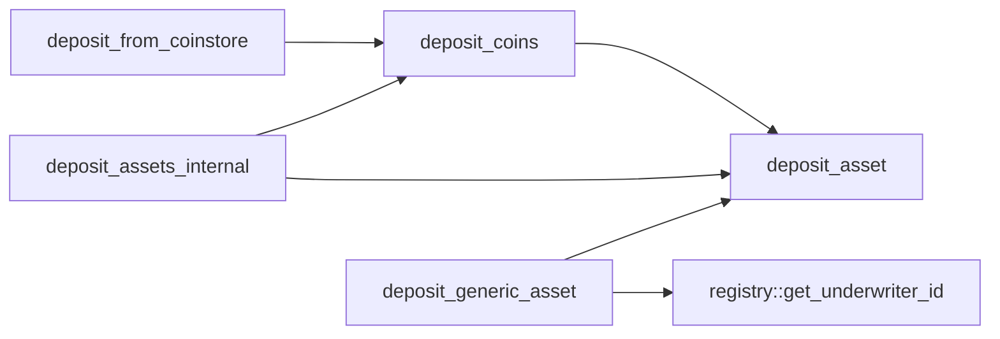
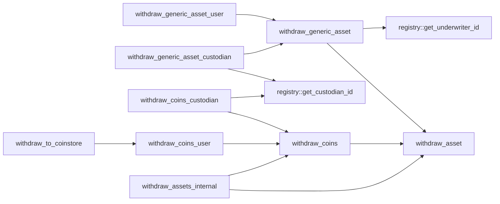
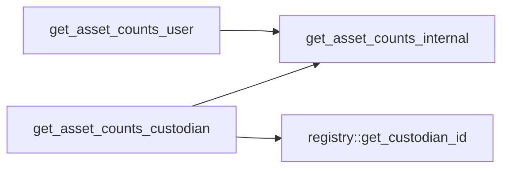
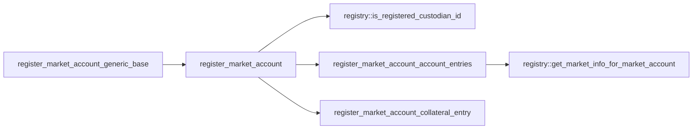
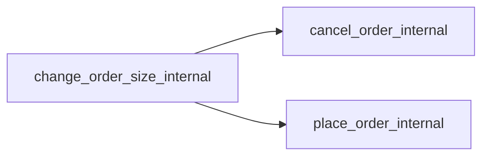

# Module `0xc0deb00c::user`

User-side asset, collateral, and order management.

Contains data structures and functionality for tracking a user's
assets and open orders. Upon market account registration, users can
either preside over their own account, or delegate custody to a
custodian who manage their orders and withdrawals. For each market,
a user can open multiple market accounts, each with a unique
custodian.

## General overview sections

[Architecture](#architecture)

* [Market account IDs](#market-account-IDs)
* [Market accounts](#market-accounts)
* [Orders and access keys](#orders-and-access-keys)
* [Market order IDs](#market-order-IDs)

[Function index](#function-index)

* [Public functions](#public-functions)
* [Public entry functions](#public-entry-functions)
* [Public friend functions](#public-friend-functions)
* [Dependency charts](#dependency-charts)

[Complete DocGen index](#complete-docgen-index)

## Architecture

### Market account IDs

Markets, defined in the global registry, are assigned a 1-indexed
<code>u64</code> market ID, as are custodians. The concatenated result of a
market ID and a custodian ID is known as a market account ID, which
is used as a key in assorted user-side lookup operations: the 64
least-significant bits in a market account ID are the custodian ID
for the given market account (<code><a href="user.md#0xc0deb00c_user_NIL">NIL</a></code> if no delegated custodian),
while the 64 most-significant bits are the market ID. See
<code><a href="user.md#0xc0deb00c_user_get_custodian_id">get_custodian_id</a>()</code>, <code><a href="user.md#0xc0deb00c_user_get_market_account_id">get_market_account_id</a>()</code>, and
<code><a href="user.md#0xc0deb00c_user_get_market_id">get_market_id</a>()</code> for implementation details.

### Market accounts

When a user opens a market account, a <code><a href="user.md#0xc0deb00c_user_MarketAccount">MarketAccount</a></code> entry is
added to their <code><a href="user.md#0xc0deb00c_user_MarketAccounts">MarketAccounts</a></code>, and a coin entry is added to their
<code><a href="user.md#0xc0deb00c_user_Collateral">Collateral</a></code> for the given market's quote coin type. If the market's
base asset is a coin, a <code><a href="user.md#0xc0deb00c_user_Collateral">Collateral</a></code> entry is similarly created for
the base coin type.

### Orders and access keys

When users place an order on the order book, an <code><a href="user.md#0xc0deb00c_user_Order">Order</a></code> is added to
their corresponding <code><a href="user.md#0xc0deb00c_user_MarketAccount">MarketAccount</a></code>. If they then cancel the order,
the corresponding <code><a href="user.md#0xc0deb00c_user_Order">Order</a></code> is not deallocated, but rather, marked
"inactive" and pushed onto a stack of inactive orders for the
corresponding side (<code><a href="user.md#0xc0deb00c_user_MarketAccount">MarketAccount</a>.asks_stack_top</code> or
<code><a href="user.md#0xc0deb00c_user_MarketAccount">MarketAccount</a>.bids_stack_top</code>). Then, when a user places another
order, rather than allocating a new <code><a href="user.md#0xc0deb00c_user_Order">Order</a></code>, the inactive order at
the top of the stack is popped off the stack and marked active.

This approach is motivated by global storage gas costs: as of the
time of this writing, per-item creations cost approximately 16.7
times as much as per-item writes, and there is no incentive to
deallocate from memory. Hence the inactive stack paradigm allows
for orders to be recycled in a way that reduces overall storage
costs. In practice, however, this means that each <code><a href="user.md#0xc0deb00c_user_Order">Order</a></code> is
assigned a static "access key" that persists throughout subsequent
active order states: if a user places an order, cancels the order,
then places another order, the <code><a href="user.md#0xc0deb00c_user_Order">Order</a></code> will have the same access key
in each active instance. In other words, access keys are the lookup
ID in the relevant <code><a href="user.md#0xc0deb00c_user_Order">Order</a></code> data structure for the given side
(<code><a href="user.md#0xc0deb00c_user_MarketAccount">MarketAccount</a>.asks</code> or <code><a href="user.md#0xc0deb00c_user_MarketAccount">MarketAccount</a>.bids</code>), and are not
necessarily unique for orders across time.

### Market order IDs

Market order IDs, however, are unique across time for a given market
ID, and are tracked in a users' <code><a href="user.md#0xc0deb00c_user_Order">Order</a>.market_order_id</code>. A market
order ID is a unique identifier for an order on a given order book.

## Function index

### Public functions

Asset transfer:

* <code><a href="user.md#0xc0deb00c_user_deposit_coins">deposit_coins</a>()</code>
* <code><a href="user.md#0xc0deb00c_user_deposit_generic_asset">deposit_generic_asset</a>()</code>
* <code><a href="user.md#0xc0deb00c_user_withdraw_coins_custodian">withdraw_coins_custodian</a>()</code>
* <code><a href="user.md#0xc0deb00c_user_withdraw_coins_user">withdraw_coins_user</a>()</code>
* <code><a href="user.md#0xc0deb00c_user_withdraw_generic_asset_custodian">withdraw_generic_asset_custodian</a>()</code>
* <code><a href="user.md#0xc0deb00c_user_withdraw_generic_asset_user">withdraw_generic_asset_user</a>()</code>

Market account lookup:

* <code><a href="user.md#0xc0deb00c_user_get_all_market_account_ids_for_market_id">get_all_market_account_ids_for_market_id</a>()</code>
* <code><a href="user.md#0xc0deb00c_user_get_all_market_account_ids_for_user">get_all_market_account_ids_for_user</a>()</code>
* <code><a href="user.md#0xc0deb00c_user_get_asset_counts_custodian">get_asset_counts_custodian</a>()</code>
* <code><a href="user.md#0xc0deb00c_user_get_asset_counts_user">get_asset_counts_user</a>()</code>
* <code><a href="user.md#0xc0deb00c_user_has_market_account_by_market_account_id">has_market_account_by_market_account_id</a>()</code>
* <code><a href="user.md#0xc0deb00c_user_has_market_account_by_market_id">has_market_account_by_market_id</a>()</code>

Market account ID lookup:

* <code><a href="user.md#0xc0deb00c_user_get_custodian_id">get_custodian_id</a>()</code>
* <code><a href="user.md#0xc0deb00c_user_get_market_account_id">get_market_account_id</a>()</code>
* <code><a href="user.md#0xc0deb00c_user_get_market_id">get_market_id</a>()</code>

### Public entry functions

Asset transfer:

* <code><a href="user.md#0xc0deb00c_user_deposit_from_coinstore">deposit_from_coinstore</a>()</code>
* <code><a href="user.md#0xc0deb00c_user_withdraw_to_coinstore">withdraw_to_coinstore</a>()</code>

Account registration:

* <code><a href="user.md#0xc0deb00c_user_register_market_account">register_market_account</a>()</code>
* <code><a href="user.md#0xc0deb00c_user_register_market_account_generic_base">register_market_account_generic_base</a>()</code>

### Public friend functions

Order management:

* <code><a href="user.md#0xc0deb00c_user_cancel_order_internal">cancel_order_internal</a>()</code>
* <code><a href="user.md#0xc0deb00c_user_change_order_size_internal">change_order_size_internal</a>()</code>
* <code><a href="user.md#0xc0deb00c_user_fill_order_internal">fill_order_internal</a>()</code>
* <code><a href="user.md#0xc0deb00c_user_place_order_internal">place_order_internal</a>()</code>

Asset management:

* <code><a href="user.md#0xc0deb00c_user_deposit_assets_internal">deposit_assets_internal</a>()</code>
* <code><a href="user.md#0xc0deb00c_user_get_asset_counts_internal">get_asset_counts_internal</a>()</code>
* <code><a href="user.md#0xc0deb00c_user_withdraw_assets_internal">withdraw_assets_internal</a>()</code>

Order identifiers:

* <code><a href="user.md#0xc0deb00c_user_get_next_order_access_key_internal">get_next_order_access_key_internal</a>()</code>
* <code><a href="user.md#0xc0deb00c_user_get_active_market_order_ids_internal">get_active_market_order_ids_internal</a>()</code>

### Dependency charts

The below dependency charts use <code>mermaid.js</code> syntax, which can be
automatically rendered into a diagram (depending on the browser)
when viewing the documentation file generated from source code. If
a browser renders the diagrams with coloring that makes it difficult
to read, try a different browser.

Deposits:

Withdrawals:

Asset count lookup:

Market account registration:

Internal order management:

## Complete DocGen index

The below index is automatically generated from source code:

-  [General overview sections](#@General_overview_sections_0)
-  [Architecture](#@Architecture_1)
    -  [Market account IDs](#@Market_account_IDs_2)
    -  [Market accounts](#@Market_accounts_3)
    -  [Orders and access keys](#@Orders_and_access_keys_4)
    -  [Market order IDs](#@Market_order_IDs_5)
-  [Function index](#@Function_index_6)
    -  [Public functions](#@Public_functions_7)
    -  [Public entry functions](#@Public_entry_functions_8)
    -  [Public friend functions](#@Public_friend_functions_9)
    -  [Dependency charts](#@Dependency_charts_10)
-  [Complete DocGen index](#@Complete_DocGen_index_11)
-  [Resource `Collateral`](#0xc0deb00c_user_Collateral)
-  [Struct `MarketAccount`](#0xc0deb00c_user_MarketAccount)
-  [Resource `MarketAccounts`](#0xc0deb00c_user_MarketAccounts)
-  [Struct `Order`](#0xc0deb00c_user_Order)
-  [Constants](#@Constants_12)
-  [Function `deposit_coins`](#0xc0deb00c_user_deposit_coins)
    -  [Testing](#@Testing_13)
-  [Function `deposit_generic_asset`](#0xc0deb00c_user_deposit_generic_asset)
    -  [Testing](#@Testing_14)
-  [Function `get_all_market_account_ids_for_market_id`](#0xc0deb00c_user_get_all_market_account_ids_for_market_id)
    -  [Parameters](#@Parameters_15)
    -  [Returns](#@Returns_16)
    -  [Gas considerations](#@Gas_considerations_17)
    -  [Testing](#@Testing_18)
-  [Function `get_all_market_account_ids_for_user`](#0xc0deb00c_user_get_all_market_account_ids_for_user)
    -  [Parameters](#@Parameters_19)
    -  [Returns](#@Returns_20)
    -  [Gas considerations](#@Gas_considerations_21)
    -  [Testing](#@Testing_22)
-  [Function `get_asset_counts_custodian`](#0xc0deb00c_user_get_asset_counts_custodian)
    -  [Testing](#@Testing_23)
-  [Function `get_asset_counts_user`](#0xc0deb00c_user_get_asset_counts_user)
    -  [Testing](#@Testing_24)
-  [Function `get_custodian_id`](#0xc0deb00c_user_get_custodian_id)
    -  [Testing](#@Testing_25)
-  [Function `get_market_account_id`](#0xc0deb00c_user_get_market_account_id)
    -  [Testing](#@Testing_26)
-  [Function `get_market_id`](#0xc0deb00c_user_get_market_id)
    -  [Testing](#@Testing_27)
-  [Function `has_market_account_by_market_account_id`](#0xc0deb00c_user_has_market_account_by_market_account_id)
    -  [Testing](#@Testing_28)
-  [Function `has_market_account_by_market_id`](#0xc0deb00c_user_has_market_account_by_market_id)
    -  [Testing](#@Testing_29)
-  [Function `withdraw_coins_custodian`](#0xc0deb00c_user_withdraw_coins_custodian)
    -  [Testing](#@Testing_30)
-  [Function `withdraw_coins_user`](#0xc0deb00c_user_withdraw_coins_user)
    -  [Testing](#@Testing_31)
-  [Function `withdraw_generic_asset_custodian`](#0xc0deb00c_user_withdraw_generic_asset_custodian)
    -  [Testing](#@Testing_32)
-  [Function `withdraw_generic_asset_user`](#0xc0deb00c_user_withdraw_generic_asset_user)
    -  [Testing](#@Testing_33)
-  [Function `deposit_from_coinstore`](#0xc0deb00c_user_deposit_from_coinstore)
    -  [Testing](#@Testing_34)
-  [Function `register_market_account`](#0xc0deb00c_user_register_market_account)
    -  [Type parameters](#@Type_parameters_35)
    -  [Parameters](#@Parameters_36)
    -  [Aborts](#@Aborts_37)
    -  [Testing](#@Testing_38)
-  [Function `register_market_account_generic_base`](#0xc0deb00c_user_register_market_account_generic_base)
    -  [Testing](#@Testing_39)
-  [Function `withdraw_to_coinstore`](#0xc0deb00c_user_withdraw_to_coinstore)
    -  [Testing](#@Testing_40)
-  [Function `cancel_order_internal`](#0xc0deb00c_user_cancel_order_internal)
    -  [Parameters](#@Parameters_41)
    -  [Returns](#@Returns_42)
    -  [Terminology](#@Terminology_43)
    -  [Aborts](#@Aborts_44)
    -  [Assumptions](#@Assumptions_45)
    -  [Expected value testing](#@Expected_value_testing_46)
    -  [Failure testing](#@Failure_testing_47)
-  [Function `change_order_size_internal`](#0xc0deb00c_user_change_order_size_internal)
    -  [Parameters](#@Parameters_48)
    -  [Aborts](#@Aborts_49)
    -  [Assumptions](#@Assumptions_50)
    -  [Testing](#@Testing_51)
-  [Function `deposit_assets_internal`](#0xc0deb00c_user_deposit_assets_internal)
    -  [Type parameters](#@Type_parameters_52)
    -  [Parameters](#@Parameters_53)
    -  [Assumptions](#@Assumptions_54)
    -  [Testing](#@Testing_55)
-  [Function `fill_order_internal`](#0xc0deb00c_user_fill_order_internal)
    -  [Type parameters](#@Type_parameters_56)
    -  [Parameters](#@Parameters_57)
    -  [Returns](#@Returns_58)
    -  [Assumptions](#@Assumptions_59)
    -  [Testing](#@Testing_60)
-  [Function `get_asset_counts_internal`](#0xc0deb00c_user_get_asset_counts_internal)
    -  [Parameters](#@Parameters_61)
    -  [Returns](#@Returns_62)
    -  [Aborts](#@Aborts_63)
    -  [Testing](#@Testing_64)
-  [Function `get_active_market_order_ids_internal`](#0xc0deb00c_user_get_active_market_order_ids_internal)
    -  [Parameters](#@Parameters_65)
    -  [Returns](#@Returns_66)
    -  [Aborts](#@Aborts_67)
    -  [Testing](#@Testing_68)
-  [Function `get_next_order_access_key_internal`](#0xc0deb00c_user_get_next_order_access_key_internal)
    -  [Parameters](#@Parameters_69)
    -  [Returns](#@Returns_70)
    -  [Aborts](#@Aborts_71)
    -  [Testing](#@Testing_72)
-  [Function `place_order_internal`](#0xc0deb00c_user_place_order_internal)
    -  [Parameters](#@Parameters_73)
    -  [Terminology](#@Terminology_74)
    -  [Assumptions](#@Assumptions_75)
    -  [Aborts](#@Aborts_76)
    -  [Expected value testing](#@Expected_value_testing_77)
    -  [Failure testing](#@Failure_testing_78)
-  [Function `withdraw_assets_internal`](#0xc0deb00c_user_withdraw_assets_internal)
    -  [Type parameters](#@Type_parameters_79)
    -  [Parameters](#@Parameters_80)
    -  [Returns](#@Returns_81)
    -  [Testing](#@Testing_82)

<pre><code><b>use</b> <a href="">0x1::coin</a>;
<b>use</b> <a href="">0x1::option</a>;
<b>use</b> <a href="">0x1::signer</a>;
<b>use</b> <a href="">0x1::string</a>;
<b>use</b> <a href="">0x1::table</a>;
<b>use</b> <a href="">0x1::type_info</a>;
<b>use</b> <a href="">0x1::vector</a>;
<b>use</b> <a href="registry.md#0xc0deb00c_registry">0xc0deb00c::registry</a>;
<b>use</b> <a href="tablist.md#0xc0deb00c_tablist">0xc0deb00c::tablist</a>;
</code></pre>

## Resource `Collateral`

All of a user's collateral across all market accounts.

<pre><code><b>struct</b> <a href="user.md#0xc0deb00c_user_Collateral">Collateral</a>&lt;CoinType&gt; <b>has</b> key
</code></pre>

## Struct `MarketAccount`

Represents a user's open orders and asset counts for a given
market account ID. Contains <code><a href="registry.md#0xc0deb00c_registry_MarketInfo">registry::MarketInfo</a></code> field
duplicates to reduce global storage item queries against the
registry.

<pre><code><b>struct</b> <a href="user.md#0xc0deb00c_user_MarketAccount">MarketAccount</a> <b>has</b> store
</code></pre>

## Resource `MarketAccounts`

All of a user's market accounts.

<pre><code><b>struct</b> <a href="user.md#0xc0deb00c_user_MarketAccounts">MarketAccounts</a> <b>has</b> key
</code></pre>

## Struct `Order`

An open order, either ask or bid.

<pre><code><b>struct</b> <a href="user.md#0xc0deb00c_user_Order">Order</a> <b>has</b> store
</code></pre>

## Constants

<code>u64</code> bitmask with all bits set, generated in Python via
<code>hex(int('1' * 64, 2))</code>.

<pre><code><b>const</b> <a href="user.md#0xc0deb00c_user_HI_64">HI_64</a>: u64 = 18446744073709551615;
</code></pre>

Flag for null value when null defined as 0.

<pre><code><b>const</b> <a href="user.md#0xc0deb00c_user_NIL">NIL</a>: u64 = 0;
</code></pre>

Custodian ID flag for no custodian.

<pre><code><b>const</b> <a href="user.md#0xc0deb00c_user_NO_CUSTODIAN">NO_CUSTODIAN</a>: u64 = 0;
</code></pre>

Underwriter ID flag for no underwriter.

<pre><code><b>const</b> <a href="user.md#0xc0deb00c_user_NO_UNDERWRITER">NO_UNDERWRITER</a>: u64 = 0;
</code></pre>

Flag for ask side

<pre><code><b>const</b> <a href="user.md#0xc0deb00c_user_ASK">ASK</a>: bool = <b>true</b>;
</code></pre>

Flag for bid side

<pre><code><b>const</b> <a href="user.md#0xc0deb00c_user_BID">BID</a>: bool = <b>false</b>;
</code></pre>

Asset type is not in trading pair for market.

<pre><code><b>const</b> <a href="user.md#0xc0deb00c_user_E_ASSET_NOT_IN_PAIR">E_ASSET_NOT_IN_PAIR</a>: u64 = 4;
</code></pre>

No change in order size.

<pre><code><b>const</b> <a href="user.md#0xc0deb00c_user_E_CHANGE_ORDER_NO_CHANGE">E_CHANGE_ORDER_NO_CHANGE</a>: u64 = 14;
</code></pre>

Deposit would overflow asset ceiling.

<pre><code><b>const</b> <a href="user.md#0xc0deb00c_user_E_DEPOSIT_OVERFLOW_ASSET_CEILING">E_DEPOSIT_OVERFLOW_ASSET_CEILING</a>: u64 = 5;
</code></pre>

Market account already exists.

<pre><code><b>const</b> <a href="user.md#0xc0deb00c_user_E_EXISTS_MARKET_ACCOUNT">E_EXISTS_MARKET_ACCOUNT</a>: u64 = 0;
</code></pre>

Market order ID mismatch with user's open order.

<pre><code><b>const</b> <a href="user.md#0xc0deb00c_user_E_INVALID_MARKET_ORDER_ID">E_INVALID_MARKET_ORDER_ID</a>: u64 = 15;
</code></pre>

Underwriter is not valid for indicated market.

<pre><code><b>const</b> <a href="user.md#0xc0deb00c_user_E_INVALID_UNDERWRITER">E_INVALID_UNDERWRITER</a>: u64 = 6;
</code></pre>

Not enough asset to trade away.

<pre><code><b>const</b> <a href="user.md#0xc0deb00c_user_E_NOT_ENOUGH_ASSET_OUT">E_NOT_ENOUGH_ASSET_OUT</a>: u64 = 13;
</code></pre>

No market account resource found.

<pre><code><b>const</b> <a href="user.md#0xc0deb00c_user_E_NO_MARKET_ACCOUNT">E_NO_MARKET_ACCOUNT</a>: u64 = 3;
</code></pre>

No market accounts resource found.

<pre><code><b>const</b> <a href="user.md#0xc0deb00c_user_E_NO_MARKET_ACCOUNTS">E_NO_MARKET_ACCOUNTS</a>: u64 = 2;
</code></pre>

Filling order would overflow asset received from trade.

<pre><code><b>const</b> <a href="user.md#0xc0deb00c_user_E_OVERFLOW_ASSET_IN">E_OVERFLOW_ASSET_IN</a>: u64 = 12;
</code></pre>

Price is zero.

<pre><code><b>const</b> <a href="user.md#0xc0deb00c_user_E_PRICE_0">E_PRICE_0</a>: u64 = 8;
</code></pre>

Price exceeds maximum possible price.

<pre><code><b>const</b> <a href="user.md#0xc0deb00c_user_E_PRICE_TOO_HIGH">E_PRICE_TOO_HIGH</a>: u64 = 9;
</code></pre>

Size is below minimum size for market.

<pre><code><b>const</b> <a href="user.md#0xc0deb00c_user_E_SIZE_TOO_LOW">E_SIZE_TOO_LOW</a>: u64 = 10;
</code></pre>

Ticks to fill an order overflows a <code>u64</code>.

<pre><code><b>const</b> <a href="user.md#0xc0deb00c_user_E_TICKS_OVERFLOW">E_TICKS_OVERFLOW</a>: u64 = 11;
</code></pre>

Custodian ID has not been registered.

<pre><code><b>const</b> <a href="user.md#0xc0deb00c_user_E_UNREGISTERED_CUSTODIAN">E_UNREGISTERED_CUSTODIAN</a>: u64 = 1;
</code></pre>

Too little available for withdrawal.

<pre><code><b>const</b> <a href="user.md#0xc0deb00c_user_E_WITHDRAW_TOO_LITTLE_AVAILABLE">E_WITHDRAW_TOO_LITTLE_AVAILABLE</a>: u64 = 7;
</code></pre>

Maximum possible price that can be encoded in 32 bits. Generated
in Python via <code>hex(int('1' * 32, 2))</code>.

<pre><code><b>const</b> <a href="user.md#0xc0deb00c_user_MAX_PRICE">MAX_PRICE</a>: u64 = 4294967295;
</code></pre>

Number of bits market ID is shifted in market account ID.

<pre><code><b>const</b> <a href="user.md#0xc0deb00c_user_SHIFT_MARKET_ID">SHIFT_MARKET_ID</a>: u8 = 64;
</code></pre>

## Function `deposit_coins`

Wrapped call to <code><a href="user.md#0xc0deb00c_user_deposit_asset">deposit_asset</a>()</code> for depositing coins.

### Testing

* <code>test_deposits()</code>

<pre><code><b>public</b> <b>fun</b> <a href="user.md#0xc0deb00c_user_deposit_coins">deposit_coins</a>&lt;CoinType&gt;(user_address: <b>address</b>, market_id: u64, custodian_id: u64, coins: <a href="_Coin">coin::Coin</a>&lt;CoinType&gt;)
</code></pre>

## Function `deposit_generic_asset`

Wrapped call to <code><a href="user.md#0xc0deb00c_user_deposit_asset">deposit_asset</a>()</code> for depositing generic asset.

### Testing

* <code>test_deposits()</code>

<pre><code><b>public</b> <b>fun</b> <a href="user.md#0xc0deb00c_user_deposit_generic_asset">deposit_generic_asset</a>(user_address: <b>address</b>, market_id: u64, custodian_id: u64, amount: u64, underwriter_capability_ref: &<a href="registry.md#0xc0deb00c_registry_UnderwriterCapability">registry::UnderwriterCapability</a>)
</code></pre>

## Function `get_all_market_account_ids_for_market_id`

Return all market account IDs associated with market ID.

### Parameters

* <code><a href="user.md#0xc0deb00c_user">user</a></code>: Address of user to check market account IDs for.
* <code>market_id</code>: Market ID to check market accounts for.

### Returns

* <code><a href="">vector</a>&lt;u128&gt;</code>: Vector of user's market account IDs for given
market, empty if no market accounts.

### Gas considerations

Loops over all elements within a vector that is itself a single
item in global storage, and returns a vector via pass-by-value.

### Testing

* <code>test_market_account_getters()</code>

<pre><code><b>public</b> <b>fun</b> <a href="user.md#0xc0deb00c_user_get_all_market_account_ids_for_market_id">get_all_market_account_ids_for_market_id</a>(<a href="user.md#0xc0deb00c_user">user</a>: <b>address</b>, market_id: u64): <a href="">vector</a>&lt;u128&gt;
</code></pre>

## Function `get_all_market_account_ids_for_user`

Return all of a user's market account IDs.

### Parameters

* <code><a href="user.md#0xc0deb00c_user">user</a></code>: Address of user to check market account IDs for.

### Returns

* <code><a href="">vector</a>&lt;u128&gt;</code>: Vector of user's market account IDs, empty if
no market accounts.

### Gas considerations

For each market that a user has market accounts for, loops over
a separate item in global storage, incurring a per-item read
cost. Additionally loops over a vector for each such per-item
read, incurring linearly-scaled vector operation costs. Returns
a vector via pass-by-value.

### Testing

* <code>test_market_account_getters()</code>

<pre><code><b>public</b> <b>fun</b> <a href="user.md#0xc0deb00c_user_get_all_market_account_ids_for_user">get_all_market_account_ids_for_user</a>(<a href="user.md#0xc0deb00c_user">user</a>: <b>address</b>): <a href="">vector</a>&lt;u128&gt;
</code></pre>

## Function `get_asset_counts_custodian`

Wrapped call to <code><a href="user.md#0xc0deb00c_user_get_asset_counts_internal">get_asset_counts_internal</a>()</code> for custodian.

Restricted to custodian for given market account to prevent
excessive public queries and thus transaction collisions.

### Testing

* <code>test_deposits()</code>

<pre><code><b>public</b> <b>fun</b> <a href="user.md#0xc0deb00c_user_get_asset_counts_custodian">get_asset_counts_custodian</a>(user_address: <b>address</b>, market_id: u64, custodian_capability_ref: &<a href="registry.md#0xc0deb00c_registry_CustodianCapability">registry::CustodianCapability</a>): (u64, u64, u64, u64, u64, u64)
</code></pre>

## Function `get_asset_counts_user`

Wrapped call to <code><a href="user.md#0xc0deb00c_user_get_asset_counts_internal">get_asset_counts_internal</a>()</code> for signing user.

Restricted to signing user for given market account to prevent
excessive public queries and thus transaction collisions.

### Testing

* <code>test_deposits()</code>

<pre><code><b>public</b> <b>fun</b> <a href="user.md#0xc0deb00c_user_get_asset_counts_user">get_asset_counts_user</a>(<a href="user.md#0xc0deb00c_user">user</a>: &<a href="">signer</a>, market_id: u64): (u64, u64, u64, u64, u64, u64)
</code></pre>

## Function `get_custodian_id`

Return custodian ID encoded in market account ID.

### Testing

* <code>test_market_account_id_getters()</code>

<pre><code><b>public</b> <b>fun</b> <a href="user.md#0xc0deb00c_user_get_custodian_id">get_custodian_id</a>(market_account_id: u128): u64
</code></pre>

## Function `get_market_account_id`

Return market account ID with encoded market and custodian IDs.

### Testing

* <code>test_market_account_id_getters()</code>

<pre><code><b>public</b> <b>fun</b> <a href="user.md#0xc0deb00c_user_get_market_account_id">get_market_account_id</a>(market_id: u64, custodian_id: u64): u128
</code></pre>

## Function `get_market_id`

Return market ID encoded in market account ID.

### Testing

* <code>test_market_account_id_getters()</code>

<pre><code><b>public</b> <b>fun</b> <a href="user.md#0xc0deb00c_user_get_market_id">get_market_id</a>(market_account_id: u128): u64
</code></pre>

## Function `has_market_account_by_market_account_id`

Return <code><b>true</b></code> if <code><a href="user.md#0xc0deb00c_user">user</a></code> has market account registered with
given <code>market_account_id</code>.

### Testing

* <code>test_market_account_getters()</code>

<pre><code><b>public</b> <b>fun</b> <a href="user.md#0xc0deb00c_user_has_market_account_by_market_account_id">has_market_account_by_market_account_id</a>(<a href="user.md#0xc0deb00c_user">user</a>: <b>address</b>, market_account_id: u128): bool
</code></pre>

## Function `has_market_account_by_market_id`

Return <code><b>true</b></code> if <code><a href="user.md#0xc0deb00c_user">user</a></code> has at least one market account
registered with given <code>market_id</code>.

### Testing

* <code>test_market_account_getters()</code>

<pre><code><b>public</b> <b>fun</b> <a href="user.md#0xc0deb00c_user_has_market_account_by_market_id">has_market_account_by_market_id</a>(<a href="user.md#0xc0deb00c_user">user</a>: <b>address</b>, market_id: u64): bool
</code></pre>

## Function `withdraw_coins_custodian`

Wrapped call to <code><a href="user.md#0xc0deb00c_user_withdraw_coins">withdraw_coins</a>()</code> for withdrawing under
authority of delegated custodian.

### Testing

* <code>test_withdrawals()</code>

<pre><code><b>public</b> <b>fun</b> <a href="user.md#0xc0deb00c_user_withdraw_coins_custodian">withdraw_coins_custodian</a>&lt;CoinType&gt;(user_address: <b>address</b>, market_id: u64, amount: u64, custodian_capability_ref: &<a href="registry.md#0xc0deb00c_registry_CustodianCapability">registry::CustodianCapability</a>): <a href="_Coin">coin::Coin</a>&lt;CoinType&gt;
</code></pre>

## Function `withdraw_coins_user`

Wrapped call to <code><a href="user.md#0xc0deb00c_user_withdraw_coins">withdraw_coins</a>()</code> for withdrawing under
authority of signing user.

### Testing

* <code>test_withdrawals()</code>

<pre><code><b>public</b> <b>fun</b> <a href="user.md#0xc0deb00c_user_withdraw_coins_user">withdraw_coins_user</a>&lt;CoinType&gt;(<a href="user.md#0xc0deb00c_user">user</a>: &<a href="">signer</a>, market_id: u64, amount: u64): <a href="_Coin">coin::Coin</a>&lt;CoinType&gt;
</code></pre>

## Function `withdraw_generic_asset_custodian`

Wrapped call to <code><a href="user.md#0xc0deb00c_user_withdraw_generic_asset">withdraw_generic_asset</a>()</code> for withdrawing under
authority of delegated custodian.

### Testing

* <code>test_withdrawals()</code>

<pre><code><b>public</b> <b>fun</b> <a href="user.md#0xc0deb00c_user_withdraw_generic_asset_custodian">withdraw_generic_asset_custodian</a>(user_address: <b>address</b>, market_id: u64, amount: u64, custodian_capability_ref: &<a href="registry.md#0xc0deb00c_registry_CustodianCapability">registry::CustodianCapability</a>, underwriter_capability_ref: &<a href="registry.md#0xc0deb00c_registry_UnderwriterCapability">registry::UnderwriterCapability</a>)
</code></pre>

## Function `withdraw_generic_asset_user`

Wrapped call to <code><a href="user.md#0xc0deb00c_user_withdraw_generic_asset">withdraw_generic_asset</a>()</code> for withdrawing under
authority of signing user.

### Testing

* <code>test_withdrawals()</code>

<pre><code><b>public</b> <b>fun</b> <a href="user.md#0xc0deb00c_user_withdraw_generic_asset_user">withdraw_generic_asset_user</a>(<a href="user.md#0xc0deb00c_user">user</a>: &<a href="">signer</a>, market_id: u64, amount: u64, underwriter_capability_ref: &<a href="registry.md#0xc0deb00c_registry_UnderwriterCapability">registry::UnderwriterCapability</a>)
</code></pre>

## Function `deposit_from_coinstore`

Wrapped call to <code><a href="user.md#0xc0deb00c_user_deposit_coins">deposit_coins</a>()</code> for depositing from an
<code>aptos_framework::coin::CoinStore</code>.

### Testing

* <code>test_deposits()</code>

<pre><code><b>public</b> entry <b>fun</b> <a href="user.md#0xc0deb00c_user_deposit_from_coinstore">deposit_from_coinstore</a>&lt;CoinType&gt;(<a href="user.md#0xc0deb00c_user">user</a>: &<a href="">signer</a>, market_id: u64, custodian_id: u64, amount: u64)
</code></pre>

## Function `register_market_account`

Register market account for indicated market and custodian.

### Type parameters

* <code>BaseType</code>: Base type for indicated market. If base asset is
a generic asset, must be passed as <code><a href="registry.md#0xc0deb00c_registry_GenericAsset">registry::GenericAsset</a></code>
(alternatively use <code>register_market_account_base_generic()</code>).
* <code>QuoteType</code>: Quote type for indicated market.

### Parameters

* <code><a href="user.md#0xc0deb00c_user">user</a></code>: User registering a market account.
* <code>market_id</code>: Market ID for given market.
* <code>custodian_id</code>: Custodian ID to register account with, or
<code><a href="user.md#0xc0deb00c_user_NO_CUSTODIAN">NO_CUSTODIAN</a></code>.

### Aborts

* <code><a href="user.md#0xc0deb00c_user_E_UNREGISTERED_CUSTODIAN">E_UNREGISTERED_CUSTODIAN</a></code>: Custodian ID has not been
registered.

### Testing

* <code>test_register_market_account_unregistered_custodian()</code>
* <code>test_register_market_accounts()</code>

<pre><code><b>public</b> entry <b>fun</b> <a href="user.md#0xc0deb00c_user_register_market_account">register_market_account</a>&lt;BaseType, QuoteType&gt;(<a href="user.md#0xc0deb00c_user">user</a>: &<a href="">signer</a>, market_id: u64, custodian_id: u64)
</code></pre>

## Function `register_market_account_generic_base`

Wrapped <code><a href="user.md#0xc0deb00c_user_register_market_account">register_market_account</a>()</code> call for generic base asset.

### Testing

* <code>test_register_market_accounts()</code>

<pre><code><b>public</b> entry <b>fun</b> <a href="user.md#0xc0deb00c_user_register_market_account_generic_base">register_market_account_generic_base</a>&lt;QuoteType&gt;(<a href="user.md#0xc0deb00c_user">user</a>: &<a href="">signer</a>, market_id: u64, custodian_id: u64)
</code></pre>

## Function `withdraw_to_coinstore`

Wrapped call to <code><a href="user.md#0xc0deb00c_user_withdraw_coins_user">withdraw_coins_user</a>()</code> for withdrawing from
market account to user's <code>aptos_framework::coin::CoinStore</code>.

### Testing

* <code>test_withdrawals()</code>

<pre><code><b>public</b> entry <b>fun</b> <a href="user.md#0xc0deb00c_user_withdraw_to_coinstore">withdraw_to_coinstore</a>&lt;CoinType&gt;(<a href="user.md#0xc0deb00c_user">user</a>: &<a href="">signer</a>, market_id: u64, amount: u64)
</code></pre>

## Function `cancel_order_internal`

Cancel order from a user's tablist of open orders on given side.

Updates asset counts, pushes order onto top of inactive orders
stack, and overwrites its fields accordingly.

Accepts as an argument a market order ID, which is checked
against the market order ID in the user's corresponding <code><a href="user.md#0xc0deb00c_user_Order">Order</a></code>.
This check is bypassed when the market order ID is passed as
<code><a href="user.md#0xc0deb00c_user_NIL">NIL</a></code>, which should only happen when cancellation is motivated
by an eviction: market order IDs are not tracked in order book
state, so during an eviction, <code><a href="user.md#0xc0deb00c_user_cancel_order_internal">cancel_order_internal</a>()</code>
is simply called with a <code><a href="user.md#0xc0deb00c_user_NIL">NIL</a></code> market order ID argument.
Custodians or users who manually trigger order cancellations for
their own order do have to pass market order IDs, however, to
verify that they are not passing a malicious market order ID
(portions of which essentially function as pointers into AVL
queue state).

### Parameters

* <code>user_address</code>: User address for market account.
* <code>market_id</code>: Market ID for market account.
* <code>custodian_id</code>: Custodian ID for market account.
* <code>side</code>: <code><a href="user.md#0xc0deb00c_user_ASK">ASK</a></code> or <code><a href="user.md#0xc0deb00c_user_BID">BID</a></code>, the side on which an order was placed.
* <code>size</code>: Order size, in lots.
* <code>price</code>: Order price, in ticks per lot.
* <code>order_access_key</code>: Order access key for user order lookup.
* <code>market_order_id</code>: <code><a href="user.md#0xc0deb00c_user_NIL">NIL</a></code> if order cancellation originates from
an eviction, otherwise the market order ID encoded in the
user's <code><a href="user.md#0xc0deb00c_user_Order">Order</a></code>.

### Returns

* <code>u128</code>: Market order ID for corresponding order.

### Terminology

* The "inbound" asset is the asset that would have been received
from a trade if the cancelled order had been filled.
* The "outbound" asset is the asset that would have been traded
away if the cancelled order had been filled.

### Aborts

* <code><a href="user.md#0xc0deb00c_user_E_INVALID_MARKET_ORDER_ID">E_INVALID_MARKET_ORDER_ID</a></code>: Market order ID mismatch with
user's open order, when market order ID not passed as <code><a href="user.md#0xc0deb00c_user_NIL">NIL</a></code>.

### Assumptions

* Only called when also cancelling an order from the order book.
* User has an open order under indicated market account with
provided access key, but not necessarily with provided market
order ID (if market order ID is not <code><a href="user.md#0xc0deb00c_user_NIL">NIL</a></code>): if order
cancellation is manually actuated by a custodian or user,
then it had to have been successfully placed on the book to
begin with for the given access key. Market order IDs,
however, are not maintained in order book state and so could
be potentially be passed by a malicious user or custodian who
intends to alter order book state per above.
* If market order ID is not <code><a href="user.md#0xc0deb00c_user_NIL">NIL</a></code>, is only called during an
eviction.
* <code>price</code> matches that encoded in market order ID from cancelled
order if market order ID is not <code><a href="user.md#0xc0deb00c_user_NIL">NIL</a></code>.

### Expected value testing

* <code>test_place_cancel_order_ask()</code>
* <code>test_place_cancel_order_bid()</code>
* <code>test_place_cancel_order_stack()</code>

### Failure testing

* <code>test_cancel_order_internal_mismatch()</code>

<pre><code><b>public</b>(<b>friend</b>) <b>fun</b> <a href="user.md#0xc0deb00c_user_cancel_order_internal">cancel_order_internal</a>(user_address: <b>address</b>, market_id: u64, custodian_id: u64, side: bool, price: u64, order_access_key: u64, market_order_id: u128): u128
</code></pre>

## Function `change_order_size_internal`

Change the size of a user's open order on given side.

### Parameters

* <code>user_address</code>: User address for market account.
* <code>market_id</code>: Market ID for market account.
* <code>custodian_id</code>: Custodian ID for market account.
* <code>side</code>: <code><a href="user.md#0xc0deb00c_user_ASK">ASK</a></code> or <code><a href="user.md#0xc0deb00c_user_BID">BID</a></code>, the side on which an order was placed.
* <code>new_size</code>: New order size, in lots, checked during inner call
to <code><a href="user.md#0xc0deb00c_user_place_order_internal">place_order_internal</a>()</code>.
* <code>price</code>: Order price, in ticks per lot.
* <code>order_access_key</code>: Order access key for user order lookup.
* <code>market_order_id</code>: Market order ID for order book lookup.

### Aborts

* <code><a href="user.md#0xc0deb00c_user_E_CHANGE_ORDER_NO_CHANGE">E_CHANGE_ORDER_NO_CHANGE</a></code>: No change in order size.

### Assumptions

* Only called when also changing order size on the order book.
* User has an open order under indicated market account with
provided access key, but not necessarily with provided market
order ID, which is checked in <code><a href="user.md#0xc0deb00c_user_cancel_order_internal">cancel_order_internal</a>()</code>.
* <code>price</code> matches that encoded in market order ID for changed
order.

### Testing

* <code>test_change_order_size_internal_ask()</code>
* <code>test_change_order_size_internal_bid()</code>
* <code>test_change_order_size_internal_no_change()</code>

<pre><code><b>public</b>(<b>friend</b>) <b>fun</b> <a href="user.md#0xc0deb00c_user_change_order_size_internal">change_order_size_internal</a>(user_address: <b>address</b>, market_id: u64, custodian_id: u64, side: bool, new_size: u64, price: u64, order_access_key: u64, market_order_id: u128)
</code></pre>

## Function `deposit_assets_internal`

Deposit base asset and quote coins when matching.

Should only be called by the matching engine when matching from
a user's market account.

### Type parameters

* <code>BaseType</code>: Base type for market.
* <code>QuoteType</code>: Quote type for market.

### Parameters

* <code>user_address</code>: User address for market account.
* <code>market_id</code>: Market ID for market account.
* <code>custodian_id</code>: Custodian ID for market account.
* <code>base_amount</code>: Base asset amount to deposit.
* <code>optional_base_coins</code>: Optional base coins to deposit.
* <code>quote_coins</code>: Quote coins to deposit.
* <code>underwriter_id</code>: Underwriter ID for market.

### Assumptions

* If <code>optional_base_coins</code> is some, coin value is equal to
<code>base_amount</code>.

### Testing

* <code>test_deposit_withdraw_assets_internal()</code>

<pre><code><b>public</b>(<b>friend</b>) <b>fun</b> <a href="user.md#0xc0deb00c_user_deposit_assets_internal">deposit_assets_internal</a>&lt;BaseType, QuoteType&gt;(user_address: <b>address</b>, market_id: u64, custodian_id: u64, base_amount: u64, optional_base_coins: <a href="_Option">option::Option</a>&lt;<a href="_Coin">coin::Coin</a>&lt;BaseType&gt;&gt;, quote_coins: <a href="_Coin">coin::Coin</a>&lt;QuoteType&gt;, underwriter_id: u64)
</code></pre>

## Function `fill_order_internal`

Fill a user's order, routing collateral appropriately.

Updates asset counts in a user's market account. Transfers
coins as needed between a user's collateral, and an external
source of coins passing through the matching engine. If a
complete fill, pushes the newly inactive order to the top of the
inactive orders stack for the given side.

Should only be called by the matching engine, which has already
calculated the corresponding amount of assets to fill. If the
matching engine gets to this stage, then the user has an open
order as indicated with sufficient assets to fill it. Hence no
error checking.

### Type parameters

* <code>BaseType</code>: Base type for indicated market.
* <code>QuoteType</code>: Quote type for indicated market.

### Parameters

* <code>user_address</code>: User address for market account.
* <code>market_id</code>: Market ID for market account.
* <code>custodian_id</code>: Custodian ID for market account.
* <code>side</code>: <code><a href="user.md#0xc0deb00c_user_ASK">ASK</a></code> or <code><a href="user.md#0xc0deb00c_user_BID">BID</a></code>, the side of the open order.
* <code>order_access_key</code>: The open order's access key.
* <code>fill_size</code>: The number of lots filled.
* <code>complete_fill</code>: <code><b>true</b></code> if order is completely filled.
* <code>optional_base_coins</code>: Optional external base coins passing
through the matching engine.
* <code>quote_coins</code>: External quote coins passing through the
matching engine.
* <code>base_to_route</code>: Amount of base asset filled.
* <code>quote_to_route</code>: Amount of quote asset filled.

### Returns

* <code>Option&lt;Coin&lt;BaseType&gt;&gt;</code>: Optional external base coins passing
through the matching engine.
* <code>Coin&lt;QuoteType&gt;</code>: External quote coins passing through the
matching engine.
* <code>u128</code>: Market order ID just filled against.

### Assumptions

* Only called by the matching engine as described above.

### Testing

* <code>test_fill_order_internal_ask_complete_base_coin()</code>
* <code>test_fill_order_internal_bid_complete_base_coin()</code>
* <code>test_fill_order_internal_bid_partial_base_generic()</code>

<pre><code><b>public</b>(<b>friend</b>) <b>fun</b> <a href="user.md#0xc0deb00c_user_fill_order_internal">fill_order_internal</a>&lt;BaseType, QuoteType&gt;(user_address: <b>address</b>, market_id: u64, custodian_id: u64, side: bool, order_access_key: u64, fill_size: u64, complete_fill: bool, optional_base_coins: <a href="_Option">option::Option</a>&lt;<a href="_Coin">coin::Coin</a>&lt;BaseType&gt;&gt;, quote_coins: <a href="_Coin">coin::Coin</a>&lt;QuoteType&gt;, base_to_route: u64, quote_to_route: u64): (<a href="_Option">option::Option</a>&lt;<a href="_Coin">coin::Coin</a>&lt;BaseType&gt;&gt;, <a href="_Coin">coin::Coin</a>&lt;QuoteType&gt;, u128)
</code></pre>

## Function `get_asset_counts_internal`

Return asset counts for specified market account.

### Parameters

* <code>user_address</code>: User address for market account.
* <code>market_id</code>: Market ID for market account.
* <code>custodian_id</code>: Custodian ID for market account.

### Returns

* <code><a href="user.md#0xc0deb00c_user_MarketAccount">MarketAccount</a>.base_total</code>
* <code><a href="user.md#0xc0deb00c_user_MarketAccount">MarketAccount</a>.base_available</code>
* <code><a href="user.md#0xc0deb00c_user_MarketAccount">MarketAccount</a>.base_ceiling</code>
* <code><a href="user.md#0xc0deb00c_user_MarketAccount">MarketAccount</a>.quote_total</code>
* <code><a href="user.md#0xc0deb00c_user_MarketAccount">MarketAccount</a>.quote_available</code>
* <code><a href="user.md#0xc0deb00c_user_MarketAccount">MarketAccount</a>.quote_ceiling</code>

### Aborts

* <code><a href="user.md#0xc0deb00c_user_E_NO_MARKET_ACCOUNTS">E_NO_MARKET_ACCOUNTS</a></code>: No market accounts resource found.
* <code><a href="user.md#0xc0deb00c_user_E_NO_MARKET_ACCOUNT">E_NO_MARKET_ACCOUNT</a></code>: No market account resource found.

### Testing

* <code>test_deposits()</code>
* <code>test_get_asset_counts_internal_no_account()</code>
* <code>test_get_asset_counts_internal_no_accounts()</code>

<pre><code><b>public</b>(<b>friend</b>) <b>fun</b> <a href="user.md#0xc0deb00c_user_get_asset_counts_internal">get_asset_counts_internal</a>(user_address: <b>address</b>, market_id: u64, custodian_id: u64): (u64, u64, u64, u64, u64, u64)
</code></pre>

## Function `get_active_market_order_ids_internal`

Return all active market order IDs for given market account.

### Parameters

* <code>user_address</code>: User address for market account.
* <code>market_id</code>: Market ID for market account.
* <code>custodian_id</code>: Custodian ID for market account.
* <code>side</code>: <code><a href="user.md#0xc0deb00c_user_ASK">ASK</a></code> or <code><a href="user.md#0xc0deb00c_user_BID">BID</a></code>, the side on which to check.

### Returns

* <code><a href="">vector</a>&lt;u128&gt;</code>: Vector of all active market order IDs for
given market account and side, empty if none.

### Aborts

* <code><a href="user.md#0xc0deb00c_user_E_NO_MARKET_ACCOUNTS">E_NO_MARKET_ACCOUNTS</a></code>: No market accounts resource found.
* <code><a href="user.md#0xc0deb00c_user_E_NO_MARKET_ACCOUNT">E_NO_MARKET_ACCOUNT</a></code>: No market account resource found.

### Testing

* <code>test_get_active_market_order_ids_internal()</code>
* <code>test_get_active_market_order_ids_internal_no_account()</code>
* <code>test_get_active_market_order_ids_internal_no_accounts()</code>

<pre><code><b>public</b>(<b>friend</b>) <b>fun</b> <a href="user.md#0xc0deb00c_user_get_active_market_order_ids_internal">get_active_market_order_ids_internal</a>(user_address: <b>address</b>, market_id: u64, custodian_id: u64, side: bool): <a href="">vector</a>&lt;u128&gt;
</code></pre>

## Function `get_next_order_access_key_internal`

Return order access key for next placed order.

If inactive orders stack top is empty, will be next 1-indexed
order access key to be allocated. Otherwise is order access key
at top of inactive order stack.

### Parameters

* <code>user_address</code>: User address for market account.
* <code>market_id</code>: Market ID for market account.
* <code>custodian_id</code>: Custodian ID for market account.
* <code>side</code>: <code><a href="user.md#0xc0deb00c_user_ASK">ASK</a></code> or <code><a href="user.md#0xc0deb00c_user_BID">BID</a></code>, the side on which an order will be
placed.

### Returns

* <code>u64</code>: Order access key of next order to be placed.

### Aborts

* <code><a href="user.md#0xc0deb00c_user_E_NO_MARKET_ACCOUNTS">E_NO_MARKET_ACCOUNTS</a></code>: No market accounts resource found.
* <code><a href="user.md#0xc0deb00c_user_E_NO_MARKET_ACCOUNT">E_NO_MARKET_ACCOUNT</a></code>: No market account resource found.

### Testing

* <code>test_get_next_order_access_key_internal_no_account()</code>
* <code>test_get_next_order_access_key_internal_no_accounts()</code>
* <code>test_place_cancel_order_ask()</code>
* <code>test_place_cancel_order_stack()</code>

<pre><code><b>public</b>(<b>friend</b>) <b>fun</b> <a href="user.md#0xc0deb00c_user_get_next_order_access_key_internal">get_next_order_access_key_internal</a>(user_address: <b>address</b>, market_id: u64, custodian_id: u64, side: bool): u64
</code></pre>

## Function `place_order_internal`

Place order in user's tablist of open orders on given side.

Range checks order parameters and updates asset counts
accordingly.

Allocates a new order if the inactive order stack is empty,
otherwise pops one off the top of the stack and overwrites it.

Should only be called when attempting to place an order on the
order book. Since order book entries list order access keys for
each corresponding user, <code><a href="user.md#0xc0deb00c_user_get_next_order_access_key_internal">get_next_order_access_key_internal</a>()</code>
needs to be called when generating an entry on the order book:
to insert to the order book, an order access key is first
required. Once an order book entry has been created, a market
order ID will then be made available.

### Parameters

* <code>user_address</code>: User address for market account.
* <code>market_id</code>: Market ID for market account.
* <code>custodian_id</code>: Custodian ID for market account.
* <code>side</code>: <code><a href="user.md#0xc0deb00c_user_ASK">ASK</a></code> or <code><a href="user.md#0xc0deb00c_user_BID">BID</a></code>, the side on which an order is placed.
* <code>size</code>: Order size, in lots.
* <code>price</code>: Order price, in ticks per lot.
* <code>market_order_id</code>: Market order ID for order book access.

### Terminology

* The "inbound" asset is the asset received from a trade.
* The "outbound" asset is the asset traded away.

### Assumptions

* Only called when also placing an order on the order book.
* <code>price</code> matches that encoded in <code>market_order_id</code>.
* Existence of corresponding market account has already been
verified by <code><a href="user.md#0xc0deb00c_user_get_next_order_access_key_internal">get_next_order_access_key_internal</a>()</code>.

### Aborts

* <code><a href="user.md#0xc0deb00c_user_E_PRICE_0">E_PRICE_0</a></code>: Price is zero.
* <code><a href="user.md#0xc0deb00c_user_E_PRICE_TOO_HIGH">E_PRICE_TOO_HIGH</a></code>: Price exceeds maximum possible price.
* <code><a href="user.md#0xc0deb00c_user_E_SIZE_TOO_LOW">E_SIZE_TOO_LOW</a></code>: Size is below minimum size for market.
* <code><a href="user.md#0xc0deb00c_user_E_TICKS_OVERFLOW">E_TICKS_OVERFLOW</a></code>: Ticks to fill order overflows a <code>u64</code>.
* <code><a href="user.md#0xc0deb00c_user_E_OVERFLOW_ASSET_IN">E_OVERFLOW_ASSET_IN</a></code>: Filling order would overflow asset
received from trade.
* <code><a href="user.md#0xc0deb00c_user_E_NOT_ENOUGH_ASSET_OUT">E_NOT_ENOUGH_ASSET_OUT</a></code>: Not enough asset to trade away.

### Expected value testing

* <code>test_place_cancel_order_ask()</code>
* <code>test_place_cancel_order_bid()</code>
* <code>test_place_cancel_order_stack()</code>

### Failure testing

* <code>test_place_order_internal_in_overflow()</code>
* <code>test_place_order_internal_out_underflow()</code>
* <code>test_place_order_internal_price_0()</code>
* <code>test_place_order_internal_price_hi()</code>
* <code>test_place_order_internal_size_lo()</code>
* <code>test_place_order_internal_ticks_overflow()</code>

<pre><code><b>public</b>(<b>friend</b>) <b>fun</b> <a href="user.md#0xc0deb00c_user_place_order_internal">place_order_internal</a>(user_address: <b>address</b>, market_id: u64, custodian_id: u64, side: bool, size: u64, price: u64, market_order_id: u128)
</code></pre>

## Function `withdraw_assets_internal`

Withdraw base asset and quote coins when matching.

Should only be called by the matching engine when matching from
a user's market account.

### Type parameters

* <code>BaseType</code>: Base type for market.
* <code>QuoteType</code>: Quote type for market.

### Parameters

* <code>user_address</code>: User address for market account.
* <code>market_id</code>: Market ID for market account.
* <code>custodian_id</code>: Custodian ID for market account.
* <code>base_amount</code>: Base asset amount to withdraw.
* <code>quote_amount</code>: Quote asset amount to withdraw.
* <code>underwriter_id</code>: Underwriter ID for market.

### Returns

* <code>Option&lt;Coin&lt;BaseType&gt;&gt;</code>: Optional base coins from user's
market account.
* <code>&lt;Coin&lt;QuoteType&gt;</code>: Quote coins from user's market account.

### Testing

* <code>test_deposit_withdraw_assets_internal()</code>

<pre><code><b>public</b>(<b>friend</b>) <b>fun</b> <a href="user.md#0xc0deb00c_user_withdraw_assets_internal">withdraw_assets_internal</a>&lt;BaseType, QuoteType&gt;(user_address: <b>address</b>, market_id: u64, custodian_id: u64, base_amount: u64, quote_amount: u64, underwriter_id: u64): (<a href="_Option">option::Option</a>&lt;<a href="_Coin">coin::Coin</a>&lt;BaseType&gt;&gt;, <a href="_Coin">coin::Coin</a>&lt;QuoteType&gt;)
</code></pre>
