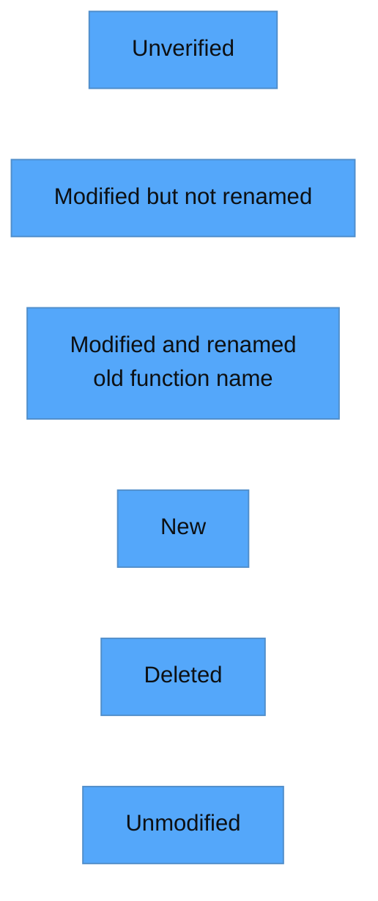

# Structure

This is a temporary directory for storing modules that have unresolved dependencies, during revisions to lower-level dependencies.

## Color codes




# `user.move` dependencies

```mermaid

%%{init: {'theme': 'base', 'themeVariables': {'primaryColor': '#ffa500', 'lineColor': '#c4dcf1', 'primaryTextColor': '#0d1013', 'secondaryColor': '#c4dcf1'}}}%%

flowchart LR

%% Class definitions

    classDef modified_but_not_renamed fill:#00fa9a %% Medium Spring Green
    classDef modified_and_renamed fill:#a020f0 %% Purple
    classDef new fill:#87cefa %% Light Sky Blue
    classDef deleted fill:#708090 %% Slate Gray
    classDef unmodified fill:#32cd32 %% Lime green

%% Node definitions
    Collateral[Collateral]
    MarketAccount[MarketAccount]
    MarketAccountInfo[MarketAccountInfo]
    MarketAccounts[MarketAccounts]
    register_market_accounts_entry[register_market_accounts_entry <br/> add_market_account]
    register_collateral_entry[register_collateral_entry]
    test_register_collateral_entry[test_register_collateral_entry]
    test_register_collateral_entry_already_registered[test_register_collateral_entry_already_registered]
    test_register_market_accounts_entry
    registry::scale_factor_from_market_info[registry::scale_factor_from_market_info]
    registry::coin_is_base_coin[registry::is_base_asset <br/> registry::coin_is_base_coin]
    test_register_market_accounts_entry_duplicate
    register_market_account[register_market_account]
    registry::get_verified_market_custodian_id[registry::get_verified_market_custodian_id]
    registry::is_registered[registry::is_registered]
    registry::market_info[registry::market_info]
    registry::is_valid_custodian_id[registry::is_registered_custodian_id <br/> registry::is_valid_custodian_id]
    test_register_market_account_invalid_custodian_id[test_register_market_account_invalid_custodian_id]
    registry::register_test_market_internal[registry::register_market_internal_multiple_test <br/> registry::register_test_market_internal]
    test_register_market_account_invalid_custodian_id[test_register_market_account_invalid_custodian_id]
    test_register_market_account_no_market[test_register_market_account_no_market]
    test_register_market_accounts_entry[test_register_market_accounts_entry]
    test_register_market_accounts_entry_already_registered[test_register_market_accounts_entry_already_registered]
    test_register_market_accounts[test_register_market_accounts]
    registry::get_generic_asset_transfer_custodian_id_test[    registry::get_generic_asset_transfer_custodian_id_test]
    get_market_account_info_test[get_market_account_info_test]
    borrow_market_account_test[borrow_market_account_test]
    has_collateral_test[has_collateral_test]
    collateral_value_test[collateral_value_test]
    asset_counts_test[asset_counts_test]
    borrow_coin_counts_mut[borrow_asset_counts_mut <br/> borrow_coin_counts_mut]
    deposit_collateral[deposit_asset <br/> deposit_collateral]
    exists_market_account[verify_market_account_exists <br/> exists_market_account]
    deposit_coins[deposit_coins]
    deposit_collateral_coinstore[deposit_from_coinstore <br/> deposit_collateral_coinstore]
    test_deposit_asset_no_market_accounts[test_deposit_asset_no_market_accounts]
    test_deposit_asset_wrong_market_account[test_deposit_asset_wrong_market_account]

%% Class definitions
    class Collateral modified_but_not_renamed;
    class MarketAccount modified_but_not_renamed;
    class MarketAccountInfo modified_but_not_renamed;
    class MarketAccounts modified_but_not_renamed;
    class register_market_accounts_entry modified_and_renamed;
    class register_collateral_entry modified_but_not_renamed;
    class test_register_collateral_entry modified_but_not_renamed;
    class test_register_collateral_entry_already_registered modified_but_not_renamed;
    class test_register_market_accounts_entry new;
    class test_register_market_accounts_entry_duplicate new;
    class registry::scale_factor_from_market_info deleted;
    class registry::coin_is_base_coin modified_and_renamed;
    class register_market_account modified_but_not_renamed;
    class registry::get_verified_market_custodian_id new;
    class registry::is_registered deleted;
    class registry::market_info deleted;
    class registry::is_valid_custodian_id modified_and_renamed;
    class test_register_market_account_invalid_custodian_id modified_but_not_renamed;
    class registry::register_test_market_internal modified_and_renamed;
    class test_register_market_account_invalid_custodian_id modified_but_not_renamed;
    class test_register_market_account_no_market deleted;
    class test_register_market_accounts_entry modified_but_not_renamed;
    class test_register_market_accounts_entry_already_registered modified_but_not_renamed;
    class test_register_market_accounts modified_but_not_renamed;
    class registry::get_generic_asset_transfer_custodian_id_test new;
    class get_market_account_info_test new;
    class borrow_market_account_test new;
    class has_collateral_test new;
    class collateral_value_test new;
    class asset_counts_test new;
    class borrow_coin_counts_mut modified_and_renamed;
    class deposit_collateral modified_and_renamed;
    class exists_market_account modified_and_renamed;
    class deposit_coins new;
    class deposit_collateral_coinstore modified_and_renamed;
    class test_deposit_asset_no_market_accounts new;
    class test_deposit_asset_wrong_market_account new;

%% Relationships involving new nodes

    test_deposit_asset_wrong_market_account --> deposit_collateral

    test_deposit_asset_no_market_accounts --> deposit_collateral

    deposit_coins --> deposit_collateral

    asset_counts_test --> MarketAccounts
    asset_counts_test --> borrow_market_account_test

    collateral_value_test --> Collateral
    collateral_value_test --> get_market_account_info_test

    has_collateral_test --> Collateral
    has_collateral_test --> get_market_account_info_test

    borrow_market_account_test --> MarketAccounts
    borrow_market_account_test --> get_market_account_info_test

    get_market_account_info_test --> registry::get_generic_asset_transfer_custodian_id_test

    test_register_market_accounts_entry --> MarketAccounts
    test_register_market_accounts_entry --> MarketAccountInfo
    test_register_market_accounts_entry --> register_market_accounts_entry

    test_register_market_accounts_entry_duplicate --> MarketAccounts
    test_register_market_accounts_entry_duplicate --> MarketAccountInfo
    test_register_market_accounts_entry_duplicate --> register_market_accounts_entry

    register_market_account --> registry::get_verified_market_custodian_id

%% Initial relationships

    deposit_collateral_coinstore --> deposit_coins
    deposit_collateral_coinstore --> Collateral
    deposit_collateral_coinstore --> MarketAccounts

    register_market_account --> Collateral
    register_market_account --> MarketAccounts
    register_market_account --> registry::market_info
    register_market_account --> registry::is_registered
    register_market_account --> registry::is_valid_custodian_id
    register_market_account --> register_market_accounts_entry
    register_market_account --> register_collateral_entry

    withdraw_collateral_coinstore --> Collateral
    withdraw_collateral_coinstore --> MarketAccounts
    withdraw_collateral_coinstore --> market_account_info
    withdraw_collateral_coinstore --> withdraw_collateral

    withdraw_collateral_user --> MarketAccountInfo
    withdraw_collateral_user --> Collateral
    withdraw_collateral_user --> MarketAccounts
    withdraw_collateral_user --> withdraw_collateral

    add_order_internal --> MarketAccounts
    add_order_internal --> market_account_info
    add_order_internal --> range_check_order_fills

    deposit_collateral --> MarketAccountInfo
    deposit_collateral --> Collateral
    deposit_collateral --> MarketAccounts
    deposit_collateral --> exists_market_account
    deposit_collateral --> borrow_coin_counts_mut

    fill_order_internal --> Collateral
    fill_order_internal --> MarketAccounts
    fill_order_internal --> fill_order_update_market_account
    fill_order_internal --> fill_order_route_collateral

    market_account_info --> MarketAccountInfo

    remove_order_internal --> MarketAccounts
    remove_order_internal --> market_account_info

    withdraw_collateral_custodian --> Collateral
    withdraw_collateral_custodian --> MarketAccounts
    withdraw_collateral_custodian --> MarketAccountInfo
    withdraw_collateral_custodian --> withdraw_collateral

    withdraw_collateral_internal --> Collateral
    withdraw_collateral_internal --> MarketAccounts
    withdraw_collateral_internal --> MarketAccountInfo
    withdraw_collateral_internal --> withdraw_collateral

    borrow_coin_counts_mut --> MarketAccountInfo
    borrow_coin_counts_mut --> MarketAccount
    borrow_coin_counts_mut --> registry::coin_is_base_coin

    exists_market_account --> MarketAccountInfo
    exists_market_account --> MarketAccounts

    fill_order_route_collateral --> MarketAccountInfo
    fill_order_route_collateral --> Collateral
    fill_order_route_collateral --> fill_order_route_collateral_single

    fill_order_route_collateral_single --> MarketAccountInfo
    fill_order_route_collateral_single --> Collateral

    fill_order_update_market_account --> MarketAccountInfo
    fill_order_update_market_account --> MarketAccounts

    register_collateral_entry --> MarketAccountInfo
    register_collateral_entry --> Collateral

    register_market_accounts_entry --> MarketAccountInfo
    register_market_accounts_entry --> MarketAccounts
    register_market_accounts_entry --> registry::scale_factor_from_market_info

    withdraw_collateral --> MarketAccountInfo
    withdraw_collateral --> Collateral
    withdraw_collateral --> MarketAccounts
    withdraw_collateral --> exists_market_account
    withdraw_collateral --> borrow_coin_counts_mut

    get_collateral_amount_test --> Collateral
    get_collateral_amount_test --> market_account_info

    get_collateral_amounts_test --> Collateral

    get_collateral_counts_test --> MarketAccounts
    get_collateral_counts_test --> registry::coin_is_base_coin

    get_collateral_state_test --> Collateral
    get_collateral_state_test --> MarketAccounts
    get_collateral_state_test --> get_collateral_amounts_test
    get_collateral_state_test --> get_collateral_counts_test

    has_order_test --> MarketAccounts
    has_order_test --> market_account_info

    order_base_parcels_test --> MarketAccounts
    order_base_parcels_test --> market_account_info

    test_add_order_internal_no_collateral --> Collateral
    test_add_order_internal_no_collateral --> MarketAccounts
    test_add_order_internal_no_collateral --> registry::register_test_market_internal
    test_add_order_internal_no_collateral --> register_market_account
    test_add_order_internal_no_collateral --> add_order_internal

    test_add_order_internal_no_market_account --> Collateral
    test_add_order_internal_no_market_account --> MarketAccounts
    test_add_order_internal_no_market_account --> registry::register_test_market_internal
    test_add_order_internal_no_market_account --> register_market_account
    test_add_order_internal_no_market_account --> add_order_internal

    test_add_order_internal_no_market_accounts --> MarketAccounts
    test_add_order_internal_no_market_accounts --> add_order_internal

    test_add_order_internal_not_enough_collateral --> Collateral
    test_add_order_internal_not_enough_collateral --> MarketAccounts
    test_add_order_internal_not_enough_collateral --> registry::register_test_market_internal
    test_add_order_internal_not_enough_collateral --> register_market_account
    test_add_order_internal_not_enough_collateral --> add_order_internal

    test_add_remove_order_internal_ask --> Collateral
    test_add_remove_order_internal_ask --> MarketAccounts
    test_add_remove_order_internal_ask --> registry::register_test_market_internal
    test_add_remove_order_internal_ask --> registry::scale_factor
    test_add_remove_order_internal_ask --> market_account_info
    test_add_remove_order_internal_ask --> register_market_account
    test_add_remove_order_internal_ask --> deposit_collateral
    test_add_remove_order_internal_ask --> add_order_internal
    test_add_remove_order_internal_ask --> remove_order_internal

    test_add_remove_order_internal_bid --> Collateral
    test_add_remove_order_internal_bid --> MarketAccounts
    test_add_remove_order_internal_bid --> registry::register_test_market_internal
    test_add_remove_order_internal_bid --> registry::scale_factor
    test_add_remove_order_internal_bid --> market_account_info
    test_add_remove_order_internal_bid --> register_market_account
    test_add_remove_order_internal_bid --> deposit_collateral
    test_add_remove_order_internal_bid --> add_order_internal
    test_add_remove_order_internal_bid --> remove_order_internal

    test_deposit_collateral_no_market_account --> Collateral
    test_deposit_collateral_no_market_account --> MarketAccounts
    test_deposit_collateral_no_market_account --> registry::market_info
    test_deposit_collateral_no_market_account --> coins::init_coin_types
    test_deposit_collateral_no_market_account --> deposit_collateral
    test_deposit_collateral_no_market_account --> coins::mint

    test_deposit_collateral --> Collateral
    test_deposit_collateral --> MarketAccounts
    test_deposit_collateral --> registry::register_test_market_internal
    test_deposit_collateral --> MarketAccountInfo
    test_deposit_collateral --> register_market_account
    test_deposit_collateral --> deposit_collateral
    test_deposit_collateral --> coin::register_for_test
    test_deposit_collateral --> coin::deposit
    test_deposit_collateral --> deposit_collateral_coinstore
    test_deposit_collateral --> get_collateral_counts_test

    test_fill_order_internal_ask --> Collateral
    test_fill_order_internal_ask --> MarketAccounts
    test_fill_order_internal_ask --> registry::register_test_market_internal
    test_fill_order_internal_ask --> registry::scale_factor
    test_fill_order_internal_ask --> market_account_info
    test_fill_order_internal_ask --> register_market_account
    test_fill_order_internal_ask --> deposit_collateral
    test_fill_order_internal_ask --> add_order_internal
    test_fill_order_internal_ask --> fill_order_internal
    test_fill_order_internal_ask --> order_base_parcels_test
    test_fill_order_internal_ask --> get_collateral_amounts_test

    test_fill_order_internal_bids --> Collateral
    test_fill_order_internal_bids --> MarketAccounts
    test_fill_order_internal_bids --> registry::register_test_market_internal
    test_fill_order_internal_bids --> registry::scale_factor
    test_fill_order_internal_bids --> market_account_info
    test_fill_order_internal_bids --> register_market_account
    test_fill_order_internal_bids --> deposit_collateral
    test_fill_order_internal_bids --> add_order_internal
    test_fill_order_internal_bids --> fill_order_internal
    test_fill_order_internal_bids --> order_base_parcels_test
    test_fill_order_internal_bids --> get_collateral_amounts_test

    test_range_check_order_fills --> range_check_order_fills

    test_range_check_order_fills_base_parcels_0 --> range_check_order_fills

    test_range_check_order_fills_overflow_base --> range_check_order_fills

    test_range_check_order_fills_overflow_quote --> range_check_order_fills

    test_range_check_order_fills_price_0 --> range_check_order_fills

    test_register_collateral_entry --> Collateral
    test_register_collateral_entry --> MarketAccountInfo
    test_register_collateral_entry --> register_collateral_entry

    test_register_collateral_entry_already_registered --> Collateral
    test_register_collateral_entry_already_registered --> MarketAccountInfo
    test_register_collateral_entry_already_registered --> register_collateral_entry

    test_register_market_account_invalid_custodian_id --> Collateral
    test_register_market_account_invalid_custodian_id --> MarketAccounts
    test_register_market_account_invalid_custodian_id --> registry::register_test_market_internal
    test_register_market_account_invalid_custodian_id --> register_market_account

    test_register_market_account_no_market --> Collateral
    test_register_market_account_no_market --> MarketAccounts
    test_register_market_account_no_market --> register_market_account

    test_register_market_accounts --> Collateral
    test_register_market_accounts --> MarketAccounts
    test_register_market_accounts --> registry::register_test_market_internal
    test_register_market_accounts --> registry::register_custodian_capability
    test_register_market_accounts --> register_market_account
    test_register_market_accounts --> market_account_info

    test_register_market_accounts_entry --> MarketAccounts
    test_register_market_accounts_entry --> MarketAccountInfo
    test_register_market_accounts_entry --> register_market_accounts_entry

    test_register_market_accounts_entry_already_registered --> MarketAccounts
    test_register_market_accounts_entry_already_registered --> MarketAccountInfo
    test_register_market_accounts_entry_already_registered --> register_market_accounts_entry

    test_withdraw_collateral_success --> Collateral
    test_withdraw_collateral_success --> MarketAccounts
    test_withdraw_collateral_success --> registry::register_test_market_internal
    test_withdraw_collateral_success --> register_market_account
    test_withdraw_collateral_success --> deposit_collateral
    test_withdraw_collateral_success --> withdraw_collateral_user
    test_withdraw_collateral_success --> withdraw_collateral_coinstore

    test_withdraw_collateral_custodian_unauthorized --> Collateral
    test_withdraw_collateral_custodian_unauthorized --> MarketAccounts
    test_withdraw_collateral_custodian_unauthorized --> MarketAccountInfo
    test_withdraw_collateral_custodian_unauthorized --> registry_get_custodian_capability
    test_withdraw_collateral_custodian_unauthorized --> withdraw_collateral_custodian
    test_withdraw_collateral_custodian_unauthorized --> registry::destroy_custodian_capability

    test_withdraw_collateral_no_market_account --> Collateral
    test_withdraw_collateral_no_market_account --> MarketAccounts
    test_withdraw_collateral_no_market_account --> MarketAccountInfo
    test_withdraw_collateral_no_market_account --> withdraw_collateral_user

    test_withdraw_collateral_not_enough_collateral --> Collateral
    test_withdraw_collateral_not_enough_collateral --> MarketAccounts
    test_withdraw_collateral_not_enough_collateral --> registry::register_test_market_internal
    test_withdraw_collateral_not_enough_collateral --> registry::register_custodian_capability
    test_withdraw_collateral_not_enough_collateral --> register_market_account
    test_withdraw_collateral_not_enough_collateral --> withdraw_collateral_custodian
    test_withdraw_collateral_not_enough_collateral --> registry::destroy_custodian_capability

    test_withdraw_collateral_user_override --> Collateral
    test_withdraw_collateral_user_override --> MarketAccounts
    test_withdraw_collateral_user_override --> MarketAccountInfo
    test_withdraw_collateral_user_override --> withdraw_collateral_user
```