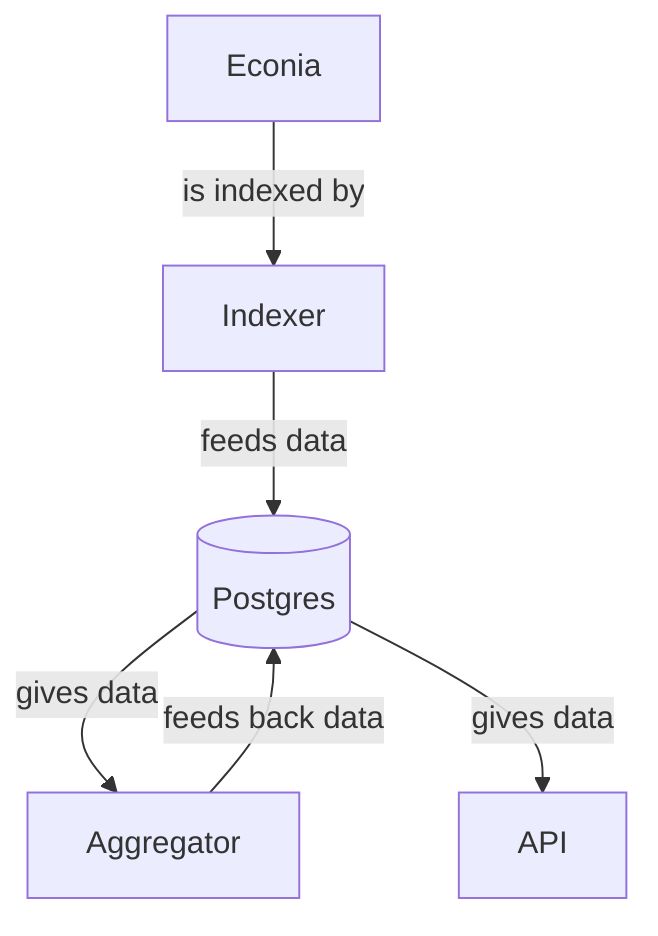

# Aggregator

This is the place where the Econia Aggregator lives.
Its purpose it to use different sources of data, process them, and output meaningful transformations of the data.

## Running

The easiest way to run the aggregator by itself is using `cargo run` (optionally, with `--release`).

The aggregator needs the following variables to run:

- database URL

You can pass the database URL either as a command line argument (see `cargo run -- --help`), or as an environment variable (`DATABASE_URL`).

It is also recommended that you set the Aptos network variable, either from the command line arguments or by setting the `APTOS_NETWORK` environment variable.

Lastly, you can add and remove pipelines using command line arguments or the `AGGREGATOR_{NO_DEFAULT,EXCLUDE,INCLUDE}` environment variables.
The syntax for `AGGREGATOR_{INCLUDE,EXCLUDE}` is `name_of_pipeline_1+name_of_pipeline_2+...`.
`AGGREGATOR_NO_DEFAULT` just can be set to `true` or `false` (it is `false` by default).

You can find a list of pipelines by running `cargo run -- --help`.

## Architecture

This is the flow of data going from the contract to the API.
You can see how the aggregator uses data and what role the aggregator plays in Econia's data service stack.

We now zoom into the aggregator's architecture.
There is a trait called `Pipeline`, which represents any type of data that is generated by the aggregator.
This trait has one main method, called `process_and_save`.
The role of this method is to process data using data that was generated since the last time this method was called and save the newly generated data.
The implementation of this method is open-ended:
it can pull data from a Postgres database, a Redis instance, or even a foreign API, and save it into any storage system.
`Pipeline` has two other important methods: `ready` and `poll_interval`.
`ready` returns true if the `process` method should be called now.
`poll_interval` returns the interval at which the `ready` method should be called.
The polling interval can be dynamic.
The aggregator periodically calls (using the result from `poll_interval` as the interval) the `ready` method, and executes `process_and_save` if it is ready to be executed.
Each struct implementing `Pipeline` can have multiple fields to store database addresses, API URLs, ready conditions, last indexed element, etc.

For example, a 1-minute candle stick data flow (simplified) would follow the following principles:

- `poll_interval` would return one minute.
- the aggregator would wait one minute
- `ready` then gets called and will return true.
- `process_and_save` would get all events between `truncate(now, 'minutes')` and `truncate(now - 1 minute, 'minutes')` and generate the candle sticks from this data.
  It would also update a field with the last time the function was executed.
  It will then insert that data in the desired storage system.

# SQLX

The aggregator uses [SQLx](https://github.com/launchbadge/sqlx/blob/main/README.md).
In order for the requests to be checked and the crate to be compiled when the database is offline, you have to run `cargo sqlx prepare --workspace` from the Rust root (`src/rust`) when updating or creating a request.
