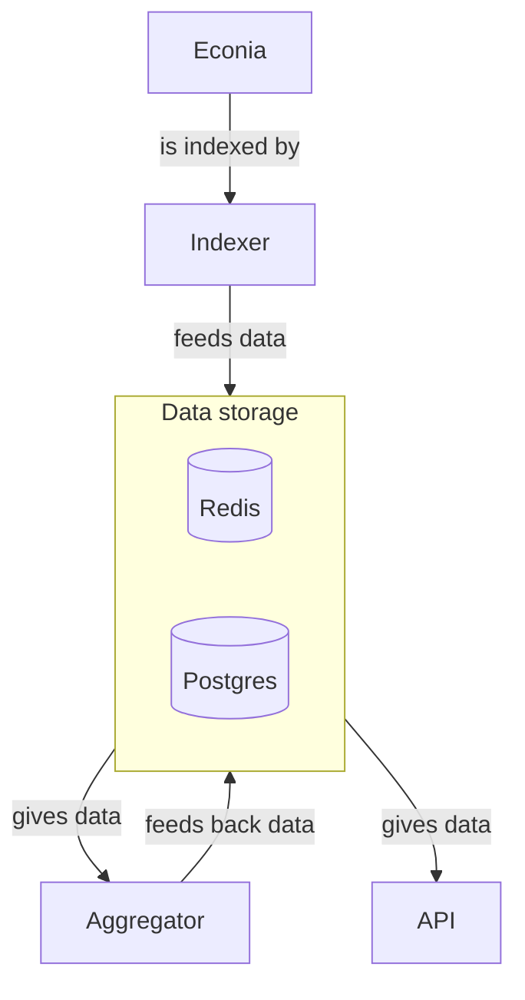

# Aggregator

This is the place where the Econia Aggregator lives.
Its purpose it to use different sources of data, process them, and output meaningful transformations of the data.

## Architecture

This is the flow of data going from the contract to the API.
You can see how the aggregator uses data what role the aggregator plays in Econia's data service stack.

We now zoom into the aggregator's architecture.
There is a trait called `Data`, which represents any type of data that is outputted by the aggregator.
This trait has one main method, called `process`.
This method will output a new value for the corresponding data, that can be then saved in any storage system.
The implementation of this method is open-ended:
it can pull data from a Postgres database, a Redis instance, or even a foreign API.
`Data` has two other important methods:
`ready` and `save`.
`ready` returns true if the `process` method should be called now.
`save` saves the data.
It is up to the person implementing `save` to decide where and how to save the data, or not to save it (leave the method empty).
The aggregator periodically calls the `ready` method, and executes `process` if it is ready to be executed.
After each call to `process`, the aggregator is going to call `save`.
Each struct implementing `Data` can have multiple fields to store database addresses, API URLs, ready conditions, last indexed element, etc.

For example, a 1-minute candle stick data flow would follow the following principles:

- `ready` would return true when `process` was not called in the last minute.
- `process` would get all events between `truncate(now, 'minutes')` and `truncate(now - 1 minute, 'minutes')` and generate the candle sticks from this data.
  It would also update a field with the last time the function was executed.
- `save` would take the output of `process` and save it in a database.
