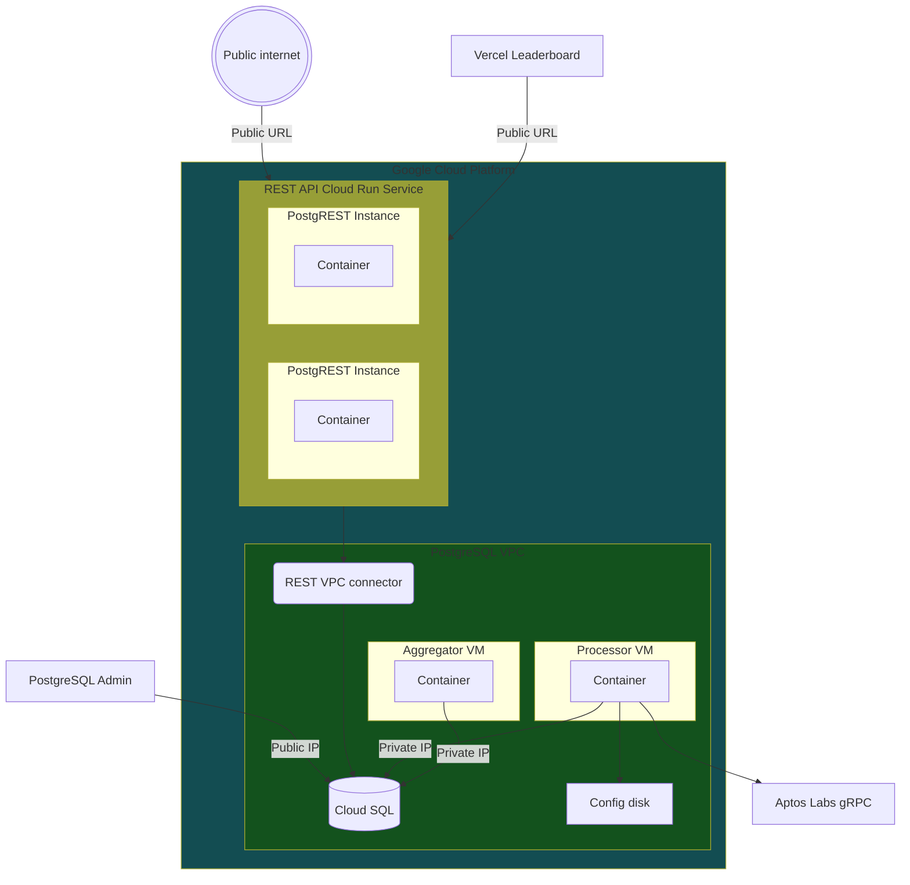

# Econia Testnet Competition Leaderboard Backend

## Layout

```mermaid
flowchart TB

subgraph gcp[Google Cloud Platform]
    subgraph rest-service[REST API Cloud Run Service]
        subgraph r-instance-1[PostgREST Instance]
            ri1c[Container]
        end
        subgraph r-instance-2[PostgREST Instance]
            ri2c[Container]
        end
    end
    rest-service --> rest-connector
    subgraph vpc[PostgreSQL VPC]
        aggregator-container-->|Private IP|cloud_pg
        processor-container-->|Private IP|cloud_pg
        subgraph processor-image[Processor VM]
            processor-container[Container]
        end
        subgraph aggregator-image[Aggregator VM]
            aggregator-container[Container]
        end
        processor-container-->processor_disk[Config disk]
        cloud_pg[(Cloud SQL)]
        rest-connector(REST VPC connector)--->cloud_pg
    end
end
processor-container-->grpc[Aptos Labs gRPC]
pg_admin[PostgreSQL Admin]-->|Public IP|cloud_pg
leaderboard[Vercel Leaderboard]-->|Public URL|rest-service
internet(((Public internet)))-->|Public URL|rest-service

classDef gcp fill:#134d52
classDef vpc fill:#13521d
classDef yellow fill:#979e37
class gcp gcp;
class vpc vpc;
class ws-service yellow;
class rest-service yellow;
```

For deployment instructions, see the [Econia docs site](https://econia.dev/).
